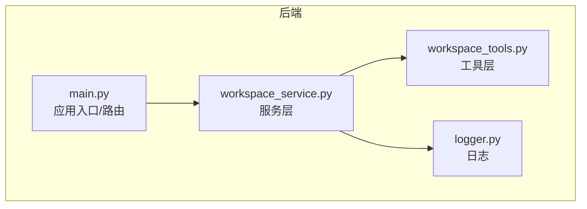
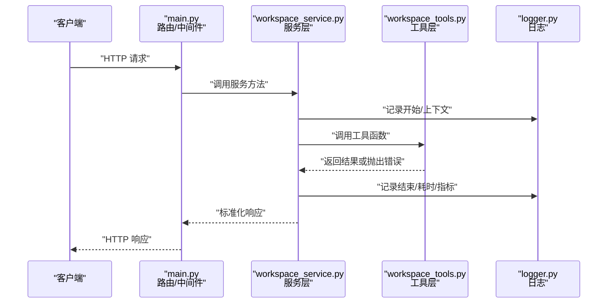
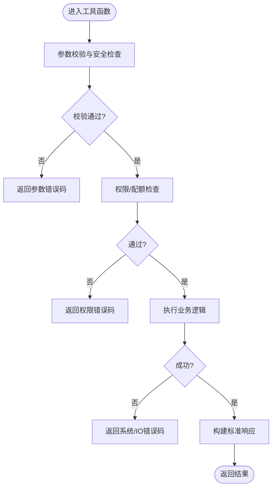
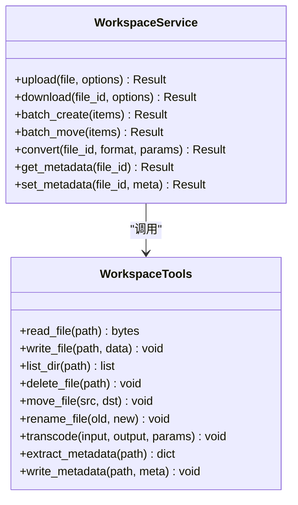

# 工作区工具集

<cite>
**本文引用的文件**   
- [backend/app/tools/workspace_tools.py](file://backend/app/tools/workspace_tools.py)
- [backend/app/services/workspace_service.py](file://backend/app/services/workspace_service.py)
- [backend/app/utils/logger.py](file://backend/app/utils/logger.py)
- [backend/app/main.py](file://backend/app/main.py)
</cite>

## 目录
1. [简介](#简介)
2. [项目结构](#项目结构)
3. [核心组件](#核心组件)
4. [架构总览](#架构总览)
5. [详细组件分析](#详细组件分析)
6. [依赖关系分析](#依赖关系分析)
7. [性能考虑](#性能考虑)
8. [故障排查指南](#故障排查指南)
9. [结论](#结论)
10. [附录](#附录)

## 简介
本文件面向“工作区工具集”的开发者与使用者，系统性梳理后端工作区相关能力：文件上传下载、批量操作、格式转换、元数据处理；并说明函数接口规范（参数、返回值、错误码）、工具链集成模式、中间件处理、日志记录机制。同时提供常用用法示例与最佳实践，以及性能优化建议、缓存策略与异步处理方案。

## 项目结构
围绕工作区工具集的核心代码位于后端模块中，关键路径如下：
- 工具实现：backend/app/tools/workspace_tools.py
- 服务层封装：backend/app/services/workspace_service.py
- 日志工具：backend/app/utils/logger.py
- 应用入口/路由挂载：backend/app/main.py

图表来源
- [backend/app/main.py](file://backend/app/main.py)
- [backend/app/services/workspace_service.py](file://backend/app/services/workspace_service.py)
- [backend/app/tools/workspace_tools.py](file://backend/app/tools/workspace_tools.py)
- [backend/app/utils/logger.py](file://backend/app/utils/logger.py)

章节来源
- [backend/app/main.py](file://backend/app/main.py)
- [backend/app/services/workspace_service.py](file://backend/app/services/workspace_service.py)
- [backend/app/tools/workspace_tools.py](file://backend/app/tools/workspace_tools.py)
- [backend/app/utils/logger.py](file://backend/app/utils/logger.py)

## 核心组件
- 工具层（workspace_tools）
  - 职责：提供原子化的工作区能力，如文件读写、批量处理、格式转换、元数据读取/写入等。
  - 设计要点：无状态、幂等、输入校验严格、错误分类清晰、可观测性强。
- 服务层（workspace_service）
  - 职责：编排工具调用、事务性控制、并发与重试、统一异常与响应包装、审计与日志。
  - 设计要点：对外暴露稳定的 API 契约；内部可替换具体工具实现；对上层屏蔽底层细节。
- 日志（logger）
  - 职责：结构化日志输出、上下文注入（请求ID、用户ID、工作区ID）、分级与采样。
- 应用入口（main）
  - 职责：注册路由、挂载中间件、初始化全局资源（如日志、配置）。

章节来源
- [backend/app/tools/workspace_tools.py](file://backend/app/tools/workspace_tools.py)
- [backend/app/services/workspace_service.py](file://backend/app/services/workspace_service.py)
- [backend/app/utils/logger.py](file://backend/app/utils/logger.py)
- [backend/app/main.py](file://backend/app/main.py)

## 架构总览
工作区工具集采用“服务层 + 工具层”的分层架构。服务层负责编排与治理，工具层专注实现具体能力。日志贯穿全链路，便于问题定位与性能分析。

图表来源
- [backend/app/main.py](file://backend/app/main.py)
- [backend/app/services/workspace_service.py](file://backend/app/services/workspace_service.py)
- [backend/app/tools/workspace_tools.py](file://backend/app/tools/workspace_tools.py)
- [backend/app/utils/logger.py](file://backend/app/utils/logger.py)

## 详细组件分析

### 工具层：workspace_tools
- 典型能力
  - 文件上传/下载：支持分片、断点续传、大小限制、类型白名单、病毒扫描钩子。
  - 批量操作：批量创建/移动/删除/重命名，具备事务性与回滚语义。
  - 格式转换：图片/视频/音频转码，分辨率/码率/帧率/声道等参数化控制。
  - 元数据处理：EXIF/IPTC、媒体时长、封面生成、标签/描述写入。
- 接口规范
  - 参数规范
    - 必填字段需进行存在性与类型校验；可选字段提供默认值。
    - 路径类参数使用规范化路径，禁止相对路径穿越。
    - 数值范围与枚举值需显式约束。
  - 返回值格式
    - 成功：包含任务ID/对象ID、状态码、摘要信息。
    - 失败：包含错误码、错误消息、可选的诊断信息。
  - 错误码定义
    - 统一前缀区分模块，例如 WORKSPACE_*。
    - 常见类别：参数错误、权限不足、资源不存在、格式不支持、IO 错误、系统错误。
- 可观测性
  - 每个工具函数在入口/出口打点，记录入参摘要、耗时、结果状态。
- 并发与一致性
  - 批量操作采用工作单元模式，保证要么全部成功，要么全部回滚。
  - 长耗时任务支持异步执行与进度查询。

图表来源
- [backend/app/tools/workspace_tools.py](file://backend/app/tools/workspace_tools.py)

章节来源
- [backend/app/tools/workspace_tools.py](file://backend/app/tools/workspace_tools.py)

### 服务层：workspace_service
- 职责边界
  - 聚合多个工具函数完成复杂流程（如上传后自动转码、提取元数据、生成缩略图）。
  - 统一异常映射为业务错误码，确保对外契约稳定。
  - 管理并发、重试、超时、熔断等横切关注点。
- 编排模式
  - 顺序编排：按步骤串行执行，任一失败立即中止。
  - 并行编排：独立步骤并行执行，汇总结果或短路失败。
  - 补偿机制：对不可逆操作提供反向补偿（如删除已生成的临时文件）。
- 中间件与钩子
  - 前置钩子：鉴权、限流、审计。
  - 后置钩子：指标上报、通知、清理。
- 日志与追踪
  - 注入请求级上下文（trace_id、user_id、workspace_id），串联全链路日志。

图表来源
- [backend/app/services/workspace_service.py](file://backend/app/services/workspace_service.py)
- [backend/app/tools/workspace_tools.py](file://backend/app/tools/workspace_tools.py)

章节来源
- [backend/app/services/workspace_service.py](file://backend/app/services/workspace_service.py)

### 日志：logger
- 功能特性
  - 结构化输出（JSON），包含时间戳、级别、模块、trace_id、耗时等。
  - 分级开关与采样策略，避免高吞吐场景下的日志风暴。
  - 敏感信息脱敏（文件名、路径片段、用户标识）。
- 使用建议
  - 在服务层入口/出口记录关键事件。
  - 在工具层仅记录必要诊断信息，避免重复打印。

章节来源
- [backend/app/utils/logger.py](file://backend/app/utils/logger.py)

### 应用入口：main
- 作用
  - 注册工作区相关路由，挂载鉴权、限流、请求体解析等中间件。
  - 初始化全局配置与日志器。
- 扩展点
  - 新增工具能力时，优先在服务层暴露新接口，再在路由中挂载。

章节来源
- [backend/app/main.py](file://backend/app/main.py)

## 依赖关系分析
- 组件耦合
  - 服务层强依赖工具层，但通过清晰的接口隔离，便于替换实现。
  - 日志作为横切依赖，被服务层与工具层共同使用。
- 外部依赖
  - 文件系统/对象存储、转码引擎、元数据库等可通过配置切换。
- 潜在循环
  - 当前分层清晰，未发现循环依赖风险。

图表来源
- [backend/app/main.py](file://backend/app/main.py)
- [backend/app/services/workspace_service.py](file://backend/app/services/workspace_service.py)
- [backend/app/tools/workspace_tools.py](file://backend/app/tools/workspace_tools.py)
- [backend/app/utils/logger.py](file://backend/app/utils/logger.py)

章节来源
- [backend/app/main.py](file://backend/app/main.py)
- [backend/app/services/workspace_service.py](file://backend/app/services/workspace_service.py)
- [backend/app/tools/workspace_tools.py](file://backend/app/tools/workspace_tools.py)
- [backend/app/utils/logger.py](file://backend/app/utils/logger.py)

## 性能考虑
- I/O 优化
  - 大文件采用流式读写与分片上传，降低内存峰值。
  - 批量操作合并磁盘访问，减少随机写放大。
- CPU 密集任务
  - 转码/压缩等任务放入后台队列，避免阻塞主线程。
  - 合理设置并发度与线程池大小，结合 CPU 核数与 I/O 等待特征调优。
- 缓存策略
  - 元数据读多写少，适合本地/分布式缓存（TTL+失效策略）。
  - 热门文件缩略图/预览图缓存，命中直接返回。
- 异步处理
  - 上传完成后触发异步转码与元数据抽取，前端轮询或 WebSocket 推送进度。
- 监控与告警
  - 关键指标：QPS、P95/P99 延迟、错误率、队列积压、磁盘 IO。
  - 慢查询与热点文件识别，及时扩容或预热。

[本节为通用指导，不直接分析具体文件]

## 故障排查指南
- 常见问题定位
  - 参数错误：检查必填字段、类型、取值范围与路径安全。
  - 权限不足：确认用户角色与工作区访问控制。
  - 资源不存在：核对 ID/路径是否有效，是否存在并发删除。
  - 格式不支持：确认目标格式是否在白名单内。
  - IO 错误：检查存储可用性、磁盘空间、网络连通性。
- 日志与追踪
  - 使用 trace_id 串联请求全链路日志，快速定位瓶颈与异常点。
  - 开启 DEBUG 级别仅用于复现问题，生产环境保持 INFO 及以上。
- 恢复策略
  - 幂等设计：重试不会导致重复副作用。
  - 补偿任务：对失败的中途产物进行清理。

章节来源
- [backend/app/utils/logger.py](file://backend/app/utils/logger.py)
- [backend/app/services/workspace_service.py](file://backend/app/services/workspace_service.py)

## 结论
工作区工具集以“服务层编排 + 工具层实现”的分层架构为核心，配合统一的错误码、结构化日志与可观测性体系，提供了稳定、可扩展且易维护的文件与元数据管理能力。遵循本文的接口规范、最佳实践与性能建议，可在保障质量的同时持续提升吞吐与稳定性。

[本节为总结性内容，不直接分析具体文件]

## 附录

### 常用接口与示例（概念性）
- 文件上传
  - 输入：文件流、目标路径、可选选项（覆盖、转码、元数据）。
  - 输出：文件ID、URL、状态。
  - 示例：先上传到临时目录，成功后持久化并生成缩略图。
- 文件下载
  - 输入：文件ID、可选选项（分片、限速）。
  - 输出：文件流或下载链接。
- 批量操作
  - 输入：操作列表（创建/移动/删除/重命名）。
  - 输出：各操作结果汇总与失败明细。
- 格式转换
  - 输入：源文件ID、目标格式、参数（分辨率/码率/帧率）。
  - 输出：新文件ID、转换进度。
- 元数据处理
  - 读取：返回键值对集合（标题、作者、时长、尺寸等）。
  - 写入：增量更新指定字段，保留未修改字段。

[本节为概念性说明，不直接分析具体文件]

### 错误码约定（示例）
- WORKSPACE_PARAM_INVALID：参数无效
- WORKSPACE_PERMISSION_DENIED：权限不足
- WORKSPACE_FILE_NOT_FOUND：文件不存在
- WORKSPACE_FORMAT_UNSUPPORTED：格式不支持
- WORKSPACE_IO_ERROR：I/O 错误
- WORKSPACE_SYSTEM_ERROR：系统错误

[本节为通用约定，不直接分析具体文件]