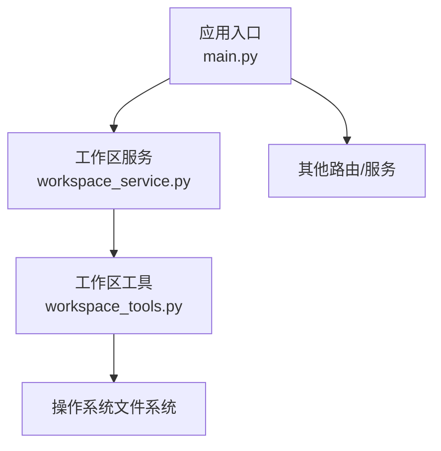
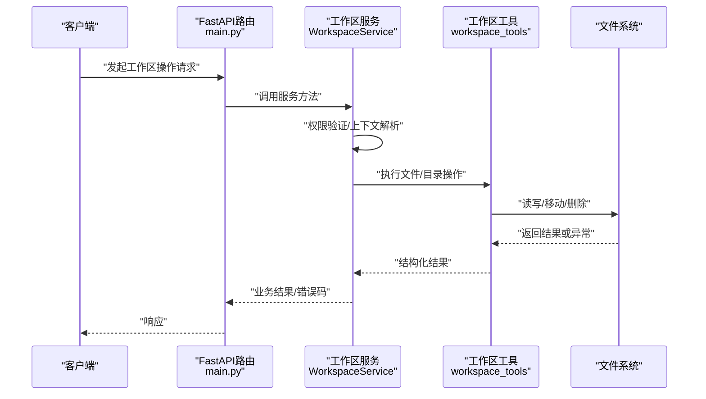
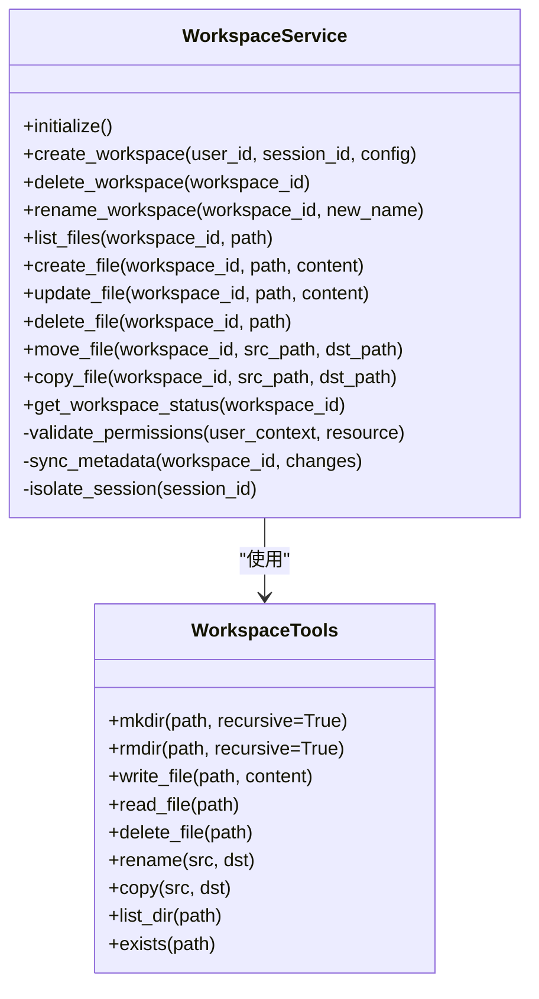
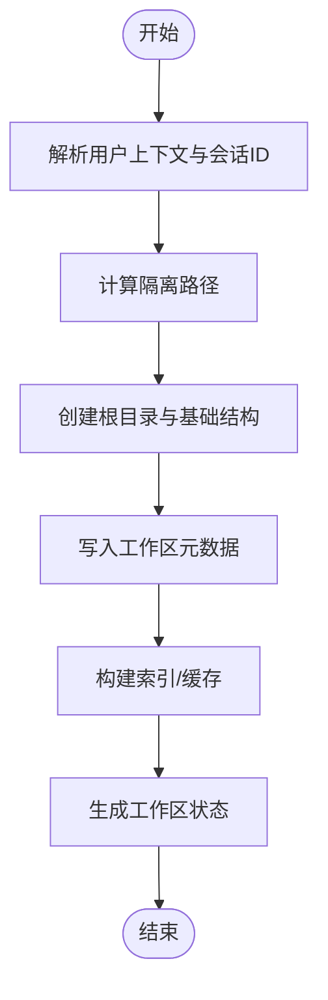
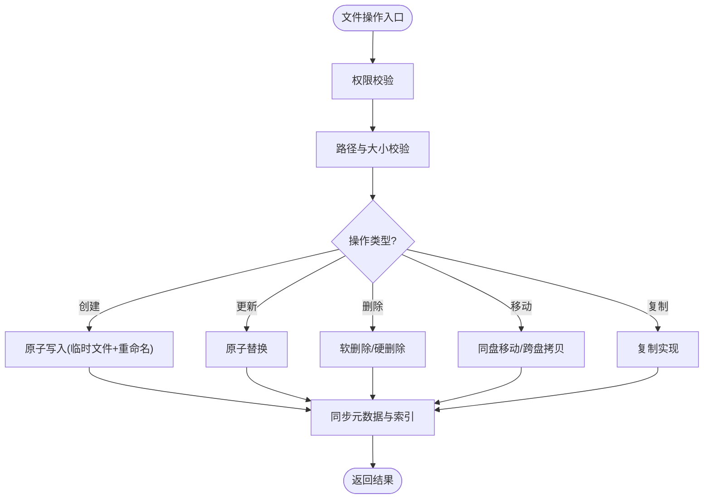
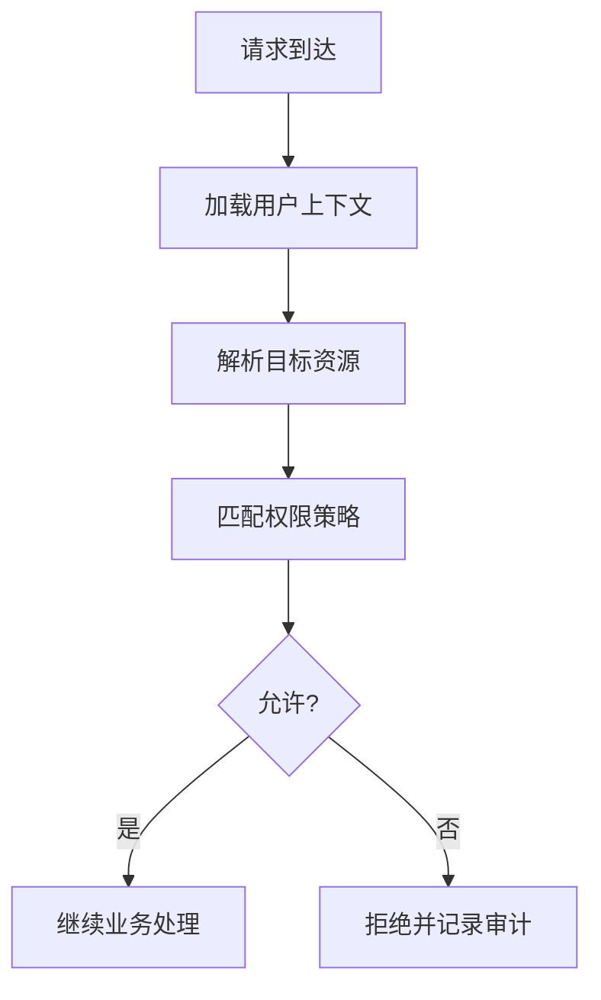
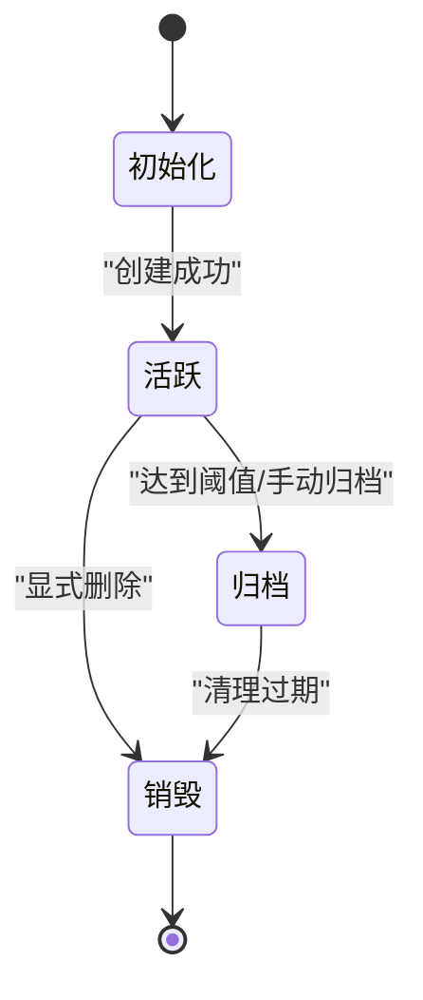
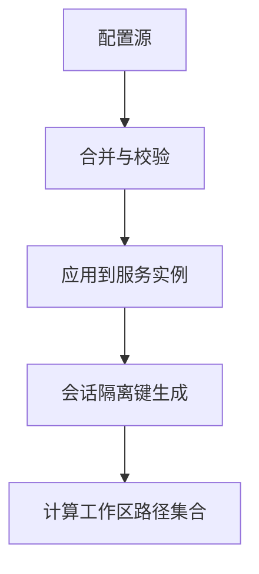
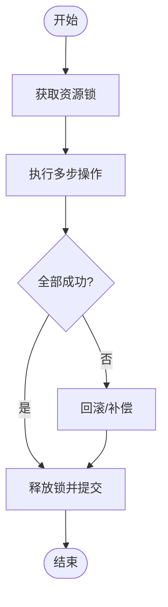

# 工作区核心服务

<cite>
**本文引用的文件**   
- [workspace_service.py](file://backend/app/services/workspace_service.py)
- [workspace_tools.py](file://backend/app/tools/workspace_tools.py)
- [main.py](file://backend/app/main.py)
</cite>

## 目录
1. [简介](#简介)
2. [项目结构](#项目结构)
3. [核心组件](#核心组件)
4. [架构总览](#架构总览)
5. [详细组件分析](#详细组件分析)
6. [依赖分析](#依赖分析)
7. [性能考虑](#性能考虑)
8. [故障排查指南](#故障排查指南)
9. [结论](#结论)
10. [附录：API参考](#附录api参考)

## 简介
本文件聚焦于后端工作区核心服务，围绕 WorkspaceService 类展开，系统阐述其职责边界、生命周期管理、状态同步与错误处理策略；并说明配置加载、用户上下文与会话隔离的实现要点。同时提供面向文件操作的API参考（创建、删除、重命名、移动等），以及并发访问控制、事务处理与数据一致性保证的设计思路与实践建议。

## 项目结构
本项目采用分层组织方式：
- 应用层入口：FastAPI 主程序负责路由注册与中间件装配
- 服务层：WorkspaceService 封装工作区业务逻辑
- 工具层：workspace_tools 提供文件系统操作能力
- 其他：LLM、Routers、Tools、Utils 等模块协同工作

图表来源
- [main.py](file://backend/app/main.py)
- [workspace_service.py](file://backend/app/services/workspace_service.py)
- [workspace_tools.py](file://backend/app/tools/workspace_tools.py)

章节来源
- [main.py](file://backend/app/main.py)
- [workspace_service.py](file://backend/app/services/workspace_service.py)
- [workspace_tools.py](file://backend/app/tools/workspace_tools.py)

## 核心组件
- WorkspaceService：工作区领域模型与服务编排中心，承担初始化、生命周期管理、权限校验、状态同步、错误处理与对外API暴露。
- workspace_tools：底层文件与目录操作封装，屏蔽IO细节并提供统一接口。
- main.py：将服务挂载到HTTP路由，承载请求进入点。

章节来源
- [workspace_service.py](file://backend/app/services/workspace_service.py)
- [workspace_tools.py](file://backend/app/tools/workspace_tools.py)
- [main.py](file://backend/app/main.py)

## 架构总览
工作区服务在应用中的位置与交互关系如下：

图表来源
- [main.py](file://backend/app/main.py)
- [workspace_service.py](file://backend/app/services/workspace_service.py)
- [workspace_tools.py](file://backend/app/tools/workspace_tools.py)

## 详细组件分析

### WorkspaceService 类设计
- 职责边界
  - 工作区初始化：根据配置与用户上下文准备根目录、元数据与必要结构
  - 文件操作编排：创建、删除、重命名、移动、列举、查询等
  - 目录管理：创建、删除、移动、复制、遍历、统计
  - 权限验证：基于用户上下文与角色/资源ACL进行访问控制
  - 状态同步：维护工作区索引/元数据与文件系统的一致性
  - 错误处理：统一异常捕获、分类与标准化响应
  - 会话隔离：按会话ID隔离工作区路径与临时空间
- 关键设计模式
  - 门面模式：对外暴露简洁API，内部协调工具层与外部依赖
  - 责任链：权限校验→参数校验→业务处理→结果落盘→状态同步
  - 策略：不同存储后端或权限策略可插拔替换

图表来源
- [workspace_service.py](file://backend/app/services/workspace_service.py)
- [workspace_tools.py](file://backend/app/tools/workspace_tools.py)

章节来源
- [workspace_service.py](file://backend/app/services/workspace_service.py)
- [workspace_tools.py](file://backend/app/tools/workspace_tools.py)

### 工作区初始化流程
- 输入：用户ID、会话ID、配置项（如根目录、配额、权限策略）
- 步骤：
  1) 解析与会话隔离路径
  2) 创建工作区根目录与子结构
  3) 写入初始元数据（名称、所有者、时间戳、版本）
  4) 建立索引与缓存
  5) 返回工作区标识与状态

图表来源
- [workspace_service.py](file://backend/app/services/workspace_service.py)

章节来源
- [workspace_service.py](file://backend/app/services/workspace_service.py)

### 文件操作与目录管理
- 文件操作
  - 创建：校验路径合法性与大小限制，原子写入，更新索引
  - 读取：权限校验，流式读取可选
  - 更新：先写临时文件再原子替换，避免损坏
  - 删除：软删除标记+定时清理，或硬删除（可配置）
  - 移动/复制：跨目录移动需考虑同盘优化与跨盘拷贝
- 目录管理
  - 创建/删除：递归选项与幂等性
  - 列举/搜索：支持分页与过滤
  - 统计：容量、数量、最后修改时间

图表来源
- [workspace_service.py](file://backend/app/services/workspace_service.py)
- [workspace_tools.py](file://backend/app/tools/workspace_tools.py)

章节来源
- [workspace_service.py](file://backend/app/services/workspace_service.py)
- [workspace_tools.py](file://backend/app/tools/workspace_tools.py)

### 权限验证机制
- 维度
  - 用户身份与角色：管理员/普通用户/只读
  - 资源范围：工作区级、目录级、文件级
  - 操作类型：读/写/删/移/改权限
- 策略
  - ACL表或规则引擎：匹配用户-资源-操作三元组
  - 白名单/黑名单：针对敏感路径或扩展名
  - 配额与速率限制：防止滥用
- 实现要点
  - 前置拦截：在业务逻辑前完成校验
  - 失败快速返回：减少无效IO
  - 审计日志：记录拒绝与成功事件

图表来源
- [workspace_service.py](file://backend/app/services/workspace_service.py)

章节来源
- [workspace_service.py](file://backend/app/services/workspace_service.py)

### 工作区生命周期与状态同步
- 生命周期阶段
  - 初始化 → 活跃 → 归档/冻结 → 销毁
- 状态同步
  - 变更事件驱动：文件增删改后触发增量同步
  - 一致性模型：最终一致，必要时提供强一致快照
  - 冲突解决：版本号/时间戳/ETag
- 监控与告警
  - 健康检查：磁盘空间、索引完整性
  - 指标：操作耗时、失败率、队列积压

图表来源
- [workspace_service.py](file://backend/app/services/workspace_service.py)

章节来源
- [workspace_service.py](file://backend/app/services/workspace_service.py)

### 配置加载与会话隔离
- 配置来源
  - 环境变量/配置文件/数据库
  - 默认值与覆盖优先级
- 会话隔离
  - 以会话ID为前缀的命名空间
  - 独立临时目录与锁文件
  - 资源配额与限流按会话粒度

图表来源
- [workspace_service.py](file://backend/app/services/workspace_service.py)

章节来源
- [workspace_service.py](file://backend/app/services/workspace_service.py)

### 并发访问控制、事务处理与一致性
- 并发控制
  - 细粒度锁：文件/目录级互斥
  - 乐观锁：基于版本号/时间戳的CAS
  - 读写分离：读多写少场景下提升吞吐
- 事务处理
  - 本地事务：同一工作区内多步操作的原子性
  - 补偿机制：失败回滚或重试
- 一致性保证
  - 元数据与索引的最终一致
  - 快照与校验和用于修复

图表来源
- [workspace_service.py](file://backend/app/services/workspace_service.py)

章节来源
- [workspace_service.py](file://backend/app/services/workspace_service.py)

### 错误处理策略
- 分类
  - 参数错误：非法路径、越界、重复命名
  - 权限错误：未授权、越权
  - IO错误：磁盘满、权限不足、路径不存在
  - 系统错误：超时、中断
- 策略
  - 统一异常包装与错误码
  - 幂等重试：对网络/IO可重试操作
  - 降级与熔断：保护下游与自身稳定性
  - 审计与追踪：关联请求ID与用户上下文

章节来源
- [workspace_service.py](file://backend/app/services/workspace_service.py)

## 依赖分析
- 直接依赖
  - WorkspaceService 依赖 workspace_tools 提供的文件系统能力
  - main.py 将服务挂载至HTTP路由，形成请求入口
- 间接依赖
  - 配置加载、日志、认证鉴权等横切关注点

图表来源
- [main.py](file://backend/app/main.py)
- [workspace_service.py](file://backend/app/services/workspace_service.py)
- [workspace_tools.py](file://backend/app/tools/workspace_tools.py)

章节来源
- [main.py](file://backend/app/main.py)
- [workspace_service.py](file://backend/app/services/workspace_service.py)
- [workspace_tools.py](file://backend/app/tools/workspace_tools.py)

## 性能考虑
- I/O优化
  - 批量操作与流式处理
  - 大文件分块读写与断点续传
  - 同盘移动优先，避免不必要拷贝
- 缓存与索引
  - 热点目录/文件缓存
  - 增量索引与异步重建
- 并发与锁
  - 读写锁分离
  - 细粒度锁降低竞争
- 资源治理
  - 配额与限流
  - 后台任务与队列削峰

[本节为通用指导，不直接分析具体文件]

## 故障排查指南
- 常见问题定位
  - 权限问题：检查用户上下文、ACL策略与路径权限
  - 路径错误：确认路径规范化与存在性
  - 磁盘空间：监控剩余空间与配额
  - 索引不一致：对比元数据与文件系统，触发重建
- 诊断手段
  - 开启详细日志与审计
  - 导出工作区快照与差异报告
  - 使用健康检查端点评估状态

章节来源
- [workspace_service.py](file://backend/app/services/workspace_service.py)

## 结论
WorkspaceService 作为工作区核心服务，通过清晰的职责划分、完善的权限与一致性保障、合理的并发与错误处理策略，提供了稳定可靠的工作区管理能力。配合 workspace_tools 的文件系统抽象与 main.py 的路由集成，形成了可扩展、可观测、易维护的服务体系。

[本节为总结，不直接分析具体文件]

## 附录：API参考
以下API由 WorkspaceService 暴露并通过 main.py 路由对外提供服务。实际HTTP端点定义位于路由层，此处描述服务侧接口契约。

- 工作区管理
  - 创建工作区
    - 输入：用户ID、会话ID、配置（名称、配额、策略）
    - 输出：工作区ID、初始状态
  - 删除工作区
    - 输入：工作区ID
    - 输出：删除结果
  - 重命名工作区
    - 输入：工作区ID、新名称
    - 输出：更新后的工作区信息
  - 获取工作区状态
    - 输入：工作区ID
    - 输出：状态、容量、文件数、最后更新时间

- 文件操作
  - 创建文件
    - 输入：工作区ID、相对路径、内容
    - 输出：文件元数据
  - 更新文件
    - 输入：工作区ID、相对路径、内容
    - 输出：文件元数据
  - 删除文件
    - 输入：工作区ID、相对路径
    - 输出：删除结果
  - 移动文件
    - 输入：工作区ID、源路径、目标路径
    - 输出：新路径元数据
  - 复制文件
    - 输入：工作区ID、源路径、目标路径
    - 输出：新路径元数据
  - 列举目录
    - 输入：工作区ID、目录路径、分页参数
    - 输出：条目列表与分页信息

- 目录管理
  - 创建目录
    - 输入：工作区ID、目录路径、是否递归
    - 输出：目录元数据
  - 删除目录
    - 输入：工作区ID、目录路径、是否递归
    - 输出：删除结果
  - 移动目录
    - 输入：工作区ID、源路径、目标路径
    - 输出：新路径元数据

- 权限与上下文
  - 权限校验
    - 输入：用户上下文、资源标识、操作类型
    - 输出：允许/拒绝及原因
  - 会话隔离
    - 输入：会话ID
    - 输出：隔离路径与临时空间

- 事务与一致性
  - 批量操作
    - 输入：操作序列
    - 输出：整体成功/失败与补偿信息
  - 一致性快照
    - 输入：工作区ID、时间点
    - 输出：快照ID与校验信息

章节来源
- [workspace_service.py](file://backend/app/services/workspace_service.py)
- [workspace_tools.py](file://backend/app/tools/workspace_tools.py)
- [main.py](file://backend/app/main.py)