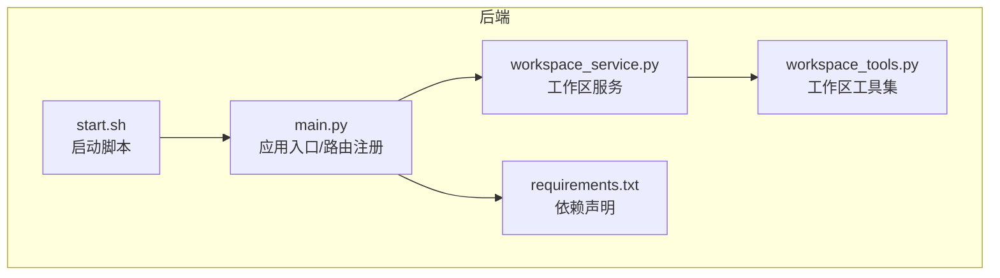
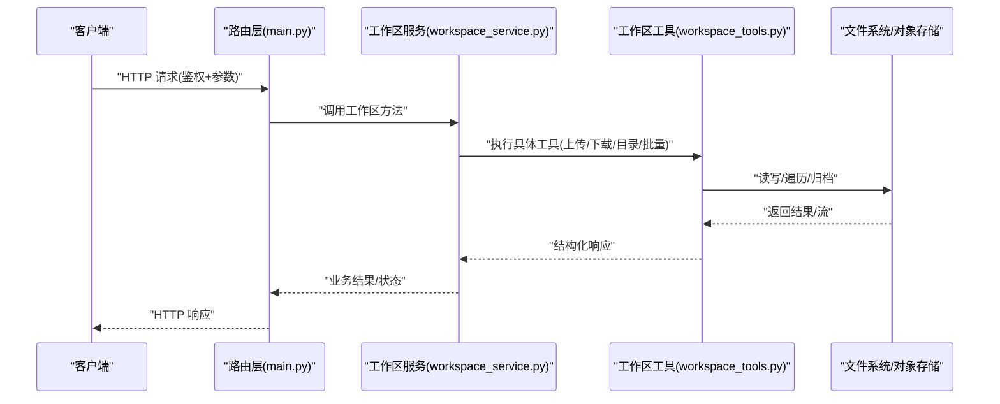
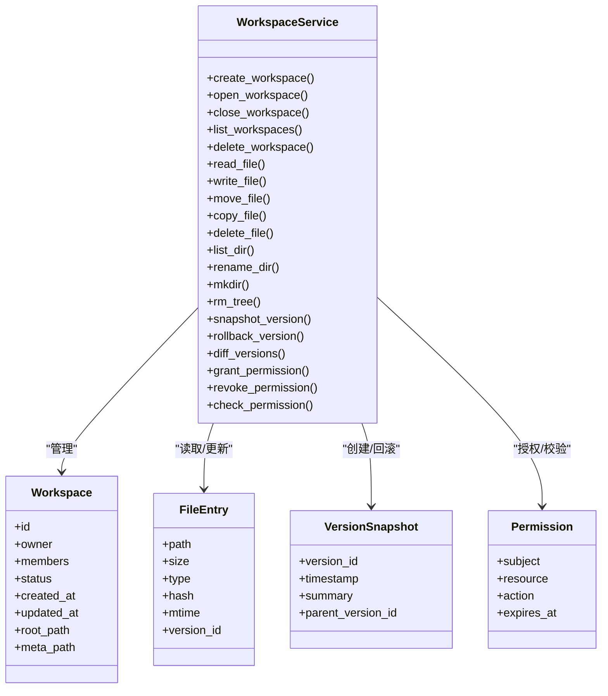
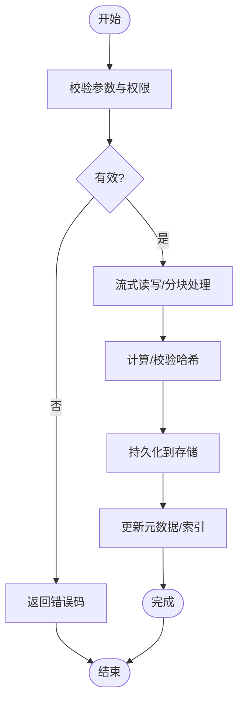
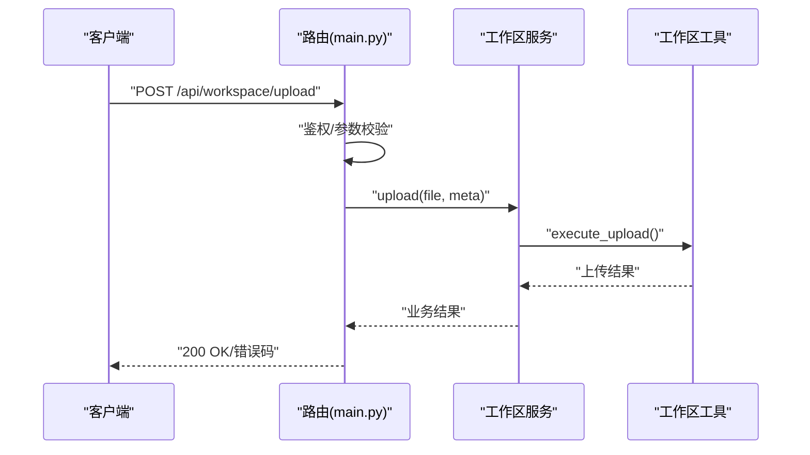
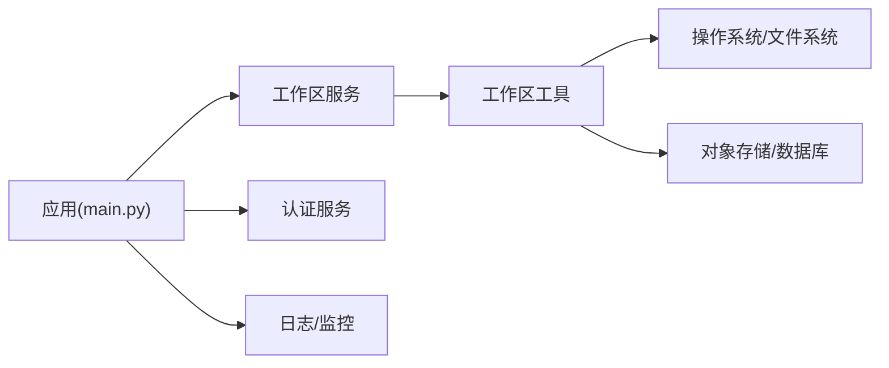

# 工作区管理

<cite>
**本文引用的文件**   
- [backend/app/services/workspace_service.py](file://backend/app/services/workspace_service.py)
- [backend/app/tools/workspace_tools.py](file://backend/app/tools/workspace_tools.py)
- [backend/app/main.py](file://backend/app/main.py)
- [backend/requirements.txt](file://backend/requirements.txt)
- [backend/start.sh](file://backend/start.sh)
</cite>

## 目录
1. [简介](#简介)
2. [项目结构](#项目结构)
3. [核心组件](#核心组件)
4. [架构总览](#架构总览)
5. [详细组件分析](#详细组件分析)
6. [依赖分析](#依赖分析)
7. [性能考虑](#性能考虑)
8. [故障排查指南](#故障排查指南)
9. [结论](#结论)
10. [附录](#附录)

## 简介
本文件面向“工作区管理系统”的构建与使用，围绕工作区服务的核心能力展开：文件系统操作、权限控制、版本管理、协作支持；并深入说明数据结构设计、文件组织策略与元数据管理。同时提供工具API接口（上传下载、目录操作、批量处理）、用户配置管理、工具链集成与工作流自动化方案，以及扩展指南（自定义工具开发、权限策略配置、备份恢复）和性能优化建议。

## 项目结构
后端采用分层架构：路由层暴露HTTP API，服务层封装业务逻辑（含工作区服务），工具层提供可被AI Agent调用的工具函数，启动脚本负责环境初始化与服务启动。

图示来源
- [backend/app/main.py](file://backend/app/main.py)
- [backend/app/services/workspace_service.py](file://backend/app/services/workspace_service.py)
- [backend/app/tools/workspace_tools.py](file://backend/app/tools/workspace_tools.py)
- [backend/requirements.txt](file://backend/requirements.txt)
- [backend/start.sh](file://backend/start.sh)

章节来源
- [backend/app/main.py](file://backend/app/main.py)
- [backend/app/services/workspace_service.py](file://backend/app/services/workspace_service.py)
- [backend/app/tools/workspace_tools.py](file://backend/app/tools/workspace_tools.py)
- [backend/requirements.txt](file://backend/requirements.txt)
- [backend/start.sh](file://backend/start.sh)

## 核心组件
- 工作区服务（WorkspaceService）
  - 职责：封装工作区的创建、打开、关闭、列表、删除等生命周期管理；协调文件读写、目录遍历、元数据维护；为上层路由与工具提供统一能力。
  - 关键能力：
    - 文件系统操作：读/写/移动/复制/删除文件与目录，递归遍历。
    - 权限控制：基于用户身份与角色进行访问控制，校验路径合法性与越权风险。
    - 版本管理：对关键文件建立快照或变更记录，支持回滚与差异查看。
    - 协作支持：并发安全、锁机制、冲突检测与合并提示。
- 工作区工具（WorkspaceTools）
  - 职责：对外暴露结构化工具方法，供Agent或前端调用，如上传、下载、批量处理、目录操作等。
  - 典型接口：
    - 文件上传/下载：分块上传、断点续传、完整性校验。
    - 目录操作：新建、重命名、移动、复制、删除、列出内容。
    - 批量处理：批量压缩、批量转换、批量清理。
- 路由与应用入口
  - 职责：将HTTP请求映射到服务方法，鉴权、参数校验、错误码标准化。
- 启动与环境
  - 职责：加载环境变量、初始化日志、挂载存储、启动服务进程。

章节来源
- [backend/app/services/workspace_service.py](file://backend/app/services/workspace_service.py)
- [backend/app/tools/workspace_tools.py](file://backend/app/tools/workspace_tools.py)
- [backend/app/main.py](file://backend/app/main.py)

## 架构总览
系统以“路由→服务→工具→存储”为主线，结合鉴权与日志审计形成闭环。

图示来源
- [backend/app/main.py](file://backend/app/main.py)
- [backend/app/services/workspace_service.py](file://backend/app/services/workspace_service.py)
- [backend/app/tools/workspace_tools.py](file://backend/app/tools/workspace_tools.py)

## 详细组件分析

### 工作区服务（WorkspaceService）
- 设计要点
  - 单例/上下文：确保同一工作区实例内共享状态（如锁、缓存）。
  - 路径规范化：统一分隔符、去重斜杠、相对路径解析，避免路径穿越。
  - 并发控制：针对同一工作区的路径级锁，防止竞态条件。
  - 元数据管理：工作区根目录下的隐藏元数据目录，记录版本、权限、标签等。
- 主要方法（概念性）
  - 工作区生命周期：create/open/close/list/delete
  - 文件操作：read/write/move/copy/delete
  - 目录操作：list_dir/rename/mkdir/rm_tree
  - 版本操作：snapshot/rollback/diff
  - 权限操作：grant/revoke/check
- 数据结构（概念模型）
  - Workspace：标识、所有者、成员、状态、创建/更新时间、根路径、元数据路径
  - FileEntry：路径、大小、类型、哈希、最后修改时间、版本ID
  - VersionSnapshot：版本ID、时间戳、变更摘要、父版本ID
  - Permission：主体、资源、动作、有效期
- 复杂度与性能
  - 目录遍历：O(N) N为条目数，建议分页与过滤
  - 大文件写入：流式写入，避免一次性加载内存
  - 版本快照：增量快照优先，减少IO与存储占用

图示来源
- [backend/app/services/workspace_service.py](file://backend/app/services/workspace_service.py)

章节来源
- [backend/app/services/workspace_service.py](file://backend/app/services/workspace_service.py)

### 工作区工具（WorkspaceTools）
- 设计要点
  - 幂等性：上传/下载/批量任务需支持重试与幂等键。
  - 流式处理：大文件传输采用分块与校验，避免OOM。
  - 错误分类：网络错误、权限错误、存储错误、格式错误分别处理。
- 典型工具方法（概念性）
  - upload(file, chunk_index, total_chunks, checksum)
  - download(file_path, offset, length)
  - list_entries(path, page, size, filter)
  - batch_compress(paths, output)
  - batch_convert(paths, format, options)
  - batch_cleanup(patterns, dry_run)
- 与服务的协作
  - 工具仅关注“怎么做”，服务负责“做什么”和“谁可以做”。

图示来源
- [backend/app/tools/workspace_tools.py](file://backend/app/tools/workspace_tools.py)

章节来源
- [backend/app/tools/workspace_tools.py](file://backend/app/tools/workspace_tools.py)

### 路由与应用入口（main.py）
- 职责
  - 注册工作区相关路由（如 /api/workspace/*）
  - 鉴权中间件：从请求头提取用户信息，注入上下文
  - 参数校验与异常捕获：统一错误响应格式
- 与服务和工具的交互
  - 路由方法调用服务层，服务再委托工具执行具体IO

图示来源
- [backend/app/main.py](file://backend/app/main.py)
- [backend/app/services/workspace_service.py](file://backend/app/services/workspace_service.py)
- [backend/app/tools/workspace_tools.py](file://backend/app/tools/workspace_tools.py)

章节来源
- [backend/app/main.py](file://backend/app/main.py)

## 依赖分析
- 运行时依赖
  - Python 标准库：os/pathlib/shutil/hashlib/json/logging/concurrent.futures
  - Web框架：FastAPI/Starlette（用于路由与异步）
  - 可选：对象存储SDK（如S3/OSS）、消息队列（Celery/RQ）
- 外部集成
  - 存储后端：本地磁盘或云对象存储
  - 认证服务：JWT/OAuth2
  - 监控与日志：Prometheus/Grafana、ELK

图示来源
- [backend/app/main.py](file://backend/app/main.py)
- [backend/app/services/workspace_service.py](file://backend/app/services/workspace_service.py)
- [backend/app/tools/workspace_tools.py](file://backend/app/tools/workspace_tools.py)
- [backend/requirements.txt](file://backend/requirements.txt)

章节来源
- [backend/requirements.txt](file://backend/requirements.txt)

## 性能考虑
- I/O优化
  - 大文件采用分块上传/下载与断点续传，降低失败成本
  - 目录遍历分页与过滤，避免一次性返回大量条目
  - 使用流式读写，避免内存峰值
- 并发与锁
  - 路径级细粒度锁，减少互斥范围
  - 读写分离：读多写少场景下引入只读副本或缓存
- 版本与快照
  - 增量快照与软链接，减少重复存储
  - 定期清理过期快照，保留策略可配置
- 存储与索引
  - 元数据与文件分离，索引表/文档库加速查询
  - 冷热分层：热数据近线存储，冷数据归档
- 批处理
  - 任务拆分与并行度控制，背压与限流
  - 失败重试与幂等键，保证最终一致性

[本节为通用指导，不直接分析具体文件]

## 故障排查指南
- 常见问题定位
  - 权限拒绝：检查用户角色与资源ACL，确认路径是否在工作区内
  - 上传失败：核对分块顺序、校验和、超时与重试策略
  - 目录为空：确认路径规范化与权限，检查索引是否一致
  - 版本回滚失败：检查快照存在性与依赖关系
- 诊断手段
  - 开启调试日志，记录关键步骤与耗时
  - 导出工作区元数据快照，对比差异
  - 使用健康检查端点验证存储连通性
- 恢复流程
  - 从最近快照恢复工作区状态
  - 重建索引与缓存
  - 通知受影响用户并提示冲突合并

章节来源
- [backend/app/services/workspace_service.py](file://backend/app/services/workspace_service.py)
- [backend/app/tools/workspace_tools.py](file://backend/app/tools/workspace_tools.py)

## 结论
工作区管理系统通过清晰的分层与职责划分，实现了稳定的文件操作、严格的权限控制、可靠的版本管理与可扩展的工具生态。配合合理的性能优化与运维实践，可在大规模文件场景下保持高可用与高性能。

[本节为总结性内容，不直接分析具体文件]

## 附录

### API接口参考（概念性）
- 工作区管理
  - POST /api/workspace/create
  - GET /api/workspace/list
  - GET /api/workspace/{id}/open
  - DELETE /api/workspace/{id}
- 文件操作
  - POST /api/workspace/{id}/files/upload
  - GET /api/workspace/{id}/files/download?path=...&offset=&length=
  - PUT /api/workspace/{id}/files/move
  - COPY /api/workspace/{id}/files/copy
  - DELETE /api/workspace/{id}/files
- 目录操作
  - GET /api/workspace/{id}/dirs/list?path=&page=&size=
  - POST /api/workspace/{id}/dirs/mkdir
  - PUT /api/workspace/{id}/dirs/rename
  - DELETE /api/workspace/{id}/dirs/rm_tree
- 版本管理
  - POST /api/workspace/{id}/versions/snapshot
  - POST /api/workspace/{id}/versions/rollback
  - GET /api/workspace/{id}/versions/diff
- 权限管理
  - POST /api/workspace/{id}/permissions/grant
  - DELETE /api/workspace/{id}/permissions/revoke
  - GET /api/workspace/{id}/permissions/check

[本节为概念性接口定义，不直接分析具体文件]

### 用户配置管理
- 配置文件位置：工作区根目录下 .workspace/config.json
- 关键字段
  - user：当前用户标识
  - permissions：用户权限集合
  - storage：存储后端选择与参数
  - versioning：版本策略（保留数量、快照频率）
  - collaboration：协作开关与冲突策略
- 动态更新：支持热重载，无需重启服务

[本节为概念性配置说明，不直接分析具体文件]

### 工具链集成与工作流自动化
- 工具发现：扫描 tools 目录，自动注册工具元数据
- 编排方式：通过工作流描述文件（YAML/JSON）组合多个工具
- 触发器：事件驱动（文件变更、定时任务、外部回调）
- 监控：任务执行日志、指标上报、告警规则

[本节为概念性集成说明，不直接分析具体文件]

### 扩展指南
- 自定义工具开发
  - 在 tools 目录新增模块，实现标准输入输出契约
  - 注册工具元数据（名称、描述、参数、权限要求）
  - 单元测试覆盖边界与错误路径
- 权限策略配置
  - 基于RBAC/ABAC混合模型，支持细粒度资源与动作
  - 策略文件集中管理，支持灰度发布
- 备份恢复方案
  - 全量快照：周期性打包工作区元数据与文件索引
  - 增量备份：基于版本快照的差异备份
  - 恢复演练：定期演练恢复流程，验证RTO/RPO

[本节为概念性扩展指南，不直接分析具体文件]

### 启动与环境
- 依赖安装：参考 requirements.txt
- 环境变量：配置存储、认证、日志级别等
- 启动命令：使用 start.sh 一键拉起服务

章节来源
- [backend/requirements.txt](file://backend/requirements.txt)
- [backend/start.sh](file://backend/start.sh)