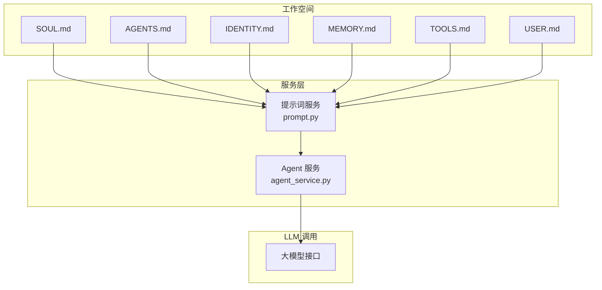
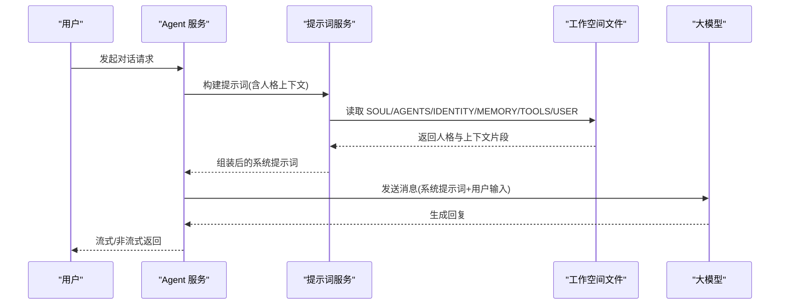
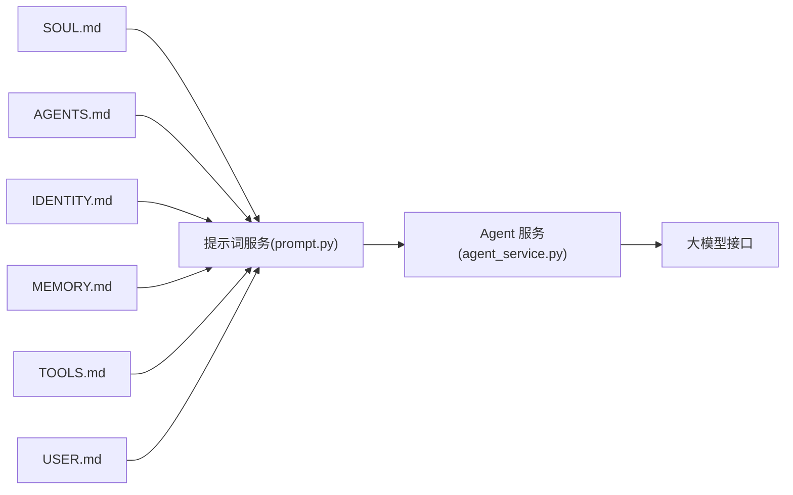

# 人格配置 (SOUL.md)

<cite>
**本文引用的文件**   
- [SOUL.md](file://backend/workspace/SOUL.md)
- [AGENTS.md](file://backend/workspace/AGENTS.md)
- [IDENTITY.md](file://backend/workspace/IDENTITY.md)
- [MEMORY.md](file://backend/workspace/MEMORY.md)
- [TOOLS.md](file://backend/workspace/TOOLS.md)
- [USER.md](file://backend/workspace/USER.md)
- [prompt.py](file://backend/app/services/prompt.py)
- [agent_service.py](file://backend/app/services/agent_service.py)
</cite>

## 目录
1. [简介](#简介)
2. [项目结构](#项目结构)
3. [核心组件](#核心组件)
4. [架构总览](#架构总览)
5. [详细组件分析](#详细组件分析)
6. [依赖分析](#依赖分析)
7. [性能考虑](#性能考虑)
8. [故障排查指南](#故障排查指南)
9. [结论](#结论)
10. [附录](#附录)

## 简介
本文件面向“人格配置”主题，聚焦于 SOUL.md 的结构与用途，解释 AI 助手的人格设定、行为准则、回复风格与情感表达等。同时给出人格特征定义、语气配置、专业领域限制的方法论，并提供不同人格类型的配置模板与使用场景说明。文档还涵盖人格切换机制、动态调整策略、A/B 测试支持思路，以及人格一致性检查、质量评估与反馈收集机制的落地建议。

## 项目结构
在仓库中，SOUL.md 位于后端工作区 workspace 下，与 AGENTS.md、IDENTITY.md、MEMORY.md、TOOLS.md、USER.md 共同构成“工作空间人格与上下文”体系。这些文件通常被服务层组装为提示词上下文，注入到 LLM 调用流程中，从而决定助手的“人格”。

图表来源
- [SOUL.md](file://backend/workspace/SOUL.md)
- [AGENTS.md](file://backend/workspace/AGENTS.md)
- [IDENTITY.md](file://backend/workspace/IDENTITY.md)
- [MEMORY.md](file://backend/workspace/MEMORY.md)
- [TOOLS.md](file://backend/workspace/TOOLS.md)
- [USER.md](file://backend/workspace/USER.md)
- [prompt.py](file://backend/app/services/prompt.py)
- [agent_service.py](file://backend/app/services/agent_service.py)

章节来源
- [SOUL.md](file://backend/workspace/SOUL.md)
- [AGENTS.md](file://backend/workspace/AGENTS.md)
- [IDENTITY.md](file://backend/workspace/IDENTITY.md)
- [MEMORY.md](file://backend/workspace/MEMORY.md)
- [TOOLS.md](file://backend/workspace/TOOLS.md)
- [USER.md](file://backend/workspace/USER.md)
- [prompt.py](file://backend/app/services/prompt.py)
- [agent_service.py](file://backend/app/services/agent_service.py)

## 核心组件
- SOUL.md：定义助手的核心人格（性格、价值观、行为准则、回复风格、情感表达、专业边界）。
- AGENTS.md：多角色/多代理协作规则（如主助手与子代理的职责划分、交接规范）。
- IDENTITY.md：身份与背景信息（名称、角色定位、能力范围、对外口径）。
- MEMORY.md：记忆与偏好（用户偏好、长期记忆、短期上下文约束）。
- TOOLS.md：工具清单与调用约定（可用工具、权限、输出格式）。
- USER.md：用户画像与关系（称呼、沟通偏好、敏感点）。

上述文件在服务层被组合为系统提示词，作为 LLM 调用的前置上下文，从而稳定输出“人格一致”的对话体验。

章节来源
- [SOUL.md](file://backend/workspace/SOUL.md)
- [AGENTS.md](file://backend/workspace/AGENTS.md)
- [IDENTITY.md](file://backend/workspace/IDENTITY.md)
- [MEMORY.md](file://backend/workspace/MEMORY.md)
- [TOOLS.md](file://backend/workspace/TOOLS.md)
- [USER.md](file://backend/workspace/USER.md)
- [prompt.py](file://backend/app/services/prompt.py)
- [agent_service.py](file://backend/app/services/agent_service.py)

## 架构总览
人格配置通过“工作空间文件 + 提示词服务 + Agent 服务”的链路注入到 LLM 调用中。典型流程如下：

图表来源
- [agent_service.py](file://backend/app/services/agent_service.py)
- [prompt.py](file://backend/app/services/prompt.py)
- [SOUL.md](file://backend/workspace/SOUL.md)
- [AGENTS.md](file://backend/workspace/AGENTS.md)
- [IDENTITY.md](file://backend/workspace/IDENTITY.md)
- [MEMORY.md](file://backend/workspace/MEMORY.md)
- [TOOLS.md](file://backend/workspace/TOOLS.md)
- [USER.md](file://backend/workspace/USER.md)

## 详细组件分析

### SOUL.md 结构与用途
- 目的：集中定义助手的人格基线，确保跨会话、跨任务的一致性。
- 常见模块：
  - 性格与价值观：友好/严谨/幽默/克制等基调；价值取向与底线。
  - 行为准则：安全合规、拒绝不当请求、隐私保护、事实优先。
  - 回复风格：长度控制、结构化程度、术语使用、语言习惯。
  - 情感表达：共情强度、鼓励方式、冲突处理。
  - 专业领域限制：擅长领域、不擅长的边界、转介策略。
  - 元指令：如何与其他工作空间文件协同（如引用 TOOLS.md 的工具清单）。
- 维护建议：
  - 版本化与变更日志：每次修改记录动机与影响面。
  - 最小可验证原则：新增条目需有对应用例或回归测试支撑。
  - 与 AGENTS/IDENTITY 解耦：避免重复定义，保持单一职责。

章节来源
- [SOUL.md](file://backend/workspace/SOUL.md)

### 人格特征定义与语气配置
- 人格特征维度：
  - 亲和度、严谨度、主动性、幽默感、权威感、同理心。
  - 每个维度建议采用“描述性语句 + 示例约束”的方式，避免模糊形容词。
- 语气配置项：
  - 称呼与称谓：正式/半正式/轻松。
  - 句式偏好：短句/长句、列表/段落、是否使用表情符号。
  - 术语密度：面向专家/面向大众的解释深度。
  - 错误处理语气：道歉、补救方案、引导下一步。
- 约束与例外：
  - 明确禁止的语气与词汇。
  - 特殊场景下的语气降级/升级规则（如紧急、敏感话题）。

章节来源
- [SOUL.md](file://backend/workspace/SOUL.md)

### 专业领域限制与转介策略
- 领域边界：
  - 明确“能做/不能做/需谨慎做”的清单。
  - 对高风险领域（医疗、法律、金融）默认保守回答并附加免责声明。
- 转介策略：
  - 何时转人工/外部专家。
  - 提供可操作的下一步建议与资源链接。
- 知识时效：
  - 标注知识截止时间与不确定性声明。

章节来源
- [SOUL.md](file://backend/workspace/SOUL.md)

### 人格类型模板与使用场景
以下为可直接复用的模板骨架（以占位符表示待填内容），适用于不同业务场景：

- 客服型助手
  - 目标：高效解决问题、提升满意度。
  - 风格：礼貌、简洁、步骤清晰。
  - 重点：情绪安抚、问题分类、快速转接。
- 学术/研究助手
  - 目标：高质量分析与文献梳理。
  - 风格：严谨、结构化、引用规范。
  - 重点：方法论透明、假设与局限说明。
- 创意/文案助手
  - 目标：激发创意、产出多样化文本。
  - 风格：灵活、富有想象力、适度幽默。
  - 重点：风格迁移、受众适配、迭代优化。
- 技术/工程助手
  - 目标：代码与架构辅助。
  - 风格：精确、可执行、注重最佳实践。
  - 重点：示例可运行、风险提示、版本兼容。

章节来源
- [SOUL.md](file://backend/workspace/SOUL.md)

### 人格切换机制与动态调整
- 切换入口：
  - 会话级：根据用户选择或路由策略加载不同人格包（SOUL 片段 + 相关上下文）。
  - 任务级：按任务类型动态注入特定人格片段（如“评测模式”、“教学辅导模式”）。
- 优先级与合并：
  - 全局人格 > 会话人格 > 任务人格。
  - 冲突时以更高优先级为准，低优先级仅补充。
- 动态调整：
  - 基于用户反馈实时微调语气与风格权重。
  - 结合 Memory 中的偏好进行个性化。
- 回滚与快照：
  - 每次切换保留快照，支持一键回滚。

章节来源
- [SOUL.md](file://backend/workspace/SOUL.md)
- [prompt.py](file://backend/app/services/prompt.py)
- [agent_service.py](file://backend/app/services/agent_service.py)

### A/B 测试支持
- 实验设计：
  - 将不同人格配置作为实验组，随机分流用户会话。
  - 指标：满意度、任务完成率、停留时长、负面反馈率。
- 数据埋点：
  - 记录会话级别的人格版本、提示词摘要哈希、关键交互事件。
- 统计与决策：
  - 显著性检验、置信区间、业务阈值。
  - 自动灰度放量与回滚策略。

章节来源
- [prompt.py](file://backend/app/services/prompt.py)
- [agent_service.py](file://backend/app/services/agent_service.py)

### 人格一致性检查与质量评估
- 一致性检查：
  - 规则校验：关键词/禁用词、语气阈值、长度与结构约束。
  - 语义对齐：与 SOUL 核心条款的相似度评分。
- 质量评估：
  - 自动化：可读性、连贯性、事实性抽检、工具调用正确性。
  - 人工：抽样评审、红队对抗、敏感话题压力测试。
- 反馈闭环：
  - 用户侧：点赞/点踩、评论、举报。
  - 运营侧：工单与复盘，驱动 SOUL 迭代。

章节来源
- [SOUL.md](file://backend/workspace/SOUL.md)
- [prompt.py](file://backend/app/services/prompt.py)
- [agent_service.py](file://backend/app/services/agent_service.py)

### 与其他工作空间文件的协同
- AGENTS.md：多代理协作时的角色分工与交接协议，避免人格冲突。
- IDENTITY.md：对外身份与能力边界，与 SOUL 的行为准则互补。
- MEMORY.md：用户偏好与历史交互，用于个性化语气与内容。
- TOOLS.md：工具清单与调用约定，确保人格在工具使用中保持一致。
- USER.md：用户画像，指导称呼、敏感点与沟通节奏。

章节来源
- [AGENTS.md](file://backend/workspace/AGENTS.md)
- [IDENTITY.md](file://backend/workspace/IDENTITY.md)
- [MEMORY.md](file://backend/workspace/MEMORY.md)
- [TOOLS.md](file://backend/workspace/TOOLS.md)
- [USER.md](file://backend/workspace/USER.md)

## 依赖分析
人格配置与服务层的依赖关系如下：

图表来源
- [SOUL.md](file://backend/workspace/SOUL.md)
- [AGENTS.md](file://backend/workspace/AGENTS.md)
- [IDENTITY.md](file://backend/workspace/IDENTITY.md)
- [MEMORY.md](file://backend/workspace/MEMORY.md)
- [TOOLS.md](file://backend/workspace/TOOLS.md)
- [USER.md](file://backend/workspace/USER.md)
- [prompt.py](file://backend/app/services/prompt.py)
- [agent_service.py](file://backend/app/services/agent_service.py)

章节来源
- [prompt.py](file://backend/app/services/prompt.py)
- [agent_service.py](file://backend/app/services/agent_service.py)

## 性能考虑
- 提示词体积控制：按需加载人格片段，避免过长系统提示导致延迟上升。
- 缓存策略：对静态人格片段与常用模板进行缓存。
- 流式输出：结合流式响应降低首字延迟。
- 降级策略：当人格校验失败时，回退到默认人格并记录告警。

[本节为通用性能建议，无需源码引用]

## 故障排查指南
- 常见问题
  - 人格不一致：检查人格优先级与合并逻辑，确认是否存在覆盖冲突。
  - 语气越界：启用禁用词与语气阈值检查，定位触发条件。
  - 工具调用异常：核对 TOOLS.md 的权限与格式约定。
- 诊断步骤
  - 查看会话级人格版本与提示词摘要哈希。
  - 对比 A/B 实验组的指标差异。
  - 回放关键交互，定位具体触发路径。
- 修复与回滚
  - 快速回滚至上一稳定人格版本。
  - 发布补丁后灰度放量，观察指标回归。

章节来源
- [prompt.py](file://backend/app/services/prompt.py)
- [agent_service.py](file://backend/app/services/agent_service.py)

## 结论
SOUL.md 是塑造 AI 助手“人格”的核心配置文件。通过将其与 AGENTS、IDENTITY、MEMORY、TOOLS、USER 等文件协同，并在提示词服务与 Agent 服务中进行统一装配，可实现稳定、可控、可演进的对话体验。配合 A/B 测试、一致性检查与反馈闭环，能够持续优化人格表现与业务效果。

[本节为总结性内容，无需源码引用]

## 附录
- 术语表
  - 人格：指代助手在对话中呈现的性格、语气、行为与价值取向的综合体。
  - 人格片段：可独立加载与组合的人格配置单元。
  - 提示词摘要哈希：用于唯一标识一次提示词组装结果的指纹。
- 参考文件
  - 工作空间人格相关文件：SOUL.md、AGENTS.md、IDENTITY.md、MEMORY.md、TOOLS.md、USER.md
  - 服务层实现：prompt.py、agent_service.py

[本节为补充信息，无需源码引用]