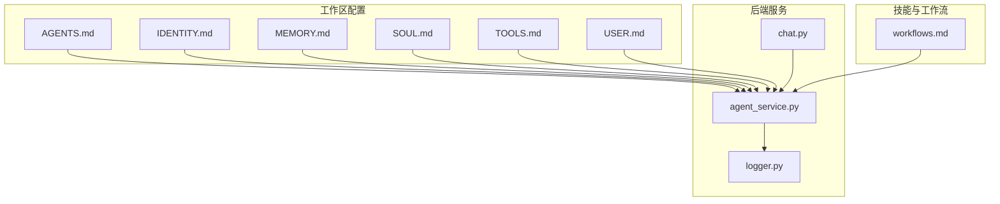
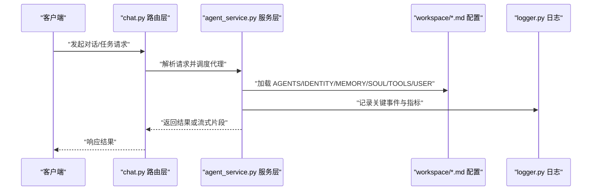
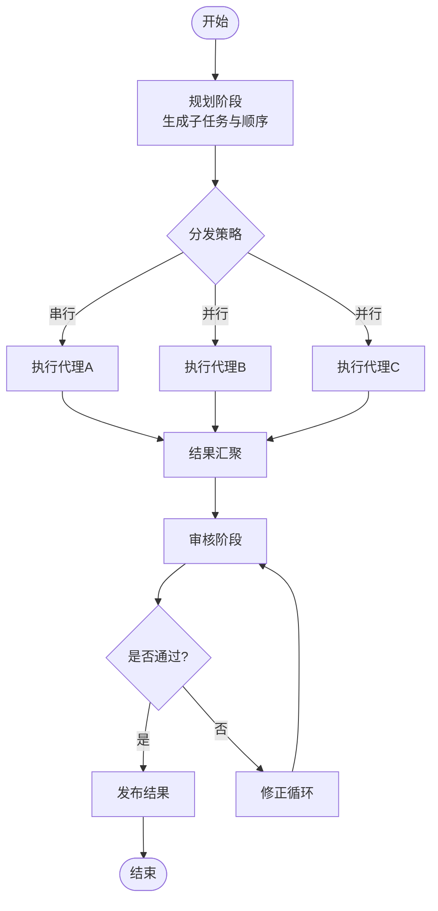
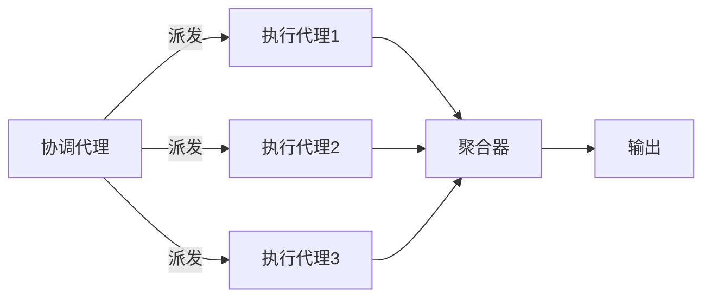
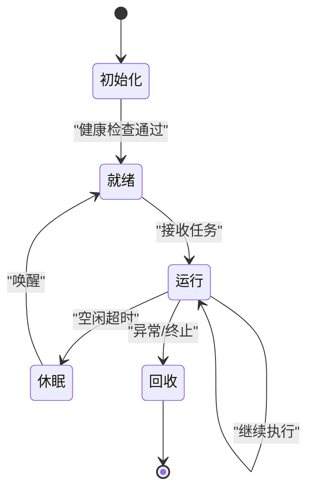
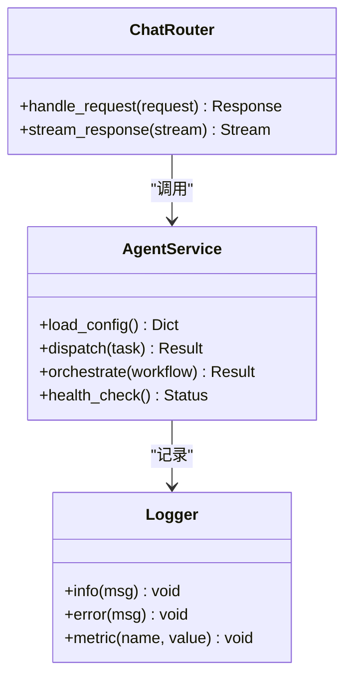
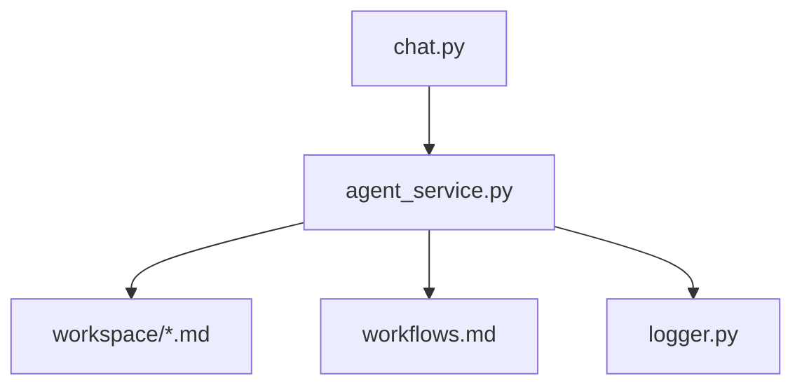

# 代理配置 (AGENTS.md)

<cite>
**本文引用的文件**   
- [backend/workspace/AGENTS.md](file://backend/workspace/AGENTS.md)
- [backend/workspace/IDENTITY.md](file://backend/workspace/IDENTITY.md)
- [backend/workspace/MEMORY.md](file://backend/workspace/MEMORY.md)
- [backend/workspace/SOUL.md](file://backend/workspace/SOUL.md)
- [backend/workspace/TOOLS.md](file://backend/workspace/TOOLS.md)
- [backend/workspace/USER.md](file://backend/workspace/USER.md)
- [backend/app/services/agent_service.py](file://backend/app/services/agent_service.py)
- [backend/app/routers/chat.py](file://backend/app/routers/chat.py)
- [backend/app/utils/logger.py](file://backend/app/utils/logger.py)
- [backend/skills/public/skill-creator/references/workflows.md](file://backend/skills/public/skill-creator/references/workflows.md)
</cite>

## 目录
1. [简介](#简介)
2. [项目结构](#项目结构)
3. [核心组件](#核心组件)
4. [架构总览](#架构总览)
5. [详细组件分析](#详细组件分析)
6. [依赖关系分析](#依赖关系分析)
7. [性能考虑](#性能考虑)
8. [故障排查指南](#故障排查指南)
9. [结论](#结论)
10. [附录](#附录)

## 简介
本文件面向“多智能体协作”的代理配置体系，围绕 AGENTS.md 的结构与用途展开，系统阐述以下主题：
- 代理定义、能力声明、资源限制与优先级设置
- 任务分配与工作流编排
- 多代理协作模式、负载均衡与故障转移策略
- 代理生命周期管理、状态同步与通信协议
- 代理性能监控、日志记录与调试工具使用指南

目标读者包括产品与运营人员（理解配置项）、后端工程师（实现与扩展）以及运维与SRE（监控与排障）。

## 项目结构
仓库中与代理配置相关的核心位置如下：
- 工作区配置：backend/workspace 下的 AGENTS.md 及若干上下文文档（IDENTITY、MEMORY、SOUL、TOOLS、USER）
- 服务层：backend/app/services/agent_service.py 提供代理编排与服务化能力
- 路由层：backend/app/routers/chat.py 暴露对话与代理交互接口
- 日志：backend/app/utils/logger.py 提供统一日志输出
- 技能与工作流参考：backend/skills/public/skill-creator/references/workflows.md 提供工作流编排参考

图表来源
- [backend/workspace/AGENTS.md](file://backend/workspace/AGENTS.md)
- [backend/workspace/IDENTITY.md](file://backend/workspace/IDENTITY.md)
- [backend/workspace/MEMORY.md](file://backend/workspace/MEMORY.md)
- [backend/workspace/SOUL.md](file://backend/workspace/SOUL.md)
- [backend/workspace/TOOLS.md](file://backend/workspace/TOOLS.md)
- [backend/workspace/USER.md](file://backend/workspace/USER.md)
- [backend/app/services/agent_service.py](file://backend/app/services/agent_service.py)
- [backend/app/routers/chat.py](file://backend/app/routers/chat.py)
- [backend/app/utils/logger.py](file://backend/app/utils/logger.py)
- [backend/skills/public/skill-creator/references/workflows.md](file://backend/skills/public/skill-creator/references/workflows.md)

章节来源
- [backend/workspace/AGENTS.md](file://backend/workspace/AGENTS.md)
- [backend/app/services/agent_service.py](file://backend/app/services/agent_service.py)
- [backend/app/routers/chat.py](file://backend/app/routers/chat.py)
- [backend/app/utils/logger.py](file://backend/app/utils/logger.py)
- [backend/skills/public/skill-creator/references/workflows.md](file://backend/skills/public/skill-creator/references/workflows.md)

## 核心组件
本节聚焦 AGENTS.md 的核心结构与关键配置维度。为避免泄露具体实现细节，本节以概念性说明为主，并给出对应文件的引用路径以便深入查阅。

- 代理定义
  - 目的：描述一个或多个 AI 代理的身份、职责边界、输入输出契约与可调用能力。
  - 建议字段：名称、类型、角色、能力清单、依赖工具、约束条件、版本。
  - 参考文件：[backend/workspace/AGENTS.md](file://backend/workspace/AGENTS.md)

- 身份与人格（Identity & Soul）
  - IDENTITY.md：定义代理的名称、风格、语气、行为准则与不可逾越的边界。
  - SOUL.md：定义价值观、原则、偏好与长期记忆要点。
  - 参考文件：
    - [backend/workspace/IDENTITY.md](file://backend/workspace/IDENTITY.md)
    - [backend/workspace/SOUL.md](file://backend/workspace/SOUL.md)

- 记忆与上下文（Memory）
  - MEMORY.md：短期会话记忆、长期记忆摘要、外部知识索引与更新策略。
  - 参考文件：[backend/workspace/MEMORY.md](file://backend/workspace/MEMORY.md)

- 工具与技能（Tools）
  - TOOLS.md：声明可用工具集、权限范围、参数约定、错误码与重试策略。
  - 参考文件：[backend/workspace/TOOLS.md](file://backend/workspace/TOOLS.md)

- 用户与环境（User）
  - USER.md：用户画像、偏好、访问控制与数据隔离策略。
  - 参考文件：[backend/workspace/USER.md](file://backend/workspace/USER.md)

- 工作流编排（Workflows）
  - workflows.md：提供多步骤流程模板、节点编排、分支与合并策略。
  - 参考文件：[backend/skills/public/skill-creator/references/workflows.md](file://backend/skills/public/skill-creator/references/workflows.md)

章节来源
- [backend/workspace/AGENTS.md](file://backend/workspace/AGENTS.md)
- [backend/workspace/IDENTITY.md](file://backend/workspace/IDENTITY.md)
- [backend/workspace/MEMORY.md](file://backend/workspace/MEMORY.md)
- [backend/workspace/SOUL.md](file://backend/workspace/SOUL.md)
- [backend/workspace/TOOLS.md](file://backend/workspace/TOOLS.md)
- [backend/workspace/USER.md](file://backend/workspace/USER.md)
- [backend/skills/public/skill-creator/references/workflows.md](file://backend/skills/public/skill-creator/references/workflows.md)

## 架构总览
下图展示从前端请求到代理执行与返回的整体流程，体现路由层、服务层、工作区配置与日志系统的协作关系。

图表来源
- [backend/app/routers/chat.py](file://backend/app/routers/chat.py)
- [backend/app/services/agent_service.py](file://backend/app/services/agent_service.py)
- [backend/workspace/AGENTS.md](file://backend/workspace/AGENTS.md)
- [backend/workspace/IDENTITY.md](file://backend/workspace/IDENTITY.md)
- [backend/workspace/MEMORY.md](file://backend/workspace/MEMORY.md)
- [backend/workspace/SOUL.md](file://backend/workspace/SOUL.md)
- [backend/workspace/TOOLS.md](file://backend/workspace/TOOLS.md)
- [backend/workspace/USER.md](file://backend/workspace/USER.md)
- [backend/app/utils/logger.py](file://backend/app/utils/logger.py)

## 详细组件分析

### 代理类型与能力声明
- 代理类型
  - 规划型：负责拆解复杂任务、生成子任务与顺序/并行计划。
  - 执行型：专注单一领域执行（如文本生成、图像生成、视频处理等）。
  - 协调型：在多代理间进行消息转发、冲突解决与结果聚合。
  - 审核型：对输出质量、合规性与安全性进行检查与修正。
- 能力声明
  - 在 AGENTS.md 中为每个代理列出能力清单、输入输出格式、依赖工具与失败回退策略。
  - 在 TOOLS.md 中明确工具权限、参数校验、错误码与重试上限。
- 资源限制
  - 建议为每个代理设定最大并发、超时时间、令牌/配额上限、内存与存储限额。
- 优先级设置
  - 通过优先级字段影响任务队列调度；高优先级代理优先获得计算资源。

章节来源
- [backend/workspace/AGENTS.md](file://backend/workspace/AGENTS.md)
- [backend/workspace/TOOLS.md](file://backend/workspace/TOOLS.md)

### 任务分配与工作流编排
- 任务分配
  - 基于任务特征（复杂度、所需工具、SLA）选择合适代理或代理组合。
  - 支持按区域/租户/用户维度进行隔离与配额控制。
- 工作流编排
  - 使用 workflows.md 中的模板定义节点、边、条件分支与汇聚点。
  - 支持串行、并行、扇出/扇入、重试与补偿机制。
- 示例流程
  - 规划→执行→审核→发布，其中审核失败触发修正循环。

图表来源
- [backend/skills/public/skill-creator/references/workflows.md](file://backend/skills/public/skill-creator/references/workflows.md)
- [backend/workspace/AGENTS.md](file://backend/workspace/AGENTS.md)

章节来源
- [backend/skills/public/skill-creator/references/workflows.md](file://backend/skills/public/skill-creator/references/workflows.md)
- [backend/workspace/AGENTS.md](file://backend/workspace/AGENTS.md)

### 多代理协作模式
- 主从模式
  - 一个协调代理作为主控，分派任务给多个执行代理，汇总结果。
- 流水线模式
  - 上游代理的输出作为下游代理的输入，形成链式处理。
- 网状协作
  - 代理之间互相调用，适合复杂推理与交叉验证场景。
- 负载均衡
  - 基于代理负载、延迟与成功率动态选择实例；结合健康检查与权重调整。
- 故障转移
  - 当某代理实例不可用或超时，自动切换到备用实例或降级策略。

图表来源
- [backend/workspace/AGENTS.md](file://backend/workspace/AGENTS.md)
- [backend/app/services/agent_service.py](file://backend/app/services/agent_service.py)

章节来源
- [backend/workspace/AGENTS.md](file://backend/workspace/AGENTS.md)
- [backend/app/services/agent_service.py](file://backend/app/services/agent_service.py)

### 代理生命周期管理与状态同步
- 生命周期阶段
  - 初始化：加载配置（AGENTS/IDENTITY/MEMORY/SOUL/TOOLS/USER），注册工具与能力。
  - 就绪：完成健康检查，加入调度池。
  - 运行：接收任务、执行、产出中间结果与最终结果。
  - 休眠/回收：空闲超时后释放资源，清理临时状态。
- 状态同步
  - 通过共享内存/消息总线/持久化存储同步关键状态（如任务进度、错误计数、资源占用）。
  - 保证一致性：采用幂等键与去重机制避免重复执行。
- 通信协议
  - 内部：推荐轻量消息协议（如 JSON-RPC 或自定义二进制），包含任务ID、版本、超时、重试次数。
  - 外部：REST/WebSocket 用于前端交互与流式输出。

图表来源
- [backend/app/services/agent_service.py](file://backend/app/services/agent_service.py)
- [backend/workspace/AGENTS.md](file://backend/workspace/AGENTS.md)

章节来源
- [backend/app/services/agent_service.py](file://backend/app/services/agent_service.py)
- [backend/workspace/AGENTS.md](file://backend/workspace/AGENTS.md)

### 配置项规范（AGENTS.md 结构建议）
为保证可读性与可维护性，建议在 AGENTS.md 中采用如下结构（字段仅为建议，具体以实际实现为准）：
- 全局
  - 版本、默认超时、默认重试、默认并发、日志级别
- 代理列表
  - 每个代理包含：
    - id、name、type、priority、timeout、max_concurrency、retry_policy
    - capabilities：能力清单（名称、描述、输入/输出、依赖工具）
    - tools：工具白名单与权限
    - resources：CPU/内存/存储/配额上限
    - routing：路由规则（按标签/区域/租户匹配）
    - fallback：降级策略与回退代理
    - observability：指标上报开关、采样率、告警阈值
- 工作流
  - 流程模板、节点定义、边与条件、重试与补偿
- 环境
  - 环境变量、密钥注入方式、外部服务地址

章节来源
- [backend/workspace/AGENTS.md](file://backend/workspace/AGENTS.md)

### 路由与服务集成
- 路由层（chat.py）
  - 负责鉴权、限流、请求解析与响应封装。
  - 将用户请求映射到对应的代理或服务方法。
- 服务层（agent_service.py）
  - 负责加载工作区配置、编排工作流、调度代理、聚合结果与错误处理。
  - 与日志系统对接，输出结构化日志与指标。

图表来源
- [backend/app/routers/chat.py](file://backend/app/routers/chat.py)
- [backend/app/services/agent_service.py](file://backend/app/services/agent_service.py)
- [backend/app/utils/logger.py](file://backend/app/utils/logger.py)

章节来源
- [backend/app/routers/chat.py](file://backend/app/routers/chat.py)
- [backend/app/services/agent_service.py](file://backend/app/services/agent_service.py)
- [backend/app/utils/logger.py](file://backend/app/utils/logger.py)

## 依赖关系分析
- 模块耦合
  - 路由层仅依赖服务层接口，保持低耦合。
  - 服务层依赖工作区配置与工作流参考，便于热更新与扩展。
- 外部依赖
  - 日志系统与指标采集（由 logger.py 提供基础能力）。
  - 外部工具与服务（在 TOOLS.md 中声明）。
- 潜在风险
  - 配置变更需配合灰度与回滚策略。
  - 工作流变更需进行回归测试与压测。

图表来源
- [backend/app/routers/chat.py](file://backend/app/routers/chat.py)
- [backend/app/services/agent_service.py](file://backend/app/services/agent_service.py)
- [backend/workspace/AGENTS.md](file://backend/workspace/AGENTS.md)
- [backend/skills/public/skill-creator/references/workflows.md](file://backend/skills/public/skill-creator/references/workflows.md)
- [backend/app/utils/logger.py](file://backend/app/utils/logger.py)

章节来源
- [backend/app/routers/chat.py](file://backend/app/routers/chat.py)
- [backend/app/services/agent_service.py](file://backend/app/services/agent_service.py)
- [backend/workspace/AGENTS.md](file://backend/workspace/AGENTS.md)
- [backend/skills/public/skill-creator/references/workflows.md](file://backend/skills/public/skill-creator/references/workflows.md)
- [backend/app/utils/logger.py](file://backend/app/utils/logger.py)

## 性能考虑
- 并发与吞吐
  - 合理设置 max_concurrency 与超时，避免雪崩。
  - 使用连接池与缓存减少外部调用开销。
- 资源隔离
  - 按代理或租户划分资源池，防止相互干扰。
- 观测与调优
  - 开启关键指标（QPS、P95/P99、错误率、重试率、资源利用率）。
  - 基于指标进行容量规划与弹性伸缩。

## 故障排查指南
- 常见问题定位
  - 配置加载失败：检查 AGENTS.md 语法与必填字段。
  - 工具调用失败：核对 TOOLS.md 权限与参数，查看错误码与重试策略。
  - 工作流卡住：检查节点依赖、超时与重试配置。
- 日志与调试
  - 使用 logger.py 输出结构化日志，包含请求ID、代理ID、节点ID与耗时。
  - 开启调试模式时提高日志级别，但注意生产环境关闭敏感信息。
- 快速恢复
  - 启用降级策略与回退代理，确保核心链路可用。
  - 对热点代理实施熔断与限流保护。

章节来源
- [backend/app/utils/logger.py](file://backend/app/utils/logger.py)
- [backend/workspace/AGENTS.md](file://backend/workspace/AGENTS.md)
- [backend/workspace/TOOLS.md](file://backend/workspace/TOOLS.md)

## 结论
通过统一的 AGENTS.md 配置与工作流编排，本项目实现了灵活的多代理协作体系。借助清晰的代理类型、能力声明、资源限制与优先级设置，结合负载均衡与故障转移策略，系统在可扩展性与稳定性方面具备良好基础。完善的日志与观测能力有助于持续优化与快速排障。

## 附录
- 相关参考文件
  - [backend/workspace/AGENTS.md](file://backend/workspace/AGENTS.md)
  - [backend/workspace/IDENTITY.md](file://backend/workspace/IDENTITY.md)
  - [backend/workspace/MEMORY.md](file://backend/workspace/MEMORY.md)
  - [backend/workspace/SOUL.md](file://backend/workspace/SOUL.md)
  - [backend/workspace/TOOLS.md](file://backend/workspace/TOOLS.md)
  - [backend/workspace/USER.md](file://backend/workspace/USER.md)
  - [backend/app/services/agent_service.py](file://backend/app/services/agent_service.py)
  - [backend/app/routers/chat.py](file://backend/app/routers/chat.py)
  - [backend/app/utils/logger.py](file://backend/app/utils/logger.py)
  - [backend/skills/public/skill-creator/references/workflows.md](file://backend/skills/public/skill-creator/references/workflows.md)