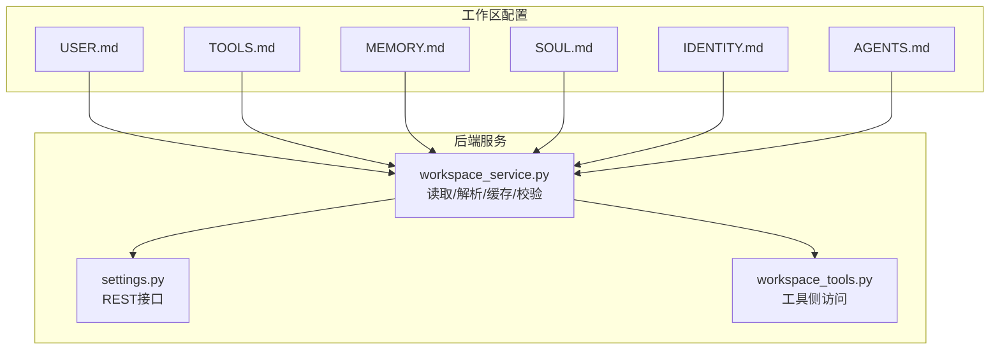
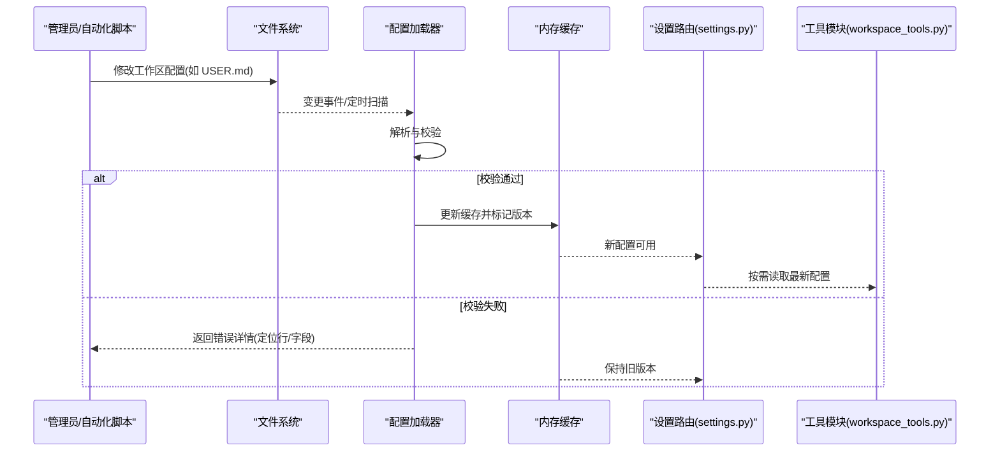
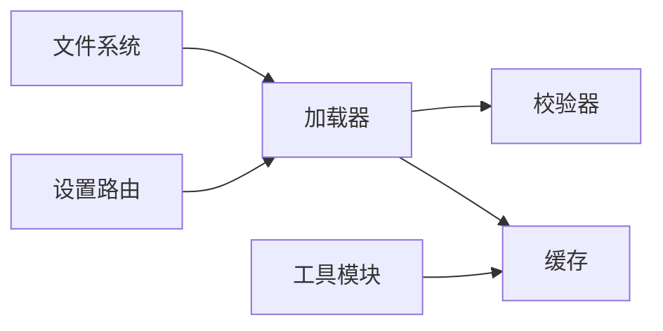

# 工作区配置管理

<cite>
**本文引用的文件**   
- [backend/workspace/USER.md](file://backend/workspace/USER.md)
- [backend/workspace/TOOLS.md](file://backend/workspace/TOOLS.md)
- [backend/workspace/MEMORY.md](file://backend/workspace/MEMORY.md)
- [backend/workspace/SOUL.md](file://backend/workspace/SOUL.md)
- [backend/workspace/IDENTITY.md](file://backend/workspace/IDENTITY.md)
- [backend/workspace/AGENTS.md](file://backend/workspace/AGENTS.md)
- [backend/app/services/workspace_service.py](file://backend/app/services/workspace_service.py)
- [backend/app/routers/settings.py](file://backend/app/routers/settings.py)
- [backend/app/tools/workspace_tools.py](file://backend/app/tools/workspace_tools.py)
- [backend/FRAMEWORK.md](file://backend/FRAMEWORK.md)
</cite>

## 目录
1. [简介](#简介)
2. [项目结构](#项目结构)
3. [核心组件](#核心组件)
4. [架构总览](#架构总览)
5. [详细组件分析](#详细组件分析)
6. [依赖关系分析](#依赖关系分析)
7. [性能考虑](#性能考虑)
8. [故障排查指南](#故障排查指南)
9. [结论](#结论)
10. [附录](#附录)

## 简介
本文件面向PolyStudio后端的工作区配置管理，系统性说明工作区配置文件结构与语义、加载与热重载机制、版本兼容策略、模板与自定义指南，以及安全策略（敏感信息加密与权限控制）。目标读者包括开发者、集成者与运维人员。

## 项目结构
工作区配置位于后端目录下的固定位置，采用“按职责分文件”的组织方式：
- USER.md：用户上下文与偏好
- TOOLS.md：工具能力与参数
- MEMORY.md：记忆与长期上下文
- SOUL.md：人格与风格约束
- IDENTITY.md：身份与角色定义
- AGENTS.md：代理编排与行为规则

图示来源
- [backend/workspace/USER.md](file://backend/workspace/USER.md)
- [backend/workspace/TOOLS.md](file://backend/workspace/TOOLS.md)
- [backend/workspace/MEMORY.md](file://backend/workspace/MEMORY.md)
- [backend/workspace/SOUL.md](file://backend/workspace/SOUL.md)
- [backend/workspace/IDENTITY.md](file://backend/workspace/IDENTITY.md)
- [backend/workspace/AGENTS.md](file://backend/workspace/AGENTS.md)
- [backend/app/services/workspace_service.py](file://backend/app/services/workspace_service.py)
- [backend/app/routers/settings.py](file://backend/app/routers/settings.py)
- [backend/app/tools/workspace_tools.py](file://backend/app/tools/workspace_tools.py)

章节来源
- [backend/workspace/USER.md](file://backend/workspace/USER.md)
- [backend/workspace/TOOLS.md](file://backend/workspace/TOOLS.md)
- [backend/workspace/MEMORY.md](file://backend/workspace/MEMORY.md)
- [backend/workspace/SOUL.md](file://backend/workspace/SOUL.md)
- [backend/workspace/IDENTITY.md](file://backend/workspace/IDENTITY.md)
- [backend/workspace/AGENTS.md](file://backend/workspace/AGENTS.md)
- [backend/app/services/workspace_service.py](file://backend/app/services/workspace_service.py)
- [backend/app/routers/settings.py](file://backend/app/routers/settings.py)
- [backend/app/tools/workspace_tools.py](file://backend/app/tools/workspace_tools.py)

## 核心组件
- 配置模型层：对每个工作区文件进行结构化解析与校验，提供统一的数据视图。
- 加载器：负责从磁盘读取、解析、合并与缓存配置；支持增量更新与热重载。
- 校验器：基于字段类型、取值范围与业务规则进行验证，并生成可诊断的错误信息。
- 存储与缓存：内存缓存+可选持久化快照，保证高并发读取性能。
- 接口层：暴露REST API用于查询、更新与触发重载。
- 工具侧访问：为其他工具模块提供只读或受控写入的访问点。

章节来源
- [backend/app/services/workspace_service.py](file://backend/app/services/workspace_service.py)
- [backend/app/routers/settings.py](file://backend/app/routers/settings.py)
- [backend/app/tools/workspace_tools.py](file://backend/app/tools/workspace_tools.py)

## 架构总览
下图展示配置从磁盘到运行时服务的完整路径，以及热重载与缓存失效流程。

图示来源
- [backend/app/services/workspace_service.py](file://backend/app/services/workspace_service.py)
- [backend/app/routers/settings.py](file://backend/app/routers/settings.py)
- [backend/app/tools/workspace_tools.py](file://backend/app/tools/workspace_tools.py)

## 详细组件分析

### 配置模型与语法规范
- 通用约定
  - 编码：UTF-8
  - 分隔：Markdown 标题与列表为主，键值以“键: 值”形式出现
  - 注释：使用标准 Markdown 注释或行尾注释
  - 版本：建议在文件头部声明版本字段，便于向后兼容
- 字段命名
  - 小写英文字母、数字与下划线
  - 避免保留字与系统关键字
- 数据类型
  - 字符串、布尔、整数、浮点数、枚举、数组、对象
  - 日期时间采用 ISO 8601
- 校验规则
  - 必填字段检查
  - 取值范围与格式校验（邮箱、URL、正则）
  - 互斥/依赖字段组合校验
  - 循环引用检测（针对跨文件引用）

章节来源
- [backend/workspace/USER.md](file://backend/workspace/USER.md)
- [backend/workspace/TOOLS.md](file://backend/workspace/TOOLS.md)
- [backend/workspace/MEMORY.md](file://backend/workspace/MEMORY.md)
- [backend/workspace/SOUL.md](file://backend/workspace/SOUL.md)
- [backend/workspace/IDENTITY.md](file://backend/workspace/IDENTITY.md)
- [backend/workspace/AGENTS.md](file://backend/workspace/AGENTS.md)

### 各配置文件详解

#### USER.md（用户配置）
- 用途：描述用户身份、偏好、语言、时区、主题等个性化信息
- 典型字段
  - 基本信息：姓名、昵称、头像URL
  - 偏好：语言、时区、度量单位、内容过滤级别
  - 会话：默认提示词片段、历史长度上限
- 语法要点
  - 使用二级标题分区，键值成对出现
  - 布尔型使用 true/false
  - 枚举值需来自白名单
- 校验规则
  - 必填：至少包含一个标识字段
  - 格式：URL、邮箱、ISO 8601 日期
  - 范围：数值区间限制

章节来源
- [backend/workspace/USER.md](file://backend/workspace/USER.md)

#### TOOLS.md（工具配置）
- 用途：声明可用工具、启用开关、参数模板、调用配额与超时
- 典型字段
  - 工具清单：名称、版本、是否启用、入口类/函数
  - 参数模板：默认参数、必填项、取值范围
  - 资源配额：QPS、并发、超时、重试次数
  - 密钥引用：通过占位符引用外部密钥管理器
- 语法要点
  - 使用有序/无序列表组织工具条目
  - 参数嵌套使用缩进表示层级
- 校验规则
  - 工具名唯一性
  - 必填参数完整性
  - 配额与超时为正数
  - 密钥占位符存在且可解析

章节来源
- [backend/workspace/TOOLS.md](file://backend/workspace/TOOLS.md)

#### MEMORY.md（记忆配置）
- 用途：定义记忆存储策略、摘要策略、检索窗口与清理策略
- 典型字段
  - 存储：向量库/本地文件/混合
  - 索引：维度、相似度阈值、过期时间
  - 摘要：触发条件、最大长度、压缩算法
  - 清理：TTL、回收周期、保留条数
- 语法要点
  - 使用键值与子节分层
  - 时间单位统一为秒或毫秒，并在文档中明确
- 校验规则
  - 数值非负
  - 阈值在合理区间
  - 存储后端与驱动匹配

章节来源
- [backend/workspace/MEMORY.md](file://backend/workspace/MEMORY.md)

#### SOUL.md（人格配置）
- 用途：定义AI人格、语气、风格、边界与拒绝策略
- 典型字段
  - 人格标签：专业度、友好度、幽默度
  - 风格：句式长度、术语密度、示例偏好
  - 边界：禁止话题、敏感词替换策略
- 语法要点
  - 使用短句与要点式表达
  - 可通过优先级标记影响权重
- 校验规则
  - 标签在白名单内
  - 权重总和不超过上限

章节来源
- [backend/workspace/SOUL.md](file://backend/workspace/SOUL.md)

#### IDENTITY.md（身份配置）
- 用途：定义系统/代理的身份、角色、权限范围与可见域
- 典型字段
  - 身份：名称、版本、所属团队
  - 角色：管理员、编辑者、访客
  - 权限：读写范围、数据隔离域
- 语法要点
  - 使用层级列表表达继承关系
  - 权限使用最小授权原则
- 校验规则
  - 角色与权限映射合法
  - 无循环继承

章节来源
- [backend/workspace/IDENTITY.md](file://backend/workspace/IDENTITY.md)

#### AGENTS.md（代理配置）
- 用途：编排多个代理的行为、协作模式、任务分配与回退策略
- 典型字段
  - 代理清单：ID、类型、能力、依赖
  - 编排：顺序/并行、条件分支、熔断
  - 回退：降级方案、重试策略、告警
- 语法要点
  - 使用流程图式文本或表格描述
  - 状态机用有限状态集合表达
- 校验规则
  - 依赖图无环
  - 所有节点可达
  - 超时与重试不冲突

章节来源
- [backend/workspace/AGENTS.md](file://backend/workspace/AGENTS.md)

### 配置加载优先级与合并策略
- 优先级
  - 工作区根目录 > 环境覆盖 > 默认模板
- 合并策略
  - 浅合并：顶层键覆盖
  - 深合并：嵌套对象递归合并
  - 特殊键：数组追加或去重合并
- 冲突处理
  - 显式冲突日志
  - 可配置合并策略（覆盖/保留/报错）

章节来源
- [backend/app/services/workspace_service.py](file://backend/app/services/workspace_service.py)

### 热重载机制
- 触发方式
  - 文件系统事件监听
  - 定时轮询（兜底）
- 流程
  - 变更检测 → 增量解析 → 校验 → 缓存更新 → 通知订阅者
- 一致性
  - 原子替换：先构建新版本，再切换指针
  - 回滚：校验失败保持旧版本
- 监控
  - 指标：加载耗时、失败率、缓存命中率
  - 日志：关键步骤与错误堆栈

章节来源
- [backend/app/services/workspace_service.py](file://backend/app/services/workspace_service.py)

### 版本兼容性
- 版本声明
  - 文件头声明 schema_version
- 迁移策略
  - 向前兼容：忽略未知字段
  - 向后兼容：缺失字段使用默认值
- 升级流程
  - 预检：差异对比与风险评估
  - 灰度：分批应用
  - 回滚：一键恢复上一版本

章节来源
- [backend/FRAMEWORK.md](file://backend/FRAMEWORK.md)

### 配置模板与自定义指南
- 模板来源
  - 内置模板：按场景提供最小可用集
  - 仓库模板：示例工作区
- 自定义步骤
  - 复制模板 → 填写必填字段 → 运行预检 → 提交变更
- 最佳实践
  - 单一职责：每文件聚焦一类配置
  - 幂等：多次加载结果一致
  - 可观测：关键配置变更留痕

章节来源
- [backend/workspace/USER.md](file://backend/workspace/USER.md)
- [backend/workspace/TOOLS.md](file://backend/workspace/TOOLS.md)
- [backend/workspace/MEMORY.md](file://backend/workspace/MEMORY.md)
- [backend/workspace/SOUL.md](file://backend/workspace/SOUL.md)
- [backend/workspace/IDENTITY.md](file://backend/workspace/IDENTITY.md)
- [backend/workspace/AGENTS.md](file://backend/workspace/AGENTS.md)

### 安全策略
- 敏感信息
  - 禁止明文存放密钥
  - 使用占位符与外部密钥管理服务
  - 传输与落盘加密
- 权限控制
  - 基于角色的访问控制（RBAC）
  - 最小权限原则
  - 审计日志
- 输入校验
  - 严格白名单
  - 防注入与越权访问
- 合规
  - 数据脱敏
  - 保留策略与删除机制

章节来源
- [backend/app/routers/settings.py](file://backend/app/routers/settings.py)
- [backend/app/tools/workspace_tools.py](file://backend/app/tools/workspace_tools.py)

## 依赖关系分析
- 组件耦合
  - 加载器与校验器强耦合
  - 缓存与加载器松耦合（接口抽象）
  - 路由与加载器通过服务接口交互
- 外部依赖
  - 文件系统事件库
  - 密钥管理服务
  - 日志与监控系统

图示来源
- [backend/app/services/workspace_service.py](file://backend/app/services/workspace_service.py)
- [backend/app/routers/settings.py](file://backend/app/routers/settings.py)
- [backend/app/tools/workspace_tools.py](file://backend/app/tools/workspace_tools.py)

章节来源
- [backend/app/services/workspace_service.py](file://backend/app/services/workspace_service.py)
- [backend/app/routers/settings.py](file://backend/app/routers/settings.py)
- [backend/app/tools/workspace_tools.py](file://backend/app/tools/workspace_tools.py)

## 性能考虑
- 缓存命中：热点配置常驻内存
- 增量解析：仅解析变更文件
- 批量更新：合并多次变更减少抖动
- 异步加载：后台线程执行解析与校验
- 限流与熔断：防止恶意或异常配置导致雪崩

[本节为通用指导，无需列出具体文件来源]

## 故障排查指南
- 常见问题
  - 语法错误：定位行号与字段
  - 校验失败：查看缺失/非法字段
  - 热重载未生效：检查事件监听与轮询间隔
  - 权限不足：确认RBAC与审计日志
- 诊断步骤
  - 拉取最近一次成功版本对比
  - 开启调试日志与指标采集
  - 使用预检工具模拟加载
- 恢复策略
  - 回滚至上一版本
  - 禁用问题工具或代理
  - 临时放宽校验并记录风险

章节来源
- [backend/app/services/workspace_service.py](file://backend/app/services/workspace_service.py)
- [backend/app/routers/settings.py](file://backend/app/routers/settings.py)

## 结论
通过模块化配置、严格的校验与热重载机制，工作区配置管理在保证灵活性的同时兼顾了稳定性与安全性。建议在生产环境结合密钥管理与审计日志，持续优化加载性能与可观测性。

[本节为总结性内容，无需列出具体文件来源]

## 附录
- 快速上手
  - 复制模板 → 填写必填 → 预检 → 部署
- 参考
  - 框架约定与扩展点见框架文档

章节来源
- [backend/FRAMEWORK.md](file://backend/FRAMEWORK.md)