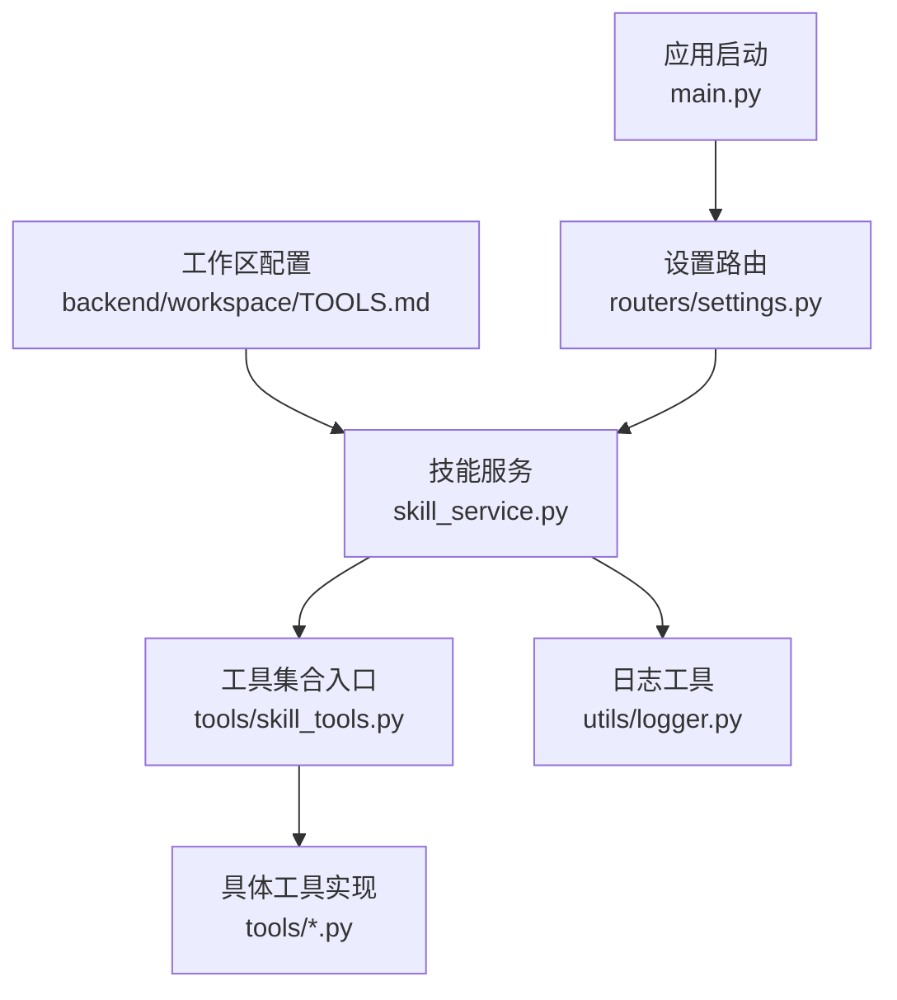
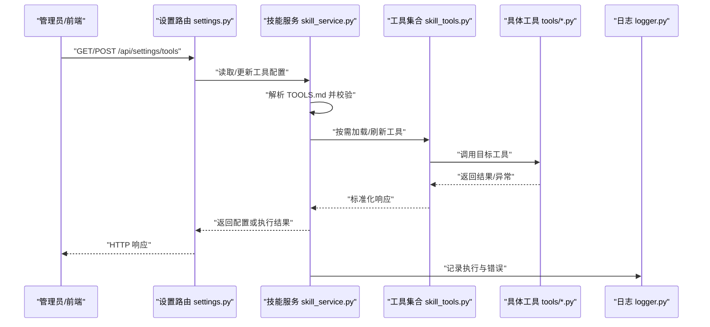
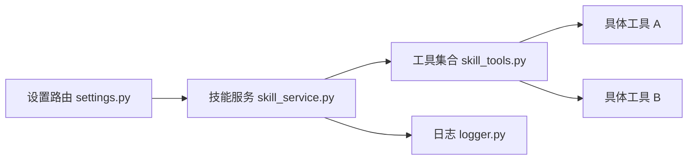

# 工具配置 (TOOLS.md)

<cite>
**本文引用的文件**   
- [backend/workspace/TOOLS.md](file://backend/workspace/TOOLS.md)
- [backend/app/tools/skill_tools.py](file://backend/app/tools/skill_tools.py)
- [backend/app/services/skill_service.py](file://backend/app/services/skill_service.py)
- [backend/app/routers/settings.py](file://backend/app/routers/settings.py)
- [backend/app/main.py](file://backend/app/main.py)
- [backend/app/utils/logger.py](file://backend/app/utils/logger.py)
</cite>

## 目录
1. [简介](#简介)
2. [项目结构](#项目结构)
3. [核心组件](#核心组件)
4. [架构总览](#架构总览)
5. [详细组件分析](#详细组件分析)
6. [依赖分析](#依赖分析)
7. [性能考虑](#性能考虑)
8. [故障排查指南](#故障排查指南)
9. [结论](#结论)
10. [附录](#附录)

## 简介
本文件面向“工具配置”主题，围绕仓库中的 TOOLS.md 及其在系统中的角色进行系统化说明。内容涵盖：
- 工具清单与分类、参数化配置、权限控制与 API 密钥管理
- 工具注册机制、动态加载流程、依赖管理
- 工具调用权限验证与安全策略、访问控制实现
- 工具性能监控与调试方法
- 工具配置模板与自定义工具集成指南

## 项目结构
与工具配置相关的关键位置如下：
- 工作区配置：backend/workspace/TOOLS.md（定义可用工具、参数、权限、密钥等）
- 工具服务层：backend/app/services/skill_service.py（负责工具发现、加载、执行编排）
- 工具集合入口：backend/app/tools/skill_tools.py（聚合具体工具能力）
- 设置路由：backend/app/routers/settings.py（提供获取/更新工具配置的接口）
- 应用启动：backend/app/main.py（初始化服务、挂载路由）
- 日志工具：backend/app/utils/logger.py（记录工具执行与错误信息）

图示来源
- [backend/workspace/TOOLS.md](file://backend/workspace/TOOLS.md)
- [backend/app/services/skill_service.py](file://backend/app/services/skill_service.py)
- [backend/app/tools/skill_tools.py](file://backend/app/tools/skill_tools.py)
- [backend/app/routers/settings.py](file://backend/app/routers/settings.py)
- [backend/app/main.py](file://backend/app/main.py)
- [backend/app/utils/logger.py](file://backend/app/utils/logger.py)

章节来源
- [backend/workspace/TOOLS.md](file://backend/workspace/TOOLS.md)
- [backend/app/services/skill_service.py](file://backend/app/services/skill_service.py)
- [backend/app/tools/skill_tools.py](file://backend/app/tools/skill_tools.py)
- [backend/app/routers/settings.py](file://backend/app/routers/settings.py)
- [backend/app/main.py](file://backend/app/main.py)
- [backend/app/utils/logger.py](file://backend/app/utils/logger.py)

## 核心组件
- 工具清单与配置（TOOLS.md）
  - 用于声明可用工具、参数模式、默认值、是否启用、所需权限、API 密钥占位符等
  - 作为系统启动时或运行时热更新的依据
- 技能服务（skill_service.py）
  - 负责解析 TOOLS.md、校验配置、加载工具、维护上下文与权限
  - 提供统一的工具调用入口与结果封装
- 工具集合（skill_tools.py）
  - 将具体工具按功能域组织，暴露统一接口供上层调用
- 设置路由（settings.py）
  - 暴露 REST 接口以查询和更新工具配置（如开关、密钥、参数）
- 应用启动（main.py）
  - 初始化服务、注入依赖、挂载路由，确保工具服务就绪
- 日志工具（logger.py）
  - 为工具执行链路提供结构化日志输出，便于追踪与排障

章节来源
- [backend/workspace/TOOLS.md](file://backend/workspace/TOOLS.md)
- [backend/app/services/skill_service.py](file://backend/app/services/skill_service.py)
- [backend/app/tools/skill_tools.py](file://backend/app/tools/skill_tools.py)
- [backend/app/routers/settings.py](file://backend/app/routers/settings.py)
- [backend/app/main.py](file://backend/app/main.py)
- [backend/app/utils/logger.py](file://backend/app/utils/logger.py)

## 架构总览
下图展示了从配置到执行的端到端流程：配置驱动、服务编排、工具执行与日志记录。

图示来源
- [backend/app/routers/settings.py](file://backend/app/routers/settings.py)
- [backend/app/services/skill_service.py](file://backend/app/services/skill_service.py)
- [backend/app/tools/skill_tools.py](file://backend/app/tools/skill_tools.py)
- [backend/app/utils/logger.py](file://backend/app/utils/logger.py)

## 详细组件分析

### 工具清单与配置（TOOLS.md）
- 作用
  - 集中声明所有可用工具、参数模式、默认值、启用状态、权限要求、外部依赖与 API 密钥占位符
  - 作为“配置即代码”的单一事实源，驱动工具注册与动态加载
- 关键概念
  - 工具条目：包含名称、描述、版本、参数定义、默认值、是否启用、权限标签、依赖项、密钥引用
  - 参数类型：字符串、布尔、数值、枚举、数组、对象等；支持必填/可选、校验规则、帮助文本
  - 权限模型：基于角色的访问控制（RBAC），通过权限标签控制工具可见性与可调用性
  - 密钥管理：敏感信息通过环境变量或安全存储注入，配置中仅保留引用键名
- 建议结构（示例字段）
  - id/name：唯一标识
  - version：语义化版本
  - enabled：是否启用
  - description：用途说明
  - parameters：参数列表（name/type/default/required/validation/help）
  - permissions：所需权限标签集合
  - dependencies：外部依赖或服务（如第三方 SDK、网络地址）
  - secrets：所需密钥键名列表（不存放明文）
  - tags：分类标签（如 image/video/audio/3d）
- 使用方式
  - 启动时由服务层解析并缓存
  - 运行时可通过设置接口热更新部分配置（如开关、参数默认值）
  - 变更需经过校验与幂等处理，避免破坏已生效的工具链

章节来源
- [backend/workspace/TOOLS.md](file://backend/workspace/TOOLS.md)

### 技能服务（skill_service.py）
- 职责
  - 解析并校验 TOOLS.md，构建工具元数据索引
  - 根据权限与上下文过滤可用工具
  - 动态加载工具模块，维护实例池与依赖注入
  - 提供统一的工具调用入口，封装请求/响应与错误
- 关键流程
  - 初始化：扫描配置、加载工具、预热依赖
  - 查询：按标签/权限/关键词检索工具
  - 执行：参数校验、鉴权检查、调用工具、收集日志
  - 更新：增量更新配置、重载受影响工具
- 错误处理
  - 配置缺失/格式错误：返回明确错误码与修复建议
  - 权限不足：拒绝执行并记录审计日志
  - 工具异常：捕获并包装为标准错误结构，附带上下文

章节来源
- [backend/app/services/skill_service.py](file://backend/app/services/skill_service.py)

### 工具集合（skill_tools.py）
- 职责
  - 聚合各功能域工具（图像、视频、音频、3D、工作区等）
  - 提供统一命名空间与导入路径，屏蔽底层差异
- 设计要点
  - 模块化组织：按领域拆分，降低耦合
  - 延迟加载：仅在首次调用时实例化，减少启动开销
  - 依赖注入：通过服务层传入配置、密钥、上下文

章节来源
- [backend/app/tools/skill_tools.py](file://backend/app/tools/skill_tools.py)

### 设置路由（settings.py）
- 职责
  - 暴露工具配置的查询与更新接口
  - 对写入操作进行鉴权与校验
- 典型接口
  - GET /api/settings/tools：返回当前工具清单与配置摘要
  - PUT /api/settings/tools：批量更新工具开关、参数默认值、权限标签
  - PATCH /api/settings/tools/secrets：更新密钥引用（不返回明文）
- 安全策略
  - 仅允许具备管理员权限的用户访问
  - 变更需幂等且带审计日志

章节来源
- [backend/app/routers/settings.py](file://backend/app/routers/settings.py)

### 应用启动（main.py）
- 职责
  - 初始化全局服务（包括技能服务）
  - 挂载路由、中间件、错误处理器
  - 提供健康检查与优雅关闭钩子
- 与工具的关系
  - 在应用启动阶段完成工具服务的初始化与预热
  - 监听配置变更事件（如有）触发工具重载

章节来源
- [backend/app/main.py](file://backend/app/main.py)

### 日志工具（logger.py）
- 职责
  - 提供结构化日志输出（时间戳、级别、模块、trace_id、耗时）
  - 记录工具执行成功/失败、参数摘要、异常堆栈
- 使用建议
  - 在工具入口与出口处打点
  - 对敏感字段脱敏后再记录

章节来源
- [backend/app/utils/logger.py](file://backend/app/utils/logger.py)

## 依赖分析
- 组件耦合
  - 设置路由依赖技能服务，技能服务依赖工具集合与具体工具实现
  - 工具集合依赖具体工具模块，但通过延迟加载降低启动期耦合
- 外部依赖
  - 第三方 SDK/API（如图像生成、语音合成、3D 渲染等）通过依赖项声明并由服务层注入
  - 密钥通过环境变量或安全存储注入，避免硬编码
- 潜在循环依赖
  - 通过分层与接口抽象避免直接循环引用
  - 工具集合仅作为聚合层，不包含业务逻辑

图示来源
- [backend/app/routers/settings.py](file://backend/app/routers/settings.py)
- [backend/app/services/skill_service.py](file://backend/app/services/skill_service.py)
- [backend/app/tools/skill_tools.py](file://backend/app/tools/skill_tools.py)
- [backend/app/utils/logger.py](file://backend/app/utils/logger.py)

章节来源
- [backend/app/routers/settings.py](file://backend/app/routers/settings.py)
- [backend/app/services/skill_service.py](file://backend/app/services/skill_service.py)
- [backend/app/tools/skill_tools.py](file://backend/app/tools/skill_tools.py)
- [backend/app/utils/logger.py](file://backend/app/utils/logger.py)

## 性能考虑
- 启动优化
  - 延迟加载工具模块，按需实例化
  - 预解析 TOOLS.md 并缓存索引，避免重复 IO
- 运行期优化
  - 参数校验前置，尽早失败
  - 并发调用外部 API 时使用连接池与超时控制
  - 大对象传输采用流式或分块处理
- 资源限制
  - 对 CPU/内存密集工具设置配额与熔断
  - 对 I/O 密集型工具设置队列与背压
- 可观测性
  - 关键路径埋点（进入/退出、耗时、错误率）
  - 指标上报至监控系统（QPS、P95/P99、错误码分布）

[本节为通用指导，无需特定文件来源]

## 故障排查指南
- 常见问题
  - 配置解析失败：检查 TOOLS.md 语法与必填字段
  - 权限不足：确认用户角色与工具权限标签匹配
  - 密钥未配置：检查环境变量或安全存储中是否存在对应键
  - 工具执行异常：查看结构化日志中的 trace_id 与堆栈
- 定位步骤
  - 通过设置接口获取当前工具清单，确认目标工具已启用
  - 在日志中搜索 trace_id，定位调用链路与耗时热点
  - 逐步缩小范围：先复现最小参数集，再扩展复杂场景
- 恢复策略
  - 回滚最近一次配置变更
  - 重启受影响的工具模块（若支持热重载）
  - 降级策略：禁用不稳定工具，切换备用实现

章节来源
- [backend/app/utils/logger.py](file://backend/app/utils/logger.py)
- [backend/app/routers/settings.py](file://backend/app/routers/settings.py)
- [backend/app/services/skill_service.py](file://backend/app/services/skill_service.py)

## 结论
通过以 TOOLS.md 为核心的配置驱动方案，系统实现了工具的统一注册、动态加载、权限控制与密钥管理。配合设置路由与服务层编排，可在保证安全性的前提下灵活扩展工具生态。建议在生产环境完善可观测性与限流熔断策略，持续提升稳定性与可维护性。

[本节为总结性内容，无需特定文件来源]

## 附录

### 工具配置模板（参考字段）
- 基础信息
  - id/name、version、enabled、description、tags
- 参数定义
  - name、type、default、required、validation、help
- 权限与依赖
  - permissions、dependencies、secrets
- 行为控制
  - timeout、retry、cacheable、streaming

章节来源
- [backend/workspace/TOOLS.md](file://backend/workspace/TOOLS.md)

### 自定义工具集成指南
- 步骤
  - 在工具集合中新增模块并按领域组织
  - 在 TOOLS.md 中添加工具条目，声明参数、权限、依赖与密钥
  - 在服务层注册新工具，确保延迟加载与依赖注入
  - 编写单元测试与集成测试，覆盖正常与异常路径
- 最佳实践
  - 参数校验前置，错误信息清晰
  - 对外部依赖进行超时与重试控制
  - 对敏感输入输出进行脱敏与审计

章节来源
- [backend/app/tools/skill_tools.py](file://backend/app/tools/skill_tools.py)
- [backend/app/services/skill_service.py](file://backend/app/services/skill_service.py)
- [backend/workspace/TOOLS.md](file://backend/workspace/TOOLS.md)

### 工具调用权限验证与安全策略
- 权限模型
  - 基于 RBAC 的权限标签匹配，结合用户角色与工具声明
- 访问控制
  - 在路由层与服务层双重校验，拒绝非法调用
- 密钥管理
  - 仅引用键名，明文通过环境变量或安全存储注入
  - 禁止在日志中输出敏感信息
- 审计与合规
  - 记录关键操作的审计日志，保留必要上下文

章节来源
- [backend/app/routers/settings.py](file://backend/app/routers/settings.py)
- [backend/app/services/skill_service.py](file://backend/app/services/skill_service.py)
- [backend/workspace/TOOLS.md](file://backend/workspace/TOOLS.md)