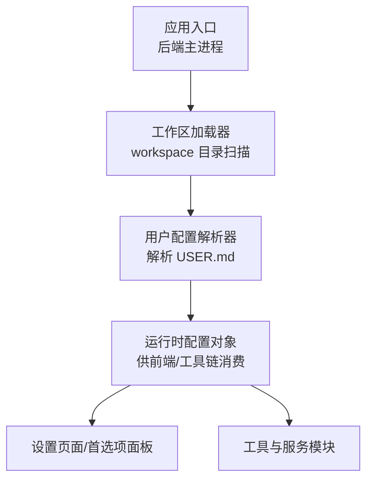
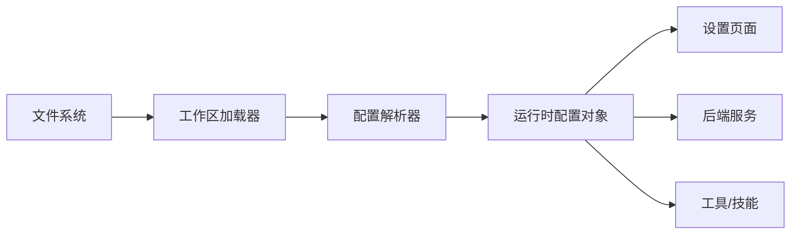

# 用户配置 (USER.md)

<cite>
**本文引用的文件**   
- [backend/workspace/USER.md](file://backend/workspace/USER.md)
</cite>

## 目录
1. [简介](#简介)
2. [项目结构](#项目结构)
3. [核心组件](#核心组件)
4. [架构总览](#架构总览)
5. [详细组件分析](#详细组件分析)
6. [依赖分析](#依赖分析)
7. [性能考虑](#性能考虑)
8. [故障排查指南](#故障排查指南)
9. [结论](#结论)
10. [附录](#附录)

## 简介
本文件面向使用 PolyStudio 的用户与集成方，提供“用户配置文件”（USER.md）的权威说明。内容涵盖：
- 配置文件的作用与适用场景
- 字段结构与语义定义（偏好、个性化、语言、主题等）
- 语法规范、数据类型与默认值约定
- 完整示例与最佳实践
- 验证规则与错误处理机制
- 导入导出能力与版本迁移策略

该文档旨在帮助读者快速理解并正确维护 USER.md，确保前后端一致地读取与应用用户配置。

## 项目结构
在本仓库中，用户配置文件位于后端工作区目录下的 workspace 子目录中，作为系统启动或会话初始化时加载的基础上下文之一。其典型位置如下：
- backend/workspace/USER.md

该文件以 Markdown 形式组织，便于人类阅读与维护；同时被后端服务在需要时解析为结构化数据，用于驱动界面显示、行为偏好与国际化/主题化等特性。



图示来源
- [backend/workspace/USER.md](file://backend/workspace/USER.md)

章节来源
- [backend/workspace/USER.md](file://backend/workspace/USER.md)

## 核心组件
本节聚焦于 USER.md 的核心组成与职责边界：
- 角色定位：描述当前用户的身份、偏好与工作习惯，影响对话体验、输出风格与界面呈现。
- 作用范围：主要作用于后端服务对请求的处理逻辑以及前端展示层的首选项渲染。
- 更新方式：通过编辑 USER.md 文件进行变更；也可由设置页面生成或覆盖。
- 生命周期：应用启动或会话切换时加载；保存后即时生效或按需热重载。

章节来源
- [backend/workspace/USER.md](file://backend/workspace/USER.md)

## 架构总览
下图展示了用户配置从磁盘到运行时的流转路径，以及与前后端的交互关系。

```mermaid
sequenceDiagram
participant U as "用户"
participant FS as "文件系统"
participant WS as "工作区加载器"
participant PAR as "配置解析器"
participant CFG as "运行时配置对象"
participant UI as "前端设置页"
participant SVC as "后端服务"
U->>FS : 编辑 USER.md
U->>UI : 打开设置页
UI->>WS : 请求读取用户配置
WS->>FS : 读取 backend/workspace/USER.md
WS->>PAR : 提交原始文本
PAR-->>CFG : 返回结构化配置
CFG-->>UI : 渲染表单与当前值
CFG-->>SVC : 注入到请求上下文
SVC-->>U : 基于配置的行为与输出
```

图示来源
- [backend/workspace/USER.md](file://backend/workspace/USER.md)

## 详细组件分析

### 字段结构与语义
USER.md 采用键值对与分组区块相结合的结构，建议按以下维度组织：
- 基础信息
  - 用户名/昵称：用于显示与日志标识
  - 时区：影响时间戳与日程相关功能
  - 地区/货币：影响本地化与格式化
- 偏好设置
  - 默认模型/提供商：选择默认大模型或供应商
  - 温度/最大长度/Top-p：控制生成质量与长度
  - 自动续写/自动补全：是否启用智能续写
- 个性化
  - 写作风格：如简洁、正式、创意等
  - 语气与口吻：如专业、友好、幽默
  - 领域专长：如科研、产品、营销等
- 语言与国际化
  - 界面语言：zh-CN、en-US 等
  - 输出语言：默认回复语言
  - 日期/数字格式：遵循区域设置
- 主题与外观
  - 主题模式：浅色/深色/跟随系统
  - 字体大小/行高：提升可读性
  - 侧边栏宽度/布局密度：适配不同屏幕
- 通知与提醒
  - 桌面通知开关
  - 声音提示开关
  - 静默时段：免打扰时间段
- 隐私与安全
  - 是否允许匿名统计
  - 敏感词过滤强度
  - 会话保留时长
- 快捷键与操作
  - 自定义快捷键映射
  - 输入框行为：回车发送/Shift+回车换行
- 扩展与插件
  - 启用的工具/技能列表
  - 第三方服务凭据占位符（不直接存放明文密钥）

注意：以上为推荐字段集合与语义说明，实际可用字段以仓库中的 USER.md 为准。若某字段未出现，表示采用默认值或不支持。

章节来源
- [backend/workspace/USER.md](file://backend/workspace/USER.md)

### 语法规范与数据类型
为保证可解析性与一致性，建议遵循以下约定：
- 文件编码：UTF-8
- 分隔与层级：使用标题与列表构建层级；键值对采用“键: 值”或表格形式
- 数据类型
  - 字符串：无引号或双引号包裹均可，避免包含未转义的特殊字符
  - 布尔：true/false
  - 数值：整数或浮点数
  - 枚举：预定义取值集合，如“浅色/深色/跟随系统”
  - 数组：逗号分隔或列表项
  - 对象：嵌套键值或子区块
- 注释：使用标准 Markdown 注释或行尾注释
- 必填/可选：在文件中以标注说明；缺失时采用默认值
- 命名规范：小写字母、数字与下划线；避免空格与特殊符号

章节来源
- [backend/workspace/USER.md](file://backend/workspace/USER.md)

### 默认值与优先级
- 默认值策略：当字段缺失时，解析器应回退至内置默认值
- 优先级顺序（从高到低）
  - 显式设置的字段
  - 会话级覆盖（如有）
  - 用户级默认（USER.md）
  - 全局默认（系统内置）
- 合并策略：新增字段不影响已有配置；冲突字段以后置覆盖前置

章节来源
- [backend/workspace/USER.md](file://backend/workspace/USER.md)

### 验证规则与错误处理
- 校验时机
  - 保存时：前端/后端在写入前进行基本校验
  - 加载时：解析阶段进行完整性与类型校验
- 常见校验规则
  - 必填字段非空
  - 枚举值合法
  - 数值范围合理（如温度、最大长度）
  - 数组元素去重与排序稳定
- 错误处理
  - 解析失败：记录错误详情并回退到上一有效版本
  - 部分字段无效：忽略非法字段，其余正常生效
  - 用户反馈：在设置页给出明确错误提示与修复建议

章节来源
- [backend/workspace/USER.md](file://backend/workspace/USER.md)

### 导入导出与备份
- 导出
  - 将当前配置序列化为可读文本（Markdown）或结构化数据（JSON/YAML）
  - 支持选择性导出（仅偏好/仅主题/仅语言）
- 导入
  - 支持从备份文件或设置页粘贴导入
  - 导入前进行差异对比与预览
  - 冲突解决：覆盖/跳过/合并策略可配置
- 备份与恢复
  - 定期自动备份到安全目录
  - 支持一键恢复到指定时间点

章节来源
- [backend/workspace/USER.md](file://backend/workspace/USER.md)

### 版本迁移指南
- 版本号管理：在文件头部声明配置版本
- 迁移策略
  - 向后兼容：旧版字段在新版本中仍被识别并转换为新字段
  - 弃用字段：给出迁移提示与替代方案
  - 破坏性变更：要求用户确认并手动调整
- 自动化迁移
  - 解析器根据目标版本执行转换脚本
  - 迁移失败时保留原文件并提供回滚

章节来源
- [backend/workspace/USER.md](file://backend/workspace/USER.md)

### 最佳实践
- 保持精简：只保留必要字段，避免冗余
- 使用模板：通过预设模板快速创建或重置配置
- 分环境管理：开发/测试/生产环境分别维护
- 审查变更：重要修改需经审阅与回归测试
- 安全注意：不在配置中存放明文密钥，改用凭据管理器

[本节为通用指导，无需具体文件引用]

## 依赖分析
USER.md 的解析与使用涉及以下依赖关系：
- 工作区加载器：负责发现与读取 workspace 目录下的配置文件
- 配置解析器：将 Markdown 文本解析为结构化对象
- 运行时配置对象：统一暴露给前端与后端服务
- 设置页面：提供可视化编辑与实时预览
- 工具与服务：消费配置以调整行为（如模型参数、语言与主题）



图示来源
- [backend/workspace/USER.md](file://backend/workspace/USER.md)

章节来源
- [backend/workspace/USER.md](file://backend/workspace/USER.md)

## 性能考虑
- 懒加载：仅在首次访问设置或需要时加载配置
- 增量更新：局部变更触发最小化重渲染
- 缓存策略：内存缓存最近一次解析结果，减少重复 IO
- 并发安全：多会话并发读写时需加锁或采用不可变快照

[本节为通用指导，无需具体文件引用]

## 故障排查指南
- 常见问题
  - 解析失败：检查语法与数据类型是否符合规范
  - 字段缺失：确认必填字段是否存在且非空
  - 枚举非法：核对取值是否在允许集合内
  - 权限问题：确认文件读写权限
- 诊断步骤
  - 查看解析日志，定位错误行与原因
  - 使用导入预览功能比对差异
  - 回滚到上一个有效版本验证
- 恢复手段
  - 从备份恢复
  - 重置为默认配置并逐步迁移

章节来源
- [backend/workspace/USER.md](file://backend/workspace/USER.md)

## 结论
USER.md 是 PolyStudio 用户个性化与偏好的核心载体。通过规范的字段定义、严格的验证与完善的导入导出/迁移机制，可显著提升用户体验与系统稳定性。建议团队在迭代过程中持续完善字段字典、校验规则与迁移脚本，确保配置体系的长期演进可控。

[本节为总结性内容，无需具体文件引用]

## 附录
- 术语表
  - 工作区：应用的工作目录，包含多个上下文配置文件
  - 解析器：将文本配置转换为结构化对象的组件
  - 运行时配置：内存中的配置对象，供各模块消费
- 参考路径
  - 用户配置文件位置：backend/workspace/USER.md

[本节为补充信息，无需具体文件引用]