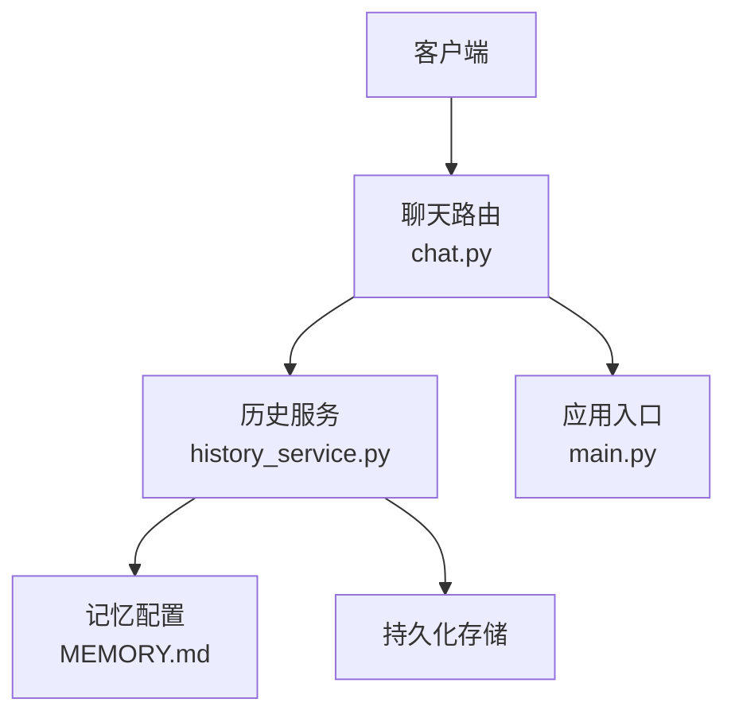
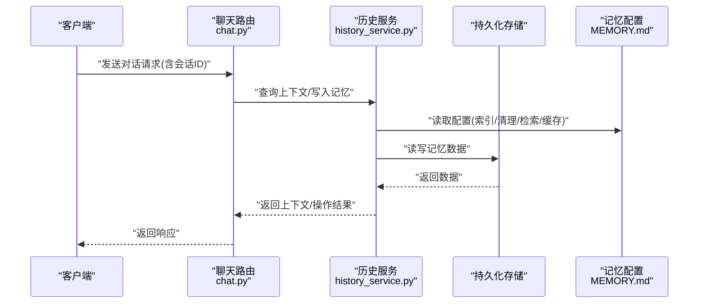
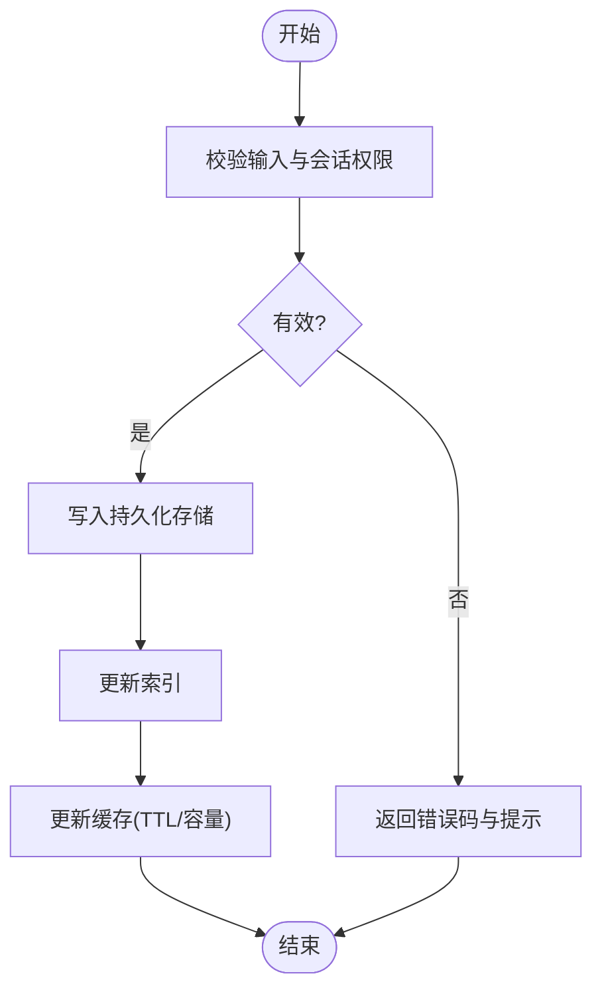
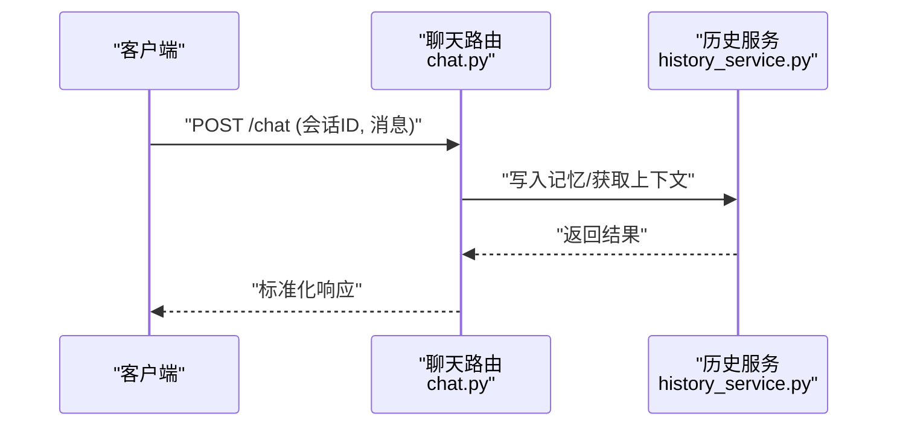
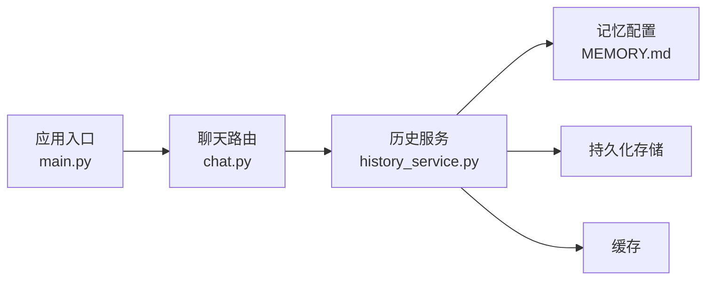

# 记忆配置 (MEMORY.md)

<cite>
**本文引用的文件**   
- [backend/workspace/MEMORY.md](file://backend/workspace/MEMORY.md)
- [backend/app/services/history_service.py](file://backend/app/services/history_service.py)
- [backend/app/routers/chat.py](file://backend/app/routers/chat.py)
- [backend/app/main.py](file://backend/app/main.py)
</cite>

## 目录
1. [简介](#简介)
2. [项目结构](#项目结构)
3. [核心组件](#核心组件)
4. [架构总览](#架构总览)
5. [详细组件分析](#详细组件分析)
6. [依赖分析](#依赖分析)
7. [性能考虑](#性能考虑)
8. [故障排查指南](#故障排查指南)
9. [结论](#结论)
10. [附录](#附录)

## 简介
本文件为“记忆配置”的权威说明，聚焦于 MEMORY.md 的结构与用途，并围绕对话历史存储、上下文管理、记忆持久化策略展开。文档同时覆盖数据结构与存储格式、索引机制、配置选项、清理策略、备份恢复方案、检索算法与相关性评分、缓存机制，以及数据安全、隐私保护与访问控制实现要点。目标是帮助开发者与运维人员正确理解、配置与维护记忆系统，确保在长对话与多会话场景下具备稳定、可观测、可扩展的记忆能力。

## 项目结构
记忆相关代码位于后端服务中，主要涉及：
- 记忆配置文件：backend/workspace/MEMORY.md（定义记忆系统的结构与行为）
- 历史服务：backend/app/services/history_service.py（负责记忆的读写、索引、清理等）
- 聊天路由：backend/app/routers/chat.py（暴露对话接口，调用历史服务）
- 应用入口：backend/app/main.py（注册路由、启动服务）

图表来源
- [backend/app/routers/chat.py](file://backend/app/routers/chat.py)
- [backend/app/services/history_service.py](file://backend/app/services/history_service.py)
- [backend/workspace/MEMORY.md](file://backend/workspace/MEMORY.md)
- [backend/app/main.py](file://backend/app/main.py)

章节来源
- [backend/workspace/MEMORY.md](file://backend/workspace/MEMORY.md)
- [backend/app/services/history_service.py](file://backend/app/services/history_service.py)
- [backend/app/routers/chat.py](file://backend/app/routers/chat.py)
- [backend/app/main.py](file://backend/app/main.py)

## 核心组件
- 记忆配置（MEMORY.md）
  - 定义记忆的数据模型、字段约束、索引键、过期与清理策略、检索参数、缓存开关与容量上限、安全与访问控制策略等。
  - 作为历史服务的运行时依据，驱动读/写/删/查等行为。
- 历史服务（history_service.py）
  - 提供记忆的增删改查、批量导入导出、索引构建与更新、清理任务、检索与排序、缓存读写等能力。
  - 根据 MEMORY.md 的配置项进行参数校验与行为切换。
- 聊天路由（chat.py）
  - 对外暴露对话接口，接收用户消息与会话标识，调用历史服务完成记忆写入与读取，返回上下文片段或完整历史。
- 应用入口（main.py）
  - 初始化服务、挂载路由、加载配置、启动生命周期钩子（如定时清理）。

章节来源
- [backend/workspace/MEMORY.md](file://backend/workspace/MEMORY.md)
- [backend/app/services/history_service.py](file://backend/app/services/history_service.py)
- [backend/app/routers/chat.py](file://backend/app/routers/chat.py)
- [backend/app/main.py](file://backend/app/main.py)

## 架构总览
记忆系统在请求链路中的位置如下：
- 客户端通过聊天路由发起对话请求
- 路由层解析请求体与会话标识，调用历史服务
- 历史服务依据 MEMORY.md 的策略执行：
  - 写入：追加新条目到持久化存储，更新索引
  - 读取：按会话与时间窗口拉取上下文，必要时命中缓存
  - 清理：基于过期时间与配额策略删除旧条目
  - 检索：按关键词/语义向量/标签匹配，计算相关性得分并排序
- 结果返回给路由层，再响应客户端

图表来源
- [backend/app/routers/chat.py](file://backend/app/routers/chat.py)
- [backend/app/services/history_service.py](file://backend/app/services/history_service.py)
- [backend/workspace/MEMORY.md](file://backend/workspace/MEMORY.md)

## 详细组件分析

### 记忆配置（MEMORY.md）
- 作用
  - 集中描述记忆的数据结构、存储格式、索引键、检索策略、清理规则、缓存策略与安全策略。
  - 作为历史服务的唯一配置源，支持热更新与版本化管理。
- 关键维度
  - 数据结构：会话标识、时间戳、角色、内容、元数据（标签、来源、权重）、摘要、向量嵌入（可选）。
  - 存储格式：结构化记录集合，支持分页与范围查询；建议包含主键与外键关系以支撑高效检索。
  - 索引机制：基于会话ID、时间窗口、标签、关键词与向量索引的多维索引，支持复合查询。
  - 检索算法：关键词匹配、标签过滤、语义相似度（向量距离），结合时间衰减与权重加权计算相关性得分。
  - 缓存机制：会话级与热点条目级缓存，支持TTL与容量上限，避免重复IO。
  - 清理策略：基于过期时间、配额上限、低权重淘汰、归档迁移。
  - 安全与访问控制：会话隔离、最小权限、审计日志、敏感信息脱敏。
- 配置项示例（概念性）
  - 索引：启用/禁用、索引字段、分片策略
  - 检索：相似度阈值、最大返回条数、时间窗口
  - 缓存：命中率目标、最大条目数、TTL
  - 清理：保留天数、单会话上限、全局上限
  - 安全：访问令牌校验、IP白名单、字段级可见性

章节来源
- [backend/workspace/MEMORY.md](file://backend/workspace/MEMORY.md)

### 历史服务（history_service.py）
- 职责
  - 记忆CRUD：新增、更新、删除、批量导入导出
  - 索引维护：增量构建、冲突合并、失效重建
  - 检索与排序：组合条件查询、相关性评分、分页
  - 缓存读写：命中判断、回填、失效
  - 清理任务：定时扫描、软删除、归档
- 关键流程
  - 写入流程：校验输入 -> 落盘 -> 更新索引 -> 刷新缓存
  - 读取流程：检查缓存 -> 未命中则查询存储 -> 组装上下文 -> 回填缓存
  - 清理流程：扫描过期/超限条目 -> 标记删除 -> 异步回收
- 错误处理
  - 参数校验失败、存储异常、索引不一致、缓存不可用等情形的降级与重试策略

图表来源
- [backend/app/services/history_service.py](file://backend/app/services/history_service.py)

章节来源
- [backend/app/services/history_service.py](file://backend/app/services/history_service.py)

### 聊天路由（chat.py）
- 职责
  - 解析请求体与会话标识
  - 调用历史服务完成上下文获取与记忆写入
  - 统一响应格式与错误码
- 典型交互
  - 获取上下文：按会话ID与时间窗口拉取最近N条记忆
  - 写入记忆：将用户与助手消息持久化，附带元数据与标签
  - 检索增强：根据检索参数返回相关片段用于提示工程

图表来源
- [backend/app/routers/chat.py](file://backend/app/routers/chat.py)
- [backend/app/services/history_service.py](file://backend/app/services/history_service.py)

章节来源
- [backend/app/routers/chat.py](file://backend/app/routers/chat.py)

### 应用入口（main.py）
- 职责
  - 初始化服务、加载配置、注册路由
  - 启动定时任务（如清理、索引重建）
  - 健康检查与监控指标暴露

章节来源
- [backend/app/main.py](file://backend/app/main.py)

## 依赖分析
- 模块耦合
  - 路由层仅依赖历史服务接口，保持低耦合
  - 历史服务依赖记忆配置与持久化存储抽象
- 外部依赖
  - 存储后端（文件系统/数据库/对象存储）
  - 缓存后端（内存缓存/Redis等）
  - 向量库（可选，用于语义检索）
- 潜在风险
  - 循环依赖应避免
  - 配置变更需保证向后兼容
  - 存储与缓存一致性需要明确策略

图表来源
- [backend/app/routers/chat.py](file://backend/app/routers/chat.py)
- [backend/app/services/history_service.py](file://backend/app/services/history_service.py)
- [backend/workspace/MEMORY.md](file://backend/workspace/MEMORY.md)
- [backend/app/main.py](file://backend/app/main.py)

章节来源
- [backend/app/routers/chat.py](file://backend/app/routers/chat.py)
- [backend/app/services/history_service.py](file://backend/app/services/history_service.py)
- [backend/workspace/MEMORY.md](file://backend/workspace/MEMORY.md)
- [backend/app/main.py](file://backend/app/main.py)

## 性能考虑
- 索引设计
  - 使用复合索引减少全表扫描
  - 对高频查询字段建立倒排索引
- 缓存策略
  - 会话级热点缓存与条目级细粒度缓存结合
  - TTL与容量上限平衡命中率与内存占用
- 检索优化
  - 先过滤后排序，限制返回数量
  - 向量检索采用近似最近邻算法提升吞吐
- 清理与归档
  - 定期清理低权重与过期条目
  - 冷数据归档至低成本存储

[本节为通用指导，不直接分析具体文件]

## 故障排查指南
- 常见问题
  - 索引不一致：重建索引或触发增量修复
  - 缓存不可用：回退直连存储，记录告警
  - 清理任务阻塞：调整批大小与并发度
  - 检索超时：降低相似度阈值或增加超时
- 诊断步骤
  - 查看路由层日志与错误码
  - 检查历史服务内部状态与指标
  - 验证配置项是否生效
  - 核对存储与缓存连通性

章节来源
- [backend/app/services/history_service.py](file://backend/app/services/history_service.py)
- [backend/app/routers/chat.py](file://backend/app/routers/chat.py)

## 结论
记忆系统以 MEMORY.md 为核心配置源，通过历史服务实现稳定的记忆持久化、高效的检索与合理的清理策略。配合路由层与应用入口的生命周期管理，可在多会话与长对话场景下提供一致且可控的记忆体验。建议在部署前充分评估索引、缓存与清理策略，并在生产环境开启完善的监控与告警。

[本节为总结性内容，不直接分析具体文件]

## 附录
- 术语
  - 会话：一次用户交互的上下文边界
  - 记忆条目：一条可被检索与重用的对话片段
  - 索引：加速检索的数据结构
  - 缓存：临时存放热点数据的介质
- 最佳实践
  - 为每个会话设置合理的时间窗口与上限
  - 对敏感字段实施脱敏与最小可见性
  - 定期备份与演练恢复流程
  - 持续监控命中率、延迟与错误率

[本节为补充信息，不直接分析具体文件]