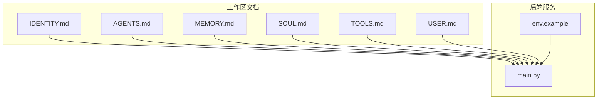
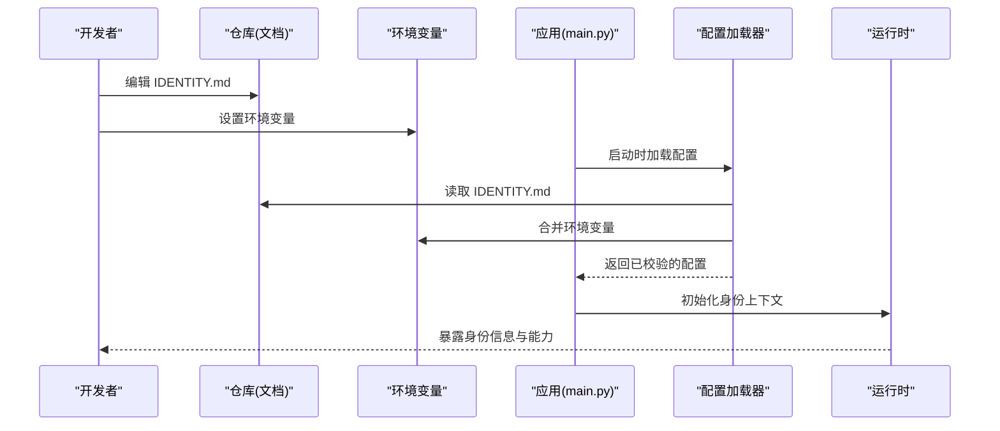
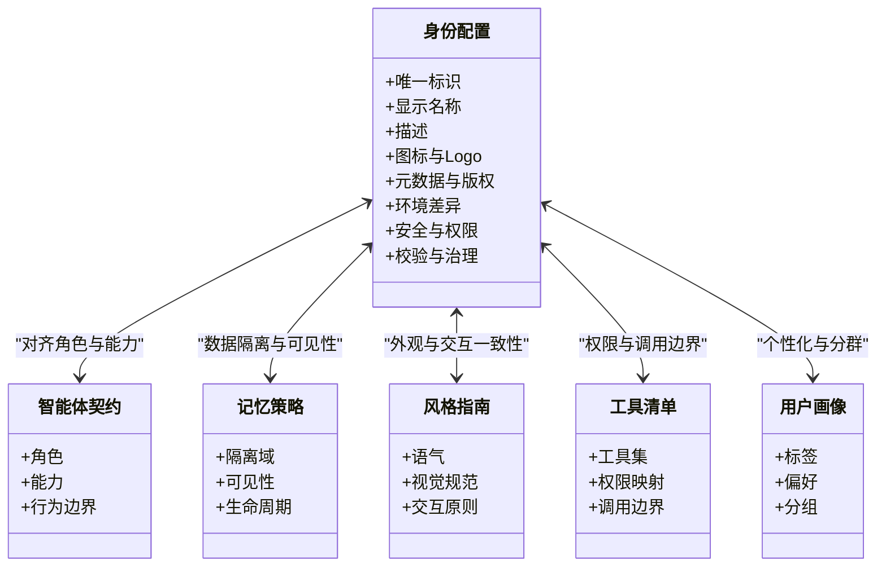
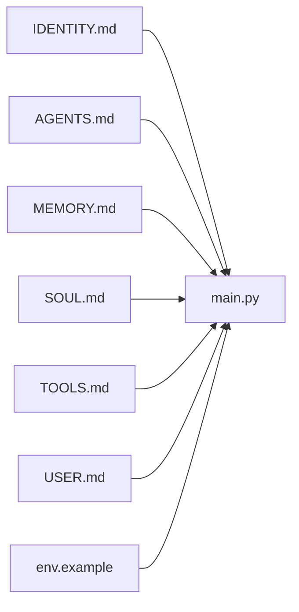

# 身份配置 (IDENTITY.md)

<cite>
**本文引用的文件**   
- [IDENTITY.md](file://backend/workspace/IDENTITY.md)
- [AGENTS.md](file://backend/workspace/AGENTS.md)
- [MEMORY.md](file://backend/workspace/MEMORY.md)
- [SOUL.md](file://backend/workspace/SOUL.md)
- [TOOLS.md](file://backend/workspace/TOOLS.md)
- [USER.md](file://backend/workspace/USER.md)
- [FRAMEWORK.md](file://backend/FRAMEWORK.md)
- [env.example](file://backend/env.example)
- [main.py](file://backend/app/main.py)
</cite>

## 目录
1. [简介](#简介)
2. [项目结构](#项目结构)
3. [核心组件](#核心组件)
4. [架构总览](#架构总览)
5. [详细组件分析](#详细组件分析)
6. [依赖关系分析](#依赖关系分析)
7. [性能与一致性考虑](#性能与一致性考虑)
8. [故障排查指南](#故障排查指南)
9. [结论](#结论)
10. [附录](#附录)

## 简介
本文件围绕“身份配置”主题，系统化阐述 IDENTITY.md 的结构、用途与最佳实践。内容涵盖系统身份信息、品牌设置、元数据配置、版权信息、身份标识定义、显示名称与描述、图标配置、多环境与部署特定设置、环境变量集成、身份验证关联、权限继承与安全边界、配置校验与完整性检查、以及更新管理机制等。文档旨在帮助开发者、运维人员与合规团队在统一框架下维护一致且可审计的身份体系。

## 项目结构
本项目采用“工作区文档 + 后端服务”的协作模式：
- 工作区文档位于 backend/workspace，包含一组以 .md 为后缀的角色与能力说明文件，其中 IDENTITY.md 用于定义系统与产品的身份与品牌信息。
- 后端服务位于 backend/app，提供运行时入口与路由，负责加载并暴露相关配置（如适用）。
- 环境示例 env.example 提供环境变量模板，便于在多环境中复用身份配置。

图表来源
- [IDENTITY.md](file://backend/workspace/IDENTITY.md)
- [AGENTS.md](file://backend/workspace/AGENTS.md)
- [MEMORY.md](file://backend/workspace/MEMORY.md)
- [SOUL.md](file://backend/workspace/SOUL.md)
- [TOOLS.md](file://backend/workspace/TOOLS.md)
- [USER.md](file://backend/workspace/USER.md)
- [main.py](file://backend/app/main.py)
- [env.example](file://backend/env.example)

章节来源
- [IDENTITY.md](file://backend/workspace/IDENTITY.md)
- [AGENTS.md](file://backend/workspace/AGENTS.md)
- [MEMORY.md](file://backend/workspace/MEMORY.md)
- [SOUL.md](file://backend/workspace/SOUL.md)
- [TOOLS.md](file://backend/workspace/TOOLS.md)
- [USER.md](file://backend/workspace/USER.md)
- [FRAMEWORK.md](file://backend/FRAMEWORK.md)
- [env.example](file://backend/env.example)
- [main.py](file://backend/app/main.py)

## 核心组件
- 身份标识与品牌
  - 系统名称、版本、代号、标语、描述、图标、Logo、色彩规范、字体与视觉资产路径等。
  - 建议将“唯一身份标识”作为不可变键，用于跨模块引用与追踪。
- 元数据与版权
  - 许可证、作者/组织、贡献者、联系方式、隐私政策链接、合规声明、审计日志开关等。
- 多环境与部署
  - 开发/测试/预发/生产环境的差异化字段（如域名、图标URL、文案本地化、白名单等）。
  - 通过环境变量注入敏感或环境相关值，避免硬编码。
- 安全与权限
  - 身份与认证系统的映射关系、角色/权限继承规则、访问控制边界、最小权限原则。
- 配置校验与治理
  - 必填字段、格式校验、枚举值约束、完整性签名或哈希校验、变更审批流程。

章节来源
- [IDENTITY.md](file://backend/workspace/IDENTITY.md)
- [env.example](file://backend/env.example)

## 架构总览
身份配置在系统中的使用通常遵循“静态定义 + 动态注入 + 运行时校验”的模式：
- 静态定义：IDENTITY.md 提供权威的身份与品牌基线。
- 动态注入：通过环境变量覆盖敏感或环境相关项。
- 运行时校验：服务启动时读取并校验配置，失败则阻断启动或降级到安全默认值。

图表来源
- [IDENTITY.md](file://backend/workspace/IDENTITY.md)
- [env.example](file://backend/env.example)
- [main.py](file://backend/app/main.py)

## 详细组件分析

### 身份标识与品牌设置
- 身份标识
  - 唯一ID：用于跨系统识别，建议稳定不变。
  - 显示名称：面向用户展示的名称，支持多语言。
  - 描述信息：简短说明产品/服务的定位与能力。
- 品牌与视觉
  - 图标与Logo：提供多种尺寸与格式，区分暗色/亮色背景。
  - 色彩与字体：主色、辅助色、字体族与字重规范。
- 元数据与版权
  - 许可证、作者/组织、版本、发布渠道、合规与隐私链接。
- 建议
  - 将“显示名称”与“唯一ID”解耦，避免业务耦合。
  - 图标资源集中管理，并提供CDN地址与本地回退路径。

章节来源
- [IDENTITY.md](file://backend/workspace/IDENTITY.md)

### 多环境与部署特定设置
- 环境分层
  - 开发/测试/预发/生产：域名、图标URL、文案、白名单、功能开关等差异。
- 环境变量集成
  - 敏感信息（密钥、证书）与环境相关值通过环境变量注入。
  - 提供 env.example 作为模板，确保各环境一致性。
- 部署策略
  - 容器镜像内嵌非敏感身份常量，敏感项由编排平台注入。
  - 灰度发布时按租户/地域维度切换身份文案与资源。

章节来源
- [IDENTITY.md](file://backend/workspace/IDENTITY.md)
- [env.example](file://backend/env.example)

### 身份验证关联、权限继承与安全边界
- 认证关联
  - 将内部身份标识映射到外部认证系统（如OIDC、LDAP），建立信任链。
- 权限继承
  - 基于角色的访问控制（RBAC）或属性型访问控制（ABAC），从组织/项目/资源层级继承。
- 安全边界
  - 明确数据域、API域与UI域的边界；对越权访问进行拦截与审计。
- 建议
  - 最小权限原则；定期审查权限矩阵；关键操作留痕。

章节来源
- [IDENTITY.md](file://backend/workspace/IDENTITY.md)

### 配置校验、完整性检查与更新管理
- 校验规则
  - 必填字段、类型与格式、枚举值、长度与范围、URL可达性、证书有效期等。
- 完整性检查
  - 可选引入配置指纹（如SHA-256）或数字签名，防止篡改。
- 更新机制
  - 变更需走评审与发布流程；支持热更新与非热更新两种策略。
  - 记录变更历史与回滚方案。

章节来源
- [IDENTITY.md](file://backend/workspace/IDENTITY.md)

### 与其他工作区文档的关系
- AGENTS.md：定义智能体/代理的身份与行为契约，可与系统身份对齐。
- MEMORY.md：记忆与上下文存储策略，涉及身份隔离与数据可见性。
- SOUL.md：价值观与风格指南，影响对外交互语气与界面呈现。
- TOOLS.md：工具清单与权限，需与身份权限模型联动。
- USER.md：用户画像与偏好，结合身份实现个性化体验。

图表来源
- [IDENTITY.md](file://backend/workspace/IDENTITY.md)
- [AGENTS.md](file://backend/workspace/AGENTS.md)
- [MEMORY.md](file://backend/workspace/MEMORY.md)
- [SOUL.md](file://backend/workspace/SOUL.md)
- [TOOLS.md](file://backend/workspace/TOOLS.md)
- [USER.md](file://backend/workspace/USER.md)

章节来源
- [IDENTITY.md](file://backend/workspace/IDENTITY.md)
- [AGENTS.md](file://backend/workspace/AGENTS.md)
- [MEMORY.md](file://backend/workspace/MEMORY.md)
- [SOUL.md](file://backend/workspace/SOUL.md)
- [TOOLS.md](file://backend/workspace/TOOLS.md)
- [USER.md](file://backend/workspace/USER.md)

## 依赖关系分析
- 文档层依赖
  - IDENTITY.md 与 AGENTS.md、MEMORY.md、SOUL.md、TOOLS.md、USER.md 存在语义耦合，需在变更时同步评估影响面。
- 运行期依赖
  - main.py 作为服务入口，可能加载上述文档或由其衍生的配置对象，并在启动阶段完成校验与初始化。
- 环境依赖
  - env.example 提供环境变量模板，驱动不同部署环境的差异化配置。

图表来源
- [IDENTITY.md](file://backend/workspace/IDENTITY.md)
- [AGENTS.md](file://backend/workspace/AGENTS.md)
- [MEMORY.md](file://backend/workspace/MEMORY.md)
- [SOUL.md](file://backend/workspace/SOUL.md)
- [TOOLS.md](file://backend/workspace/TOOLS.md)
- [USER.md](file://backend/workspace/USER.md)
- [main.py](file://backend/app/main.py)
- [env.example](file://backend/env.example)

章节来源
- [IDENTITY.md](file://backend/workspace/IDENTITY.md)
- [AGENTS.md](file://backend/workspace/AGENTS.md)
- [MEMORY.md](file://backend/workspace/MEMORY.md)
- [SOUL.md](file://backend/workspace/SOUL.md)
- [TOOLS.md](file://backend/workspace/TOOLS.md)
- [USER.md](file://backend/workspace/USER.md)
- [main.py](file://backend/app/main.py)
- [env.example](file://backend/env.example)

## 性能与一致性考虑
- 配置加载
  - 启动时一次性加载并缓存，避免重复I/O；对大体积资源（如图标）采用懒加载或CDN。
- 一致性
  - 通过单一事实源（IDENTITY.md）与严格的变更流程保证多端一致。
- 可扩展性
  - 预留扩展字段与命名空间，避免破坏向后兼容。

[本节为通用指导，不直接分析具体文件]

## 故障排查指南
- 常见问题
  - 环境变量未生效：核对 env.example 与实际注入的环境变量名与大小写。
  - 图标或资源无法加载：检查URL可达性与跨域策略。
  - 权限异常：确认身份与角色映射、继承规则与访问边界。
  - 配置校验失败：查看缺失字段、格式错误与枚举值不匹配。
- 诊断步骤
  - 启用更详细的日志输出，定位加载与校验阶段。
  - 对比不同环境的差异，逐步缩小问题范围。
  - 使用只读副本验证配置完整性与一致性。

章节来源
- [IDENTITY.md](file://backend/workspace/IDENTITY.md)
- [env.example](file://backend/env.example)

## 结论
IDENTITY.md 是系统身份与品牌的权威来源，配合环境变量与运行期校验，可实现安全、一致且可演进的配置体系。通过与其他工作区文档协同，构建完整的身份—权限—能力—体验闭环，有助于提升系统的可维护性与合规性。

[本节为总结性内容，不直接分析具体文件]

## 附录
- 术语
  - 身份标识：唯一且稳定的系统/产品标识符。
  - 显示名称：面向用户的可读名称，支持多语言。
  - 元数据：关于配置的附加信息，如版权、许可证、版本等。
- 参考
  - FRAMEWORK.md：整体框架与设计原则，可作为身份配置的上层约束。

章节来源
- [FRAMEWORK.md](file://backend/FRAMEWORK.md)