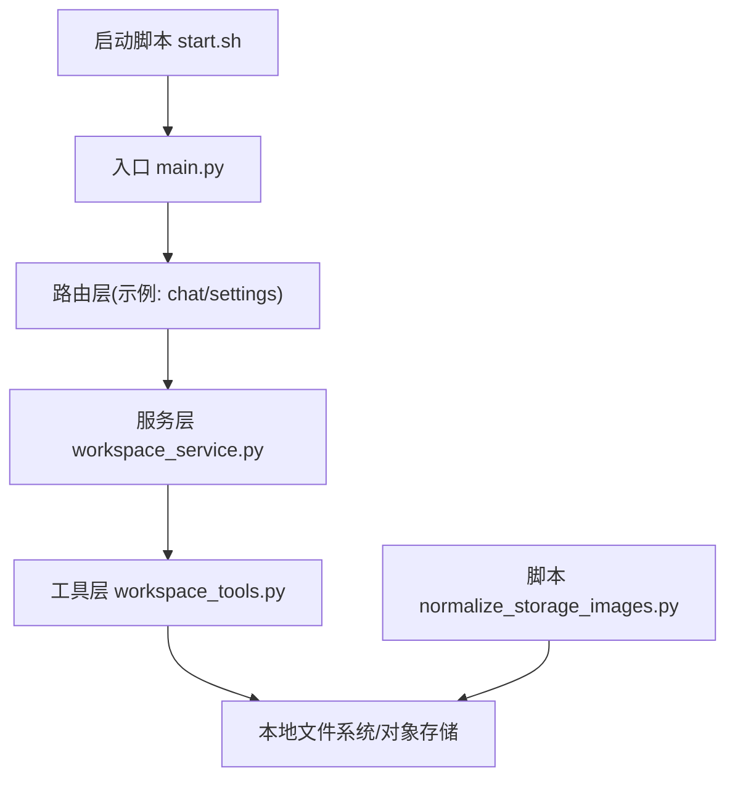
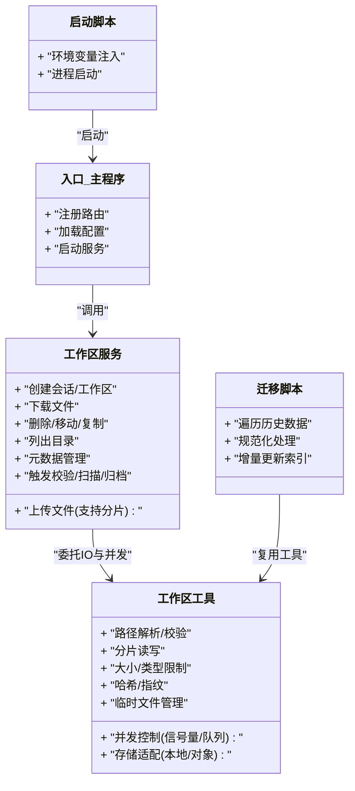
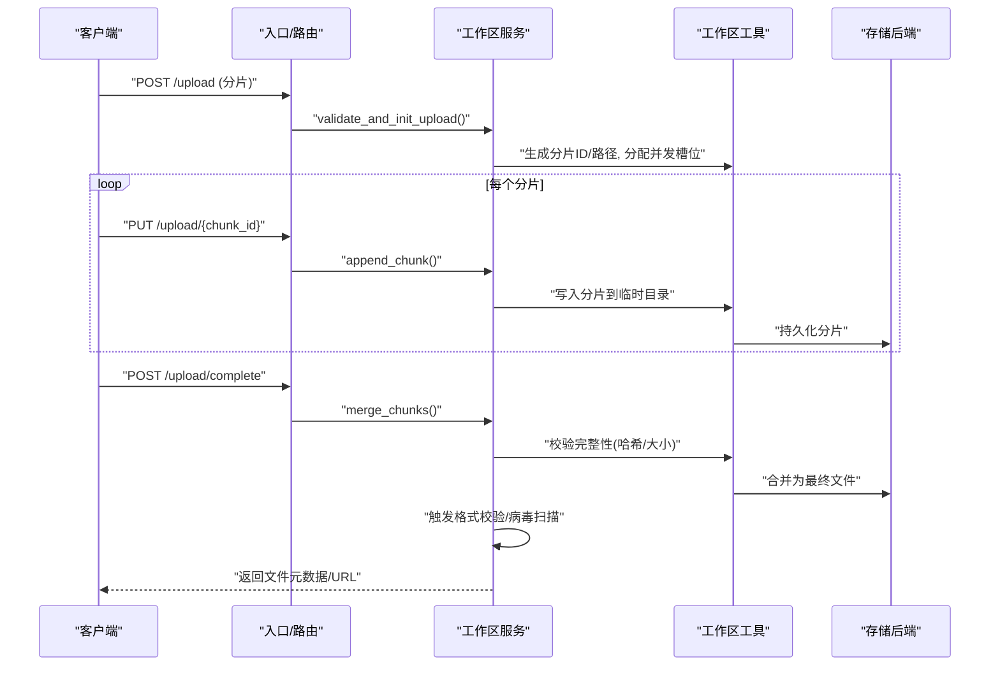
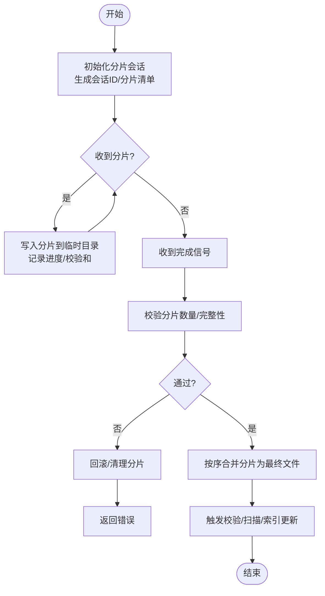
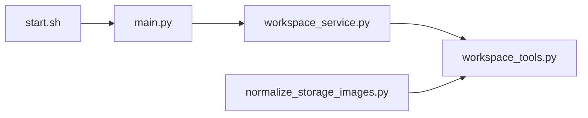

# 文件操作与存储

<cite>
**本文引用的文件**   
- [backend/app/main.py](file://backend/app/main.py)
- [backend/app/services/workspace_service.py](file://backend/app/services/workspace_service.py)
- [backend/app/tools/workspace_tools.py](file://backend/app/tools/workspace_tools.py)
- [backend/scripts/normalize_storage_images.py](file://backend/scripts/normalize_storage_images.py)
- [backend/start.sh](file://backend/start.sh)
</cite>

## 目录
1. [简介](#简介)
2. [项目结构](#项目结构)
3. [核心组件](#核心组件)
4. [架构总览](#架构总览)
5. [详细组件分析](#详细组件分析)
6. [依赖关系分析](#依赖关系分析)
7. [性能考虑](#性能考虑)
8. [故障排查指南](#故障排查指南)
9. [结论](#结论)
10. [附录](#附录)

## 简介
本文件围绕工作区文件操作与存储，系统性阐述存储架构、目录结构设计、命名规范、上传下载流程、大文件处理、断点续传、并发控制、格式校验、病毒扫描、空间管理、最佳实践（批量处理、压缩优化、备份恢复）、迁移脚本使用、数据清理策略与性能监控方案。文档面向不同技术背景的读者，既提供高层概览，也给出可落地的实现建议与排障指引。

## 项目结构
后端采用分层组织：入口服务、路由与服务层解耦、工具层封装通用能力、脚本用于运维与迁移。与文件操作相关的关键位置如下：
- 应用入口与中间件注册：backend/app/main.py
- 工作区服务（业务编排）：backend/app/services/workspace_service.py
- 工作区工具（IO、路径、元数据等）：backend/app/tools/workspace_tools.py
- 图像规范化脚本（迁移/治理）：backend/scripts/normalize_storage_images.py
- 启动脚本（环境变量与运行参数）：backend/start.sh

图表来源
- [backend/app/main.py](file://backend/app/main.py)
- [backend/app/services/workspace_service.py](file://backend/app/services/workspace_service.py)
- [backend/app/tools/workspace_tools.py](file://backend/app/tools/workspace_tools.py)
- [backend/scripts/normalize_storage_images.py](file://backend/scripts/normalize_storage_images.py)
- [backend/start.sh](file://backend/start.sh)

章节来源
- [backend/app/main.py](file://backend/app/main.py)
- [backend/app/services/workspace_service.py](file://backend/app/services/workspace_service.py)
- [backend/app/tools/workspace_tools.py](file://backend/app/tools/workspace_tools.py)
- [backend/scripts/normalize_storage_images.py](file://backend/scripts/normalize_storage_images.py)
- [backend/start.sh](file://backend/start.sh)

## 核心组件
- 入口与挂载点
  - 负责初始化应用、注册路由、加载配置与中间件，为文件接口提供HTTP入口。
- 工作区服务
  - 编排文件生命周期：创建、上传、分片、合并、下载、删除、列表、元数据维护；协调校验、扫描、归档与清理任务。
- 工作区工具
  - 封装底层IO：路径解析、目录树构建、分片读写、并发控制、大小限制、类型白名单、哈希计算、临时文件管理等。
- 迁移与治理脚本
  - 对历史数据进行规范化处理（如图像尺寸/格式统一、冗余清理、索引重建）。
- 启动脚本
  - 注入运行时环境变量（存储根路径、并发度、超时、限流等），驱动进程启动。

章节来源
- [backend/app/main.py](file://backend/app/main.py)
- [backend/app/services/workspace_service.py](file://backend/app/services/workspace_service.py)
- [backend/app/tools/workspace_tools.py](file://backend/app/tools/workspace_tools.py)
- [backend/scripts/normalize_storage_images.py](file://backend/scripts/normalize_storage_images.py)
- [backend/start.sh](file://backend/start.sh)

## 架构总览
整体采用“服务编排 + 工具抽象”的分层模式，将业务逻辑与IO细节解耦，便于扩展多种后端存储（本地磁盘、对象存储）并统一接口。

图表来源
- [backend/app/main.py](file://backend/app/main.py)
- [backend/app/services/workspace_service.py](file://backend/app/services/workspace_service.py)
- [backend/app/tools/workspace_tools.py](file://backend/app/tools/workspace_tools.py)
- [backend/scripts/normalize_storage_images.py](file://backend/scripts/normalize_storage_images.py)
- [backend/start.sh](file://backend/start.sh)

## 详细组件分析

### 工作区服务（业务编排）
职责
- 定义文件操作的API契约：上传、下载、删除、移动、复制、重命名、列表、查询元数据。
- 编排安全与质量流程：格式校验、病毒扫描、内容去重、归档与清理。
- 管理分片上传状态、合并策略、失败重试与回滚。
- 协调并发与资源配额：并发度、速率限制、存储空间阈值告警。

关键流程（序列图）

图表来源
- [backend/app/services/workspace_service.py](file://backend/app/services/workspace_service.py)
- [backend/app/tools/workspace_tools.py](file://backend/app/tools/workspace_tools.py)

章节来源
- [backend/app/services/workspace_service.py](file://backend/app/services/workspace_service.py)
- [backend/app/tools/workspace_tools.py](file://backend/app/tools/workspace_tools.py)

### 工作区工具（IO与并发）
职责
- 路径与命名：基于工作区/会话的层级目录、唯一文件名、时间戳/哈希后缀、版本化。
- 分片与合并：固定大小分片、顺序/乱序写入、幂等追加、断点续传标记。
- 并发控制：信号量/线程池/协程池、队列限速、背压与退避。
- 安全与合规：MIME/扩展名白名单、大小上限、沙箱读取、可选病毒扫描。
- 元数据与索引：文件指纹、哈希、创建/修改时间、引用计数、软链接/硬链接。
- 存储适配：本地磁盘或对象存储的统一接口，便于切换与迁移。

关键流程图（分片合并）

图表来源
- [backend/app/tools/workspace_tools.py](file://backend/app/tools/workspace_tools.py)

章节来源
- [backend/app/tools/workspace_tools.py](file://backend/app/tools/workspace_tools.py)

### 迁移与治理脚本（图像规范化）
用途
- 对历史图像进行尺寸/格式规范化、冗余清理、索引重建。
- 支持增量模式：仅处理变更或新增项，避免全量扫描带来的开销。
- 输出统计报告：处理数量、失败项、耗时、空间变化。

典型步骤
- 扫描目标目录，收集候选文件集合。
- 过滤已处理项（基于索引/标记）。
- 执行转换与替换，原子性更新引用。
- 更新索引与统计信息。

章节来源
- [backend/scripts/normalize_storage_images.py](file://backend/scripts/normalize_storage_images.py)

### 启动脚本（环境与运行）
作用
- 注入存储根路径、并发度、超时、限流、日志级别等环境变量。
- 启动后端服务，确保必要的目录结构与权限就绪。

章节来源
- [backend/start.sh](file://backend/start.sh)

## 依赖关系分析
- 入口模块依赖服务层暴露的API；服务层依赖工具层提供的IO与并发原语。
- 迁移脚本复用工具层的通用能力，降低重复实现。
- 启动脚本为整个系统提供运行期配置。

图表来源
- [backend/app/main.py](file://backend/app/main.py)
- [backend/app/services/workspace_service.py](file://backend/app/services/workspace_service.py)
- [backend/app/tools/workspace_tools.py](file://backend/app/tools/workspace_tools.py)
- [backend/scripts/normalize_storage_images.py](file://backend/scripts/normalize_storage_images.py)
- [backend/start.sh](file://backend/start.sh)

章节来源
- [backend/app/main.py](file://backend/app/main.py)
- [backend/app/services/workspace_service.py](file://backend/app/services/workspace_service.py)
- [backend/app/tools/workspace_tools.py](file://backend/app/tools/workspace_tools.py)
- [backend/scripts/normalize_storage_images.py](file://backend/scripts/normalize_storage_images.py)
- [backend/start.sh](file://backend/start.sh)

## 性能考虑
- 分片大小与并发度
  - 根据网络带宽与磁盘吞吐选择合适分片大小（例如1~10MB），结合并发度控制提升吞吐。
- I/O路径优化
  - 使用顺序写与零拷贝合并；尽量在同一分区内合并以减少跨设备拷贝。
- 缓存与索引
  - 热点文件的元数据与目录树缓存；异步索引更新，避免阻塞主流程。
- 限流与背压
  - 针对单用户/全局速率限制；当存储压力升高时自动降速。
- 压缩与转码
  - 对图片/视频在入库阶段按需转码与压缩，减少后续传输与存储成本。
- 监控与告警
  - 采集上传/下载QPS、延迟分布、失败率、磁盘使用率、I/O等待等指标，设置阈值告警。

[本节为通用指导，不直接分析具体文件]

## 故障排查指南
常见问题与定位要点
- 上传中断/不完整
  - 检查分片会话是否过期、分片缺失、哈希不一致；查看临时目录残留与回滚日志。
- 并发冲突/锁竞争
  - 确认同一文件的多写保护；观察信号量/队列占用情况与死锁迹象。
- 格式校验失败
  - 核对MIME与扩展名一致性、头部签名；查看白名单配置与异常堆栈。
- 病毒扫描失败
  - 检查扫描引擎可用性、超时与内存限制；必要时降级为跳过扫描并标记风险。
- 存储空间不足
  - 监控剩余空间与配额；触发清理策略（回收站、冷数据归档）。
- 迁移脚本异常
  - 核对输入路径权限、索引一致性、增量标记；查看失败清单与重试策略。

章节来源
- [backend/app/services/workspace_service.py](file://backend/app/services/workspace_service.py)
- [backend/app/tools/workspace_tools.py](file://backend/app/tools/workspace_tools.py)
- [backend/scripts/normalize_storage_images.py](file://backend/scripts/normalize_storage_images.py)

## 结论
通过“服务编排 + 工具抽象”的分层设计，系统在文件上传下载、分片合并、并发控制、安全校验与迁移治理等方面具备良好可扩展性与可维护性。配合合理的容量规划、监控告警与清理策略，可在保证稳定性的同时持续提升吞吐与用户体验。

[本节为总结性内容，不直接分析具体文件]

## 附录

### 目录结构设计建议
- 根目录：按租户/项目划分
- 二级目录：按工作区/会话划分
- 三级目录：按文件类型或功能域划分
- 文件命名：唯一ID + 时间戳/哈希后缀 + 版本号；保留原始扩展名用于预览

### 文件命名规范
- 唯一性：UUID/雪花ID作为基础名称
- 可读性：附加人类可读片段（如业务短码）
- 版本化：v1/v2 后缀或独立版本目录
- 稳定性：哈希后缀用于不可变对象存储

### 上传下载流程（含断点续传）
- 上传
  - 初始化会话 → 分片上传（带序号/ETag）→ 完成合并 → 校验/扫描 → 发布
- 下载
  - 校验访问权限 → 范围请求支持 → 流式传输 → 断点续传（Range头）
- 断点续传
  - 服务端记录已存在分片清单；客户端携带上次成功分片继续上传

### 并发控制
- 全局/租户级并发上限
- 单文件分片并发度
- 队列限速与退避重试
- 背压与熔断

### 文件格式验证与病毒扫描
- 白名单：扩展名+MIME+魔数
- 大小/深度限制
- 病毒扫描：异步任务、失败降级策略

### 存储空间管理
- 配额与软/硬限额
- 回收站与保留期
- 冷热分层与归档
- 去重与快照

### 最佳实践
- 批量处理：批大小自适应、失败重试、幂等提交
- 压缩优化：入库转码、按需解压、CDN缓存
- 备份恢复：定期快照、异地副本、演练恢复

### 存储迁移脚本使用指南
- 准备：导出索引、备份数据、评估增量范围
- 执行：以只读方式扫描源、并行处理、原子替换
- 验证：抽样比对、完整性校验、回滚预案
- 收尾：清理临时文件、更新统计与告警

### 数据清理策略
- 规则：按时间、大小、引用计数、标签
- 周期：定时任务+事件触发
- 审计：清理日志与可追溯性

### 性能监控方案
- 指标：QPS、P95/P99延迟、失败率、吞吐、I/O等待、CPU/内存
- 告警：阈值与趋势预测
- 可视化：仪表盘与链路追踪