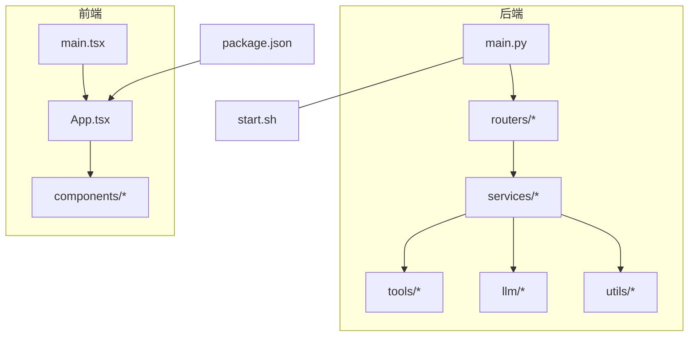
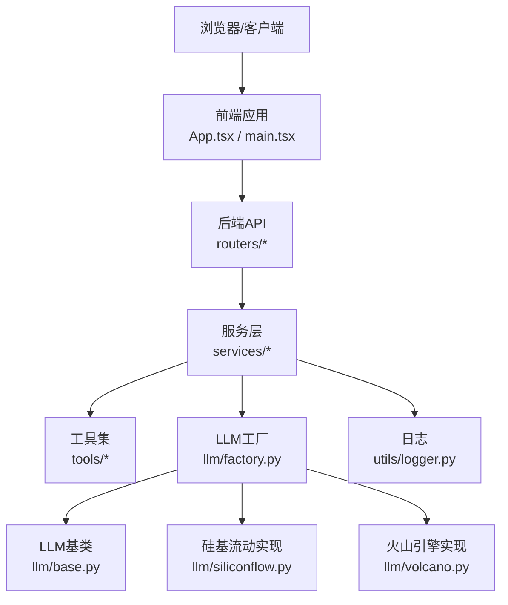
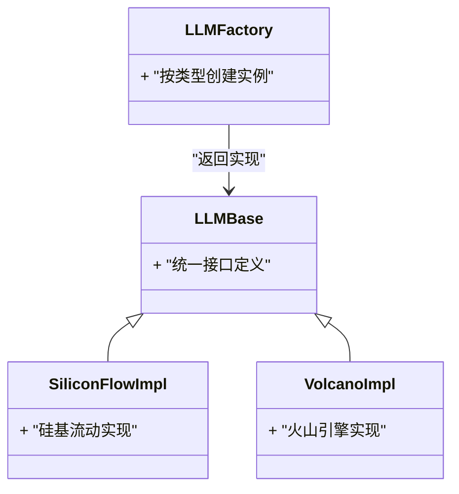
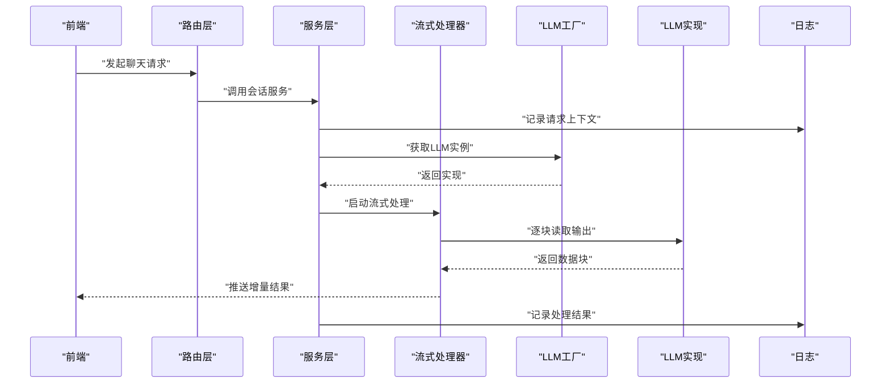
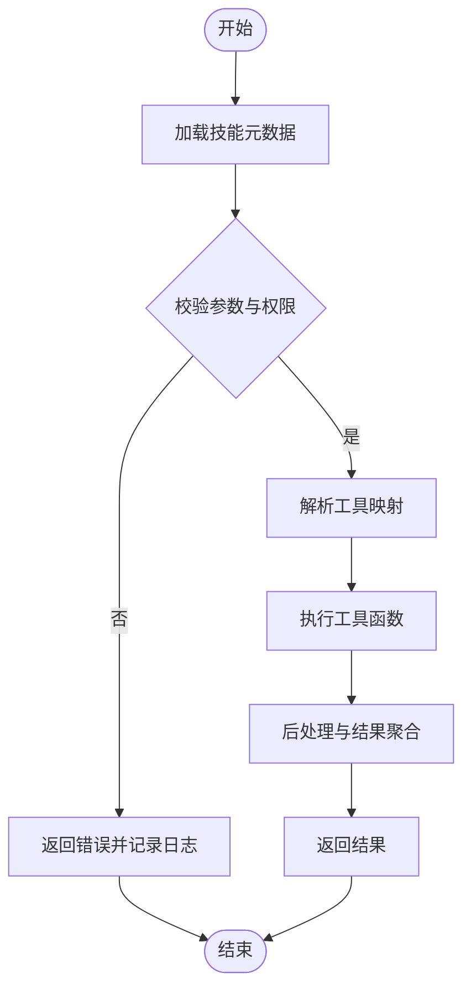
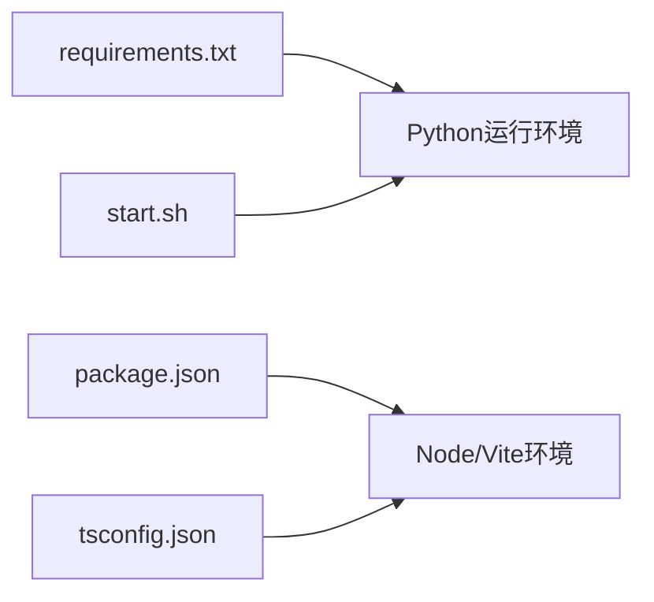

# 代码规范与最佳实践

<cite>
**本文引用的文件**   
- [backend/app/main.py](file://backend/app/main.py)
- [backend/app/llm/base.py](file://backend/app/llm/base.py)
- [backend/app/llm/factory.py](file://backend/app/llm/factory.py)
- [backend/app/llm/siliconflow.py](file://backend/app/llm/siliconflow.py)
- [backend/app/llm/volcano.py](file://backend/app/llm/volcano.py)
- [backend/app/routers/chat.py](file://backend/app/routers/chat.py)
- [backend/app/routers/settings.py](file://backend/app/routers/settings.py)
- [backend/app/services/agent_service.py](file://backend/app/services/agent_service.py)
- [backend/app/services/connection_manager.py](file://backend/app/services/connection_manager.py)
- [backend/app/services/history_service.py](file://backend/app/services/history_service.py)
- [backend/app/services/prompt.py](file://backend/app/services/prompt.py)
- [backend/app/services/skill_service.py](file://backend/app/services/skill_service.py)
- [backend/app/services/stream_processor.py](file://backend/app/services/stream_processor.py)
- [backend/app/services/workspace_service.py](file://backend/app/services/workspace_service.py)
- [backend/app/tools/audio_mixing.py](file://backend/app/tools/audio_mixing.py)
- [backend/app/tools/image_generation.py](file://backend/app/tools/image_generation.py)
- [backend/app/tools/model_3d_generation.py](file://backend/app/tools/model_3d_generation.py)
- [backend/app/tools/qwen_omni_understanding.py](file://backend/app/tools/qwen_omni_understanding.py)
- [backend/app/tools/qwen_tts.py](file://backend/app/tools/qwen_tts.py)
- [backend/app/tools/skill_tools.py](file://backend/app/tools/skill_tools.py)
- [backend/app/tools/video_concatenation.py](file://backend/app/tools/video_concatenation.py)
- [backend/app/tools/virtual_anchor_generation.py](file://backend/app/tools/virtual_anchor_generation.py)
- [backend/app/tools/volcano_image_generation.py](file://backend/app/tools/volcano_image_generation.py)
- [backend/app/tools/volcano_video_generation.py](file://backend/app/tools/volcano_video_generation.py)
- [backend/app/tools/workspace_tools.py](file://backend/app/tools/workspace_tools.py)
- [backend/app/utils/logger.py](file://backend/app/utils/logger.py)
- [backend/app/utils/__init__.py](file://backend/app/utils/__init__.py)
- [backend/app/utils/face_detection.py](file://backend/app/utils/face_detection.py)
- [backend/requirements.txt](file://backend/requirements.txt)
- [backend/start.sh](file://backend/start.sh)
- [frontend/src/App.tsx](file://frontend/src/App.tsx)
- [frontend/src/main.tsx](file://frontend/src/main.tsx)
- [frontend/src/components/ChatInterface.tsx](file://frontend/src/components/ChatInterface.tsx)
- [frontend/src/components/HomePage.tsx](file://frontend/src/components/HomePage.tsx)
- [frontend/src/components/SettingsPage.tsx](file://frontend/src/components/SettingsPage.tsx)
- [frontend/src/components/Model3DViewer.tsx](file://frontend/src/components/Model3DViewer.tsx)
- [frontend/src/components/ExcalidrawCanvas.tsx](file://frontend/src/components/ExcalidrawCanvas.tsx)
- [frontend/tsconfig.json](file://frontend/tsconfig.json)
- [frontend/package.json](file://frontend/package.json)
</cite>

## 目录
1. [简介](#简介)
2. [项目结构](#项目结构)
3. [核心组件](#核心组件)
4. [架构总览](#架构总览)
5. [详细组件分析](#详细组件分析)
6. [依赖分析](#依赖分析)
7. [性能考虑](#性能考虑)
8. [故障排查指南](#故障排查指南)
9. [结论](#结论)
10. [附录](#附录)

## 简介
本指南面向PolyStudio项目的开发与维护人员，提供统一的代码规范与最佳实践。内容覆盖：
- Python后端代码风格（PEP8）、TypeScript前端代码规范、命名约定与文件组织
- 项目特定架构模式（工厂模式、插件化技能）
- 错误处理策略与日志记录规范
- 代码审查清单、性能优化建议与安全编码实践
- Git提交信息规范、分支管理策略与版本控制最佳实践

目标是在保证一致性与可维护性的同时，提升开发效率与系统稳定性。

## 项目结构
仓库采用前后端分离的组织方式：
- backend：FastAPI后端服务，包含路由、服务层、工具集、LLM抽象与工厂、日志等
- frontend：React+Vite+TypeScript前端应用，包含页面与通用组件
- polystudio-client：客户端相关说明文档
- assets：静态资源
- scripts：运维脚本

图表来源
- [backend/app/main.py](file://backend/app/main.py)
- [backend/app/routers/chat.py](file://backend/app/routers/chat.py)
- [backend/app/routers/settings.py](file://backend/app/routers/settings.py)
- [backend/app/services/agent_service.py](file://backend/app/services/agent_service.py)
- [backend/app/services/connection_manager.py](file://backend/app/services/connection_manager.py)
- [backend/app/services/history_service.py](file://backend/app/services/history_service.py)
- [backend/app/services/prompt.py](file://backend/app/services/prompt.py)
- [backend/app/services/skill_service.py](file://backend/app/services/skill_service.py)
- [backend/app/services/stream_processor.py](file://backend/app/services/stream_processor.py)
- [backend/app/services/workspace_service.py](file://backend/app/services/workspace_service.py)
- [backend/app/tools/audio_mixing.py](file://backend/app/tools/audio_mixing.py)
- [backend/app/tools/image_generation.py](file://backend/app/tools/image_generation.py)
- [backend/app/tools/model_3d_generation.py](file://backend/app/tools/model_3d_generation.py)
- [backend/app/tools/qwen_omni_understanding.py](file://backend/app/tools/qwen_omni_understanding.py)
- [backend/app/tools/qwen_tts.py](file://backend/app/tools/qwen_tts.py)
- [backend/app/tools/skill_tools.py](file://backend/app/tools/skill_tools.py)
- [backend/app/tools/video_concatenation.py](file://backend/app/tools/video_concatenation.py)
- [backend/app/tools/virtual_anchor_generation.py](file://backend/app/tools/virtual_anchor_generation.py)
- [backend/app/tools/volcano_image_generation.py](file://backend/app/tools/volcano_image_generation.py)
- [backend/app/tools/volcano_video_generation.py](file://backend/app/tools/volcano_video_generation.py)
- [backend/app/tools/workspace_tools.py](file://backend/app/tools/workspace_tools.py)
- [backend/app/llm/base.py](file://backend/app/llm/base.py)
- [backend/app/llm/factory.py](file://backend/app/llm/factory.py)
- [backend/app/llm/siliconflow.py](file://backend/app/llm/siliconflow.py)
- [backend/app/llm/volcano.py](file://backend/app/llm/volcano.py)
- [backend/app/utils/logger.py](file://backend/app/utils/logger.py)
- [backend/start.sh](file://backend/start.sh)
- [frontend/src/App.tsx](file://frontend/src/App.tsx)
- [frontend/src/main.tsx](file://frontend/src/main.tsx)
- [frontend/src/components/ChatInterface.tsx](file://frontend/src/components/ChatInterface.tsx)
- [frontend/src/components/HomePage.tsx](file://frontend/src/components/HomePage.tsx)
- [frontend/src/components/SettingsPage.tsx](file://frontend/src/components/SettingsPage.tsx)
- [frontend/src/components/Model3DViewer.tsx](file://frontend/src/components/Model3DViewer.tsx)
- [frontend/src/components/ExcalidrawCanvas.tsx](file://frontend/src/components/ExcalidrawCanvas.tsx)
- [frontend/package.json](file://frontend/package.json)

章节来源
- [backend/app/main.py](file://backend/app/main.py)
- [backend/start.sh](file://backend/start.sh)
- [frontend/src/App.tsx](file://frontend/src/App.tsx)
- [frontend/src/main.tsx](file://frontend/src/main.tsx)
- [frontend/package.json](file://frontend/package.json)

## 核心组件
- 后端入口与路由
  - main.py：应用初始化、中间件注册、生命周期钩子
  - routers：REST接口定义，如聊天、设置等
- 服务层
  - services：业务编排与领域逻辑，如会话、历史、工作区、流式处理、技能管理等
- 工具集
  - tools：具体能力实现，如音视频处理、图像/视频生成、3D模型生成、TTS、工作区操作等
- LLM抽象与工厂
  - llm/base.py：统一LLM接口
  - llm/factory.py：按配置动态创建不同厂商的LLM实例
  - llm/siliconflow.py、llm/volcano.py：厂商实现
- 工具与日志
  - utils/logger.py：结构化日志配置
  - utils/face_detection.py：视觉辅助工具
- 前端
  - App.tsx：路由与布局
  - components：页面与交互组件
  - main.tsx：应用启动与根节点挂载

章节来源
- [backend/app/main.py](file://backend/app/main.py)
- [backend/app/routers/chat.py](file://backend/app/routers/chat.py)
- [backend/app/routers/settings.py](file://backend/app/routers/settings.py)
- [backend/app/services/agent_service.py](file://backend/app/services/agent_service.py)
- [backend/app/services/connection_manager.py](file://backend/app/services/connection_manager.py)
- [backend/app/services/history_service.py](file://backend/app/services/history_service.py)
- [backend/app/services/prompt.py](file://backend/app/services/prompt.py)
- [backend/app/services/skill_service.py](file://backend/app/services/skill_service.py)
- [backend/app/services/stream_processor.py](file://backend/app/services/stream_processor.py)
- [backend/app/services/workspace_service.py](file://backend/app/services/workspace_service.py)
- [backend/app/tools/audio_mixing.py](file://backend/app/tools/audio_mixing.py)
- [backend/app/tools/image_generation.py](file://backend/app/tools/image_generation.py)
- [backend/app/tools/model_3d_generation.py](file://backend/app/tools/model_3d_generation.py)
- [backend/app/tools/qwen_omni_understanding.py](file://backend/app/tools/qwen_omni_understanding.py)
- [backend/app/tools/qwen_tts.py](file://backend/app/tools/qwen_tts.py)
- [backend/app/tools/skill_tools.py](file://backend/app/tools/skill_tools.py)
- [backend/app/tools/video_concatenation.py](file://backend/app/tools/video_concatenation.py)
- [backend/app/tools/virtual_anchor_generation.py](file://backend/app/tools/virtual_anchor_generation.py)
- [backend/app/tools/volcano_image_generation.py](file://backend/app/tools/volcano_image_generation.py)
- [backend/app/tools/volcano_video_generation.py](file://backend/app/tools/volcano_video_generation.py)
- [backend/app/tools/workspace_tools.py](file://backend/app/tools/workspace_tools.py)
- [backend/app/llm/base.py](file://backend/app/llm/base.py)
- [backend/app/llm/factory.py](file://backend/app/llm/factory.py)
- [backend/app/llm/siliconflow.py](file://backend/app/llm/siliconflow.py)
- [backend/app/llm/volcano.py](file://backend/app/llm/volcano.py)
- [backend/app/utils/logger.py](file://backend/app/utils/logger.py)
- [frontend/src/App.tsx](file://frontend/src/App.tsx)
- [frontend/src/main.tsx](file://frontend/src/main.tsx)
- [frontend/src/components/ChatInterface.tsx](file://frontend/src/components/ChatInterface.tsx)
- [frontend/src/components/HomePage.tsx](file://frontend/src/components/HomePage.tsx)
- [frontend/src/components/SettingsPage.tsx](file://frontend/src/components/SettingsPage.tsx)
- [frontend/src/components/Model3DViewer.tsx](file://frontend/src/components/Model3DViewer.tsx)
- [frontend/src/components/ExcalidrawCanvas.tsx](file://frontend/src/components/ExcalidrawCanvas.tsx)

## 架构总览
后端采用分层架构：路由层负责请求解析与响应封装；服务层编排业务逻辑；工具层实现具体能力；LLM层通过工厂模式解耦不同厂商实现；日志与工具模块提供横切关注点。前端基于React+Vite，组件化组织页面与交互。

图表来源
- [backend/app/routers/chat.py](file://backend/app/routers/chat.py)
- [backend/app/routers/settings.py](file://backend/app/routers/settings.py)
- [backend/app/services/agent_service.py](file://backend/app/services/agent_service.py)
- [backend/app/services/connection_manager.py](file://backend/app/services/connection_manager.py)
- [backend/app/services/history_service.py](file://backend/app/services/history_service.py)
- [backend/app/services/prompt.py](file://backend/app/services/prompt.py)
- [backend/app/services/skill_service.py](file://backend/app/services/skill_service.py)
- [backend/app/services/stream_processor.py](file://backend/app/services/stream_processor.py)
- [backend/app/services/workspace_service.py](file://backend/app/services/workspace_service.py)
- [backend/app/tools/audio_mixing.py](file://backend/app/tools/audio_mixing.py)
- [backend/app/tools/image_generation.py](file://backend/app/tools/image_generation.py)
- [backend/app/tools/model_3d_generation.py](file://backend/app/tools/model_3d_generation.py)
- [backend/app/tools/qwen_omni_understanding.py](file://backend/app/tools/qwen_omni_understanding.py)
- [backend/app/tools/qwen_tts.py](file://backend/app/tools/qwen_tts.py)
- [backend/app/tools/skill_tools.py](file://backend/app/tools/skill_tools.py)
- [backend/app/tools/video_concatenation.py](file://backend/app/tools/video_concatenation.py)
- [backend/app/tools/virtual_anchor_generation.py](file://backend/app/tools/virtual_anchor_generation.py)
- [backend/app/tools/volcano_image_generation.py](file://backend/app/tools/volcano_image_generation.py)
- [backend/app/tools/volcano_video_generation.py](file://backend/app/tools/volcano_video_generation.py)
- [backend/app/tools/workspace_tools.py](file://backend/app/tools/workspace_tools.py)
- [backend/app/llm/base.py](file://backend/app/llm/base.py)
- [backend/app/llm/factory.py](file://backend/app/llm/factory.py)
- [backend/app/llm/siliconflow.py](file://backend/app/llm/siliconflow.py)
- [backend/app/llm/volcano.py](file://backend/app/llm/volcano.py)
- [backend/app/utils/logger.py](file://backend/app/utils/logger.py)
- [frontend/src/App.tsx](file://frontend/src/App.tsx)
- [frontend/src/main.tsx](file://frontend/src/main.tsx)

## 详细组件分析

### LLM工厂与插件化扩展
- 设计要点
  - base.py定义统一接口，所有厂商实现需遵循该契约
  - factory.py根据配置或类型标识返回对应实现，便于新增厂商而不改动调用方
  - siliconflow.py、volcano.py为具体厂商适配
- 扩展流程
  - 新增厂商时，实现base接口并在factory中注册
  - 保持方法签名一致，避免破坏现有调用链

图表来源
- [backend/app/llm/base.py](file://backend/app/llm/base.py)
- [backend/app/llm/factory.py](file://backend/app/llm/factory.py)
- [backend/app/llm/siliconflow.py](file://backend/app/llm/siliconflow.py)
- [backend/app/llm/volcano.py](file://backend/app/llm/volcano.py)

章节来源
- [backend/app/llm/base.py](file://backend/app/llm/base.py)
- [backend/app/llm/factory.py](file://backend/app/llm/factory.py)
- [backend/app/llm/siliconflow.py](file://backend/app/llm/siliconflow.py)
- [backend/app/llm/volcano.py](file://backend/app/llm/volcano.py)

### 聊天与会话流式处理
- 关键路径
  - 路由接收请求，服务层编排提示词、历史记录、工作区上下文
  - 流式处理器将LLM输出逐步推送至客户端
  - 连接管理器维护WebSocket或SSE连接状态
- 时序示意

图表来源
- [backend/app/routers/chat.py](file://backend/app/routers/chat.py)
- [backend/app/services/agent_service.py](file://backend/app/services/agent_service.py)
- [backend/app/services/connection_manager.py](file://backend/app/services/connection_manager.py)
- [backend/app/services/history_service.py](file://backend/app/services/history_service.py)
- [backend/app/services/prompt.py](file://backend/app/services/prompt.py)
- [backend/app/services/skill_service.py](file://backend/app/services/skill_service.py)
- [backend/app/services/stream_processor.py](file://backend/app/services/stream_processor.py)
- [backend/app/services/workspace_service.py](file://backend/app/services/workspace_service.py)
- [backend/app/llm/factory.py](file://backend/app/llm/factory.py)
- [backend/app/llm/base.py](file://backend/app/llm/base.py)
- [backend/app/llm/siliconflow.py](file://backend/app/llm/siliconflow.py)
- [backend/app/llm/volcano.py](file://backend/app/llm/volcano.py)
- [backend/app/utils/logger.py](file://backend/app/utils/logger.py)

章节来源
- [backend/app/routers/chat.py](file://backend/app/routers/chat.py)
- [backend/app/services/agent_service.py](file://backend/app/services/agent_service.py)
- [backend/app/services/connection_manager.py](file://backend/app/services/connection_manager.py)
- [backend/app/services/history_service.py](file://backend/app/services/history_service.py)
- [backend/app/services/prompt.py](file://backend/app/services/prompt.py)
- [backend/app/services/skill_service.py](file://backend/app/services/skill_service.py)
- [backend/app/services/stream_processor.py](file://backend/app/services/stream_processor.py)
- [backend/app/services/workspace_service.py](file://backend/app/services/workspace_service.py)
- [backend/app/llm/factory.py](file://backend/app/llm/factory.py)
- [backend/app/llm/base.py](file://backend/app/llm/base.py)
- [backend/app/llm/siliconflow.py](file://backend/app/llm/siliconflow.py)
- [backend/app/llm/volcano.py](file://backend/app/llm/volcano.py)
- [backend/app/utils/logger.py](file://backend/app/utils/logger.py)

### 技能与工具插件化
- 设计要点
  - skill_service.py负责技能的发现、加载与执行编排
  - tools/*提供具体能力（音视频、图像、视频、3D、TTS、工作区等）
  - 通过统一接口与参数约定，使新工具以“插件”形式接入
- 流程图

图表来源
- [backend/app/services/skill_service.py](file://backend/app/services/skill_service.py)
- [backend/app/tools/audio_mixing.py](file://backend/app/tools/audio_mixing.py)
- [backend/app/tools/image_generation.py](file://backend/app/tools/image_generation.py)
- [backend/app/tools/model_3d_generation.py](file://backend/app/tools/model_3d_generation.py)
- [backend/app/tools/qwen_omni_understanding.py](file://backend/app/tools/qwen_omni_understanding.py)
- [backend/app/tools/qwen_tts.py](file://backend/app/tools/qwen_tts.py)
- [backend/app/tools/skill_tools.py](file://backend/app/tools/skill_tools.py)
- [backend/app/tools/video_concatenation.py](file://backend/app/tools/video_concatenation.py)
- [backend/app/tools/virtual_anchor_generation.py](file://backend/app/tools/virtual_anchor_generation.py)
- [backend/app/tools/volcano_image_generation.py](file://backend/app/tools/volcano_image_generation.py)
- [backend/app/tools/volcano_video_generation.py](file://backend/app/tools/volcano_video_generation.py)
- [backend/app/tools/workspace_tools.py](file://backend/app/tools/workspace_tools.py)
- [backend/app/utils/logger.py](file://backend/app/utils/logger.py)

章节来源
- [backend/app/services/skill_service.py](file://backend/app/services/skill_service.py)
- [backend/app/tools/audio_mixing.py](file://backend/app/tools/audio_mixing.py)
- [backend/app/tools/image_generation.py](file://backend/app/tools/image_generation.py)
- [backend/app/tools/model_3d_generation.py](file://backend/app/tools/model_3d_generation.py)
- [backend/app/tools/qwen_omni_understanding.py](file://backend/app/tools/qwen_omni_understanding.py)
- [backend/app/tools/qwen_tts.py](file://backend/app/tools/qwen_tts.py)
- [backend/app/tools/skill_tools.py](file://backend/app/tools/skill_tools.py)
- [backend/app/tools/video_concatenation.py](file://backend/app/tools/video_concatenation.py)
- [backend/app/tools/virtual_anchor_generation.py](file://backend/app/tools/virtual_anchor_generation.py)
- [backend/app/tools/volcano_image_generation.py](file://backend/app/tools/volcano_image_generation.py)
- [backend/app/tools/volcano_video_generation.py](file://backend/app/tools/volcano_video_generation.py)
- [backend/app/tools/workspace_tools.py](file://backend/app/tools/workspace_tools.py)
- [backend/app/utils/logger.py](file://backend/app/utils/logger.py)

### 前端组件与页面组织
- 组件职责
  - ChatInterface：聊天界面与消息渲染
  - HomePage：首页导航与概览
  - SettingsPage：设置项管理与持久化
  - Model3DViewer：3D模型查看器
  - ExcalidrawCanvas：画布交互
- 组织原则
  - 按功能域划分组件目录，样式与逻辑分离
  - 使用TypeScript严格类型约束，减少运行时错误

章节来源
- [frontend/src/App.tsx](file://frontend/src/App.tsx)
- [frontend/src/main.tsx](file://frontend/src/main.tsx)
- [frontend/src/components/ChatInterface.tsx](file://frontend/src/components/ChatInterface.tsx)
- [frontend/src/components/HomePage.tsx](file://frontend/src/components/HomePage.tsx)
- [frontend/src/components/SettingsPage.tsx](file://frontend/src/components/SettingsPage.tsx)
- [frontend/src/components/Model3DViewer.tsx](file://frontend/src/components/Model3DViewer.tsx)
- [frontend/src/components/ExcalidrawCanvas.tsx](file://frontend/src/components/ExcalidrawCanvas.tsx)

## 依赖分析
- 后端依赖
  - requirements.txt声明Python包依赖，确保环境一致性
  - start.sh用于启动服务与环境准备
- 前端依赖
  - package.json声明Node与构建工具依赖，配合tsconfig.json进行类型检查与编译

图表来源
- [backend/requirements.txt](file://backend/requirements.txt)
- [backend/start.sh](file://backend/start.sh)
- [frontend/package.json](file://frontend/package.json)
- [frontend/tsconfig.json](file://frontend/tsconfig.json)

章节来源
- [backend/requirements.txt](file://backend/requirements.txt)
- [backend/start.sh](file://backend/start.sh)
- [frontend/package.json](file://frontend/package.json)
- [frontend/tsconfig.json](file://frontend/tsconfig.json)

## 性能考虑
- 后端
  - 流式处理：优先使用流式输出降低首字节延迟
  - 并发与异步：在I/O密集场景使用异步框架特性
  - 缓存与复用：对频繁访问的配置与模板进行缓存
  - 资源限制：对大文件与长任务设置超时与限流
- 前端
  - 懒加载与按需引入：减少首屏体积
  - 图片与媒体优化：压缩与CDN加速
  - 状态管理：避免不必要的重渲染，合理使用memo与useCallback
- 通用
  - 监控与指标：关键路径埋点，观察P95/P99延迟
  - 容量规划：根据峰值QPS评估CPU/内存/带宽

[本节为通用指导，不直接分析具体文件]

## 故障排查指南
- 日志规范
  - 使用统一日志模块记录结构化日志，包含请求ID、用户ID、耗时、错误码
  - 分级输出：DEBUG/INFO/WARNING/ERROR，生产环境默认INFO及以上
- 常见错误定位
  - 网络与外部依赖：检查超时、重试与熔断策略
  - 流式中断：确认连接管理器心跳与断线重连
  - 工具执行失败：记录输入参数与异常堆栈，便于复现
- 调试建议
  - 开启详细日志并关联追踪ID
  - 使用最小复现用例隔离问题
  - 对第三方服务增加Mock以便本地验证

章节来源
- [backend/app/utils/logger.py](file://backend/app/utils/logger.py)
- [backend/app/services/connection_manager.py](file://backend/app/services/connection_manager.py)
- [backend/app/services/stream_processor.py](file://backend/app/services/stream_processor.py)

## 结论
本指南从代码风格、架构模式、错误处理、日志规范到性能与安全提供了系统化实践建议。通过工厂模式与插件化设计，系统具备良好的可扩展性；结合严格的规范与审查清单，可有效降低缺陷率与维护成本。建议在团队内推广并持续迭代完善。

[本节为总结性内容，不直接分析具体文件]

## 附录

### Python后端代码规范（PEP8）
- 命名
  - 模块与包：小写加下划线
  - 类名：大驼峰
  - 函数与方法：小写加下划线
  - 常量：大写加下划线
- 格式
  - 行宽不超过120字符
  - 缩进4空格，空行分隔逻辑块
  - 导入分组：标准库、第三方、本地模块
- 类型注解
  - 函数签名与返回值添加类型注解
  - 复杂类型使用typing模块
- 错误处理
  - 自定义异常层次清晰
  - 捕获具体异常，避免裸except
- 日志
  - 使用统一logger，避免print
  - 敏感信息脱敏

章节来源
- [backend/app/utils/logger.py](file://backend/app/utils/logger.py)
- [backend/app/llm/base.py](file://backend/app/llm/base.py)
- [backend/app/llm/factory.py](file://backend/app/llm/factory.py)
- [backend/app/llm/siliconflow.py](file://backend/app/llm/siliconflow.py)
- [backend/app/llm/volcano.py](file://backend/app/llm/volcano.py)
- [backend/app/routers/chat.py](file://backend/app/routers/chat.py)
- [backend/app/routers/settings.py](file://backend/app/routers/settings.py)
- [backend/app/services/agent_service.py](file://backend/app/services/agent_service.py)
- [backend/app/services/connection_manager.py](file://backend/app/services/connection_manager.py)
- [backend/app/services/history_service.py](file://backend/app/services/history_service.py)
- [backend/app/services/prompt.py](file://backend/app/services/prompt.py)
- [backend/app/services/skill_service.py](file://backend/app/services/skill_service.py)
- [backend/app/services/stream_processor.py](file://backend/app/services/stream_processor.py)
- [backend/app/services/workspace_service.py](file://backend/app/services/workspace_service.py)
- [backend/app/tools/audio_mixing.py](file://backend/app/tools/audio_mixing.py)
- [backend/app/tools/image_generation.py](file://backend/app/tools/image_generation.py)
- [backend/app/tools/model_3d_generation.py](file://backend/app/tools/model_3d_generation.py)
- [backend/app/tools/qwen_omni_understanding.py](file://backend/app/tools/qwen_omni_understanding.py)
- [backend/app/tools/qwen_tts.py](file://backend/app/tools/qwen_tts.py)
- [backend/app/tools/skill_tools.py](file://backend/app/tools/skill_tools.py)
- [backend/app/tools/video_concatenation.py](file://backend/app/tools/video_concatenation.py)
- [backend/app/tools/virtual_anchor_generation.py](file://backend/app/tools/virtual_anchor_generation.py)
- [backend/app/tools/volcano_image_generation.py](file://backend/app/tools/volcano_image_generation.py)
- [backend/app/tools/volcano_video_generation.py](file://backend/app/tools/volcano_video_generation.py)
- [backend/app/tools/workspace_tools.py](file://backend/app/tools/workspace_tools.py)

### TypeScript前端代码规范
- 命名
  - 组件与类型：大驼峰
  - 变量与函数：小驼峰
  - 常量：大写加下划线
- 文件组织
  - 组件按功能域分目录，样式与逻辑分离
  - 公共逻辑抽取为hooks与utils
- 类型安全
  - 启用strict模式，避免any
  - 接口与类型定义集中管理
- 样式
  - CSS Modules或CSS-in-JS，避免全局污染
- 构建与打包
  - Vite配置优化，按需引入与Tree-shaking

章节来源
- [frontend/src/App.tsx](file://frontend/src/App.tsx)
- [frontend/src/main.tsx](file://frontend/src/main.tsx)
- [frontend/src/components/ChatInterface.tsx](file://frontend/src/components/ChatInterface.tsx)
- [frontend/src/components/HomePage.tsx](file://frontend/src/components/HomePage.tsx)
- [frontend/src/components/SettingsPage.tsx](file://frontend/src/components/SettingsPage.tsx)
- [frontend/src/components/Model3DViewer.tsx](file://frontend/src/components/Model3DViewer.tsx)
- [frontend/src/components/ExcalidrawCanvas.tsx](file://frontend/src/components/ExcalidrawCanvas.tsx)
- [frontend/tsconfig.json](file://frontend/tsconfig.json)
- [frontend/package.json](file://frontend/package.json)

### 命名约定与文件组织结构
- 后端
  - app/{routers,services,tools,llm,utils}
  - 每个模块单一职责，避免跨层耦合
- 前端
  - src/{components,pages,hooks,utils,assets}
  - 组件内聚，样式与逻辑分离
- 共享
  - 类型定义与常量集中管理，避免重复

章节来源
- [backend/app/main.py](file://backend/app/main.py)
- [frontend/src/App.tsx](file://frontend/src/App.tsx)

### 架构模式与插件化
- 工厂模式
  - 通过工厂创建不同LLM实现，屏蔽差异
- 插件化技能
  - 技能与服务解耦，工具以插件形式接入
- 扩展建议
  - 新增能力遵循统一接口与注册机制

章节来源
- [backend/app/llm/factory.py](file://backend/app/llm/factory.py)
- [backend/app/services/skill_service.py](file://backend/app/services/skill_service.py)
- [backend/app/tools/skill_tools.py](file://backend/app/tools/skill_tools.py)

### 错误处理策略
- 统一异常类型与错误码
- 外层捕获并转换为HTTP响应
- 记录完整上下文与堆栈
- 对外部依赖增加重试与降级

章节来源
- [backend/app/utils/logger.py](file://backend/app/utils/logger.py)
- [backend/app/services/stream_processor.py](file://backend/app/services/stream_processor.py)
- [backend/app/services/connection_manager.py](file://backend/app/services/connection_manager.py)

### 日志记录规范
- 结构化字段：时间戳、级别、模块、请求ID、用户ID、耗时、错误码
- 脱敏：隐藏密钥、令牌、个人信息
- 采样：高频日志采样以降低开销

章节来源
- [backend/app/utils/logger.py](file://backend/app/utils/logger.py)

### 代码审查清单
- 正确性
  - 边界条件与异常路径是否覆盖
  - 类型与接口是否一致
- 可读性
  - 命名清晰、注释必要且准确
  - 函数长度与复杂度合理
- 安全性
  - 输入校验与权限控制
  - 敏感信息未泄露
- 性能
  - 无N+1查询与阻塞I/O
  - 缓存与批处理合理使用
- 可维护性
  - 模块化与低耦合
  - 测试覆盖与回归用例

[本节为通用指导，不直接分析具体文件]

### 性能优化建议
- 后端
  - 流式输出、异步I/O、连接池、缓存热点数据
- 前端
  - 懒加载、虚拟列表、图片压缩与CDN
- 基础设施
  - 水平扩展、负载均衡、监控告警

[本节为通用指导，不直接分析具体文件]

### 安全编码实践
- 输入校验与白名单
- 认证与授权
- 密钥与凭据管理（环境变量与密钥管理服务）
- 防注入与XSS防护
- 审计与日志脱敏

[本节为通用指导，不直接分析具体文件]

### Git提交信息规范
- 格式
  - type(scope): subject
  - body可选，描述动机与变更影响
- 常用type
  - feat、fix、docs、style、refactor、perf、test、chore
- 示例
  - feat(llm): 新增火山引擎LLM实现
  - fix(skills): 修复工具参数校验缺失

[本节为通用指导，不直接分析具体文件]

### 分支管理策略
- 主分支
  - main/master：稳定发布
- 开发分支
  - develop：集成开发
- 功能分支
  - feature/*：新功能
- 修复分支
  - hotfix/*：紧急修复
- 发布分支
  - release/*：预发布与回滚

[本节为通用指导，不直接分析具体文件]

### 版本控制最佳实践
- 语义化版本
- 变更日志自动生成
- 标签与发布说明
- 代码评审合并策略

[本节为通用指导，不直接分析具体文件]