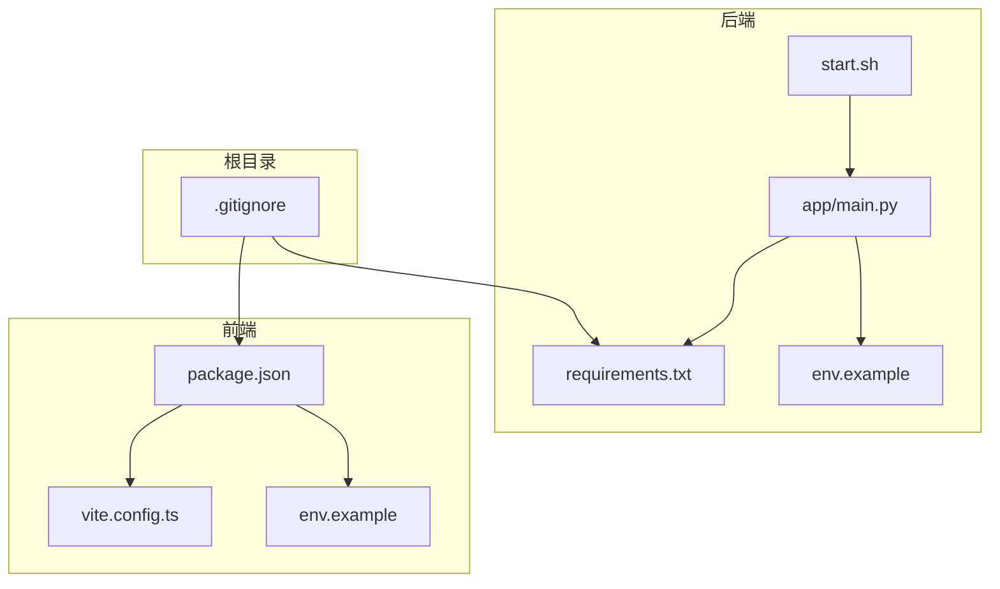
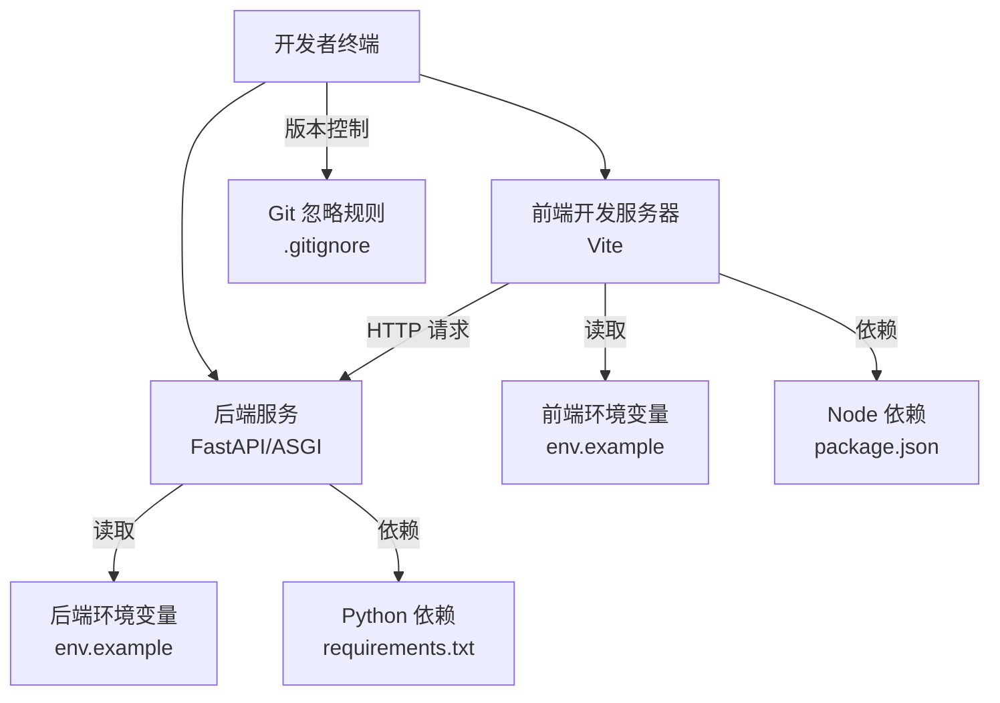
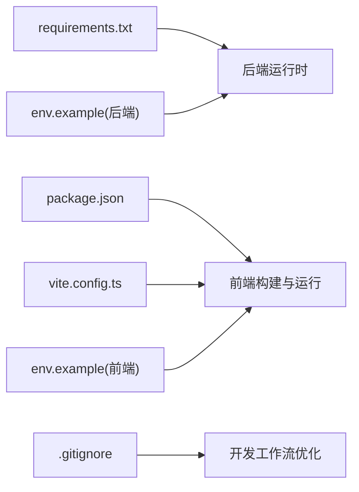

# 开发环境搭建

<cite>
**本文引用的文件**   
- [backend/requirements.txt](file://backend/requirements.txt)
- [backend/env.example](file://backend/env.example)
- [backend/start.sh](file://backend/start.sh)
- [frontend/package.json](file://frontend/package.json)
- [frontend/vite.config.ts](file://frontend/vite.config.ts)
- [frontend/env.example](file://frontend/env.example)
- [backend/app/main.py](file://backend/app/main.py)
- [.gitignore](file://.gitignore)
</cite>

## 更新摘要
**变更内容**   
- 更新了后端依赖管理部分，反映 requirements.txt 中的新包和移除的未使用依赖
- 增强了 .gitignore 配置说明，改进开发工作流程
- 优化了依赖安装和环境配置的详细说明

## 目录
1. [简介](#简介)
2. [项目结构](#项目结构)
3. [核心组件](#核心组件)
4. [架构总览](#架构总览)
5. [详细组件分析](#详细组件分析)
6. [依赖关系分析](#依赖关系分析)
7. [性能考虑](#性能考虑)
8. [故障排查指南](#故障排查指南)
9. [结论](#结论)
10. [附录](#附录) 

## 简介
本指南面向首次参与项目的开发者，提供从零开始搭建本地开发环境的完整步骤。内容涵盖：
- Python 与 Node.js 版本要求与环境准备
- 后端依赖安装（基于 requirements.txt）
- 前端依赖配置与启动（基于 package.json 与 Vite 配置）
- 环境变量配置示例（env.example 的使用）
- 数据库初始化步骤说明
- 第三方服务 API 密钥配置
- Docker 容器化开发环境设置
- IDE 配置建议与调试工具安装
- 常见环境问题排查与解决方案

## 项目结构
本项目采用前后端分离的目录组织方式：
- backend：Python 后端服务，包含应用入口、路由、服务层、工具与技能等
- frontend：TypeScript + React + Vite 前端工程
- polystudio-client：客户端相关文档或资源

图表来源
- [backend/app/main.py:1-200](file://backend/app/main.py#L1-L200)
- [backend/requirements.txt:1-200](file://backend/requirements.txt#L1-L200)
- [backend/env.example:1-200](file://backend/env.example#L1-L200)
- [backend/start.sh:1-200](file://backend/start.sh#L1-L200)
- [frontend/package.json:1-200](file://frontend/package.json#L1-L200)
- [frontend/vite.config.ts:1-200](file://frontend/vite.config.ts#L1-L200)
- [frontend/env.example:1-200](file://frontend/env.example#L1-L200)
- [.gitignore:1-200](file://.gitignore#L1-L200)

章节来源
- [backend/app/main.py:1-200](file://backend/app/main.py#L1-L200)
- [backend/requirements.txt:1-200](file://backend/requirements.txt#L1-L200)
- [backend/env.example:1-200](file://backend/env.example#L1-L200)
- [backend/start.sh:1-200](file://backend/start.sh#L1-L200)
- [frontend/package.json:1-200](file://frontend/package.json#L1-L200)
- [frontend/vite.config.ts:1-200](file://frontend/vite.config.ts#L1-L200)
- [frontend/env.example:1-200](file://frontend/env.example#L1-L200)
- [.gitignore:1-200](file://.gitignore#L1-L200)

## 核心组件
- 后端入口与运行脚本
  - 应用主入口位于后端 app 目录下，负责加载配置、注册路由与启动服务
  - start.sh 用于统一启动后端服务，便于在本地或容器中执行
- 前端构建与开发服务器
  - package.json 定义依赖与脚本命令
  - vite.config.ts 配置开发服务器、代理与构建选项
  - env.example 提供前端环境变量模板
- 版本控制与开发工作流
  - .gitignore 配置文件优化了开发工作流程，排除不必要的文件和缓存

章节来源
- [backend/app/main.py:1-200](file://backend/app/main.py#L1-L200)
- [backend/start.sh:1-200](file://backend/start.sh#L1-L200)
- [frontend/package.json:1-200](file://frontend/package.json#L1-L200)
- [frontend/vite.config.ts:1-200](file://frontend/vite.config.ts#L1-L200)
- [.gitignore:1-200](file://.gitignore#L1-L200)

## 架构总览
下图展示了本地开发时前后端交互与关键配置文件的关系。

图表来源
- [backend/app/main.py:1-200](file://backend/app/main.py#L1-L200)
- [backend/requirements.txt:1-200](file://backend/requirements.txt#L1-L200)
- [backend/env.example:1-200](file://backend/env.example#L1-L200)
- [frontend/package.json:1-200](file://frontend/package.json#L1-L200)
- [frontend/vite.config.ts:1-200](file://frontend/vite.config.ts#L1-L200)
- [frontend/env.example:1-200](file://frontend/env.example#L1-L200)
- [.gitignore:1-200](file://.gitignore#L1-L200)

## 详细组件分析

### 后端环境搭建（Python）
- 版本要求
  - 建议使用 Python 3.10+（以 requirements.txt 中实际依赖为准）
- 虚拟环境
  - 在项目根目录创建并激活虚拟环境
- 安装依赖
  - 进入 backend 目录，使用 pip 安装 requirements.txt 中的依赖
  - **更新** 已优化依赖列表，移除了未使用的包，添加了新的功能依赖
- 环境变量
  - 复制 backend/env.example 为 .env，并按需填写必要变量
- 启动服务
  - 使用 backend/start.sh 或直接通过 uvicorn/gunicorn 启动后端服务
- 数据库初始化
  - 若项目使用数据库，请在 .env 中配置连接信息后执行迁移或初始化脚本（具体命令请参考项目内脚本或 README）

**更新** 后端依赖已更新，包含新的功能包和优化后的依赖管理

章节来源
- [backend/requirements.txt:1-200](file://backend/requirements.txt#L1-L200)
- [backend/env.example:1-200](file://backend/env.example#L1-L200)
- [backend/start.sh:1-200](file://backend/start.sh#L1-L200)
- [backend/app/main.py:1-200](file://backend/app/main.py#L1-L200)

### 前端环境搭建（Node.js）
- 版本要求
  - 建议使用 Node.js 18+（以 package.json 引擎约束为准）
- 包管理器
  - 推荐使用 npm 或 pnpm；确保与 package-lock.json 一致
- 安装依赖
  - 进入 frontend 目录，执行依赖安装命令
- 环境变量
  - 复制 frontend/env.example 为 .env.development 或 .env，按需填写
- 启动开发服务器
  - 使用 package.json 提供的脚本命令启动 Vite 开发服务器
- 代理与跨域
  - 如需访问后端接口，可在 vite.config.ts 中配置代理规则

章节来源
- [frontend/package.json:1-200](file://frontend/package.json#L1-L200)
- [frontend/vite.config.ts:1-200](file://frontend/vite.config.ts#L1-L200)
- [frontend/env.example:1-200](file://frontend/env.example#L1-L200)

### 环境变量配置示例
- 后端环境变量
  - 参考 backend/env.example，将必要字段复制到 .env 文件中
  - 常见字段包括：数据库连接、日志级别、第三方服务密钥等
- 前端环境变量
  - 参考 frontend/env.example，将必要字段复制到 .env 或 .env.development
  - 常见字段包括：后端 API 地址、功能开关等

章节来源
- [backend/env.example:1-200](file://backend/env.example#L1-L200)
- [frontend/env.example:1-200](file://frontend/env.example#L1-L200)

### 数据库初始化步骤
- 确认数据库类型与连接参数已在 .env 中正确配置
- 执行数据库迁移或初始化脚本（如存在）
- 验证表结构与种子数据是否按预期生成

章节来源
- [backend/env.example:1-200](file://backend/env.example#L1-L200)
- [backend/start.sh:1-200](file://backend/start.sh#L1-L200)

### 第三方服务 API 密钥配置
- 在后端 .env 中填入各服务的 API Key、Secret 等凭据
- 在前端 .env 中仅暴露必要的公开配置，避免泄露敏感信息
- 启动服务后，可通过日志或健康检查接口验证集成状态

章节来源
- [backend/env.example:1-200](file://backend/env.example#L1-L200)
- [frontend/env.example:1-200](file://frontend/env.example#L1-L200)

### Docker 容器化开发环境设置
- 基础镜像
  - 选择与 Python/Node.js 版本匹配的官方镜像
- 多阶段构建
  - 构建阶段安装依赖并打包前端产物
  - 运行阶段仅包含运行时依赖与静态资源
- 环境变量注入
  - 通过 docker-compose 或 docker run 的 -e/--env-file 注入 .env
- 端口映射与卷挂载
  - 将源码目录挂载到容器以实现热更新
  - 映射前后端端口以便本地访问
- 启动流程
  - 先启动数据库与缓存等基础设施
  - 再启动后端与前端服务

章节来源
- [backend/start.sh:1-200](file://backend/start.sh#L1-L200)
- [backend/env.example:1-200](file://backend/env.example#L1-L200)
- [frontend/package.json:1-200](file://frontend/package.json#L1-L200)

### IDE 配置建议与调试工具
- VS Code 推荐扩展
  - Python、Pylance、Docker、ESLint、Prettier、Thunder Client
- 断点调试
  - 后端：使用 debugpy 或 IDE 内置调试器附加进程
  - 前端：使用浏览器开发者工具与 Source Map
- 代码格式化与校验
  - 启用保存时自动格式化与 Lint 检查
- 环境变量管理
  - 使用 IDE 的环境变量面板或 .env 插件统一管理
- **新增** Git 工作流优化
  - 利用 .gitignore 配置排除不必要的文件，提升开发效率

章节来源
- [.gitignore:1-200](file://.gitignore#L1-L200)

### Git 忽略规则配置
- **更新** .gitignore 配置文件已优化，提供更好的开发工作流程支持
- 主要排除的文件类型包括：
  - Python 缓存文件（__pycache__、*.pyc）
  - 虚拟环境目录（venv、.venv）
  - 前端构建产物（node_modules、dist）
  - IDE 配置文件
  - 操作系统特定文件
- 这些规则有助于保持仓库整洁，避免提交不必要的文件

章节来源
- [.gitignore:1-200](file://.gitignore#L1-L200)

## 依赖关系分析
- 后端依赖
  - 由 requirements.txt 声明，安装后提供 Web 框架、异步处理、工具库等能力
  - **更新** 依赖列表已优化，移除了未使用的包，添加了新的功能依赖
- 前端依赖
  - 由 package.json 声明，包含 UI 框架、构建工具与开发辅助库
- 构建与运行
  - 后端通过 start.sh 统一入口启动
  - 前端通过 Vite 提供开发服务器与热重载
- **新增** 版本控制优化
  - .gitignore 规则确保只提交必要的源代码文件

图表来源
- [backend/requirements.txt:1-200](file://backend/requirements.txt#L1-L200)
- [frontend/package.json:1-200](file://frontend/package.json#L1-L200)
- [frontend/vite.config.ts:1-200](file://frontend/vite.config.ts#L1-L200)
- [backend/env.example:1-200](file://backend/env.example#L1-L200)
- [frontend/env.example:1-200](file://frontend/env.example#L1-L200)
- [.gitignore:1-200](file://.gitignore#L1-L200)

章节来源
- [backend/requirements.txt:1-200](file://backend/requirements.txt#L1-L200)
- [frontend/package.json:1-200](file://frontend/package.json#L1-L200)
- [frontend/vite.config.ts:1-200](file://frontend/vite.config.ts#L1-L200)
- [.gitignore:1-200](file://.gitignore#L1-L200)

## 性能考虑
- 后端
  - 合理设置并发与线程池大小
  - 对大对象与流式响应进行内存优化
- 前端
  - 开启按需加载与代码分割
  - 合理使用缓存与 CDN
- 数据库
  - 建立必要索引，避免全表扫描
  - 控制事务范围，减少锁竞争

## 故障排查指南
- 依赖安装失败
  - 检查 Python/Node.js 版本是否与 requirements.txt/package.json 匹配
  - 清理缓存后重试安装
  - **更新** 如果遇到问题，尝试重新安装依赖以确保使用最新的优化版本
- 环境变量未生效
  - 确认 .env 文件名与位置正确
  - 重启服务使新配置生效
- 端口占用
  - 修改端口或释放占用进程
- 跨域问题
  - 在 vite.config.ts 中配置代理或在后端设置 CORS
- 第三方服务不可用
  - 核对 API Key 与网络连通性
  - 查看后端日志定位错误码
- **新增** Git 相关问题
  - 检查 .gitignore 配置是否正确排除不必要的文件
  - 确保提交前清理临时文件和缓存

章节来源
- [backend/env.example:1-200](file://backend/env.example#L1-L200)
- [frontend/env.example:1-200](file://frontend/env.example#L1-L200)
- [frontend/vite.config.ts:1-200](file://frontend/vite.config.ts#L1-L200)
- [.gitignore:1-200](file://.gitignore#L1-L200)

## 结论
按照本指南完成 Python 与 Node.js 环境准备、依赖安装、环境变量配置与前后端启动后，即可在本地进行开发与联调。建议在团队内统一环境与配置规范，结合 Docker 提升一致性，并通过完善的日志与监控快速定位问题。**更新** 随着后端依赖的优化和 .gitignore 配置的改进，开发体验将更加流畅高效。

## 附录
- 常用命令速查
  - 后端：安装依赖、启动服务、查看日志
  - 前端：安装依赖、启动开发服务器、构建产物
- 参考路径
  - 后端入口与启动脚本
  - 前端构建与代理配置
  - 环境变量模板
  - **新增** Git 忽略规则配置

章节来源
- [backend/app/main.py:1-200](file://backend/app/main.py#L1-L200)
- [backend/start.sh:1-200](file://backend/start.sh#L1-L200)
- [frontend/package.json:1-200](file://frontend/package.json#L1-L200)
- [frontend/vite.config.ts:1-200](file://frontend/vite.config.ts#L1-L200)
- [.gitignore:1-200](file://.gitignore#L1-L200)