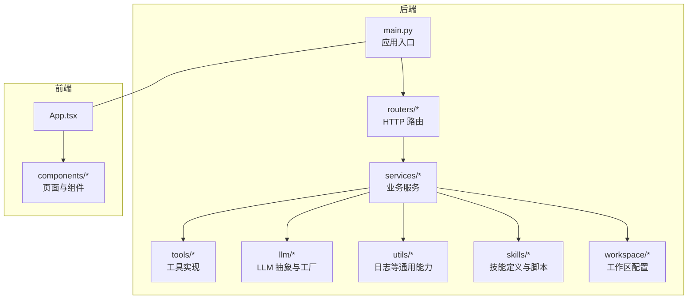
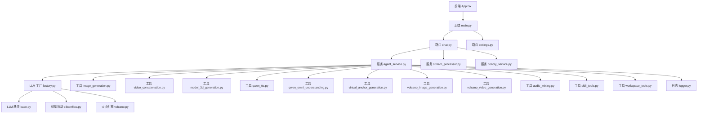
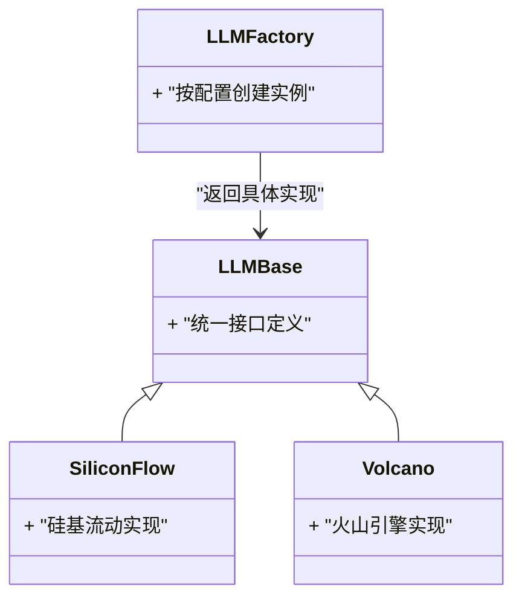
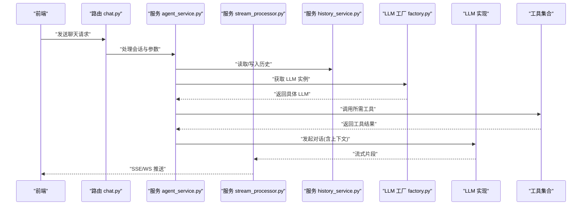
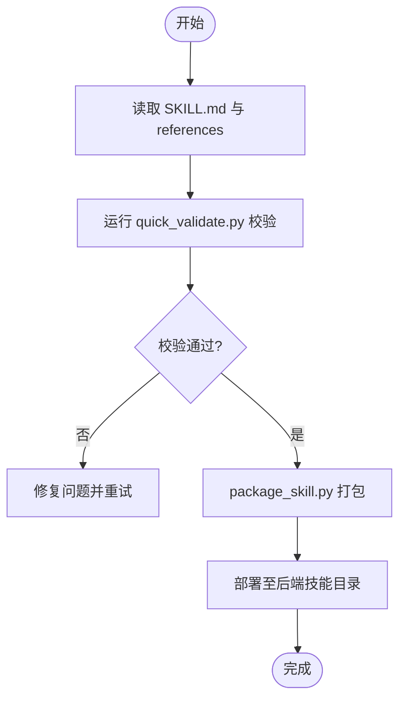
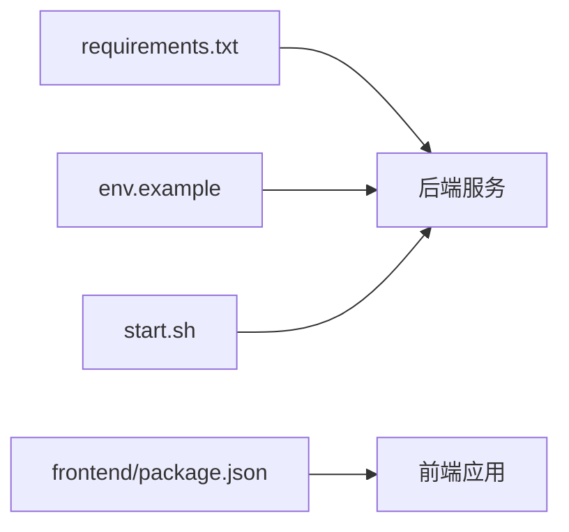

# 开发者指南

<cite>
**本文引用的文件**   
- [backend/app/main.py](file://backend/app/main.py)
- [backend/app/llm/base.py](file://backend/app/llm/base.py)
- [backend/app/llm/factory.py](file://backend/app/llm/factory.py)
- [backend/app/llm/siliconflow.py](file://backend/app/llm/siliconflow.py)
- [backend/app/llm/volcano.py](file://backend/app/llm/volcano.py)
- [backend/app/routers/chat.py](file://backend/app/routers/chat.py)
- [backend/app/routers/settings.py](file://backend/app/routers/settings.py)
- [backend/app/services/agent_service.py](file://backend/app/services/agent_service.py)
- [backend/app/services/connection_manager.py](file://backend/app/services/connection_manager.py)
- [backend/app/services/history_service.py](file://backend/app/services/history_service.py)
- [backend/app/services/prompt.py](file://backend/app/services/prompt.py)
- [backend/app/services/skill_service.py](file://backend/app/services/skill_service.py)
- [backend/app/services/stream_processor.py](file://backend/app/services/stream_processor.py)
- [backend/app/services/workspace_service.py](file://backend/app/services/workspace_service.py)
- [backend/app/tools/image_generation.py](file://backend/app/tools/image_generation.py)
- [backend/app/tools/video_concatenation.py](file://backend/app/tools/video_concatenation.py)
- [backend/app/tools/model_3d_generation.py](file://backend/app/tools/model_3d_generation.py)
- [backend/app/tools/qwen_tts.py](file://backend/app/tools/qwen_tts.py)
- [backend/app/tools/qwen_omni_understanding.py](file://backend/app/tools/qwen_omni_understanding.py)
- [backend/app/tools/virtual_anchor_generation.py](file://backend/app/tools/virtual_anchor_generation.py)
- [backend/app/tools/volcano_image_generation.py](file://backend/app/tools/volcano_image_generation.py)
- [backend/app/tools/volcano_video_generation.py](file://backend/app/tools/volcano_video_generation.py)
- [backend/app/tools/audio_mixing.py](file://backend/app/tools/audio_mixing.py)
- [backend/app/tools/skill_tools.py](file://backend/app/tools/skill_tools.py)
- [backend/app/tools/workspace_tools.py](file://backend/app/tools/workspace_tools.py)
- [backend/app/utils/logger.py](file://backend/app/utils/logger.py)
- [backend/app/utils/__init__.py](file://backend/app/utils/__init__.py)
- [backend/skills/public/skill-creator/SKILL.md](file://backend/skills/public/skill-creator/SKILL.md)
- [backend/skills/public/skill-creator/scripts/init_skill.py](file://backend/skills/public/skill-creator/scripts/init_skill.py)
- [backend/skills/public/skill-creator/scripts/package_skill.py](file://backend/skills/public/skill-creator/scripts/package_skill.py)
- [backend/skills/public/skill-creator/scripts/quick_validate.py](file://backend/skills/public/skill-creator/scripts/quick_validate.py)
- [backend/workspace/TOOLS.md](file://backend/workspace/TOOLS.md)
- [backend/workspace/AGENTS.md](file://backend/workspace/AGENTS.md)
- [backend/workspace/MEMORY.md](file://backend/workspace/MEMORY.md)
- [backend/workspace/SOUL.md](file://backend/workspace/SOUL.md)
- [backend/workspace/IDENTITY.md](file://backend/workspace/IDENTITY.md)
- [backend/workspace/USER.md](file://backend/workspace/USER.md)
- [backend/start.sh](file://backend/start.sh)
- [backend/env.example](file://backend/env.example)
- [backend/requirements.txt](file://backend/requirements.txt)
- [frontend/src/App.tsx](file://frontend/src/App.tsx)
- [frontend/src/components/ChatInterface.tsx](file://frontend/src/components/ChatInterface.tsx)
- [frontend/src/components/SettingsPage.tsx](file://frontend/src/components/SettingsPage.tsx)
- [frontend/package.json](file://frontend/package.json)
</cite>

## 目录
1. [简介](#简介)
2. [项目结构](#项目结构)
3. [核心组件](#核心组件)
4. [架构总览](#架构总览)
5. [详细组件分析](#详细组件分析)
6. [依赖分析](#依赖分析)
7. [性能考虑](#性能考虑)
8. [故障排查指南](#故障排查指南)
9. [结论](#结论)
10. [附录](#附录)

## 简介
本指南面向希望参与 PolyStudio 后端与前端开发的工程师，覆盖开发环境搭建、代码规范、提交流程、测试要求、扩展开发（新 LLM 提供商集成、自定义工具、技能）、插件与第三方集成、调试与性能分析、代码审查标准、贡献流程、问题报告模板、功能请求流程、版本管理与迁移策略等。目标是帮助开发者快速上手并高质量地贡献代码。

## 项目结构
仓库采用前后端分离的模块化结构：
- backend：FastAPI 后端服务，包含 LLM 抽象层、路由、服务层、工具集、技能包与工作区配置。
- frontend：React + TypeScript 前端应用，提供聊天界面与设置页等。
- polystudio-client：客户端相关说明文档。

图表来源
- [backend/app/main.py](file://backend/app/main.py)
- [backend/app/routers/chat.py](file://backend/app/routers/chat.py)
- [backend/app/services/agent_service.py](file://backend/app/services/agent_service.py)
- [backend/app/llm/factory.py](file://backend/app/llm/factory.py)
- [backend/app/tools/image_generation.py](file://backend/app/tools/image_generation.py)
- [backend/app/utils/logger.py](file://backend/app/utils/logger.py)
- [frontend/src/App.tsx](file://frontend/src/App.tsx)

章节来源
- [backend/app/main.py](file://backend/app/main.py)
- [backend/app/routers/chat.py](file://backend/app/routers/chat.py)
- [backend/app/services/agent_service.py](file://backend/app/services/agent_service.py)
- [backend/app/llm/factory.py](file://backend/app/llm/factory.py)
- [backend/app/tools/image_generation.py](file://backend/app/tools/image_generation.py)
- [backend/app/utils/logger.py](file://backend/app/utils/logger.py)
- [frontend/src/App.tsx](file://frontend/src/App.tsx)

## 核心组件
- 应用入口与启动：负责加载配置、注册路由、启动服务。
- 路由层：暴露 HTTP/WebSocket 接口，如聊天与设置。
- 服务层：编排 Agent、历史、流式处理、工作区与技能等核心业务。
- LLM 抽象与工厂：统一多厂商模型接入，集中管理实例化与选择。
- 工具集：图像生成、视频拼接、3D 模型生成、语音合成、理解类工具等。
- 技能系统：通过 SKILL.md 与脚本驱动的技能开发与打包验证。
- 工作区配置：Agent 身份、记忆、工具清单、用户画像等。

章节来源
- [backend/app/main.py](file://backend/app/main.py)
- [backend/app/routers/chat.py](file://backend/app/routers/chat.py)
- [backend/app/services/agent_service.py](file://backend/app/services/agent_service.py)
- [backend/app/services/skill_service.py](file://backend/app/services/skill_service.py)
- [backend/app/llm/factory.py](file://backend/app/llm/factory.py)
- [backend/app/tools/image_generation.py](file://backend/app/tools/image_generation.py)
- [backend/workspace/TOOLS.md](file://backend/workspace/TOOLS.md)
- [backend/workspace/AGENTS.md](file://backend/workspace/AGENTS.md)

## 架构总览
后端以 FastAPI 为 Web 框架，路由将请求分发到服务层；服务层组合 LLM 抽象、工具与外部资源；LLM 通过工厂按配置动态创建具体实现；前端通过 API 与后端交互。

图表来源
- [backend/app/main.py](file://backend/app/main.py)
- [backend/app/routers/chat.py](file://backend/app/routers/chat.py)
- [backend/app/services/agent_service.py](file://backend/app/services/agent_service.py)
- [backend/app/services/stream_processor.py](file://backend/app/services/stream_processor.py)
- [backend/app/services/history_service.py](file://backend/app/services/history_service.py)
- [backend/app/llm/factory.py](file://backend/app/llm/factory.py)
- [backend/app/llm/base.py](file://backend/app/llm/base.py)
- [backend/app/llm/siliconflow.py](file://backend/app/llm/siliconflow.py)
- [backend/app/llm/volcano.py](file://backend/app/llm/volcano.py)
- [backend/app/tools/image_generation.py](file://backend/app/tools/image_generation.py)
- [backend/app/tools/video_concatenation.py](file://backend/app/tools/video_concatenation.py)
- [backend/app/tools/model_3d_generation.py](file://backend/app/tools/model_3d_generation.py)
- [backend/app/tools/qwen_tts.py](file://backend/app/tools/qwen_tts.py)
- [backend/app/tools/qwen_omni_understanding.py](file://backend/app/tools/qwen_omni_understanding.py)
- [backend/app/tools/virtual_anchor_generation.py](file://backend/app/tools/virtual_anchor_generation.py)
- [backend/app/tools/volcano_image_generation.py](file://backend/app/tools/volcano_image_generation.py)
- [backend/app/tools/volcano_video_generation.py](file://backend/app/tools/volcano_video_generation.py)
- [backend/app/tools/audio_mixing.py](file://backend/app/tools/audio_mixing.py)
- [backend/app/tools/skill_tools.py](file://backend/app/tools/skill_tools.py)
- [backend/app/tools/workspace_tools.py](file://backend/app/tools/workspace_tools.py)
- [backend/app/utils/logger.py](file://backend/app/utils/logger.py)
- [frontend/src/App.tsx](file://frontend/src/App.tsx)

## 详细组件分析

### LLM 抽象与工厂
- 设计要点
  - 基类定义统一接口，屏蔽不同厂商差异。
  - 工厂根据配置或参数返回具体实现，支持热插拔新增厂商。
  - 典型实现包括硅基流动与火山引擎。
- 扩展点
  - 新增 LLM 提供商：继承基类，实现必要方法，并在工厂中注册。
  - 错误处理与重试：在实现层封装网络异常与限流策略。
  - 可观测性：记录调用耗时、Token 用量与错误码。

图表来源
- [backend/app/llm/base.py](file://backend/app/llm/base.py)
- [backend/app/llm/siliconflow.py](file://backend/app/llm/siliconflow.py)
- [backend/app/llm/volcano.py](file://backend/app/llm/volcano.py)
- [backend/app/llm/factory.py](file://backend/app/llm/factory.py)

章节来源
- [backend/app/llm/base.py](file://backend/app/llm/base.py)
- [backend/app/llm/factory.py](file://backend/app/llm/factory.py)
- [backend/app/llm/siliconflow.py](file://backend/app/llm/siliconflow.py)
- [backend/app/llm/volcano.py](file://backend/app/llm/volcano.py)

### 聊天与服务编排
- 关键流程
  - 路由接收请求，解析参数与会话上下文。
  - 服务层组装提示词、调用 LLM、执行工具、维护历史与流式输出。
  - 连接管理器支撑 WebSocket 长连接。
- 可扩展性
  - 工具按需挂载，服务层通过统一接口调用。
  - 流式处理器支持增量推送，降低首字节延迟。

图表来源
- [backend/app/routers/chat.py](file://backend/app/routers/chat.py)
- [backend/app/services/agent_service.py](file://backend/app/services/agent_service.py)
- [backend/app/services/stream_processor.py](file://backend/app/services/stream_processor.py)
- [backend/app/services/history_service.py](file://backend/app/services/history_service.py)
- [backend/app/llm/factory.py](file://backend/app/llm/factory.py)
- [backend/app/tools/image_generation.py](file://backend/app/tools/image_generation.py)
- [backend/app/tools/video_concatenation.py](file://backend/app/tools/video_concatenation.py)
- [backend/app/tools/model_3d_generation.py](file://backend/app/tools/model_3d_generation.py)
- [backend/app/tools/qwen_tts.py](file://backend/app/tools/qwen_tts.py)
- [backend/app/tools/qwen_omni_understanding.py](file://backend/app/tools/qwen_omni_understanding.py)
- [backend/app/tools/virtual_anchor_generation.py](file://backend/app/tools/virtual_anchor_generation.py)
- [backend/app/tools/volcano_image_generation.py](file://backend/app/tools/volcano_image_generation.py)
- [backend/app/tools/volcano_video_generation.py](file://backend/app/tools/volcano_video_generation.py)
- [backend/app/tools/audio_mixing.py](file://backend/app/tools/audio_mixing.py)
- [backend/app/tools/skill_tools.py](file://backend/app/tools/skill_tools.py)
- [backend/app/tools/workspace_tools.py](file://backend/app/tools/workspace_tools.py)

章节来源
- [backend/app/routers/chat.py](file://backend/app/routers/chat.py)
- [backend/app/services/agent_service.py](file://backend/app/services/agent_service.py)
- [backend/app/services/stream_processor.py](file://backend/app/services/stream_processor.py)
- [backend/app/services/history_service.py](file://backend/app/services/history_service.py)

### 工具与技能系统
- 工具
  - 图像/视频/3D 生成、TTS、理解类、工作区与技能辅助工具等。
  - 建议每个工具保持单一职责，输入输出明确，错误信息结构化。
- 技能
  - 基于 SKILL.md 描述行为与参考材料，配合初始化、打包与校验脚本。
  - 公共技能位于 skills/public，自定义技能位于 skills/custom。

图表来源
- [backend/skills/public/skill-creator/SKILL.md](file://backend/skills/public/skill-creator/SKILL.md)
- [backend/skills/public/skill-creator/scripts/init_skill.py](file://backend/skills/public/skill-creator/scripts/init_skill.py)
- [backend/skills/public/skill-creator/scripts/package_skill.py](file://backend/skills/public/skill-creator/scripts/package_skill.py)
- [backend/skills/public/skill-creator/scripts/quick_validate.py](file://backend/skills/public/skill-creator/scripts/quick_validate.py)

章节来源
- [backend/app/tools/image_generation.py](file://backend/app/tools/image_generation.py)
- [backend/app/tools/video_concatenation.py](file://backend/app/tools/video_concatenation.py)
- [backend/app/tools/model_3d_generation.py](file://backend/app/tools/model_3d_generation.py)
- [backend/app/tools/qwen_tts.py](file://backend/app/tools/qwen_tts.py)
- [backend/app/tools/qwen_omni_understanding.py](file://backend/app/tools/qwen_omni_understanding.py)
- [backend/app/tools/virtual_anchor_generation.py](file://backend/app/tools/virtual_anchor_generation.py)
- [backend/app/tools/volcano_image_generation.py](file://backend/app/tools/volcano_image_generation.py)
- [backend/app/tools/volcano_video_generation.py](file://backend/app/tools/volcano_video_generation.py)
- [backend/app/tools/audio_mixing.py](file://backend/app/tools/audio_mixing.py)
- [backend/app/tools/skill_tools.py](file://backend/app/tools/skill_tools.py)
- [backend/app/tools/workspace_tools.py](file://backend/app/tools/workspace_tools.py)
- [backend/skills/public/skill-creator/SKILL.md](file://backend/skills/public/skill-creator/SKILL.md)
- [backend/skills/public/skill-creator/scripts/init_skill.py](file://backend/skills/public/skill-creator/scripts/init_skill.py)
- [backend/skills/public/skill-creator/scripts/package_skill.py](file://backend/skills/public/skill-creator/scripts/package_skill.py)
- [backend/skills/public/skill-creator/scripts/quick_validate.py](file://backend/skills/public/skill-creator/scripts/quick_validate.py)

### 工作区与 Agent 配置
- 工作区文件用于定义 Agent 身份、记忆、灵魂、工具清单与用户画像等。
- TOOLS.md 描述可用工具与使用约定，便于 Agent 正确选择与调用。

章节来源
- [backend/workspace/AGENTS.md](file://backend/workspace/AGENTS.md)
- [backend/workspace/MEMORY.md](file://backend/workspace/MEMORY.md)
- [backend/workspace/SOUL.md](file://backend/workspace/SOUL.md)
- [backend/workspace/IDENTITY.md](file://backend/workspace/IDENTITY.md)
- [backend/workspace/USER.md](file://backend/workspace/USER.md)
- [backend/workspace/TOOLS.md](file://backend/workspace/TOOLS.md)

## 依赖分析
- 后端依赖
  - Python 运行时与第三方库由 requirements.txt 管理。
  - 环境变量示例见 env.example，启动脚本 start.sh 用于一键拉起服务。
- 前端依赖
  - 使用 package.json 管理依赖，Vite 构建，TypeScript 编译。

图表来源
- [backend/requirements.txt](file://backend/requirements.txt)
- [backend/env.example](file://backend/env.example)
- [backend/start.sh](file://backend/start.sh)
- [frontend/package.json](file://frontend/package.json)

章节来源
- [backend/requirements.txt](file://backend/requirements.txt)
- [backend/env.example](file://backend/env.example)
- [backend/start.sh](file://backend/start.sh)
- [frontend/package.json](file://frontend/package.json)

## 性能考虑
- 流式输出：优先使用流式处理器减少首字节延迟，避免一次性聚合大响应。
- 并发与连接：合理设置连接池与超时，避免阻塞型 IO 影响吞吐。
- 缓存与去重：对热点数据（如工具产物）进行缓存，减少重复计算与外部调用。
- 资源限制：对大模型与媒体生成任务设置配额与超时，防止资源耗尽。
- 监控与指标：记录关键路径耗时、错误率与外部调用状态，便于定位瓶颈。

[本节为通用指导，不直接分析具体文件]

## 故障排查指南
- 日志与可观测性
  - 使用 utils.logger 统一记录关键事件与错误堆栈，便于回溯。
- 常见问题
  - 环境变量缺失：检查 env.example 与实际配置是否一致。
  - 依赖未安装：确认 requirements.txt 已安装，Python 版本匹配。
  - 端口冲突：修改启动脚本或服务监听端口。
  - 外部服务不可用：检查密钥、网络与限流策略。
- 调试技巧
  - 本地断点调试：在路由或服务层打断点，观察入参与中间结果。
  - 最小复现：剥离无关工具与技能，聚焦问题链路。
  - 前端联调：打开浏览器控制台与网络面板，核对请求与 SSE/WS 消息。

章节来源
- [backend/app/utils/logger.py](file://backend/app/utils/logger.py)
- [backend/env.example](file://backend/env.example)
- [backend/start.sh](file://backend/start.sh)
- [frontend/src/components/ChatInterface.tsx](file://frontend/src/components/ChatInterface.tsx)

## 结论
本指南梳理了 PolyStudio 的后端与前端架构、核心组件与扩展点，提供了从环境搭建到扩展开发、调试与性能优化的完整路径。遵循本文档的规范与流程，有助于提升协作效率与交付质量。

[本节为总结性内容，不直接分析具体文件]

## 附录

### 开发环境搭建
- 后端
  - 安装 Python 依赖：参考 requirements.txt。
  - 复制并填写环境变量：参考 env.example。
  - 启动服务：参考 start.sh。
- 前端
  - 安装依赖与构建：参考 frontend/package.json。
  - 启动开发服务器：参考 Vite 默认命令。
- 联调
  - 确保前后端端口与跨域配置正确。
  - 使用浏览器开发者工具与后端日志联合定位问题。

章节来源
- [backend/requirements.txt](file://backend/requirements.txt)
- [backend/env.example](file://backend/env.example)
- [backend/start.sh](file://backend/start.sh)
- [frontend/package.json](file://frontend/package.json)

### 代码规范
- 命名与风格
  - 模块与函数使用小写下划线；类名使用帕斯卡命名。
  - 类型注解与文档字符串齐全，保持可读性。
- 错误处理
  - 对外暴露结构化错误码与消息，内部保留详细堆栈。
- 日志
  - 关键路径打点，敏感信息脱敏。
- 测试
  - 为新增逻辑编写单测与集成用例，保证覆盖率与稳定性。

[本节为通用规范，不直接分析具体文件]

### 提交流程
- 分支策略
  - 主分支保护，特性分支开发，合并前需通过 CI。
- 提交信息
  - 使用语义化提交信息，描述变更范围与动机。
- 代码审查
  - 至少一名审查者批准，关注可维护性与安全性。
- 发布
  - 版本号遵循语义化版本，更新变更日志与迁移说明。

[本节为通用流程，不直接分析具体文件]

### 测试要求
- 单元测试：覆盖核心函数与边界条件。
- 集成测试：验证路由与服务编排的正确性。
- 端到端测试：模拟真实用户场景，覆盖关键路径。
- 性能测试：对热点接口进行压测，评估吞吐与延迟。

[本节为通用要求，不直接分析具体文件]

### 扩展开发教程

#### 新 LLM 提供商集成
- 步骤
  - 继承 LLM 基类，实现必要接口。
  - 在工厂中注册新实现，支持按配置选择。
  - 补充错误处理、重试与可观测性。
  - 编写测试与文档，更新工作区工具清单。
- 参考
  - 基类与工厂：参见 llm/base.py、llm/factory.py。
  - 已有实现：参见 llm/siliconflow.py、llm/volcano.py。

章节来源
- [backend/app/llm/base.py](file://backend/app/llm/base.py)
- [backend/app/llm/factory.py](file://backend/app/llm/factory.py)
- [backend/app/llm/siliconflow.py](file://backend/app/llm/siliconflow.py)
- [backend/app/llm/volcano.py](file://backend/app/llm/volcano.py)

#### 自定义工具开发
- 步骤
  - 在 tools 目录下新增模块，定义清晰的输入输出与错误码。
  - 在服务层注册与编排，确保幂等与超时控制。
  - 编写单测与集成用例，覆盖异常路径。
  - 更新工作区 TOOLS.md，便于 Agent 发现与调用。
- 参考
  - 现有工具：参见 image_generation.py、video_concatenation.py、model_3d_generation.py、qwen_tts.py、qwen_omni_understanding.py、virtual_anchor_generation.py、volcano_image_generation.py、volcano_video_generation.py、audio_mixing.py、skill_tools.py、workspace_tools.py。

章节来源
- [backend/app/tools/image_generation.py](file://backend/app/tools/image_generation.py)
- [backend/app/tools/video_concatenation.py](file://backend/app/tools/video_concatenation.py)
- [backend/app/tools/model_3d_generation.py](file://backend/app/tools/model_3d_generation.py)
- [backend/app/tools/qwen_tts.py](file://backend/app/tools/qwen_tts.py)
- [backend/app/tools/qwen_omni_understanding.py](file://backend/app/tools/qwen_omni_understanding.py)
- [backend/app/tools/virtual_anchor_generation.py](file://backend/app/tools/virtual_anchor_generation.py)
- [backend/app/tools/volcano_image_generation.py](file://backend/app/tools/volcano_image_generation.py)
- [backend/app/tools/volcano_video_generation.py](file://backend/app/tools/volcano_video_generation.py)
- [backend/app/tools/audio_mixing.py](file://backend/app/tools/audio_mixing.py)
- [backend/app/tools/skill_tools.py](file://backend/app/tools/skill_tools.py)
- [backend/app/tools/workspace_tools.py](file://backend/app/tools/workspace_tools.py)
- [backend/workspace/TOOLS.md](file://backend/workspace/TOOLS.md)

#### 技能开发完整流程
- 步骤
  - 使用 init_skill.py 初始化技能骨架。
  - 编写 SKILL.md 与 references，描述行为与参考材料。
  - 使用 quick_validate.py 进行自检，修复问题。
  - 使用 package_skill.py 打包并发布到后端技能目录。
- 参考
  - 技能脚本与说明：参见 public/skill-creator 下的脚本与 SKILL.md。

章节来源
- [backend/skills/public/skill-creator/SKILL.md](file://backend/skills/public/skill-creator/SKILL.md)
- [backend/skills/public/skill-creator/scripts/init_skill.py](file://backend/skills/public/skill-creator/scripts/init_skill.py)
- [backend/skills/public/skill-creator/scripts/package_skill.py](file://backend/skills/public/skill-creator/scripts/package_skill.py)
- [backend/skills/public/skill-creator/scripts/quick_validate.py](file://backend/skills/public/skill-creator/scripts/quick_validate.py)

### 插件与第三方集成指南
- 插件化原则
  - 通过工厂与配置实现热插拔，避免硬编码。
  - 对外暴露稳定接口，内部实现可替换。
- 第三方集成
  - 统一鉴权与重试机制，记录调用指标。
  - 失败降级与熔断策略，保障整体可用性。

[本节为通用指导，不直接分析具体文件]

### 调试技巧与性能分析工具
- 调试
  - 后端：使用 IDE 断点与结构化日志。
  - 前端：使用浏览器开发者工具与网络面板。
- 性能分析
  - 服务端：采集关键路径耗时与外部调用统计。
  - 客户端：测量首字节时间与渲染耗时。

[本节为通用指导，不直接分析具体文件]

### 代码审查标准
- 可读性：命名清晰、注释充分、复杂度可控。
- 健壮性：错误处理完善、边界条件覆盖。
- 可测试性：易于构造测试数据与模拟外部依赖。
- 可维护性：低耦合、高内聚、遵循既有模式。

[本节为通用标准，不直接分析具体文件]

### 贡献指南
- 提交前自检：格式化、单测、集成测试通过。
- 提交信息：语义化，描述变更范围与动机。
- 审查流程：至少一名审查者批准，关注安全与性能。
- 合并后：更新文档与变更日志。

[本节为通用流程，不直接分析具体文件]

### 问题报告模板
- 标题：简明扼要描述问题。
- 环境：操作系统、Python/Node 版本、依赖版本。
- 复现步骤：最小复现步骤与期望/实际结果。
- 日志与截图：附带关键日志与界面截图。
- 附加信息：相关配置、网络拓扑与外部服务状态。

[本节为通用模板，不直接分析具体文件]

### 功能请求流程
- 需求描述：背景、目标与验收标准。
- 方案建议：技术路线与风险评估。
- 评审与排期：团队评审通过后纳入迭代计划。
- 实现与验收：按规范实现并通过测试与审查。

[本节为通用流程，不直接分析具体文件]

### 版本管理策略与向后兼容
- 版本策略：语义化版本，主版本破坏性变更，次版本新增功能，补丁版本修复问题。
- 兼容性保证：尽量保持接口稳定，废弃字段渐进淘汰。
- 迁移指南：重大变更提供迁移脚本与说明，分阶段灰度发布。

[本节为通用策略，不直接分析具体文件]

### 迁移指南
- 数据迁移：提供脚本与回滚方案。
- 配置迁移：更新 env.example 并提供对照表。
- 依赖升级：逐步升级第三方库，回归测试覆盖关键路径。

[本节为通用指导，不直接分析具体文件]