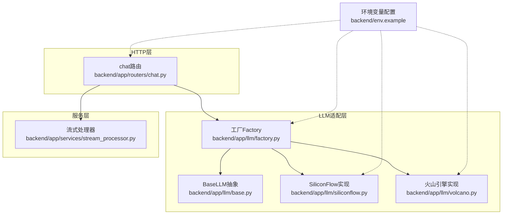
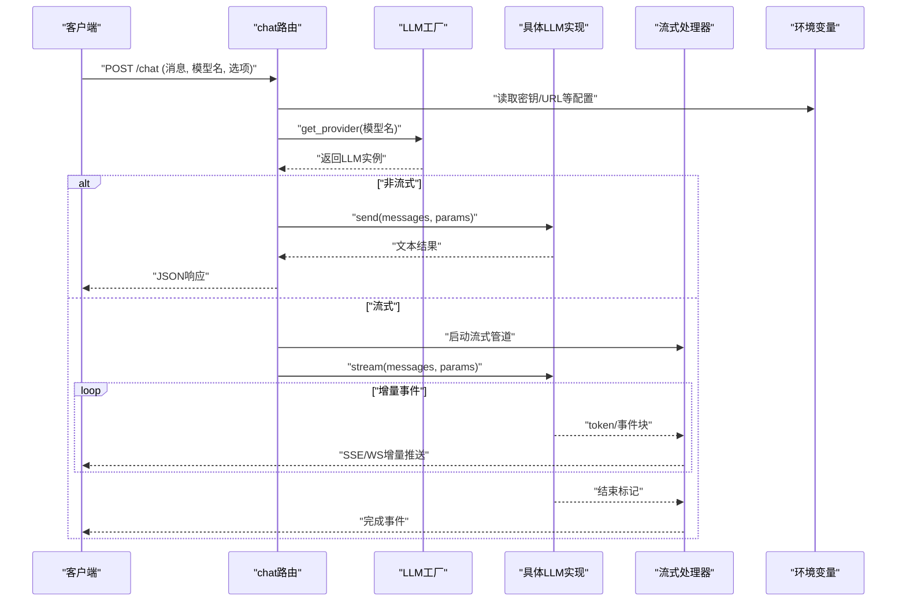
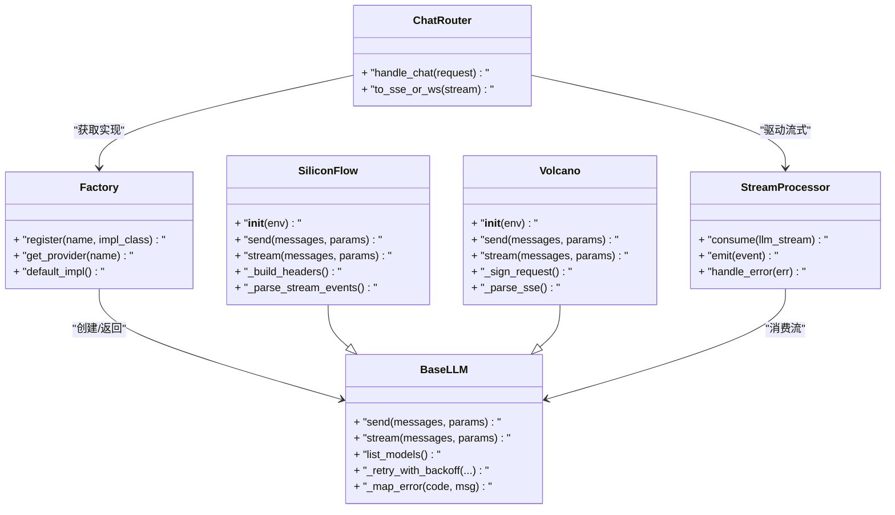

# LLM提供商集成

<cite>
**本文引用的文件**   
- [backend/app/llm/base.py](file://backend/app/llm/base.py)
- [backend/app/llm/factory.py](file://backend/app/llm/factory.py)
- [backend/app/llm/siliconflow.py](file://backend/app/llm/siliconflow.py)
- [backend/app/llm/volcano.py](file://backend/app/llm/volcano.py)
- [backend/app/routers/chat.py](file://backend/app/routers/chat.py)
- [backend/app/services/stream_processor.py](file://backend/app/services/stream_processor.py)
- [backend/env.example](file://backend/env.example)
</cite>

## 目录
1. [简介](#简介)
2. [项目结构](#项目结构)
3. [核心组件](#核心组件)
4. [架构总览](#架构总览)
5. [详细组件分析](#详细组件分析)
6. [依赖关系分析](#依赖关系分析)
7. [性能考虑](#性能考虑)
8. [故障排查指南](#故障排查指南)
9. [结论](#结论)
10. [附录](#附录)

## 简介
本指南面向需要在系统中接入新的LLM提供商的开发者，围绕抽象接口设计、工厂注册机制、流式响应处理、消息格式转换与参数映射、认证与安全配置、测试与调试实践进行系统化说明。文档以SiliconFlow和火山引擎为示例，展示从配置到调用的完整路径，帮助快速扩展更多厂商。

## 项目结构
后端采用分层组织：
- llm层：定义抽象基类、工厂以及具体厂商实现（SiliconFlow、火山引擎）
- routers层：HTTP路由入口，接收聊天请求并委派给服务层
- services层：业务编排，包含流式处理器等
- utils/env：环境变量读取与校验

图表来源
- [backend/app/routers/chat.py](file://backend/app/routers/chat.py)
- [backend/app/llm/base.py](file://backend/app/llm/base.py)
- [backend/app/llm/factory.py](file://backend/app/llm/factory.py)
- [backend/app/llm/siliconflow.py](file://backend/app/llm/siliconflow.py)
- [backend/app/llm/volcano.py](file://backend/app/llm/volcano.py)
- [backend/app/services/stream_processor.py](file://backend/app/services/stream_processor.py)
- [backend/env.example](file://backend/env.example)

章节来源
- [backend/app/routers/chat.py](file://backend/app/routers/chat.py)
- [backend/app/llm/base.py](file://backend/app/llm/base.py)
- [backend/app/llm/factory.py](file://backend/app/llm/factory.py)
- [backend/app/llm/siliconflow.py](file://backend/app/llm/siliconflow.py)
- [backend/app/llm/volcano.py](file://backend/app/llm/volcano.py)
- [backend/app/services/stream_processor.py](file://backend/app/services/stream_processor.py)
- [backend/env.example](file://backend/env.example)

## 核心组件
- BaseLLM抽象基类
  - 职责：统一LLM调用契约，定义必需方法（如发送消息、流式生成、模型元信息获取等），并提供通用能力（如重试、超时、日志、错误分类）。
  - 关键要求：子类必须实现非流式与流式接口；所有对外暴露的方法需保证异常可诊断、返回结构一致。
- 工厂模式（Factory）
  - 职责：根据配置或名称动态创建具体LLM实例；集中管理注册表；提供默认实现与回退策略。
  - 注册方式：通过显式注册函数或装饰器将新实现加入注册表；支持按名称解析。
- 具体实现（SiliconFlow、火山引擎）
  - 职责：封装各自API的认证、请求构造、响应解析、错误码映射、流式事件处理。
  - 参数映射：将上层统一参数转换为各厂商特定字段；对缺失参数做安全默认值。
- 流式处理器（StreamProcessor）
  - 职责：消费LLM流式输出，聚合增量片段，转换为前端友好的事件流；处理断流、重连、超时与错误上报。

章节来源
- [backend/app/llm/base.py](file://backend/app/llm/base.py)
- [backend/app/llm/factory.py](file://backend/app/llm/factory.py)
- [backend/app/llm/siliconflow.py](file://backend/app/llm/siliconflow.py)
- [backend/app/llm/volcano.py](file://backend/app/llm/volcano.py)
- [backend/app/services/stream_processor.py](file://backend/app/services/stream_processor.py)

## 架构总览
下图展示了从HTTP请求到LLM供应商的端到端流程，包括流式响应的处理路径。

图表来源
- [backend/app/routers/chat.py](file://backend/app/routers/chat.py)
- [backend/app/llm/factory.py](file://backend/app/llm/factory.py)
- [backend/app/llm/base.py](file://backend/app/llm/base.py)
- [backend/app/llm/siliconflow.py](file://backend/app/llm/siliconflow.py)
- [backend/app/llm/volcano.py](file://backend/app/llm/volcano.py)
- [backend/app/services/stream_processor.py](file://backend/app/services/stream_processor.py)
- [backend/env.example](file://backend/env.example)

## 详细组件分析

### BaseLLM抽象类
- 设计要点
  - 定义统一的调用签名：非流式与流式方法；可选的模型列表/能力查询方法。
  - 统一错误分类：网络错误、鉴权失败、限流、参数错误、服务端异常等，便于上层重试与降级。
  - 通用能力：重试策略、超时控制、请求ID追踪、结构化日志。
- 实现要求
  - 子类必须实现：发送消息、流式生成、基础参数校验。
  - 建议实现：模型能力探测、默认参数填充、敏感信息脱敏日志。
- 复杂度与性能
  - 流式接口应尽可能零拷贝传递字节/字符串片段，避免中间缓冲放大。
  - 重试与退避策略应避免雪崩，结合熔断与短路。

章节来源
- [backend/app/llm/base.py](file://backend/app/llm/base.py)

### 工厂模式（Factory）
- 职责
  - 维护“名称→实现类”的注册表。
  - 根据传入的模型名或厂商标识解析并实例化对应LLM对象。
  - 提供默认实现与未知厂商的回退策略。
- 注册新提供商
  - 在实现模块中调用注册函数或将实现类声明为已注册。
  - 确保名称唯一且与上游配置一致。
- 生命周期
  - 工厂通常单例；LLM实例按需创建并可缓存连接池。

章节来源
- [backend/app/llm/factory.py](file://backend/app/llm/factory.py)

### SiliconFlow集成示例
- 认证配置
  - 使用环境变量注入API Key与Endpoint URL。
  - 在初始化时校验必填项，缺失则抛出明确错误。
- API调用封装
  - 将统一消息体转换为厂商要求的消息数组与参数。
  - 非流式：一次性请求并解析完整响应。
  - 流式：逐块解析事件，提取增量token并透传。
- 错误处理
  - 将厂商错误码映射为内部错误类型（鉴权、限流、参数、系统）。
  - 针对限流实施指数退避重试。
- 参数映射
  - 温度、最大长度、TopP等超参映射到厂商字段；未提供时使用安全默认值。

章节来源
- [backend/app/llm/siliconflow.py](file://backend/app/llm/siliconflow.py)
- [backend/env.example](file://backend/env.example)

### 火山引擎集成示例
- 认证配置
  - 使用环境变量注入AccessKey/SecretKey及Region/Endpoint。
  - 支持签名算法选择与Header注入。
- API调用封装
  - 构建请求签名，组装消息与参数。
  - 流式：解析Server-Sent Events或分块传输，合并增量内容。
- 错误处理
  - 区分鉴权失败、资源不存在、配额不足、网络异常等场景。
  - 对瞬时错误自动重试，对确定性错误直接返回。
- 参数映射
  - 将统一参数映射至火山引擎字段；对不支持的参数进行忽略或告警。

章节来源
- [backend/app/llm/volcano.py](file://backend/app/llm/volcano.py)
- [backend/env.example](file://backend/env.example)

### 流式响应处理（StreamProcessor）
- 目标
  - 将底层LLM的增量事件转换为稳定的前端事件流。
  - 处理中断、超时、乱序与重复片段。
- 关键逻辑
  - 建立生产者-消费者管道：生产者消费LLM流，消费者推送至客户端。
  - 事件规范化：开始、增量、结束、错误四类事件。
  - 背压与限速：防止下游过载。
- 容错
  - 心跳检测与自动重连；错误事件携带上下文以便定位。

章节来源
- [backend/app/services/stream_processor.py](file://backend/app/services/stream_processor.py)

### HTTP路由与编排（Chat Router）
- 职责
  - 解析请求参数、校验输入、加载配置。
  - 通过工厂获取LLM实例，选择非流式或流式路径。
  - 将流式管道与SSE/WS通道对接。
- 错误与日志
  - 捕获并分类异常，返回标准错误结构。
  - 记录请求ID、耗时、模型名与状态码。

章节来源
- [backend/app/routers/chat.py](file://backend/app/routers/chat.py)

## 依赖关系分析
- 耦合与内聚
  - 路由仅依赖工厂与流处理器，不感知具体厂商，保持高内聚低耦合。
  - 工厂集中管理实现注册，新增厂商无需改动路由。
- 外部依赖
  - 环境变量用于配置敏感信息与端点。
  - 第三方HTTP/流式库由具体实现引入，被隔离在实现层。

图表来源
- [backend/app/llm/base.py](file://backend/app/llm/base.py)
- [backend/app/llm/factory.py](file://backend/app/llm/factory.py)
- [backend/app/llm/siliconflow.py](file://backend/app/llm/siliconflow.py)
- [backend/app/llm/volcano.py](file://backend/app/llm/volcano.py)
- [backend/app/services/stream_processor.py](file://backend/app/services/stream_processor.py)
- [backend/app/routers/chat.py](file://backend/app/routers/chat.py)

章节来源
- [backend/app/llm/base.py](file://backend/app/llm/base.py)
- [backend/app/llm/factory.py](file://backend/app/llm/factory.py)
- [backend/app/llm/siliconflow.py](file://backend/app/llm/siliconflow.py)
- [backend/app/llm/volcano.py](file://backend/app/llm/volcano.py)
- [backend/app/services/stream_processor.py](file://backend/app/services/stream_processor.py)
- [backend/app/routers/chat.py](file://backend/app/routers/chat.py)

## 性能考虑
- 连接复用与池化：每个厂商实现应复用HTTP连接，减少握手开销。
- 流式零拷贝：尽量直接转发字节流，避免全量拼接。
- 重试与退避：对瞬态错误采用指数退避+抖动，限制最大重试次数。
- 背压与限速：流处理器对下游推送速率进行控制，避免内存暴涨。
- 超时与取消：设置合理的请求与流式超时，及时释放资源。

## 故障排查指南
- 常见问题
  - 鉴权失败：检查环境变量是否注入正确，确认签名算法与Header。
  - 限流/配额不足：观察错误码，调整重试间隔与并发度。
  - 流式中断：检查网络稳定性与服务端心跳，必要时触发重连。
  - 参数不兼容：核对参数映射表，对不支持字段进行过滤或告警。
- 调试技巧
  - 开启详细日志，记录请求ID、入参摘要、响应头与错误栈。
  - 使用最小复现用例与固定模型，逐步缩小问题范围。
  - 本地Mock厂商接口，验证流式管道与错误分支。

章节来源
- [backend/app/llm/base.py](file://backend/app/llm/base.py)
- [backend/app/services/stream_processor.py](file://backend/app/services/stream_processor.py)

## 结论
通过抽象基类与工厂模式，系统实现了LLM提供商的可插拔集成。SiliconFlow与火山引擎的示例展示了认证、参数映射、错误处理与流式处理的完整链路。遵循本文的配置与安全最佳实践，可高效扩展更多厂商并保持系统稳定与可观测性。

## 附录

### 环境变量配置清单
- 通用
  - APP_LOG_LEVEL：日志级别
  - APP_TIMEOUT：默认请求超时秒数
- SiliconFlow
  - SILICONFLOW_API_KEY：API密钥
  - SILICONFLOW_BASE_URL：基础地址
- 火山引擎
  - VOLCANO_ACCESS_KEY：访问密钥
  - VOLCANO_SECRET_KEY：秘密密钥
  - VOLCANO_REGION：区域
  - VOLCANO_ENDPOINT：服务地址

章节来源
- [backend/env.example](file://backend/env.example)

### 新提供商接入步骤
- 新建实现类
  - 继承BaseLLM，实现非流式与流式方法。
  - 实现认证、请求构造、响应解析与错误映射。
- 注册到工厂
  - 在工厂注册表中登记名称与实现类。
- 配置环境变量
  - 在env.example中添加必要变量，并在运行环境中注入。
- 路由与测试
  - 使用现有路由进行端到端验证；编写单元测试覆盖正常与异常路径。
- 安全与合规
  - 禁止在日志中输出密钥；使用最小权限原则；启用HTTPS与证书校验。

章节来源
- [backend/app/llm/base.py](file://backend/app/llm/base.py)
- [backend/app/llm/factory.py](file://backend/app/llm/factory.py)
- [backend/env.example](file://backend/env.example)