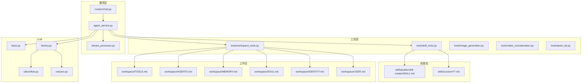
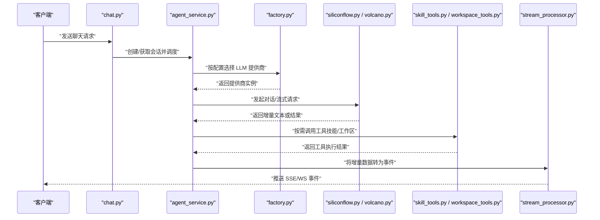
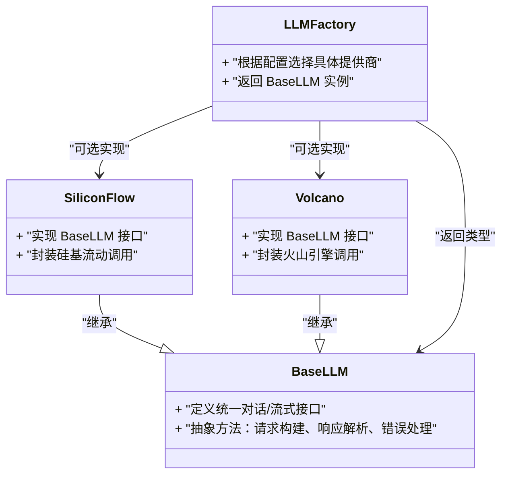
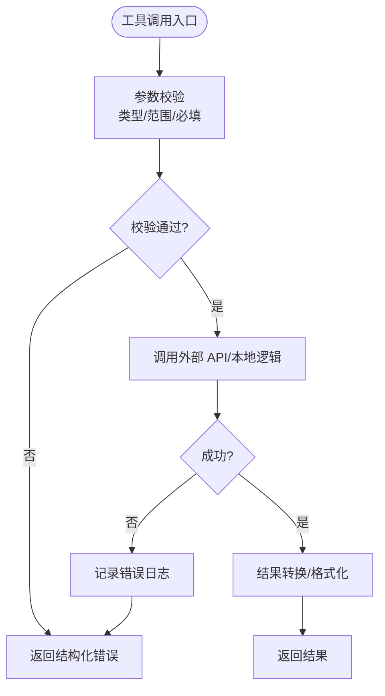
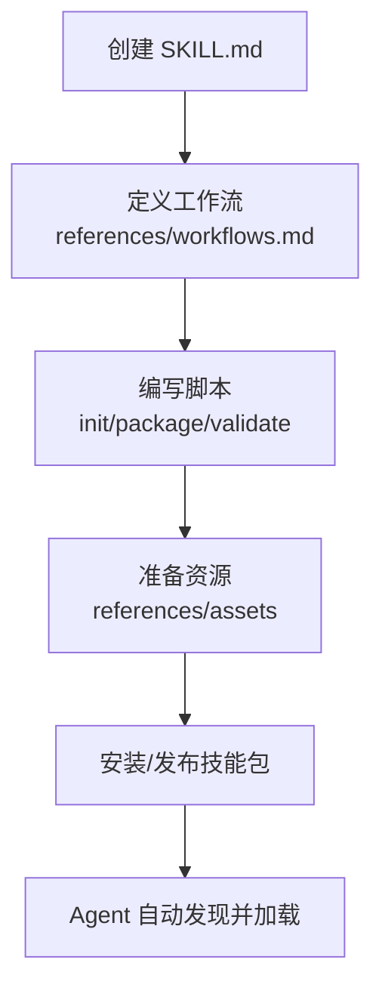
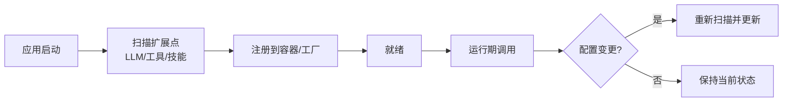
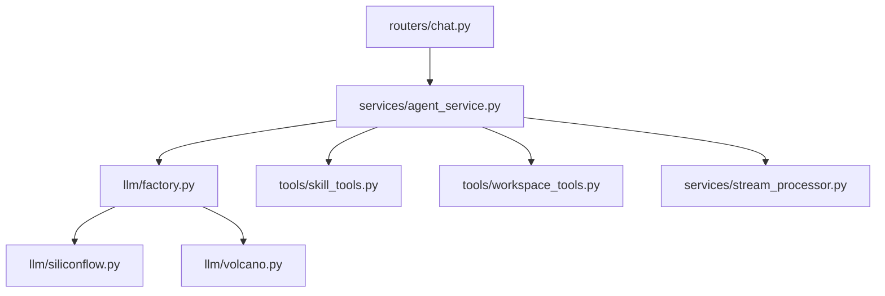

# 扩展开发教程

<cite>
**本文引用的文件**   
- [backend/app/llm/base.py](file://backend/app/llm/base.py)
- [backend/app/llm/factory.py](file://backend/app/llm/factory.py)
- [backend/app/llm/siliconflow.py](file://backend/app/llm/siliconflow.py)
- [backend/app/llm/volcano.py](file://backend/app/llm/volcano.py)
- [backend/app/services/agent_service.py](file://backend/app/services/agent_service.py)
- [backend/app/services/stream_processor.py](file://backend/app/services/stream_processor.py)
- [backend/app/routers/chat.py](file://backend/app/routers/chat.py)
- [backend/app/tools/skill_tools.py](file://backend/app/tools/skill_tools.py)
- [backend/app/tools/workspace_tools.py](file://backend/app/tools/workspace_tools.py)
- [backend/app/tools/image_generation.py](file://backend/app/tools/image_generation.py)
- [backend/app/tools/video_concatenation.py](file://backend/app/tools/video_concatenation.py)
- [backend/app/tools/qwen_tts.py](file://backend/app/tools/qwen_tts.py)
- [backend/app/utils/logger.py](file://backend/app/utils/logger.py)
- [backend/skills/public/skill-creator/SKILL.md](file://backend/skills/public/skill-creator/SKILL.md)
- [backend/skills/public/skill-creator/scripts/init_skill.py](file://backend/skills/public/skill-creator/scripts/init_skill.py)
- [backend/skills/public/skill-creator/scripts/package_skill.py](file://backend/skills/public/skill-creator/scripts/package_skill.py)
- [backend/skills/public/skill-creator/scripts/quick_validate.py](file://backend/skills/public/skill-creator/scripts/quick_validate.py)
- [backend/skills/public/skill-creator/references/workflows.md](file://backend/skills/public/skill-creator/references/workflows.md)
- [backend/skills/custom/paper-writing/SKILL.md](file://backend/skills/custom/paper-writing/SKILL.md)
- [backend/skills/custom/podcast-creator/SKILL.md](file://backend/skills/custom/podcast-creator/SKILL.md)
- [backend/skills/custom/video-creator/SKILL.md](file://backend/skills/custom/video-creator/SKILL.md)
- [backend/skills/custom/virtual-anchor/SKILL.md](file://backend/skills/custom/virtual-anchor/SKILL.md)
- [backend/skills/custom/xiaohongshu-copywriter/SKILL.md](file://backend/skills/custom/xiaohongshu-copywriter/SKILL.md)
- [backend/workspace/TOOLS.md](file://backend/workspace/TOOLS.md)
- [backend/workspace/AGENTS.md](file://backend/workspace/AGENTS.md)
- [backend/workspace/MEMORY.md](file://backend/workspace/MEMORY.md)
- [backend/workspace/SOUL.md](file://backend/workspace/SOUL.md)
- [backend/workspace/IDENTITY.md](file://backend/workspace/IDENTITY.md)
- [backend/workspace/USER.md](file://backend/workspace/USER.md)
</cite>

## 目录
1. [简介](#简介)
2. [项目结构](#项目结构)
3. [核心组件](#核心组件)
4. [架构总览](#架构总览)
5. [详细组件分析](#详细组件分析)
6. [依赖关系分析](#依赖关系分析)
7. [性能考虑](#性能考虑)
8. [故障排查指南](#故障排查指南)
9. [结论](#结论)
10. [附录](#附录)

## 简介
本教程面向希望为系统新增 LLM 提供商、自定义工具与技能（Skill）的开发者。内容覆盖：
- 新 LLM 提供商集成步骤：抽象接口实现、认证配置、API 调用封装
- 自定义工具开发：工具注册机制、参数校验、错误处理
- 技能系统开发：SKILL.md 规范、工作流定义、脚本编写、资源管理
- 插件架构理解：扩展点识别、生命周期管理
- 完整示例与测试方法

## 项目结构
后端采用分层组织：
- llm：LLM 抽象基类、工厂与各提供商实现
- services：Agent 编排、流式处理、历史与提示词等
- tools：可被 Agent 调用的工具集合，包含技能相关工具与工作区工具
- skills：公共与自定义技能包，包含 SKILL.md、references、scripts 等
- workspace：Agent 运行时上下文文档（身份、记忆、工具清单等）

图表来源
- [backend/app/llm/base.py](file://backend/app/llm/base.py)
- [backend/app/llm/factory.py](file://backend/app/llm/factory.py)
- [backend/app/llm/siliconflow.py](file://backend/app/llm/siliconflow.py)
- [backend/app/llm/volcano.py](file://backend/app/llm/volcano.py)
- [backend/app/services/agent_service.py](file://backend/app/services/agent_service.py)
- [backend/app/services/stream_processor.py](file://backend/app/services/stream_processor.py)
- [backend/app/routers/chat.py](file://backend/app/routers/chat.py)
- [backend/app/tools/skill_tools.py](file://backend/app/tools/skill_tools.py)
- [backend/app/tools/workspace_tools.py](file://backend/app/tools/workspace_tools.py)
- [backend/skills/public/skill-creator/SKILL.md](file://backend/skills/public/skill-creator/SKILL.md)
- [backend/workspace/TOOLS.md](file://backend/workspace/TOOLS.md)
- [backend/workspace/AGENTS.md](file://backend/workspace/AGENTS.md)
- [backend/workspace/MEMORY.md](file://backend/workspace/MEMORY.md)
- [backend/workspace/SOUL.md](file://backend/workspace/SOUL.md)
- [backend/workspace/IDENTITY.md](file://backend/workspace/IDENTITY.md)
- [backend/workspace/USER.md](file://backend/workspace/USER.md)

章节来源
- [backend/app/llm/base.py](file://backend/app/llm/base.py)
- [backend/app/llm/factory.py](file://backend/app/llm/factory.py)
- [backend/app/llm/siliconflow.py](file://backend/app/llm/siliconflow.py)
- [backend/app/llm/volcano.py](file://backend/app/llm/volcano.py)
- [backend/app/services/agent_service.py](file://backend/app/services/agent_service.py)
- [backend/app/services/stream_processor.py](file://backend/app/services/stream_processor.py)
- [backend/app/routers/chat.py](file://backend/app/routers/chat.py)
- [backend/app/tools/skill_tools.py](file://backend/app/tools/skill_tools.py)
- [backend/app/tools/workspace_tools.py](file://backend/app/tools/workspace_tools.py)
- [backend/skills/public/skill-creator/SKILL.md](file://backend/skills/public/skill-creator/SKILL.md)
- [backend/workspace/TOOLS.md](file://backend/workspace/TOOLS.md)
- [backend/workspace/AGENTS.md](file://backend/workspace/AGENTS.md)
- [backend/workspace/MEMORY.md](file://backend/workspace/MEMORY.md)
- [backend/workspace/SOUL.md](file://backend/workspace/SOUL.md)
- [backend/workspace/IDENTITY.md](file://backend/workspace/IDENTITY.md)
- [backend/workspace/USER.md](file://backend/workspace/USER.md)

## 核心组件
- LLM 抽象与工厂
  - 抽象基类定义了统一的对话/流式接口，供各提供商实现
  - 工厂根据配置选择具体提供商实例
- Agent 服务
  - 负责编排模型调用、工具执行、流式输出与状态维护
- 工具层
  - 技能工具与工作区工具提供统一的可发现、可调用能力
- 流式处理器
  - 将下游模型的增量文本转换为前端可用的事件流
- 路由层
  - 暴露 HTTP/WebSocket 接口，接收聊天请求并驱动 Agent 流程

章节来源
- [backend/app/llm/base.py](file://backend/app/llm/base.py)
- [backend/app/llm/factory.py](file://backend/app/llm/factory.py)
- [backend/app/services/agent_service.py](file://backend/app/services/agent_service.py)
- [backend/app/services/stream_processor.py](file://backend/app/services/stream_processor.py)
- [backend/app/routers/chat.py](file://backend/app/routers/chat.py)

## 架构总览
下图展示了从客户端到 LLM 与工具的端到端调用路径，以及流式返回过程。

图表来源
- [backend/app/routers/chat.py](file://backend/app/routers/chat.py)
- [backend/app/services/agent_service.py](file://backend/app/services/agent_service.py)
- [backend/app/llm/factory.py](file://backend/app/llm/factory.py)
- [backend/app/llm/siliconflow.py](file://backend/app/llm/siliconflow.py)
- [backend/app/llm/volcano.py](file://backend/app/llm/volcano.py)
- [backend/app/tools/skill_tools.py](file://backend/app/tools/skill_tools.py)
- [backend/app/tools/workspace_tools.py](file://backend/app/tools/workspace_tools.py)
- [backend/app/services/stream_processor.py](file://backend/app/services/stream_processor.py)

## 详细组件分析

### LLM 提供商集成（抽象接口、认证、API 封装）
- 抽象接口
  - 在抽象基类中定义统一的对话与流式接口，确保所有提供商遵循相同契约
- 工厂模式
  - 通过工厂根据配置动态加载具体提供商实现，便于热插拔
- 提供商实现
  - 每个提供商文件负责：鉴权头组装、请求构造、响应解析、错误映射、重试策略
- 认证配置
  - 建议通过环境变量注入密钥与端点信息，避免硬编码
- API 调用封装
  - 对网络异常、限流、超时进行统一处理，并标准化错误码

图表来源
- [backend/app/llm/base.py](file://backend/app/llm/base.py)
- [backend/app/llm/factory.py](file://backend/app/llm/factory.py)
- [backend/app/llm/siliconflow.py](file://backend/app/llm/siliconflow.py)
- [backend/app/llm/volcano.py](file://backend/app/llm/volcano.py)

章节来源
- [backend/app/llm/base.py](file://backend/app/llm/base.py)
- [backend/app/llm/factory.py](file://backend/app/llm/factory.py)
- [backend/app/llm/siliconflow.py](file://backend/app/llm/siliconflow.py)
- [backend/app/llm/volcano.py](file://backend/app/llm/volcano.py)

### 自定义工具开发（注册、参数校验、错误处理）
- 工具注册机制
  - 工具以模块形式存在，由工具层统一发现与注册，供 Agent 调用
- 参数验证
  - 在工具入口对输入进行强类型校验与业务规则校验，失败时返回结构化错误
- 错误处理
  - 区分网络错误、业务错误与系统错误，记录日志并向上抛出标准异常
- 典型工具
  - 图像生成、视频拼接、TTS、工作区读写、技能管理等

图表来源
- [backend/app/tools/skill_tools.py](file://backend/app/tools/skill_tools.py)
- [backend/app/tools/workspace_tools.py](file://backend/app/tools/workspace_tools.py)
- [backend/app/tools/image_generation.py](file://backend/app/tools/image_generation.py)
- [backend/app/tools/video_concatenation.py](file://backend/app/tools/video_concatenation.py)
- [backend/app/tools/qwen_tts.py](file://backend/app/tools/qwen_tts.py)
- [backend/app/utils/logger.py](file://backend/app/utils/logger.py)

章节来源
- [backend/app/tools/skill_tools.py](file://backend/app/tools/skill_tools.py)
- [backend/app/tools/workspace_tools.py](file://backend/app/tools/workspace_tools.py)
- [backend/app/tools/image_generation.py](file://backend/app/tools/image_generation.py)
- [backend/app/tools/video_concatenation.py](file://backend/app/tools/video_concatenation.py)
- [backend/app/tools/qwen_tts.py](file://backend/app/tools/qwen_tts.py)
- [backend/app/utils/logger.py](file://backend/app/utils/logger.py)

### 技能系统开发（SKILL.md、工作流、脚本、资源）
- SKILL.md 格式规范
  - 描述技能名称、版本、作者、依赖、参数、使用示例、注意事项等
- 工作流定义
  - 在工作流参考文件中定义步骤、条件分支、输入输出约定
- 脚本编写
  - 初始化、打包、快速校验等脚本位于 scripts 目录，用于自动化技能生命周期
- 资源管理
  - references 存放模板、样例、提示词；assets 存放静态资源

图表来源
- [backend/skills/public/skill-creator/SKILL.md](file://backend/skills/public/skill-creator/SKILL.md)
- [backend/skills/public/skill-creator/references/workflows.md](file://backend/skills/public/skill-creator/references/workflows.md)
- [backend/skills/public/skill-creator/scripts/init_skill.py](file://backend/skills/public/skill-creator/scripts/init_skill.py)
- [backend/skills/public/skill-creator/scripts/package_skill.py](file://backend/skills/public/skill-creator/scripts/package_skill.py)
- [backend/skills/public/skill-creator/scripts/quick_validate.py](file://backend/skills/public/skill-creator/scripts/quick_validate.py)

章节来源
- [backend/skills/public/skill-creator/SKILL.md](file://backend/skills/public/skill-creator/SKILL.md)
- [backend/skills/public/skill-creator/references/workflows.md](file://backend/skills/public/skill-creator/references/workflows.md)
- [backend/skills/public/skill-creator/scripts/init_skill.py](file://backend/skills/public/skill-creator/scripts/init_skill.py)
- [backend/skills/public/skill-creator/scripts/package_skill.py](file://backend/skills/public/skill-creator/scripts/package_skill.py)
- [backend/skills/public/skill-creator/scripts/quick_validate.py](file://backend/skills/public/skill-creator/scripts/quick_validate.py)

### 插件架构与扩展点
- 扩展点识别
  - LLM 提供商：通过工厂注册新的实现
  - 工具：在 tools 目录下新增模块并按约定注册
  - 技能：在 skills 目录新增 SKILL.md 及必要资源
- 生命周期管理
  - 启动阶段：扫描并注册工具与技能
  - 运行阶段：按需加载、缓存、销毁
  - 配置变更：支持热重载（如需要）

[此图为概念性说明，不直接映射具体源码文件]

### 工作区与上下文
- TOOLS.md：列出可用工具及其用途
- AGENTS.md：Agent 行为与约束
- MEMORY.md：短期/长期记忆策略
- SOUL.md：人格与风格
- IDENTITY.md：角色设定
- USER.md：用户画像与偏好

章节来源
- [backend/workspace/TOOLS.md](file://backend/workspace/TOOLS.md)
- [backend/workspace/AGENTS.md](file://backend/workspace/AGENTS.md)
- [backend/workspace/MEMORY.md](file://backend/workspace/MEMORY.md)
- [backend/workspace/SOUL.md](file://backend/workspace/SOUL.md)
- [backend/workspace/IDENTITY.md](file://backend/workspace/IDENTITY.md)
- [backend/workspace/USER.md](file://backend/workspace/USER.md)

## 依赖关系分析
- 低耦合高内聚
  - LLM 抽象与实现解耦，工厂屏蔽差异
  - 工具与服务层通过统一接口交互
- 关键依赖链
  - 路由 -> Agent -> LLM 工厂 -> 提供商实现
  - Agent -> 工具层 -> 外部 API/文件系统
  - Agent -> 流式处理器 -> 客户端

图表来源
- [backend/app/routers/chat.py](file://backend/app/routers/chat.py)
- [backend/app/services/agent_service.py](file://backend/app/services/agent_service.py)
- [backend/app/llm/factory.py](file://backend/app/llm/factory.py)
- [backend/app/llm/siliconflow.py](file://backend/app/llm/siliconflow.py)
- [backend/app/llm/volcano.py](file://backend/app/llm/volcano.py)
- [backend/app/tools/skill_tools.py](file://backend/app/tools/skill_tools.py)
- [backend/app/tools/workspace_tools.py](file://backend/app/tools/workspace_tools.py)
- [backend/app/services/stream_processor.py](file://backend/app/services/stream_processor.py)

章节来源
- [backend/app/routers/chat.py](file://backend/app/routers/chat.py)
- [backend/app/services/agent_service.py](file://backend/app/services/agent_service.py)
- [backend/app/llm/factory.py](file://backend/app/llm/factory.py)
- [backend/app/llm/siliconflow.py](file://backend/app/llm/siliconflow.py)
- [backend/app/llm/volcano.py](file://backend/app/llm/volcano.py)
- [backend/app/tools/skill_tools.py](file://backend/app/tools/skill_tools.py)
- [backend/app/tools/workspace_tools.py](file://backend/app/tools/workspace_tools.py)
- [backend/app/services/stream_processor.py](file://backend/app/services/stream_processor.py)

## 性能考虑
- 流式传输
  - 优先使用流式接口减少首字节延迟
- 并发与限流
  - 对上游 API 增加重试与退避策略，避免雪崩
- 缓存
  - 对静态资源与重复查询结果做缓存
- 资源清理
  - 及时释放临时文件与连接，避免内存泄漏

[本节为通用指导，无需源码引用]

## 故障排查指南
- 常见问题定位
  - 认证失败：检查环境变量与签名算法
  - 参数错误：查看工具入参校验日志
  - 网络异常：关注超时与重试次数
- 日志与调试
  - 使用统一日志模块记录关键路径与异常堆栈
- 回归测试
  - 针对工具与 LLM 封装编写单测与集成用例

章节来源
- [backend/app/utils/logger.py](file://backend/app/utils/logger.py)

## 结论
通过抽象接口、工厂模式与统一工具/技能体系，本项目提供了清晰的扩展点与生命周期管理。按照本教程的步骤，你可以快速接入新的 LLM 提供商、开发自定义工具与技能，并通过完善的日志与测试保障质量。

## 附录

### 新 LLM 提供商集成清单
- 实现抽象基类中的统一接口
- 在工厂中注册新提供商
- 配置环境变量（密钥、端点、模型名）
- 编写单元测试与集成测试
- 更新文档与示例

章节来源
- [backend/app/llm/base.py](file://backend/app/llm/base.py)
- [backend/app/llm/factory.py](file://backend/app/llm/factory.py)
- [backend/app/llm/siliconflow.py](file://backend/app/llm/siliconflow.py)
- [backend/app/llm/volcano.py](file://backend/app/llm/volcano.py)

### 自定义工具开发清单
- 在 tools 目录新增模块
- 实现参数校验与错误处理
- 注册工具并暴露给 Agent
- 编写单测与边界用例
- 更新 TOOLS.md 说明

章节来源
- [backend/app/tools/skill_tools.py](file://backend/app/tools/skill_tools.py)
- [backend/app/tools/workspace_tools.py](file://backend/app/tools/workspace_tools.py)
- [backend/workspace/TOOLS.md](file://backend/workspace/TOOLS.md)

### 技能包开发清单
- 编写 SKILL.md（名称、版本、依赖、参数、示例）
- 定义工作流（references/workflows.md）
- 编写脚本（初始化、打包、校验）
- 准备资源（references、assets）
- 安装并发布技能包

章节来源
- [backend/skills/public/skill-creator/SKILL.md](file://backend/skills/public/skill-creator/SKILL.md)
- [backend/skills/public/skill-creator/references/workflows.md](file://backend/skills/public/skill-creator/references/workflows.md)
- [backend/skills/public/skill-creator/scripts/init_skill.py](file://backend/skills/public/skill-creator/scripts/init_skill.py)
- [backend/skills/public/skill-creator/scripts/package_skill.py](file://backend/skills/public/skill-creator/scripts/package_skill.py)
- [backend/skills/public/skill-creator/scripts/quick_validate.py](file://backend/skills/public/skill-creator/scripts/quick_validate.py)

### 示例技能参考
- 论文写作
- 播客创作
- 视频创作
- 虚拟主播
- 小红书文案

章节来源
- [backend/skills/custom/paper-writing/SKILL.md](file://backend/skills/custom/paper-writing/SKILL.md)
- [backend/skills/custom/podcast-creator/SKILL.md](file://backend/skills/custom/podcast-creator/SKILL.md)
- [backend/skills/custom/video-creator/SKILL.md](file://backend/skills/custom/video-creator/SKILL.md)
- [backend/skills/custom/virtual-anchor/SKILL.md](file://backend/skills/custom/virtual-anchor/SKILL.md)
- [backend/skills/custom/xiaohongshu-copywriter/SKILL.md](file://backend/skills/custom/xiaohongshu-copywriter/SKILL.md)