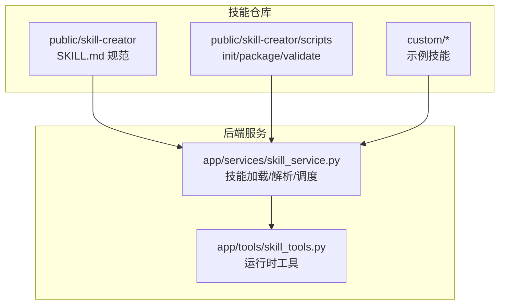
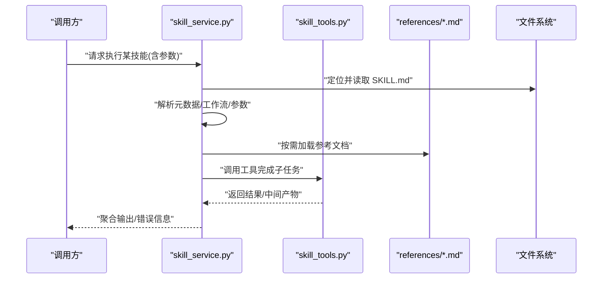
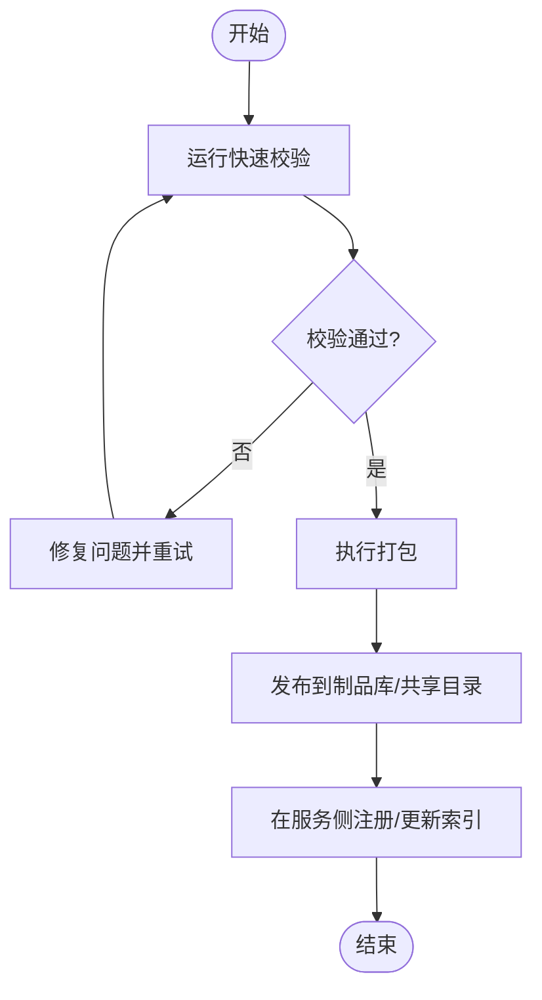
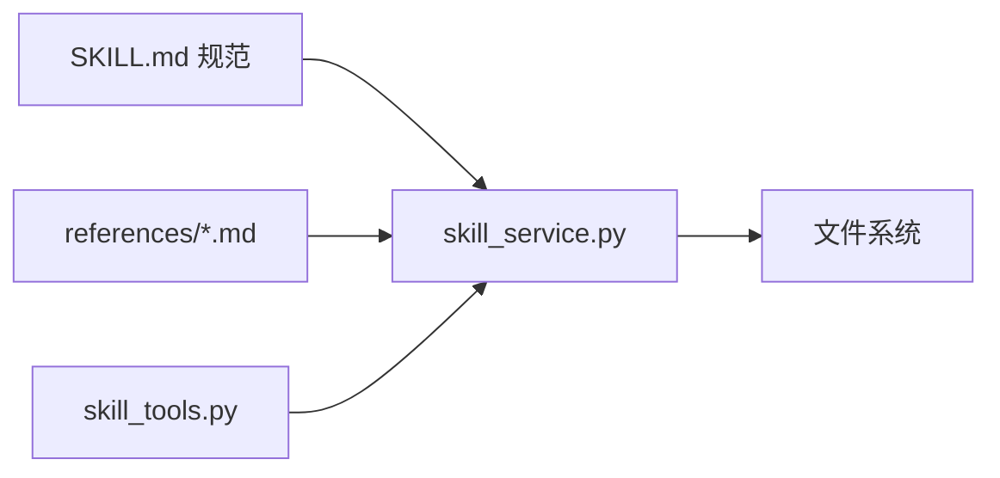

# 技能系统开发

<cite>
**本文引用的文件**   
- [backend/skills/public/skill-creator/SKILL.md](file://backend/skills/public/skill-creator/SKILL.md)
- [backend/skills/public/skill-creator/scripts/init_skill.py](file://backend/skills/public/skill-creator/scripts/init_skill.py)
- [backend/skills/public/skill-creator/scripts/package_skill.py](file://backend/skills/public/skill-creator/scripts/package_skill.py)
- [backend/skills/public/skill-creator/scripts/quick_validate.py](file://backend/skills/public/skill-creator/scripts/quick_validate.py)
- [backend/skills/public/skill-creator/references/workflows.md](file://backend/skills/public/skill-creator/references/workflows.md)
- [backend/skills/public/skill-creator/references/output-patterns.md](file://backend/skills/public/skill-creator/references/output-patterns.md)
- [backend/app/services/skill_service.py](file://backend/app/services/skill_service.py)
- [backend/app/tools/skill_tools.py](file://backend/app/tools/skill_tools.py)
- [backend/skills/custom/paper-writing/SKILL.md](file://backend/skills/custom/paper-writing/SKILL.md)
- [backend/skills/custom/podcast-creator/SKILL.md](file://backend/skills/custom/podcast-creator/SKILL.md)
- [backend/skills/custom/video-creator/SKILL.md](file://backend/skills/custom/video-creator/SKILL.md)
- [backend/skills/custom/virtual-anchor/SKILL.md](file://backend/skills/custom/virtual-anchor/SKILL.md)
- [backend/skills/custom/xiaohongshu-copywriter/SKILL.md](file://backend/skills/custom/xiaohongshu-copywriter/SKILL.md)
</cite>

## 目录
1. [简介](#简介)
2. [项目结构](#项目结构)
3. [核心组件](#核心组件)
4. [架构总览](#架构总览)
5. [详细组件分析](#详细组件分析)
6. [依赖分析](#依赖分析)
7. [性能考虑](#性能考虑)
8. [故障排查指南](#故障排查指南)
9. [结论](#结论)
10. [附录](#附录)

## 简介
本指南面向希望基于 PolyStudio 构建、打包与发布“技能”的开发者。内容涵盖：
- SKILL.md 文件格式规范（元数据、工作流、参数配置）
- 技能目录结构与资源组织方式
- 技能初始化脚本使用与自定义模板开发
- 技能打包、验证与发布流程
- 内置技能参考示例（论文写作、播客创作、视频创作等）
- 技能调试、测试与性能监控方法

## 项目结构
PolyStudio 的技能系统位于后端目录，采用“公共能力 + 自定义技能”的组织方式：
- public/skill-creator：技能创建工具链与参考文档（SKILL.md 规范、工作流参考、输出模式参考、初始化/打包/校验脚本）
- custom：内置或团队共享的示例技能（如论文写作、播客创作、视频创作、虚拟主播、小红书文案等）
- app/services/skill_service.py：技能服务层，负责加载、解析、调度技能
- app/tools/skill_tools.py：技能工具集，提供运行时辅助能力

图表来源
- [backend/skills/public/skill-creator/SKILL.md](file://backend/skills/public/skill-creator/SKILL.md)
- [backend/skills/public/skill-creator/scripts/init_skill.py](file://backend/skills/public/skill-creator/scripts/init_skill.py)
- [backend/skills/public/skill-creator/scripts/package_skill.py](file://backend/skills/public/skill-creator/scripts/package_skill.py)
- [backend/skills/public/skill-creator/scripts/quick_validate.py](file://backend/skills/public/skill-creator/scripts/quick_validate.py)
- [backend/app/services/skill_service.py](file://backend/app/services/skill_service.py)
- [backend/app/tools/skill_tools.py](file://backend/app/tools/skill_tools.py)

章节来源
- [backend/skills/public/skill-creator/SKILL.md](file://backend/skills/public/skill-creator/SKILL.md)
- [backend/app/services/skill_service.py](file://backend/app/services/skill_service.py)
- [backend/app/tools/skill_tools.py](file://backend/app/tools/skill_tools.py)

## 核心组件
- SKILL.md 规范：定义技能的元数据、工作流描述、参数配置与引用资源说明，是技能的可执行契约。
- 技能服务层：负责发现、加载、解析 SKILL.md，将工作流映射到具体工具调用序列，并管理上下文与状态。
- 技能工具集：为技能运行期提供通用能力（如文件读写、外部 API 调用封装、日志记录等）。
- 工具链脚本：
  - init_skill.py：从模板快速生成新技能骨架
  - package_skill.py：将技能打包为可分发制品
  - quick_validate.py：对 SKILL.md 与目录结构进行快速校验

章节来源
- [backend/skills/public/skill-creator/SKILL.md](file://backend/skills/public/skill-creator/SKILL.md)
- [backend/skills/public/skill-creator/scripts/init_skill.py](file://backend/skills/public/skill-creator/scripts/init_skill.py)
- [backend/skills/public/skill-creator/scripts/package_skill.py](file://backend/skills/public/skill-creator/scripts/package_skill.py)
- [backend/skills/public/skill-creator/scripts/quick_validate.py](file://backend/skills/public/skill-creator/scripts/quick_validate.py)
- [backend/app/services/skill_service.py](file://backend/app/services/skill_service.py)
- [backend/app/tools/skill_tools.py](file://backend/app/tools/skill_tools.py)

## 架构总览
下图展示了从用户触发到技能执行的端到端流程，以及关键模块的职责边界。

图表来源
- [backend/app/services/skill_service.py](file://backend/app/services/skill_service.py)
- [backend/app/tools/skill_tools.py](file://backend/app/tools/skill_tools.py)
- [backend/skills/public/skill-creator/references/workflows.md](file://backend/skills/public/skill-creator/references/workflows.md)
- [backend/skills/public/skill-creator/references/output-patterns.md](file://backend/skills/public/skill-creator/references/output-patterns.md)

## 详细组件分析

### SKILL.md 文件格式规范
SKILL.md 是技能的“可执行说明书”，建议包含以下维度：
- 元数据
  - 名称、版本、作者、许可证、描述
  - 输入参数定义（名称、类型、默认值、约束）
  - 输出约定（格式、字段、示例路径）
- 工作流描述
  - 阶段划分（如准备、处理、后处理）
  - 每个阶段的步骤、前置条件、依赖工具
  - 分支与重试策略、失败回退
- 资源与引用
  - references 目录下的参考文档（如提示词模板、输出模式、领域知识）
  - assets 目录下的静态资源（模板、样式、素材）
- 安全与权限
  - 对外部资源的访问范围、敏感信息处理方式
- 兼容性与约束
  - 最低版本要求、平台限制、并发限制

章节来源
- [backend/skills/public/skill-creator/SKILL.md](file://backend/skills/public/skill-creator/SKILL.md)
- [backend/skills/public/skill-creator/references/workflows.md](file://backend/skills/public/skill-creator/references/workflows.md)
- [backend/skills/public/skill-creator/references/output-patterns.md](file://backend/skills/public/skill-creator/references/output-patterns.md)

### 技能目录结构与资源组织
推荐的最小目录结构：
- SKILL.md：技能主契约
- references：参考文档（提示词、模板、领域知识）
- assets：静态资源（模板、样式、素材）
- scripts：可选，技能专属脚本（若需要）
- tests：可选，单元测试与集成测试用例

组织原则：
- 按职责分离：逻辑在 SKILL.md，资源在 references/assets，脚本在 scripts
- 命名清晰：文件名体现用途，避免歧义
- 版本化：通过 SKILL.md 的版本字段与变更日志管理演进

章节来源
- [backend/skills/custom/paper-writing/SKILL.md](file://backend/skills/custom/paper-writing/SKILL.md)
- [backend/skills/custom/podcast-creator/SKILL.md](file://backend/skills/custom/podcast-creator/SKILL.md)
- [backend/skills/custom/video-creator/SKILL.md](file://backend/skills/custom/video-creator/SKILL.md)
- [backend/skills/custom/virtual-anchor/SKILL.md](file://backend/skills/custom/virtual-anchor/SKILL.md)
- [backend/skills/custom/xiaohongshu-copywriter/SKILL.md](file://backend/skills/custom/xiaohongshu-copywriter/SKILL.md)

### 技能初始化脚本使用方法
- 入口：scripts/init_skill.py
- 典型用法
  - 指定目标目录与技能名
  - 选择模板（如基础模板、媒体类模板）
  - 自动生成 SKILL.md 骨架、references 与 assets 目录
- 注意事项
  - 确保目标目录存在且可写
  - 覆盖已有文件需显式确认
  - 生成的元数据可按需二次编辑

章节来源
- [backend/skills/public/skill-creator/scripts/init_skill.py](file://backend/skills/public/skill-creator/scripts/init_skill.py)

### 自定义模板开发
- 模板位置：建议在 public/skill-creator/templates 下维护多套模板
- 模板要素
  - 预置 SKILL.md 片段（占位符替换）
  - 常用 references 与 assets 样板
  - 可选的 scripts 与 tests 脚手架
- 扩展点
  - 新增模板时，更新初始化脚本的模板列表
  - 为模板编写最小可用示例，便于使用者上手

章节来源
- [backend/skills/public/skill-creator/scripts/init_skill.py](file://backend/skills/public/skill-creator/scripts/init_skill.py)

### 技能打包、验证、发布流程
- 快速校验
  - 入口：scripts/quick_validate.py
  - 检查项：SKILL.md 语法、必填字段、references 完整性、目录结构合规
- 打包
  - 入口：scripts/package_skill.py
  - 产出：包含 SKILL.md、references、assets 的压缩包或归档
- 发布
  - 将打包产物上传至内部制品库或共享目录
  - 在 skill_service 中注册新技能路径或版本号
  - 更新文档与变更日志

图表来源
- [backend/skills/public/skill-creator/scripts/quick_validate.py](file://backend/skills/public/skill-creator/scripts/quick_validate.py)
- [backend/skills/public/skill-creator/scripts/package_skill.py](file://backend/skills/public/skill-creator/scripts/package_skill.py)
- [backend/app/services/skill_service.py](file://backend/app/services/skill_service.py)

章节来源
- [backend/skills/public/skill-creator/scripts/quick_validate.py](file://backend/skills/public/skill-creator/scripts/quick_validate.py)
- [backend/skills/public/skill-creator/scripts/package_skill.py](file://backend/skills/public/skill-creator/scripts/package_skill.py)
- [backend/app/services/skill_service.py](file://backend/app/services/skill_service.py)

### 内置技能参考示例
以下为内置示例技能，可作为实现范式与最佳实践参考：
- 论文写作：结构化大纲、文献引用、段落生成与校对
- 播客创作：脚本撰写、分镜/转场设计、音频后期指引
- 视频创作：故事板、镜头语言、剪辑节奏与导出规范
- 虚拟主播：人设设定、话术模板、互动策略
- 小红书文案：标签体系、标题技巧、正文模板

章节来源
- [backend/skills/custom/paper-writing/SKILL.md](file://backend/skills/custom/paper-writing/SKILL.md)
- [backend/skills/custom/podcast-creator/SKILL.md](file://backend/skills/custom/podcast-creator/SKILL.md)
- [backend/skills/custom/video-creator/SKILL.md](file://backend/skills/custom/video-creator/SKILL.md)
- [backend/skills/custom/virtual-anchor/SKILL.md](file://backend/skills/custom/virtual-anchor/SKILL.md)
- [backend/skills/custom/xiaohongshu-copywriter/SKILL.md](file://backend/skills/custom/xiaohongshu-copywriter/SKILL.md)

### 技能调试、测试与性能监控
- 调试
  - 启用详细日志：在 skill_service 与 skill_tools 中增加步骤级日志
  - 断点与追踪：在关键节点打印输入/输出摘要与耗时
  - 沙箱运行：使用只读目录与受限网络环境隔离风险
- 测试
  - 单元测试：针对工具函数与解析逻辑
  - 集成测试：端到端执行 SKILL.md 工作流，断言输出格式与关键字段
  - 回归测试：版本升级后复跑历史用例
- 性能监控
  - 指标采集：各阶段耗时、失败率、缓存命中率
  - 告警阈值：超时、内存占用、外部 API 错误率
  - 可视化：将指标上报至监控系统，建立看板

章节来源
- [backend/app/services/skill_service.py](file://backend/app/services/skill_service.py)
- [backend/app/tools/skill_tools.py](file://backend/app/tools/skill_tools.py)

## 依赖分析
- 模块耦合
  - skill_service 依赖 SKILL.md 解析器与工具集
  - skill_tools 提供通用能力，被多个技能复用
- 外部依赖
  - 文件系统：读取 SKILL.md、references、assets
  - 可选：外部 API（音视频处理、图像生成等）
- 潜在循环依赖
  - 保持 service 与 tools 单向依赖，避免反向导入

图表来源
- [backend/skills/public/skill-creator/SKILL.md](file://backend/skills/public/skill-creator/SKILL.md)
- [backend/app/services/skill_service.py](file://backend/app/services/skill_service.py)
- [backend/app/tools/skill_tools.py](file://backend/app/tools/skill_tools.py)

章节来源
- [backend/app/services/skill_service.py](file://backend/app/services/skill_service.py)
- [backend/app/tools/skill_tools.py](file://backend/app/tools/skill_tools.py)

## 性能考虑
- 懒加载：仅在需要时加载 references 与大体积 assets
- 缓存：对重复计算的结果进行缓存（如模板渲染、文本预处理）
- 批处理：合并多次 I/O 操作，减少磁盘与网络往返
- 限流与退避：对外部 API 调用实施限流与指数退避
- 异步化：长耗时任务采用异步队列与回调机制

[本节为通用指导，不直接分析具体文件]

## 故障排查指南
- 常见问题
  - SKILL.md 解析失败：检查必填字段、类型约束与引用路径
  - 资源缺失：确认 references/assets 目录与文件名一致
  - 工具调用异常：核对工具签名、参数与权限
- 定位手段
  - 开启详细日志，捕获输入/输出快照
  - 使用 quick_validate 先行自检
  - 逐步注释工作流步骤，二分定位问题阶段
- 恢复策略
  - 失败重试与降级方案
  - 回滚到上一稳定版本
  - 清理临时文件与缓存

章节来源
- [backend/skills/public/skill-creator/scripts/quick_validate.py](file://backend/skills/public/skill-creator/scripts/quick_validate.py)
- [backend/app/services/skill_service.py](file://backend/app/services/skill_service.py)
- [backend/app/tools/skill_tools.py](file://backend/app/tools/skill_tools.py)

## 结论
通过统一的 SKILL.md 规范与完善的工具链，PolyStudio 实现了技能的可插拔、可组合与可观测。遵循本文档的结构与流程，可以快速构建高质量、可维护、可发布的技能，并在生产环境中获得稳定的性能与可靠性。

[本节为总结性内容，不直接分析具体文件]

## 附录
- 术语
  - 技能：以 SKILL.md 描述的、可被服务调用的工作流单元
  - 工作流：由若干阶段与步骤组成的执行计划
  - 工具：技能在执行过程中可调用的原子能力
- 参考
  - 工作流参考：workflows.md
  - 输出模式参考：output-patterns.md

章节来源
- [backend/skills/public/skill-creator/references/workflows.md](file://backend/skills/public/skill-creator/references/workflows.md)
- [backend/skills/public/skill-creator/references/output-patterns.md](file://backend/skills/public/skill-creator/references/output-patterns.md)