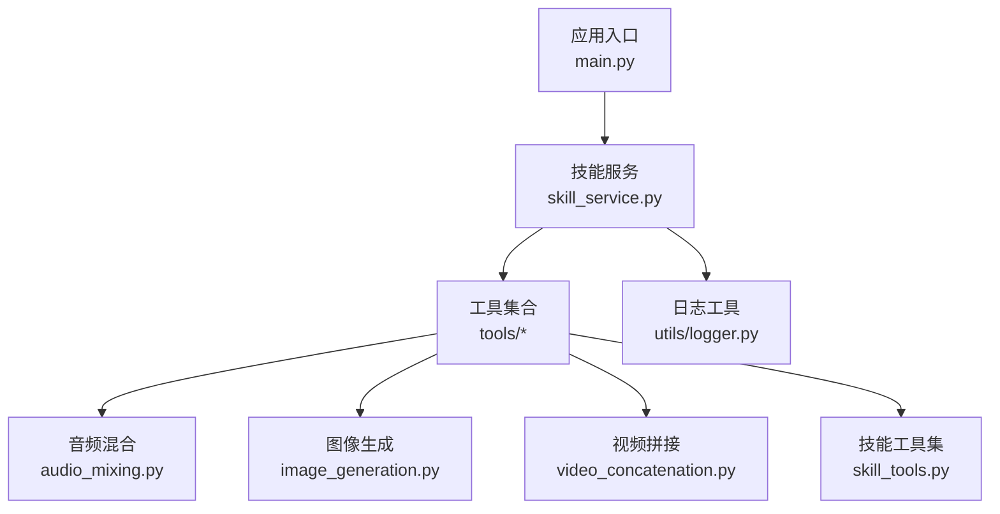
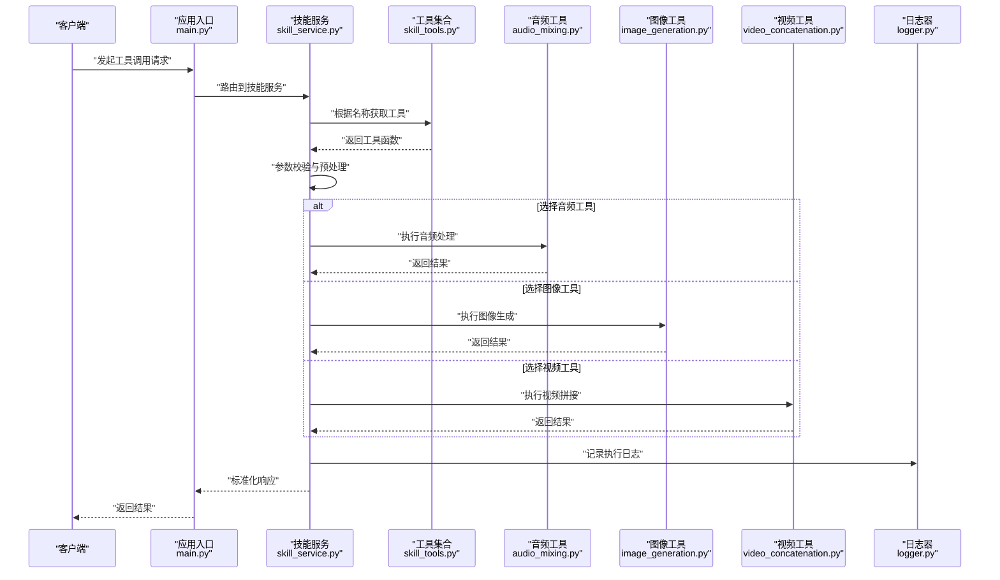
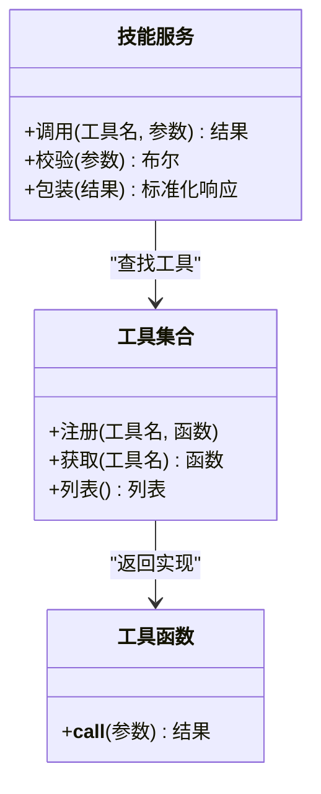
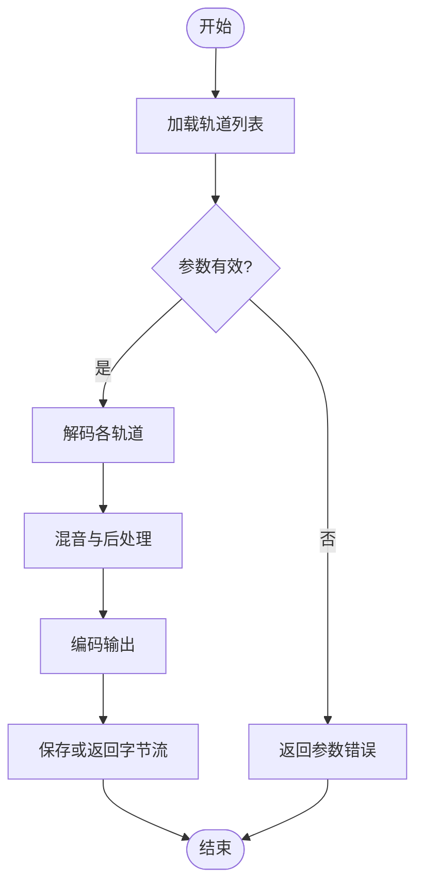
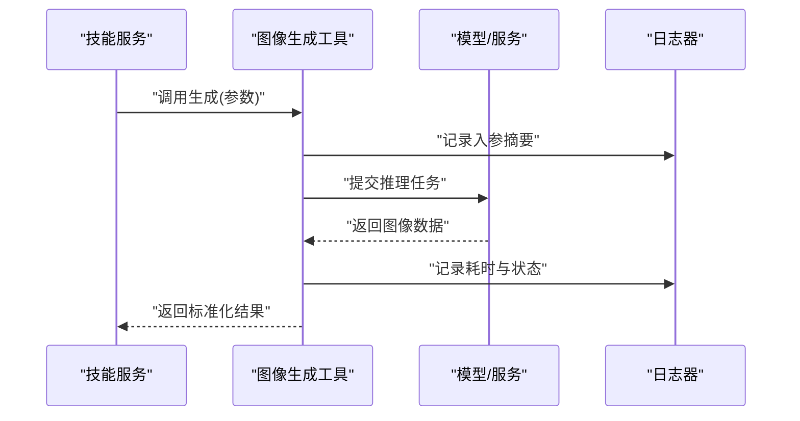
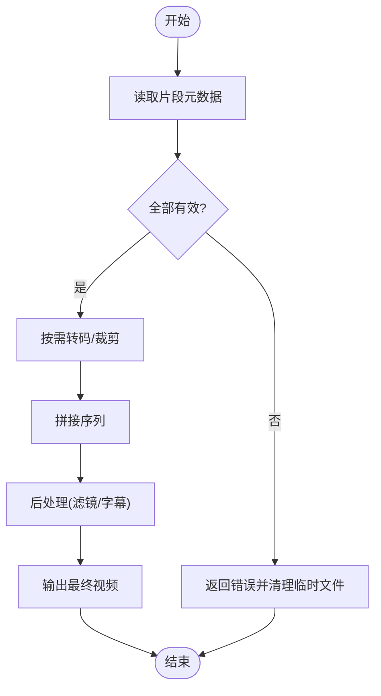
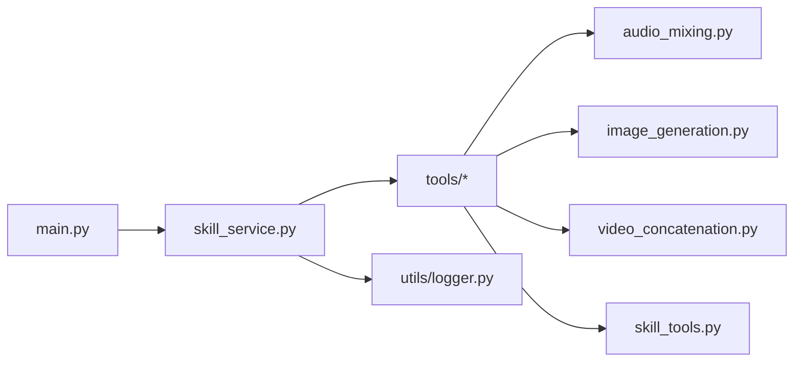

# 自定义工具开发

<cite>
**本文引用的文件**   
- [backend/app/tools/audio_mixing.py](file://backend/app/tools/audio_mixing.py)
- [backend/app/tools/image_generation.py](file://backend/app/tools/image_generation.py)
- [backend/app/tools/video_concatenation.py](file://backend/app/tools/video_concatenation.py)
- [backend/app/tools/skill_tools.py](file://backend/app/tools/skill_tools.py)
- [backend/app/services/skill_service.py](file://backend/app/services/skill_service.py)
- [backend/app/utils/logger.py](file://backend/app/utils/logger.py)
- [backend/app/main.py](file://backend/app/main.py)
- [backend/requirements.txt](file://backend/requirements.txt)
</cite>

## 目录
1. [简介](#简介)
2. [项目结构](#项目结构)
3. [核心组件](#核心组件)
4. [架构总览](#架构总览)
5. [详细组件分析](#详细组件分析)
6. [依赖关系分析](#依赖关系分析)
7. [性能考虑](#性能考虑)
8. [故障排查指南](#故障排查指南)
9. [结论](#结论)
10. [附录](#附录)

## 简介
本教程面向希望在 PolyStudio 后端中开发“自定义工具”的工程师与创作者，系统讲解：
- 工具注册机制与发现流程
- 工具函数的标准格式、参数定义与返回值规范
- 音频处理、图像生成、视频拼接等典型工具的开发示例
- 工具依赖管理、资源访问、错误处理与日志记录
- 工具测试方法、性能优化技巧与安全性考虑
- 工具包管理与版本控制的最佳实践

目标是帮助你在不深入框架细节的前提下，快速构建高质量、可维护、可扩展的工具。

## 项目结构
本项目采用分层组织方式，工具位于 backend/app/tools 下，服务层在 backend/app/services，通用能力（如日志）在 backend/app/utils，应用入口在 backend/app/main.py。

图表来源
- [backend/app/main.py](file://backend/app/main.py)
- [backend/app/services/skill_service.py](file://backend/app/services/skill_service.py)
- [backend/app/tools/audio_mixing.py](file://backend/app/tools/audio_mixing.py)
- [backend/app/tools/image_generation.py](file://backend/app/tools/image_generation.py)
- [backend/app/tools/video_concatenation.py](file://backend/app/tools/video_concatenation.py)
- [backend/app/tools/skill_tools.py](file://backend/app/tools/skill_tools.py)
- [backend/app/utils/logger.py](file://backend/app/utils/logger.py)

章节来源
- [backend/app/main.py](file://backend/app/main.py)
- [backend/app/services/skill_service.py](file://backend/app/services/skill_service.py)
- [backend/app/tools/audio_mixing.py](file://backend/app/tools/audio_mixing.py)
- [backend/app/tools/image_generation.py](file://backend/app/tools/image_generation.py)
- [backend/app/tools/video_concatenation.py](file://backend/app/tools/video_concatenation.py)
- [backend/app/tools/skill_tools.py](file://backend/app/tools/skill_tools.py)
- [backend/app/utils/logger.py](file://backend/app/utils/logger.py)

## 核心组件
- 工具注册与发现
  - 通过统一的工具集合模块集中声明与导出工具函数，便于服务层动态加载与调用。
  - 服务层提供按名称查找、校验参数、执行并返回结果的统一接口。
- 工具函数契约
  - 输入：结构化参数对象（键值对），类型清晰、必填项明确。
  - 输出：标准化结果对象，包含状态码、消息、数据体与可选元信息。
- 日志与错误
  - 使用统一日志器记录关键步骤与异常堆栈，便于定位问题。
  - 错误分类与用户友好提示，避免泄露敏感信息。
- 资源与依赖
  - 外部模型或第三方库按需导入，支持配置开关与环境变量注入。
  - 资源路径建议以相对路径或配置中心统一管理。

章节来源
- [backend/app/tools/skill_tools.py](file://backend/app/tools/skill_tools.py)
- [backend/app/services/skill_service.py](file://backend/app/services/skill_service.py)
- [backend/app/utils/logger.py](file://backend/app/utils/logger.py)

## 架构总览
下图展示了从应用入口到具体工具执行的端到端流程，包括注册、发现、参数校验、执行与日志记录。

图表来源
- [backend/app/main.py](file://backend/app/main.py)
- [backend/app/services/skill_service.py](file://backend/app/services/skill_service.py)
- [backend/app/tools/skill_tools.py](file://backend/app/tools/skill_tools.py)
- [backend/app/tools/audio_mixing.py](file://backend/app/tools/audio_mixing.py)
- [backend/app/tools/image_generation.py](file://backend/app/tools/image_generation.py)
- [backend/app/tools/video_concatenation.py](file://backend/app/tools/video_concatenation.py)
- [backend/app/utils/logger.py](file://backend/app/utils/logger.py)

## 详细组件分析

### 工具注册与发现机制
- 工具集合模块负责集中声明工具函数，并提供按名称检索的能力。
- 服务层在运行时根据请求中的工具名解析到具体实现，完成参数校验与执行。
- 新增工具时，只需在集合模块中注册并遵循统一契约即可被自动发现。

图表来源
- [backend/app/tools/skill_tools.py](file://backend/app/tools/skill_tools.py)
- [backend/app/services/skill_service.py](file://backend/app/services/skill_service.py)

章节来源
- [backend/app/tools/skill_tools.py](file://backend/app/tools/skill_tools.py)
- [backend/app/services/skill_service.py](file://backend/app/services/skill_service.py)

### 工具函数标准格式与契约
- 参数定义
  - 使用结构化字典或命名参数，字段需具备类型与默认值说明。
  - 必填项应在服务层进行校验，缺失则返回明确的错误信息。
- 返回值规范
  - 统一返回对象包含：状态码、消息、数据体、耗时与追踪ID等元信息。
  - 成功时数据体为业务相关对象；失败时仅保留必要错误描述。
- 副作用与幂等性
  - 尽量避免不可控副作用；如需写盘或调用外部API，应保证幂等或提供重试策略。
- 日志与可观测性
  - 在关键分支记录入参摘要与出参摘要（脱敏），异常记录堆栈与上下文。

章节来源
- [backend/app/services/skill_service.py](file://backend/app/services/skill_service.py)
- [backend/app/utils/logger.py](file://backend/app/utils/logger.py)

### 音频处理工具（示例：音频混合）
- 功能要点
  - 支持多轨音频混合、音量调节、淡入淡出、采样率转换等。
  - 输入为音频文件路径或字节流，输出为混合后的音频文件或字节流。
- 参数设计
  - tracks：轨道列表，每项包含路径、增益、起始偏移等。
  - output_format：输出格式与编码参数。
  - sample_rate：目标采样率。
- 错误处理
  - 文件不存在、格式不支持、解码失败等场景需返回明确错误码。
- 性能优化
  - 大文件建议使用流式处理与分块读取，减少内存占用。
  - 并行解码后串行混音，避免CPU瓶颈。

图表来源
- [backend/app/tools/audio_mixing.py](file://backend/app/tools/audio_mixing.py)

章节来源
- [backend/app/tools/audio_mixing.py](file://backend/app/tools/audio_mixing.py)

### 图像生成工具（示例：文本到图像）
- 功能要点
  - 基于文本提示词生成图像，支持分辨率、风格、种子等参数。
  - 可集成本地模型或云端推理服务。
- 参数设计
  - prompt：提示词。
  - negative_prompt：反向提示词。
  - width/height：分辨率。
  - steps/guidance_scale：生成质量与风格强度。
  - seed：随机种子，用于复现。
- 错误处理
  - 模型未就绪、显存不足、网络超时等错误需分类处理与重试。
- 性能优化
  - 缓存热门提示词或风格模板。
  - 批量生成时使用异步队列与批处理推理。

图表来源
- [backend/app/tools/image_generation.py](file://backend/app/tools/image_generation.py)
- [backend/app/utils/logger.py](file://backend/app/utils/logger.py)

章节来源
- [backend/app/tools/image_generation.py](file://backend/app/tools/image_generation.py)

### 视频拼接工具（示例：多片段拼接）
- 功能要点
  - 将多个视频片段按顺序拼接，支持转码、裁剪、字幕叠加。
  - 输入为片段列表与拼接规则，输出为目标视频文件。
- 参数设计
  - segments：片段列表，含路径、时长、转码参数。
  - output_path：输出路径。
  - codec/preset：编码器与预设。
- 错误处理
  - 片段损坏、编解码失败、磁盘空间不足等需捕获并回滚中间产物。
- 性能优化
  - 预检片段元数据，跳过无效片段。
  - 使用硬件加速编解码，合理设置线程数。

图表来源
- [backend/app/tools/video_concatenation.py](file://backend/app/tools/video_concatenation.py)

章节来源
- [backend/app/tools/video_concatenation.py](file://backend/app/tools/video_concatenation.py)

### 工具依赖管理与资源访问
- 依赖管理
  - 在 requirements.txt 中声明工具所需的外部库，确保环境一致性。
  - 对重型依赖（如音视频编解码、图像处理）提供可选安装与运行时检测。
- 资源访问
  - 使用相对路径或配置中心管理静态资源（字体、样式、模板）。
  - 对外部模型权重与缓存目录进行权限隔离与容量监控。
- 环境变量与配置
  - 通过环境变量注入 API Key、模型地址、并发度等敏感或可变配置。
  - 启动时校验必需配置，缺失则给出清晰提示。

章节来源
- [backend/requirements.txt](file://backend/requirements.txt)
- [backend/app/utils/logger.py](file://backend/app/utils/logger.py)

### 错误处理与日志记录
- 错误分类
  - 参数错误、资源不可用、外部服务异常、内部计算错误等。
- 日志级别
  - INFO：常规流程；WARN：可恢复异常；ERROR：严重错误；DEBUG：调试信息。
- 最佳实践
  - 记录上下文（请求ID、工具名、参数摘要），避免记录敏感数据。
  - 异常向上抛出前转换为标准化错误对象，便于前端展示。

章节来源
- [backend/app/utils/logger.py](file://backend/app/utils/logger.py)
- [backend/app/services/skill_service.py](file://backend/app/services/skill_service.py)

### 工具测试方法
- 单元测试
  - 针对每个工具的参数校验、边界条件与异常路径编写用例。
  - 使用 Mock 替代外部依赖（模型、文件系统、网络）。
- 集成测试
  - 模拟真实调用链路，验证服务层到工具层的端到端行为。
- 性能测试
  - 对音视频处理与图像生成进行基准测试，关注吞吐与延迟。
- 回归测试
  - 固定随机种子与输入，确保输出稳定可复现。

章节来源
- [backend/app/tools/audio_mixing.py](file://backend/app/tools/audio_mixing.py)
- [backend/app/tools/image_generation.py](file://backend/app/tools/image_generation.py)
- [backend/app/tools/video_concatenation.py](file://backend/app/tools/video_concatenation.py)

### 性能优化技巧
- I/O 优化
  - 使用流式读写与缓冲池，降低大文件处理的内存峰值。
  - 合并小文件写入，减少系统调用次数。
- CPU/GPU 利用
  - 合理设置线程与进程数，避免过度竞争。
  - 对图像/视频任务启用硬件加速。
- 缓存与复用
  - 缓存常用模型实例与中间结果，缩短冷启动时间。
  - 对重复提示词或相同参数组合进行去重。

[本节为通用指导，无需特定文件引用]

### 安全性考虑
- 输入校验与白名单
  - 严格校验文件扩展名、MIME 类型与大小限制。
  - 拒绝恶意路径与命令注入风险。
- 资源隔离
  - 为不同用户提供独立工作目录与配额限制。
- 密钥与凭证
  - 禁止硬编码，使用环境变量或密钥管理服务。
- 审计与追踪
  - 记录工具调用审计日志，便于合规与回溯。

[本节为通用指导，无需特定文件引用]

## 依赖关系分析
下图展示了主要模块之间的依赖关系，有助于理解耦合与内聚程度。

图表来源
- [backend/app/main.py](file://backend/app/main.py)
- [backend/app/services/skill_service.py](file://backend/app/services/skill_service.py)
- [backend/app/tools/audio_mixing.py](file://backend/app/tools/audio_mixing.py)
- [backend/app/tools/image_generation.py](file://backend/app/tools/image_generation.py)
- [backend/app/tools/video_concatenation.py](file://backend/app/tools/video_concatenation.py)
- [backend/app/tools/skill_tools.py](file://backend/app/tools/skill_tools.py)
- [backend/app/utils/logger.py](file://backend/app/utils/logger.py)

章节来源
- [backend/app/main.py](file://backend/app/main.py)
- [backend/app/services/skill_service.py](file://backend/app/services/skill_service.py)
- [backend/app/tools/skill_tools.py](file://backend/app/tools/skill_tools.py)

## 性能考虑
- 并发与限流
  - 对高负载工具引入令牌桶或信号量控制并发度。
- 批处理与流水线
  - 将长链路任务拆分为阶段，使用队列串联，提升吞吐。
- 资源监控
  - 监控 CPU、内存、GPU 与磁盘 I/O，设置告警阈值。
- 降级与熔断
  - 当外部服务不可用时快速失败并返回降级结果。

[本节为通用指导，无需特定文件引用]

## 故障排查指南
- 常见问题
  - 工具未找到：检查注册表与服务层映射是否一致。
  - 参数错误：核对必填字段与类型约束。
  - 资源不可用：确认文件路径、权限与磁盘空间。
  - 外部服务异常：查看网络连通性与鉴权配置。
- 日志定位
  - 使用请求ID关联全链路日志。
  - 在关键节点增加 WARN/ERROR 级别日志。
- 快速恢复
  - 重启服务释放锁与句柄。
  - 清理临时文件与缓存目录。

章节来源
- [backend/app/utils/logger.py](file://backend/app/utils/logger.py)
- [backend/app/services/skill_service.py](file://backend/app/services/skill_service.py)

## 结论
通过统一的工具注册与发现机制、清晰的函数契约、完善的错误处理与日志体系，以及严格的依赖与安全管理，你可以在 PolyStudio 中高效地开发和维护各类自定义工具。结合测试与性能优化实践，能够持续提升工具的质量与稳定性。

[本节为总结性内容，无需特定文件引用]

## 附录
- 工具包管理与版本控制最佳实践
  - 使用语义化版本号，变更日志记录破坏性更新。
  - 将工具作为独立子模块或包发布，提供最小可运行示例。
  - 在 CI 中自动化测试与打包，确保发布质量。
- 参考清单
  - 依赖清单：参见 requirements.txt。
  - 工具实现：参见 tools 目录下各文件。
  - 服务与入口：参见 services 与 main.py。

章节来源
- [backend/requirements.txt](file://backend/requirements.txt)
- [backend/app/tools/audio_mixing.py](file://backend/app/tools/audio_mixing.py)
- [backend/app/tools/image_generation.py](file://backend/app/tools/image_generation.py)
- [backend/app/tools/video_concatenation.py](file://backend/app/tools/video_concatenation.py)
- [backend/app/tools/skill_tools.py](file://backend/app/tools/skill_tools.py)
- [backend/app/services/skill_service.py](file://backend/app/services/skill_service.py)
- [backend/app/main.py](file://backend/app/main.py)