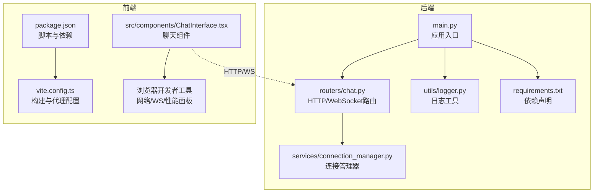
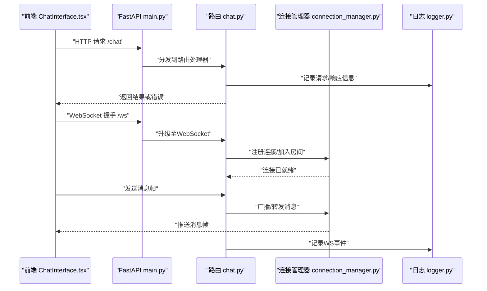
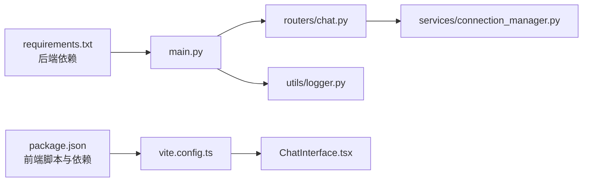

# 测试与调试

<cite>
**本文引用的文件**   
- [backend/app/main.py](file://backend/app/main.py)
- [backend/app/routers/chat.py](file://backend/app/routers/chat.py)
- [backend/app/services/connection_manager.py](file://backend/app/services/connection_manager.py)
- [backend/app/utils/logger.py](file://backend/app/utils/logger.py)
- [backend/requirements.txt](file://backend/requirements.txt)
- [frontend/src/components/ChatInterface.tsx](file://frontend/src/components/ChatInterface.tsx)
- [frontend/package.json](file://frontend/package.json)
- [frontend/vite.config.ts](file://frontend/vite.config.ts)
</cite>

## 目录
1. [简介](#简介)
2. [项目结构](#项目结构)
3. [核心组件](#核心组件)
4. [架构总览](#架构总览)
5. [详细组件分析](#详细组件分析)
6. [依赖分析](#依赖分析)
7. [性能考虑](#性能考虑)
8. [故障排查指南](#故障排查指南)
9. [结论](#结论)
10. [附录](#附录)

## 简介
本指南面向后端（FastAPI）与前端（React + Vite）的测试与调试实践，覆盖单元测试框架选择、用例编写规范、Mock数据策略；后端调试（FastAPI、WebSocket）、前端调试（React DevTools、浏览器开发者工具）；日志分析与性能监控、内存泄漏检测；集成测试与端到端测试策略，以及自动化测试流水线配置。文档中的示例与路径均基于仓库现有代码组织，便于快速落地。

## 项目结构
本项目采用前后端分离：
- 后端：FastAPI应用，路由与服务分层清晰，包含聊天路由、连接管理、工具与LLM适配等模块。
- 前端：React + TypeScript + Vite，提供聊天界面、设置页、3D模型查看器等组件。

图表来源
- [backend/app/main.py](file://backend/app/main.py)
- [backend/app/routers/chat.py](file://backend/app/routers/chat.py)
- [backend/app/services/connection_manager.py](file://backend/app/services/connection_manager.py)
- [backend/app/utils/logger.py](file://backend/app/utils/logger.py)
- [backend/requirements.txt](file://backend/requirements.txt)
- [frontend/src/components/ChatInterface.tsx](file://frontend/src/components/ChatInterface.tsx)
- [frontend/package.json](file://frontend/package.json)
- [frontend/vite.config.ts](file://frontend/vite.config.ts)

章节来源
- [backend/app/main.py](file://backend/app/main.py)
- [backend/app/routers/chat.py](file://backend/app/routers/chat.py)
- [backend/app/services/connection_manager.py](file://backend/app/services/connection_manager.py)
- [backend/app/utils/logger.py](file://backend/app/utils/logger.py)
- [backend/requirements.txt](file://backend/requirements.txt)
- [frontend/src/components/ChatInterface.tsx](file://frontend/src/components/ChatInterface.tsx)
- [frontend/package.json](file://frontend/package.json)
- [frontend/vite.config.ts](file://frontend/vite.config.ts)

## 核心组件
- 后端应用入口：负责创建FastAPI实例、挂载路由、注册中间件与生命周期钩子。
- 聊天路由：暴露HTTP接口与WebSocket端点，处理消息收发与流式响应。
- 连接管理器：维护WebSocket连接集合、广播消息、清理断开的连接。
- 日志工具：统一日志格式、级别与输出目标，便于问题定位与审计。
- 前端聊天组件：发起HTTP请求与建立WebSocket连接，渲染对话与状态。
- 构建与脚本：Vite配置与npm脚本，用于开发、构建与本地代理。

章节来源
- [backend/app/main.py](file://backend/app/main.py)
- [backend/app/routers/chat.py](file://backend/app/routers/chat.py)
- [backend/app/services/connection_manager.py](file://backend/app/services/connection_manager.py)
- [backend/app/utils/logger.py](file://backend/app/utils/logger.py)
- [frontend/src/components/ChatInterface.tsx](file://frontend/src/components/ChatInterface.tsx)
- [frontend/vite.config.ts](file://frontend/vite.config.ts)

## 架构总览
下图展示关键组件在运行时的交互关系，包括HTTP与WebSocket通道、连接管理与日志记录。

图表来源
- [backend/app/main.py](file://backend/app/main.py)
- [backend/app/routers/chat.py](file://backend/app/routers/chat.py)
- [backend/app/services/connection_manager.py](file://backend/app/services/connection_manager.py)
- [backend/app/utils/logger.py](file://backend/app/utils/logger.py)
- [frontend/src/components/ChatInterface.tsx](file://frontend/src/components/ChatInterface.tsx)

## 详细组件分析

### 后端单元测试与Mock策略
- 框架选择
  - 使用pytest作为测试框架，结合httpx的ASGI客户端进行异步路由测试。
  - 通过pytest-asyncio支持异步测试函数。
- 测试范围
  - 路由层：验证HTTP接口入参校验、返回值结构与状态码。
  - WebSocket：验证握手成功、消息收发、异常断开与重连场景。
  - 服务层：隔离外部依赖（如LLM、第三方工具），使用Mock替换。
- Mock策略
  - 使用unittest.mock.patch对第三方调用进行打桩，确保可重复性与稳定性。
  - 为连接管理器注入测试用连接集合，避免真实网络IO。
- 用例编写规范
  - 每个路由或服务方法至少覆盖正常路径与典型异常路径。
  - 使用参数化测试覆盖边界值与非法输入。
  - 对时间敏感逻辑使用freezegun冻结时间。
- 执行方式
  - 在项目根目录执行测试命令，生成覆盖率报告并输出失败详情。

章节来源
- [backend/app/routers/chat.py](file://backend/app/routers/chat.py)
- [backend/app/services/connection_manager.py](file://backend/app/services/connection_manager.py)
- [backend/requirements.txt](file://backend/requirements.txt)

### 后端调试技巧（FastAPI与WebSocket）
- FastAPI调试
  - 启用开发模式与自动重载，配合Uvicorn启动以便热更新。
  - 使用OpenAPI文档页面进行接口自测与参数校验。
  - 通过请求拦截与响应体打印定位序列化问题。
- WebSocket调试
  - 使用浏览器开发者工具的“网络”面板筛选WS连接，查看握手与帧内容。
  - 在后端连接管理器中增加连接ID与房间映射日志，辅助追踪消息流向。
  - 针对断线重连，模拟网络抖动与异常关闭，验证恢复逻辑。
- 日志与结构化输出
  - 统一日志格式，包含请求ID、用户标识、耗时与关键上下文。
  - 将关键路径写入独立日志文件，便于集中检索与分析。

章节来源
- [backend/app/main.py](file://backend/app/main.py)
- [backend/app/routers/chat.py](file://backend/app/routers/chat.py)
- [backend/app/services/connection_manager.py](file://backend/app/services/connection_manager.py)
- [backend/app/utils/logger.py](file://backend/app/utils/logger.py)

### 前端调试方法（React DevTools与浏览器工具）
- React DevTools
  - 检查组件树、Props与State变化，定位渲染异常与不必要的重渲染。
  - 使用Profiler分析组件渲染耗时，优化热点路径。
- 浏览器开发者工具
  - 网络面板：观察HTTP请求与WebSocket帧，确认接口契约与数据格式。
  - 控制台：捕获JS异常与警告，结合Source Map定位源码位置。
  - 性能面板：录制页面行为，识别长任务与布局抖动。
- 本地代理与跨域
  - 通过Vite代理将前端请求转发至后端，避免CORS干扰调试。
  - 在代理规则中保留原始Host与Header，便于后端鉴权与日志关联。

章节来源
- [frontend/src/components/ChatInterface.tsx](file://frontend/src/components/ChatInterface.tsx)
- [frontend/vite.config.ts](file://frontend/vite.config.ts)

### 日志分析指南
- 日志分级
  - DEBUG：详细上下文，仅开发环境开启。
  - INFO：关键业务节点与外部调用摘要。
  - WARNING：可恢复异常与降级路径。
  - ERROR：不可恢复错误与堆栈信息。
- 关键字段
  - 请求ID、用户ID、会话ID、操作类型、耗时、上游服务名称。
- 采集与检索
  - 按模块与级别拆分日志文件，使用grep或日志平台进行关键词检索。
  - 对高频错误进行聚合统计，形成告警阈值。

章节来源
- [backend/app/utils/logger.py](file://backend/app/utils/logger.py)

### 性能监控与内存泄漏检测
- 后端
  - 使用psutil或系统指标收集CPU、内存、GC次数与延迟分布。
  - 对WebSocket连接数与消息吞吐进行计数，设置上限与熔断策略。
  - 对慢查询与外部调用添加计时器，定位瓶颈。
- 前端
  - 使用Performance与Memory面板录制快照，对比不同版本差异。
  - 关注Event Listener与闭包引用导致的内存增长，及时释放资源。
  - 对大对象与图片缓存进行容量控制与过期策略。

[本节为通用指导，不直接分析具体文件]

### 集成测试与端到端测试策略
- 集成测试
  - 使用Testcontainers或本地Mock服务启动数据库与外部依赖。
  - 以真实协议（HTTP/WS）调用后端，验证端到端数据流转。
- 端到端测试
  - 使用Playwright或Cypress驱动浏览器，模拟用户操作与UI交互。
  - 录制关键业务流程，断言页面元素与网络请求一致性。
- 数据准备
  - 使用工厂模式生成稳定且多样化的测试数据。
  - 对敏感数据脱敏，保证测试安全与合规。

[本节为通用指导，不直接分析具体文件]

### 自动化测试流水线配置
- 触发条件
  - 提交到主分支或发起合并请求时自动运行。
- 步骤建议
  - 安装依赖、构建前端、启动后端、运行单元与集成测试、生成覆盖率报告。
  - 并行执行多阶段任务，缩短反馈周期。
- 质量门禁
  - 覆盖率阈值、静态检查与lint失败阻断合并。
  - 产物归档与测试报告持久化，便于回溯。

[本节为通用指导，不直接分析具体文件]

## 依赖分析
后端依赖集中在requirements.txt中，前端依赖与脚本在package.json中定义。构建与代理由vite.config.ts管理。

图表来源
- [backend/requirements.txt](file://backend/requirements.txt)
- [backend/app/main.py](file://backend/app/main.py)
- [backend/app/routers/chat.py](file://backend/app/routers/chat.py)
- [backend/app/services/connection_manager.py](file://backend/app/services/connection_manager.py)
- [backend/app/utils/logger.py](file://backend/app/utils/logger.py)
- [frontend/package.json](file://frontend/package.json)
- [frontend/vite.config.ts](file://frontend/vite.config.ts)
- [frontend/src/components/ChatInterface.tsx](file://frontend/src/components/ChatInterface.tsx)

章节来源
- [backend/requirements.txt](file://backend/requirements.txt)
- [frontend/package.json](file://frontend/package.json)
- [frontend/vite.config.ts](file://frontend/vite.config.ts)

## 性能考虑
- 后端
  - 合理设置连接池与超时，避免阻塞I/O。
  - 对WebSocket广播进行批处理与节流，降低CPU占用。
  - 使用异步上下文与轻量级数据结构减少内存分配。
- 前端
  - 懒加载与按需引入，减少首屏体积。
  - 对长列表与大图进行虚拟滚动与压缩。
  - 避免在渲染循环中创建新对象，复用计算结果。

[本节为通用指导，不直接分析具体文件]

## 故障排查指南
- 常见问题
  - WebSocket握手失败：检查端口、代理与CORS配置。
  - 消息丢失：核对连接管理器房间与会话映射，确认广播顺序。
  - 前端无响应：查看控制台错误与网络面板，确认接口契约一致。
- 定位手段
  - 打开DEBUG日志，提取请求ID与堆栈信息。
  - 使用浏览器录制性能与内存快照，对比基线。
  - 复现最小用例，逐步缩小影响范围。

章节来源
- [backend/app/routers/chat.py](file://backend/app/routers/chat.py)
- [backend/app/services/connection_manager.py](file://backend/app/services/connection_manager.py)
- [backend/app/utils/logger.py](file://backend/app/utils/logger.py)
- [frontend/src/components/ChatInterface.tsx](file://frontend/src/components/ChatInterface.tsx)

## 结论
通过统一的测试框架与Mock策略、完善的后端与前端调试手段、规范的日志与性能监控、以及自动化流水线，可以显著提升系统的可观测性与交付质量。建议在迭代中持续完善用例覆盖与性能基线，保障线上稳定性。

[本节为总结性内容，不直接分析具体文件]

## 附录
- 常用命令
  - 后端：启动开发服务器、运行测试、生成覆盖率报告。
  - 前端：启动开发服务器、构建产物、运行E2E测试。
- 参考路径
  - 后端入口与路由：见后端main与chat路由文件。
  - 前端组件与构建：见ChatInterface组件与vite配置。

[本节为补充说明，不直接分析具体文件]