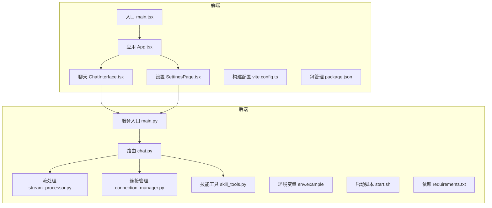
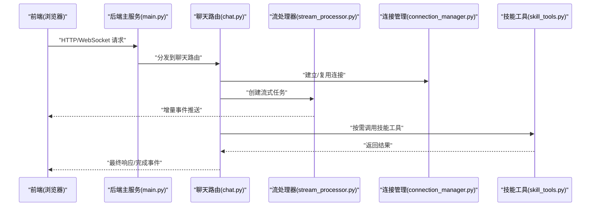
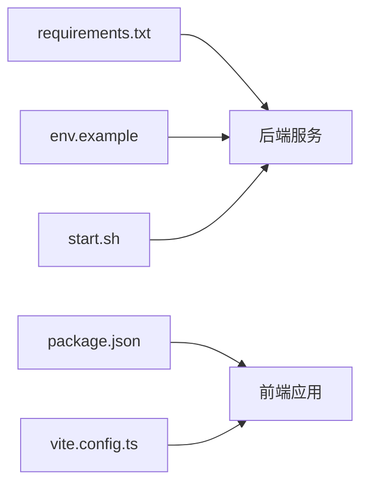

# 贡献指南

<cite>
**本文引用的文件**   
- [backend/app/main.py](file://backend/app/main.py)
- [backend/requirements.txt](file://backend/requirements.txt)
- [backend/start.sh](file://backend/start.sh)
- [backend/env.example](file://backend/env.example)
- [frontend/package.json](file://frontend/package.json)
- [frontend/vite.config.ts](file://frontend/vite.config.ts)
- [frontend/src/App.tsx](file://frontend/src/App.tsx)
- [frontend/src/main.tsx](file://frontend/src/main.tsx)
- [frontend/src/components/ChatInterface.tsx](file://frontend/src/components/ChatInterface.tsx)
- [frontend/src/components/SettingsPage.tsx](file://frontend/src/components/SettingsPage.tsx)
- [backend/app/routers/chat.py](file://backend/app/routers/chat.py)
- [backend/app/services/stream_processor.py](file://backend/app/services/stream_processor.py)
- [backend/app/services/connection_manager.py](file://backend/app/services/connection_manager.py)
- [backend/app/tools/skill_tools.py](file://backend/app/tools/skill_tools.py)
- [backend/skills/public/skill-creator/SKILL.md](file://backend/skills/public/skill-creator/SKILL.md)
- [backend/workspace/AGENTS.md](file://backend/workspace/AGENTS.md)
</cite>

## 目录
1. [简介](#简介)
2. [项目结构](#项目结构)
3. [核心组件](#核心组件)
4. [架构总览](#架构总览)
5. [详细组件分析](#详细组件分析)
6. [依赖分析](#依赖分析)
7. [性能考虑](#性能考虑)
8. [故障排查指南](#故障排查指南)
9. [结论](#结论)
10. [附录](#附录)

## 简介
本贡献指南面向希望参与 PolyStudio 项目的开发者与使用者，提供从问题反馈、功能请求、代码讨论到 Pull Request 提交流程、代码审查标准、合并要求的全流程说明。同时包含问题分类模板、功能需求描述规范、设计文档撰写指南、社区行为准则、沟通渠道与维护者联系方式，以及版本发布流程、向后兼容性政策与迁移指导原则，帮助贡献者高效协作并保障项目质量与稳定性。

## 项目结构
PolyStudio 采用前后端分离的架构：
- 后端（Python + FastAPI）：提供聊天、设置等 API，集成流式处理、连接管理与工具链（技能、音视频生成等）。
- 前端（React + Vite + TypeScript）：提供聊天界面、设置页、模型查看器等交互能力。
- 技能系统：通过约定目录与元数据驱动可扩展能力。

图表来源
- [frontend/src/main.tsx](file://frontend/src/main.tsx)
- [frontend/src/App.tsx](file://frontend/src/App.tsx)
- [frontend/src/components/ChatInterface.tsx](file://frontend/src/components/ChatInterface.tsx)
- [frontend/src/components/SettingsPage.tsx](file://frontend/src/components/SettingsPage.tsx)
- [frontend/vite.config.ts](file://frontend/vite.config.ts)
- [frontend/package.json](file://frontend/package.json)
- [backend/app/main.py](file://backend/app/main.py)
- [backend/app/routers/chat.py](file://backend/app/routers/chat.py)
- [backend/app/services/stream_processor.py](file://backend/app/services/stream_processor.py)
- [backend/app/services/connection_manager.py](file://backend/app/services/connection_manager.py)
- [backend/app/tools/skill_tools.py](file://backend/app/tools/skill_tools.py)
- [backend/env.example](file://backend/env.example)
- [backend/start.sh](file://backend/start.sh)
- [backend/requirements.txt](file://backend/requirements.txt)

章节来源
- [backend/app/main.py](file://backend/app/main.py)
- [backend/requirements.txt](file://backend/requirements.txt)
- [backend/start.sh](file://backend/start.sh)
- [backend/env.example](file://backend/env.example)
- [frontend/package.json](file://frontend/package.json)
- [frontend/vite.config.ts](file://frontend/vite.config.ts)
- [frontend/src/App.tsx](file://frontend/src/App.tsx)
- [frontend/src/main.tsx](file://frontend/src/main.tsx)
- [frontend/src/components/ChatInterface.tsx](file://frontend/src/components/ChatInterface.tsx)
- [frontend/src/components/SettingsPage.tsx](file://frontend/src/components/SettingsPage.tsx)

## 核心组件
- 后端服务入口与路由：负责初始化应用、注册路由、挂载中间件与生命周期钩子。
- 聊天路由与服务：处理聊天请求、调用流式处理器、维护连接状态。
- 流式处理：实现服务端事件流推送，提升交互体验。
- 连接管理：管理客户端连接、心跳、重连策略。
- 技能工具：封装可插拔的工具能力，支持扩展与组合。
- 前端应用：基于 React/Vite 构建，提供聊天与设置页面，与后端 API 通信。

章节来源
- [backend/app/main.py](file://backend/app/main.py)
- [backend/app/routers/chat.py](file://backend/app/routers/chat.py)
- [backend/app/services/stream_processor.py](file://backend/app/services/stream_processor.py)
- [backend/app/services/connection_manager.py](file://backend/app/services/connection_manager.py)
- [backend/app/tools/skill_tools.py](file://backend/app/tools/skill_tools.py)
- [frontend/src/App.tsx](file://frontend/src/App.tsx)
- [frontend/src/components/ChatInterface.tsx](file://frontend/src/components/ChatInterface.tsx)
- [frontend/src/components/SettingsPage.tsx](file://frontend/src/components/SettingsPage.tsx)

## 架构总览
整体交互流程如下：前端发起聊天或设置请求，后端路由接收并调度相应服务；聊天场景下使用流式处理器进行增量输出，并通过连接管理器维持长连接；技能工具按需加载执行。

图表来源
- [backend/app/main.py](file://backend/app/main.py)
- [backend/app/routers/chat.py](file://backend/app/routers/chat.py)
- [backend/app/services/stream_processor.py](file://backend/app/services/stream_processor.py)
- [backend/app/services/connection_manager.py](file://backend/app/services/connection_manager.py)
- [backend/app/tools/skill_tools.py](file://backend/app/tools/skill_tools.py)

## 详细组件分析

### 后端服务入口与路由
- 职责：初始化应用实例、注册路由、配置跨域与安全策略、挂载中间件。
- 关键点：确保环境变量加载、日志与错误处理统一接入。
- 建议：新增路由时遵循 RESTful 命名与版本前缀策略。

章节来源
- [backend/app/main.py](file://backend/app/main.py)
- [backend/app/routers/chat.py](file://backend/app/routers/chat.py)

### 聊天路由与流式处理
- 职责：解析聊天请求参数、校验输入、调度流式处理器、维护连接上下文。
- 关键点：流式事件格式稳定、错误事件及时上报、断线重连友好。
- 建议：为不同消息类型定义清晰的协议字段与枚举值。

章节来源
- [backend/app/routers/chat.py](file://backend/app/routers/chat.py)
- [backend/app/services/stream_processor.py](file://backend/app/services/stream_processor.py)
- [backend/app/services/connection_manager.py](file://backend/app/services/connection_manager.py)

### 技能工具与扩展机制
- 职责：封装具体工具能力（如音视频处理、图像生成），对外暴露统一接口。
- 关键点：工具注册表、参数校验、资源清理、失败回退。
- 建议：在公共技能目录下遵循 SKILL.md 约定，便于自动发现与打包。

章节来源
- [backend/app/tools/skill_tools.py](file://backend/app/tools/skill_tools.py)
- [backend/skills/public/skill-creator/SKILL.md](file://backend/skills/public/skill-creator/SKILL.md)

### 前端应用与页面组件
- 职责：渲染聊天与设置界面，与后端 API 通信，管理本地状态与用户偏好。
- 关键点：网络请求重试、错误提示、表单校验、主题与国际化预留。
- 建议：组件职责单一，样式与逻辑解耦，便于测试与维护。

章节来源
- [frontend/src/App.tsx](file://frontend/src/App.tsx)
- [frontend/src/main.tsx](file://frontend/src/main.tsx)
- [frontend/src/components/ChatInterface.tsx](file://frontend/src/components/ChatInterface.tsx)
- [frontend/src/components/SettingsPage.tsx](file://frontend/src/components/SettingsPage.tsx)
- [frontend/vite.config.ts](file://frontend/vite.config.ts)
- [frontend/package.json](file://frontend/package.json)

## 依赖分析
- 后端依赖：通过 requirements.txt 声明 Python 包版本，建议使用虚拟环境安装。
- 前端依赖：通过 package.json 管理 npm 包，Vite 作为构建工具。
- 运行环境：后端通过 start.sh 启动，环境变量参考 env.example。

图表来源
- [backend/requirements.txt](file://backend/requirements.txt)
- [frontend/package.json](file://frontend/package.json)
- [frontend/vite.config.ts](file://frontend/vite.config.ts)
- [backend/env.example](file://backend/env.example)
- [backend/start.sh](file://backend/start.sh)

章节来源
- [backend/requirements.txt](file://backend/requirements.txt)
- [frontend/package.json](file://frontend/package.json)
- [frontend/vite.config.ts](file://frontend/vite.config.ts)
- [backend/env.example](file://backend/env.example)
- [backend/start.sh](file://backend/start.sh)

## 性能考虑
- 流式处理：优先使用增量推送减少首屏延迟，合理控制事件粒度。
- 连接管理：实现心跳检测与指数退避重连，避免雪崩效应。
- 资源限制：对大文件上传与生成任务增加超时与并发上限。
- 缓存策略：对热点查询与静态资源启用缓存，降低后端压力。
- 前端优化：懒加载组件、图片压缩、按需引入第三方库。

[本节为通用性能建议，不直接分析具体文件]

## 故障排查指南
- 常见问题定位：
  - 后端启动失败：检查环境变量与端口占用，确认依赖安装完整。
  - 前端无法访问后端：核对代理配置与跨域设置，验证 API 路径。
  - 聊天无响应：查看连接状态与流式事件是否到达，检查错误事件。
- 日志与调试：
  - 后端：统一日志接入，关键路径打印入参出参与异常堆栈。
  - 前端：开启开发模式网络面板，捕获请求失败与超时信息。
- 恢复策略：
  - 自动重试与降级：对不稳定外部依赖实施重试与默认回退。
  - 优雅关闭：释放连接与资源，保证数据一致性。

章节来源
- [backend/app/main.py](file://backend/app/main.py)
- [backend/app/services/connection_manager.py](file://backend/app/services/connection_manager.py)
- [backend/app/services/stream_processor.py](file://backend/app/services/stream_processor.py)
- [frontend/src/components/ChatInterface.tsx](file://frontend/src/components/ChatInterface.tsx)

## 结论
本贡献指南明确了问题反馈、功能请求、代码讨论与 Pull Request 流程，提供了代码审查标准与合并要求，并给出问题分类模板、功能需求描述规范与设计文档撰写指南。配合社区行为准则、沟通渠道与维护者联系方式，有助于形成高效、透明、可持续的协作生态。版本发布流程、向后兼容性与迁移指导将进一步提升系统的稳定性与可演进性。

[本节为总结性内容，不直接分析具体文件]

## 附录

### 问题报告模板
- 标题：简明扼要描述问题现象
- 复现步骤：
  - 步骤一
  - 步骤二
  - 步骤三
- 期望行为：
- 实际行为：
- 环境信息：
  - 操作系统与版本
  - 浏览器或客户端版本
  - 后端版本与部署方式
  - 相关日志片段（脱敏）
- 截图或录屏：
- 附加信息：

### 功能请求模板
- 标题：清晰表达需求目标
- 背景与动机：
- 需求描述：
  - 用户故事
  - 验收标准
- 影响范围：
  - 涉及模块
  - 接口变更
  - 数据模型变更
- 非功能性需求：
  - 性能指标
  - 安全与合规
  - 可观测性
- 替代方案与权衡：
- 参考链接与资料：

### 设计文档撰写指南
- 概述：目标、范围、术语
- 现状与痛点：
- 设计方案：
  - 架构图与流程图
  - 接口契约与数据模型
  - 关键算法与策略
- 实施计划：
  - 里程碑与任务拆分
  - 风险与缓解措施
- 测试与验收：
  - 单元测试与集成测试
  - 回归与压测方案
- 发布与回滚：
  - 灰度策略
  - 回滚预案
- 附录：
  - 参考资料
  - 变更记录

### 社区行为准则
- 尊重与包容：尊重不同观点与文化背景
- 建设性沟通：聚焦问题与解决方案，避免人身攻击
- 透明与开放：公开讨论、记录决策过程
- 负责任的行为：遵守法律法规与平台规则
- 违规处理：警告、暂时禁言、永久封禁

### 沟通渠道说明
- 问题与功能请求：GitHub Issues
- 代码讨论：Pull Requests 评论与 Issue 讨论区
- 即时沟通：团队内部通讯工具（由维护者提供邀请链接）
- 文档与公告：仓库 Wiki 与 README 更新

### 维护者联系方式
- 邮箱：维护者邮箱地址（由维护者提供）
- GitHub：仓库主页与 Issue 标签
- 会议：定期技术分享与路线图对齐会议（由维护者通知）

### Pull Request 提交流程
- 分支策略：
  - 主干保护：main/master 受保护
  - 功能分支：feature/*
  - 修复分支：fix/*
  - 发布分支：release/*
- 提交规范：
  - 语义化提交信息（feat/fix/docs/chore 等）
  - 小步提交、原子化变更
- 本地验证：
  - 后端：依赖安装、单元测试、集成测试
  - 前端：构建成功、Lint 通过、基础用例通过
- 提交 PR：
  - 填写变更说明与影响范围
  - 关联相关 Issue
  - 附上截图或演示链接（如有 UI 变更）
- 代码审查：
  - 至少一名维护者审查通过
  - 关注可读性、健壮性、性能与安全性
- 合并要求：
  - CI 全部通过
  - 无冲突且符合分支策略
  - 变更已充分测试与文档更新

### 代码审查标准
- 正确性：逻辑正确、边界条件覆盖、异常处理完善
- 可读性：命名清晰、注释必要、结构简洁
- 可维护性：模块化、低耦合、高内聚
- 性能：避免不必要的计算与 I/O、合理使用缓存
- 安全性：输入校验、敏感信息脱敏、权限控制
- 可测试性：可单测、可集成测试、可回归测试

### 版本发布流程
- 版本号策略：语义化版本（主.次.修订）
- 发布候选：
  - 冻结特性，仅修复关键缺陷
  - 全量回归测试与压测
- 发布清单：
  - 更新 CHANGELOG
  - 更新 README 与迁移指南
  - 构建产物签名与校验
- 发布后：
  - 监控告警与快速回滚预案
  - 收集用户反馈与问题追踪

### 向后兼容性政策
- 接口兼容：
  - 新增字段可选，旧字段保留
  - 废弃字段需标记并提供迁移期
- 数据兼容：
  - 数据库迁移脚本幂等与回滚
  - 数据校验与容错
- 行为兼容：
  - 默认行为不变，新行为可通过开关启用
- 弃用策略：
  - 提前通告与过渡期
  - 提供自动化迁移工具

### 迁移指导原则
- 评估影响：识别受影响模块与依赖
- 制定计划：分阶段迁移与灰度发布
- 数据迁移：备份与回滚方案
- 用户通知：公告与操作指引
- 验证与回滚：端到端验证与快速回滚

### 环境与启动
- 后端：
  - 复制环境变量示例并配置
  - 安装依赖并启动服务
- 前端：
  - 安装依赖并启动开发服务器
  - 配置代理指向后端服务

章节来源
- [backend/env.example](file://backend/env.example)
- [backend/start.sh](file://backend/start.sh)
- [backend/requirements.txt](file://backend/requirements.txt)
- [frontend/package.json](file://frontend/package.json)
- [frontend/vite.config.ts](file://frontend/vite.config.ts)