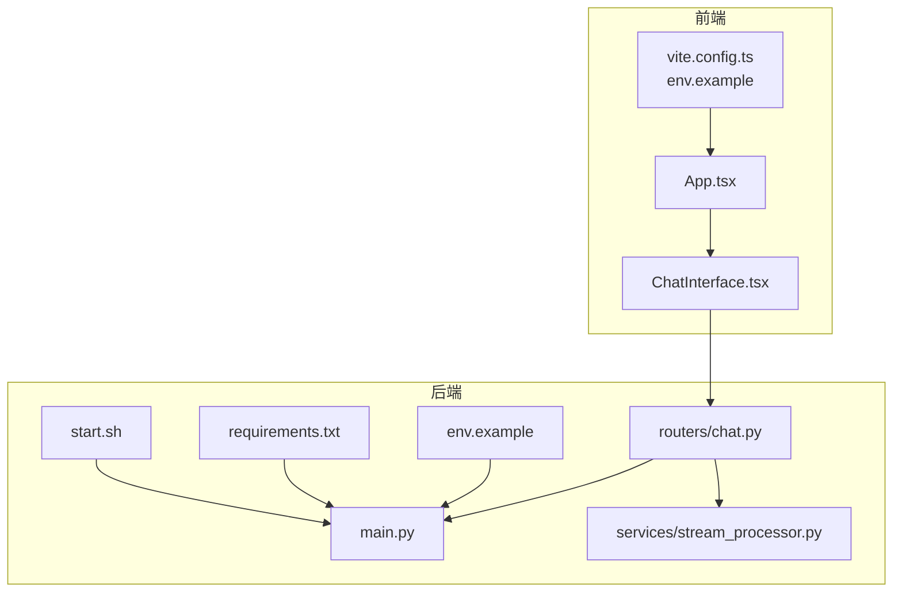
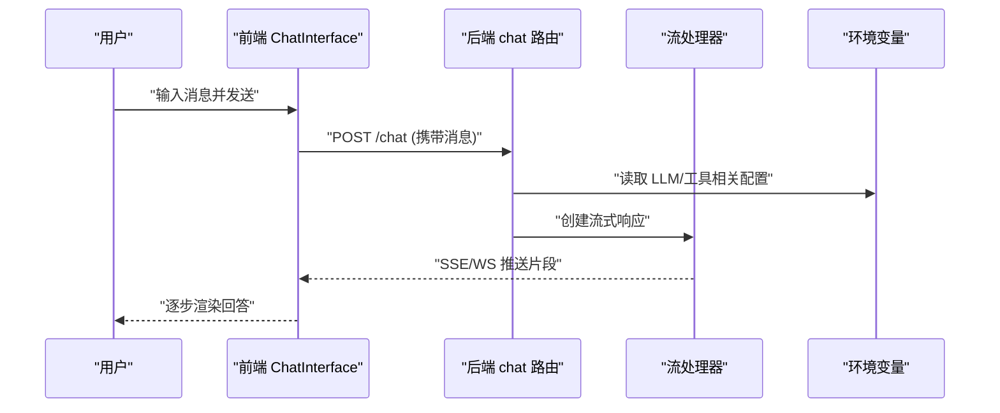
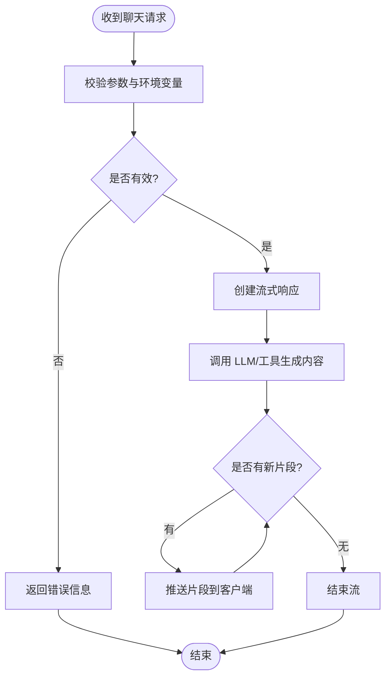
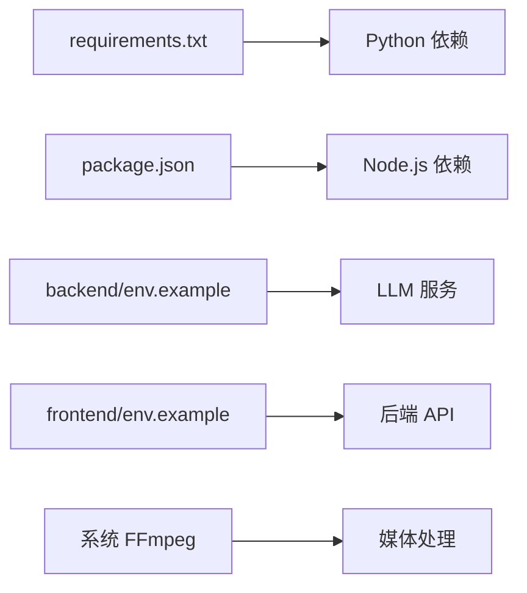

# 快速开始

<cite>
**本文引用的文件**   
- [backend/requirements.txt](file://backend/requirements.txt)
- [backend/env.example](file://backend/env.example)
- [backend/start.sh](file://backend/start.sh)
- [backend/app/main.py](file://backend/app/main.py)
- [backend/app/routers/chat.py](file://backend/app/routers/chat.py)
- [backend/app/services/stream_processor.py](file://backend/app/services/stream_processor.py)
- [frontend/package.json](file://frontend/package.json)
- [frontend/vite.config.ts](file://frontend/vite.config.ts)
- [frontend/env.example](file://frontend/env.example)
- [frontend/src/App.tsx](file://frontend/src/App.tsx)
- [frontend/src/components/ChatInterface.tsx](file://frontend/src/components/ChatInterface.tsx)
</cite>

## 目录
1. [简介](#简介)
2. [项目结构](#项目结构)
3. [核心组件](#核心组件)
4. [架构总览](#架构总览)
5. [详细组件分析](#详细组件分析)
6. [依赖分析](#依赖分析)
7. [性能考虑](#性能考虑)
8. [故障排除指南](#故障排除指南)
9. [结论](#结论)
10. [附录](#附录)

## 简介
本指南面向首次接触 PolyStudio 的用户，帮助你在最短时间内完成本地开发环境搭建并体验核心功能。你将了解：
- 环境与系统依赖要求（Python、Node.js、FFmpeg 等）
- 后端与前端服务的启动步骤
- 环境变量配置要点
- 基本使用示例（AI 对话、上传文件、基础功能）
- 常见问题排查方法

## 项目结构
PolyStudio 采用前后端分离的架构：
- 后端：基于 Python 的 FastAPI 服务，提供聊天、设置、工作区、工具调用等能力
- 前端：基于 React + Vite 的单页应用，提供聊天界面、设置页面、3D 模型查看器等交互

图表来源
- [frontend/src/App.tsx](file://frontend/src/App.tsx)
- [frontend/src/components/ChatInterface.tsx](file://frontend/src/components/ChatInterface.tsx)
- [frontend/vite.config.ts](file://frontend/vite.config.ts)
- [frontend/env.example](file://frontend/env.example)
- [backend/app/main.py](file://backend/app/main.py)
- [backend/app/routers/chat.py](file://backend/app/routers/chat.py)
- [backend/app/services/stream_processor.py](file://backend/app/services/stream_processor.py)
- [backend/env.example](file://backend/env.example)
- [backend/requirements.txt](file://backend/requirements.txt)
- [backend/start.sh](file://backend/start.sh)

章节来源
- [backend/requirements.txt](file://backend/requirements.txt)
- [backend/env.example](file://backend/env.example)
- [backend/start.sh](file://backend/start.sh)
- [backend/app/main.py](file://backend/app/main.py)
- [backend/app/routers/chat.py](file://backend/app/routers/chat.py)
- [backend/app/services/stream_processor.py](file://backend/app/services/stream_processor.py)
- [frontend/package.json](file://frontend/package.json)
- [frontend/vite.config.ts](file://frontend/vite.config.ts)
- [frontend/env.example](file://frontend/env.example)
- [frontend/src/App.tsx](file://frontend/src/App.tsx)
- [frontend/src/components/ChatInterface.tsx](file://frontend/src/components/ChatInterface.tsx)

## 核心组件
- 后端主入口：负责初始化应用、注册路由、加载配置与环境变量
- 聊天路由：处理消息收发、流式响应、会话上下文管理
- 流处理器：实现服务端到前端的实时数据推送
- 前端应用：集成聊天界面、设置页面、资源上传与预览
- 构建与运行脚本：统一后端启动流程，简化依赖安装与服务启动

章节来源
- [backend/app/main.py](file://backend/app/main.py)
- [backend/app/routers/chat.py](file://backend/app/routers/chat.py)
- [backend/app/services/stream_processor.py](file://backend/app/services/stream_processor.py)
- [frontend/src/App.tsx](file://frontend/src/App.tsx)
- [frontend/src/components/ChatInterface.tsx](file://frontend/src/components/ChatInterface.tsx)
- [backend/start.sh](file://backend/start.sh)

## 架构总览
下图展示了从用户发起对话到后端返回流式响应的关键路径，以及前后端的环境配置关系。

图表来源
- [backend/app/routers/chat.py](file://backend/app/routers/chat.py)
- [backend/app/services/stream_processor.py](file://backend/app/services/stream_processor.py)
- [frontend/src/components/ChatInterface.tsx](file://frontend/src/components/ChatInterface.tsx)
- [backend/env.example](file://backend/env.example)

## 详细组件分析

### 环境准备与依赖
- Python 版本
  - 建议遵循后端 requirements 中指定的最小版本；若存在兼容性问题，优先选择较新的稳定版
  - 参考：[backend/requirements.txt](file://backend/requirements.txt)
- Node.js 版本
  - 建议与前端 package.json 中的 engines 或构建工具链兼容的版本一致
  - 参考：[frontend/package.json](file://frontend/package.json)
- FFmpeg 系统依赖
  - 若涉及音视频处理（如混音、拼接），请确保系统已安装 FFmpeg 且可执行命令可用
  - 常见平台安装方式请参考各自官方文档
- 虚拟环境
  - 建议使用 venv 或 conda 隔离 Python 依赖，避免冲突

章节来源
- [backend/requirements.txt](file://backend/requirements.txt)
- [frontend/package.json](file://frontend/package.json)

### 后端服务启动
- 安装依赖
  - 在 backend 目录下使用 pip 安装 requirements
- 环境变量
  - 复制 env.example 为 .env，按需填写 LLM 提供商密钥、存储路径等
  - 参考：[backend/env.example](file://backend/env.example)
- 启动服务
  - 可直接运行 start.sh 脚本，或在命令行中使用 uvicorn 启动 main 应用
  - 参考：[backend/start.sh](file://backend/start.sh)、[backend/app/main.py](file://backend/app/main.py)

章节来源
- [backend/env.example](file://backend/env.example)
- [backend/start.sh](file://backend/start.sh)
- [backend/app/main.py](file://backend/app/main.py)

### 前端应用运行
- 安装依赖
  - 在 frontend 目录下使用 npm/yarn/pnpm 安装依赖
- 环境变量
  - 复制 env.example 为 .env.development（Vite 默认读取），配置后端地址等
  - 参考：[frontend/env.example](file://frontend/env.example)
- 启动开发服务器
  - 使用 Vite 提供的 dev 命令启动，访问浏览器即可
  - 参考：[frontend/vite.config.ts](file://frontend/vite.config.ts)

章节来源
- [frontend/env.example](file://frontend/env.example)
- [frontend/vite.config.ts](file://frontend/vite.config.ts)

### 环境变量配置要点
- 后端
  - LLM 相关：API Key、Base URL、模型名称等
  - 存储与工作区：本地或云存储路径、权限策略
  - 日志级别与调试开关
  - 参考：[backend/env.example](file://backend/env.example)
- 前端
  - 后端接口地址、代理配置、静态资源路径
  - 参考：[frontend/env.example](file://frontend/env.example)

章节来源
- [backend/env.example](file://backend/env.example)
- [frontend/env.example](file://frontend/env.example)

### 基本使用示例
- AI 对话
  - 在前端聊天界面输入问题并发送，后端通过 chat 路由处理并返回流式结果
  - 参考：[frontend/src/components/ChatInterface.tsx](file://frontend/src/components/ChatInterface.tsx)、[backend/app/routers/chat.py](file://backend/app/routers/chat.py)
- 上传文件
  - 在聊天界面或设置页面选择文件进行上传，后端接收后写入工作区或对象存储
  - 参考：[frontend/src/components/ChatInterface.tsx](file://frontend/src/components/ChatInterface.tsx)、[backend/app/routers/chat.py](file://backend/app/routers/chat.py)
- 基础功能
  - 查看设置页面，切换模型、调整输出风格、启用/禁用工具
  - 参考：[frontend/src/App.tsx](file://frontend/src/App.tsx)

章节来源
- [frontend/src/components/ChatInterface.tsx](file://frontend/src/components/ChatInterface.tsx)
- [backend/app/routers/chat.py](file://backend/app/routers/chat.py)
- [frontend/src/App.tsx](file://frontend/src/App.tsx)

### 流式响应流程

图表来源
- [backend/app/routers/chat.py](file://backend/app/routers/chat.py)
- [backend/app/services/stream_processor.py](file://backend/app/services/stream_processor.py)

## 依赖分析
- 后端依赖
  - Python 包：由 requirements.txt 定义，包含 Web 框架、LLM SDK、工具库等
  - 系统依赖：FFmpeg（音视频处理）、可选的 GPU/CUDA 驱动（若使用本地推理）
- 前端依赖
  - Node.js 生态：React、Vite、TypeScript 及 UI 组件库
- 外部服务
  - LLM 提供商：需配置 API Key 与 Base URL
  - 对象存储：用于持久化上传的文件与生成产物

图表来源
- [backend/requirements.txt](file://backend/requirements.txt)
- [frontend/package.json](file://frontend/package.json)
- [backend/env.example](file://backend/env.example)
- [frontend/env.example](file://frontend/env.example)

章节来源
- [backend/requirements.txt](file://backend/requirements.txt)
- [frontend/package.json](file://frontend/package.json)
- [backend/env.example](file://backend/env.example)
- [frontend/env.example](file://frontend/env.example)

## 性能考虑
- 流式响应
  - 合理控制片段大小与推送频率，避免前端渲染抖动
- 并发与连接数
  - 根据部署环境调整后端 worker 数量与连接池大小
- 资源缓存
  - 对静态资源与常用提示词进行缓存，减少重复计算
- 媒体处理
  - 大文件上传与转码建议在异步队列中处理，避免阻塞主线程

## 故障排除指南
- 无法连接后端
  - 检查前端环境变量中的后端地址是否正确
  - 确认后端服务已启动且端口未被占用
  - 参考：[frontend/env.example](file://frontend/env.example)、[backend/start.sh](file://backend/start.sh)
- LLM 调用失败
  - 核对后端环境变量中的 API Key 与 Base URL
  - 检查网络连通性与配额限制
  - 参考：[backend/env.example](file://backend/env.example)
- 文件上传失败
  - 确认存储路径权限与磁盘空间
  - 检查文件大小与类型限制
  - 参考：[backend/app/routers/chat.py](file://backend/app/routers/chat.py)
- FFmpeg 未找到
  - 安装 FFmpeg 并确保在系统 PATH 中可执行
  - 参考：[backend/requirements.txt](file://backend/requirements.txt)
- 端口冲突
  - 修改后端或前端的监听端口，避免冲突
  - 参考：[backend/start.sh](file://backend/start.sh)、[frontend/vite.config.ts](file://frontend/vite.config.ts)

章节来源
- [frontend/env.example](file://frontend/env.example)
- [backend/start.sh](file://backend/start.sh)
- [backend/env.example](file://backend/env.example)
- [backend/app/routers/chat.py](file://backend/app/routers/chat.py)
- [backend/requirements.txt](file://backend/requirements.txt)
- [frontend/vite.config.ts](file://frontend/vite.config.ts)

## 结论
通过以上步骤，你应能成功搭建 PolyStudio 的本地开发环境并完成基本使用。若遇到问题，请优先检查环境变量与系统依赖，再结合“故障排除指南”定位原因。

## 附录
- 推荐开发工具
  - Python：venv/conda、IDE（VS Code/PyCharm）
  - Node.js：nvm、IDE（VS Code）
  - 调试：浏览器开发者工具、后端日志
- 扩展阅读
  - 技能与工作区：参考 workspace 与 skills 目录下的说明文档
  - 工具与能力：查看 tools 目录下的具体实现与用法