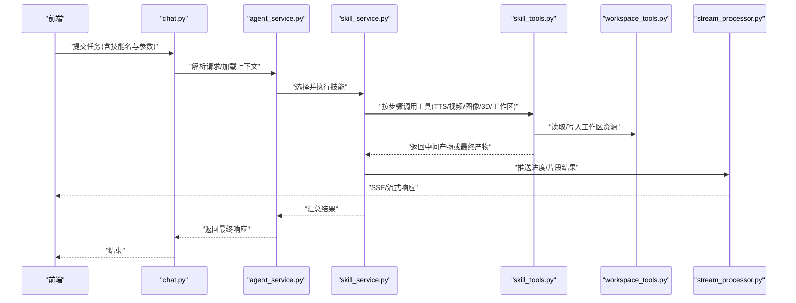
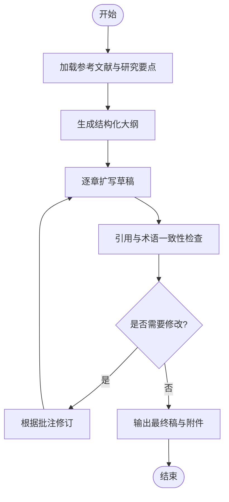
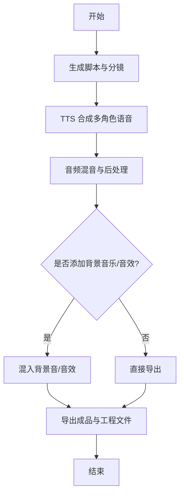
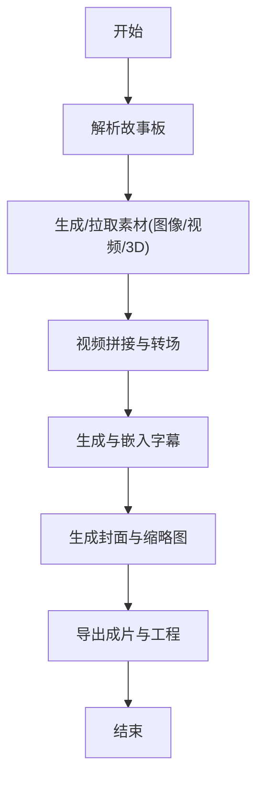
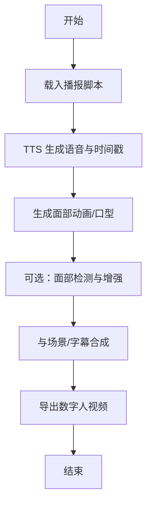
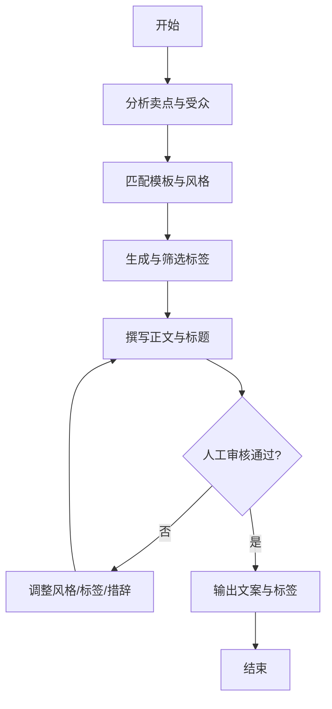
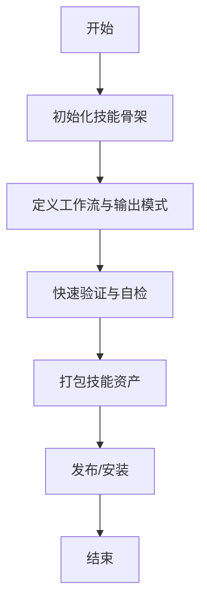
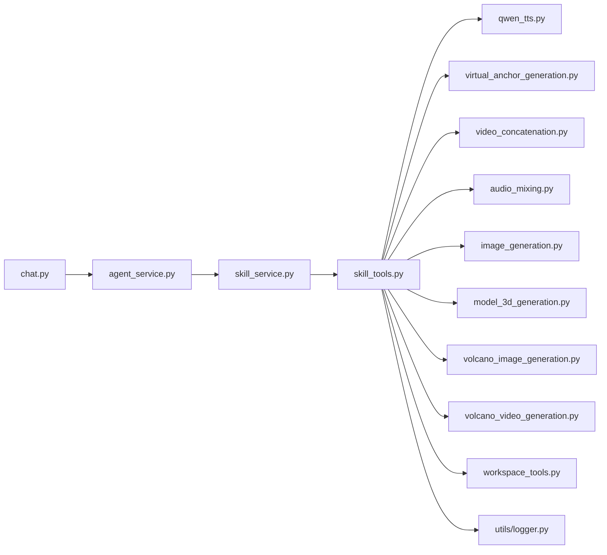

# 内置技能说明

<cite>
**本文引用的文件**   
- [backend/app/services/skill_service.py](file://backend/app/services/skill_service.py)
- [backend/app/tools/skill_tools.py](file://backend/app/tools/skill_tools.py)
- [backend/app/tools/qwen_tts.py](file://backend/app/tools/qwen_tts.py)
- [backend/app/tools/virtual_anchor_generation.py](file://backend/app/tools/virtual_anchor_generation.py)
- [backend/app/tools/video_concatenation.py](file://backend/app/tools/video_concatenation.py)
- [backend/app/tools/audio_mixing.py](file://backend/app/tools/audio_mixing.py)
- [backend/app/tools/image_generation.py](file://backend/app/tools/image_generation.py)
- [backend/app/tools/model_3d_generation.py](file://backend/app/tools/model_3d_generation.py)
- [backend/app/tools/volcano_image_generation.py](file://backend/app/tools/volcano_image_generation.py)
- [backend/app/tools/volcano_video_generation.py](file://backend/app/tools/volcano_video_generation.py)
- [backend/app/tools/workspace_tools.py](file://backend/app/tools/workspace_tools.py)
- [backend/app/utils/face_detection.py](file://backend/app/utils/face_detection.py)
- [backend/app/utils/logger.py](file://backend/app/utils/logger.py)
- [backend/app/main.py](file://backend/app/main.py)
- [backend/app/routers/chat.py](file://backend/app/routers/chat.py)
- [backend/app/routers/settings.py](file://backend/app/routers/settings.py)
- [backend/app/services/agent_service.py](file://backend/app/services/agent_service.py)
- [backend/app/services/stream_processor.py](file://backend/app/services/stream_processor.py)
- [backend/app/services/history_service.py](file://backend/app/services/history_service.py)
- [backend/app/services/connection_manager.py](file://backend/app/services/connection_manager.py)
- [backend/app/services/prompt.py](file://backend/app/services/prompt.py)
- [backend/app/services/workspace_service.py](file://backend/app/services/workspace_service.py)
- [backend/skills/custom/paper-writing/SKILL.md](file://backend/skills/custom/paper-writing/SKILL.md)
- [backend/skills/custom/paper-writing/references/research_tips.md](file://backend/skills/custom/paper-writing/references/research_tips.md)
- [backend/skills/custom/podcast-creator/SKILL.md](file://backend/skills/custom/podcast-creator/SKILL.md)
- [backend/skills/custom/video-creator/SKILL.md](file://backend/skills/custom/video-creator/SKILL.md)
- [backend/skills/custom/video-creator/references/storyboard_format.md](file://backend/skills/custom/video-creator/references/storyboard_format.md)
- [backend/skills/custom/virtual-anchor/SKILL.md](file://backend/skills/custom/virtual-anchor/SKILL.md)
- [backend/skills/custom/xiaohongshu-copywriter/SKILL.md](file://backend/skills/custom/xiaohongshu-copywriter/SKILL.md)
- [backend/skills/custom/xiaohongshu-copywriter/references/xiaohongshu_tags.md](file://backend/skills/custom/xiaohongshu-copywriter/references/xiaohongshu_tags.md)
- [backend/skills/custom/xiaohongshu-copywriter/references/xiaohongshu_template.md](file://backend/skills/custom/xiaohongshu-copywriter/references/xiaohongshu_template.md)
- [backend/skills/public/skill-creator/SKILL.md](file://backend/skills/public/skill-creator/SKILL.md)
- [backend/skills/public/skill-creator/scripts/init_skill.py](file://backend/skills/public/skill-creator/scripts/init_skill.py)
- [backend/skills/public/skill-creator/scripts/package_skill.py](file://backend/skills/public/skill-creator/scripts/package_skill.py)
- [backend/skills/public/skill-creator/scripts/quick_validate.py](file://backend/skills/public/skill-creator/scripts/quick_validate.py)
- [backend/skills/public/skill-creator/references/output-patterns.md](file://backend/skills/public/skill-creator/references/output-patterns.md)
- [backend/skills/public/skill-creator/references/workflows.md](file://backend/skills/public/skill-creator/references/workflows.md)
- [backend/workspace/AGENTS.md](file://backend/workspace/AGENTS.md)
- [backend/workspace/IDENTITY.md](file://backend/workspace/IDENTITY.md)
- [backend/workspace/MEMORY.md](file://backend/workspace/MEMORY.md)
- [backend/workspace/SOUL.md](file://backend/workspace/SOUL.md)
- [backend/workspace/TOOLS.md](file://backend/workspace/TOOLS.md)
- [backend/workspace/USER.md](file://backend/workspace/USER.md)
- [backend/FRAMEWORK.md](file://backend/FRAMEWORK.md)
</cite>

## 目录
1. [简介](#简介)
2. [项目结构](#项目结构)
3. [核心组件](#核心组件)
4. [架构总览](#架构总览)
5. [详细组件分析](#详细组件分析)
6. [依赖关系分析](#依赖关系分析)
7. [性能考虑](#性能考虑)
8. [故障排查指南](#故障排查指南)
9. [结论](#结论)
10. [附录](#附录)

## 简介
本指南面向使用 PolyStudio 内置技能的创作者与开发者，系统介绍论文写作助手、播客创作者、视频制作工具、虚拟主播生成器等技能的功能特性、配置选项、输入输出格式与工作流程。文档同时提供调用示例路径、协作关系与数据流转机制、性能优化建议与常见问题解决方案，帮助读者快速上手并高效产出高质量内容。

## 项目结构
PolyStudio 后端采用“服务层 + 工具层 + 技能定义”的分层组织方式：
- 服务层：负责编排工作流、会话管理、历史与提示词管理等
- 工具层：封装音视频处理、图像/3D 生成、TTS、工作区读写等能力
- 技能定义：以 SKILL.md 与 references 描述技能的工作流程、参考模板与输出模式

```mermaid
graph TB
subgraph "应用入口"
Main["main.py"]
RChat["routers/chat.py"]
RSettings["routers/settings.py"]
end
subgraph "服务层"
SAgent["services/agent_service.py"]
SStream["services/stream_processor.py"]
SHistory["services/history_service.py"]
SConn["services/connection_manager.py"]
SPrompt["services/prompt.py"]
SWs["services/workspace_service.py"]
SSkill["services/skill_service.py"]
end
subgraph "工具层"
TSkill["tools/skill_tools.py"]
TTTS["tools/qwen_tts.py"]
TVirt["tools/virtual_anchor_generation.py"]
TVid["tools/video_concatenation.py"]
TAud["tools/audio_mixing.py"]
TImg["tools/image_generation.py"]
TM3D["tools/model_3d_generation.py"]
TVI["tools/volcano_image_generation.py"]
TVV["tools/volcano_video_generation.py"]
TWs["tools/workspace_tools.py"]
end
subgraph "技能定义"
SKPaper["skills/custom/paper-writing/SKILL.md"]
SKPod["skills/custom/podcast-creator/SKILL.md"]
SKVid["skills/custom/video-creator/SKILL.md"]
SKAnchor["skills/custom/virtual-anchor/SKILL.md"]
SKXHS["skills/custom/xiaohongshu-copywriter/SKILL.md"]
SKPub["skills/public/skill-creator/SKILL.md"]
end
Main --> RChat
Main --> RSettings
RChat --> SAgent
RChat --> SSkill
SAgent --> SPrompt
SAgent --> SWs
SAgent --> SHistory
SAgent --> SStream
SSkill --> TSkill
TSkill --> TTTS
TSkill --> TVirt
TSkill --> TVid
TSkill --> TAud
TSkill --> TImg
TSkill --> TM3D
TSkill --> TVI
TSkill --> TVV
TSkill --> TWs
SSkill --> SKPaper
SSkill --> SKPod
SSkill --> SKVid
SSkill --> SKAnchor
SSkill --> SKXHS
SSkill --> SKPub
```

图表来源
- [backend/app/main.py](file://backend/app/main.py)
- [backend/app/routers/chat.py](file://backend/app/routers/chat.py)
- [backend/app/routers/settings.py](file://backend/app/routers/settings.py)
- [backend/app/services/agent_service.py](file://backend/app/services/agent_service.py)
- [backend/app/services/skill_service.py](file://backend/app/services/skill_service.py)
- [backend/app/tools/skill_tools.py](file://backend/app/tools/skill_tools.py)
- [backend/skills/custom/paper-writing/SKILL.md](file://backend/skills/custom/paper-writing/SKILL.md)
- [backend/skills/custom/podcast-creator/SKILL.md](file://backend/skills/custom/podcast-creator/SKILL.md)
- [backend/skills/custom/video-creator/SKILL.md](file://backend/skills/custom/video-creator/SKILL.md)
- [backend/skills/custom/virtual-anchor/SKILL.md](file://backend/skills/custom/virtual-anchor/SKILL.md)
- [backend/skills/custom/xiaohongshu-copywriter/SKILL.md](file://backend/skills/custom/xiaohongshu-copywriter/SKILL.md)
- [backend/skills/public/skill-creator/SKILL.md](file://backend/skills/public/skill-creator/SKILL.md)

章节来源
- [backend/app/main.py](file://backend/app/main.py)
- [backend/app/routers/chat.py](file://backend/app/routers/chat.py)
- [backend/app/routers/settings.py](file://backend/app/routers/settings.py)
- [backend/app/services/agent_service.py](file://backend/app/services/agent_service.py)
- [backend/app/services/skill_service.py](file://backend/app/services/skill_service.py)
- [backend/app/tools/skill_tools.py](file://backend/app/tools/skill_tools.py)
- [backend/skills/custom/paper-writing/SKILL.md](file://backend/skills/custom/paper-writing/SKILL.md)
- [backend/skills/custom/podcast-creator/SKILL.md](file://backend/skills/custom/podcast-creator/SKILL.md)
- [backend/skills/custom/video-creator/SKILL.md](file://backend/skills/custom/video-creator/SKILL.md)
- [backend/skills/custom/virtual-anchor/SKILL.md](file://backend/skills/custom/virtual-anchor/SKILL.md)
- [backend/skills/custom/xiaohongshu-copywriter/SKILL.md](file://backend/skills/custom/xiaohongshu-copywriter/SKILL.md)
- [backend/skills/public/skill-creator/SKILL.md](file://backend/skills/public/skill-creator/SKILL.md)

## 核心组件
- 技能服务（skill_service）：解析与执行技能定义，协调工具链完成端到端任务
- 技能工具（skill_tools）：统一封装各工具的调用接口、参数校验与错误处理
- 工作区工具（workspace_tools）：读写工作区资源（文本、媒体、元数据），支撑多技能协作
- 流式处理器（stream_processor）：支持长时任务的增量输出与进度反馈
- 历史与提示词服务（history_service、prompt.py）：维护对话上下文与提示词模板
- 连接管理器（connection_manager）：管理外部模型/服务的连接与会话状态

章节来源
- [backend/app/services/skill_service.py](file://backend/app/services/skill_service.py)
- [backend/app/tools/skill_tools.py](file://backend/app/tools/skill_tools.py)
- [backend/app/tools/workspace_tools.py](file://backend/app/tools/workspace_tools.py)
- [backend/app/services/stream_processor.py](file://backend/app/services/stream_processor.py)
- [backend/app/services/history_service.py](file://backend/app/services/history_service.py)
- [backend/app/services/prompt.py](file://backend/app/services/prompt.py)
- [backend/app/services/connection_manager.py](file://backend/app/services/connection_manager.py)

## 架构总览
下图展示从前端请求到技能执行的完整链路，包括路由、服务编排、工具调用与结果回传。

图表来源
- [backend/app/routers/chat.py](file://backend/app/routers/chat.py)
- [backend/app/services/agent_service.py](file://backend/app/services/agent_service.py)
- [backend/app/services/skill_service.py](file://backend/app/services/skill_service.py)
- [backend/app/tools/skill_tools.py](file://backend/app/tools/skill_tools.py)
- [backend/app/tools/workspace_tools.py](file://backend/app/tools/workspace_tools.py)
- [backend/app/services/stream_processor.py](file://backend/app/services/stream_processor.py)

## 详细组件分析

### 论文写作助手（paper-writing）
- 功能特性
  - 基于研究要点与参考文献进行结构化大纲生成
  - 自动扩展为章节草稿，支持引用标注与术语一致性检查
  - 可结合工作区中的素材与笔记进行迭代完善
- 配置选项
  - 主题与范围：限定研究领域、目标期刊风格
  - 输出粒度：摘要/引言/方法/实验/讨论/结论的细化程度
  - 引用策略：是否强制引用、引用格式规范
- 输入输出
  - 输入：研究主题、关键文献列表、写作要求（长度、语气、受众）
  - 输出：结构化大纲、章节草稿、参考文献清单、修订批注
- 工作流程图

图表来源
- [backend/skills/custom/paper-writing/SKILL.md](file://backend/skills/custom/paper-writing/SKILL.md)
- [backend/skills/custom/paper-writing/references/research_tips.md](file://backend/skills/custom/paper-writing/references/research_tips.md)

章节来源
- [backend/skills/custom/paper-writing/SKILL.md](file://backend/skills/custom/paper-writing/SKILL.md)
- [backend/skills/custom/paper-writing/references/research_tips.md](file://backend/skills/custom/paper-writing/references/research_tips.md)

### 播客创作者（podcast-creator）
- 功能特性
  - 将主题或脚本转化为分镜脚本与对白
  - 调用 TTS 生成多角色语音，并进行音频混音与降噪
  - 输出可编辑的播客工程与工作区资源
- 配置选项
  - 角色与音色：主持人/嘉宾设定、语速与情感
  - 时长与节奏：单集时长、段落停顿、背景音乐强度
  - 音频质量：采样率、响度标准化、压缩格式
- 输入输出
  - 输入：主题/大纲、角色设定、风格偏好
  - 输出：分镜脚本、多轨音频、成品播客文件、字幕
- 工作流程图

图表来源
- [backend/skills/custom/podcast-creator/SKILL.md](file://backend/skills/custom/podcast-creator/SKILL.md)
- [backend/app/tools/qwen_tts.py](file://backend/app/tools/qwen_tts.py)
- [backend/app/tools/audio_mixing.py](file://backend/app/tools/audio_mixing.py)

章节来源
- [backend/skills/custom/podcast-creator/SKILL.md](file://backend/skills/custom/podcast-creator/SKILL.md)
- [backend/app/tools/qwen_tts.py](file://backend/app/tools/qwen_tts.py)
- [backend/app/tools/audio_mixing.py](file://backend/app/tools/audio_mixing.py)

### 视频制作工具（video-creator）
- 功能特性
  - 依据故事板生成视频分镜、转场与字幕
  - 支持图像/视频素材拼接、封面生成与水印
  - 可联动 3D 模型渲染与虚拟主播画面合成
- 配置选项
  - 分辨率与帧率：1080p/4K、24/30/60fps
  - 转场与特效：淡入淡出、缩放、滤镜强度
  - 字幕样式：字体、位置、停留时间
- 输入输出
  - 输入：故事板、素材清单、风格模板
  - 输出：成片视频、字幕文件、封面图、工程归档
- 工作流程图

图表来源
- [backend/skills/custom/video-creator/SKILL.md](file://backend/skills/custom/video-creator/SKILL.md)
- [backend/skills/custom/video-creator/references/storyboard_format.md](file://backend/skills/custom/video-creator/references/storyboard_format.md)
- [backend/app/tools/video_concatenation.py](file://backend/app/tools/video_concatenation.py)
- [backend/app/tools/image_generation.py](file://backend/app/tools/image_generation.py)
- [backend/app/tools/model_3d_generation.py](file://backend/app/tools/model_3d_generation.py)

章节来源
- [backend/skills/custom/video-creator/SKILL.md](file://backend/skills/custom/video-creator/SKILL.md)
- [backend/skills/custom/video-creator/references/storyboard_format.md](file://backend/skills/custom/video-creator/references/storyboard_format.md)
- [backend/app/tools/video_concatenation.py](file://backend/app/tools/video_concatenation.py)
- [backend/app/tools/image_generation.py](file://backend/app/tools/image_generation.py)
- [backend/app/tools/model_3d_generation.py](file://backend/app/tools/model_3d_generation.py)

### 虚拟主播生成器（virtual-anchor）
- 功能特性
  - 基于文本/脚本驱动数字人播报，支持口型同步与表情控制
  - 可选面部检测与人脸增强以提升自然度
  - 与视频制作工具协作，合成带场景与字幕的最终视频
- 配置选项
  - 形象与动作：人物外观、动作幅度、镜头景别
  - 语音驱动：TTS 引擎、语速、停顿策略
  - 画质与性能：分辨率、渲染管线、实时/离线模式
- 输入输出
  - 输入：播报脚本、形象配置、场景模板
  - 输出：数字人视频片段、唇形轨迹、合成后的成片
- 工作流程图

图表来源
- [backend/skills/custom/virtual-anchor/SKILL.md](file://backend/skills/custom/virtual-anchor/SKILL.md)
- [backend/app/tools/virtual_anchor_generation.py](file://backend/app/tools/virtual_anchor_generation.py)
- [backend/app/tools/qwen_tts.py](file://backend/app/tools/qwen_tts.py)
- [backend/app/utils/face_detection.py](file://backend/app/utils/face_detection.py)

章节来源
- [backend/skills/custom/virtual-anchor/SKILL.md](file://backend/skills/custom/virtual-anchor/SKILL.md)
- [backend/app/tools/virtual_anchor_generation.py](file://backend/app/tools/virtual_anchor_generation.py)
- [backend/app/tools/qwen_tts.py](file://backend/app/tools/qwen_tts.py)
- [backend/app/utils/face_detection.py](file://backend/app/utils/face_detection.py)

### 小红书文案生成器（xiaohongshu-copywriter）
- 功能特性
  - 基于标签与模板生成种草文案、标题与话题
  - 支持多风格切换与关键词密度控制
- 配置选项
  - 风格与受众：生活方式/美妆/数码等
  - 标签策略：热门标签组合、去重与相关性过滤
- 输入输出
  - 输入：产品/主题、卖点、目标人群
  - 输出：文案正文、标题、标签集合、排版建议
- 工作流程图

图表来源
- [backend/skills/custom/xiaohongshu-copywriter/SKILL.md](file://backend/skills/custom/xiaohongshu-copywriter/SKILL.md)
- [backend/skills/custom/xiaohongshu-copywriter/references/xiaohongshu_tags.md](file://backend/skills/custom/xiaohongshu-copywriter/references/xiaohongshu_tags.md)
- [backend/skills/custom/xiaohongshu-copywriter/references/xiaohongshu_template.md](file://backend/skills/custom/xiaohongshu-copywriter/references/xiaohongshu_template.md)

章节来源
- [backend/skills/custom/xiaohongshu-copywriter/SKILL.md](file://backend/skills/custom/xiaohongshu-copywriter/SKILL.md)
- [backend/skills/custom/xiaohongshu-copywriter/references/xiaohongshu_tags.md](file://backend/skills/custom/xiaohongshu-copywriter/references/xiaohongshu_tags.md)
- [backend/skills/custom/xiaohongshu-copywriter/references/xiaohongshu_template.md](file://backend/skills/custom/xiaohongshu-copywriter/references/xiaohongshu_template.md)

### 公共技能创建器（public/skill-creator）
- 功能特性
  - 提供初始化、打包与快速验证脚本，辅助自定义技能开发
  - 输出模式与工作流参考，确保技能可复用与可测试
- 配置选项
  - 技能元信息：名称、版本、依赖、权限
  - 输出模式：结构化 JSON/Markdown/工程包
- 输入输出
  - 输入：技能描述、工作流定义、参考模板
  - 输出：可安装的技能包、验证报告、示例用例
- 工作流程图

图表来源
- [backend/skills/public/skill-creator/SKILL.md](file://backend/skills/public/skill-creator/SKILL.md)
- [backend/skills/public/skill-creator/scripts/init_skill.py](file://backend/skills/public/skill-creator/scripts/init_skill.py)
- [backend/skills/public/skill-creator/scripts/package_skill.py](file://backend/skills/public/skill-creator/scripts/package_skill.py)
- [backend/skills/public/skill-creator/scripts/quick_validate.py](file://backend/skills/public/skill-creator/scripts/quick_validate.py)
- [backend/skills/public/skill-creator/references/output-patterns.md](file://backend/skills/public/skill-creator/references/output-patterns.md)
- [backend/skills/public/skill-creator/references/workflows.md](file://backend/skills/public/skill-creator/references/workflows.md)

章节来源
- [backend/skills/public/skill-creator/SKILL.md](file://backend/skills/public/skill-creator/SKILL.md)
- [backend/skills/public/skill-creator/scripts/init_skill.py](file://backend/skills/public/skill-creator/scripts/init_skill.py)
- [backend/skills/public/skill-creator/scripts/package_skill.py](file://backend/skills/public/skill-creator/scripts/package_skill.py)
- [backend/skills/public/skill-creator/scripts/quick_validate.py](file://backend/skills/public/skill-creator/scripts/quick_validate.py)
- [backend/skills/public/skill-creator/references/output-patterns.md](file://backend/skills/public/skill-creator/references/output-patterns.md)
- [backend/skills/public/skill-creator/references/workflows.md](file://backend/skills/public/skill-creator/references/workflows.md)

### 实际使用案例与调用示例路径
- 论文写作助手
  - 调用入口：通过聊天路由触发论文写作技能，传入主题与参考文献路径
  - 示例路径：[backend/app/routers/chat.py](file://backend/app/routers/chat.py)、[backend/skills/custom/paper-writing/SKILL.md](file://backend/skills/custom/paper-writing/SKILL.md)
- 播客创作者
  - 调用入口：提交脚本与角色配置，系统依次调用 TTS 与音频混音工具
  - 示例路径：[backend/app/routers/chat.py](file://backend/app/routers/chat.py)、[backend/app/tools/qwen_tts.py](file://backend/app/tools/qwen_tts.py)、[backend/app/tools/audio_mixing.py](file://backend/app/tools/audio_mixing.py)
- 视频制作工具
  - 调用入口：上传故事板与素材，系统拼接视频并生成字幕与封面
  - 示例路径：[backend/app/routers/chat.py](file://backend/app/routers/chat.py)、[backend/skills/custom/video-creator/SKILL.md](file://backend/skills/custom/video-creator/SKILL.md)、[backend/app/tools/video_concatenation.py](file://backend/app/tools/video_concatenation.py)
- 虚拟主播生成器
  - 调用入口：输入播报脚本与形象配置，系统生成数字人视频并与视频工具合成
  - 示例路径：[backend/app/routers/chat.py](file://backend/app/routers/chat.py)、[backend/skills/custom/virtual-anchor/SKILL.md](file://backend/skills/custom/virtual-anchor/SKILL.md)、[backend/app/tools/virtual_anchor_generation.py](file://backend/app/tools/virtual_anchor_generation.py)
- 小红书文案生成器
  - 调用入口：提供产品卖点与目标人群，系统输出文案与标签
  - 示例路径：[backend/app/routers/chat.py](file://backend/app/routers/chat.py)、[backend/skills/custom/xiaohongshu-copywriter/SKILL.md](file://backend/skills/custom/xiaohongshu-copywriter/SKILL.md)

章节来源
- [backend/app/routers/chat.py](file://backend/app/routers/chat.py)
- [backend/skills/custom/paper-writing/SKILL.md](file://backend/skills/custom/paper-writing/SKILL.md)
- [backend/skills/custom/podcast-creator/SKILL.md](file://backend/skills/custom/podcast-creator/SKILL.md)
- [backend/skills/custom/video-creator/SKILL.md](file://backend/skills/custom/video-creator/SKILL.md)
- [backend/skills/custom/virtual-anchor/SKILL.md](file://backend/skills/custom/virtual-anchor/SKILL.md)
- [backend/skills/custom/xiaohongshu-copywriter/SKILL.md](file://backend/skills/custom/xiaohongshu-copywriter/SKILL.md)
- [backend/app/tools/qwen_tts.py](file://backend/app/tools/qwen_tts.py)
- [backend/app/tools/audio_mixing.py](file://backend/app/tools/audio_mixing.py)
- [backend/app/tools/video_concatenation.py](file://backend/app/tools/video_concatenation.py)
- [backend/app/tools/virtual_anchor_generation.py](file://backend/app/tools/virtual_anchor_generation.py)

## 依赖关系分析
- 组件耦合与内聚
  - 技能服务与工具层松耦合：通过 skill_tools 统一接口，便于替换实现与扩展
  - 工作区工具作为共享存储，提升跨技能协作效率
- 直接与间接依赖
  - 路由层依赖服务层；服务层依赖工具层；工具层依赖具体生成/处理模块
  - 外部依赖：TTS、火山图像/视频生成、3D 模型生成等
- 潜在循环依赖
  - 当前分层清晰，未见明显循环依赖；建议在新增工具时保持单向依赖
- 外部集成点
  - 火山图像/视频生成：volcano_image_generation、volcano_video_generation
  - 工作区读写：workspace_tools
  - 日志与调试：logger
- 接口契约与实现细节
  - 工具函数应遵循统一的输入输出约定（如路径、JSON 元数据、进度事件）
  - 流式输出由 stream_processor 统一封装，保证前端体验一致

图表来源
- [backend/app/routers/chat.py](file://backend/app/routers/chat.py)
- [backend/app/services/agent_service.py](file://backend/app/services/agent_service.py)
- [backend/app/services/skill_service.py](file://backend/app/services/skill_service.py)
- [backend/app/tools/skill_tools.py](file://backend/app/tools/skill_tools.py)
- [backend/app/tools/qwen_tts.py](file://backend/app/tools/qwen_tts.py)
- [backend/app/tools/virtual_anchor_generation.py](file://backend/app/tools/virtual_anchor_generation.py)
- [backend/app/tools/video_concatenation.py](file://backend/app/tools/video_concatenation.py)
- [backend/app/tools/audio_mixing.py](file://backend/app/tools/audio_mixing.py)
- [backend/app/tools/image_generation.py](file://backend/app/tools/image_generation.py)
- [backend/app/tools/model_3d_generation.py](file://backend/app/tools/model_3d_generation.py)
- [backend/app/tools/volcano_image_generation.py](file://backend/app/tools/volcano_image_generation.py)
- [backend/app/tools/volcano_video_generation.py](file://backend/app/tools/volcano_video_generation.py)
- [backend/app/tools/workspace_tools.py](file://backend/app/tools/workspace_tools.py)
- [backend/app/utils/logger.py](file://backend/app/utils/logger.py)

章节来源
- [backend/app/routers/chat.py](file://backend/app/routers/chat.py)
- [backend/app/services/agent_service.py](file://backend/app/services/agent_service.py)
- [backend/app/services/skill_service.py](file://backend/app/services/skill_service.py)
- [backend/app/tools/skill_tools.py](file://backend/app/tools/skill_tools.py)
- [backend/app/tools/qwen_tts.py](file://backend/app/tools/qwen_tts.py)
- [backend/app/tools/virtual_anchor_generation.py](file://backend/app/tools/virtual_anchor_generation.py)
- [backend/app/tools/video_concatenation.py](file://backend/app/tools/video_concatenation.py)
- [backend/app/tools/audio_mixing.py](file://backend/app/tools/audio_mixing.py)
- [backend/app/tools/image_generation.py](file://backend/app/tools/image_generation.py)
- [backend/app/tools/model_3d_generation.py](file://backend/app/tools/model_3d_generation.py)
- [backend/app/tools/volcano_image_generation.py](file://backend/app/tools/volcano_image_generation.py)
- [backend/app/tools/volcano_video_generation.py](file://backend/app/tools/volcano_video_generation.py)
- [backend/app/tools/workspace_tools.py](file://backend/app/tools/workspace_tools.py)
- [backend/app/utils/logger.py](file://backend/app/utils/logger.py)

## 性能考虑
- 并发与异步
  - 对耗时工具（TTS、视频拼接、3D 渲染）采用异步队列与限流，避免阻塞主线程
- 缓存与复用
  - 对重复生成的中间产物（如 TTS 音频、图像）进行缓存，减少重复计算
- 流式输出
  - 使用流式处理器逐步推送进度与片段结果，提升用户体验与可中断性
- 资源管理
  - 合理设置分辨率、帧率与码率，平衡画质与生成速度
  - 批量处理与合并小任务，降低 I/O 开销
- 外部服务优化
  - 对火山图像/视频生成等外部 API 增加重试与退避策略，保障稳定性

[本节为通用指导，不直接分析具体文件]

## 故障排查指南
- 常见错误定位
  - 路由层：检查请求参数与技能名是否正确
  - 服务层：查看 agent_service 与 skill_service 的错误日志与异常堆栈
  - 工具层：确认工具输入路径、权限与依赖库是否就绪
  - 外部服务：检查火山图像/视频生成、TTS 等服务的鉴权与配额
- 日志与调试
  - 使用 logger 记录关键节点与耗时，便于定位瓶颈
  - 启用流式进度事件，观察任务阶段执行情况
- 恢复与重试
  - 对网络波动与外部服务超时，实现指数退避与断点续传
  - 对失败步骤进行幂等重试，避免重复生成

章节来源
- [backend/app/utils/logger.py](file://backend/app/utils/logger.py)
- [backend/app/services/stream_processor.py](file://backend/app/services/stream_processor.py)
- [backend/app/services/agent_service.py](file://backend/app/services/agent_service.py)
- [backend/app/services/skill_service.py](file://backend/app/services/skill_service.py)
- [backend/app/tools/volcano_image_generation.py](file://backend/app/tools/volcano_image_generation.py)
- [backend/app/tools/volcano_video_generation.py](file://backend/app/tools/volcano_video_generation.py)
- [backend/app/tools/qwen_tts.py](file://backend/app/tools/qwen_tts.py)

## 结论
PolyStudio 的内置技能体系以服务层编排为核心，通过统一工具接口与工作区共享资源，实现了论文写作、播客创作、视频制作与虚拟主播生成等多模态内容的端到端自动化。借助流式输出与完善的日志与错误处理机制，系统在易用性与稳定性方面具备良好基础。建议在生产环境中进一步引入缓存、并发与外部服务容错策略，以获得更优的性能与可靠性。

[本节为总结性内容，不直接分析具体文件]

## 附录
- 工作区与身份
  - AGENTS、IDENTITY、MEMORY、SOUL、TOOLS、USER 等文件定义了智能体身份、记忆与工具声明，可作为技能上下文的补充
- 框架说明
  - FRAMEWORK.md 提供了整体框架与设计原则，有助于理解技能与服务层的交互约定

章节来源
- [backend/workspace/AGENTS.md](file://backend/workspace/AGENTS.md)
- [backend/workspace/IDENTITY.md](file://backend/workspace/IDENTITY.md)
- [backend/workspace/MEMORY.md](file://backend/workspace/MEMORY.md)
- [backend/workspace/SOUL.md](file://backend/workspace/SOUL.md)
- [backend/workspace/TOOLS.md](file://backend/workspace/TOOLS.md)
- [backend/workspace/USER.md](file://backend/workspace/USER.md)
- [backend/FRAMEWORK.md](file://backend/FRAMEWORK.md)