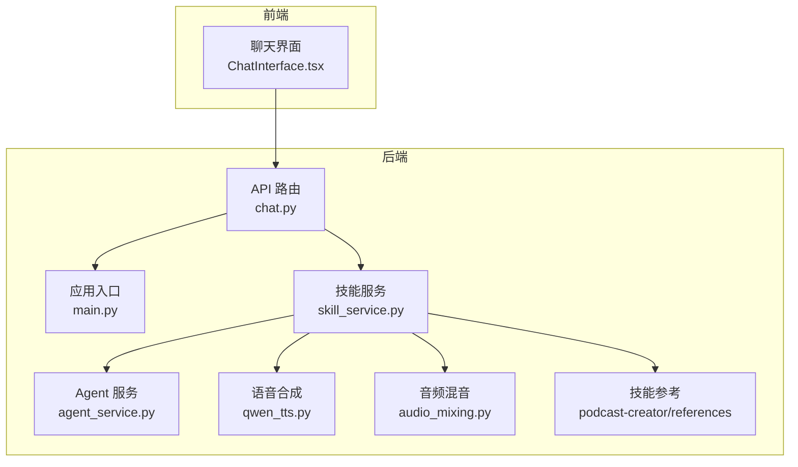
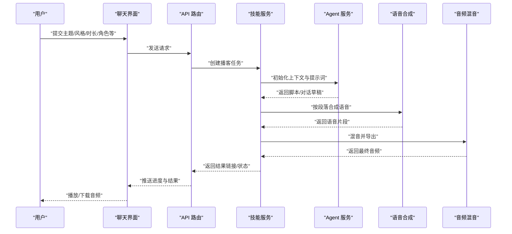
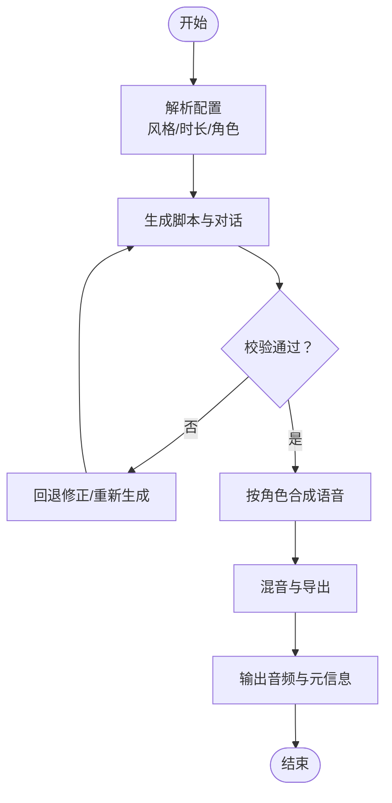
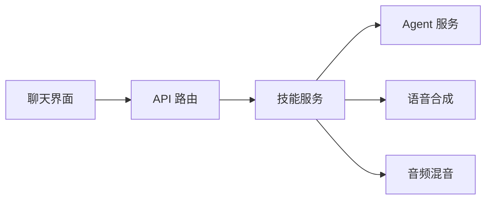
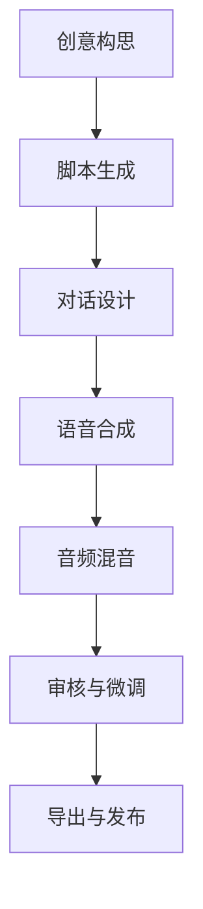

# 播客创作者

<cite>
**本文引用的文件**   
- [backend/skills/custom/podcast-creator/references](file://backend/skills/custom/podcast-creator/references)
- [backend/app/tools/qwen_tts.py](file://backend/app/tools/qwen_tts.py)
- [backend/app/tools/audio_mixing.py](file://backend/app/tools/audio_mixing.py)
- [backend/app/services/skill_service.py](file://backend/app/services/skill_service.py)
- [backend/app/services/agent_service.py](file://backend/app/services/agent_service.py)
- [backend/app/routers/chat.py](file://backend/app/routers/chat.py)
- [backend/app/main.py](file://backend/app/main.py)
- [frontend/src/components/ChatInterface.tsx](file://frontend/src/components/ChatInterface.tsx)
</cite>

## 目录
1. [简介](#简介)
2. [项目结构](#项目结构)
3. [核心组件](#核心组件)
4. [架构总览](#架构总览)
5. [详细组件分析](#详细组件分析)
6. [依赖关系分析](#依赖关系分析)
7. [性能考虑](#性能考虑)
8. [故障排查指南](#故障排查指南)
9. [结论](#结论)
10. [附录](#附录)

## 简介
本指南面向播客创作者，系统化介绍“播客创作者”技能的使用方法与最佳实践。该技能覆盖从创意构思、脚本生成、对话设计到音频合成与混音的完整流程，支持访谈类、独白类、讨论类等多种播客类型。通过配置项（如风格、时长、主持人角色等），用户可快速产出高质量音频内容，并与外部音频工具协作完成后期制作。

## 项目结构
本项目采用前后端分离架构：前端提供聊天式交互界面，后端提供技能服务、LLM 调用、TTS 合成与音频处理工具。播客创作者技能位于后端 skills 目录中，相关工具与服务在 app 目录下实现。

图示来源
- [frontend/src/components/ChatInterface.tsx](file://frontend/src/components/ChatInterface.tsx)
- [backend/app/routers/chat.py](file://backend/app/routers/chat.py)
- [backend/app/main.py](file://backend/app/main.py)
- [backend/app/services/skill_service.py](file://backend/app/services/skill_service.py)
- [backend/app/services/agent_service.py](file://backend/app/services/agent_service.py)
- [backend/app/tools/qwen_tts.py](file://backend/app/tools/qwen_tts.py)
- [backend/app/tools/audio_mixing.py](file://backend/app/tools/audio_mixing.py)
- [backend/skills/custom/podcast-creator/references](file://backend/skills/custom/podcast-creator/references)

章节来源
- [backend/app/main.py](file://backend/app/main.py)
- [backend/app/routers/chat.py](file://backend/app/routers/chat.py)
- [backend/app/services/skill_service.py](file://backend/app/services/skill_service.py)
- [backend/app/services/agent_service.py](file://backend/app/services/agent_service.py)
- [backend/app/tools/qwen_tts.py](file://backend/app/tools/qwen_tts.py)
- [backend/app/tools/audio_mixing.py](file://backend/app/tools/audio_mixing.py)
- [backend/skills/custom/podcast-creator/references](file://backend/skills/custom/podcast-creator/references)
- [frontend/src/components/ChatInterface.tsx](file://frontend/src/components/ChatInterface.tsx)

## 核心组件
- 技能服务（Skill Service）
  - 职责：编排播客创作流程，协调脚本生成、对话设计与音频合成/混音。
  - 关键能力：接收用户意图与参数，调用 LLM 生成脚本与对话，驱动 TTS 与混音工具输出音频。
- Agent 服务（Agent Service）
  - 职责：管理多轮对话与上下文，支撑交互式创作与迭代优化。
- 语音合成（Qwen TTS）
  - 职责：将文本脚本转换为语音片段，支持不同音色与语速控制。
- 音频混音（Audio Mixing）
  - 职责：合并多轨语音、插入背景音乐与音效，输出最终音频。
- 技能参考（Podcast References）
  - 职责：提供模板、风格指南与格式规范，辅助生成符合预期的脚本与对话。

章节来源
- [backend/app/services/skill_service.py](file://backend/app/services/skill_service.py)
- [backend/app/services/agent_service.py](file://backend/app/services/agent_service.py)
- [backend/app/tools/qwen_tts.py](file://backend/app/tools/qwen_tts.py)
- [backend/app/tools/audio_mixing.py](file://backend/app/tools/audio_mixing.py)
- [backend/skills/custom/podcast-creator/references](file://backend/skills/custom/podcast-creator/references)

## 架构总览
下图展示从用户输入到最终音频输出的端到端流程，包括聊天接口、技能编排、LLM 生成、TTS 合成与混音环节。

图示来源
- [backend/app/routers/chat.py](file://backend/app/routers/chat.py)
- [backend/app/services/skill_service.py](file://backend/app/services/skill_service.py)
- [backend/app/services/agent_service.py](file://backend/app/services/agent_service.py)
- [backend/app/tools/qwen_tts.py](file://backend/app/tools/qwen_tts.py)
- [backend/app/tools/audio_mixing.py](file://backend/app/tools/audio_mixing.py)
- [frontend/src/components/ChatInterface.tsx](file://frontend/src/components/ChatInterface.tsx)

## 详细组件分析

### 技能服务（Skill Service）
- 功能要点
  - 解析用户配置：风格、时长、主持人角色、嘉宾数量、是否包含音乐/音效等。
  - 调用 Agent 服务进行脚本与对话生成，支持分章节与分段。
  - 驱动 TTS 合成，按角色与段落组织语音片段。
  - 调用混音工具进行轨道合并、音量平衡与淡入淡出处理。
- 数据流
  - 输入：主题、风格、时长、角色设定、BGM/音效偏好。
  - 中间产物：脚本大纲、分镜/段落、对话稿、语音片段。
  - 输出：最终音频文件及元信息（时长、轨道数、风格标签）。
- 错误处理
  - 对 LLM 生成失败、TTS 合成异常、混音失败进行重试与降级策略。
  - 记录日志与进度，便于前端展示与用户反馈。

图示来源
- [backend/app/services/skill_service.py](file://backend/app/services/skill_service.py)
- [backend/app/services/agent_service.py](file://backend/app/services/agent_service.py)
- [backend/app/tools/qwen_tts.py](file://backend/app/tools/qwen_tts.py)
- [backend/app/tools/audio_mixing.py](file://backend/app/tools/audio_mixing.py)

章节来源
- [backend/app/services/skill_service.py](file://backend/app/services/skill_service.py)
- [backend/app/services/agent_service.py](file://backend/app/services/agent_service.py)
- [backend/app/tools/qwen_tts.py](file://backend/app/tools/qwen_tts.py)
- [backend/app/tools/audio_mixing.py](file://backend/app/tools/audio_mixing.py)

### Agent 服务（Agent Service）
- 功能要点
  - 维护会话上下文，支持多轮对话与增量修改。
  - 根据技能参考与用户偏好，动态调整提示词以生成更贴合风格的脚本与对话。
- 交互模式
  - 单轮生成：直接输出完整脚本。
  - 多轮迭代：基于用户反馈逐步完善结构与细节。

章节来源
- [backend/app/services/agent_service.py](file://backend/app/services/agent_service.py)

### 语音合成（Qwen TTS）
- 功能要点
  - 将文本段落转换为语音片段，支持不同音色、语速与情感参数。
  - 按角色拆分输出，便于后续混音与后期处理。
- 集成方式
  - 由技能服务按段落与角色调用，聚合为多轨音频。

章节来源
- [backend/app/tools/qwen_tts.py](file://backend/app/tools/qwen_tts.py)

### 音频混音（Audio Mixing）
- 功能要点
  - 合并多轨语音，插入背景音乐与音效，执行音量归一化与淡入淡出。
  - 输出标准格式的音频文件，附带元数据（时长、采样率、声道数）。
- 质量保障
  - 自动检测峰值与响度，避免削波与过曝。
  - 支持批量导出与进度回调。

章节来源
- [backend/app/tools/audio_mixing.py](file://backend/app/tools/audio_mixing.py)

### 技能参考（Podcast References）
- 内容范围
  - 风格模板、结构范式、对话节奏建议、开场/结尾话术示例。
  - 不同类型播客的差异化要求（访谈、独白、讨论）。
- 使用方式
  - 作为提示词增强素材，提升生成内容的专业性与一致性。

章节来源
- [backend/skills/custom/podcast-creator/references](file://backend/skills/custom/podcast-creator/references)

### 前端聊天界面（Chat Interface）
- 功能要点
  - 提供表单与对话输入，收集用户配置与反馈。
  - 实时显示任务进度与结果，支持播放与下载。
- 交互流程
  - 用户提交配置 → 发起任务 → 轮询/推送进度 → 展示结果。

章节来源
- [frontend/src/components/ChatInterface.tsx](file://frontend/src/components/ChatInterface.tsx)

## 依赖关系分析
- 模块耦合
  - 技能服务为核心编排者，依赖 Agent 服务、TTS 与混音工具。
  - API 路由暴露对外接口，供前端调用。
- 外部依赖
  - LLM 服务（用于脚本与对话生成）。
  - TTS 引擎（语音合成）。
  - 音频处理库（混音与导出）。
- 潜在风险
  - 外部服务不可用或延迟过高时，需具备超时与重试机制。
  - 大体积音频文件的存储与传输需考虑带宽与缓存策略。

图示来源
- [backend/app/routers/chat.py](file://backend/app/routers/chat.py)
- [backend/app/services/skill_service.py](file://backend/app/services/skill_service.py)
- [backend/app/services/agent_service.py](file://backend/app/services/agent_service.py)
- [backend/app/tools/qwen_tts.py](file://backend/app/tools/qwen_tts.py)
- [backend/app/tools/audio_mixing.py](file://backend/app/tools/audio_mixing.py)
- [frontend/src/components/ChatInterface.tsx](file://frontend/src/components/ChatInterface.tsx)

章节来源
- [backend/app/routers/chat.py](file://backend/app/routers/chat.py)
- [backend/app/services/skill_service.py](file://backend/app/services/skill_service.py)
- [backend/app/services/agent_service.py](file://backend/app/services/agent_service.py)
- [backend/app/tools/qwen_tts.py](file://backend/app/tools/qwen_tts.py)
- [backend/app/tools/audio_mixing.py](file://backend/app/tools/audio_mixing.py)
- [frontend/src/components/ChatInterface.tsx](file://frontend/src/components/ChatInterface.tsx)

## 性能考虑
- 并发与批处理
  - 并行合成多段语音，减少整体等待时间。
  - 混音阶段采用流水线处理，避免阻塞。
- 资源管理
  - 合理设置内存与线程池大小，防止 OOM。
  - 对临时文件进行及时清理，降低磁盘占用。
- 网络与 I/O
  - 对 LLM 与 TTS 调用增加超时与重试。
  - 使用流式传输与断点续传优化大文件下载体验。

[本节为通用指导，不直接分析具体文件]

## 故障排查指南
- 常见问题
  - 生成失败：检查 LLM 可用性、提示词长度与格式。
  - 合成异常：确认 TTS 参数（音色、语速）与文本编码。
  - 混音错误：验证轨道对齐、音量阈值与导出格式。
- 定位方法
  - 查看后端日志与任务状态。
  - 在前端界面核对进度与错误提示。
- 恢复策略
  - 重试与降级：回退到上一版本脚本或简化配置。
  - 分段重做：仅重生成失败段落，避免全量重算。

章节来源
- [backend/app/services/skill_service.py](file://backend/app/services/skill_service.py)
- [backend/app/tools/qwen_tts.py](file://backend/app/tools/qwen_tts.py)
- [backend/app/tools/audio_mixing.py](file://backend/app/tools/audio_mixing.py)
- [frontend/src/components/ChatInterface.tsx](file://frontend/src/components/ChatInterface.tsx)

## 结论
“播客创作者”技能通过技能服务统一编排，结合 Agent 服务、TTS 与混音工具，形成从创意到成品的闭环工作流。借助灵活的配置项与丰富的参考模板，用户可高效产出多种类型的播客内容。建议在大规模生产环境中关注性能与稳定性，建立完善的监控与容错机制。

[本节为总结性内容，不直接分析具体文件]

## 附录

### 配置选项说明
- 播客风格
  - 描述：决定语言风格与叙事节奏（如轻松、严肃、科普、故事化）。
  - 影响：脚本结构、对话语气、BGM 选择。
- 时长设置
  - 描述：目标总时长与分段时长。
  - 影响：内容密度、段落划分与语音合成批次。
- 主持人角色
  - 描述：主持人的性别、音色、说话习惯。
  - 影响：TTS 音色选择与对话引导方式。
- 嘉宾与讨论形式
  - 描述：嘉宾数量、角色分工、互动规则。
  - 影响：对话复杂度与混音轨道数量。
- 音乐与音效
  - 描述：是否加入 BGM、转场音效、环境音。
  - 影响：混音策略与最终听感。

章节来源
- [backend/skills/custom/podcast-creator/references](file://backend/skills/custom/podcast-creator/references)
- [backend/app/services/skill_service.py](file://backend/app/services/skill_service.py)

### 工作流程（从创意到成品）
- 步骤概览
  - 创意构思：确定主题、受众与风格。
  - 脚本生成：依据参考模板与配置生成大纲与正文。
  - 对话设计：分配角色与台词，确保节奏与冲突。
  - 语音合成：按段落与角色合成语音片段。
  - 音频混音：合并轨道、添加 BGM/音效、标准化输出。
  - 审核发布：试听与微调，导出并发布。
- 可视化流程

[此图为概念流程图，无需图示来源]

### 实际案例

#### 访谈类播客
- 特点
  - 双人对谈，强调提问与回答的节奏。
  - 需要清晰的开场、过渡与收尾。
- 制作要点
  - 主持人角色明确，嘉宾背景与问题清单提前准备。
  - 对话稿分段清晰，便于 TTS 与混音。
- 配置建议
  - 风格：专业且亲和；时长：每段 5-8 分钟；BGM：轻音乐为主。

章节来源
- [backend/skills/custom/podcast-creator/references](file://backend/skills/custom/podcast-creator/references)
- [backend/app/services/skill_service.py](file://backend/app/services/skill_service.py)

#### 独白类播客
- 特点
  - 单人叙述，注重逻辑与表达力。
  - 适合知识分享、观点阐述。
- 制作要点
  - 脚本结构严谨，段落间有自然过渡。
  - 语音合成注重语速与停顿控制。
- 配置建议
  - 风格：沉稳或活泼；时长：10-15 分钟；音效：少量环境音点缀。

章节来源
- [backend/skills/custom/podcast-creator/references](file://backend/skills/custom/podcast-creator/references)
- [backend/app/tools/qwen_tts.py](file://backend/app/tools/qwen_tts.py)

#### 讨论类播客
- 特点
  - 多人参与，观点碰撞与共识达成。
  - 需要良好的话题引导与控场。
- 制作要点
  - 对话稿标注发言者与插话标记。
  - 混音时注意人声均衡与背景音层次。
- 配置建议
  - 风格：开放与包容；时长：分段讨论，每段 6-10 分钟；BGM：低音量铺底。

章节来源
- [backend/skills/custom/podcast-creator/references](file://backend/skills/custom/podcast-creator/references)
- [backend/app/tools/audio_mixing.py](file://backend/app/tools/audio_mixing.py)

### 与其他音频工具的协作
- 导入与导出
  - 支持常见音频格式导入，便于与 DAW（数字音频工作站）协作。
  - 导出多轨或立体声文件，满足后期精修需求。
- 插件与扩展
  - 可通过外部插件增强效果器、降噪与响度标准化。
- 工作流对接
  - 与剪辑软件、字幕工具、分发平台无缝衔接。

[本节为通用指导，不直接分析具体文件]