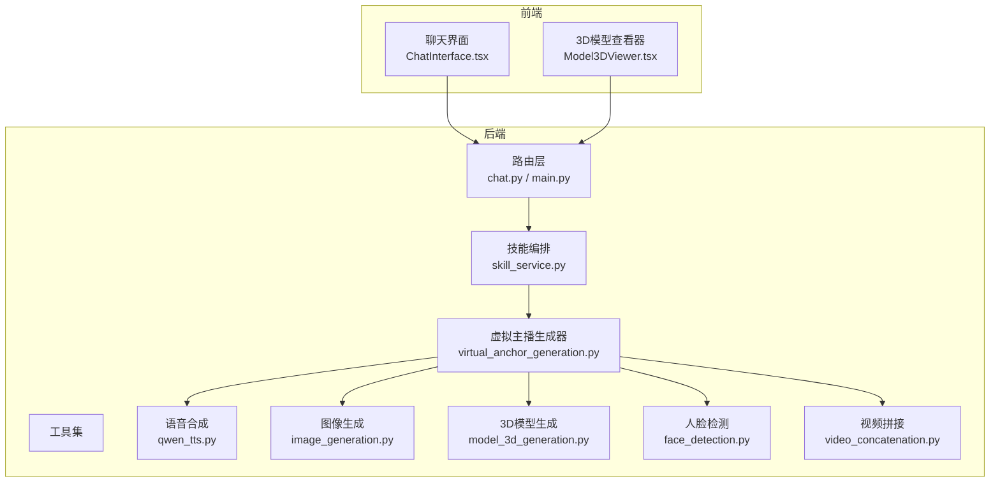
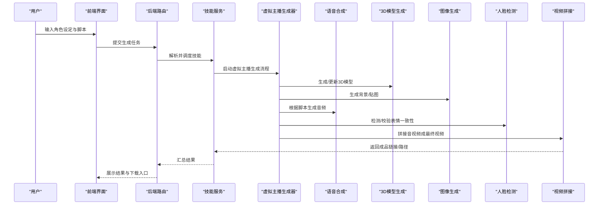
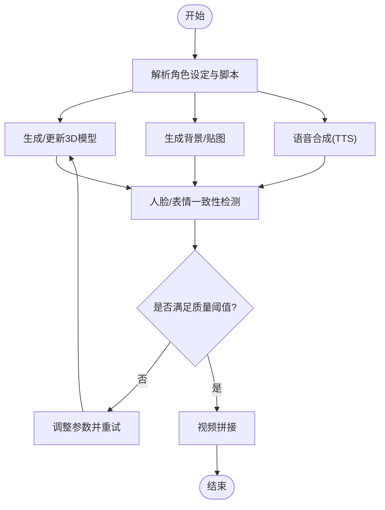
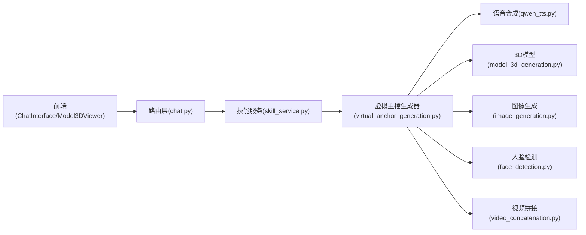

# 虚拟主播生成器

<cite>
**本文引用的文件**   
- [backend/app/tools/virtual_anchor_generation.py](file://backend/app/tools/virtual_anchor_generation.py)
- [backend/app/tools/qwen_tts.py](file://backend/app/tools/qwen_tts.py)
- [backend/app/tools/model_3d_generation.py](file://backend/app/tools/model_3d_generation.py)
- [backend/app/tools/image_generation.py](file://backend/app/tools/image_generation.py)
- [backend/app/tools/video_concatenation.py](file://backend/app/tools/video_concatenation.py)
- [backend/app/utils/face_detection.py](file://backend/app/utils/face_detection.py)
- [backend/app/services/skill_service.py](file://backend/app/services/skill_service.py)
- [backend/app/routers/chat.py](file://backend/app/routers/chat.py)
- [backend/app/main.py](file://backend/app/main.py)
- [frontend/src/components/Model3DViewer.tsx](file://frontend/src/components/Model3DViewer.tsx)
- [frontend/src/components/ChatInterface.tsx](file://frontend/src/components/ChatInterface.tsx)
</cite>

## 目录
1. [简介](#简介)
2. [项目结构](#项目结构)
3. [核心组件](#核心组件)
4. [架构总览](#架构总览)
5. [详细组件分析](#详细组件分析)
6. [依赖关系分析](#依赖关系分析)
7. [性能与渲染调优](#性能与渲染调优)
8. [故障排查指南](#故障排查指南)
9. [结论](#结论)
10. [附录：配置参数与风格案例](#附录配置参数与风格案例)

## 简介
本指南面向希望使用“虚拟主播生成器”技能的用户，覆盖从角色设计、形象定制、语音合成到动作生成与内容合成的完整工作流。文档将解释系统如何协同3D模型生成、图像生成、语音合成（TTS）、视频拼接等模块，提供可操作的步骤、关键配置项说明、不同风格的创建案例，以及性能优化与渲染质量调优建议。

## 项目结构
后端以工具化能力为核心，围绕“虚拟主播生成”编排多个子工具；前端提供对话交互与3D模型预览能力。整体采用前后端分离架构，通过HTTP接口调用后端服务。

图表来源
- [backend/app/routers/chat.py](file://backend/app/routers/chat.py)
- [backend/app/main.py](file://backend/app/main.py)
- [backend/app/services/skill_service.py](file://backend/app/services/skill_service.py)
- [backend/app/tools/virtual_anchor_generation.py](file://backend/app/tools/virtual_anchor_generation.py)
- [backend/app/tools/qwen_tts.py](file://backend/app/tools/qwen_tts.py)
- [backend/app/tools/image_generation.py](file://backend/app/tools/image_generation.py)
- [backend/app/tools/model_3d_generation.py](file://backend/app/tools/model_3d_generation.py)
- [backend/app/utils/face_detection.py](file://backend/app/utils/face_detection.py)
- [backend/app/tools/video_concatenation.py](file://backend/app/tools/video_concatenation.py)
- [frontend/src/components/ChatInterface.tsx](file://frontend/src/components/ChatInterface.tsx)
- [frontend/src/components/Model3DViewer.tsx](file://frontend/src/components/Model3DViewer.tsx)

章节来源
- [backend/app/main.py](file://backend/app/main.py)
- [backend/app/routers/chat.py](file://backend/app/routers/chat.py)
- [backend/app/services/skill_service.py](file://backend/app/services/skill_service.py)
- [backend/app/tools/virtual_anchor_generation.py](file://backend/app/tools/virtual_anchor_generation.py)
- [frontend/src/components/ChatInterface.tsx](file://frontend/src/components/ChatInterface.tsx)
- [frontend/src/components/Model3DViewer.tsx](file://frontend/src/components/Model3DViewer.tsx)

## 核心组件
- 虚拟主播生成器（VA）：作为编排中心，串联形象生成、语音合成、动作驱动与视频合成，输出可直接用于直播或录播的素材与成片。
- 语音合成（TTS）：根据文本脚本与声音特征参数生成音频片段，支持音色、语速、情感等控制。
- 3D模型生成：基于外观描述生成或调整3D角色模型，供后续表情与动作驱动。
- 图像生成：用于生成背景、贴图、头像等视觉资产。
- 人脸检测：辅助进行口型对齐、表情一致性校验与后期质检。
- 视频拼接：将多段音视频素材按时间线合并为最终输出。

章节来源
- [backend/app/tools/virtual_anchor_generation.py](file://backend/app/tools/virtual_anchor_generation.py)
- [backend/app/tools/qwen_tts.py](file://backend/app/tools/qwen_tts.py)
- [backend/app/tools/model_3d_generation.py](file://backend/app/tools/model_3d_generation.py)
- [backend/app/tools/image_generation.py](file://backend/app/tools/image_generation.py)
- [backend/app/utils/face_detection.py](file://backend/app/utils/face_detection.py)
- [backend/app/tools/video_concatenation.py](file://backend/app/tools/video_concatenation.py)

## 架构总览
虚拟主播生成器的端到端流程如下：用户在前端发起请求，后端路由将任务交由技能服务编排，再由虚拟主播生成器协调各工具完成形象、语音、动作与视频的生成与合成。

图表来源
- [backend/app/routers/chat.py](file://backend/app/routers/chat.py)
- [backend/app/services/skill_service.py](file://backend/app/services/skill_service.py)
- [backend/app/tools/virtual_anchor_generation.py](file://backend/app/tools/virtual_anchor_generation.py)
- [backend/app/tools/qwen_tts.py](file://backend/app/tools/qwen_tts.py)
- [backend/app/tools/model_3d_generation.py](file://backend/app/tools/model_3d_generation.py)
- [backend/app/tools/image_generation.py](file://backend/app/tools/image_generation.py)
- [backend/app/utils/face_detection.py](file://backend/app/utils/face_detection.py)
- [backend/app/tools/video_concatenation.py](file://backend/app/tools/video_concatenation.py)

## 详细组件分析

### 虚拟主播生成器（编排器）
- 职责：接收角色设定、脚本与风格参数，协调3D模型、图像、语音、人脸检测与视频拼接等工具，产出最终视频与中间资产。
- 关键输入：角色外观描述、声音特征、表情模式、动作模板、场景与风格偏好、输出分辨率与时长等。
- 关键输出：3D模型资源、音频片段、图像资产、带表情与动作的视频片段、最终合成视频。
- 错误处理：对下游工具异常进行捕获与重试策略，记录失败原因并回滚部分中间产物。

图表来源
- [backend/app/tools/virtual_anchor_generation.py](file://backend/app/tools/virtual_anchor_generation.py)
- [backend/app/utils/face_detection.py](file://backend/app/utils/face_detection.py)
- [backend/app/tools/video_concatenation.py](file://backend/app/tools/video_concatenation.py)

章节来源
- [backend/app/tools/virtual_anchor_generation.py](file://backend/app/tools/virtual_anchor_generation.py)
- [backend/app/utils/face_detection.py](file://backend/app/utils/face_detection.py)
- [backend/app/tools/video_concatenation.py](file://backend/app/tools/video_concatenation.py)

### 语音合成（TTS）
- 功能：将文本脚本转换为音频，支持音色、语速、情感强度、停顿与重音等参数。
- 集成点：由VA在生成流程中按需调用，输出音频片段供后续与画面同步。
- 质量要点：确保文本分句合理、标点正确，避免过长段落导致合成不稳定。

章节来源
- [backend/app/tools/qwen_tts.py](file://backend/app/tools/qwen_tts.py)

### 3D模型生成
- 功能：根据外观描述生成或微调3D角色模型，包括发型、服饰、体型等。
- 集成点：VA在初始化阶段生成基础模型，后续可根据表情与动作需求进行局部更新。
- 注意事项：模型面数与纹理尺寸需平衡渲染性能与画质。

章节来源
- [backend/app/tools/model_3d_generation.py](file://backend/app/tools/model_3d_generation.py)

### 图像生成
- 功能：生成背景、贴图、头像等视觉资产，支持风格与分辨率控制。
- 集成点：VA在准备阶段批量生成所需图像，供3D材质或场景使用。

章节来源
- [backend/app/tools/image_generation.py](file://backend/app/tools/image_generation.py)

### 人脸检测与一致性校验
- 功能：检测面部关键点、评估表情一致性与口型匹配度，辅助质量把关。
- 集成点：在生成后对关键帧进行抽检，不达标则触发参数调整与重试。

章节来源
- [backend/app/utils/face_detection.py](file://backend/app/utils/face_detection.py)

### 视频拼接
- 功能：将音频、画面与动效按时间线合并，输出最终视频。
- 集成点：VA在最后阶段调用，负责码率、分辨率与封装格式设置。

章节来源
- [backend/app/tools/video_concatenation.py](file://backend/app/tools/video_concatenation.py)

### 前端交互与3D预览
- 聊天界面：用户输入角色设定、脚本与风格选项，提交生成任务。
- 3D查看器：加载生成的3D模型，支持旋转、缩放与基础动画预览。

章节来源
- [frontend/src/components/ChatInterface.tsx](file://frontend/src/components/ChatInterface.tsx)
- [frontend/src/components/Model3DViewer.tsx](file://frontend/src/components/Model3DViewer.tsx)

## 依赖关系分析
- 路由层依赖技能服务进行任务解析与调度。
- 虚拟主播生成器依赖TTS、3D模型生成、图像生成、人脸检测与视频拼接等工具。
- 前端依赖后端路由暴露的接口进行任务提交与结果获取。

图表来源
- [backend/app/routers/chat.py](file://backend/app/routers/chat.py)
- [backend/app/services/skill_service.py](file://backend/app/services/skill_service.py)
- [backend/app/tools/virtual_anchor_generation.py](file://backend/app/tools/virtual_anchor_generation.py)
- [backend/app/tools/qwen_tts.py](file://backend/app/tools/qwen_tts.py)
- [backend/app/tools/model_3d_generation.py](file://backend/app/tools/model_3d_generation.py)
- [backend/app/tools/image_generation.py](file://backend/app/tools/image_generation.py)
- [backend/app/utils/face_detection.py](file://backend/app/utils/face_detection.py)
- [backend/app/tools/video_concatenation.py](file://backend/app/tools/video_concatenation.py)
- [frontend/src/components/ChatInterface.tsx](file://frontend/src/components/ChatInterface.tsx)
- [frontend/src/components/Model3DViewer.tsx](file://frontend/src/components/Model3DViewer.tsx)

章节来源
- [backend/app/routers/chat.py](file://backend/app/routers/chat.py)
- [backend/app/services/skill_service.py](file://backend/app/services/skill_service.py)
- [backend/app/tools/virtual_anchor_generation.py](file://backend/app/tools/virtual_anchor_generation.py)

## 性能与渲染调优
- 3D模型优化
  - 控制面数与纹理尺寸，优先使用LOD与图集减少绘制批次。
  - 对复杂材质进行烘焙，降低实时计算开销。
- 语音合成优化
  - 合理切分脚本，避免超长段落；使用缓存复用相同文本片段。
  - 选择合适采样率与编码格式，平衡音质与体积。
- 图像生成优化
  - 预生成常用背景与贴图，建立素材库；按需压缩与格式转换。
- 视频拼接优化
  - 统一分辨率与帧率，减少转码次数；使用硬件加速编解码。
- 端到端流水线
  - 并行化独立任务（如图像与3D生成），串行化强依赖步骤（如人脸检测与拼接）。
  - 引入失败重试与降级策略，保障稳定性。

[本节为通用指导，无需特定文件引用]

## 故障排查指南
- 常见问题定位
  - 语音合成失败：检查文本格式、语言包与网络连通性；确认TTS服务可用。
  - 3D模型异常：核对外观描述是否清晰；检查模型生成工具的参数范围。
  - 人脸检测误报：调整检测阈值；增加关键帧数量提升鲁棒性。
  - 视频拼接出错：确认媒体容器与编码兼容；检查时间轴对齐。
- 日志与诊断
  - 关注路由层与服务层的错误日志，定位具体失败环节。
  - 对中间产物（音频、图像、模型）进行抽样检查，快速缩小问题范围。

章节来源
- [backend/app/routers/chat.py](file://backend/app/routers/chat.py)
- [backend/app/services/skill_service.py](file://backend/app/services/skill_service.py)
- [backend/app/tools/virtual_anchor_generation.py](file://backend/app/tools/virtual_anchor_generation.py)

## 结论
虚拟主播生成器通过模块化编排，将角色设计、语音合成、3D建模与视频合成整合为一条高效流水线。借助合理的配置与调优策略，可在保证画质的同时提升生成效率，满足不同风格与业务场景的需求。

[本节为总结性内容，无需特定文件引用]

## 附录：配置参数与风格案例

### 配置参数清单（示例）
- 角色外观
  - 性别、年龄区间、发型、肤色、服饰风格、配饰
- 声音特征
  - 音色类型、语速、情感强度、停顿策略、重音标记
- 表情与动作
  - 表情模式（自然/夸张/克制）、动作模板（站立/手势/走动）
- 场景与风格
  - 背景主题、色调、光照风格、镜头运动
- 输出设置
  - 分辨率、帧率、码率、封装格式、时长限制

[本节为概念性说明，无需特定文件引用]

### 风格案例
- 二次元风格
  - 强调高饱和色彩与简洁线条，适合年轻受众与娱乐直播。
- 写实风格
  - 注重皮肤质感与光影真实感，适合新闻播报与知识分享。
- 科幻风格
  - 加入未来元素与动态光效，适合科技评测与游戏解说。
- 国风风格
  - 融入传统纹样与古典配色，适合文化类节目与品牌宣传。

[本节为概念性说明，无需特定文件引用]