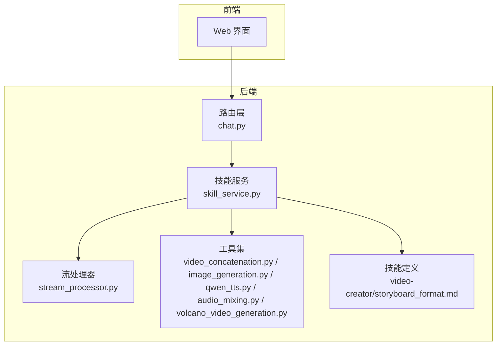
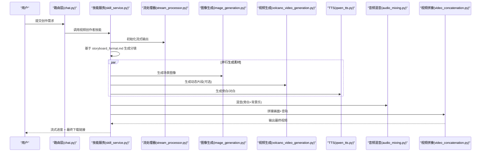
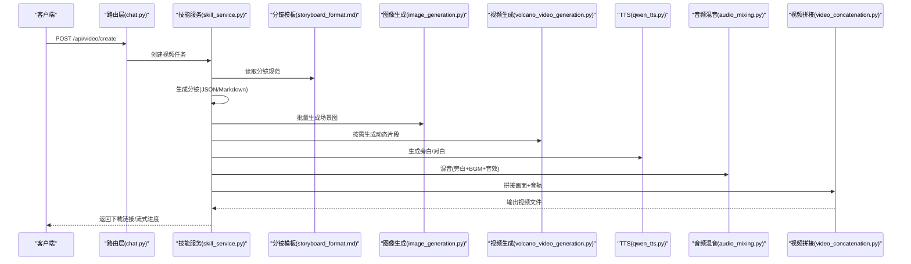
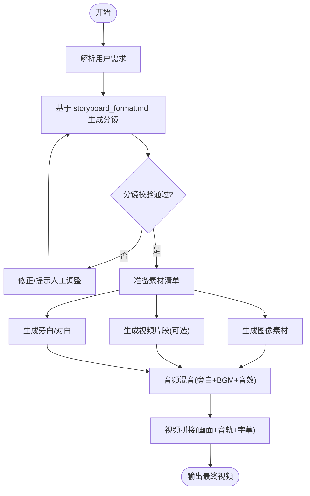
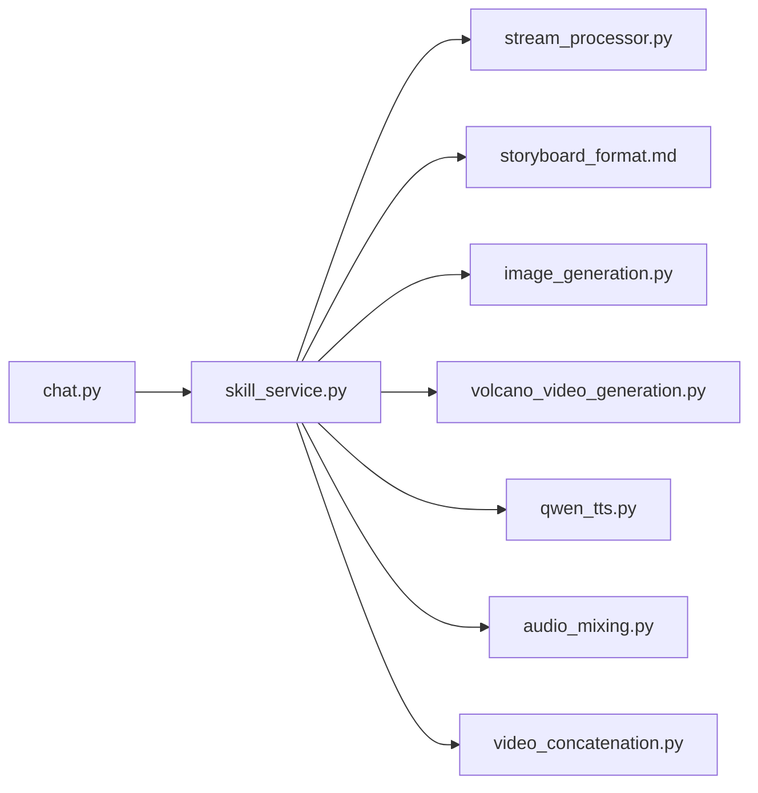

# 视频制作工具

<cite>
**本文引用的文件**   
- [backend/app/tools/video_concatenation.py](file://backend/app/tools/video_concatenation.py)
- [backend/app/tools/volcano_video_generation.py](file://backend/app/tools/volcano_video_generation.py)
- [backend/app/tools/image_generation.py](file://backend/app/tools/image_generation.py)
- [backend/app/tools/qwen_tts.py](file://backend/app/tools/qwen_tts.py)
- [backend/app/tools/audio_mixing.py](file://backend/app/tools/audio_mixing.py)
- [backend/app/services/skill_service.py](file://backend/app/services/skill_service.py)
- [backend/app/services/stream_processor.py](file://backend/app/services/stream_processor.py)
- [backend/app/routers/chat.py](file://backend/app/routers/chat.py)
- [backend/skills/custom/video-creator/references/storyboard_format.md](file://backend/skills/custom/video-creator/references/storyboard_format.md)
</cite>

## 目录
1. [简介](#简介)
2. [项目结构](#项目结构)
3. [核心组件](#核心组件)
4. [架构总览](#架构总览)
5. [详细组件分析](#详细组件分析)
6. [依赖关系分析](#依赖关系分析)
7. [性能与稳定性](#性能与稳定性)
8. [故障排查指南](#故障排查指南)
9. [结论](#结论)
10. [附录：分镜格式规范与配置](#附录分镜格式规范与配置)

## 简介
本工具面向多媒体创作，提供从创意构思、脚本编写到最终视频输出的完整流程。能力覆盖：
- 分镜脚本生成与解析（遵循 storyboard_format.md）
- 视频素材管理（图像、音频、视频的生成与合成）
- 后期制作（拼接、转场、字幕叠加、音画混合）
- 与外部视频/图像/语音生成服务集成（如火山引擎等）

通过统一的技能编排与服务层，用户可快速构建教程视频、宣传片、短视频等多种类型内容。

## 项目结构
后端采用模块化设计：
- 路由层：对外暴露聊天/技能调用接口
- 服务层：编排技能、处理流式输出、管理工作区
- 工具层：封装音视频处理、图像/视频/语音生成、工作区操作等
- 技能定义：以“skills”形式组织，包含参考文档与执行脚本

图示来源
- [backend/app/routers/chat.py](file://backend/app/routers/chat.py)
- [backend/app/services/skill_service.py](file://backend/app/services/skill_service.py)
- [backend/app/services/stream_processor.py](file://backend/app/services/stream_processor.py)
- [backend/app/tools/video_concatenation.py](file://backend/app/tools/video_concatenation.py)
- [backend/app/tools/image_generation.py](file://backend/app/tools/image_generation.py)
- [backend/app/tools/qwen_tts.py](file://backend/app/tools/qwen_tts.py)
- [backend/app/tools/audio_mixing.py](file://backend/app/tools/audio_mixing.py)
- [backend/app/tools/volcano_video_generation.py](file://backend/app/tools/volcano_video_generation.py)
- [backend/skills/custom/video-creator/references/storyboard_format.md](file://backend/skills/custom/video-creator/references/storyboard_format.md)

章节来源
- [backend/app/routers/chat.py](file://backend/app/routers/chat.py)
- [backend/app/services/skill_service.py](file://backend/app/services/skill_service.py)
- [backend/app/services/stream_processor.py](file://backend/app/services/stream_processor.py)
- [backend/app/tools/video_concatenation.py](file://backend/app/tools/video_concatenation.py)
- [backend/app/tools/image_generation.py](file://backend/app/tools/image_generation.py)
- [backend/app/tools/qwen_tts.py](file://backend/app/tools/qwen_tts.py)
- [backend/app/tools/audio_mixing.py](file://backend/app/tools/audio_mixing.py)
- [backend/app/tools/volcano_video_generation.py](file://backend/app/tools/volcano_video_generation.py)
- [backend/skills/custom/video-creator/references/storyboard_format.md](file://backend/skills/custom/video-creator/references/storyboard_format.md)

## 核心组件
- 路由层（chat.py）
  - 负责接收前端请求，转发至技能服务，返回结果或流式片段
- 技能服务（skill_service.py）
  - 解析并调度“视频创作者”技能，协调分镜生成、素材准备、后期合成
- 流处理器（stream_processor.py）
  - 将长任务拆分为增量片段，提升交互体验
- 工具集
  - 视频拼接（video_concatenation.py）
  - 图像生成（image_generation.py）
  - 文本转语音（qwen_tts.py）
  - 音频混音（audio_mixing.py）
  - 视频生成（volcano_video_generation.py）

章节来源
- [backend/app/routers/chat.py](file://backend/app/routers/chat.py)
- [backend/app/services/skill_service.py](file://backend/app/services/skill_service.py)
- [backend/app/services/stream_processor.py](file://backend/app/services/stream_processor.py)
- [backend/app/tools/video_concatenation.py](file://backend/app/tools/video_concatenation.py)
- [backend/app/tools/image_generation.py](file://backend/app/tools/image_generation.py)
- [backend/app/tools/qwen_tts.py](file://backend/app/tools/qwen_tts.py)
- [backend/app/tools/audio_mixing.py](file://backend/app/tools/audio_mixing.py)
- [backend/app/tools/volcano_video_generation.py](file://backend/app/tools/volcano_video_generation.py)

## 架构总览
整体数据流：
- 用户在前端输入主题/风格/时长等需求
- 路由层调用技能服务，启动“视频创作者”技能
- 技能服务根据 storyboard_format.md 生成结构化分镜
- 按分镜并行/串行调用图像/视频/语音工具生成素材
- 使用音频混音与视频拼接完成后期合成
- 输出最终视频文件，并通过流式通道反馈进度

图示来源
- [backend/app/routers/chat.py](file://backend/app/routers/chat.py)
- [backend/app/services/skill_service.py](file://backend/app/services/skill_service.py)
- [backend/app/services/stream_processor.py](file://backend/app/services/stream_processor.py)
- [backend/app/tools/image_generation.py](file://backend/app/tools/image_generation.py)
- [backend/app/tools/volcano_video_generation.py](file://backend/app/tools/volcano_video_generation.py)
- [backend/app/tools/qwen_tts.py](file://backend/app/tools/qwen_tts.py)
- [backend/app/tools/audio_mixing.py](file://backend/app/tools/audio_mixing.py)
- [backend/app/tools/video_concatenation.py](file://backend/app/tools/video_concatenation.py)

## 详细组件分析

### 分镜脚本生成与解析（storyboard_format.md）
- 作用：定义分镜的结构化字段与约束，确保后续素材生成与后期合成的确定性
- 关键要点（依据文件）：
  - 分镜条目需包含场景描述、镜头运动、时长、画面元素、旁白/字幕、音效/音乐提示等
  - 支持多模态元素引用（图像、视频片段、音频轨道）
  - 提供默认值与必填项校验规则
  - 建议为每个分镜分配唯一标识，便于追踪与回滚
- 配置方法：
  - 在“视频创作者”技能中加载 storyboard_format.md 作为模板与校验器
  - 结合用户输入与上下文，由 LLM 或规则引擎产出符合规范的 JSON/Markdown 分镜
  - 对不合规的分镜进行自动修正或提示人工调整

章节来源
- [backend/skills/custom/video-creator/references/storyboard_format.md](file://backend/skills/custom/video-creator/references/storyboard_format.md)

### 视频素材管理
- 图像生成（image_generation.py）
  - 根据分镜中的画面描述生成静态图，支持分辨率、风格、比例等参数
- 视频生成（volcano_video_generation.py）
  - 调用外部视频生成服务，将图像/文本提示转为动态片段
- 文本转语音（qwen_tts.py）
  - 将旁白/对白文本转换为音频轨道，支持音色、语速、停顿控制
- 音频混音（audio_mixing.py）
  - 合并旁白、背景音乐、音效，统一响度与采样率
- 视频拼接（video_concatenation.py）
  - 将画面片段与音轨对齐，添加转场、字幕、水印，输出成片

章节来源
- [backend/app/tools/image_generation.py](file://backend/app/tools/image_generation.py)
- [backend/app/tools/volcano_video_generation.py](file://backend/app/tools/volcano_video_generation.py)
- [backend/app/tools/qwen_tts.py](file://backend/app/tools/qwen_tts.py)
- [backend/app/tools/audio_mixing.py](file://backend/app/tools/audio_mixing.py)
- [backend/app/tools/video_concatenation.py](file://backend/app/tools/video_concatenation.py)

### 技能编排与流式输出
- 技能服务（skill_service.py）
  - 解析用户需求，选择“视频创作者”技能
  - 驱动分镜生成、素材生产、后期合成流水线
- 流处理器（stream_processor.py）
  - 将长任务切分为阶段事件（如“分镜已生成”“素材生成中”“正在拼接”），实时推送给前端

章节来源
- [backend/app/services/skill_service.py](file://backend/app/services/skill_service.py)
- [backend/app/services/stream_processor.py](file://backend/app/services/stream_processor.py)

### API 调用序列（示例）

图示来源
- [backend/app/routers/chat.py](file://backend/app/routers/chat.py)
- [backend/app/services/skill_service.py](file://backend/app/services/skill_service.py)
- [backend/skills/custom/video-creator/references/storyboard_format.md](file://backend/skills/custom/video-creator/references/storyboard_format.md)
- [backend/app/tools/image_generation.py](file://backend/app/tools/image_generation.py)
- [backend/app/tools/volcano_video_generation.py](file://backend/app/tools/volcano_video_generation.py)
- [backend/app/tools/qwen_tts.py](file://backend/app/tools/qwen_tts.py)
- [backend/app/tools/audio_mixing.py](file://backend/app/tools/audio_mixing.py)
- [backend/app/tools/video_concatenation.py](file://backend/app/tools/video_concatenation.py)

### 复杂逻辑流程图（分镜到成片）

图示来源
- [backend/skills/custom/video-creator/references/storyboard_format.md](file://backend/skills/custom/video-creator/references/storyboard_format.md)
- [backend/app/tools/image_generation.py](file://backend/app/tools/image_generation.py)
- [backend/app/tools/volcano_video_generation.py](file://backend/app/tools/volcano_video_generation.py)
- [backend/app/tools/qwen_tts.py](file://backend/app/tools/qwen_tts.py)
- [backend/app/tools/audio_mixing.py](file://backend/app/tools/audio_mixing.py)
- [backend/app/tools/video_concatenation.py](file://backend/app/tools/video_concatenation.py)

## 依赖关系分析
- 模块耦合
  - 路由层仅依赖技能服务，保持低耦合
  - 技能服务聚合多个工具，职责清晰
  - 工具之间通过文件系统/内存对象传递数据，避免直接相互依赖
- 外部依赖
  - 图像/视频/语音生成可能依赖第三方服务（如火山引擎），需在环境变量中配置密钥与端点
- 潜在循环依赖
  - 当前分层清晰，未见循环导入；建议在新增工具时严格遵循单向依赖原则

图示来源
- [backend/app/routers/chat.py](file://backend/app/routers/chat.py)
- [backend/app/services/skill_service.py](file://backend/app/services/skill_service.py)
- [backend/app/services/stream_processor.py](file://backend/app/services/stream_processor.py)
- [backend/skills/custom/video-creator/references/storyboard_format.md](file://backend/skills/custom/video-creator/references/storyboard_format.md)
- [backend/app/tools/image_generation.py](file://backend/app/tools/image_generation.py)
- [backend/app/tools/volcano_video_generation.py](file://backend/app/tools/volcano_video_generation.py)
- [backend/app/tools/qwen_tts.py](file://backend/app/tools/qwen_tts.py)
- [backend/app/tools/audio_mixing.py](file://backend/app/tools/audio_mixing.py)
- [backend/app/tools/video_concatenation.py](file://backend/app/tools/video_concatenation.py)

## 性能与稳定性
- 并发策略
  - 图像/视频/语音生成可并行执行，缩短总体耗时
  - 大文件处理建议使用异步队列与断点续传
- 资源管理
  - 合理设置临时目录与清理策略，避免磁盘占用过高
  - 对高分辨率素材进行按需缩放与码率控制
- 容错与重试
  - 对第三方服务调用增加指数退避重试
  - 失败分镜可隔离并重试，不影响其他分镜
- 质量保障
  - 在混音前统一采样率与响度
  - 在拼接前校验帧率、分辨率一致性

[本节为通用指导，无需具体文件来源]

## 故障排查指南
- 常见问题
  - 第三方服务不可用：检查网络连通性与鉴权配置
  - 素材尺寸不一致：在拼接前做归一化处理
  - 音画不同步：核对时间轴与帧率，必要时插入静音/黑场对齐
- 定位步骤
  - 查看流式进度事件，确认卡点阶段
  - 检查分镜是否满足 storyboard_format.md 的必填字段
  - 验证各工具的输入参数与输出路径权限
- 恢复策略
  - 针对失败分镜单独重跑
  - 保留中间产物以便复现与对比

章节来源
- [backend/app/services/skill_service.py](file://backend/app/services/skill_service.py)
- [backend/app/services/stream_processor.py](file://backend/app/services/stream_processor.py)
- [backend/skills/custom/video-creator/references/storyboard_format.md](file://backend/skills/custom/video-creator/references/storyboard_format.md)

## 结论
本工具以“分镜驱动”的方式串联素材生成与后期制作，形成端到端的视频创作流水线。通过标准化的分镜格式与清晰的模块边界，既保证了可扩展性，也提升了稳定性与可维护性。用户可据此快速搭建教程视频、宣传片、短视频等多类型内容。

[本节为总结，无需具体文件来源]

## 附录：分镜格式规范与配置
- 分镜字段建议
  - 场景编号、标题、时长、画面描述、镜头运动、转场效果
  - 旁白/对白文本、字幕文本、音效/背景音乐提示
  - 关联素材路径（图像/视频/音频）、备注
- 校验规则
  - 必填字段完整性、时长合理性、素材存在性
  - 文本长度限制、特殊字符过滤
- 配置方式
  - 在“视频创作者”技能中引入 storyboard_format.md 作为模板与校验器
  - 通过环境变量注入第三方服务密钥与端点
  - 在工作区中保存分镜与中间产物，便于版本管理与回溯

章节来源
- [backend/skills/custom/video-creator/references/storyboard_format.md](file://backend/skills/custom/video-creator/references/storyboard_format.md)