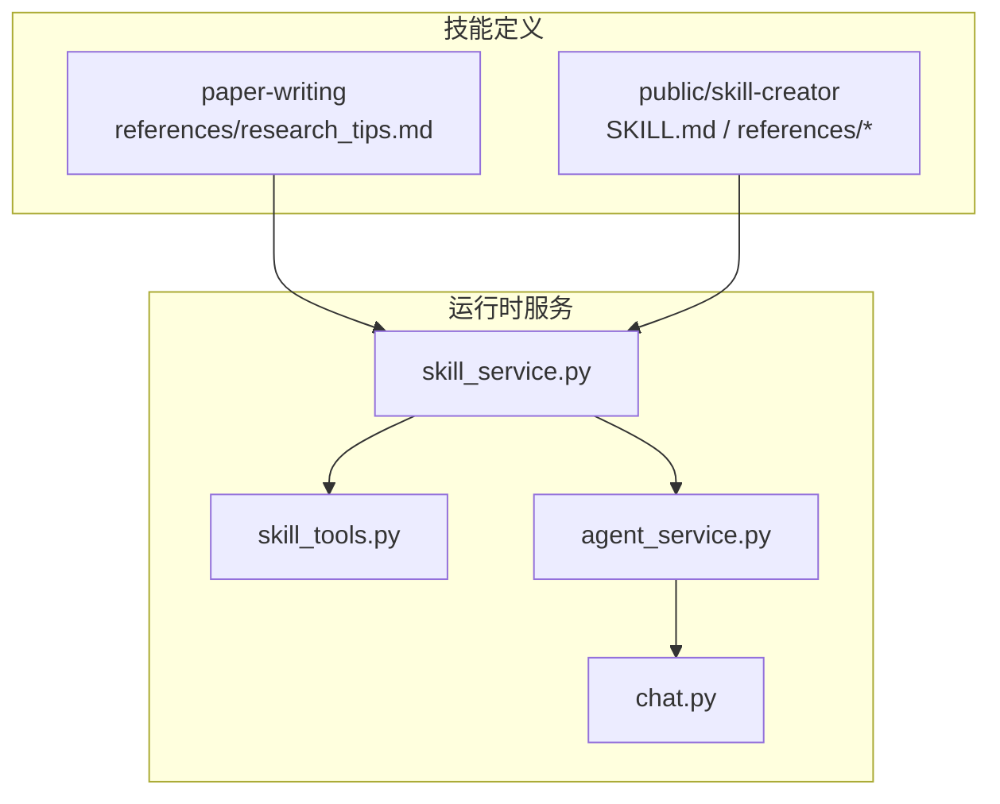
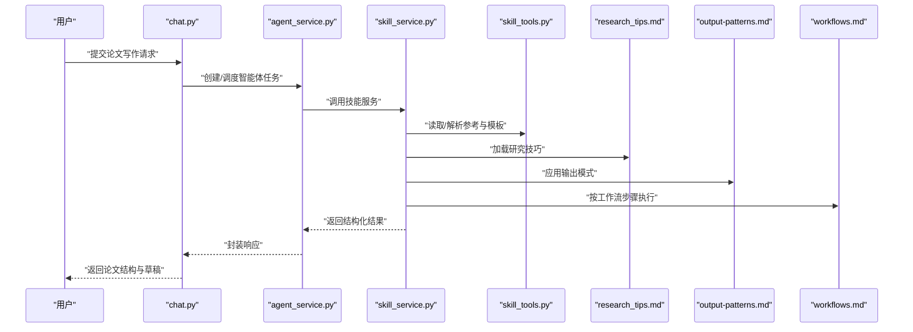
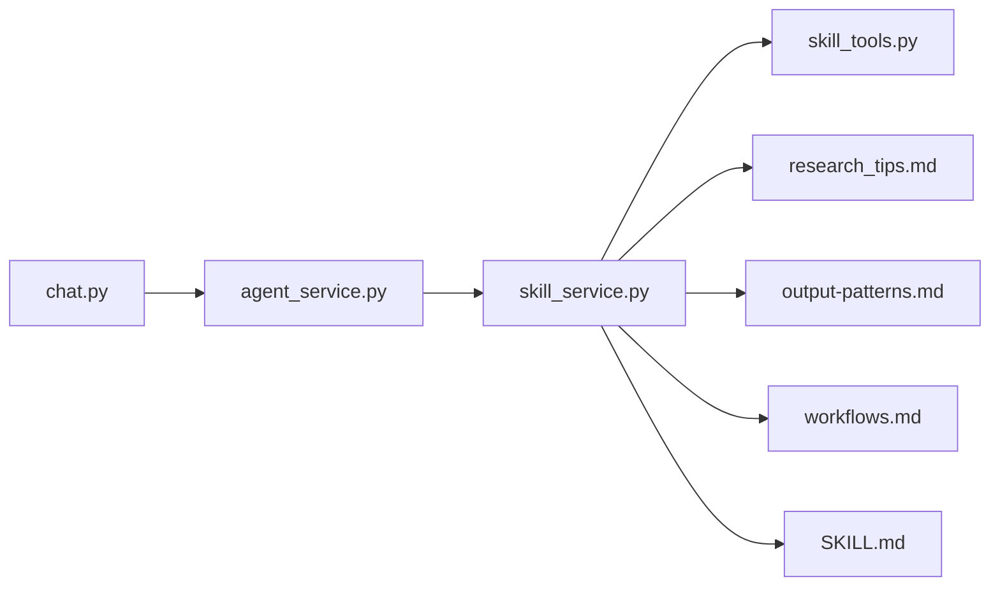

# 论文写作助手

<cite>
**本文引用的文件**   
- [backend/skills/custom/paper-writing/references/research_tips.md](file://backend/skills/custom/paper-writing/references/research_tips.md)
- [backend/skills/public/skill-creator/SKILL.md](file://backend/skills/public/skill-creator/SKILL.md)
- [backend/skills/public/skill-creator/references/output-patterns.md](file://backend/skills/public/skill-creator/references/output-patterns.md)
- [backend/skills/public/skill-creator/references/workflows.md](file://backend/skills/public/skill-creator/references/workflows.md)
- [backend/app/services/skill_service.py](file://backend/app/services/skill_service.py)
- [backend/app/tools/skill_tools.py](file://backend/app/tools/skill_tools.py)
- [backend/app/services/agent_service.py](file://backend/app/services/agent_service.py)
- [backend/app/routers/chat.py](file://backend/app/routers/chat.py)
</cite>

## 目录
1. [简介](#简介)
2. [项目结构](#项目结构)
3. [核心组件](#核心组件)
4. [架构总览](#架构总览)
5. [详细组件分析](#详细组件分析)
6. [依赖分析](#依赖分析)
7. [性能考虑](#性能考虑)
8. [故障排查指南](#故障排查指南)
9. [结论](#结论)
10. [附录](#附录)

## 简介
本文件为“论文写作助手”技能的使用文档，面向希望借助系统完成从选题到草稿的学术写作流程的用户。该技能提供以下能力：
- 学术论文结构生成：根据主题、研究领域与目标期刊风格，输出章节大纲与写作要点。
- 研究建议提供：结合内置研究技巧（research_tips.md）给出方法论、实验设计与写作策略建议。
- 文献引用管理：在提示词中约定引用格式与来源组织方式，便于后续导出或整理。

此外，本文档还包含配置参数说明、输入/输出规范、端到端使用示例、最佳实践与常见问题解答。

## 项目结构
论文写作助手属于后端“skills”体系中的自定义技能之一，其参考知识与输出模式由公共技能模板与参考文档共同约束。关键位置如下：
- 技能参考知识：backend/skills/custom/paper-writing/references/research_tips.md
- 公共技能模板与参考：backend/skills/public/skill-creator/{SKILL.md, references/*}
- 技能服务与工具：backend/app/services/skill_service.py、backend/app/tools/skill_tools.py
- 对话路由与服务编排：backend/app/routers/chat.py、backend/app/services/agent_service.py

图表来源
- [backend/skills/custom/paper-writing/references/research_tips.md](file://backend/skills/custom/paper-writing/references/research_tips.md)
- [backend/skills/public/skill-creator/SKILL.md](file://backend/skills/public/skill-creator/SKILL.md)
- [backend/skills/public/skill-creator/references/output-patterns.md](file://backend/skills/public/skill-creator/references/output-patterns.md)
- [backend/skills/public/skill-creator/references/workflows.md](file://backend/skills/public/skill-creator/references/workflows.md)
- [backend/app/services/skill_service.py](file://backend/app/services/skill_service.py)
- [backend/app/tools/skill_tools.py](file://backend/app/tools/skill_tools.py)
- [backend/app/services/agent_service.py](file://backend/app/services/agent_service.py)
- [backend/app/routers/chat.py](file://backend/app/routers/chat.py)

章节来源
- [backend/skills/custom/paper-writing/references/research_tips.md](file://backend/skills/custom/paper-writing/references/research_tips.md)
- [backend/skills/public/skill-creator/SKILL.md](file://backend/skills/public/skill-creator/SKILL.md)
- [backend/skills/public/skill-creator/references/output-patterns.md](file://backend/skills/public/skill-creator/references/output-patterns.md)
- [backend/skills/public/skill-creator/references/workflows.md](file://backend/skills/public/skill-creator/references/workflows.md)
- [backend/app/services/skill_service.py](file://backend/app/services/skill_service.py)
- [backend/app/tools/skill_tools.py](file://backend/app/tools/skill_tools.py)
- [backend/app/services/agent_service.py](file://backend/app/services/agent_service.py)
- [backend/app/routers/chat.py](file://backend/app/routers/chat.py)

## 核心组件
- 技能参考知识库
  - research_tips.md：提供研究方法与写作技巧，供技能在生成结构与内容时调用。
- 公共技能模板与参考
  - SKILL.md：定义技能通用规范与行为边界。
  - output-patterns.md：规定输出的结构化模式（如章节、列表、表格等）。
  - workflows.md：描述工作流编排与步骤顺序。
- 技能服务层
  - skill_service.py：加载并组合技能参考、模板与工作流，驱动生成过程。
  - skill_tools.py：提供技能运行所需的工具函数（如格式化、校验、资源读取等）。
- 编排与入口
  - agent_service.py：将技能作为智能体任务进行编排。
  - chat.py：对外暴露聊天接口，承载用户输入与返回结果。

章节来源
- [backend/skills/custom/paper-writing/references/research_tips.md](file://backend/skills/custom/paper-writing/references/research_tips.md)
- [backend/skills/public/skill-creator/SKILL.md](file://backend/skills/public/skill-creator/SKILL.md)
- [backend/skills/public/skill-creator/references/output-patterns.md](file://backend/skills/public/skill-creator/references/output-patterns.md)
- [backend/skills/public/skill-creator/references/workflows.md](file://backend/skills/public/skill-creator/references/workflows.md)
- [backend/app/services/skill_service.py](file://backend/app/services/skill_service.py)
- [backend/app/tools/skill_tools.py](file://backend/app/tools/skill_tools.py)
- [backend/app/services/agent_service.py](file://backend/app/services/agent_service.py)
- [backend/app/routers/chat.py](file://backend/app/routers/chat.py)

## 架构总览
下图展示了从用户请求到技能执行与结果返回的整体流程。

图表来源
- [backend/app/routers/chat.py](file://backend/app/routers/chat.py)
- [backend/app/services/agent_service.py](file://backend/app/services/agent_service.py)
- [backend/app/services/skill_service.py](file://backend/app/services/skill_service.py)
- [backend/app/tools/skill_tools.py](file://backend/app/tools/skill_tools.py)
- [backend/skills/custom/paper-writing/references/research_tips.md](file://backend/skills/custom/paper-writing/references/research_tips.md)
- [backend/skills/public/skill-creator/references/output-patterns.md](file://backend/skills/public/skill-creator/references/output-patterns.md)
- [backend/skills/public/skill-creator/references/workflows.md](file://backend/skills/public/skill-creator/references/workflows.md)

## 详细组件分析

### 技能参考与研究技巧集成（research_tips.md）
- 作用
  - 为“论文写作助手”提供方法论、写作策略与质量控制建议。
  - 在生成大纲、撰写段落、评估质量时作为先验知识被调用。
- 集成方式
  - 技能服务在初始化阶段加载该文件，并在需要时检索相关片段注入提示词上下文。
  - 通过输出模式与工作流控制，确保建议以结构化形式呈现。
- 使用建议
  - 在输入中明确研究领域与方法偏好，以便更精准地匹配技巧条目。
  - 对复杂主题可多次迭代，逐步细化方法细节与写作要求。

章节来源
- [backend/skills/custom/paper-writing/references/research_tips.md](file://backend/skills/custom/paper-writing/references/research_tips.md)
- [backend/app/services/skill_service.py](file://backend/app/services/skill_service.py)
- [backend/skills/public/skill-creator/references/output-patterns.md](file://backend/skills/public/skill-creator/references/output-patterns.md)
- [backend/skills/public/skill-creator/references/workflows.md](file://backend/skills/public/skill-creator/references/workflows.md)

### 公共技能模板与输出模式（SKILL.md / output-patterns.md / workflows.md）
- 职责
  - SKILL.md：定义技能通用契约（命名、版本、权限、行为边界等）。
  - output-patterns.md：统一输出结构（如标题层级、列表、表格、引用块等）。
  - workflows.md：规定多步任务的执行顺序与条件分支。
- 与论文写作的关系
  - 保证生成的论文结构一致、可读性强、易于二次编辑。
  - 通过工作流将“选题—大纲—初稿—修订”串联起来。

章节来源
- [backend/skills/public/skill-creator/SKILL.md](file://backend/skills/public/skill-creator/SKILL.md)
- [backend/skills/public/skill-creator/references/output-patterns.md](file://backend/skills/public/skill-creator/references/output-patterns.md)
- [backend/skills/public/skill-creator/references/workflows.md](file://backend/skills/public/skill-creator/references/workflows.md)

### 技能服务与工具（skill_service.py / skill_tools.py）
- 功能
  - 加载与缓存技能参考文件；组装提示词上下文；按工作流执行步骤；调用工具函数进行格式化与校验。
- 关键点
  - 输入校验：检查必填字段（主题、领域、字数等）。
  - 输出规范化：依据输出模式生成一致的Markdown结构。
  - 错误处理：对缺失参考、格式异常等进行友好提示与回退策略。

章节来源
- [backend/app/services/skill_service.py](file://backend/app/services/skill_service.py)
- [backend/app/tools/skill_tools.py](file://backend/app/tools/skill_tools.py)

### 编排与入口（agent_service.py / chat.py）
- 角色
  - agent_service.py：将技能作为智能体任务进行调度与状态管理。
  - chat.py：接收用户消息、转发至智能体、返回流式或一次性结果。
- 交互
  - 支持分步交互（例如先生成大纲，再逐节扩写），提升可控性与质量。

章节来源
- [backend/app/services/agent_service.py](file://backend/app/services/agent_service.py)
- [backend/app/routers/chat.py](file://backend/app/routers/chat.py)

## 依赖分析
- 内部依赖
  - chat.py 依赖 agent_service.py 进行任务编排。
  - agent_service.py 依赖 skill_service.py 执行具体技能逻辑。
  - skill_service.py 依赖 skill_tools.py 与多个参考文件（research_tips.md、output-patterns.md、workflows.md、SKILL.md）。
- 外部依赖
  - 无直接外部库耦合于论文写作技能本身；主要依赖运行时环境提供的LLM与存储能力（由上层服务负责）。

图表来源
- [backend/app/routers/chat.py](file://backend/app/routers/chat.py)
- [backend/app/services/agent_service.py](file://backend/app/services/agent_service.py)
- [backend/app/services/skill_service.py](file://backend/app/services/skill_service.py)
- [backend/app/tools/skill_tools.py](file://backend/app/tools/skill_tools.py)
- [backend/skills/custom/paper-writing/references/research_tips.md](file://backend/skills/custom/paper-writing/references/research_tips.md)
- [backend/skills/public/skill-creator/references/output-patterns.md](file://backend/skills/public/skill-creator/references/output-patterns.md)
- [backend/skills/public/skill-creator/references/workflows.md](file://backend/skills/public/skill-creator/references/workflows.md)
- [backend/skills/public/skill-creator/SKILL.md](file://backend/skills/public/skill-creator/SKILL.md)

章节来源
- [backend/app/routers/chat.py](file://backend/app/routers/chat.py)
- [backend/app/services/agent_service.py](file://backend/app/services/agent_service.py)
- [backend/app/services/skill_service.py](file://backend/app/services/skill_service.py)
- [backend/app/tools/skill_tools.py](file://backend/app/tools/skill_tools.py)
- [backend/skills/custom/paper-writing/references/research_tips.md](file://backend/skills/custom/paper-writing/references/research_tips.md)
- [backend/skills/public/skill-creator/references/output-patterns.md](file://backend/skills/public/skill-creator/references/output-patterns.md)
- [backend/skills/public/skill-creator/references/workflows.md](file://backend/skills/public/skill-creator/references/workflows.md)
- [backend/skills/public/skill-creator/SKILL.md](file://backend/skills/public/skill-creator/SKILL.md)

## 性能考虑
- 减少重复I/O：对常用参考文件进行缓存，避免每次请求都重新读取。
- 增量生成：采用分步生成（大纲→章节→全文），降低单次请求负载与超时风险。
- 输出压缩：在满足可读性的前提下精简冗余信息，提高传输效率。
- 并发控制：对批量任务进行限流与队列化，避免资源争用。

[本节为通用指导，不直接分析具体文件]

## 故障排查指南
- 常见症状
  - 输出结构不符合预期：检查是否遵循输出模式与模板约定。
  - 缺少研究建议：确认research_tips.md是否可用且路径正确。
  - 工作流中断：核对workflows.md的步骤定义与前置条件。
- 定位步骤
  - 查看日志：关注skill_service与agent_service的错误堆栈。
  - 最小复现：仅传入必要字段（主题、领域、字数）验证基础链路。
  - 隔离问题：关闭非必需工具，聚焦技能服务与参考文件。
- 恢复策略
  - 回退到上一稳定版本的工作流或输出模式。
  - 临时放宽约束，优先获得可用草稿，再进行精细化调整。

章节来源
- [backend/app/services/skill_service.py](file://backend/app/services/skill_service.py)
- [backend/app/services/agent_service.py](file://backend/app/services/agent_service.py)
- [backend/skills/public/skill-creator/references/output-patterns.md](file://backend/skills/public/skill-creator/references/output-patterns.md)
- [backend/skills/public/skill-creator/references/workflows.md](file://backend/skills/public/skill-creator/references/workflows.md)

## 结论
“论文写作助手”通过统一的技能模板、标准化的输出模式与可插拔的研究技巧，实现了从选题到草稿的自动化辅助。配合分步工作流与严格的输入校验，可在保证质量的同时提升写作效率。建议在实际使用中遵循本文的最佳实践，并结合团队规范持续优化参考知识与工作流。

[本节为总结性内容，不直接分析具体文件]

## 附录

### 配置参数与输入规范
- 必填参数
  - 论文主题：清晰明确的中心议题。
  - 研究领域：限定学科方向与子领域。
  - 字数要求：期望的总字数或各章节字数范围。
- 可选参数
  - 目标期刊/会议风格：影响引言、贡献点与参考文献格式。
  - 研究方法偏好：如定量/定性、实证/综述等。
  - 引用格式：如APA、IEEE、GB/T 7714等。
  - 语言与术语：中文/英文及专业术语表。
- 输入格式建议
  - 使用结构化键值或JSON对象传递参数，便于校验与复用。
  - 对复杂主题提供背景摘要与关键词，有助于提升相关性。

章节来源
- [backend/skills/public/skill-creator/references/output-patterns.md](file://backend/skills/public/skill-creator/references/output-patterns.md)
- [backend/skills/public/skill-creator/references/workflows.md](file://backend/skills/public/skill-creator/references/workflows.md)
- [backend/app/services/skill_service.py](file://backend/app/services/skill_service.py)

### 输出格式规范
- 结构
  - 标题层级：严格遵循一级/二级/三级标题。
  - 章节清单：摘要、引言、相关工作、方法、实验、讨论、结论、参考文献。
  - 列表与表格：用于对比、指标与数据展示。
- 引用
  - 正文内标注与文末参考文献一一对应。
  - 保持统一格式与排序规则。
- 元数据
  - 版本号、生成时间、作者信息等可选字段。

章节来源
- [backend/skills/public/skill-creator/references/output-patterns.md](file://backend/skills/public/skill-creator/references/output-patterns.md)

### 端到端使用示例（从选题到草稿）
- 步骤
  1) 输入主题、领域与字数，请求生成论文大纲。
  2) 审阅大纲后，指定章节扩写，逐步生成初稿。
  3) 基于研究技巧提出改进建议，完善方法与实验设计。
  4) 统一引用格式，生成参考文献列表。
  5) 最终校对与润色，输出定稿草稿。
- 交互方式
  - 可通过对话接口分步推进，保留历史上下文以提升连贯性。

章节来源
- [backend/app/routers/chat.py](file://backend/app/routers/chat.py)
- [backend/app/services/agent_service.py](file://backend/app/services/agent_service.py)
- [backend/skills/public/skill-creator/references/workflows.md](file://backend/skills/public/skill-creator/references/workflows.md)

### 最佳实践
- 明确输入：主题聚焦、领域精确、字数合理。
- 分步生成：先大纲后正文，先方法后实验。
- 强化引用：每处主张尽量对应参考文献。
- 迭代优化：基于研究技巧反复打磨结构与论证。
- 版本管理：保存不同版本的草稿与大纲，便于回溯。

[本节为通用指导，不直接分析具体文件]

### 常见问题与解决方案
- Q：输出缺少某章节？
  - A：检查工作流是否包含该步骤，或显式要求补全。
- Q：引用格式不一致？
  - A：在输入中指定引用标准，并确保输出模式启用相应格式化。
- Q：研究建议不相关？
  - A：提供更详细的领域与方法偏好，必要时拆分任务逐步细化。

章节来源
- [backend/skills/public/skill-creator/references/workflows.md](file://backend/skills/public/skill-creator/references/workflows.md)
- [backend/skills/public/skill-creator/references/output-patterns.md](file://backend/skills/public/skill-creator/references/output-patterns.md)
- [backend/skills/custom/paper-writing/references/research_tips.md](file://backend/skills/custom/paper-writing/references/research_tips.md)