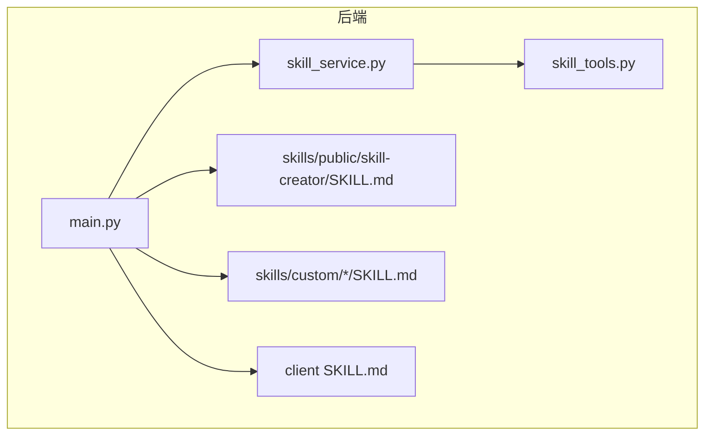
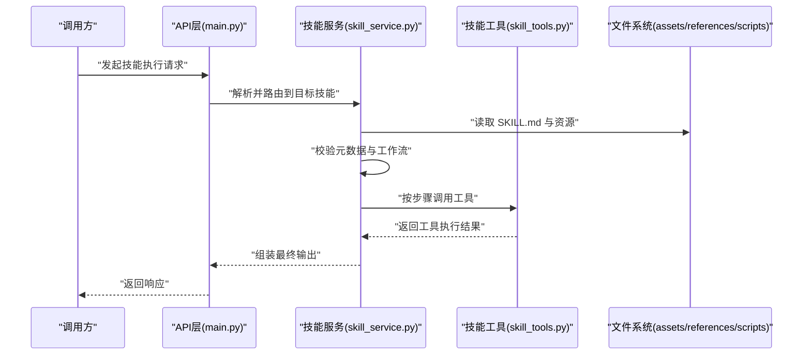
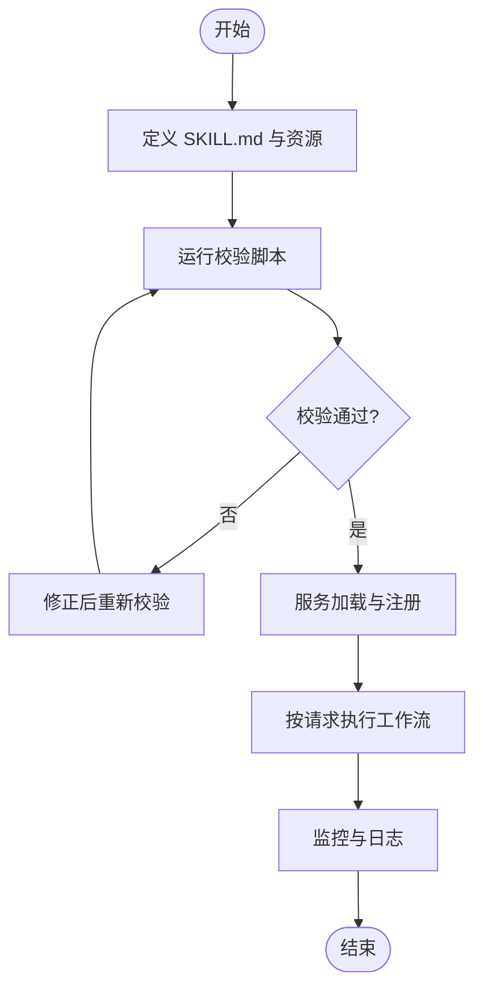
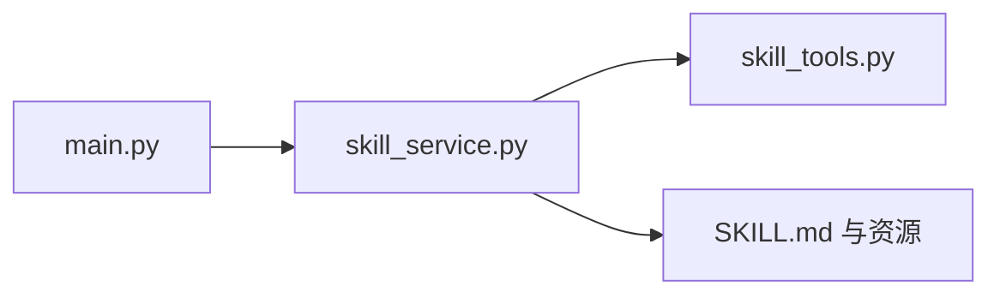

# 技能定义规范

<cite>
**本文档引用的文件**   
- [backend/skills/public/skill-creator/SKILL.md](file://backend/skills/public/skill-creator/SKILL.md)
- [backend/skills/custom/paper-writing/SKILL.md](file://backend/skills/custom/paper-writing/SKILL.md)
- [backend/skills/custom/podcast-creator/SKILL.md](file://backend/skills/custom/podcast-creator/SKILL.md)
- [backend/skills/custom/video-creator/SKILL.md](file://backend/skills/custom/video-creator/SKILL.md)
- [backend/skills/custom/virtual-anchor/SKILL.md](file://backend/skills/custom/virtual-anchor/SKILL.md)
- [backend/skills/custom/xiaohongshu-copywriter/SKILL.md](file://backend/skills/custom/xiaohongshu-copywriter/SKILL.md)
- [polystudio-client/SKILL.md](file://polystudio-client/SKILL.md)
- [backend/app/services/skill_service.py](file://backend/app/services/skill_service.py)
- [backend/app/tools/skill_tools.py](file://backend/app/tools/skill_tools.py)
- [backend/app/main.py](file://backend/app/main.py)
</cite>

## 目录
1. [简介](#简介)
2. [项目结构](#项目结构)
3. [核心组件](#核心组件)
4. [架构总览](#架构总览)
5. [详细组件分析](#详细组件分析)
6. [依赖分析](#依赖分析)
7. [性能考虑](#性能考虑)
8. [故障排查指南](#故障排查指南)
9. [结论](#结论)
10. [附录](#附录) 

## 简介
本规范面向“技能”（Skill）的定义与生命周期管理，围绕 SKILL.md 文件格式的语法与语义、元数据与工作流描述、参数配置与资源引用、版本控制与兼容性要求进行系统化说明。文档同时提供标准化模板与最佳实践，帮助开发者快速构建可复用、可验证、可执行的技能。

## 项目结构
仓库中技能相关代码与资源主要分布在以下位置：
- 公共技能模板与工具脚本：backend/skills/public/skill-creator/
- 自定义技能示例：backend/skills/custom/...
- 客户端侧技能入口：polystudio-client/SKILL.md
- 后端服务与工具：backend/app/services/skill_service.py、backend/app/tools/skill_tools.py、backend/app/main.py

图表来源 
- [backend/app/main.py](file://backend/app/main.py)
- [backend/app/services/skill_service.py](file://backend/app/services/skill_service.py)
- [backend/app/tools/skill_tools.py](file://backend/app/tools/skill_tools.py)
- [backend/skills/public/skill-creator/SKILL.md](file://backend/skills/public/skill-creator/SKILL.md)
- [backend/skills/custom/paper-writing/SKILL.md](file://backend/skills/custom/paper-writing/SKILL.md)
- [backend/skills/custom/podcast-creator/SKILL.md](file://backend/skills/custom/podcast-creator/SKILL.md)
- [backend/skills/custom/video-creator/SKILL.md](file://backend/skills/custom/video-creator/SKILL.md)
- [backend/skills/custom/virtual-anchor/SKILL.md](file://backend/skills/custom/virtual-anchor/SKILL.md)
- [backend/skills/custom/xiaohongshu-copywriter/SKILL.md](file://backend/skills/custom/xiaohongshu-copywriter/SKILL.md)
- [polystudio-client/SKILL.md](file://polystudio-client/SKILL.md)

章节来源
- [backend/app/main.py](file://backend/app/main.py)
- [backend/app/services/skill_service.py](file://backend/app/services/skill_service.py)
- [backend/app/tools/skill_tools.py](file://backend/app/tools/skill_tools.py)
- [backend/skills/public/skill-creator/SKILL.md](file://backend/skills/public/skill-creator/SKILL.md)
- [backend/skills/custom/paper-writing/SKILL.md](file://backend/skills/custom/paper-writing/SKILL.md)
- [backend/skills/custom/podcast-creator/SKILL.md](file://backend/skills/custom/podcast-creator/SKILL.md)
- [backend/skills/custom/video-creator/SKILL.md](file://backend/skills/custom/video-creator/SKILL.md)
- [backend/skills/custom/virtual-anchor/SKILL.md](file://backend/skills/custom/virtual-anchor/SKILL.md)
- [backend/skills/custom/xiaohongshu-copywriter/SKILL.md](file://backend/skills/custom/xiaohongshu-copywriter/SKILL.md)
- [polystudio-client/SKILL.md](file://polystudio-client/SKILL.md)

## 核心组件
- SKILL.md 文件：技能的声明式定义，包含元数据、工作流、参数、资源引用等。
- 技能服务：负责技能的发现、解析、校验、加载与执行编排。
- 技能工具：为技能执行期提供能力扩展（如调用外部工具、读写资源）。
- 公共模板与脚本：提供初始化、打包与快速校验能力，统一规范与质量门槛。

章节来源
- [backend/app/services/skill_service.py](file://backend/app/services/skill_service.py)
- [backend/app/tools/skill_tools.py](file://backend/app/tools/skill_tools.py)
- [backend/skills/public/skill-creator/SKILL.md](file://backend/skills/public/skill-creator/SKILL.md)

## 架构总览
从定义到执行的关键路径如下：
- 定义：在 SKILL.md 中声明技能元数据、工作流、参数与资源。
- 验证：使用公共脚本对 SKILL.md 进行结构与语义校验。
- 加载：服务启动或按需扫描 skills 目录，解析并注册技能。
- 执行：根据请求触发对应工作流，按步骤调度工具与资源，产出结果。

图表来源 
- [backend/app/main.py](file://backend/app/main.py)
- [backend/app/services/skill_service.py](file://backend/app/services/skill_service.py)
- [backend/app/tools/skill_tools.py](file://backend/app/tools/skill_tools.py)
- [backend/skills/public/skill-creator/SKILL.md](file://backend/skills/public/skill-creator/SKILL.md)

## 详细组件分析

### SKILL.md 文件格式规范
SKILL.md 是技能的单一事实源，建议采用 Markdown 结构化组织，并通过约定式键值与区块划分表达语义。以下为推荐的结构与字段说明（以“键名: 类型/约束”的形式描述）：

- 元数据
  - 名称: 字符串，唯一标识，建议使用小写连字符命名
  - 版本: 字符串，遵循语义化版本（主.次.修订）
  - 作者: 字符串或数组
  - 许可证: 字符串，如 MIT/Apache-2.0
  - 描述: 字符串，简要说明用途与边界
  - 标签: 字符串数组，用于检索与分类
  - 依赖: 对象或数组，声明外部工具或服务依赖及最小版本
  - 入口: 字符串，默认工作流或步骤标识
  - 兼容: 对象，声明运行时与平台兼容范围

- 工作流
  - 步骤列表: 有序数组，每个步骤包含
    - 名称: 字符串
    - 描述: 字符串
    - 输入: 对象，声明参数名、类型、是否必填、默认值、取值范围或枚举
    - 处理: 字符串或对象，指定工具调用、条件分支、循环、并发策略
    - 输出: 对象，声明返回值结构与格式
    - 错误: 对象，定义异常码、重试策略、降级策略
    - 资源: 数组，引用 assets 或 references 下的静态资源
    - 钩子: 对象，定义前置/后置回调（可选）

- 资源引用
  - assets: 二进制或大体积资源（图片、模型、音频等）
  - references: 文本参考材料（提示词、模板、样式等）
  - scripts: 可执行脚本（初始化、打包、校验等）
  - 引用方式：相对路径或带哈希的版本化引用

- 参数配置
  - 全局参数：作用于整个工作流
  - 步骤参数：仅作用于特定步骤
  - 环境参数：由运行环境注入（密钥、端点、配额等）

- 版本与兼容性
  - 语义化版本：主版本变更表示不兼容；次版本新增功能；修订修复问题
  - 兼容性矩阵：声明支持的 Python/Node/系统版本与第三方库最小版本
  - 迁移指引：当存在破坏性变更时，提供升级说明与自动迁移脚本

- 安全与权限
  - 敏感信息：通过环境变量或密钥管理服务注入，禁止硬编码
  - 访问控制：声明所需的最小权限集
  - 审计日志：记录关键操作与输入输出摘要

- 测试与验收
  - 单元测试：覆盖关键步骤与边界条件
  - 集成测试：端到端验证工作流
  - 验收标准：明确成功与失败判定条件

章节来源
- [backend/skills/public/skill-creator/SKILL.md](file://backend/skills/public/skill-creator/SKILL.md)
- [backend/skills/custom/paper-writing/SKILL.md](file://backend/skills/custom/paper-writing/SKILL.md)
- [backend/skills/custom/podcast-creator/SKILL.md](file://backend/skills/custom/podcast-creator/SKILL.md)
- [backend/skills/custom/video-creator/SKILL.md](file://backend/skills/custom/video-creator/SKILL.md)
- [backend/skills/custom/virtual-anchor/SKILL.md](file://backend/skills/custom/virtual-anchor/SKILL.md)
- [backend/skills/custom/xiaohongshu-copywriter/SKILL.md](file://backend/skills/custom/xiaohongshu-copywriter/SKILL.md)
- [polystudio-client/SKILL.md](file://polystudio-client/SKILL.md)

### 技能生命周期管理
- 定义阶段
  - 使用公共模板创建 SKILL.md，填写元数据与工作流
  - 将资源放入 assets/references/scripts 并按需引用
- 验证阶段
  - 使用 quick_validate 脚本进行结构与语义检查
  - 使用 package_skill 生成可分发包，附带校验报告
- 加载阶段
  - 服务启动时扫描 skills 目录，解析 SKILL.md 并注册
  - 支持热重载与增量更新（需保证幂等与一致性）
- 执行阶段
  - 根据请求匹配目标技能与步骤
  - 按顺序或并行执行，收集中间结果与错误
  - 输出标准化结果，记录审计日志
- 退役阶段
  - 标记废弃并提供迁移路径
  - 保留历史版本以供回滚与审计

图表来源 
- [backend/skills/public/skill-creator/SKILL.md](file://backend/skills/public/skill-creator/SKILL.md)
- [backend/app/services/skill_service.py](file://backend/app/services/skill_service.py)

章节来源
- [backend/app/services/skill_service.py](file://backend/app/services/skill_service.py)
- [backend/skills/public/skill-creator/SKILL.md](file://backend/skills/public/skill-creator/SKILL.md)

### 标准化模板与最佳实践
- 命名约定
  - 技能目录：小写连字符，如 paper-writing、video-creator
  - 文件：SKILL.md 固定文件名，资源文件使用可读名
- 目录结构
  - 根目录：SKILL.md
  - assets：二进制资源
  - references：文本参考
  - scripts：可执行脚本（init/package/validate）
- 依赖声明
  - 显式声明工具与服务的最小版本
  - 避免隐式依赖，确保可重现构建
- 参数设计
  - 区分必填与可选，提供合理默认值
  - 使用枚举与范围约束提升健壮性
- 错误处理
  - 定义明确的错误码与消息
  - 实现重试与退避策略
- 可观测性
  - 结构化日志，包含上下文与追踪ID
  - 指标上报（耗时、成功率、错误分布）
- 安全合规
  - 密钥外置，最小权限原则
  - 输入校验与输出清洗

章节来源
- [backend/skills/public/skill-creator/SKILL.md](file://backend/skills/public/skill-creator/SKILL.md)
- [backend/skills/custom/paper-writing/SKILL.md](file://backend/skills/custom/paper-writing/SKILL.md)
- [backend/skills/custom/video-creator/SKILL.md](file://backend/skills/custom/video-creator/SKILL.md)
- [backend/skills/custom/xiaohongshu-copywriter/SKILL.md](file://backend/skills/custom/xiaohongshu-copywriter/SKILL.md)

### 版本控制与兼容性
- 语义化版本
  - 主版本：破坏性变更（不兼容）
  - 次版本：向后兼容的功能增强
  - 修订：向后兼容的问题修复
- 兼容性矩阵
  - 运行时版本（Python/Node/系统）
  - 第三方库最小版本
- 迁移策略
  - 提供迁移脚本与说明
  - 保留旧版接口一段时间，逐步淘汰
- 发布流程
  - 自动化校验与打包
  - 签名与完整性校验
  - 灰度发布与回滚机制

章节来源
- [backend/skills/public/skill-creator/SKILL.md](file://backend/skills/public/skill-creator/SKILL.md)

### 复杂场景示例与配置方法
- 多步骤流水线
  - 串行与并行混合
  - 条件分支与动态路由
- 资源驱动
  - 基于模板渲染与变量替换
  - 大资源分块与缓存
- 外部依赖
  - 工具调用与鉴权
  - 限流与熔断
- 错误恢复
  - 重试与补偿事务
  - 降级与兜底策略
- 审计与追踪
  - 全链路日志与指标
  - 快照与回放

章节来源
- [backend/skills/custom/podcast-creator/SKILL.md](file://backend/skills/custom/podcast-creator/SKILL.md)
- [backend/skills/custom/virtual-anchor/SKILL.md](file://backend/skills/custom/virtual-anchor/SKILL.md)
- [backend/skills/custom/paper-writing/SKILL.md](file://backend/skills/custom/paper-writing/SKILL.md)

## 依赖分析
- 内部依赖
  - main.py 作为入口，路由到 skill_service.py
  - skill_service.py 协调 skill_tools.py 完成具体执行
- 外部依赖
  - 文件系统：读取 SKILL.md 与资源
  - 工具链：校验与打包脚本
  - 运行时：语言环境与第三方库

图表来源 
- [backend/app/main.py](file://backend/app/main.py)
- [backend/app/services/skill_service.py](file://backend/app/services/skill_service.py)
- [backend/app/tools/skill_tools.py](file://backend/app/tools/skill_tools.py)
- [backend/skills/public/skill-creator/SKILL.md](file://backend/skills/public/skill-creator/SKILL.md)

章节来源
- [backend/app/main.py](file://backend/app/main.py)
- [backend/app/services/skill_service.py](file://backend/app/services/skill_service.py)
- [backend/app/tools/skill_tools.py](file://backend/app/tools/skill_tools.py)

## 性能考虑
- 解析优化
  - 懒加载与缓存 SKILL.md 解析结果
  - 增量更新与差异合并
- 执行优化
  - 并行执行无依赖步骤
  - 资源预取与本地缓存
- 资源管理
  - 大文件分块与流式处理
  - 压缩与去重
- 监控与调优
  - 关键路径耗时统计
  - 热点资源与瓶颈识别

[本节为通用指导，无需列出具体文件来源]

## 故障排查指南
- 常见问题
  - SKILL.md 语法错误：使用 quick_validate 定位问题
  - 资源缺失：检查引用路径与权限
  - 依赖冲突：核对依赖声明与版本矩阵
  - 执行超时：调整重试与超时策略
- 诊断手段
  - 启用详细日志与追踪ID
  - 导出中间状态与快照
  - 复现最小用例与回归测试
- 恢复策略
  - 回滚到上一稳定版本
  - 启用降级模式与兜底逻辑

章节来源
- [backend/skills/public/skill-creator/SKILL.md](file://backend/skills/public/skill-creator/SKILL.md)
- [backend/app/services/skill_service.py](file://backend/app/services/skill_service.py)

## 结论
本规范明确了 SKILL.md 的语法与语义、技能的生命周期管理、标准化模板与最佳实践、版本控制与兼容性要求，以及复杂场景的配置方法。通过统一的定义与严格的校验，可实现技能的可复用、可验证与可执行，提升整体系统的稳定性与可维护性。

[本节为总结性内容，无需列出具体文件来源]

## 附录
- 术语表
  - 技能：一组可执行的工作流与资源的集合
  - 工作流：由多个步骤组成的执行序列
  - 资源：静态或动态数据，供工作流使用
- 参考文件
  - 公共模板与脚本：backend/skills/public/skill-creator/SKILL.md
  - 自定义示例：backend/skills/custom/*
  - 客户端入口：polystudio-client/SKILL.md

章节来源
- [backend/skills/public/skill-creator/SKILL.md](file://backend/skills/public/skill-creator/SKILL.md)
- [backend/skills/custom/paper-writing/SKILL.md](file://backend/skills/custom/paper-writing/SKILL.md)
- [backend/skills/custom/podcast-creator/SKILL.md](file://backend/skills/custom/podcast-creator/SKILL.md)
- [backend/skills/custom/video-creator/SKILL.md](file://backend/skills/custom/video-creator/SKILL.md)
- [backend/skills/custom/virtual-anchor/SKILL.md](file://backend/skills/custom/virtual-anchor/SKILL.md)
- [backend/skills/custom/xiaohongshu-copywriter/SKILL.md](file://backend/skills/custom/xiaohongshu-copywriter/SKILL.md)
- [polystudio-client/SKILL.md](file://polystudio-client/SKILL.md)