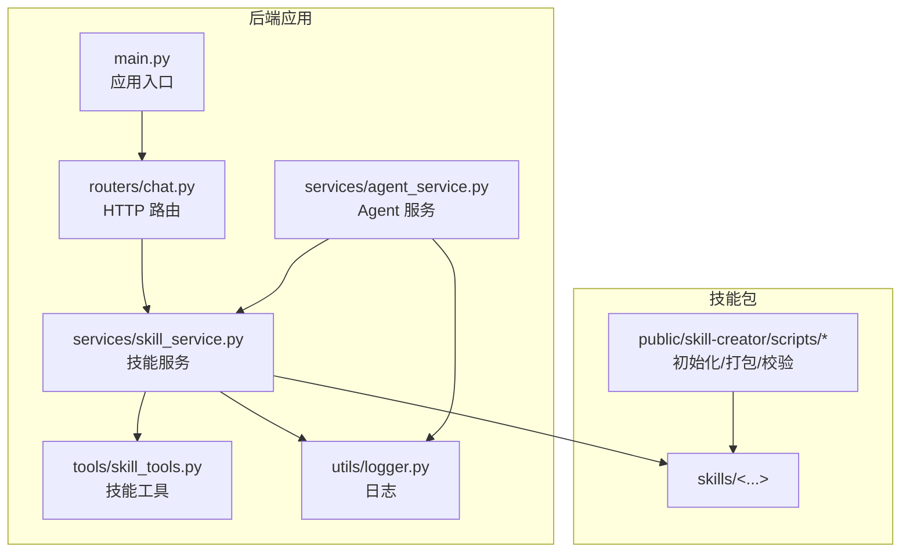
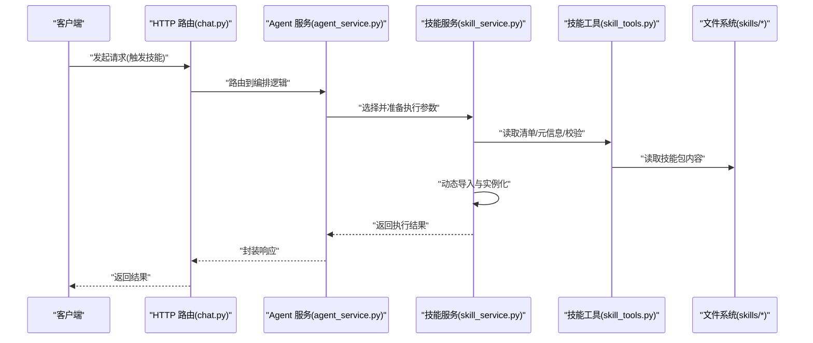
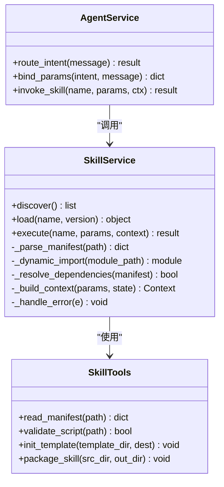
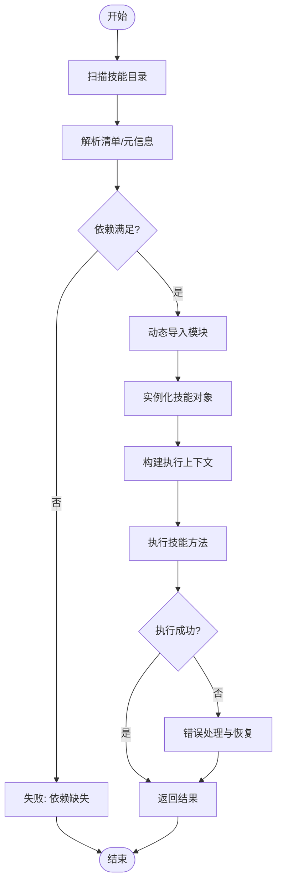
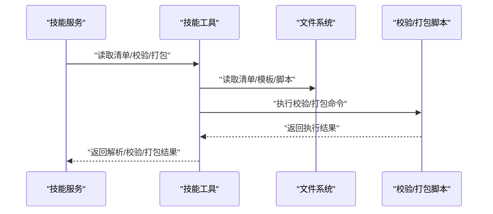
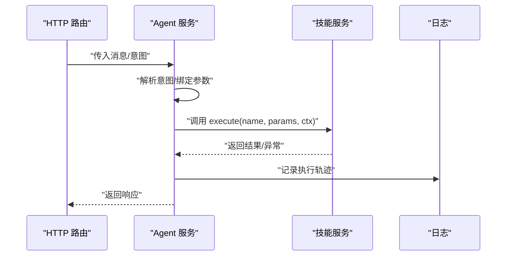
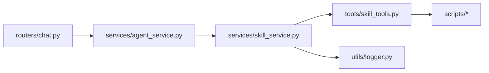

# 技能执行引擎

<cite>
**本文引用的文件**   
- [backend/app/main.py](file://backend/app/main.py)
- [backend/app/services/skill_service.py](file://backend/app/services/skill_service.py)
- [backend/app/tools/skill_tools.py](file://backend/app/tools/skill_tools.py)
- [backend/app/services/agent_service.py](file://backend/app/services/agent_service.py)
- [backend/app/routers/chat.py](file://backend/app/routers/chat.py)
- [backend/app/utils/logger.py](file://backend/app/utils/logger.py)
- [backend/skills/public/skill-creator/scripts/init_skill.py](file://backend/skills/public/skill-creator/scripts/init_skill.py)
- [backend/skills/public/skill-creator/scripts/package_skill.py](file://backend/skills/public/skill-creator/scripts/package_skill.py)
- [backend/skills/public/skill-creator/scripts/quick_validate.py](file://backend/skills/public/skill-creator/scripts/quick_validate.py)
</cite>

## 目录
1. [简介](#简介)
2. [项目结构](#项目结构)
3. [核心组件](#核心组件)
4. [架构总览](#架构总览)
5. [详细组件分析](#详细组件分析)
6. [依赖关系分析](#依赖关系分析)
7. [性能考虑](#性能考虑)
8. [故障排除指南](#故障排除指南)
9. [结论](#结论)
10. [附录](#附录)

## 简介
本技术文档围绕“技能执行引擎”展开，聚焦以下目标：
- 技能加载机制：动态导入、依赖解析、版本管理
- 执行上下文管理：状态保持、变量传递、错误恢复
- 技能间通信与数据共享协议
- 执行监控与性能分析工具使用
- 并发执行与资源隔离的安全机制
- 故障排除与性能调优建议

该引擎以 Python 后端为核心，通过服务层组织技能生命周期（发现、加载、校验、执行），并通过工具层暴露可被上层编排器或 LLM Agent 调用的能力。

## 项目结构
从仓库结构看，与技能执行引擎直接相关的代码集中在 backend 目录：
- app/main.py：应用入口与路由注册
- app/services/skill_service.py：技能服务（发现、加载、执行）
- app/tools/skill_tools.py：技能相关工具函数（如清单生成、元信息读取等）
- app/services/agent_service.py：Agent 编排与服务集成
- app/routers/chat.py：HTTP 接口（可能用于触发技能执行）
- app/utils/logger.py：日志记录
- skills/public/skill-creator/scripts/*：技能创建、打包与快速校验脚本

图表来源
- [backend/app/main.py](file://backend/app/main.py)
- [backend/app/routers/chat.py](file://backend/app/routers/chat.py)
- [backend/app/services/skill_service.py](file://backend/app/services/skill_service.py)
- [backend/app/tools/skill_tools.py](file://backend/app/tools/skill_tools.py)
- [backend/app/services/agent_service.py](file://backend/app/services/agent_service.py)
- [backend/app/utils/logger.py](file://backend/app/utils/logger.py)
- [backend/skills/public/skill-creator/scripts/init_skill.py](file://backend/skills/public/skill-creator/scripts/init_skill.py)
- [backend/skills/public/skill-creator/scripts/package_skill.py](file://backend/skills/public/skill-creator/scripts/package_skill.py)
- [backend/skills/public/skill-creator/scripts/quick_validate.py](file://backend/skills/public/skill-creator/scripts/quick_validate.py)

章节来源
- [backend/app/main.py](file://backend/app/main.py)
- [backend/app/routers/chat.py](file://backend/app/routers/chat.py)
- [backend/app/services/skill_service.py](file://backend/app/services/skill_service.py)
- [backend/app/tools/skill_tools.py](file://backend/app/tools/skill_tools.py)
- [backend/app/services/agent_service.py](file://backend/app/services/agent_service.py)
- [backend/app/utils/logger.py](file://backend/app/utils/logger.py)
- [backend/skills/public/skill-creator/scripts/init_skill.py](file://backend/skills/public/skill-creator/scripts/init_skill.py)
- [backend/skills/public/skill-creator/scripts/package_skill.py](file://backend/skills/public/skill-creator/scripts/package_skill.py)
- [backend/skills/public/skill-creator/scripts/quick_validate.py](file://backend/skills/public/skill-creator/scripts/quick_validate.py)

## 核心组件
- 技能服务（SkillService）
  - 职责：技能发现、加载、校验、执行；维护技能清单与元信息；提供执行上下文构建与结果聚合。
  - 关键流程：扫描技能目录 -> 解析清单/元数据 -> 动态导入模块 -> 实例化并缓存 -> 调用执行方法 -> 返回结构化结果。
- 技能工具（SkillTools）
  - 职责：辅助读取技能清单、校验脚本、打包与初始化技能模板、生成索引等。
- Agent 服务（AgentService）
  - 职责：将技能作为工具暴露给 Agent 编排器；负责参数绑定、上下文注入、错误处理与重试策略。
- HTTP 路由（chat.py）
  - 职责：对外暴露触发技能执行的接口（例如聊天消息触发工作流）。
- 日志（logger.py）
  - 职责：统一日志输出，便于追踪技能执行链路。

章节来源
- [backend/app/services/skill_service.py](file://backend/app/services/skill_service.py)
- [backend/app/tools/skill_tools.py](file://backend/app/tools/skill_tools.py)
- [backend/app/services/agent_service.py](file://backend/app/services/agent_service.py)
- [backend/app/routers/chat.py](file://backend/app/routers/chat.py)
- [backend/app/utils/logger.py](file://backend/app/utils/logger.py)

## 架构总览
整体采用分层架构：
- 接入层：HTTP 路由接收请求，转发到 Agent 服务或直接调用技能服务。
- 编排层：Agent 服务根据意图选择并调用相应技能。
- 执行层：技能服务负责加载与执行具体技能模块。
- 基础设施：日志、配置、文件系统访问、外部工具链（打包/校验脚本）。

图表来源
- [backend/app/routers/chat.py](file://backend/app/routers/chat.py)
- [backend/app/services/agent_service.py](file://backend/app/services/agent_service.py)
- [backend/app/services/skill_service.py](file://backend/app/services/skill_service.py)
- [backend/app/tools/skill_tools.py](file://backend/app/tools/skill_tools.py)

## 详细组件分析

### 技能服务（SkillService）
- 功能要点
  - 技能发现：扫描指定目录，识别有效技能包（基于清单或约定式结构）。
  - 动态导入：按模块路径动态加载 Python 模块，避免硬编码依赖。
  - 依赖解析：解析技能清单中的依赖项，确保运行时可用。
  - 版本管理：读取并校验技能版本，支持向后兼容策略。
  - 执行上下文：为每次执行构建独立上下文（状态、变量、超时、重试）。
  - 错误恢复：捕获异常、记录日志、降级或回滚部分状态。
- 关键流程（类图）

图表来源
- [backend/app/services/skill_service.py](file://backend/app/services/skill_service.py)
- [backend/app/tools/skill_tools.py](file://backend/app/tools/skill_tools.py)
- [backend/app/services/agent_service.py](file://backend/app/services/agent_service.py)

章节来源
- [backend/app/services/skill_service.py](file://backend/app/services/skill_service.py)
- [backend/app/tools/skill_tools.py](file://backend/app/tools/skill_tools.py)
- [backend/app/services/agent_service.py](file://backend/app/services/agent_service.py)

#### 动态导入与依赖解析流程图

图表来源
- [backend/app/services/skill_service.py](file://backend/app/services/skill_service.py)
- [backend/app/tools/skill_tools.py](file://backend/app/tools/skill_tools.py)

### 技能工具（SkillTools）
- 功能要点
  - 清单读取：解析技能清单文件，提取名称、版本、描述、依赖等。
  - 脚本校验：运行快速校验脚本，验证技能结构与输入约束。
  - 初始化模板：为新技能生成标准目录与样板文件。
  - 打包技能：将技能目录打包为可分发格式，便于部署与版本管理。
- 典型交互序列

图表来源
- [backend/app/tools/skill_tools.py](file://backend/app/tools/skill_tools.py)
- [backend/skills/public/skill-creator/scripts/init_skill.py](file://backend/skills/public/skill-creator/scripts/init_skill.py)
- [backend/skills/public/skill-creator/scripts/package_skill.py](file://backend/skills/public/skill-creator/scripts/package_skill.py)
- [backend/skills/public/skill-creator/scripts/quick_validate.py](file://backend/skills/public/skill-creator/scripts/quick_validate.py)

章节来源
- [backend/app/tools/skill_tools.py](file://backend/app/tools/skill_tools.py)
- [backend/skills/public/skill-creator/scripts/init_skill.py](file://backend/skills/public/skill-creator/scripts/init_skill.py)
- [backend/skills/public/skill-creator/scripts/package_skill.py](file://backend/skills/public/skill-creator/scripts/package_skill.py)
- [backend/skills/public/skill-creator/scripts/quick_validate.py](file://backend/skills/public/skill-creator/scripts/quick_validate.py)

### Agent 服务（AgentService）
- 功能要点
  - 意图路由：根据用户消息或上游编排器的指令，选择合适技能。
  - 参数绑定：将用户输入映射为技能所需参数。
  - 上下文注入：注入会话状态、环境变量、权限信息等。
  - 错误处理：捕获异常、记录日志、重试或降级。
- 调用序列

图表来源
- [backend/app/routers/chat.py](file://backend/app/routers/chat.py)
- [backend/app/services/agent_service.py](file://backend/app/services/agent_service.py)
- [backend/app/services/skill_service.py](file://backend/app/services/skill_service.py)
- [backend/app/utils/logger.py](file://backend/app/utils/logger.py)

章节来源
- [backend/app/routers/chat.py](file://backend/app/routers/chat.py)
- [backend/app/services/agent_service.py](file://backend/app/services/agent_service.py)
- [backend/app/services/skill_service.py](file://backend/app/services/skill_service.py)
- [backend/app/utils/logger.py](file://backend/app/utils/logger.py)

### 执行上下文管理
- 状态保持
  - 每个执行拥有独立上下文对象，包含会话 ID、用户标识、权限、中间变量等。
  - 上下文在技能间传递时进行浅拷贝或深拷贝，避免副作用污染。
- 变量传递
  - 通过参数契约（清单声明）进行强类型校验与默认值填充。
  - 支持环境变量注入与敏感信息保护。
- 错误恢复
  - 捕获异常后记录堆栈与上下文快照，支持重试与回滚。
  - 对长耗时任务提供超时控制与中断信号。

章节来源
- [backend/app/services/skill_service.py](file://backend/app/services/skill_service.py)
- [backend/app/services/agent_service.py](file://backend/app/services/agent_service.py)

### 技能间通信协议与数据共享
- 通信协议
  - 基于结构化消息（JSON 或字典）的接口契约，由清单定义输入/输出字段。
  - 可选事件总线或回调机制，用于异步通知与进度上报。
- 数据共享
  - 内存级共享：通过上下文对象在单次编排内共享。
  - 持久化共享：通过文件系统或外部存储（如对象存储）交换大文件或中间产物。
  - 安全边界：对共享数据进行权限校验与最小权限原则。

章节来源
- [backend/app/services/skill_service.py](file://backend/app/services/skill_service.py)
- [backend/app/tools/skill_tools.py](file://backend/app/tools/skill_tools.py)

### 执行监控与性能分析
- 监控指标
  - 执行时长、成功率、错误率、资源占用（CPU/内存）、I/O 吞吐。
- 采集方式
  - 在技能服务与 Agent 服务中埋点，结合日志与指标收集。
- 分析方法
  - 基于时间戳与 TraceID 串联调用链。
  - 对热点技能进行采样分析与瓶颈定位。

章节来源
- [backend/app/utils/logger.py](file://backend/app/utils/logger.py)
- [backend/app/services/skill_service.py](file://backend/app/services/skill_service.py)
- [backend/app/services/agent_service.py](file://backend/app/services/agent_service.py)

### 并发执行与资源隔离
- 并发模型
  - 使用线程池或进程池并行执行互不依赖的技能。
  - 对 I/O 密集型任务优先使用异步或协程。
- 资源隔离
  - 通过子进程或容器化执行环境限制 CPU/内存配额。
  - 文件系统命名空间隔离，避免跨技能写入冲突。
- 安全机制
  - 白名单模块导入、沙箱执行、权限最小化。
  - 对第三方库进行版本锁定与安全扫描。

章节来源
- [backend/app/services/skill_service.py](file://backend/app/services/skill_service.py)
- [backend/app/services/agent_service.py](file://backend/app/services/agent_service.py)

## 依赖关系分析
- 组件耦合
  - 路由层仅依赖 Agent 服务，降低与具体实现的耦合。
  - Agent 服务依赖技能服务，屏蔽底层加载细节。
  - 技能服务依赖工具层与日志，保持职责单一。
- 外部依赖
  - 文件系统访问（技能包与清单）。
  - 脚本执行（初始化/打包/校验）。
- 潜在循环依赖
  - 当前分层清晰，未见明显循环依赖；需确保新增模块遵循单向依赖。

图表来源
- [backend/app/routers/chat.py](file://backend/app/routers/chat.py)
- [backend/app/services/agent_service.py](file://backend/app/services/agent_service.py)
- [backend/app/services/skill_service.py](file://backend/app/services/skill_service.py)
- [backend/app/tools/skill_tools.py](file://backend/app/tools/skill_tools.py)
- [backend/app/utils/logger.py](file://backend/app/utils/logger.py)
- [backend/skills/public/skill-creator/scripts/init_skill.py](file://backend/skills/public/skill-creator/scripts/init_skill.py)
- [backend/skills/public/skill-creator/scripts/package_skill.py](file://backend/skills/public/skill-creator/scripts/package_skill.py)
- [backend/skills/public/skill-creator/scripts/quick_validate.py](file://backend/skills/public/skill-creator/scripts/quick_validate.py)

章节来源
- [backend/app/routers/chat.py](file://backend/app/routers/chat.py)
- [backend/app/services/agent_service.py](file://backend/app/services/agent_service.py)
- [backend/app/services/skill_service.py](file://backend/app/services/skill_service.py)
- [backend/app/tools/skill_tools.py](file://backend/app/tools/skill_tools.py)
- [backend/app/utils/logger.py](file://backend/app/utils/logger.py)
- [backend/skills/public/skill-creator/scripts/init_skill.py](file://backend/skills/public/skill-creator/scripts/init_skill.py)
- [backend/skills/public/skill-creator/scripts/package_skill.py](file://backend/skills/public/skill-creator/scripts/package_skill.py)
- [backend/skills/public/skill-creator/scripts/quick_validate.py](file://backend/skills/public/skill-creator/scripts/quick_validate.py)

## 性能考虑
- 加载优化
  - 预扫描与缓存清单，减少重复 IO。
  - 延迟加载与按需导入，避免冷启动开销。
- 执行优化
  - 批处理与流水线化，减少上下文切换。
  - 对计算密集任务启用多进程或 GPU 加速。
- 监控与调优
  - 引入 APM 或自定义指标面板，关注 P95/P99 延迟。
  - 针对热点技能进行采样分析与热点路径重构。

[本节为通用指导，无需特定文件来源]

## 故障排除指南
- 常见问题
  - 依赖缺失：检查清单与虚拟环境依赖是否一致。
  - 动态导入失败：确认模块路径与命名空间正确。
  - 版本不兼容：核对清单版本与运行时要求。
  - 执行超时：调整超时阈值或拆分长任务。
- 排查步骤
  - 查看日志中的 TraceID 与堆栈信息。
  - 使用快速校验脚本验证技能结构。
  - 逐步缩小范围，定位问题发生在加载、解析还是执行阶段。
- 恢复策略
  - 自动重试与退避。
  - 降级到备用实现或返回友好错误提示。

章节来源
- [backend/app/utils/logger.py](file://backend/app/utils/logger.py)
- [backend/app/services/skill_service.py](file://backend/app/services/skill_service.py)
- [backend/skills/public/skill-creator/scripts/quick_validate.py](file://backend/skills/public/skill-creator/scripts/quick_validate.py)

## 结论
本引擎通过分层设计与清晰的职责划分，实现了技能的动态加载、依赖解析、版本管理与执行上下文管理。借助工具链与日志体系，提供了良好的可观测性与可维护性。后续可在并发模型、资源隔离与监控方面持续演进，以提升稳定性与性能。

[本节为总结，无需特定文件来源]

## 附录
- 术语
  - 技能：具备明确输入/输出的可复用能力单元。
  - 清单：描述技能元信息与依赖的结构化文件。
  - 执行上下文：一次执行过程中的状态与变量集合。
- 最佳实践
  - 严格定义清单契约，保证前后向兼容。
  - 对敏感信息进行脱敏与最小权限控制。
  - 对长耗时任务提供进度上报与取消机制。

[本节为概念说明，无需特定文件来源]