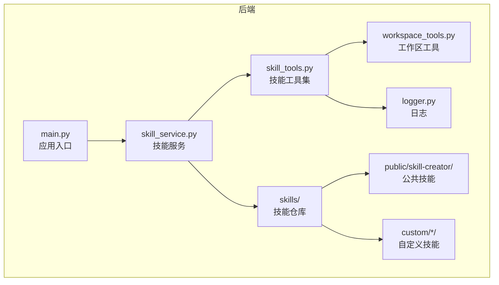
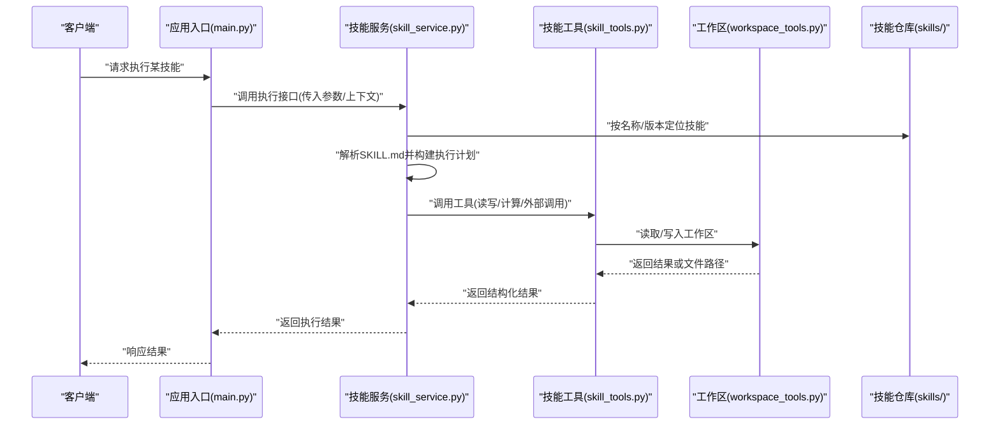
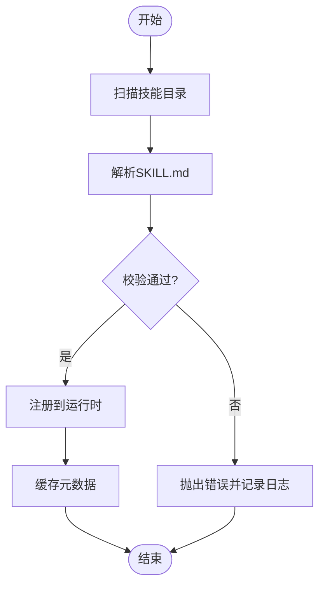
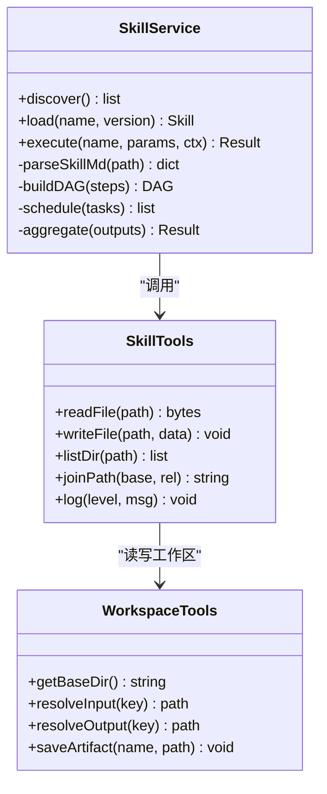
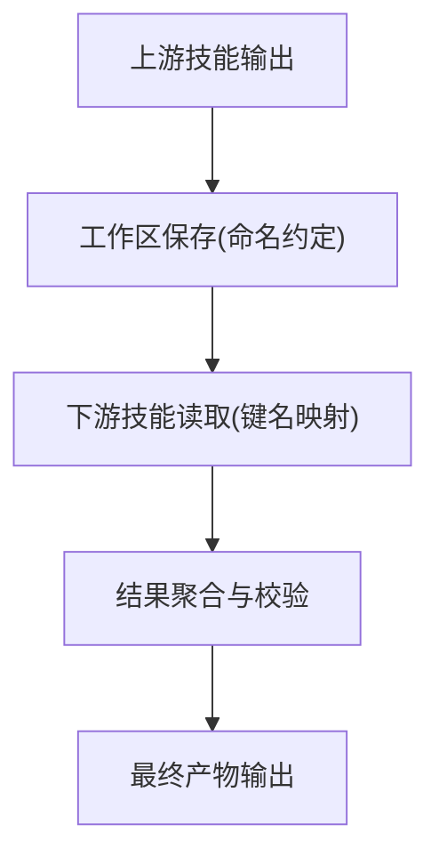
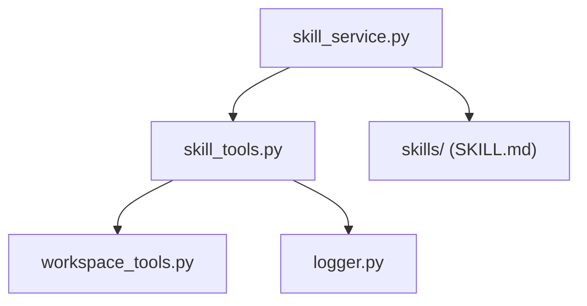

# 技能系统

<cite>
**本文引用的文件**   
- [backend/app/services/skill_service.py](file://backend/app/services/skill_service.py)
- [backend/app/tools/skill_tools.py](file://backend/app/tools/skill_tools.py)
- [backend/skills/public/skill-creator/SKILL.md](file://backend/skills/public/skill-creator/SKILL.md)
- [backend/skills/custom/paper-writing/SKILL.md](file://backend/skills/custom/paper-writing/SKILL.md)
- [backend/skills/custom/podcast-creator/SKILL.md](file://backend/skills/custom/podcast-creator/SKILL.md)
- [backend/skills/custom/video-creator/SKILL.md](file://backend/skills/custom/video-creator/SKILL.md)
- [backend/skills/custom/virtual-anchor/SKILL.md](file://backend/skills/custom/virtual-anchor/SKILL.md)
- [backend/skills/custom/xiaohongshu-copywriter/SKILL.md](file://backend/skills/custom/xiaohongshu-copywriter/SKILL.md)
- [backend/skills/public/skill-creator/scripts/init_skill.py](file://backend/skills/public/skill-creator/scripts/init_skill.py)
- [backend/skills/public/skill-creator/scripts/package_skill.py](file://backend/skills/public/skill-creator/scripts/package_skill.py)
- [backend/skills/public/skill-creator/scripts/quick_validate.py](file://backend/skills/public/skill-creator/scripts/quick_validate.py)
- [backend/skills/public/skill-creator/references/output-patterns.md](file://backend/skills/public/skill-creator/references/output-patterns.md)
- [backend/skills/public/skill-creator/references/workflows.md](file://backend/skills/public/skill-creator/references/workflows.md)
- [backend/skills/custom/paper-writing/references/research_tips.md](file://backend/skills/custom/paper-writing/references/research_tips.md)
- [backend/skills/custom/video-creator/references/storyboard_format.md](file://backend/skills/custom/video-creator/references/storyboard_format.md)
- [backend/skills/custom/xiaohongshu-copywriter/references/xiaohongshu_tags.md](file://backend/skills/custom/xiaohongshu-copywriter/references/xiaohongshu_tags.md)
- [backend/skills/custom/xiaohongshu-copywriter/references/xiaohongshu_template.md](file://backend/skills/custom/xiaohongshu-copywriter/references/xiaohongshu_template.md)
- [backend/app/tools/workspace_tools.py](file://backend/app/tools/workspace_tools.py)
- [backend/app/utils/logger.py](file://backend/app/utils/logger.py)
- [backend/app/main.py](file://backend/app/main.py)
</cite>

## 目录
1. [简介](#简介)
2. [项目结构](#项目结构)
3. [核心组件](#核心组件)
4. [架构总览](#架构总览)
5. [详细组件分析](#详细组件分析)
6. [依赖关系分析](#依赖关系分析)
7. [性能考虑](#性能考虑)
8. [故障排查指南](#故障排查指南)
9. [结论](#结论)
10. [附录](#附录)

## 简介
本技术文档面向“技能系统”的设计与实现，覆盖以下主题：
- 技能定义格式（SKILL.md规范）
- 技能加载机制与执行引擎设计
- 内置技能的功能特性与使用方法（论文写作、播客创作、视频制作、虚拟主播等）
- 自定义技能开发完整指南（模板、脚本编写、资源管理、测试验证）
- 技能间依赖关系、参数传递与结果共享机制
- 技能发布、分发与版本管理的最佳实践
- 调试工具与性能分析方法

## 项目结构
技能系统主要位于后端目录中，围绕“服务层 + 工具层 + 技能仓库”的三层组织方式构建：
- 服务层：负责技能的发现、加载、编排与执行调度
- 工具层：提供音视频处理、图像生成、工作区读写等通用能力
- 技能仓库：以目录为单位的技能包，每个技能包含 SKILL.md 描述、references 参考材料、scripts 可执行脚本、assets 静态资源等

图示来源
- [backend/app/main.py](file://backend/app/main.py)
- [backend/app/services/skill_service.py](file://backend/app/services/skill_service.py)
- [backend/app/tools/skill_tools.py](file://backend/app/tools/skill_tools.py)
- [backend/app/tools/workspace_tools.py](file://backend/app/tools/workspace_tools.py)
- [backend/app/utils/logger.py](file://backend/app/utils/logger.py)
- [backend/skills/public/skill-creator/SKILL.md](file://backend/skills/public/skill-creator/SKILL.md)

章节来源
- [backend/app/main.py](file://backend/app/main.py)
- [backend/app/services/skill_service.py](file://backend/app/services/skill_service.py)
- [backend/app/tools/skill_tools.py](file://backend/app/tools/skill_tools.py)
- [backend/app/tools/workspace_tools.py](file://backend/app/tools/workspace_tools.py)
- [backend/app/utils/logger.py](file://backend/app/utils/logger.py)

## 核心组件
- 技能服务（SkillService）
  - 职责：扫描技能目录、解析 SKILL.md、注册技能元数据、维护生命周期、协调执行流程
  - 关键能力：技能发现、依赖解析、参数校验、上下文注入、结果聚合
- 技能工具集（SkillTools）
  - 职责：封装通用工具函数，如工作区读写、日志记录、外部工具调用
  - 关键能力：路径解析、IO 操作、错误包装、结构化输出
- 工作区工具（WorkspaceTools）
  - 职责：提供统一的工作区访问接口，供技能在运行期读写输入/输出
  - 关键能力：目录隔离、命名约定、权限控制
- 日志（Logger）
  - 职责：统一日志输出、分级、采样、追踪 ID 关联
  - 关键能力：结构化日志、链路追踪、性能打点

章节来源
- [backend/app/services/skill_service.py](file://backend/app/services/skill_service.py)
- [backend/app/tools/skill_tools.py](file://backend/app/tools/skill_tools.py)
- [backend/app/tools/workspace_tools.py](file://backend/app/tools/workspace_tools.py)
- [backend/app/utils/logger.py](file://backend/app/utils/logger.py)

## 架构总览
技能系统的整体架构由“服务层驱动 + 工具层支撑 + 技能仓库承载”构成。服务层负责将 SKILL.md 描述的意图转化为可执行的步骤序列，并通过工具层完成具体任务；技能仓库通过标准化目录结构与元数据声明，使系统能够动态发现与加载新技能。

图示来源
- [backend/app/main.py](file://backend/app/main.py)
- [backend/app/services/skill_service.py](file://backend/app/services/skill_service.py)
- [backend/app/tools/skill_tools.py](file://backend/app/tools/skill_tools.py)
- [backend/app/tools/workspace_tools.py](file://backend/app/tools/workspace_tools.py)
- [backend/skills/public/skill-creator/SKILL.md](file://backend/skills/public/skill-creator/SKILL.md)

## 详细组件分析

### 技能定义格式（SKILL.md规范）
SKILL.md 是技能的契约文件，用于声明技能的元信息、输入输出、依赖、执行步骤与参考材料。典型字段包括：
- 基本信息：名称、版本、作者、许可证、描述
- 输入参数：参数名、类型、默认值、约束说明
- 输出产物：产物类型、存储位置、命名规则
- 依赖项：其他技能、外部工具、环境变量
- 执行步骤：顺序/并行、条件分支、重试策略
- 参考材料：references 目录下的辅助文档
- 脚本入口：scripts 目录中的初始化/打包/验证脚本

建议遵循以下约定：
- 使用 Markdown 语法，保持可读性与机器可解析性
- 参数与产物采用统一的 JSON Schema 风格描述
- 版本号采用语义化版本（主.次.修订）
- 依赖项显式声明版本范围，避免隐式耦合

章节来源
- [backend/skills/public/skill-creator/SKILL.md](file://backend/skills/public/skill-creator/SKILL.md)
- [backend/skills/custom/paper-writing/SKILL.md](file://backend/skills/custom/paper-writing/SKILL.md)
- [backend/skills/custom/podcast-creator/SKILL.md](file://backend/skills/custom/podcast-creator/SKILL.md)
- [backend/skills/custom/video-creator/SKILL.md](file://backend/skills/custom/video-creator/SKILL.md)
- [backend/skills/custom/virtual-anchor/SKILL.md](file://backend/skills/custom/virtual-anchor/SKILL.md)
- [backend/skills/custom/xiaohongshu-copywriter/SKILL.md](file://backend/skills/custom/xiaohongshu-copywriter/SKILL.md)

### 技能加载机制
技能加载流程通常包含以下步骤：
- 扫描：遍历 skills 目录，识别包含 SKILL.md 的技能包
- 解析：读取并解析 SKILL.md，提取元数据、参数、依赖、步骤
- 校验：检查必填字段、参数类型、依赖可用性
- 注册：将技能加入运行时注册表，支持按名称/版本查询
- 缓存：对已解析的技能进行内存缓存，提升后续加载性能

图示来源
- [backend/app/services/skill_service.py](file://backend/app/services/skill_service.py)
- [backend/app/tools/skill_tools.py](file://backend/app/tools/skill_tools.py)
- [backend/app/utils/logger.py](file://backend/app/utils/logger.py)

章节来源
- [backend/app/services/skill_service.py](file://backend/app/services/skill_service.py)
- [backend/app/tools/skill_tools.py](file://backend/app/tools/skill_tools.py)
- [backend/app/utils/logger.py](file://backend/app/utils/logger.py)

### 执行引擎设计
执行引擎负责将 SKILL.md 的步骤转换为可执行的任务图，并进行调度与监控：
- 任务图构建：根据步骤声明生成有向无环图（DAG），标注依赖关系
- 调度策略：支持顺序执行、并行执行、条件分支、重试与超时
- 上下文注入：将输入参数、工作区路径、环境变量注入到执行环境
- 结果聚合：收集各步骤输出，合并为最终产物
- 错误处理：捕获异常、记录堆栈、回滚部分状态（可选）

图示来源
- [backend/app/services/skill_service.py](file://backend/app/services/skill_service.py)
- [backend/app/tools/skill_tools.py](file://backend/app/tools/skill_tools.py)
- [backend/app/tools/workspace_tools.py](file://backend/app/tools/workspace_tools.py)

章节来源
- [backend/app/services/skill_service.py](file://backend/app/services/skill_service.py)
- [backend/app/tools/skill_tools.py](file://backend/app/tools/skill_tools.py)
- [backend/app/tools/workspace_tools.py](file://backend/app/tools/workspace_tools.py)

### 内置技能功能与用法
- 论文写作（paper-writing）
  - 功能：基于研究提示与参考文献，生成论文大纲、初稿与引用列表
  - 输入：主题、关键词、目标期刊/会议、参考文献路径
  - 输出：论文草稿、参考文献清单、写作建议
  - 参考：research_tips.md
- 播客创作（podcast-creator）
  - 功能：根据主题生成脚本、分镜与音频素材清单
  - 输入：主题、时长、受众画像
  - 输出：脚本、分镜、音频片段路径
- 视频制作（video-creator）
  - 功能：依据故事板生成视频剪辑方案与合成指令
  - 输入：故事板、素材库、渲染参数
  - 输出：视频文件、字幕、封面
  - 参考：storyboard_format.md
- 虚拟主播（virtual-anchor）
  - 功能：结合文本与语音生成虚拟人播报视频
  - 输入：文案、音色、背景、动作配置
  - 输出：播报视频、音轨、唇形数据
- 小红书文案（xiaohongshu-copywriter）
  - 功能：生成符合平台风格的文案与标签
  - 输入：产品卖点、受众、风格偏好
  - 输出：文案、标签、配图建议
  - 参考：xiaohongshu_tags.md、xiaohongshu_template.md

章节来源
- [backend/skills/custom/paper-writing/SKILL.md](file://backend/skills/custom/paper-writing/SKILL.md)
- [backend/skills/custom/podcast-creator/SKILL.md](file://backend/skills/custom/podcast-creator/SKILL.md)
- [backend/skills/custom/video-creator/SKILL.md](file://backend/skills/custom/video-creator/SKILL.md)
- [backend/skills/custom/virtual-anchor/SKILL.md](file://backend/skills/custom/virtual-anchor/SKILL.md)
- [backend/skills/custom/xiaohongshu-copywriter/SKILL.md](file://backend/skills/custom/xiaohongshu-copywriter/SKILL.md)
- [backend/skills/custom/paper-writing/references/research_tips.md](file://backend/skills/custom/paper-writing/references/research_tips.md)
- [backend/skills/custom/video-creator/references/storyboard_format.md](file://backend/skills/custom/video-creator/references/storyboard_format.md)
- [backend/skills/custom/xiaohongshu-copywriter/references/xiaohongshu_tags.md](file://backend/skills/custom/xiaohongshu-copywriter/references/xiaohongshu_tags.md)
- [backend/skills/custom/xiaohongshu-copywriter/references/xiaohongshu_template.md](file://backend/skills/custom/xiaohongshu-copywriter/references/xiaohongshu_template.md)

### 自定义技能开发指南
- 技能模板
  - 使用公共技能 skill-creator 提供的模板快速创建新技能
  - 模板包含基础目录结构、示例 SKILL.md、参考文档与脚本
- 脚本编写
  - init_skill.py：初始化技能骨架，填充必要字段
  - package_skill.py：打包技能为可分发包（含元数据与资源）
  - quick_validate.py：快速校验 SKILL.md 与目录结构
- 资源管理
  - assets：存放静态资源（图片、模板、配置文件）
  - references：存放参考文档（格式规范、最佳实践）
  - scripts：存放可执行脚本（初始化、打包、验证）
- 测试验证
  - 使用 quick_validate.py 进行本地自检
  - 构造最小用例，验证输入输出与工作区读写
  - 集成测试：模拟多步骤执行与依赖调用

章节来源
- [backend/skills/public/skill-creator/SKILL.md](file://backend/skills/public/skill-creator/SKILL.md)
- [backend/skills/public/skill-creator/scripts/init_skill.py](file://backend/skills/public/skill-creator/scripts/init_skill.py)
- [backend/skills/public/skill-creator/scripts/package_skill.py](file://backend/skills/public/skill-creator/scripts/package_skill.py)
- [backend/skills/public/skill-creator/scripts/quick_validate.py](file://backend/skills/public/skill-creator/scripts/quick_validate.py)
- [backend/skills/public/skill-creator/references/output-patterns.md](file://backend/skills/public/skill-creator/references/output-patterns.md)
- [backend/skills/public/skill-creator/references/workflows.md](file://backend/skills/public/skill-creator/references/workflows.md)

### 依赖关系、参数传递与结果共享
- 依赖关系
  - 显式声明对其他技能的依赖与版本范围
  - 服务层在加载时解析依赖图，确保可用性与兼容性
- 参数传递
  - 通过 SKILL.md 的参数定义进行强类型校验
  - 执行前注入上下文（工作区路径、环境变量、用户配置）
- 结果共享
  - 使用工作区作为中间存储，按命名约定保存中间产物
  - 下游技能通过工作区键名读取上游产物，避免硬编码路径

图示来源
- [backend/app/tools/workspace_tools.py](file://backend/app/tools/workspace_tools.py)
- [backend/app/tools/skill_tools.py](file://backend/app/tools/skill_tools.py)
- [backend/skills/public/skill-creator/references/output-patterns.md](file://backend/skills/public/skill-creator/references/output-patterns.md)

章节来源
- [backend/app/tools/workspace_tools.py](file://backend/app/tools/workspace_tools.py)
- [backend/app/tools/skill_tools.py](file://backend/app/tools/skill_tools.py)
- [backend/skills/public/skill-creator/references/output-patterns.md](file://backend/skills/public/skill-creator/references/output-patterns.md)

### 发布、分发与版本管理
- 发布
  - 使用 package_skill.py 打包技能，生成包含元数据与资源的压缩包
  - 校验通过后上传至内部制品库或版本仓库
- 分发
  - 提供安装脚本或 CLI，支持从远程仓库拉取与安装
  - 支持离线安装（预打包资源）
- 版本管理
  - 遵循语义化版本，变更需更新 SKILL.md 的版本字段
  - 兼容策略：向后兼容优先，破坏性变更需升级主版本
  - 依赖锁定：在 SKILL.md 中声明依赖版本范围，避免漂移

章节来源
- [backend/skills/public/skill-creator/scripts/package_skill.py](file://backend/skills/public/skill-creator/scripts/package_skill.py)
- [backend/skills/public/skill-creator/SKILL.md](file://backend/skills/public/skill-creator/SKILL.md)

### 调试工具与性能分析
- 调试工具
  - quick_validate.py：快速校验 SKILL.md 与目录结构
  - 日志：通过 logger 输出结构化日志，便于问题定位
  - 工作区快照：在执行前后导出工作区状态，对比差异
- 性能分析
  - 打点：在关键步骤记录耗时，统计 P95/P99
  - 并行度：评估并行执行收益与资源占用
  - I/O 优化：批量读写、压缩传输、缓存热点数据

章节来源
- [backend/skills/public/skill-creator/scripts/quick_validate.py](file://backend/skills/public/skill-creator/scripts/quick_validate.py)
- [backend/app/utils/logger.py](file://backend/app/utils/logger.py)
- [backend/app/tools/skill_tools.py](file://backend/app/tools/skill_tools.py)

## 依赖关系分析
技能系统与工具层、工作区、日志模块之间的依赖关系如下：

图示来源
- [backend/app/services/skill_service.py](file://backend/app/services/skill_service.py)
- [backend/app/tools/skill_tools.py](file://backend/app/tools/skill_tools.py)
- [backend/app/tools/workspace_tools.py](file://backend/app/tools/workspace_tools.py)
- [backend/app/utils/logger.py](file://backend/app/utils/logger.py)
- [backend/skills/public/skill-creator/SKILL.md](file://backend/skills/public/skill-creator/SKILL.md)

章节来源
- [backend/app/services/skill_service.py](file://backend/app/services/skill_service.py)
- [backend/app/tools/skill_tools.py](file://backend/app/tools/skill_tools.py)
- [backend/app/tools/workspace_tools.py](file://backend/app/tools/workspace_tools.py)
- [backend/app/utils/logger.py](file://backend/app/utils/logger.py)

## 性能考虑
- 并发与并行
  - 对独立步骤启用并行执行，注意资源竞争与锁粒度
  - 限制最大并发数，避免过载
- I/O 优化
  - 使用流式读写大文件，减少内存峰值
  - 对频繁读写的中间产物进行缓存
- 序列化与反序列化
  - 选择高效的数据格式（如 JSON/MessagePack）
  - 避免不必要的深拷贝
- 监控与告警
  - 记录关键指标（耗时、失败率、队列长度）
  - 设置阈值告警，及时发现问题

[本节为通用指导，不直接分析具体文件]

## 故障排查指南
- 常见问题
  - SKILL.md 解析失败：检查必填字段与类型约束
  - 依赖缺失：确认依赖技能已安装且版本兼容
  - 工作区权限：检查读写权限与路径合法性
  - 外部工具不可用：检查环境变量与依赖库
- 定位方法
  - 查看结构化日志，关注错误堆栈与上下文
  - 导出工作区快照，对比执行前后差异
  - 使用 quick_validate.py 进行本地自检
- 恢复策略
  - 重试与退避：对临时失败进行指数退避重试
  - 回滚：在关键步骤失败时清理中间产物
  - 降级：在依赖不可用时切换到备用流程

章节来源
- [backend/app/utils/logger.py](file://backend/app/utils/logger.py)
- [backend/skills/public/skill-creator/scripts/quick_validate.py](file://backend/skills/public/skill-creator/scripts/quick_validate.py)
- [backend/app/tools/workspace_tools.py](file://backend/app/tools/workspace_tools.py)

## 结论
技能系统通过标准化的 SKILL.md 定义与模块化执行引擎，实现了灵活、可扩展的多模态内容生产流水线。借助工具层与工作区的解耦设计，系统具备良好的可维护性与可观测性。建议在团队内推广标准模板与最佳实践，持续完善依赖管理与版本治理，以提升整体交付质量与效率。

[本节为总结性内容，不直接分析具体文件]

## 附录
- 术语表
  - 技能：具备明确输入输出与执行步骤的可复用单元
  - 工作区：技能运行期的隔离目录，用于输入输出与中间产物
  - 依赖：技能执行所需的其他技能或外部工具
- 参考链接
  - 输出模式参考：output-patterns.md
  - 工作流程参考：workflows.md

章节来源
- [backend/skills/public/skill-creator/references/output-patterns.md](file://backend/skills/public/skill-creator/references/output-patterns.md)
- [backend/skills/public/skill-creator/references/workflows.md](file://backend/skills/public/skill-creator/references/workflows.md)