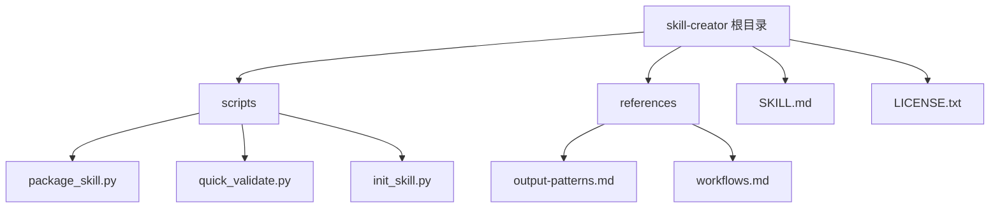
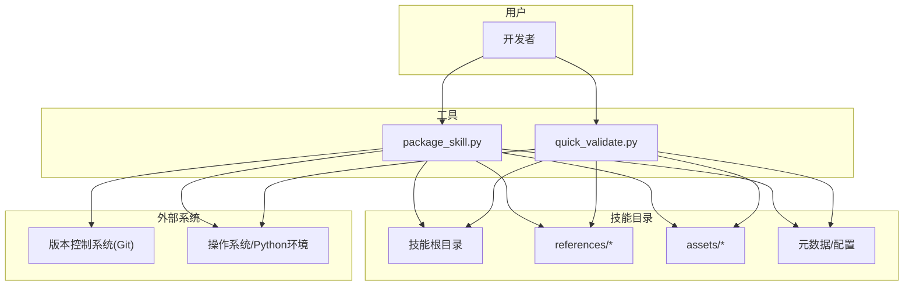
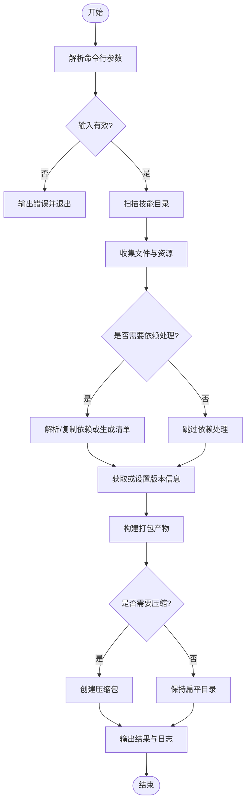
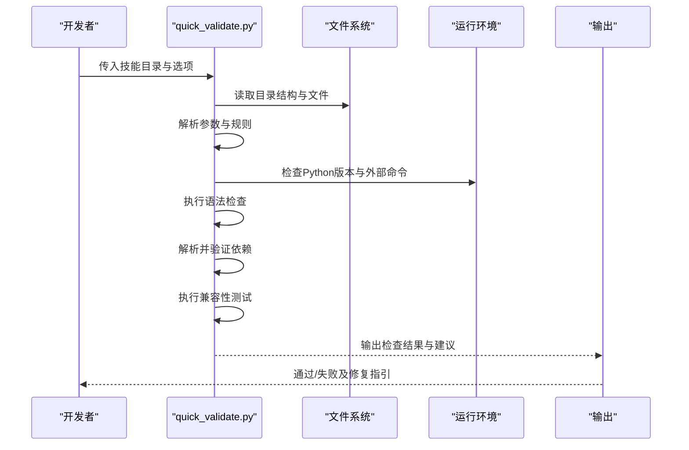
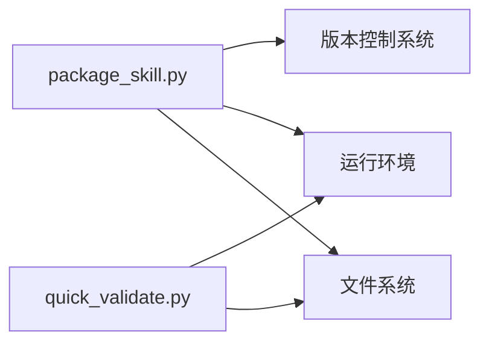

# 开发工具使用

<cite>
**本文引用的文件**   
- [package_skill.py](file://backend/skills/public/skill-creator/scripts/package_skill.py)
- [quick_validate.py](file://backend/skills/public/skill-creator/scripts/quick_validate.py)
- [init_skill.py](file://backend/skills/public/skill-creator/scripts/init_skill.py)
- [SKILL.md](file://backend/skills/public/skill-creator/SKILL.md)
- [LICENSE.txt](file://backend/skills/public/skill-creator/LICENSE.txt)
- [output-patterns.md](file://backend/skills/public/skill-creator/references/output-patterns.md)
- [workflows.md](file://backend/skills/public/skill-creator/references/workflows.md)
</cite>

## 目录
1. [简介](#简介)
2. [项目结构](#项目结构)
3. [核心组件](#核心组件)
4. [架构总览](#架构总览)
5. [详细组件分析](#详细组件分析)
6. [依赖分析](#依赖分析)
7. [性能考虑](#性能考虑)
8. [故障排除指南](#故障排除指南)
9. [结论](#结论)
10. [附录](#附录)

## 简介
本文件面向技能开发者，系统化说明“技能开发工具”的使用方法，重点覆盖以下脚本与参考文档：
- package_skill.py：用于将技能打包为可分发制品，支持打包选项、依赖管理与版本控制集成。
- quick_validate.py：用于快速验证技能的语法、依赖与兼容性，帮助在提交前发现潜在问题。
- init_skill.py：用于初始化新技能骨架（可选）。
- references 下的输出模式与工作流参考文档，辅助规范输出格式与协作流程。

目标读者包括初次接触技能开发的工程师、希望提升打包与验证效率的资深开发者，以及需要统一团队规范的负责人。

## 项目结构
与技能开发工具直接相关的目录与文件如下：
- backend/skills/public/skill-creator/scripts：包含打包与验证脚本
- backend/skills/public/skill-creator/references：包含输出模式与工作流参考
- backend/skills/public/skill-creator：包含许可证与技能说明

图表来源
- [package_skill.py](file://backend/skills/public/skill-creator/scripts/package_skill.py)
- [quick_validate.py](file://backend/skills/public/skill-creator/scripts/quick_validate.py)
- [init_skill.py](file://backend/skills/public/skill-creator/scripts/init_skill.py)
- [output-patterns.md](file://backend/skills/public/skill-creator/references/output-patterns.md)
- [workflows.md](file://backend/skills/public/skill-creator/references/workflows.md)

章节来源
- [SKILL.md](file://backend/skills/public/skill-creator/SKILL.md)
- [LICENSE.txt](file://backend/skills/public/skill-creator/LICENSE.txt)

## 核心组件
本节聚焦两个关键脚本的功能概览与典型用法。为避免泄露实现细节，本节仅描述能力边界与输入输出约定，具体参数与行为以各脚本自身帮助信息为准。

- package_skill.py
  - 功能：将技能目录打包为可分发的制品；支持选择是否包含依赖清单、资源文件、引用文档等；可与版本控制系统集成，生成或更新版本元数据。
  - 典型输入：技能根目录路径、输出目录、打包开关（如是否包含依赖、是否压缩）、版本来源（如 Git 标签或手动指定）。
  - 典型输出：打包产物（例如压缩包或目录），以及可选的版本信息与校验结果。
  - 适用场景：发布前构建、CI/CD 流水线中的制品生成、本地调试时的快速打包。

- quick_validate.py
  - 功能：对技能进行快速检查，包括语法检查、依赖解析与可用性验证、基础兼容性测试（如 Python 版本、必要命令是否存在）。
  - 典型输入：待验证的技能目录路径、严格模式开关、忽略规则列表。
  - 典型输出：检查结果摘要（通过/失败）、错误与警告明细、修复建议。
  - 适用场景：提交前自检、IDE 集成钩子、CI 预检阶段。

章节来源
- [package_skill.py](file://backend/skills/public/skill-creator/scripts/package_skill.py)
- [quick_validate.py](file://backend/skills/public/skill-creator/scripts/quick_validate.py)

## 架构总览
从调用关系看，两个脚本均围绕“技能目录”这一核心概念工作：读取目录结构、解析配置与依赖、执行相应动作（打包或验证），并输出结果。

图表来源
- [package_skill.py](file://backend/skills/public/skill-creator/scripts/package_skill.py)
- [quick_validate.py](file://backend/skills/public/skill-creator/scripts/quick_validate.py)

## 详细组件分析

### package_skill.py 深度解析
- 职责边界
  - 扫描技能目录，收集需纳入制品的文件与资源。
  - 根据选项决定是否包含依赖清单、第三方库、引用文档与资产。
  - 与版本控制系统交互，获取或写入版本信息。
  - 生成打包产物，并提供校验与摘要。
- 关键流程
  - 参数解析与校验
  - 目录扫描与过滤
  - 依赖处理（解析、复制、清单生成）
  - 版本信息注入（来自 Git 或手动指定）
  - 产物构建与归档
  - 结果输出与日志记录
- 常见选项（以脚本帮助为准）
  - 输入路径：技能根目录
  - 输出路径：打包产物存放位置
  - 包含依赖：是否复制依赖或仅生成清单
  - 包含资源：是否包含 assets 与 references
  - 版本来源：Git 标签/分支/手动版本号
  - 压缩：是否生成压缩包
- 与版本控制的集成
  - 自动读取 Git 标签或提交哈希作为版本标识
  - 可在 CI 中强制要求存在特定标签或分支策略
- 最佳实践
  - 在提交前运行快速验证，确保依赖可用且语法正确
  - 在 CI 中固定 Python 环境与依赖源，保证可重复构建
  - 使用语义化版本号，结合 Git 标签管理发布

图表来源
- [package_skill.py](file://backend/skills/public/skill-creator/scripts/package_skill.py)

章节来源
- [package_skill.py](file://backend/skills/public/skill-creator/scripts/package_skill.py)

### quick_validate.py 深度解析
- 职责边界
  - 语法检查：检测脚本与配置文件语法是否正确。
  - 依赖验证：确认必要命令与运行时依赖可用。
  - 兼容性测试：检查 Python 版本、平台差异、环境变量等。
- 关键流程
  - 参数解析与校验
  - 目录定位与结构检查
  - 语法检查（按文件类型选择检查器）
  - 依赖解析与可用性验证
  - 兼容性测试（解释器版本、外部命令）
  - 汇总结果与输出建议
- 常见选项（以脚本帮助为准）
  - 输入路径：待验证的技能目录
  - 严格模式：是否将警告视为失败
  - 忽略规则：跳过某些检查项
  - 输出格式：文本/结构化（便于 CI 解析）
- 与 CI 的集成
  - 作为预提交钩子或 CI 的第一步，快速阻断不合格变更
  - 结合缓存机制加速依赖检查

图表来源
- [quick_validate.py](file://backend/skills/public/skill-creator/scripts/quick_validate.py)

章节来源
- [quick_validate.py](file://backend/skills/public/skill-creator/scripts/quick_validate.py)

### init_skill.py 简要说明
- 作用：快速生成新技能的基础目录结构与示例文件，便于团队协作与标准化。
- 典型用法：指定目标目录后自动生成模板文件与占位内容。
- 建议：在团队内统一模板，减少重复劳动与风格差异。

章节来源
- [init_skill.py](file://backend/skills/public/skill-creator/scripts/init_skill.py)

### 参考文档与规范
- output-patterns.md：定义技能输出的模式与字段约定，有助于下游消费方稳定解析。
- workflows.md：提供协作工作流建议，包括分支策略、提交流程与发布节奏。

章节来源
- [output-patterns.md](file://backend/skills/public/skill-creator/references/output-patterns.md)
- [workflows.md](file://backend/skills/public/skill-creator/references/workflows.md)

## 依赖分析
- 内部依赖
  - package_skill.py 与 quick_validate.py 均围绕“技能目录”这一抽象进行工作，共享目录扫描、文件过滤与结果输出等通用逻辑。
- 外部依赖
  - 版本控制系统（如 Git）：用于获取版本信息或触发基于标签的构建。
  - 运行环境（Python 解释器、系统命令）：用于语法检查与依赖可用性验证。
- 耦合与内聚
  - 两个脚本各自职责清晰，耦合度低；可通过统一的 CLI 约定与输出格式提高互操作性。
- 潜在风险
  - 若依赖解析过于宽松，可能导致制品在不同环境中不可用；建议在 CI 中固定环境与依赖源。
  - 若版本信息来源不稳定，可能影响制品追溯性；建议强制使用 Git 标签作为唯一版本来源。

图表来源
- [package_skill.py](file://backend/skills/public/skill-creator/scripts/package_skill.py)
- [quick_validate.py](file://backend/skills/public/skill-creator/scripts/quick_validate.py)

章节来源
- [package_skill.py](file://backend/skills/public/skill-creator/scripts/package_skill.py)
- [quick_validate.py](file://backend/skills/public/skill-creator/scripts/quick_validate.py)

## 性能考虑
- 并行与增量
  - 对于大型技能目录，建议启用增量扫描与缓存，避免重复解析未变更文件。
- 依赖处理
  - 仅在必要时复制依赖，优先采用依赖清单方式，降低制品体积与构建时间。
- I/O 优化
  - 批量读取与写入，减少频繁磁盘访问；在 CI 中使用持久化缓存目录。
- 内存占用
  - 对超大目录采用流式处理，避免一次性加载全部文件到内存。

[本节为通用指导，不直接分析具体文件]

## 故障排除指南
- 常见问题与诊断
  - 参数错误：检查传入路径是否存在、权限是否足够、选项是否符合预期。
  - 依赖缺失：确认 Python 版本与外部命令可用；在 CI 中固定镜像与环境。
  - 版本信息异常：检查 Git 仓库状态、标签是否存在、分支策略是否符合要求。
  - 打包产物不完整：核对过滤规则与包含选项，确保必要文件未被误排除。
- 日志分析方法
  - 开启详细日志输出，关注关键步骤的耗时与错误堆栈。
  - 将日志与制品关联，便于回溯问题。
- 性能分析工具
  - 使用系统级工具（如 perf、time）评估脚本整体耗时。
  - 针对 I/O 密集环节，观察磁盘读写与缓存命中情况。
- 复现与回归
  - 在最小可复现场景下重现问题，逐步缩小范围。
  - 将修复方案加入自动化检查，防止回归。

章节来源
- [package_skill.py](file://backend/skills/public/skill-creator/scripts/package_skill.py)
- [quick_validate.py](file://backend/skills/public/skill-creator/scripts/quick_validate.py)

## 结论
通过 package_skill.py 与 quick_validate.py 的组合，开发者可以在本地与 CI 中高效完成技能打包与质量门禁。配合版本控制与参考文档，能够显著提升团队协作效率与制品稳定性。建议将快速验证纳入提交流程，并在 CI 中固化构建与发布步骤，形成闭环。

[本节为总结性内容，不直接分析具体文件]

## 附录
- 许可证与使用说明请参考 LICENSE.txt 与 SKILL.md。
- 输出模式与工作流建议请参考 references 下的文档。

章节来源
- [LICENSE.txt](file://backend/skills/public/skill-creator/LICENSE.txt)
- [SKILL.md](file://backend/skills/public/skill-creator/SKILL.md)
- [output-patterns.md](file://backend/skills/public/skill-creator/references/output-patterns.md)
- [workflows.md](file://backend/skills/public/skill-creator/references/workflows.md)