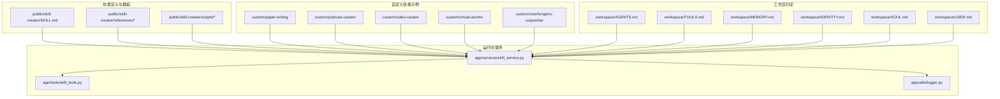
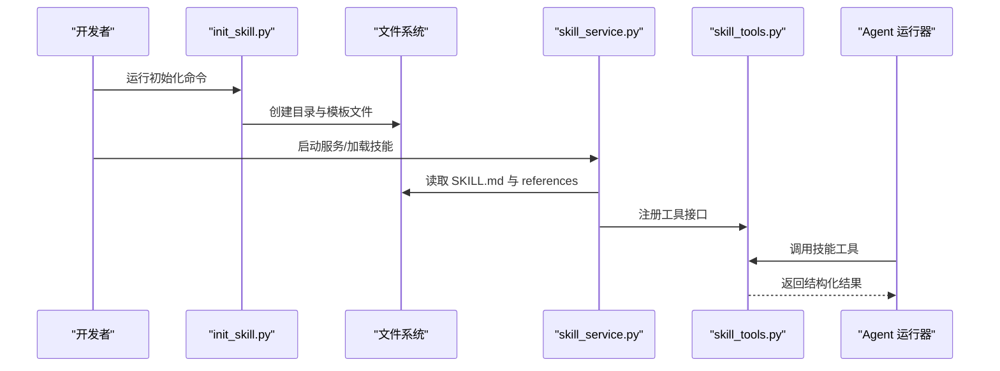
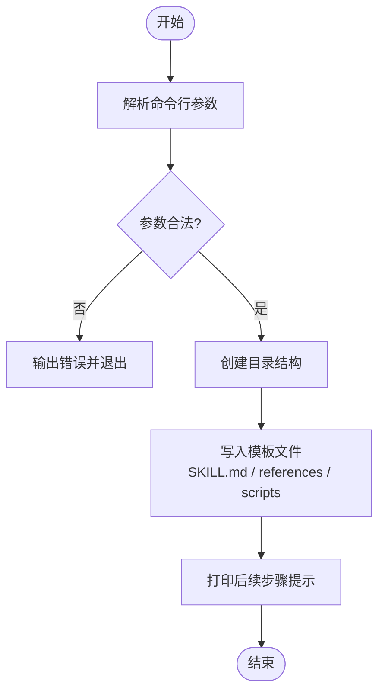
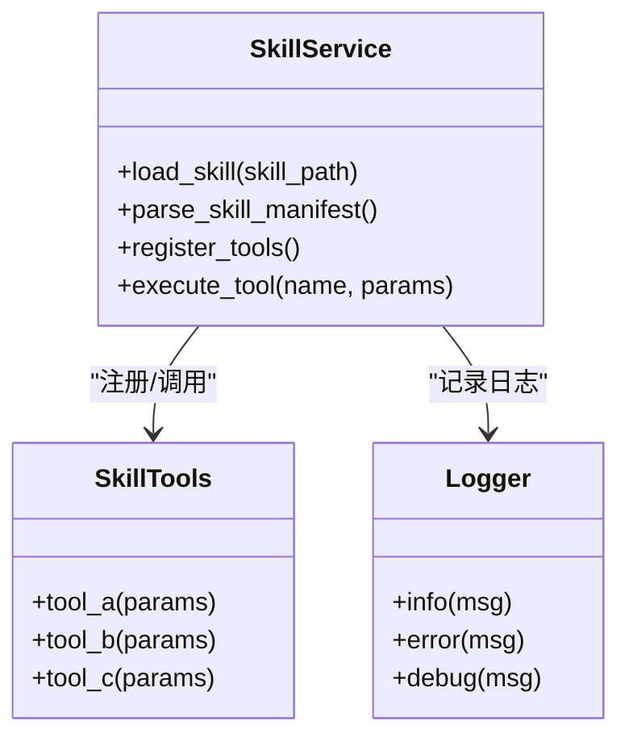
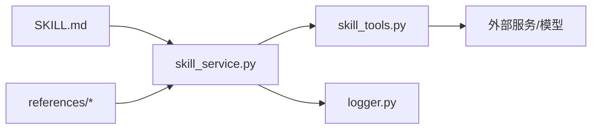

# 技能开发指南

<cite>
**本文引用的文件**   
- [backend/skills/public/skill-creator/SKILL.md](file://backend/skills/public/skill-creator/SKILL.md)
- [backend/skills/public/skill-creator/scripts/init_skill.py](file://backend/skills/public/skill-creator/scripts/init_skill.py)
- [backend/skills/public/skill-creator/scripts/package_skill.py](file://backend/skills/public/skill-creator/scripts/package_skill.py)
- [backend/skills/public/skill-creator/scripts/quick_validate.py](file://backend/skills/public/skill-creator/scripts/quick_validate.py)
- [backend/skills/public/skill-creator/references/output-patterns.md](file://backend/skills/public/skill-creator/references/output-patterns.md)
- [backend/skills/public/skill-creator/references/workflows.md](file://backend/skills/public/skill-creator/references/workflows.md)
- [backend/app/services/skill_service.py](file://backend/app/services/skill_service.py)
- [backend/app/tools/skill_tools.py](file://backend/app/tools/skill_tools.py)
- [backend/app/utils/logger.py](file://backend/app/utils/logger.py)
- [backend/workspace/TOOLS.md](file://backend/workspace/TOOLS.md)
- [backend/workspace/AGENTS.md](file://backend/workspace/AGENTS.md)
- [backend/workspace/MEMORY.md](file://backend/workspace/MEMORY.md)
- [backend/workspace/IDENTITY.md](file://backend/workspace/IDENTITY.md)
- [backend/workspace/SOUL.md](file://backend/workspace/SOUL.md)
- [backend/workspace/USER.md](file://backend/workspace/USER.md)
- [backend/FRAMEWORK.md](file://backend/FRAMEWORK.md)
</cite>

## 目录
1. [简介](#简介)
2. [项目结构](#项目结构)
3. [核心组件](#核心组件)
4. [架构总览](#架构总览)
5. [详细组件分析](#详细组件分析)
6. [依赖分析](#依赖分析)
7. [性能考虑](#性能考虑)
8. [故障排查指南](#故障排查指南)
9. [结论](#结论)
10. [附录](#附录)

## 简介
本指南面向希望为系统扩展“技能”的开发者，系统性说明技能的基本概念、SKILL.md 文件格式规范、脚本与资源组织方式，以及使用 init_skill.py 初始化新技能的完整流程。文档还涵盖 Python 脚本编写规范、错误处理机制、日志记录最佳实践，并提供常见业务逻辑与多步骤工作流的实现示例路径，帮助快速落地高质量技能。

## 项目结构
技能相关代码主要位于 backend/skills 与 backend/app 下：
- 公共技能模板与工具：backend/skills/public/skill-creator（包含 SKILL.md、参考文档与脚本）
- 自定义技能示例：backend/skills/custom（如论文写作、播客创作、视频创作、虚拟主播等）
- 运行时服务与工具：backend/app/services/skill_service.py、backend/app/tools/skill_tools.py
- 日志与框架约定：backend/app/utils/logger.py、backend/FRAMEWORK.md、backend/workspace/*.md

图表来源
- [backend/skills/public/skill-creator/SKILL.md](file://backend/skills/public/skill-creator/SKILL.md)
- [backend/skills/public/skill-creator/references/output-patterns.md](file://backend/skills/public/skill-creator/references/output-patterns.md)
- [backend/skills/public/skill-creator/references/workflows.md](file://backend/skills/public/skill-creator/references/workflows.md)
- [backend/skills/public/skill-creator/scripts/init_skill.py](file://backend/skills/public/skill-creator/scripts/init_skill.py)
- [backend/skills/public/skill-creator/scripts/package_skill.py](file://backend/skills/public/skill-creator/scripts/package_skill.py)
- [backend/skills/public/skill-creator/scripts/quick_validate.py](file://backend/skills/public/skill-creator/scripts/quick_validate.py)
- [backend/app/services/skill_service.py](file://backend/app/services/skill_service.py)
- [backend/app/tools/skill_tools.py](file://backend/app/tools/skill_tools.py)
- [backend/app/utils/logger.py](file://backend/app/utils/logger.py)
- [backend/workspace/AGENTS.md](file://backend/workspace/AGENTS.md)
- [backend/workspace/TOOLS.md](file://backend/workspace/TOOLS.md)
- [backend/workspace/MEMORY.md](file://backend/workspace/MEMORY.md)
- [backend/workspace/IDENTITY.md](file://backend/workspace/IDENTITY.md)
- [backend/workspace/SOUL.md](file://backend/workspace/SOUL.md)
- [backend/workspace/USER.md](file://backend/workspace/USER.md)

章节来源
- [backend/skills/public/skill-creator/SKILL.md](file://backend/skills/public/skill-creator/SKILL.md)
- [backend/skills/public/skill-creator/references/output-patterns.md](file://backend/skills/public/skill-creator/references/output-patterns.md)
- [backend/skills/public/skill-creator/references/workflows.md](file://backend/skills/public/skill-creator/references/workflows.md)
- [backend/skills/public/skill-creator/scripts/init_skill.py](file://backend/skills/public/skill-creator/scripts/init_skill.py)
- [backend/skills/public/skill-creator/scripts/package_skill.py](file://backend/skills/public/skill-creator/scripts/package_skill.py)
- [backend/skills/public/skill-creator/scripts/quick_validate.py](file://backend/skills/public/skill-creator/scripts/quick_validate.py)
- [backend/app/services/skill_service.py](file://backend/app/services/skill_service.py)
- [backend/app/tools/skill_tools.py](file://backend/app/tools/skill_tools.py)
- [backend/app/utils/logger.py](file://backend/app/utils/logger.py)
- [backend/workspace/AGENTS.md](file://backend/workspace/AGENTS.md)
- [backend/workspace/TOOLS.md](file://backend/workspace/TOOLS.md)
- [backend/workspace/MEMORY.md](file://backend/workspace/MEMORY.md)
- [backend/workspace/IDENTITY.md](file://backend/workspace/IDENTITY.md)
- [backend/workspace/SOUL.md](file://backend/workspace/SOUL.md)
- [backend/workspace/USER.md](file://backend/workspace/USER.md)

## 核心组件
- 技能描述与规范：SKILL.md 定义了技能的元信息、输入输出模式、工作流与约束，是技能被识别与编排的核心契约。
- 参考文档：references 目录提供输出模式与工作流参考，指导技能产出格式与流程设计。
- 初始化与打包脚本：init_skill.py 用于从零生成标准技能骨架；package_skill.py 用于打包发布；quick_validate.py 用于快速校验。
- 运行时服务：skill_service.py 负责加载、解析与执行技能；skill_tools.py 暴露可被 Agent 调用的工具接口。
- 日志与框架约定：logger.py 统一日志配置；FRAMEWORK.md 与 workspace/*.md 定义 Agent 行为、工具与记忆等约定。

章节来源
- [backend/skills/public/skill-creator/SKILL.md](file://backend/skills/public/skill-creator/SKILL.md)
- [backend/skills/public/skill-creator/references/output-patterns.md](file://backend/skills/public/skill-creator/references/output-patterns.md)
- [backend/skills/public/skill-creator/references/workflows.md](file://backend/skills/public/skill-creator/references/workflows.md)
- [backend/skills/public/skill-creator/scripts/init_skill.py](file://backend/skills/public/skill-creator/scripts/init_skill.py)
- [backend/skills/public/skill-creator/scripts/package_skill.py](file://backend/skills/public/skill-creator/scripts/package_skill.py)
- [backend/skills/public/skill-creator/scripts/quick_validate.py](file://backend/skills/public/skill-creator/scripts/quick_validate.py)
- [backend/app/services/skill_service.py](file://backend/app/services/skill_service.py)
- [backend/app/tools/skill_tools.py](file://backend/app/tools/skill_tools.py)
- [backend/app/utils/logger.py](file://backend/app/utils/logger.py)
- [backend/FRAMEWORK.md](file://backend/FRAMEWORK.md)
- [backend/workspace/AGENTS.md](file://backend/workspace/AGENTS.md)
- [backend/workspace/TOOLS.md](file://backend/workspace/TOOLS.md)
- [backend/workspace/MEMORY.md](file://backend/workspace/MEMORY.md)
- [backend/workspace/IDENTITY.md](file://backend/workspace/IDENTITY.md)
- [backend/workspace/SOUL.md](file://backend/workspace/SOUL.md)
- [backend/workspace/USER.md](file://backend/workspace/USER.md)

## 架构总览
技能从“声明式描述”到“可执行工具”的关键路径如下：
- 开发者基于 SKILL.md 与 references 编写技能
- 使用 init_skill.py 生成标准目录与模板
- 通过 skill_service.py 在运行时加载并解析 SKILL.md
- 将技能能力注册为工具，供 Agent 调用
- 使用 quick_validate.py 进行本地快速校验，package_skill.py 打包分发

图表来源
- [backend/skills/public/skill-creator/scripts/init_skill.py](file://backend/skills/public/skill-creator/scripts/init_skill.py)
- [backend/skills/public/skill-creator/SKILL.md](file://backend/skills/public/skill-creator/SKILL.md)
- [backend/skills/public/skill-creator/references/output-patterns.md](file://backend/skills/public/skill-creator/references/output-patterns.md)
- [backend/skills/public/skill-creator/references/workflows.md](file://backend/skills/public/skill-creator/references/workflows.md)
- [backend/app/services/skill_service.py](file://backend/app/services/skill_service.py)
- [backend/app/tools/skill_tools.py](file://backend/app/tools/skill_tools.py)

## 详细组件分析

### SKILL.md 文件格式规范
- 作用：作为技能的“契约”，描述名称、版本、作者、描述、输入参数、输出模式、依赖、工作流与注意事项。
- 建议字段：
  - 基本信息：名称、版本、作者、许可证、摘要
  - 输入：参数名、类型、是否必填、默认值、约束
  - 输出：结构化模式（JSON Schema 或示例）、字段说明
  - 工作流：步骤顺序、条件分支、失败重试策略
  - 资源：assets、references 目录约定
  - 安全与合规：权限、敏感数据处理、外部 API 限制
- 参考：output-patterns.md 与 workflows.md 提供输出模式与工作流的最佳实践。

章节来源
- [backend/skills/public/skill-creator/SKILL.md](file://backend/skills/public/skill-creator/SKILL.md)
- [backend/skills/public/skill-creator/references/output-patterns.md](file://backend/skills/public/skill-creator/references/output-patterns.md)
- [backend/skills/public/skill-creator/references/workflows.md](file://backend/skills/public/skill-creator/references/workflows.md)

### 脚本结构与资源组织
- scripts：包含 init_skill.py、package_skill.py、quick_validate.py，分别负责初始化、打包与快速校验。
- references：存放输出模式与工作流参考文档，指导技能设计与一致性。
- assets：存放静态资源（模板、样式、素材），由技能在执行时按需引用。
- 自定义技能示例：custom 目录下各子目录展示不同领域技能的典型组织方式。

章节来源
- [backend/skills/public/skill-creator/scripts/init_skill.py](file://backend/skills/public/skill-creator/scripts/init_skill.py)
- [backend/skills/public/skill-creator/scripts/package_skill.py](file://backend/skills/public/skill-creator/scripts/package_skill.py)
- [backend/skills/public/skill-creator/scripts/quick_validate.py](file://backend/skills/public/skill-creator/scripts/quick_validate.py)
- [backend/skills/public/skill-creator/references/output-patterns.md](file://backend/skills/public/skill-creator/references/output-patterns.md)
- [backend/skills/public/skill-creator/references/workflows.md](file://backend/skills/public/skill-creator/references/workflows.md)

### 使用 init_skill.py 初始化新技能
- 目标：一键生成标准技能骨架，包括 SKILL.md、scripts、references、assets 等目录与基础模板。
- 典型用法：
  - 指定技能名称、描述、作者、许可证等参数
  - 选择输出目录（默认在当前工作区）
  - 生成后进入目录补充具体实现与参考文档
- 关键行为：
  - 校验参数合法性
  - 创建目录树与模板文件
  - 写入默认 SKILL.md 与 references 占位内容
  - 打印下一步操作指引

图表来源
- [backend/skills/public/skill-creator/scripts/init_skill.py](file://backend/skills/public/skill-creator/scripts/init_skill.py)

章节来源
- [backend/skills/public/skill-creator/scripts/init_skill.py](file://backend/skills/public/skill-creator/scripts/init_skill.py)

### 运行时加载与工具注册
- skill_service.py：负责发现、加载与解析 SKILL.md，构建技能上下文，并将能力注册为工具。
- skill_tools.py：暴露工具函数，供 Agent 以统一接口调用，内部可能调用外部模型或服务。
- 工作区约定：AGENTS.md、TOOLS.md、MEMORY.md、IDENTITY.md、SOUL.md、USER.md 共同定义 Agent 的行为边界与上下文。

图表来源
- [backend/app/services/skill_service.py](file://backend/app/services/skill_service.py)
- [backend/app/tools/skill_tools.py](file://backend/app/tools/skill_tools.py)
- [backend/app/utils/logger.py](file://backend/app/utils/logger.py)

章节来源
- [backend/app/services/skill_service.py](file://backend/app/services/skill_service.py)
- [backend/app/tools/skill_tools.py](file://backend/app/tools/skill_tools.py)
- [backend/app/utils/logger.py](file://backend/app/utils/logger.py)
- [backend/workspace/AGENTS.md](file://backend/workspace/AGENTS.md)
- [backend/workspace/TOOLS.md](file://backend/workspace/TOOLS.md)
- [backend/workspace/MEMORY.md](file://backend/workspace/MEMORY.md)
- [backend/workspace/IDENTITY.md](file://backend/workspace/IDENTITY.md)
- [backend/workspace/SOUL.md](file://backend/workspace/SOUL.md)
- [backend/workspace/USER.md](file://backend/workspace/USER.md)

### 快速校验与打包
- quick_validate.py：对 SKILL.md 与 references 进行基本语法与完整性检查，便于本地迭代。
- package_skill.py：将技能及其资源打包为可分发的制品，便于部署与共享。

章节来源
- [backend/skills/public/skill-creator/scripts/quick_validate.py](file://backend/skills/public/skill-creator/scripts/quick_validate.py)
- [backend/skills/public/skill-creator/scripts/package_skill.py](file://backend/skills/public/skill-creator/scripts/package_skill.py)

### 开发流程与实践规范
- 需求分析：明确输入/输出、边界条件、依赖服务与合规要求。
- 设计 SKILL.md：定义参数、输出模式、工作流与注意事项。
- 实现脚本：按模块拆分，遵循单一职责；对外部调用增加超时与重试。
- 错误处理：区分可恢复与不可恢复错误，记录上下文，避免泄露敏感信息。
- 日志记录：使用 logger.py 统一输出，包含请求 ID、耗时、关键中间状态。
- 测试与校验：使用 quick_validate.py 做静态检查，结合单元测试覆盖关键路径。
- 打包与发布：使用 package_skill.py 生成制品，附带 README 与变更日志。

章节来源
- [backend/skills/public/skill-creator/references/output-patterns.md](file://backend/skills/public/skill-creator/references/output-patterns.md)
- [backend/skills/public/skill-creator/references/workflows.md](file://backend/skills/public/skill-creator/references/workflows.md)
- [backend/app/utils/logger.py](file://backend/app/utils/logger.py)
- [backend/skills/public/skill-creator/scripts/quick_validate.py](file://backend/skills/public/skill-creator/scripts/quick_validate.py)
- [backend/skills/public/skill-creator/scripts/package_skill.py](file://backend/skills/public/skill-creator/scripts/package_skill.py)

### 实际开发示例（路径指引）
- 多步骤工作流：参考 workflows.md 的步骤编排与错误回退策略，在 SKILL.md 中定义阶段化流程。
- 结构化输出：参考 output-patterns.md 的输出模式，确保下游消费稳定。
- 工具组合：在 skill_tools.py 中组合多个小工具完成复杂任务，并通过 skill_service.py 注册为统一入口。
- 自定义技能参考：查看 custom 下的示例目录，了解不同领域的资源组织与脚本结构。

章节来源
- [backend/skills/public/skill-creator/references/workflows.md](file://backend/skills/public/skill-creator/references/workflows.md)
- [backend/skills/public/skill-creator/references/output-patterns.md](file://backend/skills/public/skill-creator/references/output-patterns.md)
- [backend/app/tools/skill_tools.py](file://backend/app/tools/skill_tools.py)
- [backend/app/services/skill_service.py](file://backend/app/services/skill_service.py)

## 依赖分析
- 内部依赖：
  - skill_service.py 依赖 skill_tools.py 提供的工具能力
  - 所有模块统一使用 logger.py 进行日志记录
  - SKILL.md 与 references 作为数据驱动的配置与参考
- 外部依赖：
  - 外部模型与服务调用（由具体工具实现决定）
  - 文件系统访问（读取 SKILL.md、references、assets）

图表来源
- [backend/skills/public/skill-creator/SKILL.md](file://backend/skills/public/skill-creator/SKILL.md)
- [backend/skills/public/skill-creator/references/output-patterns.md](file://backend/skills/public/skill-creator/references/output-patterns.md)
- [backend/skills/public/skill-creator/references/workflows.md](file://backend/skills/public/skill-creator/references/workflows.md)
- [backend/app/services/skill_service.py](file://backend/app/services/skill_service.py)
- [backend/app/tools/skill_tools.py](file://backend/app/tools/skill_tools.py)
- [backend/app/utils/logger.py](file://backend/app/utils/logger.py)

章节来源
- [backend/app/services/skill_service.py](file://backend/app/services/skill_service.py)
- [backend/app/tools/skill_tools.py](file://backend/app/tools/skill_tools.py)
- [backend/app/utils/logger.py](file://backend/app/utils/logger.py)

## 性能考虑
- 减少重复 IO：批量读取 SKILL.md 与 references，缓存解析结果。
- 异步与并发：对外部服务调用采用异步与连接池，合理设置超时与重试。
- 输出压缩：大体积产物按需压缩或分块传输。
- 资源隔离：每个技能进程/线程隔离，避免相互影响。
- 日志级别控制：生产环境降低冗余日志，仅保留必要指标与异常堆栈。

[本节为通用指导，不直接分析具体文件]

## 故障排查指南
- 常见问题定位：
  - SKILL.md 解析失败：检查字段完整性与格式是否符合 references 约定
  - 工具调用异常：查看 logger.py 输出的错误上下文与请求 ID
  - 资源缺失：确认 assets 与 references 路径正确且可读
- 调试建议：
  - 使用 quick_validate.py 进行静态检查
  - 开启 debug 日志，捕获关键中间状态
  - 最小化复现用例，逐步缩小问题范围

章节来源
- [backend/skills/public/skill-creator/scripts/quick_validate.py](file://backend/skills/public/skill-creator/scripts/quick_validate.py)
- [backend/app/utils/logger.py](file://backend/app/utils/logger.py)

## 结论
通过标准化的 SKILL.md 描述、清晰的脚本与资源组织、完善的初始化与校验工具链，以及统一的运行时服务与日志体系，团队可以高效地开发、集成与维护技能。建议在新技能开发中严格遵循本指南的流程与规范，持续完善 references 与示例，提升整体质量与可维护性。

[本节为总结性内容，不直接分析具体文件]

## 附录
- 框架与工作区约定：
  - FRAMEWORK.md：系统框架与总体约定
  - AGENTS.md、TOOLS.md、MEMORY.md、IDENTITY.md、SOUL.md、USER.md：Agent 行为、工具与记忆等上下文定义

章节来源
- [backend/FRAMEWORK.md](file://backend/FRAMEWORK.md)
- [backend/workspace/AGENTS.md](file://backend/workspace/AGENTS.md)
- [backend/workspace/TOOLS.md](file://backend/workspace/TOOLS.md)
- [backend/workspace/MEMORY.md](file://backend/workspace/MEMORY.md)
- [backend/workspace/IDENTITY.md](file://backend/workspace/IDENTITY.md)
- [backend/workspace/SOUL.md](file://backend/workspace/SOUL.md)
- [backend/workspace/USER.md](file://backend/workspace/USER.md)