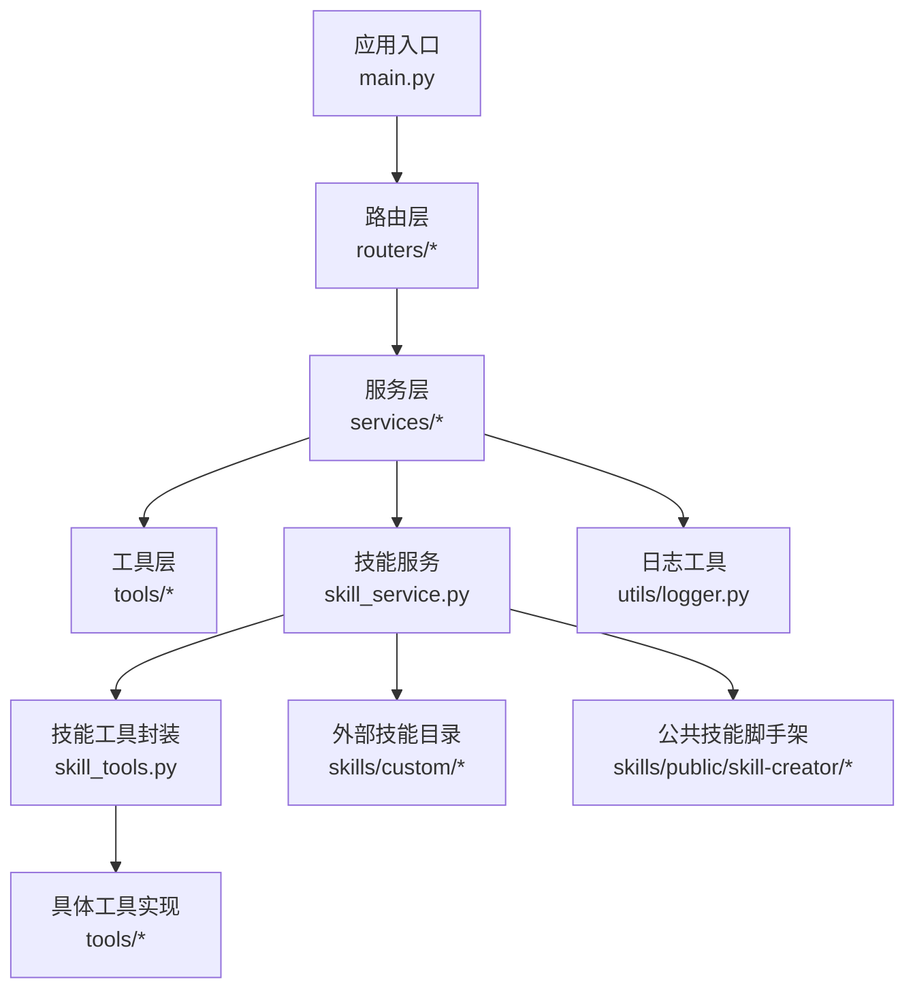
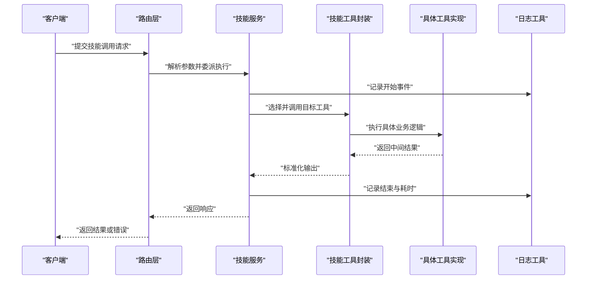
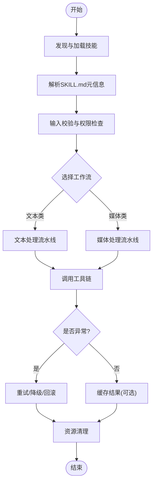
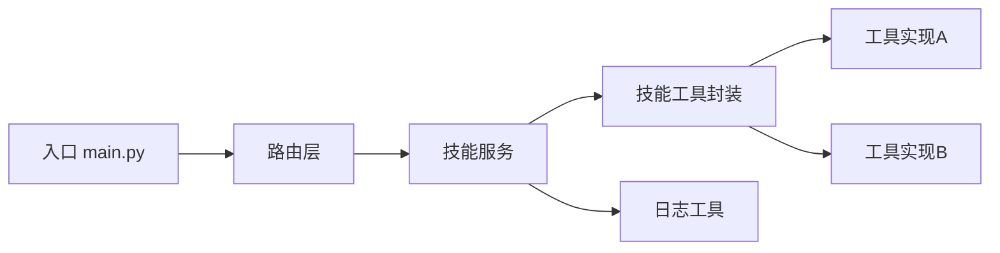

# 最佳实践与示例

<cite>
**本文引用的文件**   
- [backend/app/main.py](file://backend/app/main.py)
- [backend/app/services/skill_service.py](file://backend/app/services/skill_service.py)
- [backend/app/tools/skill_tools.py](file://backend/app/tools/skill_tools.py)
- [backend/app/utils/logger.py](file://backend/app/utils/logger.py)
- [backend/skills/custom/paper-writing/SKILL.md](file://backend/skills/custom/paper-writing/SKILL.md)
- [backend/skills/custom/video-creator/SKILL.md](file://backend/skills/custom/video-creator/SKILL.md)
- [backend/skills/custom/virtual-anchor/SKILL.md](file://backend/skills/custom/virtual-anchor/SKILL.md)
- [backend/skills/public/skill-creator/SKILL.md](file://backend/skills/public/skill-creator/SKILL.md)
- [backend/skills/public/skill-creator/scripts/init_skill.py](file://backend/skills/public/skill-creator/scripts/init_skill.py)
- [backend/skills/public/skill-creator/scripts/package_skill.py](file://backend/skills/public/skill-creator/scripts/package_skill.py)
- [backend/skills/public/skill-creator/scripts/quick_validate.py](file://backend/skills/public/skill-creator/scripts/quick_validate.py)
</cite>

## 目录
1. [简介](#简介)
2. [项目结构](#项目结构)
3. [核心组件](#核心组件)
4. [架构总览](#架构总览)
5. [详细组件分析](#详细组件分析)
6. [依赖分析](#依赖分析)
7. [性能考虑](#性能考虑)
8. [故障排查指南](#故障排查指南)
9. [结论](#结论)
10. [附录](#附录)

## 简介
本指南面向希望基于现有示例（论文写作、视频创作、虚拟主播等）开发高质量自定义技能的工程师。文档从系统架构、组件关系、数据流、处理逻辑、集成点、错误处理、性能与安全等维度，总结通用设计模式与开发技巧，并提供重构建议与可操作的最佳实践，帮助开发者构建可维护、可扩展、安全可靠的技能。

## 项目结构
后端采用模块化分层组织：入口服务、路由、服务层、工具层、工具库与日志；技能以“目录+元信息”的方式挂载，公共技能脚手架位于 public/skill-creator。

图示来源
- [backend/app/main.py](file://backend/app/main.py)
- [backend/app/services/skill_service.py](file://backend/app/services/skill_service.py)
- [backend/app/tools/skill_tools.py](file://backend/app/tools/skill_tools.py)
- [backend/app/utils/logger.py](file://backend/app/utils/logger.py)

章节来源
- [backend/app/main.py](file://backend/app/main.py)
- [backend/app/services/skill_service.py](file://backend/app/services/skill_service.py)
- [backend/app/tools/skill_tools.py](file://backend/app/tools/skill_tools.py)
- [backend/app/utils/logger.py](file://backend/app/utils/logger.py)

## 核心组件
- 应用入口与路由：负责请求接入、鉴权与参数校验，将调用委派给服务层。
- 技能服务：统一加载、解析与调度自定义技能，管理技能生命周期与上下文。
- 技能工具封装：对底层工具进行抽象与适配，提供统一的输入输出契约。
- 日志工具：集中记录结构化日志，便于追踪与排障。
- 技能定义与脚手架：通过 SKILL.md 描述能力边界、工作流与参考材料；提供初始化、打包与快速校验脚本。

章节来源
- [backend/app/services/skill_service.py](file://backend/app/services/skill_service.py)
- [backend/app/tools/skill_tools.py](file://backend/app/tools/skill_tools.py)
- [backend/app/utils/logger.py](file://backend/app/utils/logger.py)
- [backend/skills/public/skill-creator/SKILL.md](file://backend/skills/public/skill-creator/SKILL.md)
- [backend/skills/public/skill-creator/scripts/init_skill.py](file://backend/skills/public/skill-creator/scripts/init_skill.py)
- [backend/skills/public/skill-creator/scripts/package_skill.py](file://backend/skills/public/skill-creator/scripts/package_skill.py)
- [backend/skills/public/skill-creator/scripts/quick_validate.py](file://backend/skills/public/skill-creator/scripts/quick_validate.py)

## 架构总览
下图展示一次典型技能调用的端到端流程：前端发起请求，经路由进入服务层，由技能服务定位并执行对应技能，必要时调用工具层完成媒体或模型任务，最终返回结果。

图示来源
- [backend/app/services/skill_service.py](file://backend/app/services/skill_service.py)
- [backend/app/tools/skill_tools.py](file://backend/app/tools/skill_tools.py)
- [backend/app/utils/logger.py](file://backend/app/utils/logger.py)

## 详细组件分析

### 技能服务（Skill Service）
职责
- 发现与加载本地技能目录（custom/public），解析 SKILL.md 元信息。
- 根据请求上下文选择合适的工作流与工具组合。
- 管理执行上下文、资源清理与异常恢复。
- 与日志工具协作，输出结构化运行轨迹。

关键设计要点
- 插件化加载：按目录扫描与约定式命名，避免硬编码。
- 契约化接口：输入输出遵循统一的数据模型，便于测试与替换。
- 幂等与重试：对可重试的外部调用增加退避策略。
- 资源管理：显式释放临时文件、句柄与连接。

章节来源
- [backend/app/services/skill_service.py](file://backend/app/services/skill_service.py)

### 技能工具封装（Skill Tools）
职责
- 为不同领域工具（图像、视频、音频、3D、TTS、理解模型等）提供统一适配器。
- 规范化参数校验、错误码映射与返回值包装。
- 暴露稳定的函数签名，屏蔽底层差异。

关键设计要点
- 适配器模式：对外一致，对内可插拔。
- 失败降级：当上游不可用时返回友好错误与部分结果。
- 缓存键生成：基于输入指纹减少重复计算。

章节来源
- [backend/app/tools/skill_tools.py](file://backend/app/tools/skill_tools.py)

### 日志工具（Logger）
职责
- 提供结构化日志写入（JSON/行格式）。
- 支持分级控制、采样与脱敏。
- 在关键路径埋点，便于链路追踪。

关键设计要点
- 异步落盘：避免阻塞主流程。
- 敏感字段过滤：自动剔除密钥、令牌等。
- 统一上下文：携带请求ID、用户ID、技能ID等。

章节来源
- [backend/app/utils/logger.py](file://backend/app/utils/logger.py)

### 技能定义与脚手架
- SKILL.md：描述技能名称、版本、能力范围、输入输出、工作流、参考材料与注意事项。
- 初始化脚本：一键创建标准目录结构与模板文件。
- 打包脚本：将技能及其资源打包为可分发单元。
- 快速校验：检查 SKILL.md 语法、必填字段与引用完整性。

章节来源
- [backend/skills/public/skill-creator/SKILL.md](file://backend/skills/public/skill-creator/SKILL.md)
- [backend/skills/public/skill-creator/scripts/init_skill.py](file://backend/skills/public/skill-creator/scripts/init_skill.py)
- [backend/skills/public/skill-creator/scripts/package_skill.py](file://backend/skills/public/skill-creator/scripts/package_skill.py)
- [backend/skills/public/skill-creator/scripts/quick_validate.py](file://backend/skills/public/skill-creator/scripts/quick_validate.py)

### 示例技能分析

#### 论文写作（Paper Writing）
- 能力边界：文献检索提示、大纲生成、段落扩写、参考文献整理。
- 工作流：需求澄清→大纲→分节撰写→校对→导出。
- 参考材料：研究方法与写作技巧。

章节来源
- [backend/skills/custom/paper-writing/SKILL.md](file://backend/skills/custom/paper-writing/SKILL.md)

#### 视频创作（Video Creator）
- 能力边界：分镜脚本生成、素材拼接、转场与字幕合成。
- 工作流：创意构思→分镜→素材准备→剪辑→渲染。
- 参考材料：分镜格式规范。

章节来源
- [backend/skills/custom/video-creator/SKILL.md](file://backend/skills/custom/video-creator/SKILL.md)

#### 虚拟主播（Virtual Anchor）
- 能力边界：形象驱动、语音合成、唇形同步、直播推流。
- 工作流：人设配置→台词生成→语音合成→驱动渲染→输出。
- 参考材料：驱动参数与质量要求。

章节来源
- [backend/skills/custom/virtual-anchor/SKILL.md](file://backend/skills/custom/virtual-anchor/SKILL.md)

### 概念性总览
以下流程图概括了“自定义技能”的通用生命周期，适用于所有示例技能。

[此图为概念性流程，不直接映射到具体源码文件]

## 依赖分析
- 低耦合：路由仅依赖服务层；服务层通过工具封装间接依赖具体工具实现。
- 内聚性：每个技能目录自包含元信息与参考材料，便于独立演进。
- 外部依赖：日志、文件系统、网络与第三方模型/媒体工具。

图示来源
- [backend/app/main.py](file://backend/app/main.py)
- [backend/app/services/skill_service.py](file://backend/app/services/skill_service.py)
- [backend/app/tools/skill_tools.py](file://backend/app/tools/skill_tools.py)
- [backend/app/utils/logger.py](file://backend/app/utils/logger.py)

章节来源
- [backend/app/main.py](file://backend/app/main.py)
- [backend/app/services/skill_service.py](file://backend/app/services/skill_service.py)
- [backend/app/tools/skill_tools.py](file://backend/app/tools/skill_tools.py)
- [backend/app/utils/logger.py](file://backend/app/utils/logger.py)

## 性能考虑
- 异步处理
  - 使用异步I/O与协程并发处理长耗时任务（如模型推理、媒体转码）。
  - 对批量任务采用生产者-消费者队列，限制并发度以避免雪崩。
- 缓存策略
  - 对纯函数型工具（如文本改写、规则转换）引入结果缓存，键基于输入指纹。
  - 对媒体产物设置合理过期时间与空间回收策略。
- 内存管理
  - 大对象流式读写，避免一次性载入完整媒体文件。
  - 及时关闭文件句柄与网络连接，使用上下文管理器确保释放。
- 批处理与合并
  - 将多次小请求合并为批次，降低外部调用开销。
- 监控与指标
  - 记录P95/P99延迟、吞吐、错误率与资源占用，指导容量规划。

[本节为通用性能建议，不直接分析具体文件]

## 故障排查指南
- 日志定位
  - 通过请求ID关联全链路日志，确认异常发生阶段与上下文。
  - 关注“开始/结束/错误”三类事件的时间戳与耗时。
- 常见错误分类
  - 输入校验失败：参数缺失、类型不符、越界值。
  - 权限不足：未授权访问受限资源或功能。
  - 外部依赖异常：超时、限流、配额耗尽、证书问题。
  - 资源泄漏：未释放的文件句柄、连接池耗尽。
- 恢复机制
  - 指数退避重试：针对瞬时故障（网络抖动、限流）。
  - 降级策略：当上游不可用时返回基础结果或引导用户重试。
  - 事务性回滚：对多步骤任务，失败时撤销已完成的子步骤。
- 调试技巧
  - 开启更详细的日志级别与采样窗口。
  - 使用最小复现用例与固定种子，稳定复现问题。
  - 对关键路径添加断言与快照，辅助回归测试。

章节来源
- [backend/app/utils/logger.py](file://backend/app/utils/logger.py)
- [backend/app/services/skill_service.py](file://backend/app/services/skill_service.py)
- [backend/app/tools/skill_tools.py](file://backend/app/tools/skill_tools.py)

## 结论
通过插件化的技能加载、契约化的工具封装、结构化的日志与完善的错误恢复机制，可以构建出高可用、易扩展的自定义技能体系。结合异步处理、缓存与内存优化，以及严格的输入验证、权限控制与敏感信息保护，能够显著提升系统的稳定性与安全性。建议在新技能开发中复用公共脚手架与校验脚本，持续完善 SKILL.md 与工作流说明，保持代码与文档的一致性。

## 附录

### 自定义技能开发清单
- 明确能力边界与输入输出契约
- 编写清晰的 SKILL.md（名称、版本、工作流、参考材料）
- 实现工具适配器，统一错误码与返回值
- 加入输入校验与权限检查
- 实现重试与降级策略
- 完善日志埋点与指标上报
- 编写单元测试与端到端用例
- 使用脚手架脚本初始化、打包与校验

章节来源
- [backend/skills/public/skill-creator/SKILL.md](file://backend/skills/public/skill-creator/SKILL.md)
- [backend/skills/public/skill-creator/scripts/init_skill.py](file://backend/skills/public/skill-creator/scripts/init_skill.py)
- [backend/skills/public/skill-creator/scripts/package_skill.py](file://backend/skills/public/skill-creator/scripts/package_skill.py)
- [backend/skills/public/skill-creator/scripts/quick_validate.py](file://backend/skills/public/skill-creator/scripts/quick_validate.py)