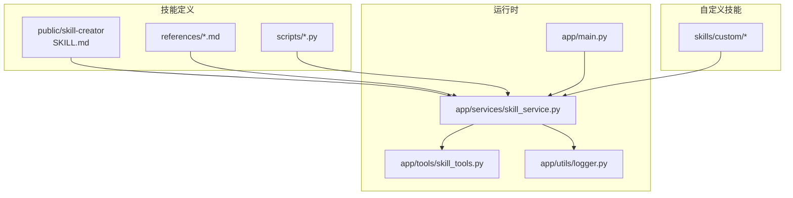
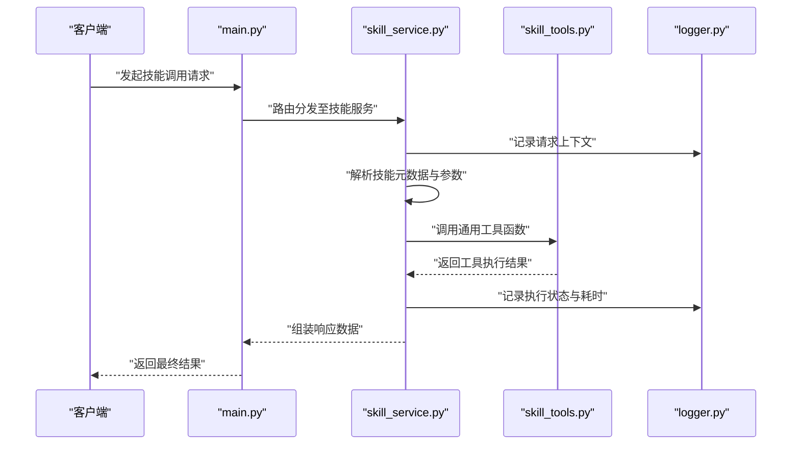
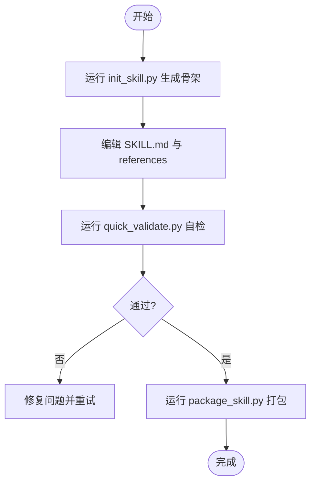
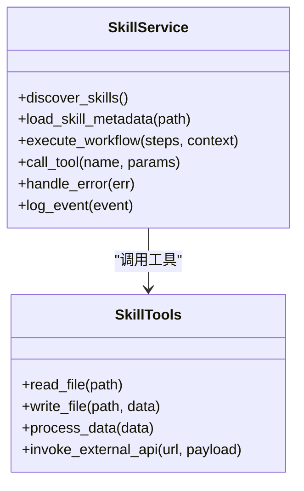
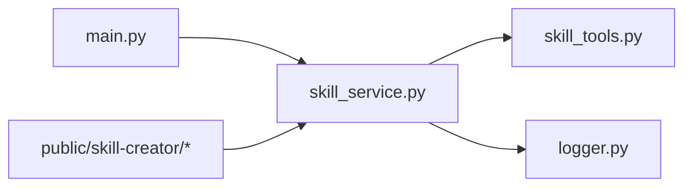

# 自定义技能开发

<cite>
**本文引用的文件**   
- [backend/skills/public/skill-creator/SKILL.md](file://backend/skills/public/skill-creator/SKILL.md)
- [backend/skills/public/skill-creator/scripts/init_skill.py](file://backend/skills/public/skill-creator/scripts/init_skill.py)
- [backend/skills/public/skill-creator/scripts/package_skill.py](file://backend/skills/public/skill-creator/scripts/package_skill.py)
- [backend/skills/public/skill-creator/scripts/quick_validate.py](file://backend/skills/public/skill-creator/scripts/quick_validate.py)
- [backend/skills/public/skill-creator/references/output-patterns.md](file://backend/skills/public/skill-creator/references/output-patterns.md)
- [backend/skills/public/skill-creator/references/workflows.md](file://backend/skills/public/skill-creator/references/workflows.md)
- [backend/app/services/skill_service.py](file://backend/app/services/skill_service.py)
- [backend/app/tools/skill_tools.py](file://backend/app/tools/skill_tools.py)
- [backend/app/utils/logger.py](file://backend/app/utils/logger.py)
- [backend/app/main.py](file://backend/app/main.py)
- [backend/start.sh](file://backend/start.sh)
- [backend/env.example](file://backend/env.example)
- [backend/requirements.txt](file://backend/requirements.txt)
</cite>

## 目录
1. [简介](#简介)
2. [项目结构](#项目结构)
3. [核心组件](#核心组件)
4. [架构总览](#架构总览)
5. [详细组件分析](#详细组件分析)
6. [依赖关系分析](#依赖关系分析)
7. [性能考虑](#性能考虑)
8. [故障排查指南](#故障排查指南)
9. [结论](#结论)
10. [附录](#附录)

## 简介
本教程面向希望从零开始创建“自定义技能”的开发者，围绕 PolyStudio 后端的技能体系，提供从环境搭建、模板初始化、脚本编写、资源组织到打包发布与分发的完整流程。同时涵盖错误处理、日志记录、性能优化与安全考虑等最佳实践，并给出调试工具与测试方法（含快速验证脚本）以及复杂业务逻辑和多步骤工作流的实现示例。

## 项目结构
PolyStudio 的后端将“技能”作为可复用的能力单元进行组织与管理：
- 公共技能模板位于 backend/skills/public/skill-creator，包含技能说明、参考文档与脚手架脚本。
- 用户自定义技能位于 backend/skills/custom，按功能域划分目录，每个技能可包含 assets、references 等资源。
- 后端服务通过 skill_service 和 skill_tools 加载、执行与编排技能；日志通过 logger 统一输出。
- 应用入口 main.py 负责路由与服务启动；start.sh 与 env.example 用于运行环境与依赖管理。

图表来源
- [backend/skills/public/skill-creator/SKILL.md](file://backend/skills/public/skill-creator/SKILL.md)
- [backend/skills/public/skill-creator/references/output-patterns.md](file://backend/skills/public/skill-creator/references/output-patterns.md)
- [backend/skills/public/skill-creator/references/workflows.md](file://backend/skills/public/skill-creator/references/workflows.md)
- [backend/skills/public/skill-creator/scripts/init_skill.py](file://backend/skills/public/skill-creator/scripts/init_skill.py)
- [backend/skills/public/skill-creator/scripts/package_skill.py](file://backend/skills/public/skill-creator/scripts/package_skill.py)
- [backend/skills/public/skill-creator/scripts/quick_validate.py](file://backend/skills/public/skill-creator/scripts/quick_validate.py)
- [backend/app/services/skill_service.py](file://backend/app/services/skill_service.py)
- [backend/app/tools/skill_tools.py](file://backend/app/tools/skill_tools.py)
- [backend/app/utils/logger.py](file://backend/app/utils/logger.py)
- [backend/app/main.py](file://backend/app/main.py)

章节来源
- [backend/skills/public/skill-creator/SKILL.md](file://backend/skills/public/skill-creator/SKILL.md)
- [backend/app/services/skill_service.py](file://backend/app/services/skill_service.py)
- [backend/app/tools/skill_tools.py](file://backend/app/tools/skill_tools.py)
- [backend/app/utils/logger.py](file://backend/app/utils/logger.py)
- [backend/app/main.py](file://backend/app/main.py)

## 核心组件
- 技能模板与规范
  - SKILL.md：描述技能的用途、输入输出模式、参考链接与使用方式。
  - references：存放参考文档，如输出格式与工作流设计。
  - scripts：提供初始化、打包与快速验证等脚手架脚本。
- 运行时服务
  - skill_service：负责发现、加载、解析与执行技能，协调多步骤工作流。
  - skill_tools：封装通用工具函数，供技能在执行时调用。
  - logger：统一日志配置与输出，便于追踪与排障。
- 应用入口
  - main.py：注册路由、启动服务，暴露技能相关接口。
  - start.sh：一键启动脚本，读取环境变量并拉起服务。
  - env.example：环境变量模板，便于本地与部署环境对齐。
  - requirements.txt：Python 依赖清单。

章节来源
- [backend/skills/public/skill-creator/SKILL.md](file://backend/skills/public/skill-creator/SKILL.md)
- [backend/skills/public/skill-creator/references/output-patterns.md](file://backend/skills/public/skill-creator/references/output-patterns.md)
- [backend/skills/public/skill-creator/references/workflows.md](file://backend/skills/public/skill-creator/references/workflows.md)
- [backend/app/services/skill_service.py](file://backend/app/services/skill_service.py)
- [backend/app/tools/skill_tools.py](file://backend/app/tools/skill_tools.py)
- [backend/app/utils/logger.py](file://backend/app/utils/logger.py)
- [backend/app/main.py](file://backend/app/main.py)
- [backend/start.sh](file://backend/start.sh)
- [backend/env.example](file://backend/env.example)
- [backend/requirements.txt](file://backend/requirements.txt)

## 架构总览
下图展示了从请求进入主服务到技能执行的端到端流程，包括参数校验、上下文构建、工具调用、日志记录与结果返回。

图表来源
- [backend/app/main.py](file://backend/app/main.py)
- [backend/app/services/skill_service.py](file://backend/app/services/skill_service.py)
- [backend/app/tools/skill_tools.py](file://backend/app/tools/skill_tools.py)
- [backend/app/utils/logger.py](file://backend/app/utils/logger.py)

## 详细组件分析

### 技能模板与脚手架
- 初始化脚本 init_skill.py
  - 作用：基于 public/skill-creator 模板快速生成新技能骨架，自动创建目录结构与基础文件。
  - 建议：在生成后完善 SKILL.md 的描述、输入输出约定与 references 中的参考文档。
- 打包脚本 package_skill.py
  - 作用：将技能及其资源打包为可分发产物，便于版本管理与部署。
  - 建议：遵循统一的命名与版本号策略，确保产物可追溯。
- 快速验证脚本 quick_validate.py
  - 作用：对技能进行轻量级自检，检查必要文件、引用与基本约束。
  - 建议：在提交前运行，确保质量基线。

图表来源
- [backend/skills/public/skill-creator/scripts/init_skill.py](file://backend/skills/public/skill-creator/scripts/init_skill.py)
- [backend/skills/public/skill-creator/scripts/quick_validate.py](file://backend/skills/public/skill-creator/scripts/quick_validate.py)
- [backend/skills/public/skill-creator/scripts/package_skill.py](file://backend/skills/public/skill-creator/scripts/package_skill.py)
- [backend/skills/public/skill-creator/SKILL.md](file://backend/skills/public/skill-creator/SKILL.md)
- [backend/skills/public/skill-creator/references/output-patterns.md](file://backend/skills/public/skill-creator/references/output-patterns.md)
- [backend/skills/public/skill-creator/references/workflows.md](file://backend/skills/public/skill-creator/references/workflows.md)

章节来源
- [backend/skills/public/skill-creator/scripts/init_skill.py](file://backend/skills/public/skill-creator/scripts/init_skill.py)
- [backend/skills/public/skill-creator/scripts/package_skill.py](file://backend/skills/public/skill-creator/scripts/package_skill.py)
- [backend/skills/public/skill-creator/scripts/quick_validate.py](file://backend/skills/public/skill-creator/scripts/quick_validate.py)
- [backend/skills/public/skill-creator/SKILL.md](file://backend/skills/public/skill-creator/SKILL.md)
- [backend/skills/public/skill-creator/references/output-patterns.md](file://backend/skills/public/skill-creator/references/output-patterns.md)
- [backend/skills/public/skill-creator/references/workflows.md](file://backend/skills/public/skill-creator/references/workflows.md)

### 技能服务与工具
- skill_service.py
  - 职责：发现与加载技能、解析元数据、编排多步骤工作流、协调工具调用、统一异常与日志。
  - 关键点：
    - 参数校验与默认值填充
    - 工作流节点调度与状态管理
    - 与 skill_tools 的解耦调用
- skill_tools.py
  - 职责：提供通用工具函数，如文件操作、数据处理、外部服务封装等。
  - 关键点：
    - 幂等性与重试策略
    - 输入输出契约明确
    - 错误码与消息标准化

图表来源
- [backend/app/services/skill_service.py](file://backend/app/services/skill_service.py)
- [backend/app/tools/skill_tools.py](file://backend/app/tools/skill_tools.py)

章节来源
- [backend/app/services/skill_service.py](file://backend/app/services/skill_service.py)
- [backend/app/tools/skill_tools.py](file://backend/app/tools/skill_tools.py)

### 日志与错误处理
- logger.py
  - 职责：统一日志格式、级别与输出目标，支持结构化字段（如请求ID、技能名、步骤）。
  - 建议：在关键路径埋点，记录入参、出参与耗时，便于定位瓶颈与问题。
- 错误处理
  - 建议：在服务层捕获并转换异常为统一响应结构；对外暴露可读的错误码与提示；对可恢复错误实施重试与降级。

章节来源
- [backend/app/utils/logger.py](file://backend/app/utils/logger.py)
- [backend/app/services/skill_service.py](file://backend/app/services/skill_service.py)

### 应用入口与运行
- main.py
  - 职责：注册路由、挂载中间件、启动服务。
  - 建议：将技能相关接口集中管理，便于权限控制与监控。
- start.sh 与 env.example
  - 职责：读取环境变量、安装依赖、启动服务。
  - 建议：生产环境使用容器化或进程管理器，结合健康检查与优雅停机。

章节来源
- [backend/app/main.py](file://backend/app/main.py)
- [backend/start.sh](file://backend/start.sh)
- [backend/env.example](file://backend/env.example)

## 依赖关系分析
- 模块耦合
  - main.py 依赖 skill_service 暴露接口；skill_service 依赖 skill_tools 与 logger。
  - 技能模板与 references 由 skill_service 在加载阶段消费。
- 外部依赖
  - requirements.txt 声明 Python 包依赖；env.example 声明运行时环境变量。
- 潜在风险
  - 避免循环导入；将工具函数尽量纯函数化以提升可测试性。

图表来源
- [backend/app/main.py](file://backend/app/main.py)
- [backend/app/services/skill_service.py](file://backend/app/services/skill_service.py)
- [backend/app/tools/skill_tools.py](file://backend/app/tools/skill_tools.py)
- [backend/app/utils/logger.py](file://backend/app/utils/logger.py)
- [backend/skills/public/skill-creator/SKILL.md](file://backend/skills/public/skill-creator/SKILL.md)

章节来源
- [backend/requirements.txt](file://backend/requirements.txt)
- [backend/env.example](file://backend/env.example)

## 性能考虑
- 并发与异步
  - 对 I/O 密集的工具调用采用异步或连接池，减少阻塞。
- 缓存与复用
  - 对重复计算或外部查询结果进行缓存，注意失效策略。
- 批处理与分页
  - 大对象处理采用分批与流式传输，降低内存峰值。
- 资源限制
  - 设置超时、最大重试次数与熔断阈值，防止雪崩。

[本节为通用指导，不直接分析具体文件]

## 故障排查指南
- 常见问题
  - 环境变量缺失：核对 env.example 并在运行环境中补齐。
  - 依赖未安装：使用 requirements.txt 安装依赖。
  - 启动失败：查看 start.sh 输出与服务日志。
- 日志定位
  - 在 skill_service 的关键步骤增加结构化日志，关注错误堆栈与耗时。
- 快速验证
  - 使用 quick_validate.py 对技能进行自检，确认必要文件与引用存在且格式正确。

章节来源
- [backend/start.sh](file://backend/start.sh)
- [backend/env.example](file://backend/env.example)
- [backend/requirements.txt](file://backend/requirements.txt)
- [backend/app/utils/logger.py](file://backend/app/utils/logger.py)
- [backend/skills/public/skill-creator/scripts/quick_validate.py](file://backend/skills/public/skill-creator/scripts/quick_validate.py)

## 结论
通过本教程，您可以基于 public/skill-creator 模板快速创建自定义技能，利用 skill_service 与 skill_tools 实现稳定可靠的执行编排，并通过统一日志与错误处理提升可观测性与健壮性。配合打包与分发脚本，可实现从开发到发布的闭环。

[本节为总结，不直接分析具体文件]

## 附录

### 从零开始的开发步骤
- 环境准备
  - 复制 env.example 为实际环境变量文件，填写必要配置。
  - 使用 requirements.txt 安装依赖。
- 初始化技能
  - 运行 init_skill.py 生成新技能骨架。
  - 完善 SKILL.md 与 references，明确输入输出与工作流。
- 编写脚本与资源
  - 在技能目录下组织 assets 与 references。
  - 如需扩展工具，优先在 skill_tools 中新增通用函数。
- 本地验证
  - 运行 quick_validate.py 进行自检。
  - 通过 main.py 暴露的接口进行端到端测试。
- 打包与发布
  - 运行 package_skill.py 打包产物。
  - 将产物分发至目标环境，更新服务配置并重启。

章节来源
- [backend/env.example](file://backend/env.example)
- [backend/requirements.txt](file://backend/requirements.txt)
- [backend/skills/public/skill-creator/scripts/init_skill.py](file://backend/skills/public/skill-creator/scripts/init_skill.py)
- [backend/skills/public/skill-creator/SKILL.md](file://backend/skills/public/skill-creator/SKILL.md)
- [backend/skills/public/skill-creator/references/output-patterns.md](file://backend/skills/public/skill-creator/references/output-patterns.md)
- [backend/skills/public/skill-creator/references/workflows.md](file://backend/skills/public/skill-creator/references/workflows.md)
- [backend/skills/public/skill-creator/scripts/quick_validate.py](file://backend/skills/public/skill-creator/scripts/quick_validate.py)
- [backend/skills/public/skill-creator/scripts/package_skill.py](file://backend/skills/public/skill-creator/scripts/package_skill.py)
- [backend/app/main.py](file://backend/app/main.py)

### 最佳实践清单
- 错误处理
  - 统一异常类型与错误码；对可恢复错误实施重试与退避。
- 日志记录
  - 结构化日志字段包含请求ID、技能名、步骤、耗时与关键指标。
- 性能优化
  - 合理拆分任务、引入缓存与批处理；避免长事务与大对象一次性加载。
- 安全考虑
  - 严格校验输入；最小权限原则访问外部资源；敏感信息不落盘。

[本节为通用指导，不直接分析具体文件]

### 复杂业务逻辑与工作流示例
- 多步骤工作流
  - 在 SKILL.md 中定义步骤序列与条件分支；在 skill_service 中编排节点执行与状态流转。
- 数据加工流水线
  - 使用 skill_tools 提供的数据处理函数串联多个阶段，每步输出中间结果并记录日志。
- 外部服务集成
  - 通过 skill_tools 封装外部 API 调用，统一错误码与重试策略。

章节来源
- [backend/skills/public/skill-creator/references/workflows.md](file://backend/skills/public/skill-creator/references/workflows.md)
- [backend/app/services/skill_service.py](file://backend/app/services/skill_service.py)
- [backend/app/tools/skill_tools.py](file://backend/app/tools/skill_tools.py)