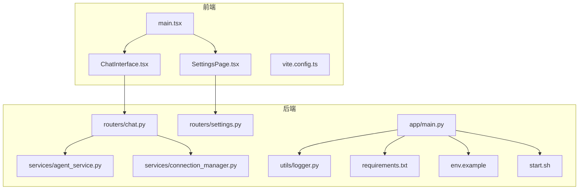
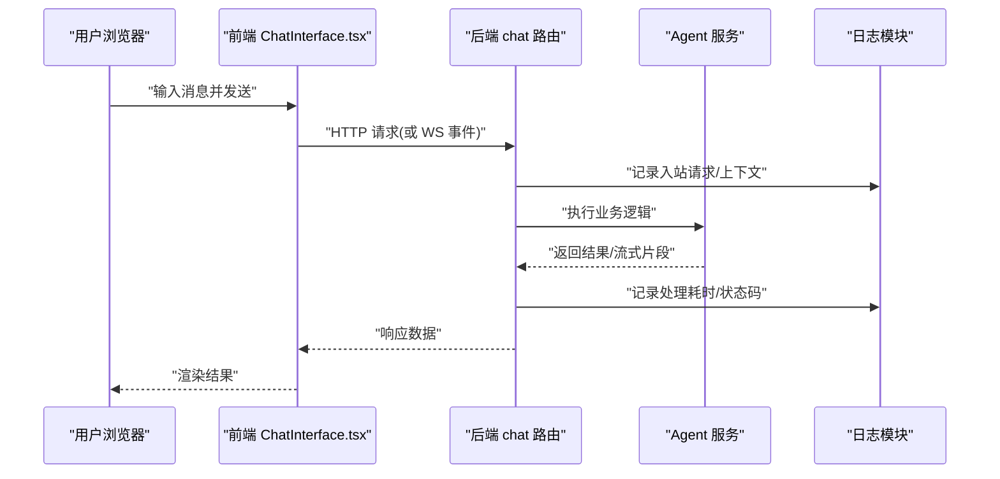
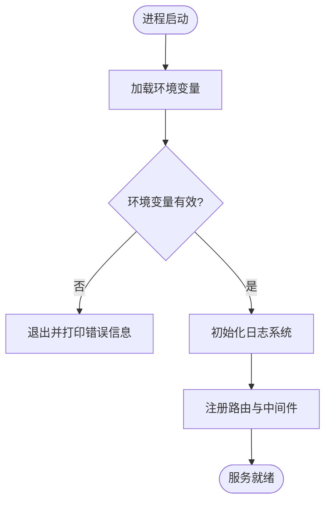
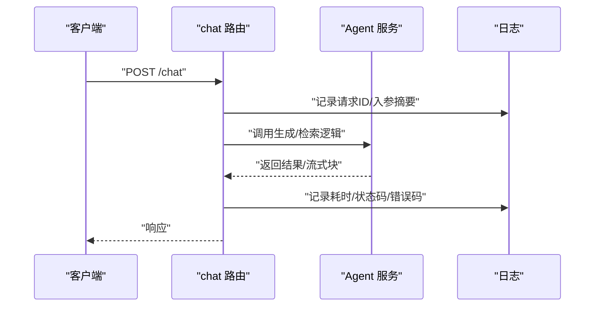
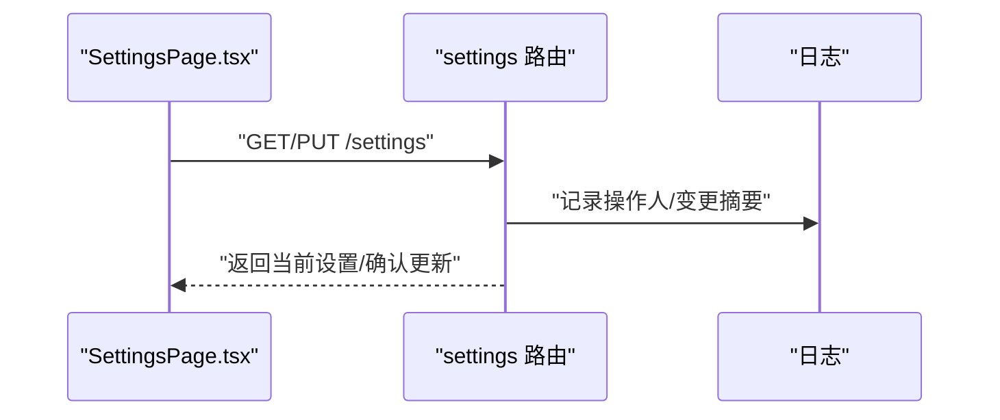
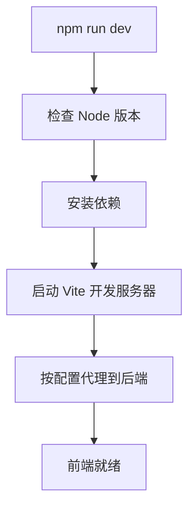
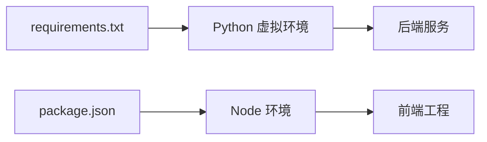

# 故障排除

<cite>
**本文引用的文件**   
- [backend/app/main.py](file://backend/app/main.py)
- [backend/app/utils/logger.py](file://backend/app/utils/logger.py)
- [backend/requirements.txt](file://backend/requirements.txt)
- [backend/env.example](file://backend/env.example)
- [backend/start.sh](file://backend/start.sh)
- [frontend/package.json](file://frontend/package.json)
- [frontend/vite.config.ts](file://frontend/vite.config.ts)
- [frontend/src/components/ChatInterface.tsx](file://frontend/src/components/ChatInterface.tsx)
- [frontend/src/components/SettingsPage.tsx](file://frontend/src/components/SettingsPage.tsx)
</cite>

## 目录
1. [简介](#简介)
2. [项目结构](#项目结构)
3. [核心组件](#核心组件)
4. [架构总览](#架构总览)
5. [详细组件分析](#详细组件分析)
6. [依赖分析](#依赖分析)
7. [性能考虑](#性能考虑)
8. [故障排除指南](#故障排除指南)
9. [结论](#结论)
10. [附录](#附录)

## 简介
本指南面向部署与使用 PolyStudio 的工程师与运维人员，聚焦于“问题定位—根因分析—修复验证”的闭环。内容覆盖：
- 常见问题与解决方案（环境、依赖、配置、运行时）
- 日志分析方法（级别、关键字、链路追踪）
- 调试工具与技巧（后端、前端、网络）
- 性能诊断（内存、CPU、数据库/外部服务）
- 错误代码对照表、已知问题清单、社区支持渠道

## 项目结构
本项目采用前后端分离架构：
- 后端：Python FastAPI 应用，提供聊天、设置等路由与服务；通过统一日志模块输出结构化日志；启动脚本与环境模板用于初始化运行参数。
- 前端：React + Vite 工程，包含聊天界面与设置页，负责与后端交互与用户交互。

**图表来源**
- [backend/app/main.py](file://backend/app/main.py)
- [backend/app/routers/chat.py](file://backend/app/routers/chat.py)
- [backend/app/routers/settings.py](file://backend/app/routers/settings.py)
- [backend/app/services/agent_service.py](file://backend/app/services/agent_service.py)
- [backend/app/services/connection_manager.py](file://backend/app/services/connection_manager.py)
- [backend/app/utils/logger.py](file://backend/app/utils/logger.py)
- [backend/requirements.txt](file://backend/requirements.txt)
- [backend/env.example](file://backend/env.example)
- [backend/start.sh](file://backend/start.sh)
- [frontend/src/main.tsx](file://frontend/src/main.tsx)
- [frontend/src/components/ChatInterface.tsx](file://frontend/src/components/ChatInterface.tsx)
- [frontend/src/components/SettingsPage.tsx](file://frontend/src/components/SettingsPage.tsx)
- [frontend/vite.config.ts](file://frontend/vite.config.ts)

**章节来源**
- [backend/app/main.py](file://backend/app/main.py)
- [backend/app/utils/logger.py](file://backend/app/utils/logger.py)
- [backend/requirements.txt](file://backend/requirements.txt)
- [backend/env.example](file://backend/env.example)
- [backend/start.sh](file://backend/start.sh)
- [frontend/package.json](file://frontend/package.json)
- [frontend/vite.config.ts](file://frontend/vite.config.ts)
- [frontend/src/components/ChatInterface.tsx](file://frontend/src/components/ChatInterface.tsx)
- [frontend/src/components/SettingsPage.tsx](file://frontend/src/components/SettingsPage.tsx)

## 核心组件
- 后端主入口与中间件：负责应用生命周期、路由注册、全局异常处理与日志初始化。
- 日志子系统：集中配置日志级别、输出格式与轮转策略，便于问题回溯。
- 路由层：暴露聊天与设置接口，承载请求解析与响应组装。
- 服务层：封装业务逻辑（如 Agent 编排、连接管理）。
- 前端页面：聊天界面与设置页，发起 HTTP/WebSocket 请求并渲染结果。

**章节来源**
- [backend/app/main.py](file://backend/app/main.py)
- [backend/app/utils/logger.py](file://backend/app/utils/logger.py)
- [backend/app/routers/chat.py](file://backend/app/routers/chat.py)
- [backend/app/routers/settings.py](file://backend/app/routers/settings.py)
- [backend/app/services/agent_service.py](file://backend/app/services/agent_service.py)
- [backend/app/services/connection_manager.py](file://backend/app/services/connection_manager.py)
- [frontend/src/components/ChatInterface.tsx](file://frontend/src/components/ChatInterface.tsx)
- [frontend/src/components/SettingsPage.tsx](file://frontend/src/components/SettingsPage.tsx)

## 架构总览
下图展示一次典型聊天请求从前端到后端的调用链路与关键日志落点。

**图表来源**
- [frontend/src/components/ChatInterface.tsx](file://frontend/src/components/ChatInterface.tsx)
- [backend/app/routers/chat.py](file://backend/app/routers/chat.py)
- [backend/app/services/agent_service.py](file://backend/app/services/agent_service.py)
- [backend/app/utils/logger.py](file://backend/app/utils/logger.py)

## 详细组件分析

### 后端主入口与日志
- 职责：初始化应用、注册路由、挂载全局异常处理器、加载环境变量、配置日志。
- 关键点：
  - 环境变量加载失败应快速失败并给出明确提示。
  - 日志级别需可配置，生产建议 INFO/WARNING，调试阶段可设为 DEBUG。
  - 全局异常处理器应将异常堆栈写入日志并返回友好错误码。

**图表来源**
- [backend/app/main.py](file://backend/app/main.py)
- [backend/app/utils/logger.py](file://backend/app/utils/logger.py)
- [backend/env.example](file://backend/env.example)

**章节来源**
- [backend/app/main.py](file://backend/app/main.py)
- [backend/app/utils/logger.py](file://backend/app/utils/logger.py)
- [backend/env.example](file://backend/env.example)

### 聊天路由与服务
- 职责：接收聊天请求，调用 Agent 服务，处理流式或非流式响应，记录关键指标。
- 关键点：
  - 对上游 LLM/工具调用的超时与重试策略需明确。
  - 大对象/流式传输需关注内存峰值与背压。
  - 关键路径需埋点耗时与错误码。

**图表来源**
- [backend/app/routers/chat.py](file://backend/app/routers/chat.py)
- [backend/app/services/agent_service.py](file://backend/app/services/agent_service.py)
- [backend/app/utils/logger.py](file://backend/app/utils/logger.py)

**章节来源**
- [backend/app/routers/chat.py](file://backend/app/routers/chat.py)
- [backend/app/services/agent_service.py](file://backend/app/services/agent_service.py)
- [backend/app/utils/logger.py](file://backend/app/utils/logger.py)

### 设置路由与前端设置页
- 职责：提供系统设置查询/更新能力；前端设置页读取/保存配置。
- 关键点：
  - 配置变更需幂等校验与审计日志。
  - 敏感字段不应回显到前端日志。

**图表来源**
- [frontend/src/components/SettingsPage.tsx](file://frontend/src/components/SettingsPage.tsx)
- [backend/app/routers/settings.py](file://backend/app/routers/settings.py)
- [backend/app/utils/logger.py](file://backend/app/utils/logger.py)

**章节来源**
- [frontend/src/components/SettingsPage.tsx](file://frontend/src/components/SettingsPage.tsx)
- [backend/app/routers/settings.py](file://backend/app/routers/settings.py)
- [backend/app/utils/logger.py](file://backend/app/utils/logger.py)

### 前端构建与开发服务器
- 职责：Vite 开发服务器、打包产物、代理配置。
- 关键点：
  - 本地开发时代理到后端地址，避免跨域。
  - 构建失败常见原因：Node 版本不匹配、端口占用、依赖缺失。

**图表来源**
- [frontend/vite.config.ts](file://frontend/vite.config.ts)
- [frontend/package.json](file://frontend/package.json)

**章节来源**
- [frontend/vite.config.ts](file://frontend/vite.config.ts)
- [frontend/package.json](file://frontend/package.json)

## 依赖分析
- Python 依赖：通过 requirements.txt 锁定版本，确保虚拟环境与 CI 一致。
- Node 依赖：通过 package.json 与 lock 文件保证前端构建一致性。
- 常见冲突：
  - Python 解释器版本与包 ABI 不兼容。
  - Node 版本与插件二进制不兼容。
  - 第三方库与系统库（如编译依赖）缺失。

**图表来源**
- [backend/requirements.txt](file://backend/requirements.txt)
- [frontend/package.json](file://frontend/package.json)

**章节来源**
- [backend/requirements.txt](file://backend/requirements.txt)
- [frontend/package.json](file://frontend/package.json)

## 性能考虑
- 后端
  - 流式响应：控制单条消息大小与并发度，避免内存暴涨。
  - 外部调用：为 LLM/图像/视频等外部服务设置合理超时与重试上限。
  - 日志开销：生产环境关闭 DEBUG 级日志，避免 I/O 瓶颈。
- 前端
  - 列表渲染：分页/虚拟化减少 DOM 节点数量。
  - 图片/模型资源：按需加载与缓存策略。
- 通用
  - 监控关键指标：QPS、P95/P99 延迟、错误率、GC/CPU/内存。

[本节为通用指导，无需源码引用]

## 故障排除指南

### 一、环境问题排查
- Python 环境
  - 症状：导入失败、ABI 不匹配、命令不可用。
  - 步骤：
    - 确认 Python 版本与 requirements.txt 兼容。
    - 重新创建虚拟环境并安装依赖。
    - 若涉及编译型依赖，检查系统编译器与头文件是否齐全。
  - 参考：
    - [backend/requirements.txt](file://backend/requirements.txt)
- Node 环境
  - 症状：构建失败、插件报错、端口占用。
  - 步骤：
    - 切换至指定 Node 版本（nvm 推荐）。
    - 清理 node_modules 与锁文件后重装。
    - 检查 3000/5173 等端口占用。
  - 参考：
    - [frontend/package.json](file://frontend/package.json)
- 操作系统与容器
  - 症状：权限不足、时区/编码异常、缺少系统库。
  - 步骤：
    - 以非 root 用户运行必要服务。
    - 统一时区与语言环境。
    - 补齐系统库（如 libssl、gcc 等）。

**章节来源**
- [backend/requirements.txt](file://backend/requirements.txt)
- [frontend/package.json](file://frontend/package.json)

### 二、依赖冲突与安装失败
- 现象
  - pip install 报版本冲突或编译失败。
  - npm install 报引擎版本不满足或平台不兼容。
- 解决思路
  - 固定依赖版本，优先使用锁文件。
  - 隔离环境（venv/poetry、nvm），避免全局污染。
  - 针对编译失败，安装对应系统依赖后再重试。
- 参考
  - [backend/requirements.txt](file://backend/requirements.txt)
  - [frontend/package.json](file://frontend/package.json)

**章节来源**
- [backend/requirements.txt](file://backend/requirements.txt)
- [frontend/package.json](file://frontend/package.json)

### 三、配置错误与启动失败
- 环境变量缺失/非法
  - 症状：启动即崩溃、关键功能不可用。
  - 步骤：
    - 对照 env.example 补齐变量。
    - 在启动前打印关键变量进行自检。
  - 参考：
    - [backend/env.example](file://backend/env.example)
- 启动脚本异常
  - 症状：进程立即退出、端口被占。
  - 步骤：
    - 检查 start.sh 中的工作目录与参数。
    - 查看标准输出与错误输出。
  - 参考：
    - [backend/start.sh](file://backend/start.sh)
- 前端代理配置
  - 症状：跨域、404、无法访问后端。
  - 步骤：
    - 核对 vite.config.ts 的代理目标与路径重写。
    - 确认后端服务已启动且监听正确端口。
  - 参考：
    - [frontend/vite.config.ts](file://frontend/vite.config.ts)

**章节来源**
- [backend/env.example](file://backend/env.example)
- [backend/start.sh](file://backend/start.sh)
- [frontend/vite.config.ts](file://frontend/vite.config.ts)

### 四、运行时异常与错误码
- 常见异常类型
  - 4xx：请求参数错误、鉴权失败、资源不存在。
  - 5xx：服务端内部错误、上游服务超时/不可用。
- 定位方法
  - 在后端全局异常处理器中记录请求 ID、路径、状态码与简要堆栈。
  - 在前端拦截器中捕获并上报错误码与请求体摘要。
- 建议的错误码约定（示例）
  - 1001：参数校验失败
  - 1002：鉴权失败
  - 1003：资源不存在
  - 2001：上游服务超时
  - 2002：上游服务不可用
  - 3001：内部错误
- 参考实现位置
  - 全局异常处理与日志记录：
    - [backend/app/main.py](file://backend/app/main.py)
    - [backend/app/utils/logger.py](file://backend/app/utils/logger.py)
  - 前端错误捕获与上报：
    - [frontend/src/components/ChatInterface.tsx](file://frontend/src/components/ChatInterface.tsx)

**章节来源**
- [backend/app/main.py](file://backend/app/main.py)
- [backend/app/utils/logger.py](file://backend/app/utils/logger.py)
- [frontend/src/components/ChatInterface.tsx](file://frontend/src/components/ChatInterface.tsx)

### 五、日志分析方法
- 日志级别
  - DEBUG：仅开发/复现时使用，注意脱敏。
  - INFO：生产默认级别，记录关键流程与指标。
  - WARNING/ERROR：告警与错误，必须包含请求 ID、路径、状态码。
- 关键字段
  - request_id、method、path、status_code、latency_ms、error_code、user_id、trace_id。
- 采集与检索
  - 将 stdout/stderr 接入日志收集系统（如 ELK/Loki）。
  - 基于 request_id 串联前后端日志。
- 参考
  - 日志初始化与配置：
    - [backend/app/utils/logger.py](file://backend/app/utils/logger.py)
  - 应用启动与中间件：
    - [backend/app/main.py](file://backend/app/main.py)

**章节来源**
- [backend/app/utils/logger.py](file://backend/app/utils/logger.py)
- [backend/app/main.py](file://backend/app/main.py)

### 六、调试工具与技巧
- 后端调试
  - 使用 IDE 断点调试，开启热重载。
  - 通过环境变量切换日志级别，观察关键路径。
  - 使用 curl/Postman 构造最小复现用例。
- 前端调试
  - 浏览器开发者工具：Network 面板查看请求/响应、WebSocket 帧。
  - Console 面板查看 JS 错误与自定义日志。
  - 使用代理与 Mock 隔离不稳定上游。
- 网络分析
  - 抓包工具（Wireshark/tcpdump）定位丢包与重传。
  - 检查 DNS、防火墙、反向代理规则。
- 参考
  - 前端构建与代理：
    - [frontend/vite.config.ts](file://frontend/vite.config.ts)
    - [frontend/package.json](file://frontend/package.json)

**章节来源**
- [frontend/vite.config.ts](file://frontend/vite.config.ts)
- [frontend/package.json](file://frontend/package.json)

### 七、性能问题诊断
- 内存泄漏检测
  - 后端：使用 tracemalloc/py-spy 定位增长热点；检查未释放的文件句柄/连接。
  - 前端：Performance/Memory 面板对比快照，查找未释放的事件监听与闭包引用。
- CPU 使用率分析
  - 后端：cProfile/py-spy 采样热点函数；关注阻塞 I/O 与序列化开销。
  - 前端：Profiler 录制长任务，拆分计算与渲染。
- 数据库/外部服务优化
  - 增加索引、减少 N+1 查询、分页与缓存。
  - 为外部调用设置超时、熔断与退避重试。
- 参考
  - 日志埋点与指标记录：
    - [backend/app/utils/logger.py](file://backend/app/utils/logger.py)
    - [backend/app/main.py](file://backend/app/main.py)

**章节来源**
- [backend/app/utils/logger.py](file://backend/app/utils/logger.py)
- [backend/app/main.py](file://backend/app/main.py)

### 八、已知问题与规避方案
- 启动即崩溃
  - 可能原因：环境变量缺失、端口冲突、依赖未安装。
  - 规避：严格遵循 env.example，使用独立端口，先安装依赖再启动。
- 前端无法访问后端
  - 可能原因：代理配置错误、跨域、后端未启动。
  - 规避：核对 vite.config.ts 代理目标，确认后端监听地址与端口。
- 构建失败
  - 可能原因：Node 版本不匹配、平台原生模块缺失。
  - 规避：使用 nvm 切换版本，安装系统依赖后重试。

[本节为经验总结，无需源码引用]

### 九、社区支持与反馈
- 提交 Issue 时请附带：
  - 环境信息（OS、Python/Node 版本、依赖版本）
  - 复现步骤与最小用例
  - 相关日志片段（含 request_id）
- 参考
  - 项目根目录 README 或仓库说明（如有）

[本节为通用指引，无需源码引用]

## 结论
通过规范的环境准备、严格的依赖管理、完善的日志与错误码体系，以及系统化的调试与性能诊断方法，可以显著缩短问题定位时间并提升系统稳定性。建议在生产环境启用结构化日志与指标采集，结合自动化告警形成闭环。

[本节为总结性内容，无需源码引用]

## 附录

### A. 错误码对照表（建议）
- 1001：参数校验失败
- 1002：鉴权失败
- 1003：资源不存在
- 2001：上游服务超时
- 2002：上游服务不可用
- 3001：内部错误

[本节为通用约定，无需源码引用]

### B. 关键文件速查
- 后端主入口与日志
  - [backend/app/main.py](file://backend/app/main.py)
  - [backend/app/utils/logger.py](file://backend/app/utils/logger.py)
- 路由与服务
  - [backend/app/routers/chat.py](file://backend/app/routers/chat.py)
  - [backend/app/routers/settings.py](file://backend/app/routers/settings.py)
  - [backend/app/services/agent_service.py](file://backend/app/services/agent_service.py)
  - [backend/app/services/connection_manager.py](file://backend/app/services/connection_manager.py)
- 环境与启动
  - [backend/env.example](file://backend/env.example)
  - [backend/start.sh](file://backend/start.sh)
  - [backend/requirements.txt](file://backend/requirements.txt)
- 前端工程
  - [frontend/package.json](file://frontend/package.json)
  - [frontend/vite.config.ts](file://frontend/vite.config.ts)
  - [frontend/src/components/ChatInterface.tsx](file://frontend/src/components/ChatInterface.tsx)
  - [frontend/src/components/SettingsPage.tsx](file://frontend/src/components/SettingsPage.tsx)