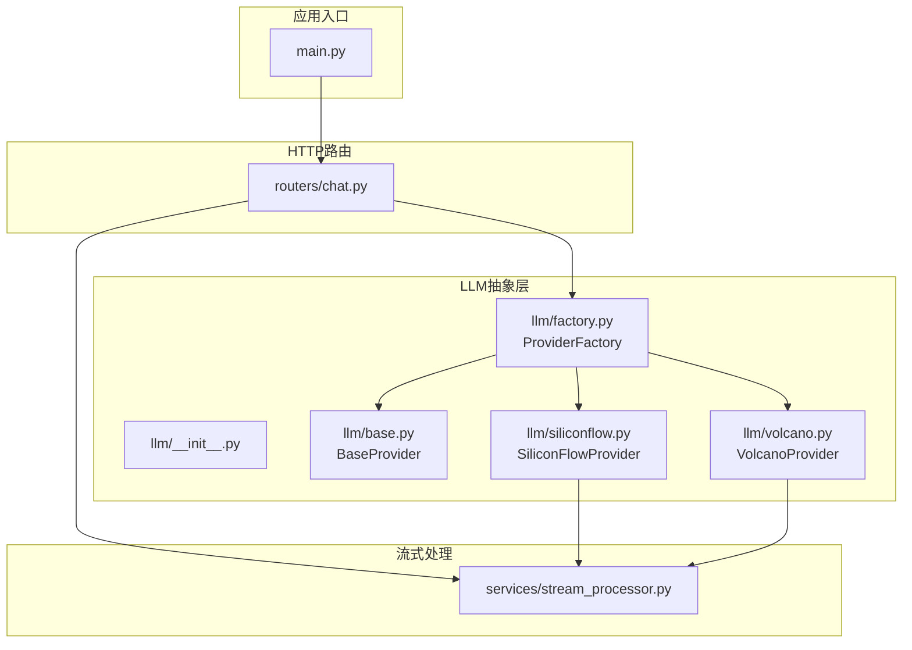
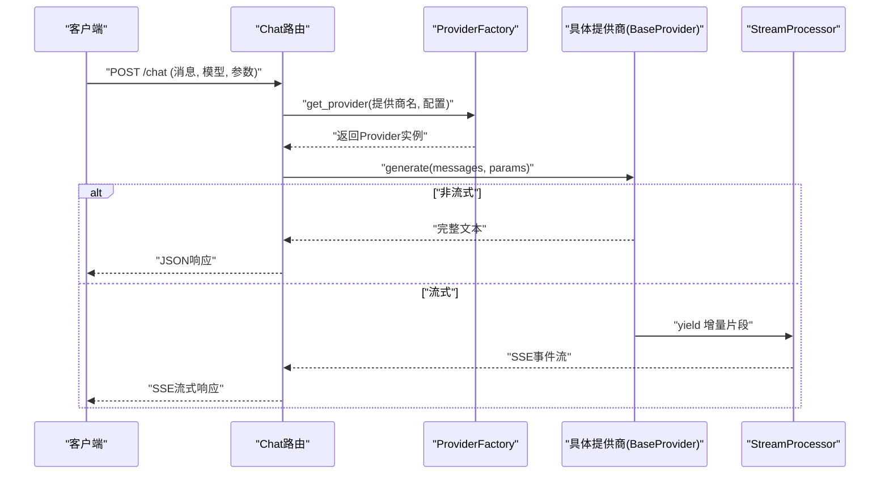
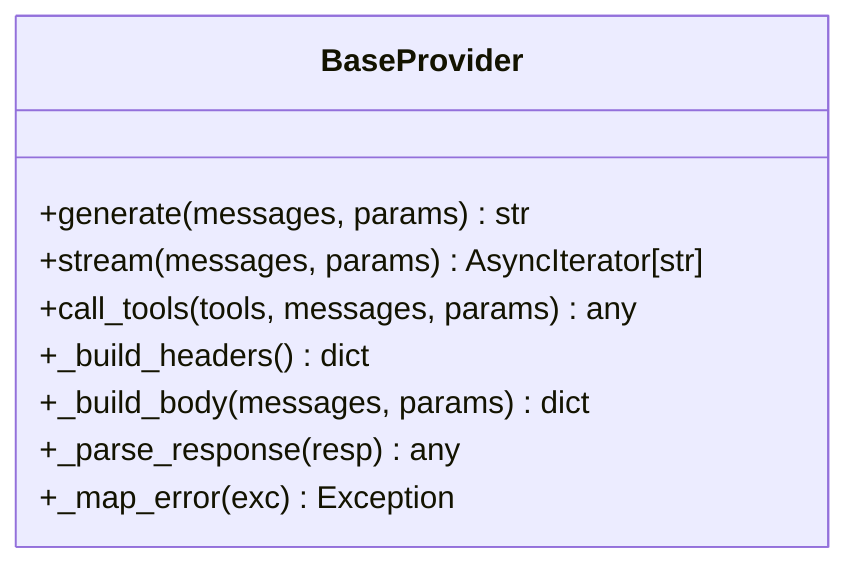
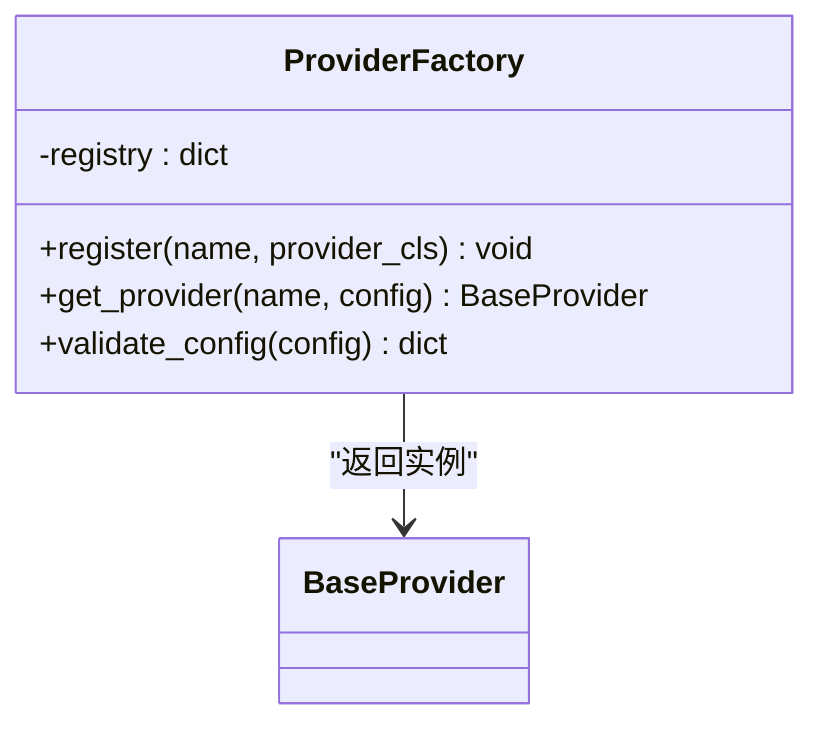
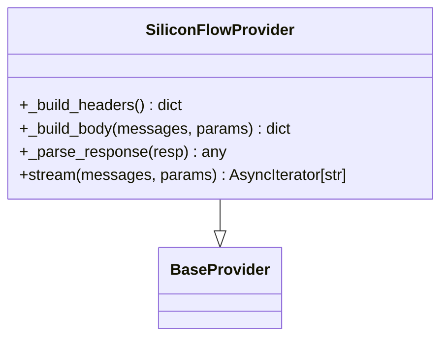
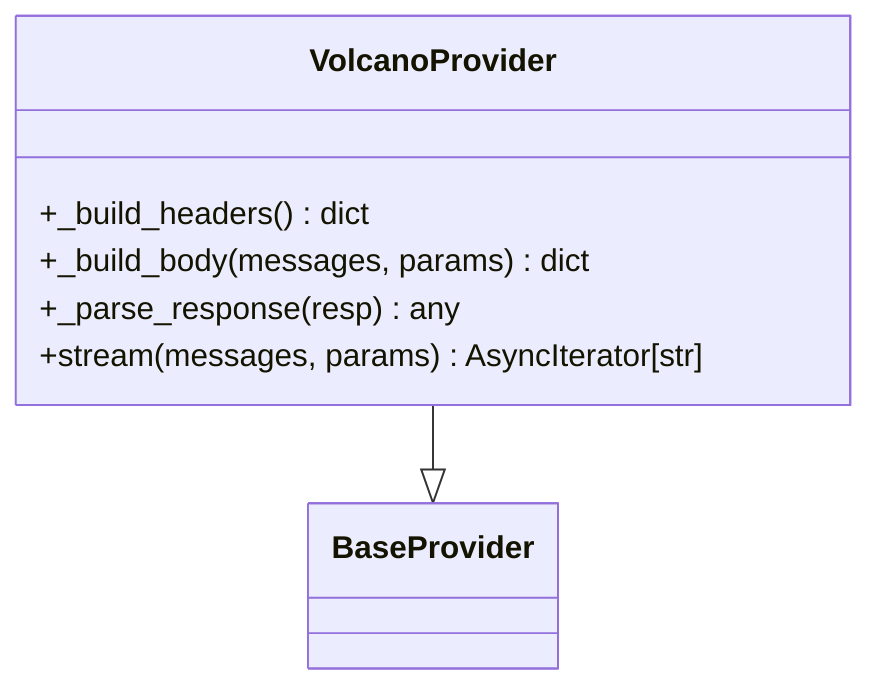
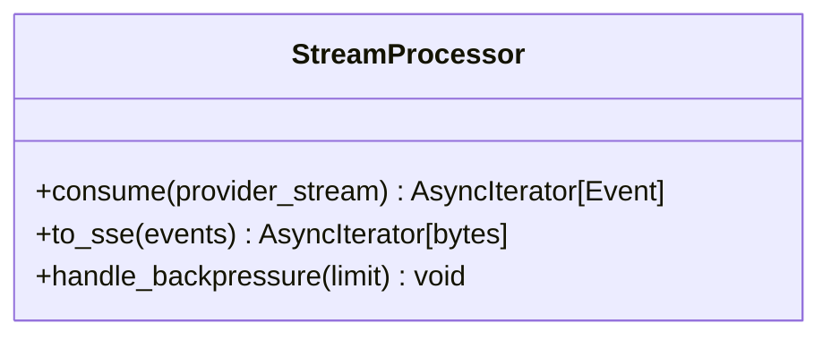
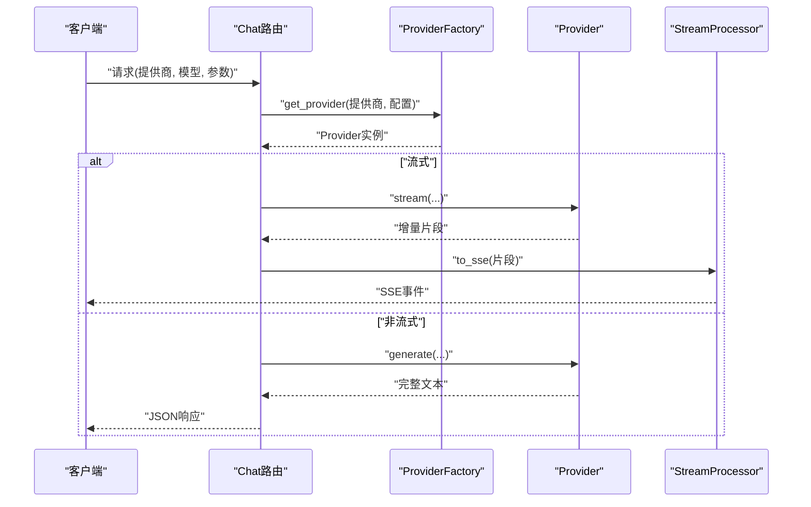
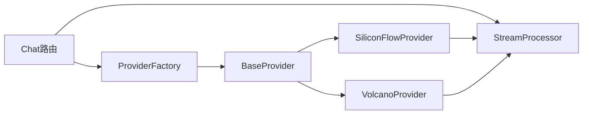

# LLM集成扩展

<cite>
**本文引用的文件**   
- [backend/app/llm/__init__.py](file://backend/app/llm/__init__.py)
- [backend/app/llm/base.py](file://backend/app/llm/base.py)
- [backend/app/llm/factory.py](file://backend/app/llm/factory.py)
- [backend/app/llm/siliconflow.py](file://backend/app/llm/siliconflow.py)
- [backend/app/llm/volcano.py](file://backend/app/llm/volcano.py)
- [backend/app/routers/chat.py](file://backend/app/routers/chat.py)
- [backend/app/services/stream_processor.py](file://backend/app/services/stream_processor.py)
- [backend/app/main.py](file://backend/app/main.py)
</cite>

## 目录
1. [简介](#简介)
2. [项目结构](#项目结构)
3. [核心组件](#核心组件)
4. [架构总览](#架构总览)
5. [详细组件分析](#详细组件分析)
6. [依赖关系分析](#依赖关系分析)
7. [性能考虑](#性能考虑)
8. [故障排查指南](#故障排查指南)
9. [结论](#结论)
10. [附录](#附录)

## 简介
本文件面向PolyStudio后端的LLM集成扩展，系统性阐述以下主题：
- LLM提供商抽象接口设计：BaseProvider基类的核心方法与扩展点
- 工厂模式实现：提供商注册、实例化与配置管理
- 现有提供商实现细节：SiliconFlow与Volcano引擎的集成方式
- 新LLM提供商集成指南：API适配、认证处理、流式响应支持
- 模型参数配置与性能优化策略
- 提供商切换与故障转移机制

## 项目结构
后端LLM相关代码集中在 backend/app/llm 目录下，采用“抽象基类 + 工厂 + 具体提供商”的分层组织方式。上层路由与服务通过工厂获取具体提供商实例，屏蔽底层差异；流式处理由独立服务模块统一编排。

图表来源
- [backend/app/main.py](file://backend/app/main.py)
- [backend/app/routers/chat.py](file://backend/app/routers/chat.py)
- [backend/app/llm/__init__.py](file://backend/app/llm/__init__.py)
- [backend/app/llm/base.py](file://backend/app/llm/base.py)
- [backend/app/llm/factory.py](file://backend/app/llm/factory.py)
- [backend/app/llm/siliconflow.py](file://backend/app/llm/siliconflow.py)
- [backend/app/llm/volcano.py](file://backend/app/llm/volcano.py)
- [backend/app/services/stream_processor.py](file://backend/app/services/stream_processor.py)

章节来源
- [backend/app/main.py](file://backend/app/main.py)
- [backend/app/routers/chat.py](file://backend/app/routers/chat.py)
- [backend/app/llm/__init__.py](file://backend/app/llm/__init__.py)
- [backend/app/llm/base.py](file://backend/app/llm/base.py)
- [backend/app/llm/factory.py](file://backend/app/llm/factory.py)
- [backend/app/llm/siliconflow.py](file://backend/app/llm/siliconflow.py)
- [backend/app/llm/volcano.py](file://backend/app/llm/volcano.py)
- [backend/app/services/stream_processor.py](file://backend/app/services/stream_processor.py)

## 核心组件
本节聚焦LLM抽象层的关键构件及其职责边界。

- BaseProvider（抽象基类）
  - 定义统一的调用契约：同步/异步文本生成、流式生成、工具调用等
  - 提供通用能力：重试、超时、日志、指标上报等可复用逻辑
  - 暴露扩展点：认证头构造、请求体组装、响应解析、错误映射
- ProviderFactory（工厂）
  - 维护提供商名称到实现的映射
  - 负责从配置加载参数并实例化具体提供商
  - 支持动态注册新提供商
- 具体提供商实现
  - SiliconFlowProvider：对接SiliconFlow API
  - VolcanoProvider：对接火山引擎API
- 流式处理服务
  - 统一消费各提供商的SSE/流式事件，转换为前端友好的增量片段

章节来源
- [backend/app/llm/base.py](file://backend/app/llm/base.py)
- [backend/app/llm/factory.py](file://backend/app/llm/factory.py)
- [backend/app/llm/siliconflow.py](file://backend/app/llm/siliconflow.py)
- [backend/app/llm/volcano.py](file://backend/app/llm/volcano.py)
- [backend/app/services/stream_processor.py](file://backend/app/services/stream_processor.py)

## 架构总览
下图展示一次聊天请求在系统中的流转路径，以及LLM层的解耦设计。

图表来源
- [backend/app/routers/chat.py](file://backend/app/routers/chat.py)
- [backend/app/llm/factory.py](file://backend/app/llm/factory.py)
- [backend/app/llm/base.py](file://backend/app/llm/base.py)
- [backend/app/services/stream_processor.py](file://backend/app/services/stream_processor.py)

## 详细组件分析

### BaseProvider 抽象基类
- 职责
  - 定义统一接口：文本生成、流式生成、工具调用、健康检查等
  - 封装通用流程：参数校验、重试退避、超时控制、指标与日志
- 关键方法（概念性说明）
  - 同步生成：接收消息列表与模型参数，返回最终文本
  - 流式生成：迭代返回增量片段，供上游转为SSE
  - 工具调用：按提供商约定拼装工具描述与函数调用结果
  - 认证与请求构建：子类实现头部签名、鉴权令牌注入
  - 错误映射：将第三方异常转换为内部统一错误类型
- 扩展点
  - 重写认证头构造、请求体模板、响应解析器
  - 自定义重试策略、熔断开关、速率限制回调

图表来源
- [backend/app/llm/base.py](file://backend/app/llm/base.py)

章节来源
- [backend/app/llm/base.py](file://backend/app/llm/base.py)

### ProviderFactory 工厂
- 职责
  - 注册表维护：提供商名称到实现类的映射
  - 实例化：根据配置创建具体提供商对象
  - 配置管理：合并默认值与环境变量，校验必填项
- 关键行为
  - get_provider(name, config): 返回已配置的Provider实例
  - register(name, provider_cls): 动态注册新提供商
  - validate_config(config): 校验并规范化配置
- 典型配置键（示例）
  - api_key、base_url、timeout、max_retries、model_map、region等

图表来源
- [backend/app/llm/factory.py](file://backend/app/llm/factory.py)

章节来源
- [backend/app/llm/factory.py](file://backend/app/llm/factory.py)

### SiliconFlowProvider 实现
- 集成要点
  - 认证：基于Header或Query的参数注入
  - 请求体：遵循SiliconFlow的对话/补全格式
  - 响应：解析文本字段或事件流中的delta
  - 错误：将网络/业务异常映射为内部错误
- 特性
  - 支持流式输出，按token级增量推送
  - 可选工具调用协议适配

图表来源
- [backend/app/llm/siliconflow.py](file://backend/app/llm/siliconflow.py)
- [backend/app/llm/base.py](file://backend/app/llm/base.py)

章节来源
- [backend/app/llm/siliconflow.py](file://backend/app/llm/siliconflow.py)

### VolcanoProvider 实现
- 集成要点
  - 认证：按火山引擎约定的签名算法或Token注入
  - 请求体：适配其对话/流式接口规范
  - 响应：解析事件流或文本块
- 特性
  - 支持流式增量输出
  - 针对火山引擎的错误码进行细化映射

图表来源
- [backend/app/llm/volcano.py](file://backend/app/llm/volcano.py)
- [backend/app/llm/base.py](file://backend/app/llm/base.py)

章节来源
- [backend/app/llm/volcano.py](file://backend/app/llm/volcano.py)

### 流式处理服务 StreamProcessor
- 职责
  - 统一消费各提供商的流式事件
  - 将增量片段转换为SSE事件或框架原生流
  - 处理中断、超时、重连等边界情况
- 关键点
  - 事件去抖与合并
  - 背压控制与缓冲上限
  - 错误传播与优雅降级

图表来源
- [backend/app/services/stream_processor.py](file://backend/app/services/stream_processor.py)

章节来源
- [backend/app/services/stream_processor.py](file://backend/app/services/stream_processor.py)

### 路由与控制器 ChatRouter
- 职责
  - 解析请求参数，选择目标提供商与模型
  - 调用工厂获取Provider实例
  - 协调流式与非流式响应
- 交互
  - 与ProviderFactory协作完成实例化
  - 与StreamProcessor协作完成SSE输出

图表来源
- [backend/app/routers/chat.py](file://backend/app/routers/chat.py)
- [backend/app/llm/factory.py](file://backend/app/llm/factory.py)
- [backend/app/services/stream_processor.py](file://backend/app/services/stream_processor.py)

章节来源
- [backend/app/routers/chat.py](file://backend/app/routers/chat.py)

## 依赖关系分析
- 耦合与内聚
  - BaseProvider高内聚于“调用契约”，下游实现仅关注差异点
  - ProviderFactory集中管理注册与实例化，降低路由层耦合
  - 流式处理与具体提供商解耦，便于替换与测试
- 外部依赖
  - HTTP客户端、SSE发送器、配置读取器等
- 潜在循环依赖
  - 当前分层清晰，未见循环导入风险

图表来源
- [backend/app/llm/base.py](file://backend/app/llm/base.py)
- [backend/app/llm/factory.py](file://backend/app/llm/factory.py)
- [backend/app/llm/siliconflow.py](file://backend/app/llm/siliconflow.py)
- [backend/app/llm/volcano.py](file://backend/app/llm/volcano.py)
- [backend/app/routers/chat.py](file://backend/app/routers/chat.py)
- [backend/app/services/stream_processor.py](file://backend/app/services/stream_processor.py)

章节来源
- [backend/app/llm/base.py](file://backend/app/llm/base.py)
- [backend/app/llm/factory.py](file://backend/app/llm/factory.py)
- [backend/app/llm/siliconflow.py](file://backend/app/llm/siliconflow.py)
- [backend/app/llm/volcano.py](file://backend/app/llm/volcano.py)
- [backend/app/routers/chat.py](file://backend/app/routers/chat.py)
- [backend/app/services/stream_processor.py](file://backend/app/services/stream_processor.py)

## 性能考虑
- 连接池与并发
  - 复用HTTP连接，合理设置最大并发与队列长度
- 超时与重试
  - 区分网络超时与业务超时；指数退避+抖动
- 流式传输
  - 小批量聚合减少帧开销；背压控制避免内存暴涨
- 缓存与幂等
  - 对相同请求做短期缓存（需结合场景）
- 资源隔离
  - 不同提供商使用独立线程/进程池，避免相互影响

## 故障排查指南
- 常见问题定位
  - 认证失败：检查密钥、签名算法、时区与时间戳
  - 429限流：调整重试间隔与并发度，启用排队
  - 超时：增大超时阈值或拆分长上下文
  - 流式中断：检查网络稳定性与SSE心跳
- 诊断手段
  - 开启调试日志，记录请求体摘要与响应状态码
  - 增加指标埋点：QPS、延迟分位、错误率、重试次数
  - 健康检查：定期探测提供商可用性

章节来源
- [backend/app/llm/base.py](file://backend/app/llm/base.py)
- [backend/app/llm/factory.py](file://backend/app/llm/factory.py)
- [backend/app/services/stream_processor.py](file://backend/app/services/stream_processor.py)

## 结论
通过抽象基类与工厂模式，系统实现了LLM提供商的松耦合接入与统一管理。新增提供商只需实现少量扩展点即可无缝融入现有路由与流式处理管线。配合合理的配置管理与性能优化策略，可在多厂商环境下实现稳定、可扩展的LLM服务能力。

## 附录

### 新LLM提供商集成指南（步骤清单）
- 新建提供商类
  - 继承BaseProvider，实现必要方法：认证头构造、请求体组装、响应解析、错误映射
  - 若支持流式，实现流式生成方法并按事件产出增量片段
- 注册提供商
  - 在工厂中注册名称到实现类的映射
  - 提供默认配置键与校验规则
- 配置管理
  - 从环境变量或配置文件读取api_key、base_url、timeout等
  - 提供配置校验与缺省值合并
- 认证处理
  - 实现签名/Token注入逻辑，确保与目标平台一致
- 流式响应支持
  - 将增量片段交给StreamProcessor转换为SSE
  - 处理中断、超时与重连
- 单元测试
  - 覆盖正常路径、错误路径、流式边界条件
- 上线验证
  - 健康检查、压测、监控告警

章节来源
- [backend/app/llm/base.py](file://backend/app/llm/base.py)
- [backend/app/llm/factory.py](file://backend/app/llm/factory.py)
- [backend/app/services/stream_processor.py](file://backend/app/services/stream_processor.py)

### 模型参数配置建议
- 通用参数
  - temperature、top_p、max_tokens、stop_sequences、presence_penalty、frequency_penalty
- 平台特定
  - model别名映射、region、endpoint、tool_call_mode
- 安全与合规
  - 敏感信息不落盘；最小权限原则；审计日志脱敏

章节来源
- [backend/app/llm/factory.py](file://backend/app/llm/factory.py)

### 提供商切换与故障转移机制
- 切换策略
  - 按租户/会话/模型维度选择提供商
  - 支持灰度发布与权重分流
- 故障转移
  - 健康检查失败自动剔除
  - 主备切换与快速失败
  - 降级策略：返回兜底提示或本地缓存

章节来源
- [backend/app/llm/factory.py](file://backend/app/llm/factory.py)
- [backend/app/llm/base.py](file://backend/app/llm/base.py)