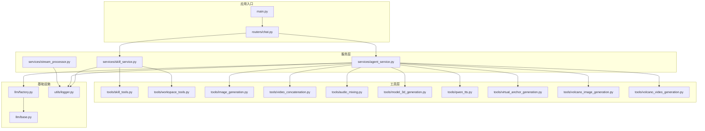
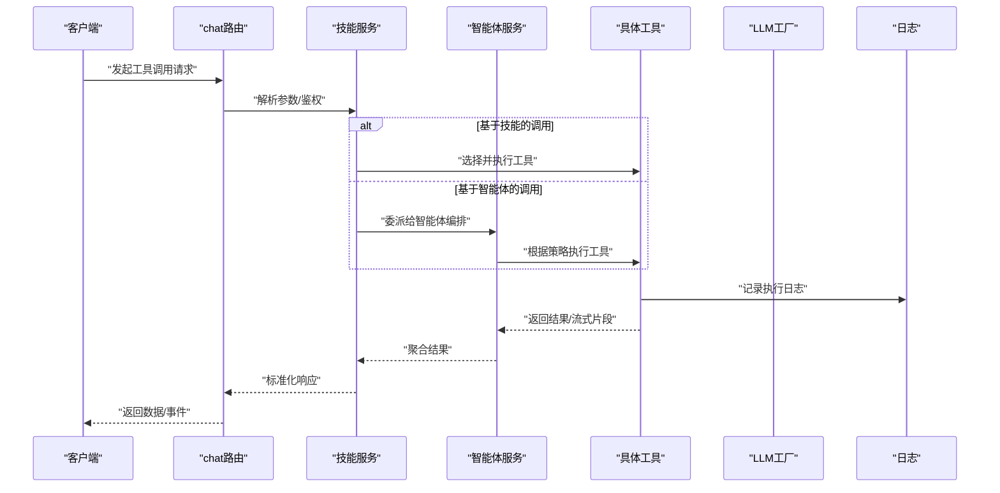
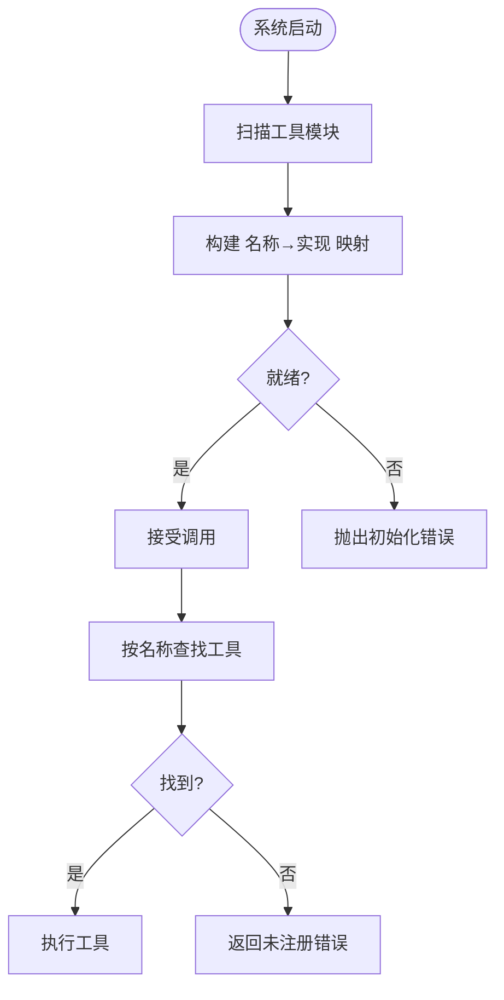
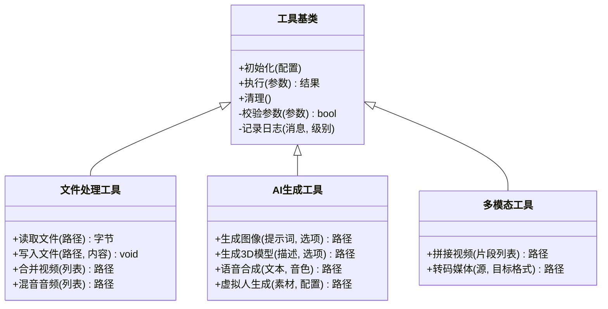
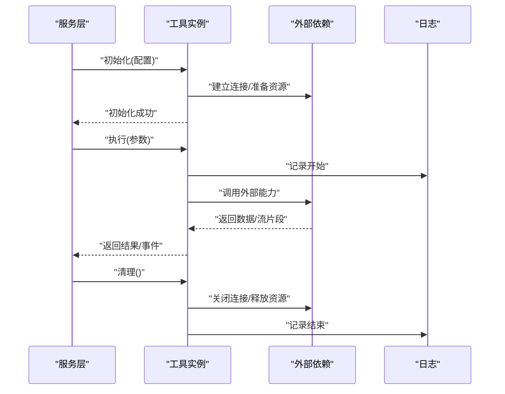
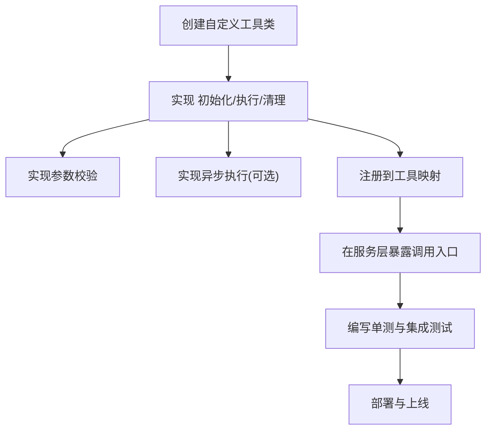
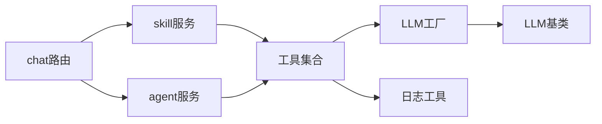

# 工具扩展

<cite>
**本文引用的文件**   
- [backend/app/tools/skill_tools.py](file://backend/app/tools/skill_tools.py)
- [backend/app/tools/workspace_tools.py](file://backend/app/tools/workspace_tools.py)
- [backend/app/tools/image_generation.py](file://backend/app/tools/image_generation.py)
- [backend/app/tools/video_concatenation.py](file://backend/app/tools/video_concatenation.py)
- [backend/app/tools/audio_mixing.py](file://backend/app/tools/audio_mixing.py)
- [backend/app/tools/model_3d_generation.py](file://backend/app/tools/model_3d_generation.py)
- [backend/app/tools/qwen_tts.py](file://backend/app/tools/qwen_tts.py)
- [backend/app/tools/virtual_anchor_generation.py](file://backend/app/tools/virtual_anchor_generation.py)
- [backend/app/tools/volcano_image_generation.py](file://backend/app/tools/volcano_image_generation.py)
- [backend/app/tools/volcano_video_generation.py](file://backend/app/tools/volcano_video_generation.py)
- [backend/app/services/skill_service.py](file://backend/app/services/skill_service.py)
- [backend/app/services/agent_service.py](file://backend/app/services/agent_service.py)
- [backend/app/services/stream_processor.py](file://backend/app/services/stream_processor.py)
- [backend/app/routers/chat.py](file://backend/app/routers/chat.py)
- [backend/app/main.py](file://backend/app/main.py)
- [backend/app/utils/logger.py](file://backend/app/utils/logger.py)
- [backend/app/llm/factory.py](file://backend/app/llm/factory.py)
- [backend/app/llm/base.py](file://backend/app/llm/base.py)
</cite>

## 目录
1. [简介](#简介)
2. [项目结构](#项目结构)
3. [核心组件](#核心组件)
4. [架构总览](#架构总览)
5. [详细组件分析](#详细组件分析)
6. [依赖关系分析](#依赖关系分析)
7. [性能考虑](#性能考虑)
8. [故障排查指南](#故障排查指南)
9. [结论](#结论)
10. [附录](#附录)

## 简介
本文件面向PolyStudio后端“工具扩展机制”的开发者与集成者，系统性阐述工具的注册与发现、接口定义、参数校验与错误处理、生命周期管理（初始化、执行、清理）、不同类别工具的实现模式（文件处理、AI生成、多媒体处理等），以及自定义工具开发指南（继承、异步、资源管理）、配置与环境变量使用、测试与调试最佳实践。文档以代码级事实为依据，辅以架构图与时序图帮助理解。

## 项目结构
后端采用分层组织：路由层接收请求，服务层编排业务逻辑，工具层提供可插拔能力，LLM工厂负责模型接入，日志工具贯穿全链路。工具模块集中于 backend/app/tools，按能力域划分；服务模块集中在 backend/app/services，负责调度与状态管理；路由在 backend/app/routers，入口在 backend/app/main.py。

图表来源
- [backend/app/main.py](file://backend/app/main.py)
- [backend/app/routers/chat.py](file://backend/app/routers/chat.py)
- [backend/app/services/skill_service.py](file://backend/app/services/skill_service.py)
- [backend/app/services/agent_service.py](file://backend/app/services/agent_service.py)
- [backend/app/services/stream_processor.py](file://backend/app/services/stream_processor.py)
- [backend/app/tools/skill_tools.py](file://backend/app/tools/skill_tools.py)
- [backend/app/tools/workspace_tools.py](file://backend/app/tools/workspace_tools.py)
- [backend/app/tools/image_generation.py](file://backend/app/tools/image_generation.py)
- [backend/app/tools/video_concatenation.py](file://backend/app/tools/video_concatenation.py)
- [backend/app/tools/audio_mixing.py](file://backend/app/tools/audio_mixing.py)
- [backend/app/tools/model_3d_generation.py](file://backend/app/tools/model_3d_generation.py)
- [backend/app/tools/qwen_tts.py](file://backend/app/tools/qwen_tts.py)
- [backend/app/tools/virtual_anchor_generation.py](file://backend/app/tools/virtual_anchor_generation.py)
- [backend/app/tools/volcano_image_generation.py](file://backend/app/tools/volcano_image_generation.py)
- [backend/app/tools/volcano_video_generation.py](file://backend/app/tools/volcano_video_generation.py)
- [backend/app/llm/factory.py](file://backend/app/llm/factory.py)
- [backend/app/llm/base.py](file://backend/app/llm/base.py)
- [backend/app/utils/logger.py](file://backend/app/utils/logger.py)

章节来源
- [backend/app/main.py](file://backend/app/main.py)
- [backend/app/routers/chat.py](file://backend/app/routers/chat.py)
- [backend/app/services/skill_service.py](file://backend/app/services/skill_service.py)
- [backend/app/services/agent_service.py](file://backend/app/services/agent_service.py)
- [backend/app/services/stream_processor.py](file://backend/app/services/stream_processor.py)
- [backend/app/tools/skill_tools.py](file://backend/app/tools/skill_tools.py)
- [backend/app/tools/workspace_tools.py](file://backend/app/tools/workspace_tools.py)
- [backend/app/tools/image_generation.py](file://backend/app/tools/image_generation.py)
- [backend/app/tools/video_concatenation.py](file://backend/app/tools/video_concatenation.py)
- [backend/app/tools/audio_mixing.py](file://backend/app/tools/audio_mixing.py)
- [backend/app/tools/model_3d_generation.py](file://backend/app/tools/model_3d_generation.py)
- [backend/app/tools/qwen_tts.py](file://backend/app/tools/qwen_tts.py)
- [backend/app/tools/virtual_anchor_generation.py](file://backend/app/tools/virtual_anchor_generation.py)
- [backend/app/tools/volcano_image_generation.py](file://backend/app/tools/volcano_image_generation.py)
- [backend/app/tools/volcano_video_generation.py](file://backend/app/tools/volcano_video_generation.py)
- [backend/app/llm/factory.py](file://backend/app/llm/factory.py)
- [backend/app/llm/base.py](file://backend/app/llm/base.py)
- [backend/app/utils/logger.py](file://backend/app/utils/logger.py)

## 核心组件
- 工具注册与发现
  - 通过统一的服务层对工具进行集中管理与调用，避免路由直接耦合具体实现。
  - 工具按能力域分文件组织，便于扩展与维护。
- 工具接口约定
  - 每个工具类暴露一致的调用入口，包含参数校验、执行主流程、结果封装与异常上报。
- 参数验证与错误处理
  - 在服务层或工具内部进行入参校验，失败时返回结构化错误信息；异常被捕获并记录到统一日志。
- 生命周期管理
  - 初始化：按需加载外部依赖（如模型客户端、存储路径）。
  - 执行：幂等设计，支持流式输出与中间状态上报。
  - 清理：释放临时文件、关闭连接、回收资源。
- 不同类型工具的实现模式
  - 文件处理工具：读写工作区、合并视频、混音等。
  - AI生成工具：图像、3D模型、虚拟人、TTS等。
  - 多媒体处理工具：音视频拼接、转码、合成。
- 配置与环境变量
  - 通过环境变量注入密钥、端点、超时等运行时参数，避免硬编码。
- 测试与调试
  - 单元测试覆盖参数校验与边界条件；集成测试模拟外部依赖；日志定位问题。

章节来源
- [backend/app/tools/skill_tools.py](file://backend/app/tools/skill_tools.py)
- [backend/app/tools/workspace_tools.py](file://backend/app/tools/workspace_tools.py)
- [backend/app/tools/image_generation.py](file://backend/app/tools/image_generation.py)
- [backend/app/tools/video_concatenation.py](file://backend/app/tools/video_concatenation.py)
- [backend/app/tools/audio_mixing.py](file://backend/app/tools/audio_mixing.py)
- [backend/app/tools/model_3d_generation.py](file://backend/app/tools/model_3d_generation.py)
- [backend/app/tools/qwen_tts.py](file://backend/app/tools/qwen_tts.py)
- [backend/app/tools/virtual_anchor_generation.py](file://backend/app/tools/virtual_anchor_generation.py)
- [backend/app/tools/volcano_image_generation.py](file://backend/app/tools/volcano_image_generation.py)
- [backend/app/tools/volcano_video_generation.py](file://backend/app/tools/volcano_video_generation.py)
- [backend/app/services/skill_service.py](file://backend/app/services/skill_service.py)
- [backend/app/services/agent_service.py](file://backend/app/services/agent_service.py)
- [backend/app/services/stream_processor.py](file://backend/app/services/stream_processor.py)
- [backend/app/utils/logger.py](file://backend/app/utils/logger.py)

## 架构总览
从请求到工具执行的端到端流程如下：

图表来源
- [backend/app/routers/chat.py](file://backend/app/routers/chat.py)
- [backend/app/services/skill_service.py](file://backend/app/services/skill_service.py)
- [backend/app/services/agent_service.py](file://backend/app/services/agent_service.py)
- [backend/app/tools/skill_tools.py](file://backend/app/tools/skill_tools.py)
- [backend/app/tools/workspace_tools.py](file://backend/app/tools/workspace_tools.py)
- [backend/app/tools/image_generation.py](file://backend/app/tools/image_generation.py)
- [backend/app/tools/video_concatenation.py](file://backend/app/tools/video_concatenation.py)
- [backend/app/tools/audio_mixing.py](file://backend/app/tools/audio_mixing.py)
- [backend/app/tools/model_3d_generation.py](file://backend/app/tools/model_3d_generation.py)
- [backend/app/tools/qwen_tts.py](file://backend/app/tools/qwen_tts.py)
- [backend/app/tools/virtual_anchor_generation.py](file://backend/app/tools/virtual_anchor_generation.py)
- [backend/app/tools/volcano_image_generation.py](file://backend/app/tools/volcano_image_generation.py)
- [backend/app/tools/volcano_video_generation.py](file://backend/app/tools/volcano_video_generation.py)
- [backend/app/llm/factory.py](file://backend/app/llm/factory.py)
- [backend/app/utils/logger.py](file://backend/app/utils/logger.py)

## 详细组件分析

### 工具注册与发现机制
- 注册方式
  - 工具以类为单位组织，服务层在启动或首次使用时完成注册与索引构建，形成“名称→实现”的映射表。
- 发现策略
  - 路由或服务层根据请求中的工具名动态查找实现；若未找到则返回明确的“未注册工具”错误。
- 扩展点
  - 新增工具只需遵循统一接口并在注册表中登记，无需修改路由与上层服务。

图表来源
- [backend/app/services/skill_service.py](file://backend/app/services/skill_service.py)
- [backend/app/tools/skill_tools.py](file://backend/app/tools/skill_tools.py)
- [backend/app/tools/workspace_tools.py](file://backend/app/tools/workspace_tools.py)

章节来源
- [backend/app/services/skill_service.py](file://backend/app/services/skill_service.py)
- [backend/app/tools/skill_tools.py](file://backend/app/tools/skill_tools.py)
- [backend/app/tools/workspace_tools.py](file://backend/app/tools/workspace_tools.py)

### 工具接口定义、参数验证与错误处理
- 接口约定
  - 统一的调用入口方法，输入为标准化参数对象，输出为标准结果对象。
  - 支持同步与异步两种执行模式，以便适配长耗时任务与流式输出。
- 参数验证
  - 在服务层或工具内部进行必填字段、类型、范围校验；失败立即返回结构化错误。
- 错误处理
  - 捕获外部依赖异常（网络、IO、第三方API），转换为统一错误码与消息；记录上下文日志便于追踪。

图表来源
- [backend/app/tools/workspace_tools.py](file://backend/app/tools/workspace_tools.py)
- [backend/app/tools/image_generation.py](file://backend/app/tools/image_generation.py)
- [backend/app/tools/model_3d_generation.py](file://backend/app/tools/model_3d_generation.py)
- [backend/app/tools/qwen_tts.py](file://backend/app/tools/qwen_tts.py)
- [backend/app/tools/virtual_anchor_generation.py](file://backend/app/tools/virtual_anchor_generation.py)
- [backend/app/tools/video_concatenation.py](file://backend/app/tools/video_concatenation.py)
- [backend/app/tools/audio_mixing.py](file://backend/app/tools/audio_mixing.py)

章节来源
- [backend/app/tools/workspace_tools.py](file://backend/app/tools/workspace_tools.py)
- [backend/app/tools/image_generation.py](file://backend/app/tools/image_generation.py)
- [backend/app/tools/model_3d_generation.py](file://backend/app/tools/model_3d_generation.py)
- [backend/app/tools/qwen_tts.py](file://backend/app/tools/qwen_tts.py)
- [backend/app/tools/virtual_anchor_generation.py](file://backend/app/tools/virtual_anchor_generation.py)
- [backend/app/tools/video_concatenation.py](file://backend/app/tools/video_concatenation.py)
- [backend/app/tools/audio_mixing.py](file://backend/app/tools/audio_mixing.py)

### 生命周期管理：初始化、执行、清理
- 初始化
  - 加载配置（环境变量、配置文件），建立外部依赖（如LLM客户端、存储路径）。
- 执行
  - 参数校验通过后进入主流程；支持流式输出，将中间状态推送至前端。
- 清理
  - 删除临时文件、关闭网络连接、释放句柄；确保异常路径也能正确清理。

图表来源
- [backend/app/services/skill_service.py](file://backend/app/services/skill_service.py)
- [backend/app/services/agent_service.py](file://backend/app/services/agent_service.py)
- [backend/app/tools/image_generation.py](file://backend/app/tools/image_generation.py)
- [backend/app/tools/video_concatenation.py](file://backend/app/tools/video_concatenation.py)
- [backend/app/tools/audio_mixing.py](file://backend/app/tools/audio_mixing.py)
- [backend/app/tools/model_3d_generation.py](file://backend/app/tools/model_3d_generation.py)
- [backend/app/tools/qwen_tts.py](file://backend/app/tools/qwen_tts.py)
- [backend/app/tools/virtual_anchor_generation.py](file://backend/app/tools/virtual_anchor_generation.py)
- [backend/app/tools/volcano_image_generation.py](file://backend/app/tools/volcano_image_generation.py)
- [backend/app/tools/volcano_video_generation.py](file://backend/app/tools/volcano_video_generation.py)
- [backend/app/utils/logger.py](file://backend/app/utils/logger.py)

章节来源
- [backend/app/services/skill_service.py](file://backend/app/services/skill_service.py)
- [backend/app/services/agent_service.py](file://backend/app/services/agent_service.py)
- [backend/app/tools/image_generation.py](file://backend/app/tools/image_generation.py)
- [backend/app/tools/video_concatenation.py](file://backend/app/tools/video_concatenation.py)
- [backend/app/tools/audio_mixing.py](file://backend/app/tools/audio_mixing.py)
- [backend/app/tools/model_3d_generation.py](file://backend/app/tools/model_3d_generation.py)
- [backend/app/tools/qwen_tts.py](file://backend/app/tools/qwen_tts.py)
- [backend/app/tools/virtual_anchor_generation.py](file://backend/app/tools/virtual_anchor_generation.py)
- [backend/app/tools/volcano_image_generation.py](file://backend/app/tools/volcano_image_generation.py)
- [backend/app/tools/volcano_video_generation.py](file://backend/app/tools/volcano_video_generation.py)
- [backend/app/utils/logger.py](file://backend/app/utils/logger.py)

### 不同类型工具的实现模式
- 文件处理工具
  - 职责：工作区文件读写、视频拼接、音频混音等。
  - 关键点：路径安全校验、并发写锁、大文件流式处理。
- AI生成工具
  - 职责：图像、3D模型、语音合成、虚拟人等。
  - 关键点：外部模型调用、重试与退避、结果落盘与元数据记录。
- 多媒体处理工具
  - 职责：视频拼接、转码、媒体格式转换。
  - 关键点：编解码器可用性检查、进度回调、资源释放。

章节来源
- [backend/app/tools/workspace_tools.py](file://backend/app/tools/workspace_tools.py)
- [backend/app/tools/video_concatenation.py](file://backend/app/tools/video_concatenation.py)
- [backend/app/tools/audio_mixing.py](file://backend/app/tools/audio_mixing.py)
- [backend/app/tools/image_generation.py](file://backend/app/tools/image_generation.py)
- [backend/app/tools/model_3d_generation.py](file://backend/app/tools/model_3d_generation.py)
- [backend/app/tools/qwen_tts.py](file://backend/app/tools/qwen_tts.py)
- [backend/app/tools/virtual_anchor_generation.py](file://backend/app/tools/virtual_anchor_generation.py)

### 自定义工具开发完整指南
- 步骤概览
  - 新建工具类，继承统一基类，实现初始化、执行、清理方法。
  - 在工具注册表中登记新工具名称与实现。
  - 在服务层暴露调用入口，供路由或智能体编排使用。
- 异步处理
  - 对于长耗时任务，优先使用异步接口，配合流式处理器向前端推送进度与片段。
- 资源管理
  - 使用上下文管理器或显式清理方法确保临时文件与外部连接被释放。
- 参数校验与错误处理
  - 在入口处严格校验参数，失败返回结构化错误；捕获外部异常并记录上下文。
- 配置与环境变量
  - 通过环境变量注入密钥、端点、超时等；避免在代码中硬编码敏感信息。

图表来源
- [backend/app/tools/skill_tools.py](file://backend/app/tools/skill_tools.py)
- [backend/app/services/skill_service.py](file://backend/app/services/skill_service.py)
- [backend/app/services/stream_processor.py](file://backend/app/services/stream_processor.py)

章节来源
- [backend/app/tools/skill_tools.py](file://backend/app/tools/skill_tools.py)
- [backend/app/services/skill_service.py](file://backend/app/services/skill_service.py)
- [backend/app/services/stream_processor.py](file://backend/app/services/stream_processor.py)

### 工具配置与环境变量使用
- 配置项建议
  - 外部服务密钥、端点地址、超时时间、重试次数、输出目录、日志级别等。
- 环境变量注入
  - 在工具初始化阶段读取环境变量，提供默认值与校验；缺失关键配置时快速失败。
- 安全与审计
  - 不在日志中打印敏感信息；对访问外部服务的请求进行审计记录。

章节来源
- [backend/app/tools/image_generation.py](file://backend/app/tools/image_generation.py)
- [backend/app/tools/volcano_image_generation.py](file://backend/app/tools/volcano_image_generation.py)
- [backend/app/tools/volcano_video_generation.py](file://backend/app/tools/volcano_video_generation.py)
- [backend/app/tools/qwen_tts.py](file://backend/app/tools/qwen_tts.py)
- [backend/app/llm/factory.py](file://backend/app/llm/factory.py)
- [backend/app/llm/base.py](file://backend/app/llm/base.py)
- [backend/app/utils/logger.py](file://backend/app/utils/logger.py)

### 工具测试与调试最佳实践
- 单元测试
  - 覆盖参数校验、边界条件、异常分支；使用Mock替代外部依赖。
- 集成测试
  - 模拟真实环境，验证端到端流程与流式输出。
- 调试技巧
  - 开启详细日志，记录关键路径与异常堆栈；对长耗时任务增加进度日志。
- 回归与稳定性
  - 针对外部服务不稳定场景，验证重试与退避策略。

章节来源
- [backend/app/utils/logger.py](file://backend/app/utils/logger.py)
- [backend/app/services/stream_processor.py](file://backend/app/services/stream_processor.py)
- [backend/app/services/agent_service.py](file://backend/app/services/agent_service.py)

## 依赖关系分析
- 组件耦合
  - 路由仅与服务层交互，服务层再调度工具，降低横向耦合。
  - 工具之间尽量无直接依赖，通过服务层编排组合。
- 外部依赖
  - LLM工厂抽象模型接入，便于替换与扩展；日志工具贯穿全链路。
- 潜在循环依赖
  - 当前分层清晰，未见明显循环依赖风险。

图表来源
- [backend/app/routers/chat.py](file://backend/app/routers/chat.py)
- [backend/app/services/skill_service.py](file://backend/app/services/skill_service.py)
- [backend/app/services/agent_service.py](file://backend/app/services/agent_service.py)
- [backend/app/llm/factory.py](file://backend/app/llm/factory.py)
- [backend/app/llm/base.py](file://backend/app/llm/base.py)
- [backend/app/utils/logger.py](file://backend/app/utils/logger.py)

章节来源
- [backend/app/routers/chat.py](file://backend/app/routers/chat.py)
- [backend/app/services/skill_service.py](file://backend/app/services/skill_service.py)
- [backend/app/services/agent_service.py](file://backend/app/services/agent_service.py)
- [backend/app/llm/factory.py](file://backend/app/llm/factory.py)
- [backend/app/llm/base.py](file://backend/app/llm/base.py)
- [backend/app/utils/logger.py](file://backend/app/utils/logger.py)

## 性能考虑
- 流式处理
  - 对长耗时任务采用流式输出，减少首包延迟，提升用户体验。
- 并发控制
  - 对I/O密集型操作使用异步并发；注意共享资源的锁与限流。
- 缓存与复用
  - 对外部客户端与连接池进行复用；对热点结果进行短期缓存。
- 资源回收
  - 及时释放临时文件与外部连接，避免内存泄漏与磁盘占用。

[本节为通用指导，不直接分析具体文件]

## 故障排查指南
- 常见问题
  - 工具未注册：检查注册表是否包含该工具名称。
  - 参数校验失败：核对请求参数结构与类型。
  - 外部依赖异常：查看日志中的错误码与堆栈，确认密钥与端点配置。
- 定位手段
  - 启用更详细的日志级别；对关键路径添加上下文标识。
  - 使用最小复现用例隔离问题。
- 恢复策略
  - 对网络抖动与第三方服务降级进行重试与熔断；必要时回退到备用实现。

章节来源
- [backend/app/utils/logger.py](file://backend/app/utils/logger.py)
- [backend/app/services/skill_service.py](file://backend/app/services/skill_service.py)
- [backend/app/services/agent_service.py](file://backend/app/services/agent_service.py)

## 结论
PolyStudio的工具扩展机制以服务层为中心，通过统一的接口约定、严格的参数校验与完善的错误处理，实现了高内聚、低耦合的可插拔工具生态。借助清晰的注册与发现流程、标准化的生命周期管理以及针对不同领域工具的实现模式，开发者可以快速扩展新的能力。结合环境变量配置、流式处理与完善的测试调试实践，可在保证稳定性的同时持续提升交付效率。

[本节为总结性内容，不直接分析具体文件]

## 附录
- 术语
  - 工具：具备独立能力的功能单元，可通过名称被发现与调用。
  - 服务层：编排与调度工具的业务逻辑层。
  - 流式处理：边生成边输出的数据处理模式。
- 参考文件
  - 工具实现：见 tools 目录下各文件。
  - 服务编排：见 services 目录下相关文件。
  - 路由与入口：见 routers 与 main 文件。
  - LLM接入：见 llm 目录下的工厂与基类。
  - 日志工具：见 utils/logger.py。

[本节为补充说明，不直接分析具体文件]