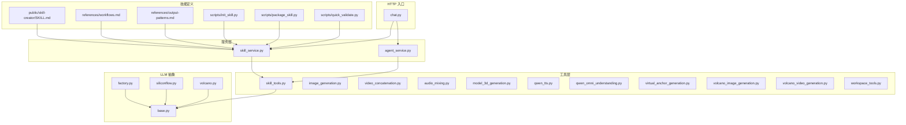
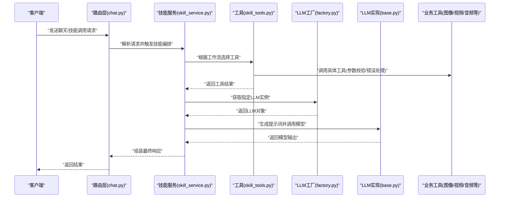
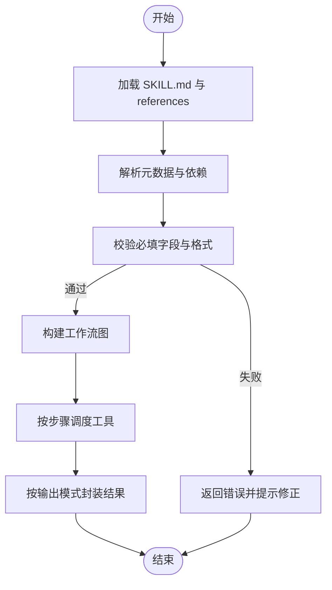
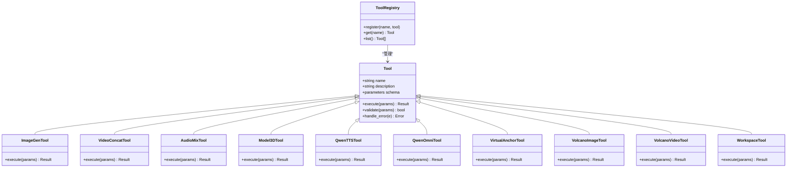
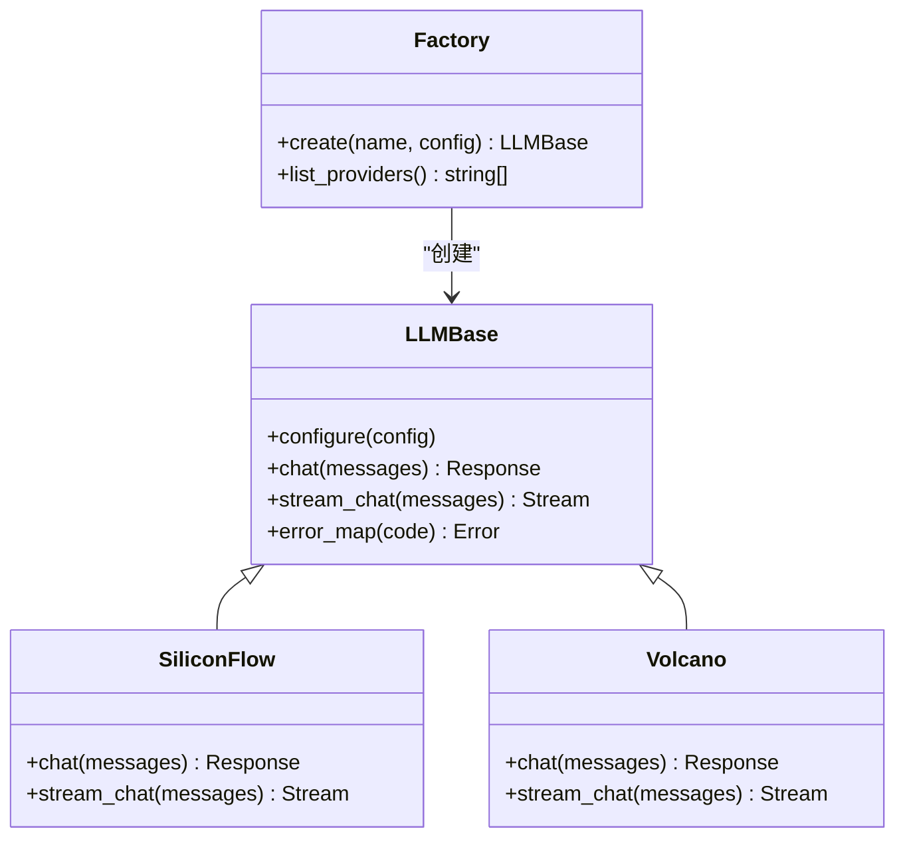
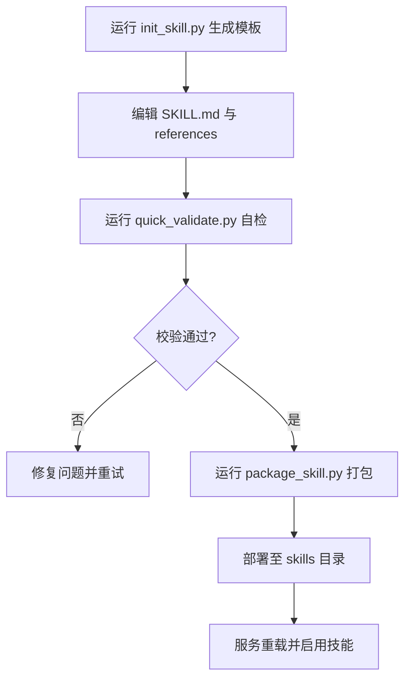
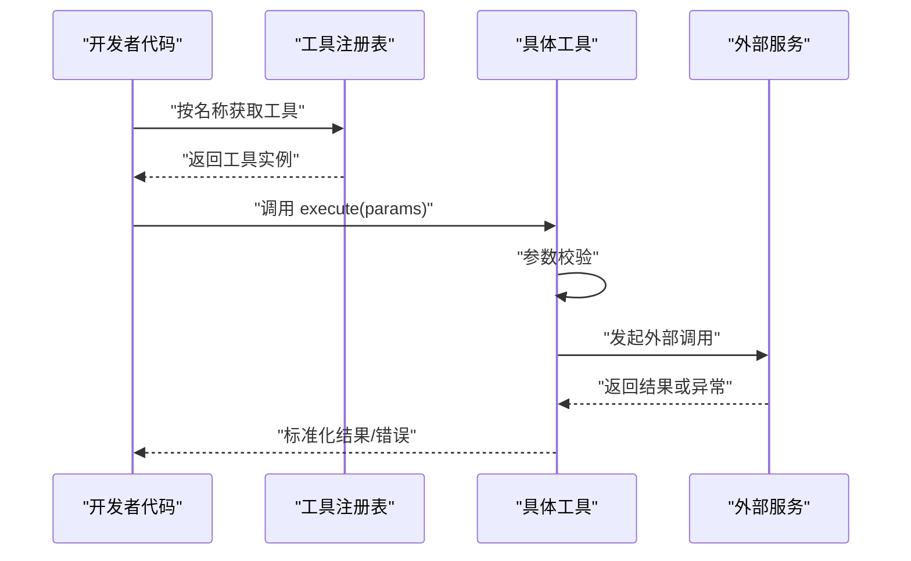
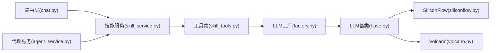

# 扩展机制

<cite>
**本文引用的文件**   
- [backend/app/main.py](file://backend/app/main.py)
- [backend/app/services/skill_service.py](file://backend/app/services/skill_service.py)
- [backend/app/tools/skill_tools.py](file://backend/app/tools/skill_tools.py)
- [backend/skills/public/skill-creator/SKILL.md](file://backend/skills/public/skill-creator/SKILL.md)
- [backend/skills/public/skill-creator/scripts/init_skill.py](file://backend/skills/public/skill-creator/scripts/init_skill.py)
- [backend/skills/public/skill-creator/scripts/package_skill.py](file://backend/skills/public/skill-creator/scripts/package_skill.py)
- [backend/skills/public/skill-creator/scripts/quick_validate.py](file://backend/skills/public/skill-creator/scripts/quick_validate.py)
- [backend/skills/public/skill-creator/references/workflows.md](file://backend/skills/public/skill-creator/references/workflows.md)
- [backend/skills/public/skill-creator/references/output-patterns.md](file://backend/skills/public/skill-creator/references/output-patterns.md)
- [backend/app/llm/base.py](file://backend/app/llm/base.py)
- [backend/app/llm/factory.py](file://backend/app/llm/factory.py)
- [backend/app/llm/siliconflow.py](file://backend/app/llm/siliconflow.py)
- [backend/app/llm/volcano.py](file://backend/app/llm/volcano.py)
- [backend/app/routers/chat.py](file://backend/app/routers/chat.py)
- [backend/app/services/agent_service.py](file://backend/app/services/agent_service.py)
- [backend/workspace/TOOLS.md](file://backend/workspace/TOOLS.md)
- [backend/workspace/AGENTS.md](file://backend/workspace/AGENTS.md)
- [backend/workspace/MEMORY.md](file://backend/workspace/MEMORY.md)
- [backend/workspace/SOUL.md](file://backend/workspace/SOUL.md)
- [backend/workspace/USER.md](file://backend/workspace/USER.md)
- [backend/workspace/IDENTITY.md](file://backend/workspace/IDENTITY.md)
- [backend/app/tools/image_generation.py](file://backend/app/tools/image_generation.py)
- [backend/app/tools/video_concatenation.py](file://backend/app/tools/video_concatenation.py)
- [backend/app/tools/audio_mixing.py](file://backend/app/tools/audio_mixing.py)
- [backend/app/tools/model_3d_generation.py](file://backend/app/tools/model_3d_generation.py)
- [backend/app/tools/qwen_tts.py](file://backend/app/tools/qwen_tts.py)
- [backend/app/tools/qwen_omni_understanding.py](file://backend/app/tools/qwen_omni_understanding.py)
- [backend/app/tools/virtual_anchor_generation.py](file://backend/app/tools/virtual_anchor_generation.py)
- [backend/app/tools/volcano_image_generation.py](file://backend/app/tools/volcano_image_generation.py)
- [backend/app/tools/volcano_video_generation.py](file://backend/app/tools/volcano_video_generation.py)
- [backend/app/tools/workspace_tools.py](file://backend/app/tools/workspace_tools.py)
</cite>

## 目录
1. [简介](#简介)
2. [项目结构](#项目结构)
3. [核心组件](#核心组件)
4. [架构总览](#架构总览)
5. [详细组件分析](#详细组件分析)
6. [依赖关系分析](#依赖关系分析)
7. [性能考量](#性能考量)
8. [故障排查指南](#故障排查指南)
9. [结论](#结论)
10. [附录](#附录)

## 简介
本文件面向希望基于 PolyStudio 进行扩展的开发者，系统性阐述技能系统、工具注册与发现、LLM 提供商抽象接口、第三方服务集成最佳实践，以及自定义技能开发与发布流程。文档同时提供版本兼容性与依赖管理策略建议，帮助你在不破坏现有能力的前提下持续演进系统。

## 项目结构
PolyStudio 后端采用模块化分层组织：路由层负责 HTTP 入口，服务层编排业务逻辑，工具层提供可被 LLM 调用的原子能力，LLM 抽象层统一不同厂商模型接入，skills 目录承载技能定义与模板脚本。

图表来源
- [backend/app/routers/chat.py](file://backend/app/routers/chat.py)
- [backend/app/services/skill_service.py](file://backend/app/services/skill_service.py)
- [backend/app/services/agent_service.py](file://backend/app/services/agent_service.py)
- [backend/app/tools/skill_tools.py](file://backend/app/tools/skill_tools.py)
- [backend/app/llm/base.py](file://backend/app/llm/base.py)
- [backend/app/llm/factory.py](file://backend/app/llm/factory.py)
- [backend/app/llm/siliconflow.py](file://backend/app/llm/siliconflow.py)
- [backend/app/llm/volcano.py](file://backend/app/llm/volcano.py)
- [backend/skills/public/skill-creator/SKILL.md](file://backend/skills/public/skill-creator/SKILL.md)
- [backend/skills/public/skill-creator/references/workflows.md](file://backend/skills/public/skill-creator/references/workflows.md)
- [backend/skills/public/skill-creator/references/output-patterns.md](file://backend/skills/public/skill-creator/references/output-patterns.md)
- [backend/skills/public/skill-creator/scripts/init_skill.py](file://backend/skills/public/skill-creator/scripts/init_skill.py)
- [backend/skills/public/skill-creator/scripts/package_skill.py](file://backend/skills/public/skill-creator/scripts/package_skill.py)
- [backend/skills/public/skill-creator/scripts/quick_validate.py](file://backend/skills/public/skill-creator/scripts/quick_validate.py)

章节来源
- [backend/app/main.py](file://backend/app/main.py)
- [backend/app/routers/chat.py](file://backend/app/routers/chat.py)
- [backend/app/services/skill_service.py](file://backend/app/services/skill_service.py)
- [backend/app/services/agent_service.py](file://backend/app/services/agent_service.py)
- [backend/app/tools/skill_tools.py](file://backend/app/tools/skill_tools.py)
- [backend/app/llm/base.py](file://backend/app/llm/base.py)
- [backend/app/llm/factory.py](file://backend/app/llm/factory.py)
- [backend/app/llm/siliconflow.py](file://backend/app/llm/siliconflow.py)
- [backend/app/llm/volcano.py](file://backend/app/llm/volcano.py)
- [backend/skills/public/skill-creator/SKILL.md](file://backend/skills/public/skill-creator/SKILL.md)
- [backend/skills/public/skill-creator/references/workflows.md](file://backend/skills/public/skill-creator/references/workflows.md)
- [backend/skills/public/skill-creator/references/output-patterns.md](file://backend/skills/public/skill-creator/references/output-patterns.md)
- [backend/skills/public/sroll-creator/scripts/init_skill.py](file://backend/skills/public/skill-creator/scripts/init_skill.py)
- [backend/skills/public/skill-creator/scripts/package_skill.py](file://backend/skills/public/skill-creator/scripts/package_skill.py)
- [backend/skills/public/skill-creator/scripts/quick_validate.py](file://backend/skills/public/skill-creator/scripts/quick_validate.py)

## 核心组件
- 技能服务（Skill Service）：负责加载、解析、编排技能；读取 SKILL.md 与工作流参考；驱动工具执行。
- 工具集（Tools）：以函数或类形式暴露给 LLM 调用，包含参数校验、错误处理与结果封装。
- LLM 抽象（LLM Base/Factories）：统一对话/补全接口，工厂按名称选择具体实现。
- 技能创建器（Skill Creator）：提供初始化、打包、快速校验等脚本，辅助开发、验证与分发技能包。

章节来源
- [backend/app/services/skill_service.py](file://backend/app/services/skill_service.py)
- [backend/app/tools/skill_tools.py](file://backend/app/tools/skill_tools.py)
- [backend/app/llm/base.py](file://backend/app/llm/base.py)
- [backend/app/llm/factory.py](file://backend/app/llm/factory.py)
- [backend/skills/public/skill-creator/SKILL.md](file://backend/skills/public/skill-creator/SKILL.md)
- [backend/skills/public/skill-creator/references/workflows.md](file://backend/skills/public/skill-creator/references/workflows.md)
- [backend/skills/public/skill-creator/references/output-patterns.md](file://backend/skills/public/skill-creator/references/output-patterns.md)
- [backend/skills/public/skill-creator/scripts/init_skill.py](file://backend/skills/public/skill-creator/scripts/init_skill.py)
- [backend/skills/public/skill-creator/scripts/package_skill.py](file://backend/skills/public/skill-creator/scripts/package_skill.py)
- [backend/skills/public/skill-creator/scripts/quick_validate.py](file://backend/skills/public/skill-creator/scripts/quick_validate.py)

## 架构总览
下图展示了从 HTTP 请求到技能编排、工具调用与 LLM 交互的整体流程。

图表来源
- [backend/app/routers/chat.py](file://backend/app/routers/chat.py)
- [backend/app/services/skill_service.py](file://backend/app/services/skill_service.py)
- [backend/app/tools/skill_tools.py](file://backend/app/tools/skill_tools.py)
- [backend/app/llm/factory.py](file://backend/app/llm/factory.py)
- [backend/app/llm/base.py](file://backend/app/llm/base.py)
- [backend/app/tools/image_generation.py](file://backend/app/tools/image_generation.py)
- [backend/app/tools/video_concatenation.py](file://backend/app/tools/video_concatenation.py)
- [backend/app/tools/audio_mixing.py](file://backend/app/tools/audio_mixing.py)
- [backend/app/tools/model_3d_generation.py](file://backend/app/tools/model_3d_generation.py)
- [backend/app/tools/qwen_tts.py](file://backend/app/tools/qwen_tts.py)
- [backend/app/tools/qwen_omni_understanding.py](file://backend/app/tools/qwen_omni_understanding.py)
- [backend/app/tools/virtual_anchor_generation.py](file://backend/app/tools/virtual_anchor_generation.py)
- [backend/app/tools/volcano_image_generation.py](file://backend/app/tools/volcano_image_generation.py)
- [backend/app/tools/volcano_video_generation.py](file://backend/app/tools/volcano_video_generation.py)
- [backend/app/tools/workspace_tools.py](file://backend/app/tools/workspace_tools.py)

## 详细组件分析

### 技能系统与 SKILL.md 规范
- 目标：通过声明式描述让 LLM 理解“何时使用哪些工具”、“如何组合工作流”、“输出应遵循何种模式”。
- 关键要素：
  - 元数据：名称、版本、作者、许可证、描述、依赖等。
  - 能力边界：输入约束、前置条件、失败回退策略。
  - 工作流：步骤序列、分支条件、循环与重试。
  - 输出模式：结构化字段、JSON Schema、示例片段。
- 参考位置：
  - 技能主定义：[SKILL.md](file://backend/skills/public/skill-creator/SKILL.md)
  - 工作流参考：[workflows.md](file://backend/skills/public/skill-creator/references/workflows.md)
  - 输出模式参考：[output-patterns.md](file://backend/skills/public/skill-creator/references/output-patterns.md)

图表来源
- [backend/skills/public/skill-creator/SKILL.md](file://backend/skills/public/skill-creator/SKILL.md)
- [backend/skills/public/skill-creator/references/workflows.md](file://backend/skills/public/skill-creator/references/workflows.md)
- [backend/skills/public/skill-creator/references/output-patterns.md](file://backend/skills/public/skill-creator/references/output-patterns.md)
- [backend/app/services/skill_service.py](file://backend/app/services/skill_service.py)

章节来源
- [backend/skills/public/skill-creator/SKILL.md](file://backend/skills/public/skill-creator/SKILL.md)
- [backend/skills/public/skill-creator/references/workflows.md](file://backend/skills/public/skill-creator/references/workflows.md)
- [backend/skills/public/skill-creator/references/output-patterns.md](file://backend/skills/public/skill-creator/references/output-patterns.md)
- [backend/app/services/skill_service.py](file://backend/app/services/skill_service.py)

### 工具注册与发现机制
- 设计要点：
  - 统一接口：每个工具需提供名称、描述、参数签名、类型与校验规则、错误码与异常映射。
  - 注册表：集中维护工具清单，支持按标签/类别检索。
  - 发现策略：启动时扫描工具模块，动态注册；运行时按名称查找。
  - 参数校验：在调用前对入参进行类型与范围检查，失败即短路返回。
  - 错误处理：将外部异常转换为标准错误结构，便于上层统一处理。
- 参考位置：
  - 工具集合入口：[skill_tools.py](file://backend/app/tools/skill_tools.py)
  - 典型工具示例：
    - [image_generation.py](file://backend/app/tools/image_generation.py)
    - [video_concatenation.py](file://backend/app/tools/video_concatenation.py)
    - [audio_mixing.py](file://backend/app/tools/audio_mixing.py)
    - [model_3d_generation.py](file://backend/app/tools/model_3d_generation.py)
    - [qwen_tts.py](file://backend/app/tools/qwen_tts.py)
    - [qwen_omni_understanding.py](file://backend/app/tools/qwen_omni_understanding.py)
    - [virtual_anchor_generation.py](file://backend/app/tools/virtual_anchor_generation.py)
    - [volcano_image_generation.py](file://backend/app/tools/volcano_image_generation.py)
    - [volcano_video_generation.py](file://backend/app/tools/volcano_video_generation.py)
    - [workspace_tools.py](file://backend/app/tools/workspace_tools.py)

图表来源
- [backend/app/tools/skill_tools.py](file://backend/app/tools/skill_tools.py)
- [backend/app/tools/image_generation.py](file://backend/app/tools/image_generation.py)
- [backend/app/tools/video_concatenation.py](file://backend/app/tools/video_concatenation.py)
- [backend/app/tools/audio_mixing.py](file://backend/app/tools/audio_mixing.py)
- [backend/app/tools/model_3d_generation.py](file://backend/app/tools/model_3d_generation.py)
- [backend/app/tools/qwen_tts.py](file://backend/app/tools/qwen_tts.py)
- [backend/app/tools/qwen_omni_understanding.py](file://backend/app/tools/qwen_omni_understanding.py)
- [backend/app/tools/virtual_anchor_generation.py](file://backend/app/tools/virtual_anchor_generation.py)
- [backend/app/tools/volcano_image_generation.py](file://backend/app/tools/volcano_image_generation.py)
- [backend/app/tools/volcano_video_generation.py](file://backend/app/tools/volcano_video_generation.py)
- [backend/app/tools/workspace_tools.py](file://backend/app/tools/workspace_tools.py)

章节来源
- [backend/app/tools/skill_tools.py](file://backend/app/tools/skill_tools.py)
- [backend/app/tools/image_generation.py](file://backend/app/tools/image_generation.py)
- [backend/app/tools/video_concatenation.py](file://backend/app/tools/video_concatenation.py)
- [backend/app/tools/audio_mixing.py](file://backend/app/tools/audio_mixing.py)
- [backend/app/tools/model_3d_generation.py](file://backend/app/tools/model_3d_generation.py)
- [backend/app/tools/qwen_tts.py](file://backend/app/tools/qwen_tts.py)
- [backend/app/tools/qwen_omni_understanding.py](file://backend/app/tools/qwen_omni_understanding.py)
- [backend/app/tools/virtual_anchor_generation.py](file://backend/app/tools/virtual_anchor_generation.py)
- [backend/app/tools/volcano_image_generation.py](file://backend/app/tools/volcano_image_generation.py)
- [backend/app/tools/volcano_video_generation.py](file://backend/app/tools/volcano_video_generation.py)
- [backend/app/tools/workspace_tools.py](file://backend/app/tools/workspace_tools.py)

### LLM 提供商抽象与扩展
- 抽象接口：
  - 统一方法：对话/补全、流式输出、错误码映射、超时与重试策略。
  - 配置项：API Key、Base URL、模型名、温度、最大长度等。
- 工厂模式：
  - 按名称选择具体实现，支持热插拔新厂商。
- 已有实现：
  - SiliconFlow、火山引擎等。
- 扩展方式：
  - 新增实现类继承基类，注册到工厂；在配置中启用。

图表来源
- [backend/app/llm/base.py](file://backend/app/llm/base.py)
- [backend/app/llm/factory.py](file://backend/app/llm/factory.py)
- [backend/app/llm/siliconflow.py](file://backend/app/llm/siliconflow.py)
- [backend/app/llm/volcano.py](file://backend/app/llm/volcano.py)

章节来源
- [backend/app/llm/base.py](file://backend/app/llm/base.py)
- [backend/app/llm/factory.py](file://backend/app/llm/factory.py)
- [backend/app/llm/siliconflow.py](file://backend/app/llm/siliconflow.py)
- [backend/app/llm/volcano.py](file://backend/app/llm/volcano.py)

### 第三方服务集成最佳实践
- 安全：密钥与敏感信息通过环境变量注入，避免硬编码。
- 容错：网络重试、熔断降级、超时控制与幂等性保障。
- 观测：记录关键指标（耗时、成功率、错误码分布），便于定位问题。
- 适配：为外部 API 建立适配器层，屏蔽差异，保持内部一致。
- 参考位置：
  - 工作空间工具（文件/资源访问）：[workspace_tools.py](file://backend/app/tools/workspace_tools.py)
  - 工作区说明（权限与路径约定）：[TOOLS.md](file://backend/workspace/TOOLS.md)、[AGENTS.md](file://backend/workspace/AGENTS.md)、[MEMORY.md](file://backend/workspace/MEMORY.md)、[SOUL.md](file://backend/workspace/SOUL.md)、[USER.md](file://backend/workspace/USER.md)、[IDENTITY.md](file://backend/workspace/IDENTITY.md)

章节来源
- [backend/app/tools/workspace_tools.py](file://backend/app/tools/workspace_tools.py)
- [backend/workspace/TOOLS.md](file://backend/workspace/TOOLS.md)
- [backend/workspace/AGENTS.md](file://backend/workspace/AGENTS.md)
- [backend/workspace/MEMORY.md](file://backend/workspace/MEMORY.md)
- [backend/workspace/SOUL.md](file://backend/workspace/SOUL.md)
- [backend/workspace/USER.md](file://backend/workspace/USER.md)
- [backend/workspace/IDENTITY.md](file://backend/workspace/IDENTITY.md)

### 自定义技能开发教程（从模板到发布）
- 初始化技能：
  - 使用初始化脚本生成最小可用模板，包含 SKILL.md、references、scripts 等。
  - 参考：[init_skill.py](file://backend/skills/public/skill-creator/scripts/init_skill.py)
- 编写 SKILL.md：
  - 明确元数据、能力边界、工作流步骤、输出模式与错误回退。
  - 参考：[SKILL.md](file://backend/skills/public/skill-creator/SKILL.md)、[workflows.md](file://backend/skills/public/skill-creator/references/workflows.md)、[output-patterns.md](file://backend/skills/public/skill-creator/references/output-patterns.md)
- 本地验证：
  - 使用快速校验脚本检查语法、必填字段与引用完整性。
  - 参考：[quick_validate.py](file://backend/skills/public/skill-creator/scripts/quick_validate.py)
- 打包与分发：
  - 使用打包脚本生成可分发的技能包，确保依赖与资源齐全。
  - 参考：[package_skill.py](file://backend/skills/public/skill-creator/scripts/package_skill.py)
- 部署与启用：
  - 将技能放置于 skills 目录，重启服务后由技能服务自动加载。
  - 参考：[skill_service.py](file://backend/app/services/skill_service.py)

图表来源
- [backend/skills/public/skill-creator/scripts/init_skill.py](file://backend/skills/public/sroll-creator/scripts/init_skill.py)
- [backend/skills/public/skill-creator/SKILL.md](file://backend/skills/public/skill-creator/SKILL.md)
- [backend/skills/public/skill-creator/references/workflows.md](file://backend/skills/public/skill-creator/references/workflows.md)
- [backend/skills/public/skill-creator/references/output-patterns.md](file://backend/skills/public/sroll-creator/references/output-patterns.md)
- [backend/skills/public/skill-creator/scripts/quick_validate.py](file://backend/skills/public/skill-creator/scripts/quick_validate.py)
- [backend/skills/public/skill-creator/scripts/package_skill.py](file://backend/skills/public/skill-creator/scripts/package_skill.py)
- [backend/app/services/skill_service.py](file://backend/app/services/skill_service.py)

章节来源
- [backend/skills/public/skill-creator/scripts/init_skill.py](file://backend/skills/public/skill-creator/scripts/init_skill.py)
- [backend/skills/public/skill-creator/SKILL.md](file://backend/skills/public/skill-creator/SKILL.md)
- [backend/skills/public/skill-creator/references/workflows.md](file://backend/skills/public/skill-creator/references/workflows.md)
- [backend/skills/public/skill-creator/references/output-patterns.md](file://backend/skills/public/skill-creator/references/output-patterns.md)
- [backend/skills/public/skill-creator/scripts/quick_validate.py](file://backend/skills/public/skill-creator/scripts/quick_validate.py)
- [backend/skills/public/skill-creator/scripts/package_skill.py](file://backend/skills/public/skill-creator/scripts/package_skill.py)
- [backend/app/services/skill_service.py](file://backend/app/services/skill_service.py)

### 工具开发指南与 SDK 使用示例
- 开发步骤：
  - 定义工具元信息（名称、描述、参数 Schema）。
  - 实现 execute 方法，完成参数校验、业务调用与结果封装。
  - 注册到工具注册表，供技能与服务层发现与调用。
  - 添加单元测试与错误用例，覆盖常见异常路径。
- SDK 使用示例（概念流程）：
  - 导入工具注册表，按名称获取工具实例。
  - 构造参数对象，调用 execute。
  - 捕获并处理标准错误结构，必要时重试或降级。
- 参考位置：
  - 工具集合入口：[skill_tools.py](file://backend/app/tools/skill_tools.py)
  - 示例工具：
    - [image_generation.py](file://backend/app/tools/image_generation.py)
    - [video_concatenation.py](file://backend/app/tools/video_concatenation.py)
    - [audio_mixing.py](file://backend/app/tools/audio_mixing.py)
    - [model_3d_generation.py](file://backend/app/tools/model_3d_generation.py)
    - [qwen_tts.py](file://backend/app/tools/qwen_tts.py)
    - [qwen_omni_understanding.py](file://backend/app/tools/qwen_omni_understanding.py)
    - [virtual_anchor_generation.py](file://backend/app/tools/virtual_anchor_generation.py)
    - [volcano_image_generation.py](file://backend/app/tools/volcano_image_generation.py)
    - [volcano_video_generation.py](file://backend/app/tools/volcano_video_generation.py)
    - [workspace_tools.py](file://backend/app/tools/workspace_tools.py)

图表来源
- [backend/app/tools/skill_tools.py](file://backend/app/tools/skill_tools.py)
- [backend/app/tools/image_generation.py](file://backend/app/tools/image_generation.py)
- [backend/app/tools/video_concatenation.py](file://backend/app/tools/video_concatenation.py)
- [backend/app/tools/audio_mixing.py](file://backend/app/tools/audio_mixing.py)
- [backend/app/tools/model_3d_generation.py](file://backend/app/tools/model_3d_generation.py)
- [backend/app/tools/qwen_tts.py](file://backend/app/tools/qwen_tts.py)
- [backend/app/tools/qwen_omni_understanding.py](file://backend/app/tools/qwen_omni_understanding.py)
- [backend/app/tools/virtual_anchor_generation.py](file://backend/app/tools/virtual_anchor_generation.py)
- [backend/app/tools/volcano_image_generation.py](file://backend/app/tools/volcano_image_generation.py)
- [backend/app/tools/volcano_video_generation.py](file://backend/app/tools/volcano_video_generation.py)
- [backend/app/tools/workspace_tools.py](file://backend/app/tools/workspace_tools.py)

章节来源
- [backend/app/tools/skill_tools.py](file://backend/app/tools/skill_tools.py)
- [backend/app/tools/image_generation.py](file://backend/app/tools/image_generation.py)
- [backend/app/tools/video_concatenation.py](file://backend/app/tools/video_concatenation.py)
- [backend/app/tools/audio_mixing.py](file://backend/app/tools/audio_mixing.py)
- [backend/app/tools/model_3d_generation.py](file://backend/app/tools/model_3d_generation.py)
- [backend/app/tools/qwen_tts.py](file://backend/app/tools/qwen_tts.py)
- [backend/app/tools/qwen_omni_understanding.py](file://backend/app/tools/qwen_omni_understanding.py)
- [backend/app/tools/virtual_anchor_generation.py](file://backend/app/tools/virtual_anchor_generation.py)
- [backend/app/tools/volcano_image_generation.py](file://backend/app/tools/volcano_image_generation.py)
- [backend/app/tools/volcano_video_generation.py](file://backend/app/tools/volcano_video_generation.py)
- [backend/app/tools/workspace_tools.py](file://backend/app/tools/workspace_tools.py)

## 依赖关系分析
- 组件耦合：
  - 路由层仅依赖服务层，服务层依赖工具与 LLM 抽象，降低横向耦合。
  - 工具之间尽量无直接依赖，通过注册表解耦。
- 外部依赖：
  - LLM 厂商 SDK、音视频处理库、3D 生成服务等，均通过适配器隔离。
- 潜在风险：
  - 工具注册表单点，需考虑并发安全与热更新。
  - LLM 工厂需保证配置一致性，避免重复创建实例。

图表来源
- [backend/app/routers/chat.py](file://backend/app/routers/chat.py)
- [backend/app/services/agent_service.py](file://backend/app/services/agent_service.py)
- [backend/app/services/skill_service.py](file://backend/app/services/skill_service.py)
- [backend/app/tools/skill_tools.py](file://backend/app/tools/skill_tools.py)
- [backend/app/llm/factory.py](file://backend/app/llm/factory.py)
- [backend/app/llm/base.py](file://backend/app/llm/base.py)
- [backend/app/llm/siliconflow.py](file://backend/app/llm/siliconflow.py)
- [backend/app/llm/volcano.py](file://backend/app/llm/volcano.py)

章节来源
- [backend/app/routers/chat.py](file://backend/app/routers/chat.py)
- [backend/app/services/agent_service.py](file://backend/app/services/agent_service.py)
- [backend/app/services/skill_service.py](file://backend/app/services/skill_service.py)
- [backend/app/tools/skill_tools.py](file://backend/app/tools/skill_tools.py)
- [backend/app/llm/factory.py](file://backend/app/llm/factory.py)
- [backend/app/llm/base.py](file://backend/app/llm/base.py)
- [backend/app/llm/siliconflow.py](file://backend/app/llm/siliconflow.py)
- [backend/app/llm/volcano.py](file://backend/app/llm/volcano.py)

## 性能考量
- 工具侧：
  - 批量操作优先，减少 I/O 往返。
  - 缓存热点结果，避免重复计算。
  - 异步化长耗时任务，配合队列与回调。
- LLM 侧：
  - 合理设置温度与最大长度，控制输出体积。
  - 流式输出降低首字节延迟。
  - 连接池复用，避免频繁握手。
- 服务侧：
  - 限流与熔断保护下游。
  - 监控关键指标（P95/P99 延迟、错误率、吞吐）。

## 故障排查指南
- 常见问题：
  - 工具未注册或名称不一致导致找不到工具。
  - 参数校验失败，检查 Schema 与实际传入值。
  - LLM 调用超时或鉴权失败，核对配置与网络连通性。
  - 技能工作流步骤缺失或引用错误，检查 SKILL.md 与 references。
- 定位手段：
  - 查看日志与错误码映射，结合上游调用链。
  - 使用快速校验脚本预检技能定义。
  - 逐步禁用工具或 LLM 实现，缩小问题范围。

章节来源
- [backend/app/tools/skill_tools.py](file://backend/app/tools/skill_tools.py)
- [backend/app/llm/base.py](file://backend/app/llm/base.py)
- [backend/app/llm/factory.py](file://backend/app/llm/factory.py)
- [backend/skills/public/skill-creator/SKILL.md](file://backend/skills/public/skill-creator/SKILL.md)
- [backend/skills/public/skill-creator/references/workflows.md](file://backend/skills/public/skill-creator/references/workflows.md)
- [backend/skills/public/skill-creator/references/output-patterns.md](file://backend/skills/public/skill-creator/references/output-patterns.md)

## 结论
PolyStudio 的扩展机制围绕“技能声明 + 工具注册 + LLM 抽象”展开，具备清晰的职责边界与良好的可扩展性。通过标准化的 SKILL.md、完善的工具接口与工厂模式，开发者可以快速构建、验证与发布技能，并以最小代价接入新的 LLM 与第三方服务。建议在迭代过程中强化测试与观测，持续提升稳定性与可维护性。

## 附录
- 版本兼容性与依赖管理策略（建议）：
  - 语义化版本：对工具与技能定义采用主/次/补丁版本，重大变更提升主版本。
  - 向后兼容：新增字段默认值，废弃字段保留过渡期。
  - 依赖锁定：固定第三方库版本，定期安全扫描与升级。
  - 灰度发布：先小流量验证，再全量上线。
  - 回滚预案：保留上一版本镜像与配置快照。