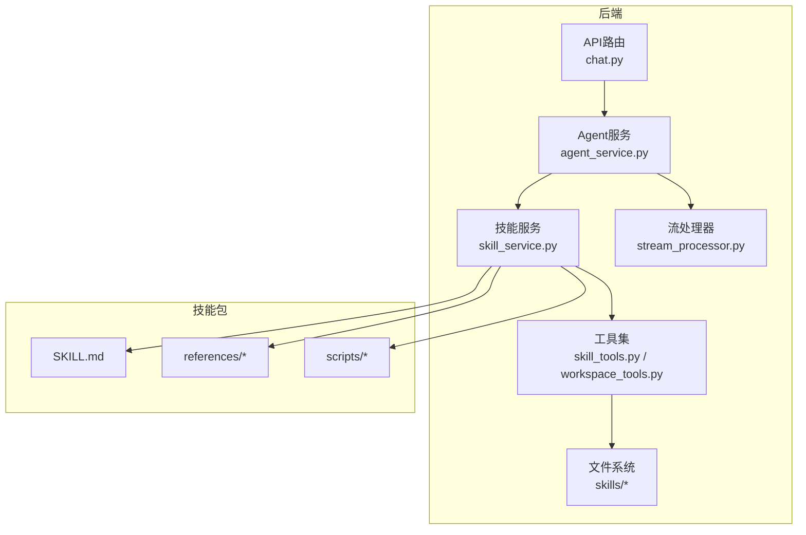
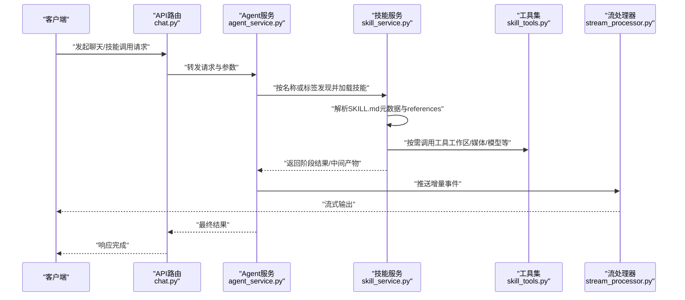
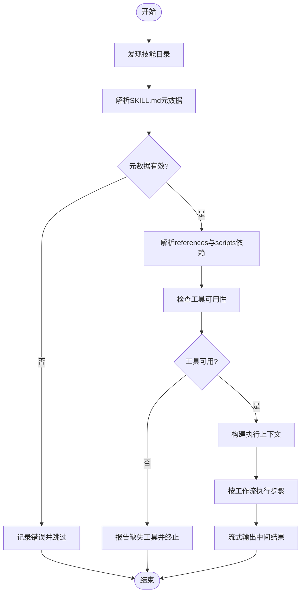
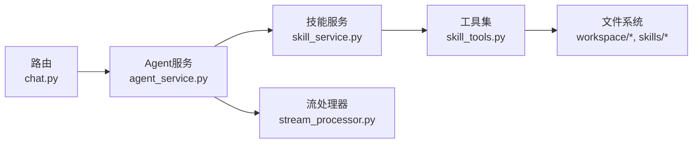

# 技能系统

<cite>
**本文引用的文件**   
- [backend/app/services/skill_service.py](file://backend/app/services/skill_service.py)
- [backend/app/tools/skill_tools.py](file://backend/app/tools/skill_tools.py)
- [backend/skills/public/skill-creator/SKILL.md](file://backend/skills/public/skill-creator/SKILL.md)
- [backend/skills/public/skill-creator/references/workflows.md](file://backend/skills/public/skill-creator/references/workflows.md)
- [backend/skills/public/skill-creator/references/output-patterns.md](file://backend/skills/public/skill-creator/references/output-patterns.md)
- [backend/skills/public/skill-creator/scripts/init_skill.py](file://backend/skills/public/skill-creator/scripts/init_skill.py)
- [backend/skills/public/skill-creator/scripts/package_skill.py](file://backend/skills/public/skill-creator/scripts/package_skill.py)
- [backend/skills/public/skill-creator/scripts/quick_validate.py](file://backend/skills/public/skill-creator/scripts/quick_validate.py)
- [backend/skills/custom/paper-writing/SKILL.md](file://backend/skills/custom/paper-writing/SKILL.md)
- [backend/skills/custom/podcast-creator/SKILL.md](file://backend/skills/custom/podcast-creator/SKILL.md)
- [backend/skills/custom/video-creator/SKILL.md](file://backend/skills/custom/video-creator/SKILL.md)
- [backend/skills/custom/virtual-anchor/SKILL.md](file://backend/skills/custom/virtual-anchor/SKILL.md)
- [backend/skills/custom/xiaohongshu-copywriter/SKILL.md](file://backend/skills/custom/xiaohongshu-copywriter/SKILL.md)
- [backend/skills/custom/paper-writing/references/research_tips.md](file://backend/skills/custom/paper-writing/references/research_tips.md)
- [backend/skills/custom/video-creator/references/storyboard_format.md](file://backend/skills/custom/video-creator/references/storyboard_format.md)
- [backend/skills/custom/xiaohongshu-copywriter/references/xiaohongshu_tags.md](file://backend/skills/custom/xiaohongshu-copywriter/references/xiaohongshu_tags.md)
- [backend/skills/custom/xiaohongshu-copywriter/references/xiaohongshu_template.md](file://backend/skills/custom/xiaohongshu-copywriter/references/xiaohongshu_template.md)
- [backend/app/main.py](file://backend/app/main.py)
- [backend/app/routers/chat.py](file://backend/app/routers/chat.py)
- [backend/app/services/agent_service.py](file://backend/app/services/agent_service.py)
- [backend/app/services/stream_processor.py](file://backend/app/services/stream_processor.py)
- [backend/app/tools/workspace_tools.py](file://backend/app/tools/workspace_tools.py)
- [backend/workspace/AGENTS.md](file://backend/workspace/AGENTS.md)
- [backend/workspace/TOOLS.md](file://backend/workspace/TOOLS.md)
- [polystudio-client/SKILL.md](file://polystudio-client/SKILL.md)
</cite>

## 目录
1. [简介](#简介)
2. [项目结构](#项目结构)
3. [核心组件](#核心组件)
4. [架构总览](#架构总览)
5. [详细组件分析](#详细组件分析)
6. [依赖关系分析](#依赖关系分析)
7. [性能考虑](#性能考虑)
8. [故障排查指南](#故障排查指南)
9. [结论](#结论)
10. [附录](#附录)

## 简介
本文件面向PolyStudio的技能系统，系统性阐述SKILL.md格式规范、技能的加载与执行流程、内置技能的使用方法，以及自定义技能从模板初始化到打包发布的完整教程。文档同时覆盖技能验证工具与调试技巧、版本管理与兼容性策略，帮助开发者快速上手并构建高质量技能。

## 项目结构
技能系统主要位于后端服务中，围绕“技能发现—解析—编排—执行”的闭环展开：
- 技能定义与参考资源：以SKILL.md为核心，配合references/等目录组织工作流、输出模式、素材与提示词等。
- 技能服务层：负责技能发现、元数据解析、依赖解析、上下文注入与执行调度。
- 工具集成：通过工具模块将LLM调用、工作区读写、音视频处理等能力暴露给技能。
- 路由与服务入口：API路由接收请求，交由Agent服务与流处理器协同完成端到端执行。

图表来源
- [backend/app/routers/chat.py](file://backend/app/routers/chat.py)
- [backend/app/services/agent_service.py](file://backend/app/services/agent_service.py)
- [backend/app/services/skill_service.py](file://backend/app/services/skill_service.py)
- [backend/app/tools/skill_tools.py](file://backend/app/tools/skill_tools.py)
- [backend/app/tools/workspace_tools.py](file://backend/app/tools/workspace_tools.py)
- [backend/app/services/stream_processor.py](file://backend/app/services/stream_processor.py)

章节来源
- [backend/app/main.py](file://backend/app/main.py)
- [backend/app/routers/chat.py](file://backend/app/routers/chat.py)
- [backend/app/services/agent_service.py](file://backend/app/services/agent_service.py)
- [backend/app/services/skill_service.py](file://backend/app/services/skill_service.py)
- [backend/app/tools/skill_tools.py](file://backend/app/tools/skill_tools.py)
- [backend/app/tools/workspace_tools.py](file://backend/app/tools/workspace_tools.py)
- [backend/app/services/stream_processor.py](file://backend/app/services/stream_processor.py)

## 核心组件
- 技能服务（Skill Service）
  - 职责：扫描技能目录、解析SKILL.md元数据、解析引用文件、管理执行上下文、编排工作流、协调工具调用。
  - 关键能力：技能发现、依赖解析、上下文注入、工作流编排、错误聚合与重试。
- 工具集（Skill Tools）
  - 职责：为技能提供可复用的原子能力，如工作区读写、文件操作、媒体处理、模型调用封装等。
- 工作区与全局配置
  - 职责：提供Agent身份、工具清单、记忆与用户画像等上下文信息，供技能在执行时读取。
- 流式处理
  - 职责：对长耗时任务进行分片输出，提升交互体验与可观测性。

章节来源
- [backend/app/services/skill_service.py](file://backend/app/services/skill_service.py)
- [backend/app/tools/skill_tools.py](file://backend/app/tools/skill_tools.py)
- [backend/workspace/AGENTS.md](file://backend/workspace/AGENTS.md)
- [backend/workspace/TOOLS.md](file://backend/workspace/TOOLS.md)
- [backend/app/services/stream_processor.py](file://backend/app/services/stream_processor.py)

## 架构总览
下图展示了从HTTP请求到技能执行的端到端流程，包括技能发现、依赖解析、上下文装配、工作流编排与结果返回。

图表来源
- [backend/app/routers/chat.py](file://backend/app/routers/chat.py)
- [backend/app/services/agent_service.py](file://backend/app/services/agent_service.py)
- [backend/app/services/skill_service.py](file://backend/app/services/skill_service.py)
- [backend/app/tools/skill_tools.py](file://backend/app/tools/skill_tools.py)
- [backend/app/services/stream_processor.py](file://backend/app/services/stream_processor.py)

## 详细组件分析

### SKILL.md 格式规范
SKILL.md是技能的声明式描述文件，用于定义元数据、工作流编排与引用文件结构。建议包含以下维度：
- 元数据定义
  - 标识与版本：唯一ID、版本号、兼容范围。
  - 能力描述：功能摘要、适用场景、输入输出约定。
  - 依赖说明：外部工具、环境变量、权限要求。
  - 作者与维护：作者、许可证、更新日志。
- 工作流编排
  - 步骤序列：顺序、条件分支、并行子任务。
  - 输入校验：必填字段、类型约束、默认值。
  - 中间产物：临时文件、缓存键、状态标记。
  - 错误处理：失败重试、降级策略、回滚动作。
- 引用文件结构
  - references/：存放提示词模板、示例、样式规范、素材清单等。
  - scripts/：可选的执行脚本（初始化、打包、校验等）。
  - assets/：可选的资源文件（图片、音频、视频片段等）。

章节来源
- [backend/skills/public/skill-creator/SKILL.md](file://backend/skills/public/skill-creator/SKILL.md)
- [backend/skills/public/skill-creator/references/workflows.md](file://backend/skills/public/skill-creator/references/workflows.md)
- [backend/skills/public/skill-creator/references/output-patterns.md](file://backend/skills/public/skill-creator/references/output-patterns.md)

### 技能加载机制与执行流程
- 技能发现
  - 扫描路径：public/与custom/下的每个技能目录。
  - 识别规则：存在SKILL.md即视为有效技能；支持按标签/类别过滤。
- 元数据解析
  - 解析SKILL.md中的元数据与工作流定义，生成内部表示。
  - 校验必填字段与版本兼容性，不满足则拒绝加载。
- 依赖解析
  - 解析references/与scripts/的依赖关系，确保引用文件存在且可访问。
  - 检查工具可用性（如媒体处理、模型接口），缺失则给出明确错误。
- 上下文管理
  - 注入工作区上下文（用户画像、Agent身份、可用工具清单等）。
  - 维护执行期上下文（会话ID、中间产物、进度状态）。
- 执行编排
  - 按工作流步骤顺序执行，支持条件分支与并行子任务。
  - 使用工具集完成具体操作，并将中间结果持久化或缓存。
  - 通过流处理器向客户端推送增量事件，提高可观测性与用户体验。

图表来源
- [backend/app/services/skill_service.py](file://backend/app/services/skill_service.py)
- [backend/app/tools/skill_tools.py](file://backend/app/tools/skill_tools.py)
- [backend/app/services/stream_processor.py](file://backend/app/services/stream_processor.py)

章节来源
- [backend/app/services/skill_service.py](file://backend/app/services/skill_service.py)
- [backend/app/tools/skill_tools.py](file://backend/app/tools/skill_tools.py)
- [backend/app/services/stream_processor.py](file://backend/app/services/stream_processor.py)

### 内置技能功能与使用方法
- paper-writing（论文写作）
  - 目标：辅助研究思路整理、文献要点提炼、结构化写作。
  - 参考：research_tips.md提供研究与写作建议。
  - 用法：在对话中选择该技能，提供主题与材料，系统将按工作流逐步产出大纲、草稿与修订建议。
- podcast-creator（播客创作）
  - 目标：根据主题生成播客脚本、角色分配与旁白提示。
  - 参考：references下可放置风格模板与术语表。
  - 用法：选择技能后输入主题与时长，系统输出分镜脚本与录制提示。
- video-creator（视频创作）
  - 目标：将创意转化为分镜脚本与素材清单，便于后续制作。
  - 参考：storyboard_format.md定义分镜格式规范。
  - 用法：输入创意与风格偏好，系统输出标准化分镜与素材需求。
- virtual-anchor（虚拟主播）
  - 目标：生成虚拟主播台词、表情与动作提示。
  - 用法：输入文案与风格，系统输出表演脚本与驱动参数。
- xiaohongshu-copywriter（小红书文案）
  - 目标：生成符合平台风格的文案与标签组合。
  - 参考：xiaohongshu_tags.md与xiaohongshu_template.md提供标签库与模板。
  - 用法：输入产品或主题，系统输出多套文案与标签方案。

章节来源
- [backend/skills/custom/paper-writing/SKILL.md](file://backend/skills/custom/paper-writing/SKILL.md)
- [backend/skills/custom/paper-writing/references/research_tips.md](file://backend/skills/custom/paper-writing/references/research_tips.md)
- [backend/skills/custom/podcast-creator/SKILL.md](file://backend/skills/custom/podcast-creator/SKILL.md)
- [backend/skills/custom/video-creator/SKILL.md](file://backend/skills/custom/video-creator/SKILL.md)
- [backend/skills/custom/video-creator/references/storyboard_format.md](file://backend/skills/custom/video-creator/references/storyboard_format.md)
- [backend/skills/custom/virtual-anchor/SKILL.md](file://backend/skills/custom/virtual-anchor/SKILL.md)
- [backend/skills/custom/xiaohongshu-copywriter/SKILL.md](file://backend/skills/custom/xiaohongshu-copywriter/SKILL.md)
- [backend/skills/custom/xiaohongshu-copywriter/references/xiaohongshu_tags.md](file://backend/skills/custom/xiaohongshu-copywriter/references/xiaohongshu_tags.md)
- [backend/skills/custom/xiaohongshu-copywriter/references/xiaohongshu_template.md](file://backend/skills/custom/xiaohongshu-copywriter/references/xiaohongshu_template.md)

### 自定义技能开发教程
- 模板初始化
  - 使用init脚本创建标准目录结构（SKILL.md、references/、scripts/、assets/）。
  - 填写元数据与工作流骨架，确保必填字段齐全。
- 编写工作流与引用
  - 在SKILL.md中定义步骤、输入校验、中间产物与错误处理。
  - 在references/中补充提示词模板、示例与规范。
- 本地验证
  - 使用quick_validate脚本进行语法与依赖校验，修复问题后再继续。
- 打包发布
  - 使用package_skill脚本将技能打包为可分发格式，包含所有必要文件。
  - 将包部署至public/或custom/目录，重启服务或触发热重载以生效。
- 最佳实践
  - 保持SKILL.md简洁清晰，复杂逻辑下沉到references与scripts。
  - 为每个步骤添加明确的输入输出契约，便于复用与测试。
  - 使用流式输出与中间产物记录，提升可观测性与排错效率。

章节来源
- [backend/skills/public/skill-creator/scripts/init_skill.py](file://backend/skills/public/sill-creator/scripts/init_skill.py)
- [backend/skills/public/skill-creator/scripts/quick_validate.py](file://backend/skills/public/skill-creator/scripts/quick_validate.py)
- [backend/skills/public/skill-creator/scripts/package_skill.py](file://backend/skills/public/skill-creator/scripts/package_skill.py)
- [backend/skills/public/skill-creator/SKILL.md](file://backend/skills/public/skill-creator/SKILL.md)
- [backend/skills/public/skill-creator/references/workflows.md](file://backend/skills/public/skill-creator/references/workflows.md)
- [backend/skills/public/skill-creator/references/output-patterns.md](file://backend/skills/public/skill-creator/references/output-patterns.md)

### 技能验证工具与调试技巧
- 验证工具
  - quick_validate：检查SKILL.md语法、必填字段、引用文件完整性与依赖有效性。
  - package_skill：打包前二次校验，确保产物可被系统正确加载。
- 调试技巧
  - 启用流式输出观察中间结果，定位卡点步骤。
  - 在工作区写入调试日志与中间产物快照，便于回溯。
  - 针对工具调用增加重试与超时控制，避免阻塞主流程。
  - 使用最小可复现案例隔离问题，逐步扩大范围。

章节来源
- [backend/skills/public/skill-creator/scripts/quick_validate.py](file://backend/skills/public/skill-creator/scripts/quick_validate.py)
- [backend/skills/public/skill-creator/scripts/package_skill.py](file://backend/skills/public/skill-creator/scripts/package_skill.py)
- [backend/app/services/stream_processor.py](file://backend/app/services/stream_processor.py)
- [backend/app/tools/workspace_tools.py](file://backend/app/tools/workspace_tools.py)

### 版本管理与兼容性策略
- 版本语义
  - 采用主版本.次版本.修订号，主版本变更需保证破坏性兼容。
- 兼容性矩阵
  - 在SKILL.md中声明最低兼容的服务版本与工具版本。
  - 当引入新字段或步骤时，提供默认值与迁移指引。
- 升级策略
  - 向后兼容优先：新增字段不影响旧版解析。
  - 废弃字段保留但标注弃用，至少两个大版本后移除。
  - 提供迁移脚本或参考实现，降低升级成本。

章节来源
- [backend/skills/public/skill-creator/SKILL.md](file://backend/skills/public/skill-creator/SKILL.md)
- [backend/skills/public/skill-creator/references/workflows.md](file://backend/skills/public/skill-creator/references/workflows.md)

## 依赖关系分析
- 组件耦合
  - 技能服务强依赖工具集与工作区上下文，弱依赖路由与流处理器。
  - 工具集对文件系统与外部模型/媒体接口有直接依赖。
- 外部依赖
  - LLM与媒体处理能力通过工具抽象暴露，便于替换与扩展。
- 潜在循环依赖
  - 当前设计分层清晰，未见明显循环依赖；建议在新增工具时遵循单向依赖原则。

图表来源
- [backend/app/routers/chat.py](file://backend/app/routers/chat.py)
- [backend/app/services/agent_service.py](file://backend/app/services/agent_service.py)
- [backend/app/services/skill_service.py](file://backend/app/services/skill_service.py)
- [backend/app/tools/skill_tools.py](file://backend/app/tools/skill_tools.py)
- [backend/app/services/stream_processor.py](file://backend/app/services/stream_processor.py)

章节来源
- [backend/app/routers/chat.py](file://backend/app/routers/chat.py)
- [backend/app/services/agent_service.py](file://backend/app/services/agent_service.py)
- [backend/app/services/skill_service.py](file://backend/app/services/skill_service.py)
- [backend/app/tools/skill_tools.py](file://backend/app/tools/skill_tools.py)
- [backend/app/services/stream_processor.py](file://backend/app/services/stream_processor.py)

## 性能考虑
- 并发与并行
  - 对独立步骤采用并行执行，缩短整体时延。
  - 限制并发度以避免资源争用与下游限流。
- 缓存与中间产物
  - 对计算密集或I/O密集的步骤引入缓存键，减少重复计算。
  - 合理清理中间产物，避免磁盘膨胀。
- 流式输出
  - 将长任务拆分为小片段输出，提升交互体验与可观测性。
- 资源监控
  - 记录关键指标（CPU、内存、I/O、外部调用延迟），用于容量规划与瓶颈定位。

[本节为通用指导，无需特定文件来源]

## 故障排查指南
- 常见问题
  - 技能未加载：检查SKILL.md是否存在且语法正确，确认路径与权限。
  - 依赖缺失：核对references/与scripts/是否完整，运行验证脚本修复。
  - 工具不可用：检查工具注册与环境变量，必要时降级或提示用户安装。
  - 执行超时：调整超时阈值与重试策略，优化步骤粒度。
- 定位方法
  - 查看流式输出与中间产物，定位失败步骤。
  - 在工作区写入详细日志，结合时间戳分析调用链。
  - 使用最小用例复现问题，逐步缩小范围。

章节来源
- [backend/app/services/skill_service.py](file://backend/app/services/skill_service.py)
- [backend/app/tools/skill_tools.py](file://backend/app/tools/skill_tools.py)
- [backend/app/services/stream_processor.py](file://backend/app/services/stream_processor.py)
- [backend/app/tools/workspace_tools.py](file://backend/app/tools/workspace_tools.py)

## 结论
PolyStudio的技能系统以SKILL.md为中心，结合服务层的发现、解析、编排与工具集成，实现了可扩展、可观测、可维护的技能生态。通过规范的元数据与工作流定义、完善的验证与打包工具、清晰的版本与兼容性策略，开发者可以快速构建高质量技能并稳定交付。

[本节为总结性内容，无需特定文件来源]

## 附录
- 相关参考
  - polystudio-client/SKILL.md：客户端侧技能描述参考，便于前后端对齐。
  - workspace/AGENTS.md与TOOLS.md：Agent身份与工具清单，作为技能上下文的基线。

章节来源
- [polystudio-client/SKILL.md](file://polystudio-client/SKILL.md)
- [backend/workspace/AGENTS.md](file://backend/workspace/AGENTS.md)
- [backend/workspace/TOOLS.md](file://backend/workspace/TOOLS.md)