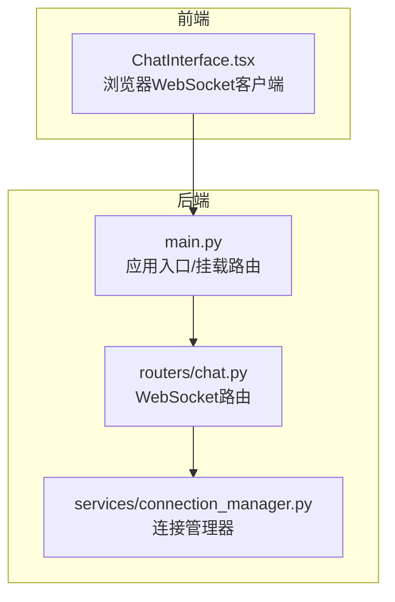
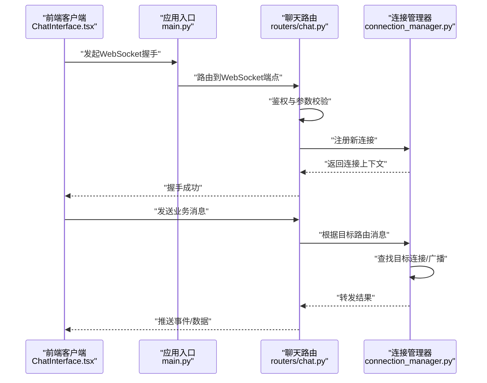
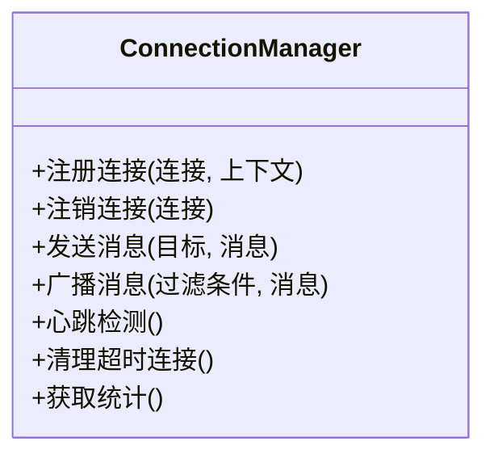
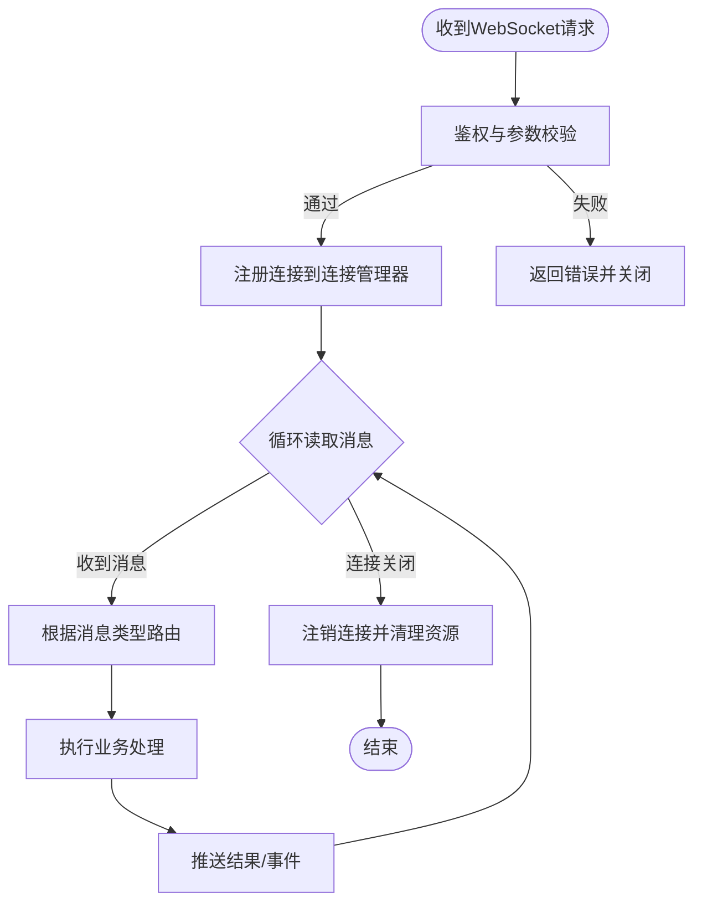
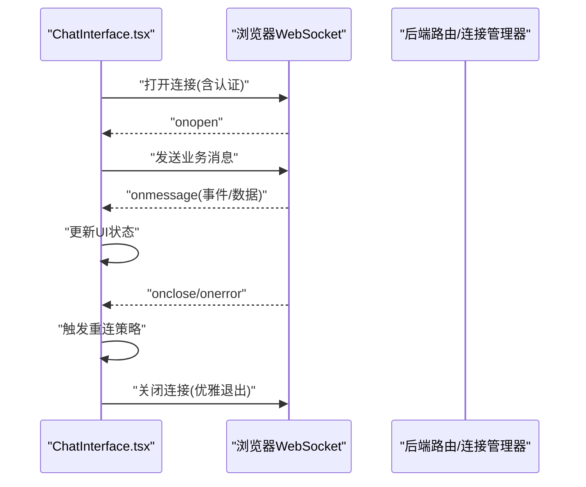
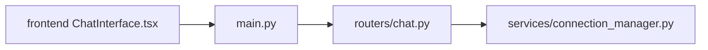
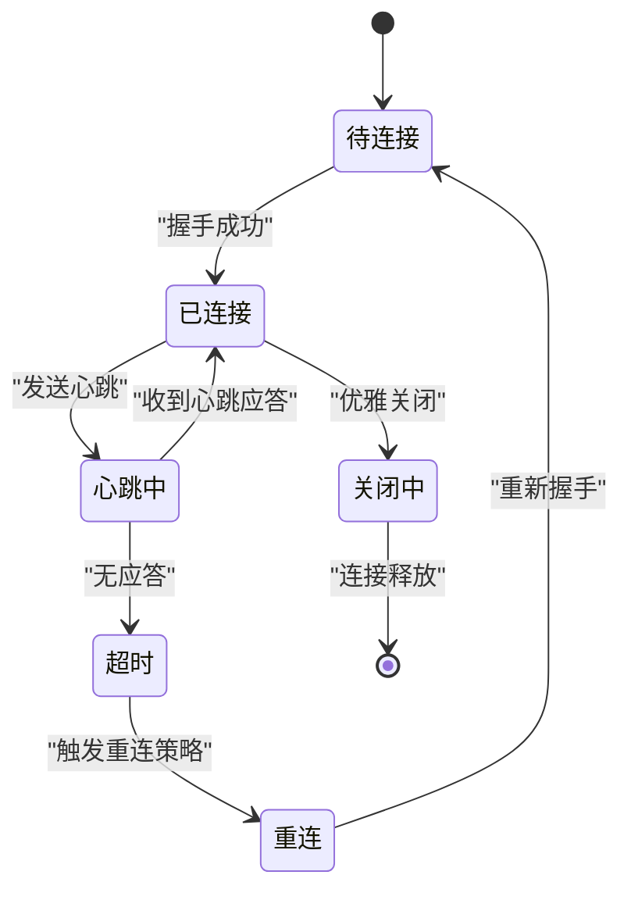

# 实时通信机制

<cite>
**本文引用的文件**   
- [backend/app/services/connection_manager.py](file://backend/app/services/connection_manager.py)
- [backend/app/main.py](file://backend/app/main.py)
- [backend/app/routers/chat.py](file://backend/app/routers/chat.py)
- [frontend/src/components/ChatInterface.tsx](file://frontend/src/components/ChatInterface.tsx)
</cite>

## 目录
1. [简介](#简介)
2. [项目结构](#项目结构)
3. [核心组件](#核心组件)
4. [架构总览](#架构总览)
5. [详细组件分析](#详细组件分析)
6. [依赖关系分析](#依赖关系分析)
7. [性能考量](#性能考量)
8. [故障排查指南](#故障排查指南)
9. [结论](#结论)
10. [附录](#附录)

## 简介
本文件面向PolyStudio的实时通信机制，重点围绕WebSocket连接管理器的实现原理与使用方式展开。内容涵盖：
- WebSocket连接建立、认证验证、消息路由与连接池管理
- 客户端与服务端的双向通信协议（消息格式、事件类型、状态同步）
- 连接生命周期管理（超时处理、断线重连、优雅关闭）
- 并发连接处理与资源管理机制
- 错误处理策略与监控指标收集
- 基于仓库现有代码的连接示例路径指引

## 项目结构
本项目采用前后端分离架构，后端基于Python服务提供WebSocket能力，前端通过浏览器WebSocket API进行双向通信。关键目录与职责如下：
- backend/app/services/connection_manager.py：服务端WebSocket连接管理器，负责连接注册、注销、广播、路由与资源清理
- backend/app/main.py：应用入口，挂载WebSocket路由与中间件
- backend/app/routers/chat.py：聊天相关的路由定义，包含WebSocket端点
- frontend/src/components/ChatInterface.tsx：前端聊天界面，封装WebSocket连接、消息收发与UI状态同步

图表来源
- [backend/app/main.py](file://backend/app/main.py)
- [backend/app/routers/chat.py](file://backend/app/routers/chat.py)
- [backend/app/services/connection_manager.py](file://backend/app/services/connection_manager.py)
- [frontend/src/components/ChatInterface.tsx](file://frontend/src/components/ChatInterface.tsx)

章节来源
- [backend/app/services/connection_manager.py](file://backend/app/services/connection_manager.py)
- [backend/app/main.py](file://backend/app/main.py)
- [backend/app/routers/chat.py](file://backend/app/routers/chat.py)
- [frontend/src/components/ChatInterface.tsx](file://frontend/src/components/ChatInterface.tsx)

## 核心组件
- 连接管理器（ConnectionManager）
  - 职责：维护活跃连接集合、按会话或房间维度路由消息、广播通知、统计与监控、资源回收
  - 关键能力：连接注册/注销、消息分发、心跳检测、超时清理、并发安全访问
- WebSocket路由层（chat路由）
  - 职责：接收HTTP升级请求、鉴权校验、创建并接入连接管理器、绑定消息处理器
- 前端客户端（ChatInterface）
  - 职责：发起WebSocket连接、发送业务消息、订阅事件、处理断线重连与UI状态同步

章节来源
- [backend/app/services/connection_manager.py](file://backend/app/services/connection_manager.py)
- [backend/app/routers/chat.py](file://backend/app/routers/chat.py)
- [frontend/src/components/ChatInterface.tsx](file://frontend/src/components/ChatInterface.tsx)

## 架构总览
下图展示了从浏览器到后端的端到端流程，包括连接建立、认证、消息路由与响应返回。

图表来源
- [backend/app/main.py](file://backend/app/main.py)
- [backend/app/routers/chat.py](file://backend/app/routers/chat.py)
- [backend/app/services/connection_manager.py](file://backend/app/services/connection_manager.py)
- [frontend/src/components/ChatInterface.tsx](file://frontend/src/components/ChatInterface.tsx)

## 详细组件分析

### 连接管理器（ConnectionManager）
- 设计要点
  - 连接池：以字典或映射结构维护活跃连接，支持按会话ID、房间ID等维度索引
  - 并发安全：对共享状态加锁或使用线程安全的队列/数据结构
  - 消息路由：根据消息头中的目标标识选择单播、组播或广播
  - 心跳与超时：周期性检查空闲连接，触发清理与回调
  - 资源回收：在连接断开时释放内存、取消定时任务、更新监控指标
- 典型方法（概念性说明）
  - 注册连接：将新连接加入连接池并初始化上下文
  - 注销连接：从连接池移除并执行清理逻辑
  - 发送消息：根据目标选择路由策略，失败重试与降级
  - 广播消息：向所有或指定分组连接推送事件
  - 心跳检测：维护最近活动时间，判定超时并清理
  - 统计上报：记录连接数、消息吞吐、错误率等指标

图表来源
- [backend/app/services/connection_manager.py](file://backend/app/services/connection_manager.py)

章节来源
- [backend/app/services/connection_manager.py](file://backend/app/services/connection_manager.py)

### WebSocket路由层（聊天路由）
- 职责
  - 接收HTTP升级请求，完成鉴权与参数解析
  - 调用连接管理器注册连接，绑定消息处理器
  - 将业务消息转发给连接管理器进行路由
- 关键流程
  - 握手阶段：校验令牌/会话信息，拒绝非法请求
  - 运行阶段：监听消息事件，按类型分发到不同处理函数
  - 关闭阶段：捕获异常，触发连接注销与资源回收

图表来源
- [backend/app/routers/chat.py](file://backend/app/routers/chat.py)
- [backend/app/services/connection_manager.py](file://backend/app/services/connection_manager.py)

章节来源
- [backend/app/routers/chat.py](file://backend/app/routers/chat.py)
- [backend/app/services/connection_manager.py](file://backend/app/services/connection_manager.py)

### 前端客户端（ChatInterface）
- 职责
  - 建立WebSocket连接，携带必要认证信息
  - 发送业务消息，订阅服务端事件
  - 处理断线重连、消息去重与顺序保证
  - 同步UI状态（如在线人数、消息列表、错误提示）
- 关键流程
  - 连接建立：构造URL与头部，处理握手成功与失败
  - 消息收发：序列化/反序列化消息体，处理ACK/NACK
  - 断线重连：指数退避策略，避免雪崩
  - 优雅关闭：主动关闭前发送退出信号，等待确认

图表来源
- [frontend/src/components/ChatInterface.tsx](file://frontend/src/components/ChatInterface.tsx)

章节来源
- [frontend/src/components/ChatInterface.tsx](file://frontend/src/components/ChatInterface.tsx)

## 依赖关系分析
- 模块耦合
  - main.py仅负责挂载路由与启动服务，低耦合
  - routers/chat.py依赖连接管理器进行连接与消息管理
  - connection_manager.py为独立服务，被路由层与可能的其他模块复用
- 外部依赖
  - 后端：WebSocket框架（如FastAPI/Starlette）、异步I/O库
  - 前端：浏览器原生WebSocket API
- 潜在风险
  - 连接池未加锁导致竞态条件
  - 广播风暴导致带宽与CPU压力
  - 重连风暴导致服务器抖动

图表来源
- [backend/app/main.py](file://backend/app/main.py)
- [backend/app/routers/chat.py](file://backend/app/routers/chat.py)
- [backend/app/services/connection_manager.py](file://backend/app/services/connection_manager.py)
- [frontend/src/components/ChatInterface.tsx](file://frontend/src/components/ChatInterface.tsx)

章节来源
- [backend/app/main.py](file://backend/app/main.py)
- [backend/app/routers/chat.py](file://backend/app/routers/chat.py)
- [backend/app/services/connection_manager.py](file://backend/app/services/connection_manager.py)
- [frontend/src/components/ChatInterface.tsx](file://frontend/src/components/ChatInterface.tsx)

## 性能考量
- 连接池容量与限流
  - 设置最大连接数阈值，超出时拒绝新连接或排队等待
  - 按用户或IP维度限制并发连接数
- 消息批处理与背压
  - 批量合并小消息，降低系统调用开销
  - 当消费者慢时，采用丢弃策略或延迟写入
- 心跳与超时
  - 合理配置心跳间隔与超时时间，平衡及时性与资源占用
- 广播优化
  - 针对热点房间使用增量推送或分片广播
  - 对大消息进行压缩传输
- 监控与告警
  - 采集连接数、消息吞吐、错误率、平均延迟等指标
  - 设置阈值告警，及时发现异常

[本节为通用指导，不直接分析具体文件]

## 故障排查指南
- 常见问题
  - 握手失败：检查鉴权参数、跨域配置、证书与端口
  - 频繁断线：检查网络质量、心跳配置、服务端负载
  - 消息丢失：检查消息序列号、ACK机制、重放保护
  - 广播风暴：检查订阅范围、消息大小、扇出策略
- 定位步骤
  - 查看连接管理器日志与指标，确认连接注册/注销是否成对
  - 核对路由层鉴权逻辑与消息路由规则
  - 在前端增加详细日志，记录onopen/onmessage/onclose/onerror
- 恢复策略
  - 启用指数退避重连，避免雪崩
  - 对关键消息引入持久化与重试
  - 对异常连接快速隔离与清理

章节来源
- [backend/app/services/connection_manager.py](file://backend/app/services/connection_manager.py)
- [backend/app/routers/chat.py](file://backend/app/routers/chat.py)
- [frontend/src/components/ChatInterface.tsx](file://frontend/src/components/ChatInterface.tsx)

## 结论
PolyStudio的实时通信机制以连接管理器为核心，结合路由层的鉴权与消息分发，以及前端的健壮连接管理，实现了高可用、可扩展的双向通信能力。通过合理的并发控制、心跳与超时策略、监控与告警，可在复杂场景下保持稳定与高效。

[本节为总结性内容，不直接分析具体文件]

## 附录

### 双向通信协议（概念性规范）
- 消息格式
  - 字段建议：类型、版本、会话ID、目标ID、载荷、时间戳、签名
  - 载荷类型：文本、二进制、结构化JSON
- 事件类型
  - 连接类：握手成功、心跳、断开
  - 业务类：消息发送、消息确认、状态变更、广播通知
- 状态同步
  - 客户端维护本地状态，服务端推送差异或全量快照
  - 使用序列号或版本号保证一致性

[本节为概念性说明，不直接分析具体文件]

### 连接生命周期管理（流程图）

[本节为概念性流程图，不直接分析具体文件]

### 代码示例路径指引
- 后端连接建立与路由
  - 参考：[backend/app/main.py](file://backend/app/main.py)
  - 参考：[backend/app/routers/chat.py](file://backend/app/routers/chat.py)
- 连接管理与消息路由
  - 参考：[backend/app/services/connection_manager.py](file://backend/app/services/connection_manager.py)
- 前端连接与消息处理
  - 参考：[frontend/src/components/ChatInterface.tsx](file://frontend/src/components/ChatInterface.tsx)

章节来源
- [backend/app/main.py](file://backend/app/main.py)
- [backend/app/routers/chat.py](file://backend/app/routers/chat.py)
- [backend/app/services/connection_manager.py](file://backend/app/services/connection_manager.py)
- [frontend/src/components/ChatInterface.tsx](file://frontend/src/components/ChatInterface.tsx)