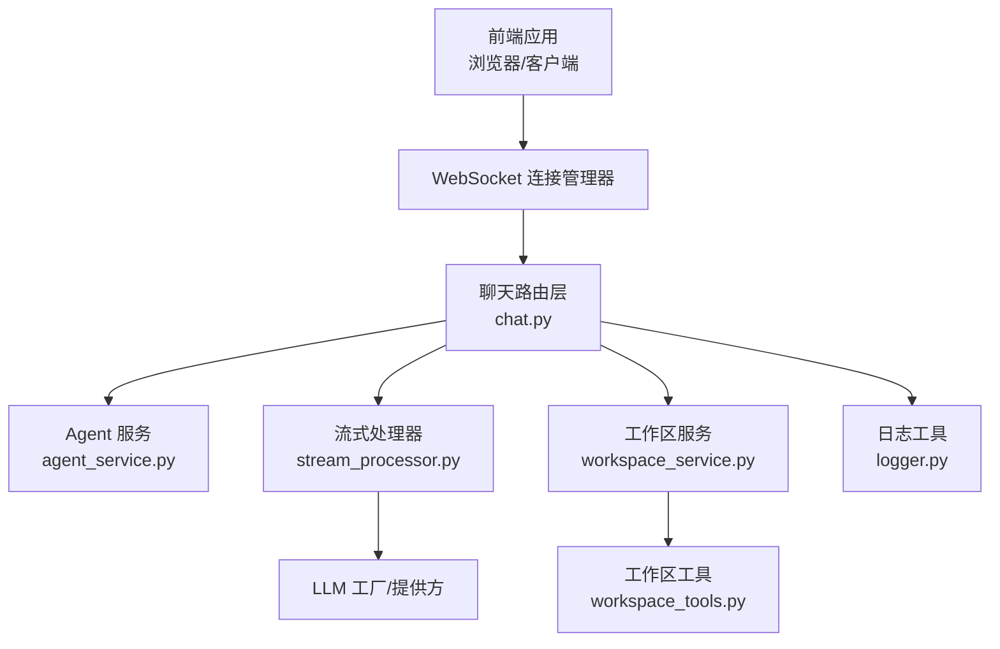
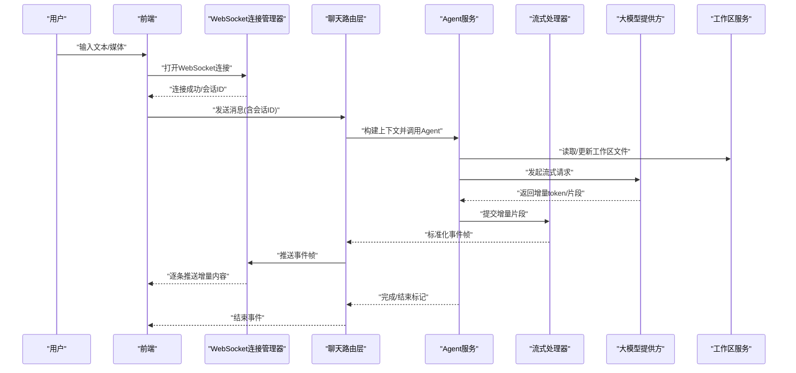
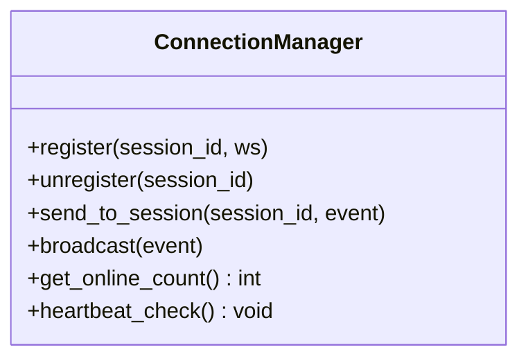
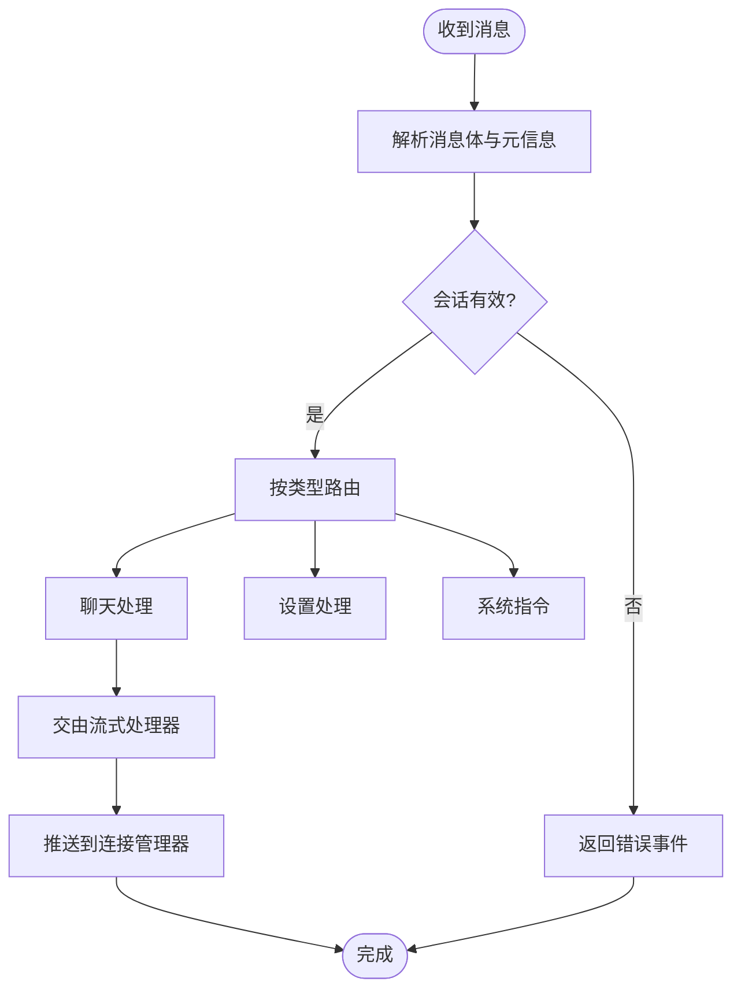
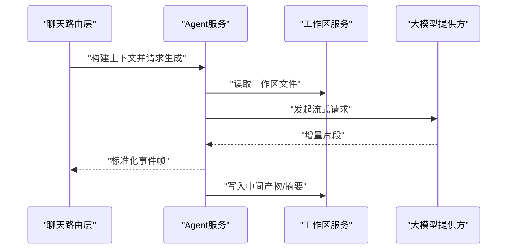
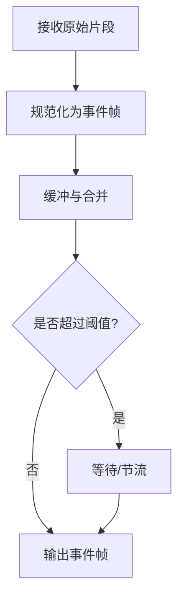
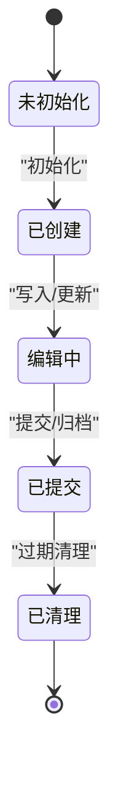
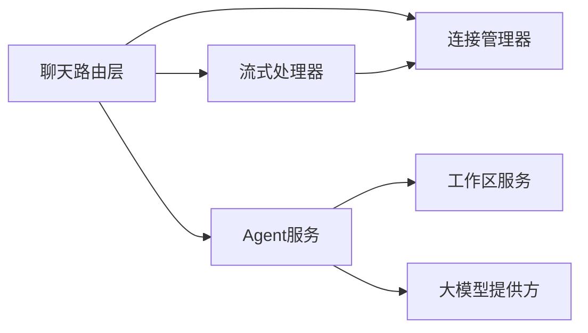

# 数据流架构

<cite>
**本文引用的文件**   
- [backend/app/main.py](file://backend/app/main.py)
- [backend/app/routers/chat.py](file://backend/app/routers/chat.py)
- [backend/app/services/connection_manager.py](file://backend/app/services/connection_manager.py)
- [backend/app/services/stream_processor.py](file://backend/app/services/stream_processor.py)
- [backend/app/services/agent_service.py](file://backend/app/services/agent_service.py)
- [backend/app/services/workspace_service.py](file://backend/app/services/workspace_service.py)
- [backend/app/tools/workspace_tools.py](file://backend/app/tools/workspace_tools.py)
- [backend/app/utils/logger.py](file://backend/app/utils/logger.py)
</cite>

## 目录
1. [简介](#简介)
2. [项目结构](#项目结构)
3. [核心组件](#核心组件)
4. [架构总览](#架构总览)
5. [详细组件分析](#详细组件分析)
6. [依赖关系分析](#依赖关系分析)
7. [性能考虑](#性能考虑)
8. [故障排查指南](#故障排查指南)
9. [结论](#结论)
10. [附录](#附录)

## 简介
本文件面向PolyStudio的数据流与架构，聚焦从用户输入到AI处理再到结果展示的完整链路。重点覆盖：
- WebSocket连接管理器的实现（连接建立、消息路由、状态同步）
- 流式处理器对长文本生成与多模态数据的实时传输策略
- 工作区文件的数据生命周期管理
- 关键操作的数据流图与时序图
- 缓存策略、错误处理与重试机制
- 性能优化与监控指标建议

## 项目结构
后端采用分层设计：入口服务、路由层、服务层、工具层与通用工具。前端通过WebSocket与服务端交互，服务端将请求分发至Agent编排与流式处理器，最终将增量结果推送回前端。

图表来源
- [backend/app/main.py](file://backend/app/main.py)
- [backend/app/routers/chat.py](file://backend/app/routers/chat.py)
- [backend/app/services/connection_manager.py](file://backend/app/services/connection_manager.py)
- [backend/app/services/stream_processor.py](file://backend/app/services/stream_processor.py)
- [backend/app/services/agent_service.py](file://backend/app/services/agent_service.py)
- [backend/app/services/workspace_service.py](file://backend/app/services/workspace_service.py)
- [backend/app/tools/workspace_tools.py](file://backend/app/tools/workspace_tools.py)
- [backend/app/utils/logger.py](file://backend/app/utils/logger.py)

章节来源
- [backend/app/main.py](file://backend/app/main.py)
- [backend/app/routers/chat.py](file://backend/app/routers/chat.py)
- [backend/app/services/connection_manager.py](file://backend/app/services/connection_manager.py)
- [backend/app/services/stream_processor.py](file://backend/app/services/stream_processor.py)
- [backend/app/services/agent_service.py](file://backend/app/services/agent_service.py)
- [backend/app/services/workspace_service.py](file://backend/app/services/workspace_service.py)
- [backend/app/tools/workspace_tools.py](file://backend/app/tools/workspace_tools.py)
- [backend/app/utils/logger.py](file://backend/app/utils/logger.py)

## 核心组件
- WebSocket连接管理器：负责连接的注册、注销、广播与按会话的路由，维护连接状态与心跳。
- 聊天路由层：解析HTTP/WebSocket请求，鉴权与会话绑定，调度Agent与流式处理器。
- Agent服务：编排提示词、工具调用与外部模型调用，产出结构化事件流。
- 流式处理器：将长文本或多模态输出切分为增量片段，统一封装为可推送的事件帧。
- 工作区服务与工具：管理工作区文件的读写、版本化与清理，支撑上下文持久化。
- 日志工具：提供结构化日志与追踪ID，便于问题定位与性能分析。

章节来源
- [backend/app/services/connection_manager.py](file://backend/app/services/connection_manager.py)
- [backend/app/routers/chat.py](file://backend/app/routers/chat.py)
- [backend/app/services/agent_service.py](file://backend/app/services/agent_service.py)
- [backend/app/services/stream_processor.py](file://backend/app/services/stream_processor.py)
- [backend/app/services/workspace_service.py](file://backend/app/services/workspace_service.py)
- [backend/app/tools/workspace_tools.py](file://backend/app/tools/workspace_tools.py)
- [backend/app/utils/logger.py](file://backend/app/utils/logger.py)

## 架构总览
下图展示一次典型“发送消息并接收流式响应”的端到端流程。

图表来源
- [backend/app/routers/chat.py](file://backend/app/routers/chat.py)
- [backend/app/services/connection_manager.py](file://backend/app/services/connection_manager.py)
- [backend/app/services/agent_service.py](file://backend/app/services/agent_service.py)
- [backend/app/services/stream_processor.py](file://backend/app/services/stream_processor.py)
- [backend/app/services/workspace_service.py](file://backend/app/services/workspace_service.py)

## 详细组件分析

### WebSocket连接管理器
职责
- 连接生命周期：建立、认证、加入房间、断开回收
- 消息路由：按会话ID或房间进行定向投递
- 状态同步：在线列表、连接数、心跳保活
- 背压控制：队列长度上限、丢弃策略、退避重连提示

关键行为
- 建立连接时分配会话标识，注册到全局映射表
- 收到消息后根据类型路由至对应处理器（如聊天、设置、系统指令）
- 推送事件时支持批量合并与节流，避免前端抖动
- 异常与断线自动清理资源，触发重连信号

图表来源
- [backend/app/services/connection_manager.py](file://backend/app/services/connection_manager.py)

章节来源
- [backend/app/services/connection_manager.py](file://backend/app/services/connection_manager.py)

### 聊天路由层
职责
- 解析WebSocket消息协议，校验与会话绑定
- 协调Agent与流式处理器，组装事件流
- 记录审计日志与追踪ID，暴露健康检查接口

关键行为
- 消息类型分发：文本、媒体、工具调用、系统指令
- 限流与配额：单会话并发限制、速率限制
- 错误包装：统一错误码与可恢复性标注

图表来源
- [backend/app/routers/chat.py](file://backend/app/routers/chat.py)
- [backend/app/services/connection_manager.py](file://backend/app/services/connection_manager.py)

章节来源
- [backend/app/routers/chat.py](file://backend/app/routers/chat.py)

### Agent服务
职责
- 聚合上下文（对话历史、工作区文件、技能引用）
- 编排工具调用与外部模型调用
- 产出结构化事件流（开始、增量、结束、错误）

关键行为
- 动态加载提示词与技能参考
- 工具调用结果回填上下文
- 失败降级与重试边界控制

图表来源
- [backend/app/services/agent_service.py](file://backend/app/services/agent_service.py)
- [backend/app/services/workspace_service.py](file://backend/app/services/workspace_service.py)

章节来源
- [backend/app/services/agent_service.py](file://backend/app/services/agent_service.py)
- [backend/app/services/workspace_service.py](file://backend/app/services/workspace_service.py)

### 流式处理器
职责
- 将长文本或多模态输出切分为增量片段
- 统一事件格式（类型、序列号、时间戳、负载）
- 支持压缩、去抖与合并策略

关键行为
- 文本流：按token或句子边界拆分
- 媒体流：分块编码与顺序保证
- 背压：当消费者慢时主动降速或缓冲

图表来源
- [backend/app/services/stream_processor.py](file://backend/app/services/stream_processor.py)

章节来源
- [backend/app/services/stream_processor.py](file://backend/app/services/stream_processor.py)

### 工作区服务与工具
职责
- 工作区文件的生命周期：创建、更新、归档、清理
- 版本化与快照：保留关键变更点
- 权限与隔离：按会话/用户隔离访问

关键行为
- 原子写入与幂等更新
- 增量同步与冲突解决
- 垃圾回收与空间回收

图表来源
- [backend/app/services/workspace_service.py](file://backend/app/services/workspace_service.py)
- [backend/app/tools/workspace_tools.py](file://backend/app/tools/workspace_tools.py)

章节来源
- [backend/app/services/workspace_service.py](file://backend/app/services/workspace_service.py)
- [backend/app/tools/workspace_tools.py](file://backend/app/tools/workspace_tools.py)

### 日志与可观测性
职责
- 结构化日志、追踪ID贯穿请求链路
- 关键指标上报（延迟、吞吐、错误率）
- 告警与采样策略

章节来源
- [backend/app/utils/logger.py](file://backend/app/utils/logger.py)

## 依赖关系分析
- 路由层依赖连接管理器与Agent服务，间接依赖工作区服务与流式处理器
- Agent服务依赖工作区服务与大模型提供方
- 流式处理器独立于具体模型，仅消费上游事件流
- 连接管理器被路由层与Agent服务共同使用

图表来源
- [backend/app/routers/chat.py](file://backend/app/routers/chat.py)
- [backend/app/services/connection_manager.py](file://backend/app/services/connection_manager.py)
- [backend/app/services/agent_service.py](file://backend/app/services/agent_service.py)
- [backend/app/services/stream_processor.py](file://backend/app/services/stream_processor.py)
- [backend/app/services/workspace_service.py](file://backend/app/services/workspace_service.py)

章节来源
- [backend/app/routers/chat.py](file://backend/app/routers/chat.py)
- [backend/app/services/connection_manager.py](file://backend/app/services/connection_manager.py)
- [backend/app/services/agent_service.py](file://backend/app/services/agent_service.py)
- [backend/app/services/stream_processor.py](file://backend/app/services/stream_processor.py)
- [backend/app/services/workspace_service.py](file://backend/app/services/workspace_service.py)

## 性能考虑
- 连接层
  - 连接池与会话复用，减少握手开销
  - 心跳与空闲超时，及时释放资源
  - 批量推送与合并，降低网络抖动
- 流式处理
  - 自适应分片大小，平衡首字节延迟与CPU占用
  - 背压与限速，防止下游阻塞导致内存膨胀
  - 媒体流分块编码，边生成边推送
- 工作区
  - 增量写入与快照，避免全量复制
  - 冷热分离，热点文件常驻内存
- 模型调用
  - 连接复用与并发度控制
  - 重试与熔断，避免雪崩

[本节为通用指导，不直接分析具体文件]

## 故障排查指南
常见问题与定位要点
- 连接不稳定
  - 检查心跳间隔与超时配置
  - 查看连接管理器中的在线计数与异常退出原因
- 消息丢失或乱序
  - 确认事件帧序列号与去重逻辑
  - 检查流式处理器的缓冲与合并策略
- 工作区不一致
  - 核对原子写入与提交语义
  - 检查版本快照与冲突解决路径
- 模型调用失败
  - 观察重试次数与熔断状态
  - 检查错误码与降级策略

章节来源
- [backend/app/services/connection_manager.py](file://backend/app/services/connection_manager.py)
- [backend/app/services/stream_processor.py](file://backend/app/services/stream_processor.py)
- [backend/app/services/workspace_service.py](file://backend/app/services/workspace_service.py)
- [backend/app/utils/logger.py](file://backend/app/utils/logger.py)

## 结论
PolyStudio的数据流以WebSocket为核心通道，结合Agent编排与流式处理器，实现了从用户输入到AI处理的低延迟、可扩展闭环。工作区服务确保上下文一致性与可追溯性。通过合理的背压、重试与监控策略，系统在稳定性与性能之间取得良好平衡。

[本节为总结性内容，不直接分析具体文件]

## 附录
- 术语
  - 会话：一次用户交互的上下文范围
  - 事件帧：标准化的增量数据单元
  - 背压：下游处理能力不足时的上游限速机制
- 建议的监控指标
  - 连接数、平均延迟、P95/P99延迟
  - 事件吞吐、丢包率、重传率
  - 工作区I/O吞吐与空间占用
  - 模型调用成功率与重试次数

[本节为补充说明，不直接分析具体文件]