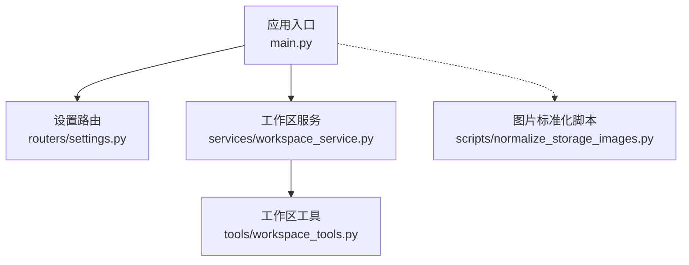
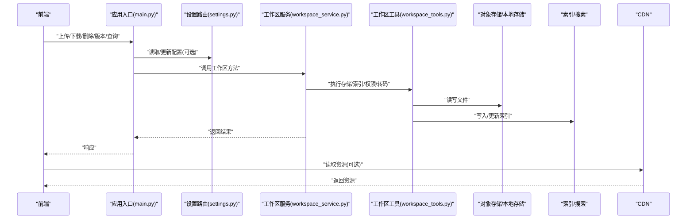
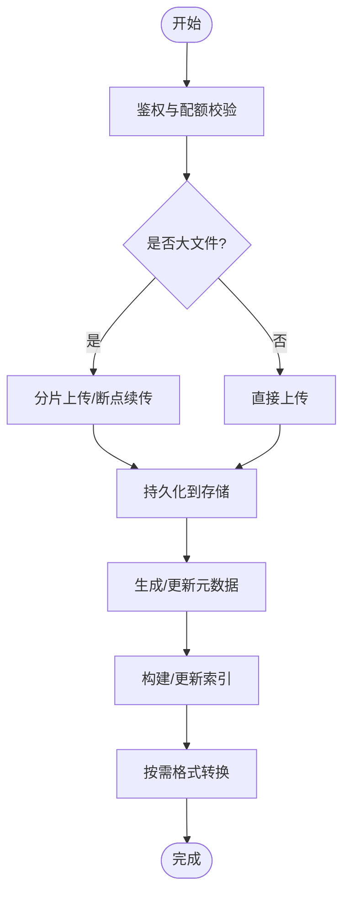
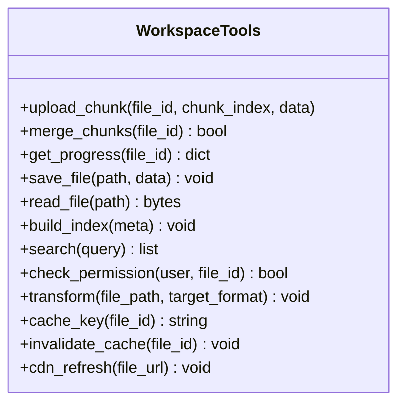
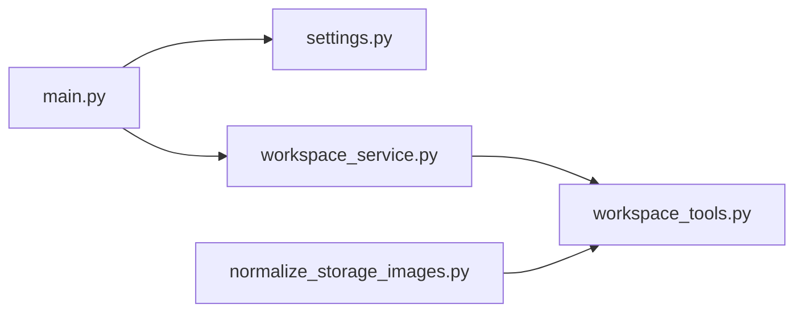

# 文件数据生命周期

<cite>
**本文引用的文件**   
- [backend/app/main.py](file://backend/app/main.py)
- [backend/app/services/workspace_service.py](file://backend/app/services/workspace_service.py)
- [backend/app/tools/workspace_tools.py](file://backend/app/tools/workspace_tools.py)
- [backend/app/routers/settings.py](file://backend/app/routers/settings.py)
- [backend/scripts/normalize_storage_images.py](file://backend/scripts/normalize_storage_images.py)
</cite>

## 目录
1. [简介](#简介)
2. [项目结构](#项目结构)
3. [核心组件](#核心组件)
4. [架构总览](#架构总览)
5. [详细组件分析](#详细组件分析)
6. [依赖关系分析](#依赖关系分析)
7. [性能考量](#性能考量)
8. [故障排查指南](#故障排查指南)
9. [结论](#结论)
10. [附录](#附录)

## 简介
本文件围绕 PolyStudio 工作区中的“文件数据生命周期”进行系统化说明，覆盖从上传、存储、版本控制到清理回收的完整流程；并针对图像、视频、3D模型、音频等不同类型文件的存储策略与格式转换流程进行梳理。同时记录元数据管理（索引构建、搜索、权限）、缓存与CDN集成、大文件分片上传与断点续传、备份迁移与灾难恢复方案，并提供API调用示例与错误处理模式。

## 项目结构
后端采用模块化组织：入口服务、路由层、业务服务层、工具层与脚本层清晰分层。与文件生命周期直接相关的代码主要位于 services 与 tools 层，以及入口路由与服务初始化处。

图示来源
- [backend/app/main.py](file://backend/app/main.py)
- [backend/app/routers/settings.py](file://backend/app/routers/settings.py)
- [backend/app/services/workspace_service.py](file://backend/app/services/workspace_service.py)
- [backend/app/tools/workspace_tools.py](file://backend/app/tools/workspace_tools.py)
- [backend/scripts/normalize_storage_images.py](file://backend/scripts/normalize_storage_images.py)

章节来源
- [backend/app/main.py](file://backend/app/main.py)
- [backend/app/routers/settings.py](file://backend/app/routers/settings.py)
- [backend/app/services/workspace_service.py](file://backend/app/services/workspace_service.py)
- [backend/app/tools/workspace_tools.py](file://backend/app/tools/workspace_tools.py)
- [backend/scripts/normalize_storage_images.py](file://backend/scripts/normalize_storage_images.py)

## 核心组件
- 应用入口 main.py：负责注册路由、启动服务，是外部请求进入系统的统一入口。
- 设置路由 settings.py：提供系统配置相关接口，常用于读取或更新存储、缓存、CDN等全局参数。
- 工作区服务 workspace_service.py：封装工作区文件的核心业务逻辑，包括上传、查询、删除、版本管理等。
- 工作区工具 workspace_tools.py：实现具体存储、索引、权限校验、转码、分片等底层能力。
- 图片标准化脚本 normalize_storage_images.py：用于批量规范化历史图片存储格式与命名。

章节来源
- [backend/app/main.py](file://backend/app/main.py)
- [backend/app/routers/settings.py](file://backend/app/routers/settings.py)
- [backend/app/services/workspace_service.py](file://backend/app/services/workspace_service.py)
- [backend/app/tools/workspace_tools.py](file://backend/app/tools/workspace_tools.py)
- [backend/scripts/normalize_storage_images.py](file://backend/scripts/normalize_storage_images.py)

## 架构总览
下图展示文件从前端到后端再到存储与索引的整体流转路径，以及缓存与CDN在读取侧的作用。

图示来源
- [backend/app/main.py](file://backend/app/main.py)
- [backend/app/routers/settings.py](file://backend/app/routers/settings.py)
- [backend/app/services/workspace_service.py](file://backend/app/services/workspace_service.py)
- [backend/app/tools/workspace_tools.py](file://backend/app/tools/workspace_tools.py)

## 详细组件分析

### 工作区服务（workspace_service.py）
职责边界
- 对外暴露工作区文件的生命周期操作：上传、下载、删除、列表、版本切换、元数据查询等。
- 协调工具层完成存储、索引、权限校验与格式转换。
- 对上层保持稳定的接口契约，屏蔽底层存储与索引细节。

关键流程
- 上传流程：接收请求 -> 鉴权与配额检查 -> 分片/直传决策 -> 持久化 -> 生成元数据 -> 触发索引与转码任务 -> 返回结果。
- 下载流程：鉴权 -> 命中缓存/CDN优先 -> 回源存储 -> 更新缓存 -> 返回流。
- 删除流程：软删除标记 -> 清理引用 -> 定时回收。
- 版本控制：每次变更创建新版本 -> 保留历史版本 -> 支持回滚。

图示来源
- [backend/app/services/workspace_service.py](file://backend/app/services/workspace_service.py)
- [backend/app/tools/workspace_tools.py](file://backend/app/tools/workspace_tools.py)

章节来源
- [backend/app/services/workspace_service.py](file://backend/app/services/workspace_service.py)
- [backend/app/tools/workspace_tools.py](file://backend/app/tools/workspace_tools.py)

### 工作区工具（workspace_tools.py）
职责边界
- 存储抽象：统一封装对象存储/本地磁盘的读写、分片合并、断点续传状态管理。
- 索引与搜索：维护文件索引（名称、类型、大小、时间戳、标签等），支持检索。
- 权限控制：基于用户/角色/工作区的访问控制。
- 格式转换：根据文件类型触发转码/压缩/标准化。
- 缓存与CDN：提供缓存键生成、失效策略与CDN刷新接口。

典型能力
- 分片上传：计算分片MD5、记录进度、合并校验。
- 断点续传：保存未完成的分片清单与偏移量，支持重试。
- 索引构建：增量更新索引，避免全量重建。
- 权限校验：细粒度到文件级与目录级。
- 转码调度：异步队列触发，失败重试与告警。

图示来源
- [backend/app/tools/workspace_tools.py](file://backend/app/tools/workspace_tools.py)

章节来源
- [backend/app/tools/workspace_tools.py](file://backend/app/tools/workspace_tools.py)

### 设置路由（settings.py）
职责边界
- 提供系统配置读写的REST接口，如存储后端、缓存策略、CDN域名、索引开关、转码策略等。
- 为工作区服务提供运行时配置注入。

典型接口
- 获取配置：返回当前存储、缓存、CDN、索引、转码等配置项。
- 更新配置：支持热更新部分配置项，并触发必要的缓存/索引重建。

章节来源
- [backend/app/routers/settings.py](file://backend/app/routers/settings.py)

### 应用入口（main.py）
职责边界
- 注册所有路由，挂载中间件（鉴权、限流、日志）。
- 启动服务进程，加载配置与环境变量。

章节来源
- [backend/app/main.py](file://backend/app/main.py)

### 图片标准化脚本（normalize_storage_images.py）
职责边界
- 批量扫描历史图片，按新规范重命名、转格式、更新索引与元数据。
- 提供幂等执行与断点恢复，避免重复处理。

使用场景
- 存储格式升级后的存量数据迁移。
- 统一缩略图与主图命名规则。

章节来源
- [backend/scripts/normalize_storage_images.py](file://backend/scripts/normalize_storage_images.py)

## 依赖关系分析
- 入口层 main.py 依赖 routers 与 services。
- 服务层 workspace_service.py 依赖 tools 提供的存储、索引、权限、转码能力。
- 工具层 workspace_tools.py 依赖外部存储、索引引擎、缓存与CDN。
- 脚本层 normalize_storage_images.py 独立运行，通过工具层能力对存量数据进行批处理。

图示来源
- [backend/app/main.py](file://backend/app/main.py)
- [backend/app/routers/settings.py](file://backend/app/routers/settings.py)
- [backend/app/services/workspace_service.py](file://backend/app/services/workspace_service.py)
- [backend/app/tools/workspace_tools.py](file://backend/app/tools/workspace_tools.py)
- [backend/scripts/normalize_storage_images.py](file://backend/scripts/normalize_storage_images.py)

章节来源
- [backend/app/main.py](file://backend/app/main.py)
- [backend/app/routers/settings.py](file://backend/app/routers/settings.py)
- [backend/app/services/workspace_service.py](file://backend/app/services/workspace_service.py)
- [backend/app/tools/workspace_tools.py](file://backend/app/tools/workspace_tools.py)
- [backend/scripts/normalize_storage_images.py](file://backend/scripts/normalize_storage_images.py)

## 性能考量
- 分片上传与断点续传：降低网络抖动影响，提升大文件成功率与吞吐。
- 索引增量更新：避免全量重建，缩短写入延迟。
- 缓存与CDN：热点资源就近分发，降低回源压力。
- 异步转码：将耗时操作移出主链路，提高响应速度。
- 存储分层：冷热分离，减少成本并提升访问效率。

[本节为通用指导，不直接分析具体文件]

## 故障排查指南
- 上传失败：检查分片完整性、断点续传状态、存储可用性与配额限制。
- 索引不一致：对比元数据与索引条目，触发增量重建。
- 权限异常：核对用户角色、工作区成员关系与文件ACL。
- 转码失败：查看任务队列状态、重试次数与错误日志。
- CDN不可用：验证域名解析、回源地址与缓存失效策略。

章节来源
- [backend/app/services/workspace_service.py](file://backend/app/services/workspace_service.py)
- [backend/app/tools/workspace_tools.py](file://backend/app/tools/workspace_tools.py)

## 结论
PolyStudio 的文件数据生命周期以“服务+工具”的分层设计为核心，结合分片上传、断点续传、索引与缓存、CDN加速与异步转码，形成高可用、可扩展且易运维的体系。通过统一的设置路由与标准化脚本，系统在配置管理与存量迁移方面具备良好可维护性。

[本节为总结性内容，不直接分析具体文件]

## 附录

### 不同文件类型的存储策略与格式转换
- 图像
  - 存储：原图与缩略图分离，缩略图多尺寸缓存。
  - 转换：统一转为高效格式（如WebP/AVIF），按需生成预览。
- 视频
  - 存储：原片与转码产物分离，HLS/DASH切片缓存。
  - 转换：多分辨率与码率自适应，封面帧提取。
- 3D模型
  - 存储：原始模型与轻量化导出（glTF/USDZ）并存。
  - 转换：几何简化、纹理压缩、LOD生成。
- 音频
  - 存储：无损与有损双份，波形与频谱缓存。
  - 转换：采样率/比特率标准化，静音裁剪。

[本节为概念性说明，不直接分析具体文件]

### 元数据管理与索引构建
- 元数据字段：ID、文件名、类型、大小、哈希、创建/更新时间、所有者、标签、版本、URL等。
- 索引构建：增量写入，支持全文检索与过滤条件组合。
- 搜索功能：关键词、类型、时间范围、标签等多维筛选。
- 权限控制：基于用户/角色的细粒度访问控制，支持继承与覆盖。

章节来源
- [backend/app/services/workspace_service.py](file://backend/app/services/workspace_service.py)
- [backend/app/tools/workspace_tools.py](file://backend/app/tools/workspace_tools.py)

### 缓存机制与CDN集成
- 缓存键：基于文件ID与版本生成，确保一致性。
- 失效策略：写后失效、TTL过期、主动刷新。
- CDN集成：域名前缀、回源地址、缓存头、刷新接口。

章节来源
- [backend/app/tools/workspace_tools.py](file://backend/app/tools/workspace_tools.py)
- [backend/app/routers/settings.py](file://backend/app/routers/settings.py)

### 大文件处理：分片上传与断点续传
- 分片策略：固定大小分片，并发上传，服务端校验MD5。
- 断点续传：记录已上传分片清单与偏移，支持中断恢复。
- 合并与校验：全部分片完成后合并，校验完整性。

章节来源
- [backend/app/tools/workspace_tools.py](file://backend/app/tools/workspace_tools.py)
- [backend/app/services/workspace_service.py](file://backend/app/services/workspace_service.py)

### 备份、迁移与灾难恢复
- 备份：定期快照与增量备份，跨地域冗余。
- 迁移：脚本驱动，幂等执行，断点恢复。
- 灾难恢复：RTO/RPO目标明确，演练与自动化切换。

章节来源
- [backend/scripts/normalize_storage_images.py](file://backend/scripts/normalize_storage_images.py)
- [backend/app/tools/workspace_tools.py](file://backend/app/tools/workspace_tools.py)

### API调用示例与错误处理模式
- 上传
  - 初始化分片：返回分片大小、最大并发、续传令牌。
  - 上传分片：携带分片序号与校验值，返回成功状态。
  - 合并分片：触发持久化与索引更新。
- 下载
  - 直链下载：返回CDN或回源地址。
  - 流式下载：支持范围请求与断点续传。
- 删除
  - 软删除：标记删除，定时回收。
  - 硬删除：彻底移除文件与索引。
- 版本
  - 列出版本：返回版本清单与差异信息。
  - 切换版本：回滚至指定版本。
- 错误处理
  - 统一错误码：区分客户端错误、服务端错误、资源错误。
  - 重试策略：指数退避与幂等键。
  - 日志与追踪：关联请求ID，便于定位问题。

章节来源
- [backend/app/services/workspace_service.py](file://backend/app/services/workspace_service.py)
- [backend/app/tools/workspace_tools.py](file://backend/app/tools/workspace_tools.py)
- [backend/app/routers/settings.py](file://backend/app/routers/settings.py)