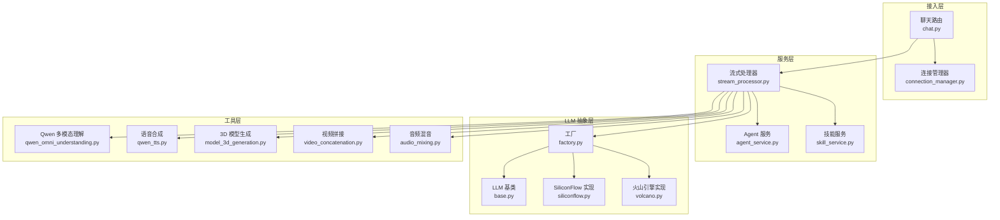
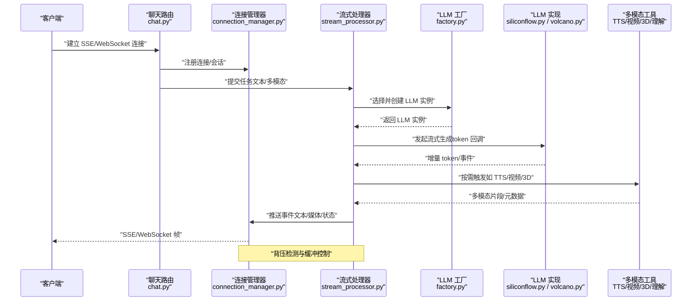
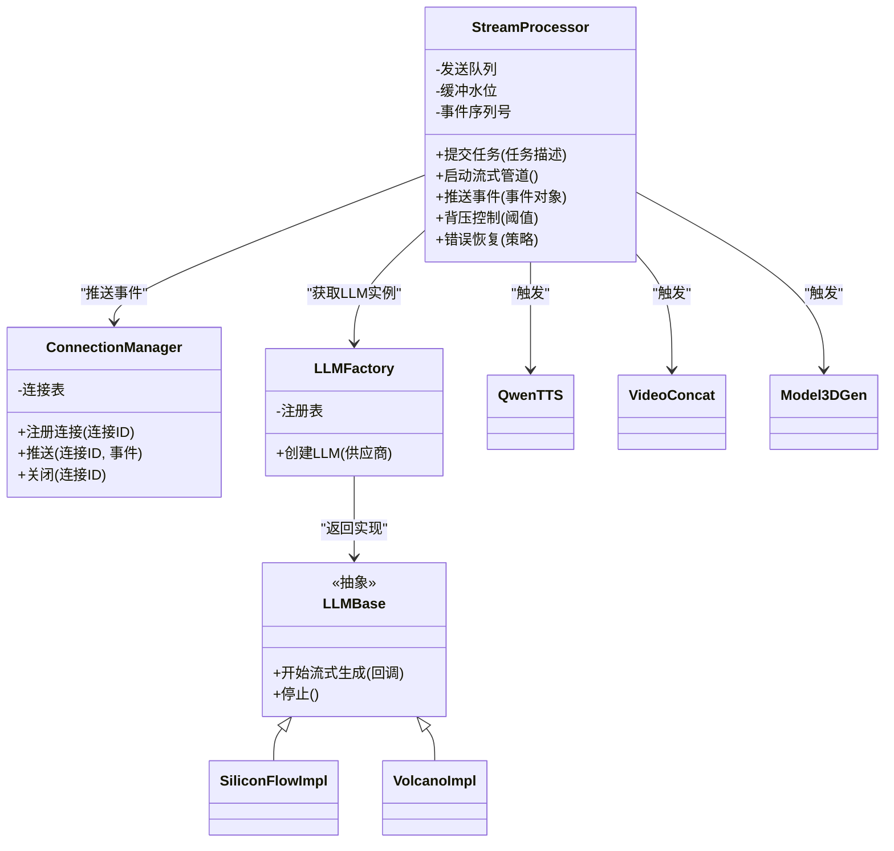
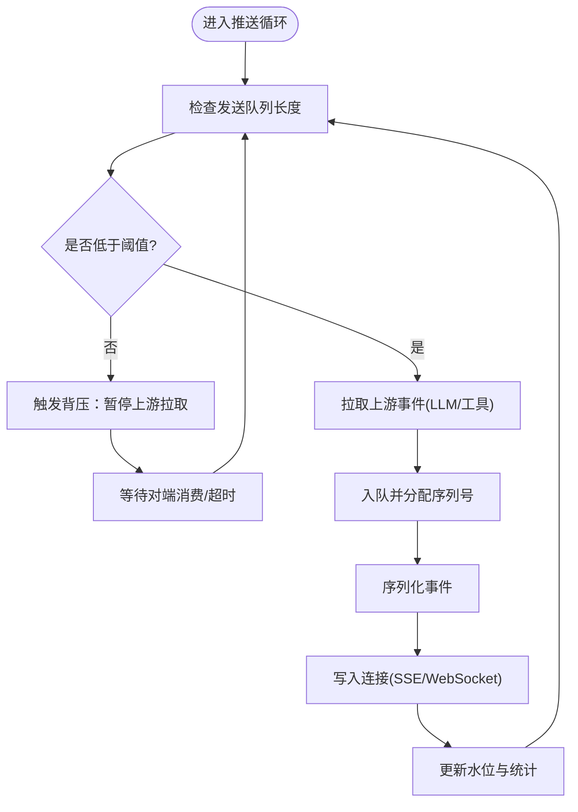
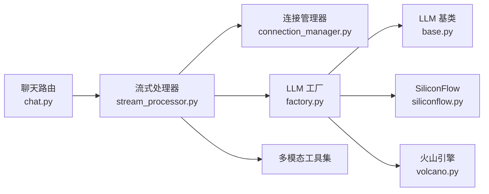

# 流式数据处理

<cite>
**本文引用的文件**   
- [backend/app/main.py](file://backend/app/main.py)
- [backend/app/routers/chat.py](file://backend/app/routers/chat.py)
- [backend/app/services/stream_processor.py](file://backend/app/services/stream_processor.py)
- [backend/app/services/connection_manager.py](file://backend/app/services/connection_manager.py)
- [backend/app/llm/base.py](file://backend/app/llm/base.py)
- [backend/app/llm/factory.py](file://backend/app/llm/factory.py)
- [backend/app/llm/siliconflow.py](file://backend/app/llm/siliconflow.py)
- [backend/app/llm/volcano.py](file://backend/app/llm/volcano.py)
- [backend/app/tools/qwen_omni_understanding.py](file://backend/app/tools/qwen_omni_understanding.py)
- [backend/app/tools/qwen_tts.py](file://backend/app/tools/qwen_tts.py)
- [backend/app/tools/model_3d_generation.py](file://backend/app/tools/model_3d_generation.py)
- [backend/app/tools/video_concatenation.py](file://backend/app/tools/video_concatenation.py)
- [backend/app/tools/audio_mixing.py](file://backend/app/tools/audio_mixing.py)
</cite>

## 目录
1. [简介](#简介)
2. [项目结构](#项目结构)
3. [核心组件](#核心组件)
4. [架构总览](#架构总览)
5. [详细组件分析](#详细组件分析)
6. [依赖关系分析](#依赖关系分析)
7. [性能考虑](#性能考虑)
8. [故障排查指南](#故障排查指南)
9. [结论](#结论)
10. [附录](#附录)

## 简介
本文件聚焦于 PolyStudio 后端的流式数据处理能力，围绕以下目标展开：
- 解释流式处理器如何支撑 AI 模型的长文本生成与多模态数据的实时传输
- 对比 SSE（Server-Sent Events）与 WebSocket 两种流式响应实现差异
- 记录数据分块传输机制，包括缓冲区管理、背压处理与流量控制
- 说明音频、视频、3D 模型等多模态数据的流式处理方式
- 阐述错误恢复与数据完整性保证机制
- 提供自定义流式处理器的实现指引与示例路径
- 总结性能优化策略与内存管理最佳实践

## 项目结构
后端采用分层组织方式：路由层负责协议接入（SSE/WebSocket），服务层编排业务逻辑与工具调用，LLM 抽象层统一不同供应商的流式接口，工具层封装音视频、3D 等具体能力。

图表来源
- [backend/app/routers/chat.py](file://backend/app/routers/chat.py)
- [backend/app/services/stream_processor.py](file://backend/app/services/stream_processor.py)
- [backend/app/services/connection_manager.py](file://backend/app/services/connection_manager.py)
- [backend/app/llm/base.py](file://backend/app/llm/base.py)
- [backend/app/llm/factory.py](file://backend/app/llm/factory.py)
- [backend/app/llm/siliconflow.py](file://backend/app/llm/siliconflow.py)
- [backend/app/llm/volcano.py](file://backend/app/llm/volcano.py)
- [backend/app/tools/qwen_omni_understanding.py](file://backend/app/tools/qwen_omni_understanding.py)
- [backend/app/tools/qwen_tts.py](file://backend/app/tools/qwen_tts.py)
- [backend/app/tools/model_3d_generation.py](file://backend/app/tools/model_3d_generation.py)
- [backend/app/tools/video_concatenation.py](file://backend/app/tools/video_concatenation.py)
- [backend/app/tools/audio_mixing.py](file://backend/app/tools/audio_mixing.py)

章节来源
- [backend/app/main.py](file://backend/app/main.py)
- [backend/app/routers/chat.py](file://backend/app/routers/chat.py)
- [backend/app/services/stream_processor.py](file://backend/app/services/stream_processor.py)
- [backend/app/services/connection_manager.py](file://backend/app/services/connection_manager.py)
- [backend/app/llm/base.py](file://backend/app/llm/base.py)
- [backend/app/llm/factory.py](file://backend/app/llm/factory.py)
- [backend/app/llm/siliconflow.py](file://backend/app/llm/siliconflow.py)
- [backend/app/llm/volcano.py](file://backend/app/llm/volcano.py)
- [backend/app/tools/qwen_omni_understanding.py](file://backend/app/tools/qwen_omni_understanding.py)
- [backend/app/tools/qwen_tts.py](file://backend/app/tools/qwen_tts.py)
- [backend/app/tools/model_3d_generation.py](file://backend/app/tools/model_3d_generation.py)
- [backend/app/tools/video_concatenation.py](file://backend/app/tools/video_concatenation.py)
- [backend/app/tools/audio_mixing.py](file://backend/app/tools/audio_mixing.py)

## 核心组件
- 流式处理器（StreamProcessor）
  - 职责：统一调度 LLM 与工具链，将上游事件转换为下游可消费的流片段；维护缓冲与背压状态；协调多模态输出合并与顺序。
  - 关键能力：
    - 文本增量推送（token 级或词组级）
    - 多模态事件分发（音频帧、视频片段、3D 资源句柄）
    - 背压感知与速率限制
    - 错误恢复与重试策略
- 连接管理器（ConnectionManager）
  - 职责：管理 SSE/WebSocket 连接生命周期、订阅/取消订阅、消息路由与断线重连。
- LLM 抽象层（LLM Base + Factory + 供应商实现）
  - 职责：定义统一的流式接口（如逐 token 回调），屏蔽不同供应商的差异。
- 工具层（多模态）
  - 职责：提供音频、视频、3D 等能力的流式或批式接口，供流式处理器组合使用。

章节来源
- [backend/app/services/stream_processor.py](file://backend/app/services/stream_processor.py)
- [backend/app/services/connection_manager.py](file://backend/app/services/connection_manager.py)
- [backend/app/llm/base.py](file://backend/app/llm/base.py)
- [backend/app/llm/factory.py](file://backend/app/llm/factory.py)
- [backend/app/llm/siliconflow.py](file://backend/app/llm/siliconflow.py)
- [backend/app/llm/volcano.py](file://backend/app/llm/volcano.py)
- [backend/app/tools/qwen_omni_understanding.py](file://backend/app/tools/qwen_omni_understanding.py)
- [backend/app/tools/qwen_tts.py](file://backend/app/tools/qwen_tts.py)
- [backend/app/tools/model_3d_generation.py](file://backend/app/tools/model_3d_generation.py)
- [backend/app/tools/video_concatenation.py](file://backend/app/tools/video_concatenation.py)
- [backend/app/tools/audio_mixing.py](file://backend/app/tools/audio_mixing.py)

## 架构总览
下图展示从请求进入路由到最终通过 SSE/WebSocket 推送给前端的整体流程，以及多模态工具的参与点。

图表来源
- [backend/app/routers/chat.py](file://backend/app/routers/chat.py)
- [backend/app/services/connection_manager.py](file://backend/app/services/connection_manager.py)
- [backend/app/services/stream_processor.py](file://backend/app/services/stream_processor.py)
- [backend/app/llm/factory.py](file://backend/app/llm/factory.py)
- [backend/app/llm/siliconflow.py](file://backend/app/llm/siliconflow.py)
- [backend/app/llm/volcano.py](file://backend/app/llm/volcano.py)
- [backend/app/tools/qwen_tts.py](file://backend/app/tools/qwen_tts.py)
- [backend/app/tools/video_concatenation.py](file://backend/app/tools/video_concatenation.py)
- [backend/app/tools/model_3d_generation.py](file://backend/app/tools/model_3d_generation.py)

## 详细组件分析

### 流式处理器（StreamProcessor）
- 设计要点
  - 事件驱动：以“事件”为最小单位，包含类型（文本/音频/视频/3D/状态）、载荷与序列号，便于前端有序渲染。
  - 缓冲与背压：维护发送队列与水位线，当对端写入慢时暂停上游拉取，避免内存膨胀。
  - 多模态合并：按时间戳或序列号对齐，确保文本、音频、视频、3D 的时序一致性。
  - 错误恢复：捕获异常并上报状态事件，支持有限次重试与降级策略。
- 关键流程（文本流）
  - 接收任务 -> 创建 LLM 实例 -> 订阅 token 回调 -> 组装文本事件 -> 推送到连接管理器 -> 由 SSE/WebSocket 下发。
- 关键流程（多模态流）
  - 在文本生成过程中或完成后，按需触发工具（如 TTS 生成音频帧、视频拼接器产出片段、3D 生成器产出资源句柄），将对应事件插入队列并按序推送。

图表来源
- [backend/app/services/stream_processor.py](file://backend/app/services/stream_processor.py)
- [backend/app/services/connection_manager.py](file://backend/app/services/connection_manager.py)
- [backend/app/llm/base.py](file://backend/app/llm/base.py)
- [backend/app/llm/factory.py](file://backend/app/llm/factory.py)
- [backend/app/llm/siliconflow.py](file://backend/app/llm/siliconflow.py)
- [backend/app/llm/volcano.py](file://backend/app/llm/volcano.py)
- [backend/app/tools/qwen_tts.py](file://backend/app/tools/qwen_tts.py)
- [backend/app/tools/video_concatenation.py](file://backend/app/tools/video_concatenation.py)
- [backend/app/tools/model_3d_generation.py](file://backend/app/tools/model_3d_generation.py)

章节来源
- [backend/app/services/stream_processor.py](file://backend/app/services/stream_processor.py)
- [backend/app/services/connection_manager.py](file://backend/app/services/connection_manager.py)
- [backend/app/llm/base.py](file://backend/app/llm/base.py)
- [backend/app/llm/factory.py](file://backend/app/llm/factory.py)
- [backend/app/llm/siliconflow.py](file://backend/app/llm/siliconflow.py)
- [backend/app/llm/volcano.py](file://backend/app/llm/volcano.py)
- [backend/app/tools/qwen_tts.py](file://backend/app/tools/qwen_tts.py)
- [backend/app/tools/video_concatenation.py](file://backend/app/tools/video_concatenation.py)
- [backend/app/tools/model_3d_generation.py](file://backend/app/tools/model_3d_generation.py)

### SSE 与 WebSocket 流式响应的实现差异
- 协议特性
  - SSE：单向（服务端推送），基于 HTTP，天然适合文本/事件流；浏览器原生支持，无需额外握手。
  - WebSocket：双向全双工，适合需要客户端频繁上行交互的场景（如实时标注、交互式编辑）。
- 在 PolyStudio 中的体现
  - 路由层根据请求头或路径参数决定使用 SSE 或 WebSocket 通道。
  - 连接管理器统一封装连接生命周期，对外暴露一致的推送接口。
  - 流式处理器不关心底层协议细节，仅向连接管理器推送事件。
- 适用场景建议
  - 长文本生成、播报型内容优先 SSE。
  - 需要低延迟双向交互（如在线协作、实时反馈）优先 WebSocket。

章节来源
- [backend/app/routers/chat.py](file://backend/app/routers/chat.py)
- [backend/app/services/connection_manager.py](file://backend/app/services/connection_manager.py)

### 数据分块传输机制：缓冲区、背压与流量控制
- 缓冲区管理
  - 发送队列：按事件类型分区，避免大媒体事件阻塞小文本事件。
  - 内存水位：监控队列长度与单事件大小，超过阈值触发背压。
- 背压处理
  - 上游节流：当检测到对端写入慢时，暂停 LLM 或工具的拉取，直到水位回落。
  - 事件压缩：对非关键事件进行聚合或降采样，降低带宽占用。
- 流量控制
  - 速率限制：按连接维度设置最大推送频率，防止突发流量冲击。
  - 优先级：文本 > 状态 > 媒体元数据 > 媒体片段，保障用户体验。

图表来源
- [backend/app/services/stream_processor.py](file://backend/app/services/stream_processor.py)
- [backend/app/services/connection_manager.py](file://backend/app/services/connection_manager.py)

章节来源
- [backend/app/services/stream_processor.py](file://backend/app/services/stream_processor.py)
- [backend/app/services/connection_manager.py](file://backend/app/services/connection_manager.py)

### 多模态数据的流式处理
- 音频（TTS）
  - 以音频帧为单位推送，附带时间戳与同步标记，前端边收边播，减少首帧延迟。
  - 与文本流保持时间轴对齐，必要时插入静音帧以保证唇形/节奏一致。
- 视频
  - 分段生成与拼接：先产出片段再拼接，流式推送片段元数据与媒体句柄，前端按需拉取或预缓存。
- 3D 模型
  - 渐进式构建：先推送几何/材质元数据，再逐步加载纹理与动画资源，提升首屏速度。
- 多模态理解（视觉+文本）
  - 在对话中穿插理解结果事件，作为上下文注入后续生成，保证语义连贯。

章节来源
- [backend/app/tools/qwen_tts.py](file://backend/app/tools/qwen_tts.py)
- [backend/app/tools/video_concatenation.py](file://backend/app/tools/video_concatenation.py)
- [backend/app/tools/model_3d_generation.py](file://backend/app/tools/model_3d_generation.py)
- [backend/app/tools/qwen_omni_understanding.py](file://backend/app/tools/qwen_omni_understanding.py)

### 错误恢复与数据完整性保证
- 错误分类与处理
  - 网络异常：自动重试与退避，必要时切换备用供应商。
  - 上游超时：中断当前生成，回滚未确认事件，向前端发送错误与恢复提示。
  - 数据损坏：校验事件序列号与摘要，丢弃异常片段并请求补发。
- 完整性保证
  - 序列号单调递增，前端用于去重与排序。
  - 关键事件（如会话开始/结束、错误码）必须可靠送达。
  - 媒体事件携带哈希或长度字段，用于完整性校验。

章节来源
- [backend/app/services/stream_processor.py](file://backend/app/services/stream_processor.py)
- [backend/app/services/connection_manager.py](file://backend/app/services/connection_manager.py)

### 自定义流式处理器实现指南
- 步骤概览
  - 继承或复用现有流式处理器接口，实现事件生产与推送逻辑。
  - 在路由层注册新的处理器类型，使其能被任务调度识别。
  - 对接 LLM 或工具链，将增量结果转化为标准事件。
  - 配置背压阈值与重试策略，确保稳定性。
- 参考路径
  - 处理器骨架与事件模型：[backend/app/services/stream_processor.py](file://backend/app/services/stream_processor.py)
  - 连接管理与推送接口：[backend/app/services/connection_manager.py](file://backend/app/services/connection_manager.py)
  - LLM 抽象与工厂：[backend/app/llm/base.py](file://backend/app/llm/base.py)、[backend/app/llm/factory.py](file://backend/app/llm/factory.py)
  - 供应商实现示例：[backend/app/llm/siliconflow.py](file://backend/app/llm/siliconflow.py)、[backend/app/llm/volcano.py](file://backend/app/llm/volcano.py)
  - 多模态工具示例：[backend/app/tools/qwen_tts.py](file://backend/app/tools/qwen_tts.py)、[backend/app/tools/video_concatenation.py](file://backend/app/tools/video_concatenation.py)、[backend/app/tools/model_3d_generation.py](file://backend/app/tools/model_3d_generation.py)

章节来源
- [backend/app/services/stream_processor.py](file://backend/app/services/stream_processor.py)
- [backend/app/services/connection_manager.py](file://backend/app/services/connection_manager.py)
- [backend/app/llm/base.py](file://backend/app/llm/base.py)
- [backend/app/llm/factory.py](file://backend/app/llm/factory.py)
- [backend/app/llm/siliconflow.py](file://backend/app/llm/siliconflow.py)
- [backend/app/llm/volcano.py](file://backend/app/llm/volcano.py)
- [backend/app/tools/qwen_tts.py](file://backend/app/tools/qwen_tts.py)
- [backend/app/tools/video_concatenation.py](file://backend/app/tools/video_concatenation.py)
- [backend/app/tools/model_3d_generation.py](file://backend/app/tools/model_3d_generation.py)

## 依赖关系分析
- 模块耦合
  - 路由层仅依赖连接管理器与流式处理器，保持协议无关。
  - 流式处理器依赖 LLM 工厂与多模态工具，遵循依赖倒置原则。
  - LLM 抽象层屏蔽供应商差异，新增供应商只需实现接口。
- 外部依赖
  - 第三方 LLM 供应商 SDK（SiliconFlow、火山引擎等）
  - 多媒体编解码与转码库（音频/视频/3D）
- 潜在风险
  - 供应商 API 变更导致兼容性问题，需通过适配器隔离。
  - 多模态工具的资源消耗较高，需严格配额与限流。

图表来源
- [backend/app/routers/chat.py](file://backend/app/routers/chat.py)
- [backend/app/services/stream_processor.py](file://backend/app/services/stream_processor.py)
- [backend/app/services/connection_manager.py](file://backend/app/services/connection_manager.py)
- [backend/app/llm/factory.py](file://backend/app/llm/factory.py)
- [backend/app/llm/base.py](file://backend/app/llm/base.py)
- [backend/app/llm/siliconflow.py](file://backend/app/llm/siliconflow.py)
- [backend/app/llm/volcano.py](file://backend/app/llm/volcano.py)

章节来源
- [backend/app/routers/chat.py](file://backend/app/routers/chat.py)
- [backend/app/services/stream_processor.py](file://backend/app/services/stream_processor.py)
- [backend/app/services/connection_manager.py](file://backend/app/services/connection_manager.py)
- [backend/app/llm/factory.py](file://backend/app/llm/factory.py)
- [backend/app/llm/base.py](file://backend/app/llm/base.py)
- [backend/app/llm/siliconflow.py](file://backend/app/llm/siliconflow.py)
- [backend/app/llm/volcano.py](file://backend/app/llm/volcano.py)

## 性能考虑
- 文本生成
  - 使用 token 级推送，减少首字延迟；合理设置批量合并窗口，平衡吞吐与时延。
- 多模态生成
  - 音频帧大小与采样率调优，避免过大帧导致抖动；视频片段时长与码率自适应。
  - 3D 资源分阶段加载，优先几何与基础材质，纹理与动画异步下载。
- 内存管理
  - 严格控制事件队列长度与单事件体积；及时释放不再使用的中间对象。
  - 对大媒体数据采用流式读写与零拷贝策略，减少内存峰值。
- 并发与资源
  - 为高耗时工具设置线程池/进程池上限，避免资源争用。
  - 针对热点供应商启用连接池与缓存，降低握手与鉴权开销。

## 故障排查指南
- 常见问题定位
  - 连接断开：检查连接管理器心跳与重连逻辑，确认网络与代理配置。
  - 文本乱序：核对事件序列号与去重逻辑，确认前端渲染顺序。
  - 媒体卡顿：观察背压水位与速率限制，调整缓冲阈值与推送频率。
  - 供应商异常：查看错误恢复日志，确认重试次数与降级策略是否生效。
- 诊断手段
  - 开启详细日志，记录事件类型、大小、序列号与时间戳。
  - 监控指标：队列长度、推送延迟、错误率、CPU/内存占用。
  - 压力测试：模拟高并发与弱网环境，验证背压与恢复行为。

章节来源
- [backend/app/services/stream_processor.py](file://backend/app/services/stream_processor.py)
- [backend/app/services/connection_manager.py](file://backend/app/services/connection_manager.py)

## 结论
PolyStudio 的流式数据处理以“事件驱动 + 背压控制 + 多模态协同”为核心，通过统一的 LLM 抽象与连接管理器，实现了可扩展、高性能且稳定的长文本与多模态实时传输。建议在扩展新能力时遵循现有接口契约，完善错误恢复与监控指标，持续优化内存与带宽占用，以提升端到端体验。

## 附录
- 术语
  - 背压：当消费者处理速度慢于生产者时，通过信号或阈值控制生产者速率，避免系统过载。
  - 事件：流式传输的最小单元，包含类型、载荷与元数据（如序列号、时间戳）。
- 参考实现路径
  - 路由与连接：[backend/app/routers/chat.py](file://backend/app/routers/chat.py)、[backend/app/services/connection_manager.py](file://backend/app/services/connection_manager.py)
  - 流式处理：[backend/app/services/stream_processor.py](file://backend/app/services/stream_processor.py)
  - LLM 抽象与实现：[backend/app/llm/base.py](file://backend/app/llm/base.py)、[backend/app/llm/factory.py](file://backend/app/llm/factory.py)、[backend/app/llm/siliconflow.py](file://backend/app/llm/siliconflow.py)、[backend/app/llm/volcano.py](file://backend/app/llm/volcano.py)
  - 多模态工具：[backend/app/tools/qwen_omni_understanding.py](file://backend/app/tools/qwen_omni_understanding.py)、[backend/app/tools/qwen_tts.py](file://backend/app/tools/qwen_tts.py)、[backend/app/tools/model_3d_generation.py](file://backend/app/tools/model_3d_generation.py)、[backend/app/tools/video_concatenation.py](file://backend/app/tools/video_concatenation.py)、[backend/app/tools/audio_mixing.py](file://backend/app/tools/audio_mixing.py)