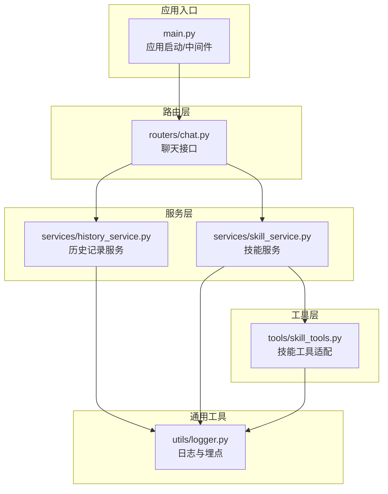
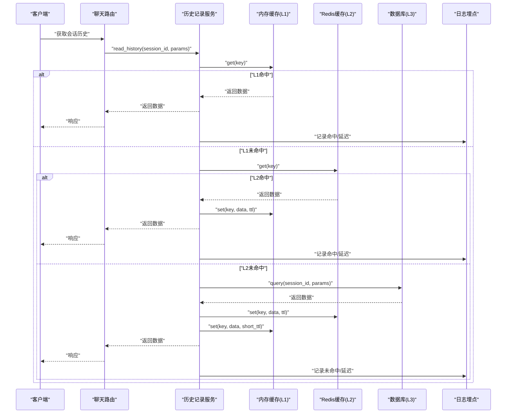
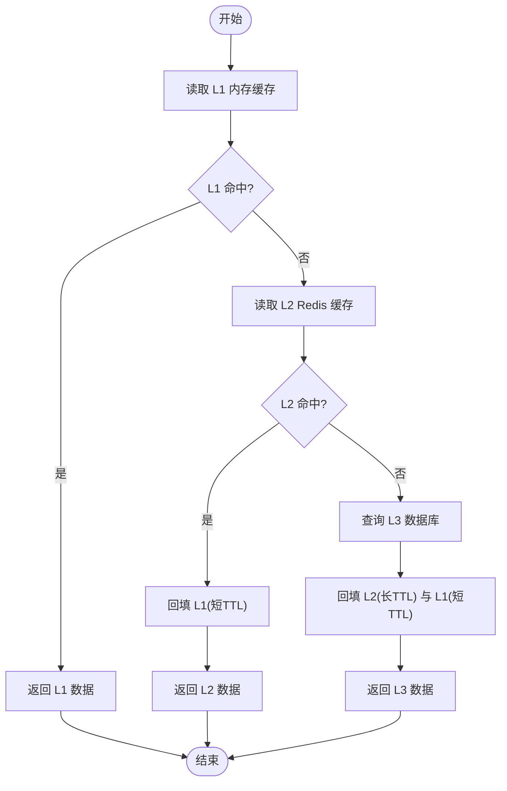
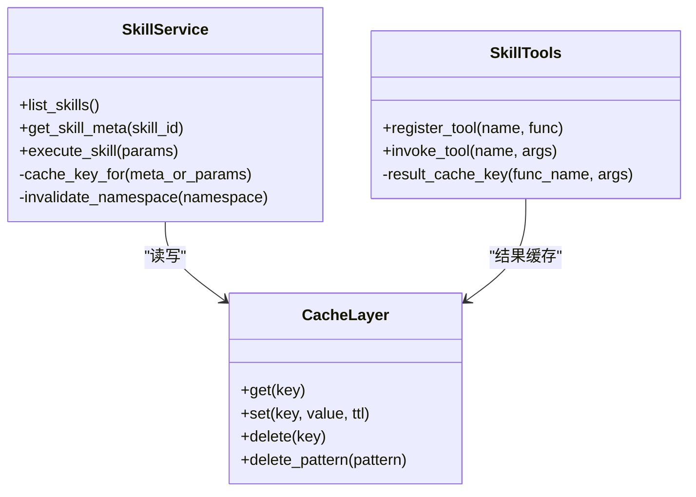
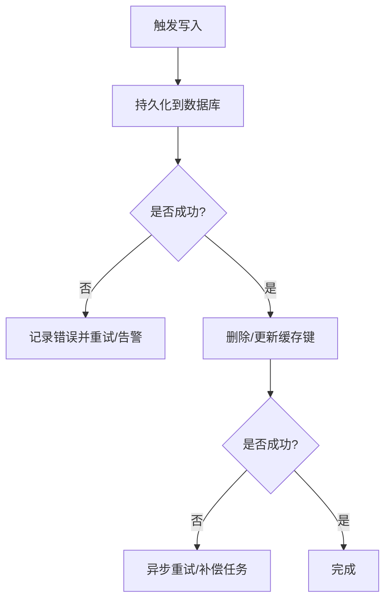
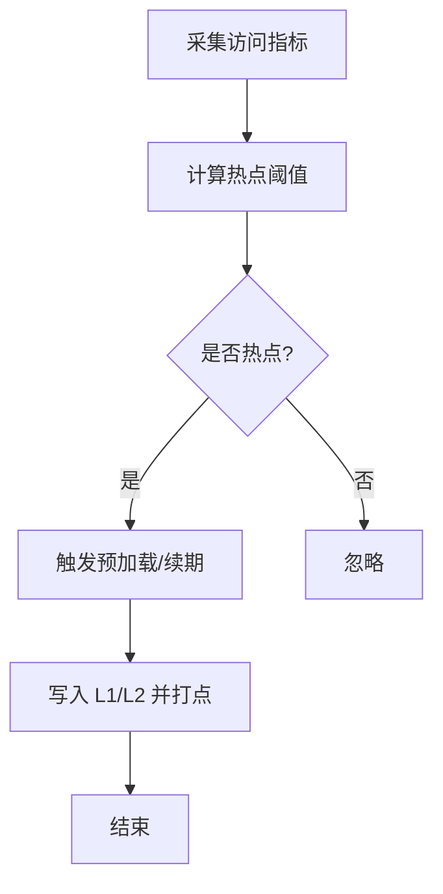
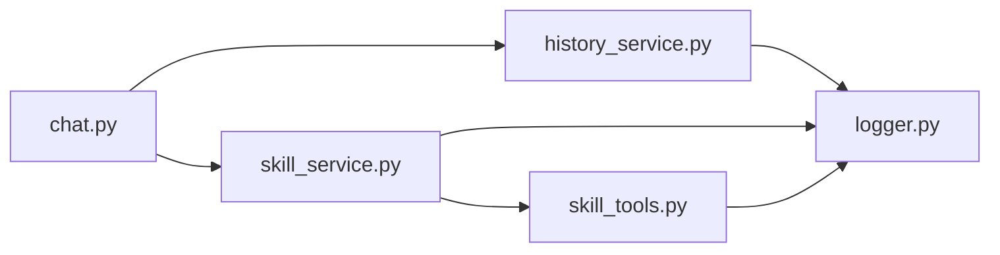

# 缓存策略设计

<cite>
**本文引用的文件**   
- [backend/app/main.py](file://backend/app/main.py)
- [backend/app/routers/chat.py](file://backend/app/routers/chat.py)
- [backend/app/services/history_service.py](file://backend/app/services/history_service.py)
- [backend/app/services/skill_service.py](file://backend/app/services/skill_service.py)
- [backend/app/tools/skill_tools.py](file://backend/app/tools/skill_tools.py)
- [backend/app/utils/logger.py](file://backend/app/utils/logger.py)
</cite>

## 目录
1. [简介](#简介)
2. [项目结构](#项目结构)
3. [核心组件](#核心组件)
4. [架构总览](#架构总览)
5. [详细组件分析](#详细组件分析)
6. [依赖分析](#依赖分析)
7. [性能考虑](#性能考虑)
8. [故障排查指南](#故障排查指南)
9. [结论](#结论)
10. [附录](#附录)

## 简介
本文件面向 PolyStudio 后端的缓存策略设计，目标是构建一套多级缓存体系（内存缓存、Redis 缓存、数据库持久化），以支撑聊天历史记录的快速读写与会话状态持久化，同时为技能系统与工具调用提供高命中率的缓存优化方案。文档涵盖：
- 多级缓存架构与协同机制
- 聊天历史记录的缓存策略（会话持久化、增量更新）
- 技能系统与工具调用的缓存优化
- 缓存失效与一致性保证
- 热点数据识别与预加载
- 监控指标与性能调优方法
- 配置示例与命中率优化技巧

## 项目结构
后端采用分层组织：路由层负责请求接入，服务层封装业务逻辑，工具层实现具体能力，通用工具提供日志等基础设施。缓存相关的关键位置包括：
- 应用入口与中间件注册点
- 聊天路由与服务
- 历史记录服务
- 技能服务与工具适配层
- 日志记录器（用于埋点与可观测性）

图表来源
- [backend/app/main.py](file://backend/app/main.py)
- [backend/app/routers/chat.py](file://backend/app/routers/chat.py)
- [backend/app/services/history_service.py](file://backend/app/services/history_service.py)
- [backend/app/services/skill_service.py](file://backend/app/services/skill_service.py)
- [backend/app/tools/skill_tools.py](file://backend/app/tools/skill_tools.py)
- [backend/app/utils/logger.py](file://backend/app/utils/logger.py)

章节来源
- [backend/app/main.py](file://backend/app/main.py)
- [backend/app/routers/chat.py](file://backend/app/routers/chat.py)
- [backend/app/services/history_service.py](file://backend/app/services/history_service.py)
- [backend/app/services/skill_service.py](file://backend/app/services/skill_service.py)
- [backend/app/tools/skill_tools.py](file://backend/app/tools/skill_tools.py)
- [backend/app/utils/logger.py](file://backend/app/utils/logger.py)

## 核心组件
- 应用入口与中间件
  - 负责初始化全局缓存客户端、注册中间件、挂载路由与生命周期钩子。
- 聊天路由
  - 接收聊天请求，协调历史记录服务与技能服务，统一走缓存读取/写入路径。
- 历史记录服务
  - 提供会话历史的读/写/增量追加/分页查询；对接多级缓存与持久化存储。
- 技能服务
  - 管理技能元数据、执行流程编排；对技能定义与结果进行缓存。
- 技能工具适配
  - 将具体工具能力暴露为可调用的函数，支持参数签名与结果缓存键生成。
- 日志与埋点
  - 输出缓存命中/未命中、延迟、错误等指标，供监控与告警使用。

章节来源
- [backend/app/main.py](file://backend/app/main.py)
- [backend/app/routers/chat.py](file://backend/app/routers/chat.py)
- [backend/app/services/history_service.py](file://backend/app/services/history_service.py)
- [backend/app/services/skill_service.py](file://backend/app/services/skill_service.py)
- [backend/app/tools/skill_tools.py](file://backend/app/tools/skill_tools.py)
- [backend/app/utils/logger.py](file://backend/app/utils/logger.py)

## 架构总览
多级缓存整体由三层构成：
- L1 内存缓存：进程内字典/对象缓存，极低延迟，适合热数据与短 TTL。
- L2 Redis 缓存：分布式共享缓存，跨实例一致，适合中等热度与较长 TTL。
- L3 数据库持久化：最终一致性落盘，适合冷数据与审计回溯。

图表来源
- [backend/app/routers/chat.py](file://backend/app/routers/chat.py)
- [backend/app/services/history_service.py](file://backend/app/services/history_service.py)
- [backend/app/utils/logger.py](file://backend/app/utils/logger.py)

## 详细组件分析

### 聊天历史缓存策略
目标：在保障一致性的前提下，最大化命中率并降低数据库压力。

- 缓存键设计
  - 基于会话标识与查询条件生成稳定键，避免键冲突与扩散。
- 读取路径
  - 优先查 L1，未命中则查 L2，再未命中回源 L3，并按不同层级 TTL 回填。
- 写入与增量更新
  - 新增消息采用“追加+失效”策略：先写 L3，再原子更新 L2/L1 的有序集合或列表尾部，必要时按页粒度失效旧缓存。
- 过期与淘汰
  - L1 短 TTL（秒级），L2 中 TTL（分钟到小时级），L3 长期保留。
- 一致性
  - 写多读少场景下采用“先写库，再删缓存”的策略，配合重试与幂等键，避免脏读。

图表来源
- [backend/app/services/history_service.py](file://backend/app/services/history_service.py)
- [backend/app/utils/logger.py](file://backend/app/utils/logger.py)

章节来源
- [backend/app/routers/chat.py](file://backend/app/routers/chat.py)
- [backend/app/services/history_service.py](file://backend/app/services/history_service.py)
- [backend/app/utils/logger.py](file://backend/app/utils/logger.py)

### 技能系统与工具调用缓存优化
目标：对技能元数据、模板与工具执行结果进行缓存，减少重复计算与外部依赖调用。

- 缓存范围
  - 技能清单与元数据：变更频率低，适合较长 TTL。
  - 工具执行结果：对幂等且输入稳定的调用进行缓存，需结合参数签名生成键。
- 键与序列化
  - 使用规范化后的参数作为键的一部分，避免哈希碰撞；大对象采用压缩或分片存储。
- 失效策略
  - 技能版本升级时批量失效对应键空间；工具上游变更时按命名空间失效。
- 并发与锁
  - 针对热点键采用“缓存击穿保护”，在首次未命中时加分布式锁，避免雪崩。

图表来源
- [backend/app/services/skill_service.py](file://backend/app/services/skill_service.py)
- [backend/app/tools/skill_tools.py](file://backend/app/tools/skill_tools.py)

章节来源
- [backend/app/services/skill_service.py](file://backend/app/services/skill_service.py)
- [backend/app/tools/skill_tools.py](file://backend/app/tools/skill_tools.py)

### 缓存失效与一致性保证
- 失效时机
  - 会话归档、用户切换、系统重启、配置变更、上游依赖更新。
- 一致性模型
  - 读多写少：Cache-Aside（旁路缓存），先写库再删缓存，失败重试。
  - 强一致需求：采用版本号或时间戳校验，或在关键路径引入分布式锁。
- 防穿透/击穿/雪崩
  - 空值缓存（短 TTL）、热点键本地锁、随机化过期时间、限流降级。

图表来源
- [backend/app/services/history_service.py](file://backend/app/services/history_service.py)
- [backend/app/utils/logger.py](file://backend/app/utils/logger.py)

章节来源
- [backend/app/services/history_service.py](file://backend/app/services/history_service.py)
- [backend/app/utils/logger.py](file://backend/app/utils/logger.py)

### 热点数据识别与预加载
- 识别方式
  - 统计最近 N 分钟的访问频次与 QPS，结合滑动窗口阈值判定热点。
- 预加载策略
  - 定时任务扫描热点会话/技能，提前预热至 L1/L2；对即将过期的热点键进行续期。
- 资源控制
  - 限制预热并发度与内存占用，避免影响在线请求。

图表来源
- [backend/app/utils/logger.py](file://backend/app/utils/logger.py)

章节来源
- [backend/app/utils/logger.py](file://backend/app/utils/logger.py)

## 依赖分析
- 模块耦合
  - 路由层仅依赖服务层，服务层通过缓存抽象与日志抽象解耦底层实现。
- 外部依赖
  - Redis 客户端、数据库驱动、文件系统（可选）。
- 潜在风险
  - 循环依赖应避免；缓存键规范需统一，防止键冲突与扩散。

图表来源
- [backend/app/routers/chat.py](file://backend/app/routers/chat.py)
- [backend/app/services/history_service.py](file://backend/app/services/history_service.py)
- [backend/app/services/skill_service.py](file://backend/app/services/skill_service.py)
- [backend/app/tools/skill_tools.py](file://backend/app/tools/skill_tools.py)
- [backend/app/utils/logger.py](file://backend/app/utils/logger.py)

章节来源
- [backend/app/routers/chat.py](file://backend/app/routers/chat.py)
- [backend/app/services/history_service.py](file://backend/app/services/history_service.py)
- [backend/app/services/skill_service.py](file://backend/app/services/skill_service.py)
- [backend/app/tools/skill_tools.py](file://backend/app/tools/skill_tools.py)
- [backend/app/utils/logger.py](file://backend/app/utils/logger.py)

## 性能考虑
- 命中率优化
  - 合理设置 L1/L2 TTL；对热点会话采用更长的 L2 TTL 与较短的 L1 TTL。
  - 合并小消息为批处理写入，减少频繁失效。
- 容量与淘汰
  - L1 使用 LRU/LFU 策略；L2 设置最大内存与淘汰策略。
- 网络与序列化
  - 压缩大对象；避免过度序列化；连接池复用。
- 并发与锁
  - 热点键加锁；批量操作使用管道/事务提升吞吐。
- 监控与告警
  - 记录命中率、P95/P99 延迟、错误率、内存使用、连接数等指标。

[本节为通用指导，不直接分析具体文件]

## 故障排查指南
- 常见问题
  - 缓存未命中率高：检查键生成规则、TTL 设置与预热策略。
  - 数据不一致：确认写路径为先写库再删缓存，并观察重试与补偿任务。
  - 热点击穿：检查是否启用分布式锁与空值缓存。
- 定位手段
  - 查看日志中的缓存命中/未命中标记与耗时；核对 Redis 键空间分布。
  - 对比数据库与缓存的时间戳/版本号，定位脏数据。

章节来源
- [backend/app/utils/logger.py](file://backend/app/utils/logger.py)

## 结论
通过 L1/L2/L3 多级缓存与完善的失效、一致性、监控与预热策略，PolyStudio 可在高并发场景下显著降低数据库压力、提升响应速度，并为聊天历史与技能/工具调用提供稳定高效的缓存支撑。后续建议持续完善指标看板与自动化预热策略，逐步扩大缓存覆盖范围。

[本节为总结，不直接分析具体文件]

## 附录

### 配置示例（字段说明）
以下为缓存相关配置的字段说明，便于落地实施：
- 全局
  - cache_enabled: 是否启用缓存
  - cache_l1_max_size: L1 最大条目数
  - cache_l1_default_ttl_seconds: L1 默认过期时间
  - cache_l2_host/port/db/password: Redis 连接信息
  - cache_l2_default_ttl_seconds: L2 默认过期时间
  - cache_l2_max_memory_mb: L2 最大内存
  - cache_l2_eviction_policy: L2 淘汰策略
  - cache_hot_threshold_qps: 热点判定阈值
  - cache_preload_interval_seconds: 预热周期
  - cache_metrics_enabled: 是否开启指标上报
- 聊天历史
  - history_session_ttl_seconds: 会话缓存 TTL
  - history_page_size: 分页大小
  - history_append_batch_size: 增量追加批次大小
- 技能与工具
  - skill_meta_ttl_seconds: 技能元数据 TTL
  - tool_result_ttl_seconds: 工具结果 TTL
  - tool_result_compress: 是否压缩

[本节为配置说明，不直接分析具体文件]

### 命中率优化技巧
- 键设计
  - 规范化参数、剔除无关字段、使用稳定前缀与命名空间。
- TTL 分层
  - L1 短 TTL 保热，L2 中长 TTL 保稳，L3 长期保留。
- 批量与合并
  - 合并多次写入，减少失效风暴。
- 预热与续期
  - 对热点键定期续期，避免集中过期。
- 降级与兜底
  - 缓存不可用时快速回源数据库，并记录告警。

[本节为通用技巧，不直接分析具体文件]