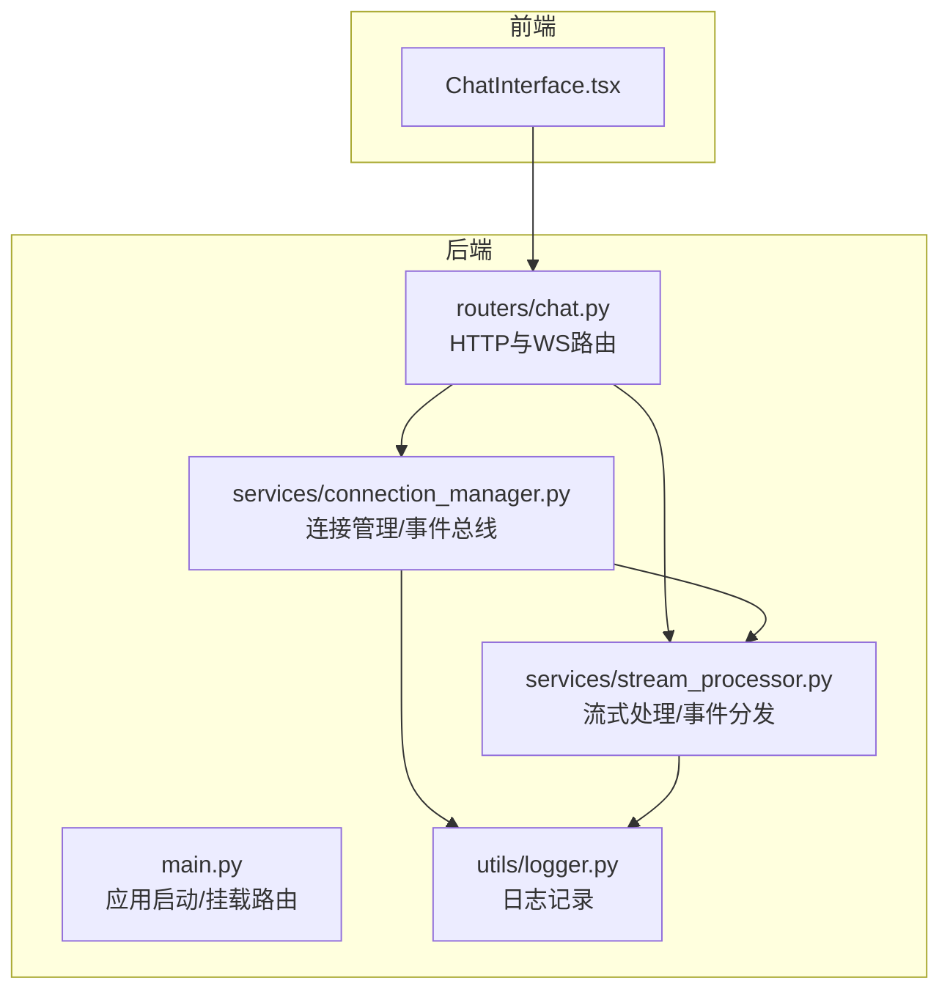
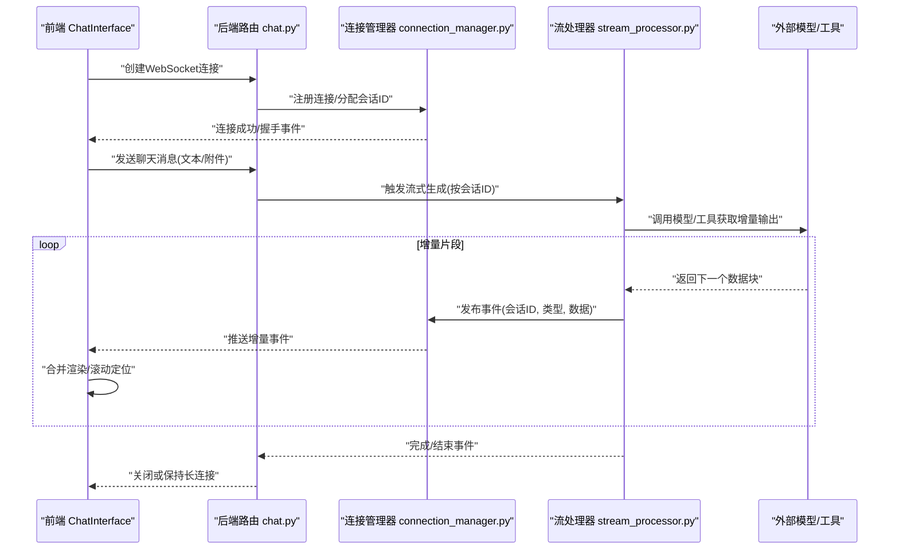
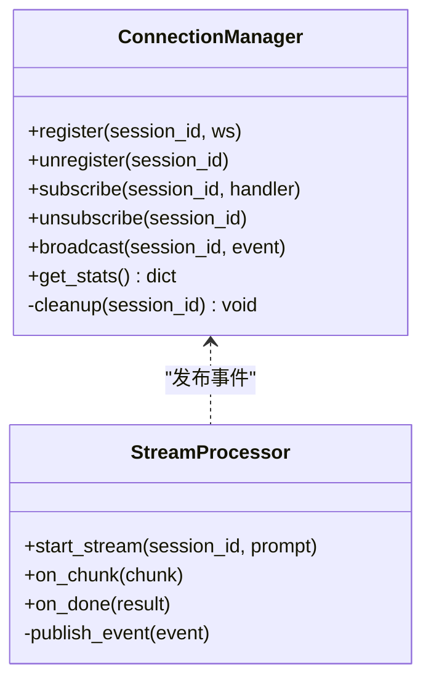
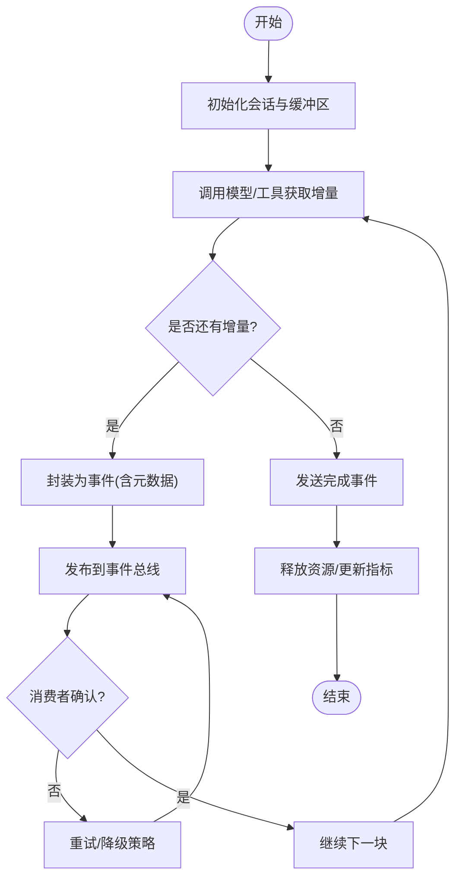
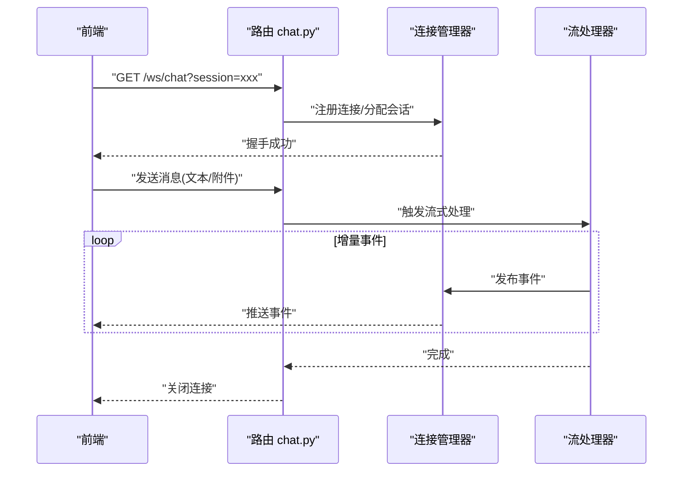
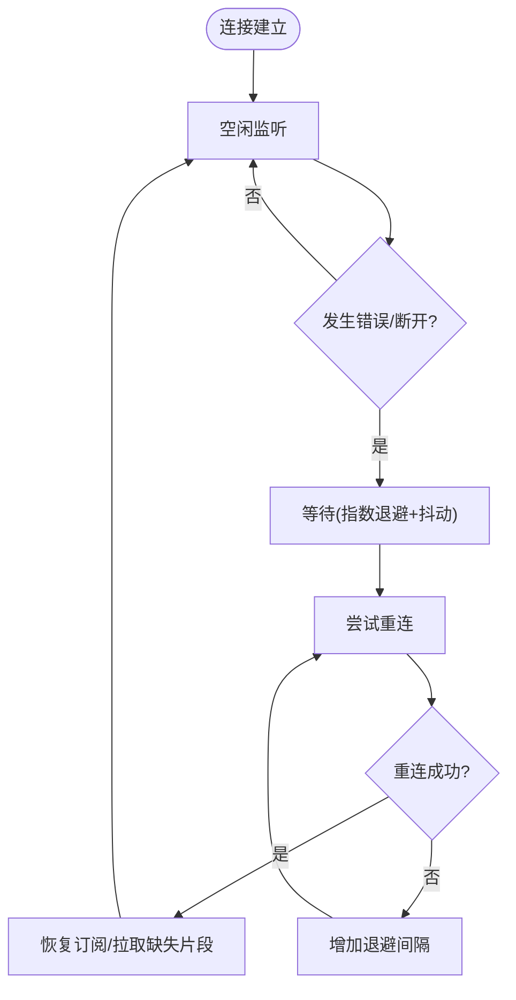
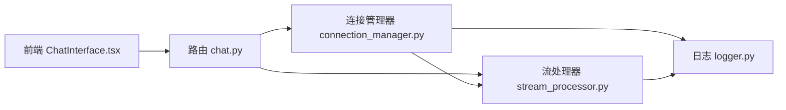

# 事件驱动架构

<cite>
**本文引用的文件**   
- [backend/app/main.py](file://backend/app/main.py)
- [backend/app/routers/chat.py](file://backend/app/routers/chat.py)
- [backend/app/services/connection_manager.py](file://backend/app/services/connection_manager.py)
- [backend/app/services/stream_processor.py](file://backend/app/services/stream_processor.py)
- [backend/app/utils/logger.py](file://backend/app/utils/logger.py)
- [frontend/src/components/ChatInterface.tsx](file://frontend/src/components/ChatInterface.tsx)
</cite>

## 目录
1. [简介](#简介)
2. [项目结构](#项目结构)
3. [核心组件](#核心组件)
4. [架构总览](#架构总览)
5. [详细组件分析](#详细组件分析)
6. [依赖关系分析](#依赖关系分析)
7. [性能考量](#性能考量)
8. [故障排查指南](#故障排查指南)
9. [结论](#结论)
10. [附录](#附录)

## 简介
本文件面向PolyStudio的事件驱动架构，重点阐述WebSocket连接管理与流式数据处理。文档围绕事件生产者、事件消费者与事件总线三类角色展开，结合实时聊天消息的发布订阅模式、连接状态管理、断线重连机制、高并发处理、内存与性能优化、序列化/反序列化以及错误重试策略进行系统性说明，并提供调试与监控指标的实现建议。

## 项目结构
后端采用分层组织：路由层负责HTTP/WebSocket入口，服务层封装业务逻辑（连接管理、流处理等），工具层提供日志等通用能力；前端通过React组件发起并消费WebSocket事件。

图表来源
- [backend/app/main.py](file://backend/app/main.py)
- [backend/app/routers/chat.py](file://backend/app/routers/chat.py)
- [backend/app/services/connection_manager.py](file://backend/app/services/connection_manager.py)
- [backend/app/services/stream_processor.py](file://backend/app/services/stream_processor.py)
- [backend/app/utils/logger.py](file://backend/app/utils/logger.py)
- [frontend/src/components/ChatInterface.tsx](file://frontend/src/components/ChatInterface.tsx)

章节来源
- [backend/app/main.py](file://backend/app/main.py)
- [backend/app/routers/chat.py](file://backend/app/routers/chat.py)
- [backend/app/services/connection_manager.py](file://backend/app/services/connection_manager.py)
- [backend/app/services/stream_processor.py](file://backend/app/services/stream_processor.py)
- [backend/app/utils/logger.py](file://backend/app/utils/logger.py)
- [frontend/src/components/ChatInterface.tsx](file://frontend/src/components/ChatInterface.tsx)

## 核心组件
- 事件总线与连接管理器：维护客户端连接集合、会话上下文、订阅关系与广播通道，承担“事件总线”职责。
- 流处理器：将上游LLM或工具的增量输出转换为事件，按主题/会话投递到事件总线，供所有订阅者接收。
- 路由层：暴露HTTP接口与WebSocket端点，作为事件生产者的接入点与事件消费者的出口。
- 前端组件：建立WebSocket连接，订阅聊天事件，渲染增量内容，实现断线重连与状态同步。

章节来源
- [backend/app/services/connection_manager.py](file://backend/app/services/connection_manager.py)
- [backend/app/services/stream_processor.py](file://backend/app/services/stream_processor.py)
- [backend/app/routers/chat.py](file://backend/app/routers/chat.py)
- [frontend/src/components/ChatInterface.tsx](file://frontend/src/components/ChatInterface.tsx)

## 架构总览
下图展示从前端发起聊天请求到后端事件分发再到前端增量渲染的整体流程。

图表来源
- [backend/app/routers/chat.py](file://backend/app/routers/chat.py)
- [backend/app/services/connection_manager.py](file://backend/app/services/connection_manager.py)
- [backend/app/services/stream_processor.py](file://backend/app/services/stream_processor.py)
- [frontend/src/components/ChatInterface.tsx](file://frontend/src/components/ChatInterface.tsx)

## 详细组件分析

### 事件总线与连接管理器
职责
- 维护活跃连接映射（会话ID -> 连接句柄）
- 提供订阅/取消订阅与广播方法
- 统一编码/解码事件协议，保证跨语言一致性
- 统计连接数、消息吞吐、错误计数等指标

关键设计要点
- 使用异步队列或内存表存储连接，避免锁竞争
- 对每个会话维护独立的消息通道，降低扇出开销
- 在断开时自动清理资源，防止内存泄漏
- 为关键路径添加结构化日志与指标上报

章节来源
- [backend/app/services/connection_manager.py](file://backend/app/services/connection_manager.py)
- [backend/app/utils/logger.py](file://backend/app/utils/logger.py)

#### 类图（概念映射）

图表来源
- [backend/app/services/connection_manager.py](file://backend/app/services/connection_manager.py)
- [backend/app/services/stream_processor.py](file://backend/app/services/stream_processor.py)

### 流处理器与事件分发
职责
- 将上游模型的增量输出包装为标准事件
- 按会话ID投递到事件总线
- 处理异常与重试，确保最终一致性

关键设计要点
- 事件结构包含：会话ID、事件类型、序列号、时间戳、负载
- 支持幂等消费（基于序列号去重）
- 背压控制：当消费者写入慢时，限制上游速率或丢弃低优先级事件

章节来源
- [backend/app/services/stream_processor.py](file://backend/app/services/stream_processor.py)

#### 流程图（流式处理）

图表来源
- [backend/app/services/stream_processor.py](file://backend/app/services/stream_processor.py)
- [backend/app/services/connection_manager.py](file://backend/app/services/connection_manager.py)

### 路由层（HTTP与WebSocket）
职责
- 暴露聊天相关HTTP接口（如历史查询、设置）
- 提供WebSocket端点，完成握手与会话绑定
- 转发客户端消息至流处理器，并将结果回写连接

关键设计要点
- 握手阶段校验参数、鉴权与会话配额
- 将连接注册到事件总线，绑定会话ID
- 优雅关闭：先发送收尾事件，再关闭连接

章节来源
- [backend/app/routers/chat.py](file://backend/app/routers/chat.py)
- [backend/app/main.py](file://backend/app/main.py)

#### 时序图（WebSocket握手与消息收发）

图表来源
- [backend/app/routers/chat.py](file://backend/app/routers/chat.py)
- [backend/app/services/connection_manager.py](file://backend/app/services/connection_manager.py)
- [backend/app/services/stream_processor.py](file://backend/app/services/stream_processor.py)

### 前端组件（连接与消费）
职责
- 建立WebSocket连接，订阅聊天事件
- 增量渲染、光标定位、错误提示
- 断线重连与指数退避

关键设计要点
- 心跳保活与超时检测
- 本地缓冲与去重，避免重复渲染
- 重连策略：指数退避+抖动，最大重试次数上限

章节来源
- [frontend/src/components/ChatInterface.tsx](file://frontend/src/components/ChatInterface.tsx)

#### 流程图（断线重连）

图表来源
- [frontend/src/components/ChatInterface.tsx](file://frontend/src/components/ChatInterface.tsx)

## 依赖关系分析
- 路由层依赖连接管理器与流处理器，作为事件入口与出口
- 流处理器依赖连接管理器进行事件广播
- 连接管理器依赖日志工具进行可观测性记录
- 前端依赖路由提供的WebSocket端点

图表来源
- [backend/app/routers/chat.py](file://backend/app/routers/chat.py)
- [backend/app/services/connection_manager.py](file://backend/app/services/connection_manager.py)
- [backend/app/services/stream_processor.py](file://backend/app/services/stream_processor.py)
- [backend/app/utils/logger.py](file://backend/app/utils/logger.py)
- [frontend/src/components/ChatInterface.tsx](file://frontend/src/components/ChatInterface.tsx)

章节来源
- [backend/app/routers/chat.py](file://backend/app/routers/chat.py)
- [backend/app/services/connection_manager.py](file://backend/app/services/connection_manager.py)
- [backend/app/services/stream_processor.py](file://backend/app/services/stream_processor.py)
- [backend/app/utils/logger.py](file://backend/app/utils/logger.py)
- [frontend/src/components/ChatInterface.tsx](file://frontend/src/components/ChatInterface.tsx)

## 性能考量
- 高并发连接
  - 使用异步I/O与单进程多协程模型，减少线程切换开销
  - 连接对象轻量级化，避免在事件负载中携带大对象
  - 会话级隔离，降低锁粒度
- 内存管理
  - 及时释放已关闭连接的引用，避免僵尸连接
  - 对长会话启用环形缓冲或滑动窗口，限制历史大小
  - 批量聚合小事件，减少网络往返
- 序列化/反序列化
  - 选择高效二进制或紧凑JSON格式，必要时压缩
  - 固定事件Schema，避免动态字段导致解析不稳定
- 背压与限流
  - 根据消费者写入速度调整上游速率
  - 对非关键事件实施降级或丢弃策略
- 指标与可观测性
  - 连接数、消息吞吐、延迟分位、错误率、重连次数
  - 结构化日志，关联会话ID与事件序列号

[本节为通用指导，不直接分析具体文件]

## 故障排查指南
- 常见问题
  - 连接频繁断开：检查心跳配置、网络质量、服务端资源水位
  - 消息乱序或缺失：核对事件序列号与幂等消费逻辑
  - 内存持续增长：排查未释放的连接与历史缓存
  - 延迟升高：评估事件体积、序列化成本与下游处理耗时
- 定位手段
  - 基于会话ID过滤日志，追踪端到端链路
  - 采集关键指标（连接数、吞吐、P95/P99延迟、错误码分布）
  - 开启调试开关，输出事件头与负载摘要（脱敏）
- 恢复策略
  - 自动重连与指数退避
  - 失败重试与死信队列（用于不可恢复事件）
  - 快速降级：关闭非关键功能，保障核心聊天通路

章节来源
- [backend/app/utils/logger.py](file://backend/app/utils/logger.py)
- [backend/app/services/connection_manager.py](file://backend/app/services/connection_manager.py)
- [backend/app/services/stream_processor.py](file://backend/app/services/stream_processor.py)

## 结论
本架构以事件总线为核心，将WebSocket连接管理与流式处理解耦，形成清晰的生产者-消费者模型。通过会话级隔离、幂等事件、背压与重试策略，系统在高并发场景下具备良好稳定性与可扩展性。配合完善的日志与指标体系，可实现端到端的可观测性与快速排障。

[本节为总结性内容，不直接分析具体文件]

## 附录

### 事件协议与示例（路径指引）
- 事件头字段建议：会话ID、事件类型、序列号、时间戳、签名/校验和
- 事件负载：增量文本、图片/视频URL、工具调用结果等
- 参考实现位置
  - 事件封装与发布：[backend/app/services/stream_processor.py](file://backend/app/services/stream_processor.py)
  - 事件广播与订阅：[backend/app/services/connection_manager.py](file://backend/app/services/connection_manager.py)
  - 前端消费与渲染：[frontend/src/components/ChatInterface.tsx](file://frontend/src/components/ChatInterface.tsx)

### 监控指标清单（建议）
- 连接维度：在线连接数、新建/断开速率、平均存活时长
- 消息维度：入站/出站QPS、事件大小分布、丢包率
- 延迟维度：端到端P50/P95/P99、模型首字节延迟
- 可靠性维度：重试次数、失败率、重连成功率
- 资源维度：CPU/内存占用、GC停顿、队列深度

[本节为通用建议，不直接分析具体文件]