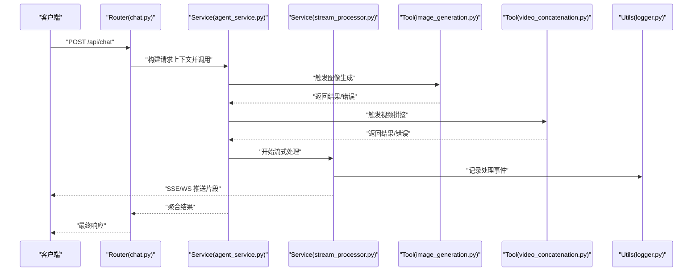
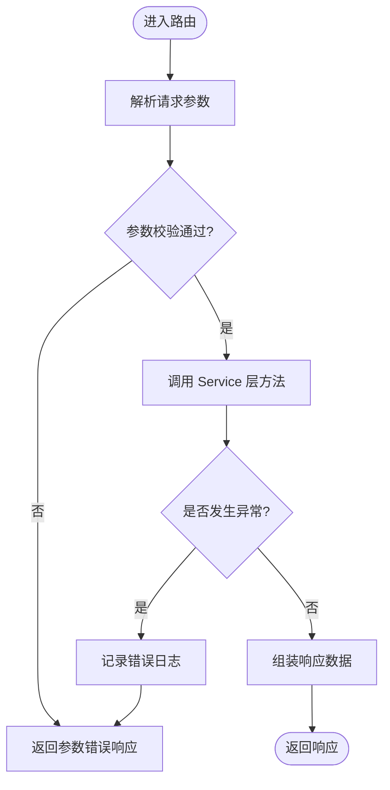
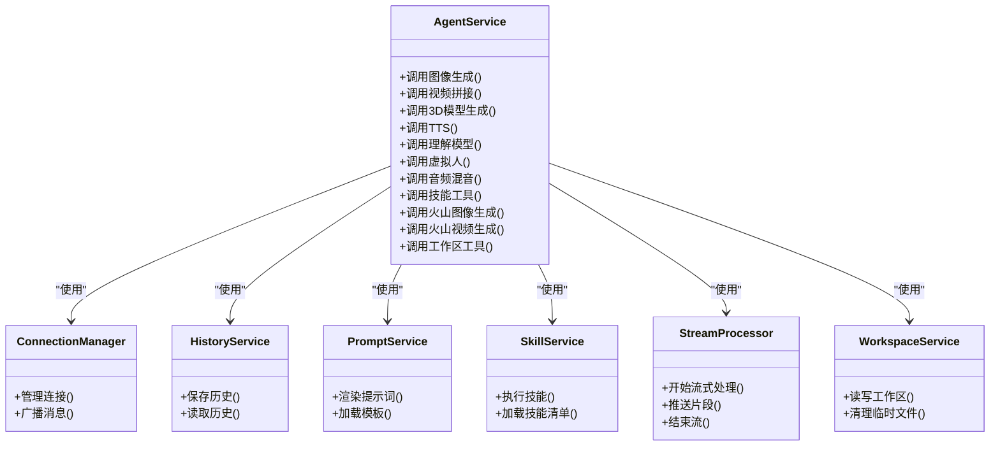
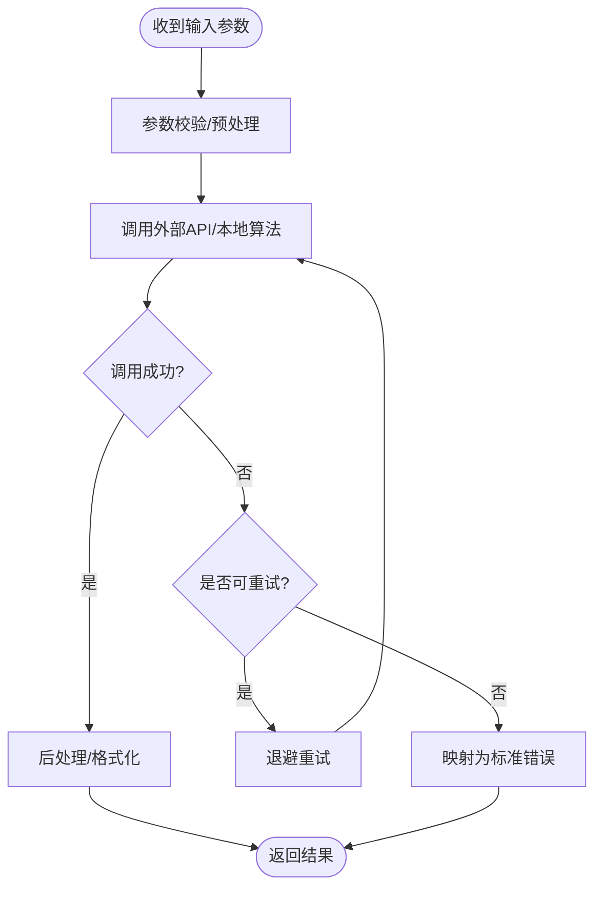
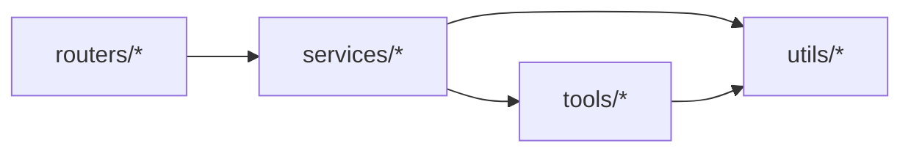

# 分层架构模式

<cite>
**本文引用的文件**   
- [main.py](file://backend/app/main.py)
- [chat.py](file://backend/app/routers/chat.py)
- [settings.py](file://backend/app/routers/settings.py)
- [agent_service.py](file://backend/app/services/agent_service.py)
- [connection_manager.py](file://backend/app/services/connection_manager.py)
- [history_service.py](file://backend/app/services/history_service.py)
- [prompt.py](file://backend/app/services/prompt.py)
- [skill_service.py](file://backend/app/services/skill_service.py)
- [stream_processor.py](file://backend/app/services/stream_processor.py)
- [workspace_service.py](file://backend/app/services/workspace_service.py)
- [audio_mixing.py](file://backend/app/tools/audio_mixing.py)
- [image_generation.py](file://backend/app/tools/image_generation.py)
- [model_3d_generation.py](file://backend/app/tools/model_3d_generation.py)
- [qwen_omni_understanding.py](file://backend/app/tools/qwen_omni_understanding.py)
- [qwen_tts.py](file://backend/app/tools/qwen_tts.py)
- [skill_tools.py](file://backend/app/tools/skill_tools.py)
- [video_concatenation.py](file://backend/app/tools/video_concatenation.py)
- [virtual_anchor_generation.py](file://backend/app/tools/virtual_anchor_generation.py)
- [volcano_image_generation.py](file://backend/app/tools/volcano_image_generation.py)
- [volcano_video_generation.py](file://backend/app/tools/volcano_video_generation.py)
- [workspace_tools.py](file://backend/app/tools/workspace_tools.py)
- [logger.py](file://backend/app/utils/logger.py)
- [face_detection.py](file://backend/app/utils/face_detection.py)
</cite>

## 目录
1. [简介](#简介)
2. [项目结构](#项目结构)
3. [核心组件](#核心组件)
4. [架构总览](#架构总览)
5. [详细组件分析](#详细组件分析)
6. [依赖关系分析](#依赖关系分析)
7. [性能考虑](#性能考虑)
8. [故障排查指南](#故障排查指南)
9. [结论](#结论)
10. [附录](#附录)

## 简介
本文件围绕 PolyStudio 后端服务，系统化阐述 Router → Service → Tool 的分层架构模式。该模式将 HTTP 请求处理、业务编排与具体工具实现解耦，形成清晰职责边界：
- Router 层：负责接收 HTTP 请求、参数校验、路由分发与响应封装。
- Service 层：承载业务逻辑，协调多个 Tool 与外部系统，管理会话、历史、工作区等上下文。
- Tool 层：提供可复用的能力单元，如音视频处理、图像/视频生成、模型生成、语音合成、技能执行等，并封装对外部 API 的调用。

通过分层设计，代码具备更强的可维护性（职责单一）、可测试性（易于 Mock/替换）、可扩展性（新增能力只需扩展 Tool 并在 Service 中组合）。

## 项目结构
后端采用按“功能域 + 分层”组织的方式：
- routers：HTTP 路由定义与请求处理入口
- services：业务编排与领域服务
- tools：具体工具与外部能力封装
- utils：通用工具（日志、人脸检测等）
- main：应用启动与中间件装配

```mermaid
graph TB
subgraph "应用入口"
Main["main.py"]
end
subgraph "Router 层"
RChat["routers/chat.py"]
RSettings["routers/settings.py"]
end
subgraph "Service 层"
SAgent["services/agent_service.py"]
SConn["services/connection_manager.py"]
SHist["services/history_service.py"]
SPrompt["services/prompt.py"]
SSkill["services/skill_service.py"]
SStream["services/stream_processor.py"]
SWs["services/workspace_service.py"]
end
subgraph "Tool 层"
TAudio["tools/audio_mixing.py"]
TImg["tools/image_generation.py"]
T3D["tools/model_3d_generation.py"]
TOmni["tools/qwen_omni_understanding.py"]
TTTS["tools/qwen_tts.py"]
TSkill["tools/skill_tools.py"]
TVid["tools/video_concatenation.py"]
TVirt["tools/virtual_anchor_generation.py"]
TVI["tools/volcano_image_generation.py"]
TVV["tools/volcano_video_generation.py"]
TWs["tools/workspace_tools.py"]
end
subgraph "通用工具"
ULog["utils/logger.py"]
UFace["utils/face_detection.py"]
end
Main --> RChat
Main --> RSettings
RChat --> SAgent
RChat --> SStream
RChat --> SHist
RChat --> SPrompt
RChat --> SSkill
RChat --> SWs
RSettings --> SWs
SAgent --> TImg
SAgent --> TVid
SAgent --> T3D
SAgent --> TTTS
SAgent --> TOmni
SAgent --> TVirt
SAgent --> TAudio
SAgent --> TSkill
SAgent --> TVI
SAgent --> TVV
SAgent --> TWs
SStream --> ULog
SAgent --> ULog
SWs --> ULog
```

图表来源
- [main.py](file://backend/app/main.py)
- [chat.py](file://backend/app/routers/chat.py)
- [settings.py](file://backend/app/routers/settings.py)
- [agent_service.py](file://backend/app/services/agent_service.py)
- [connection_manager.py](file://backend/app/services/connection_manager.py)
- [history_service.py](file://backend/app/services/history_service.py)
- [prompt.py](file://backend/app/services/prompt.py)
- [skill_service.py](file://backend/app/services/skill_service.py)
- [stream_processor.py](file://backend/app/services/stream_processor.py)
- [workspace_service.py](file://backend/app/services/workspace_service.py)
- [audio_mixing.py](file://backend/app/tools/audio_mixing.py)
- [image_generation.py](file://backend/app/tools/image_generation.py)
- [model_3d_generation.py](file://backend/app/tools/model_3d_generation.py)
- [qwen_omni_understanding.py](file://backend/app/tools/qwen_omni_understanding.py)
- [qwen_tts.py](file://backend/app/tools/qwen_tts.py)
- [skill_tools.py](file://backend/app/tools/skill_tools.py)
- [video_concatenation.py](file://backend/app/tools/video_concatenation.py)
- [virtual_anchor_generation.py](file://backend/app/tools/virtual_anchor_generation.py)
- [volcano_image_generation.py](file://backend/app/tools/volcano_image_generation.py)
- [volcano_video_generation.py](file://backend/app/tools/volcano_video_generation.py)
- [workspace_tools.py](file://backend/app/tools/workspace_tools.py)
- [logger.py](file://backend/app/utils/logger.py)
- [face_detection.py](file://backend/app/utils/face_detection.py)

章节来源
- [main.py](file://backend/app/main.py)
- [chat.py](file://backend/app/routers/chat.py)
- [settings.py](file://backend/app/routers/settings.py)
- [agent_service.py](file://backend/app/services/agent_service.py)
- [connection_manager.py](file://backend/app/services/connection_manager.py)
- [history_service.py](file://backend/app/services/history_service.py)
- [prompt.py](file://backend/app/services/prompt.py)
- [skill_service.py](file://backend/app/services/skill_service.py)
- [stream_processor.py](file://backend/app/services/stream_processor.py)
- [workspace_service.py](file://backend/app/services/workspace_service.py)
- [audio_mixing.py](file://backend/app/tools/audio_mixing.py)
- [image_generation.py](file://backend/app/tools/image_generation.py)
- [model_3d_generation.py](file://backend/app/tools/model_3d_generation.py)
- [qwen_omni_understanding.py](file://backend/app/tools/qwen_omni_understanding.py)
- [qwen_tts.py](file://backend/app/tools/qwen_tts.py)
- [skill_tools.py](file://backend/app/tools/skill_tools.py)
- [video_concatenation.py](file://backend/app/tools/video_concatenation.py)
- [virtual_anchor_generation.py](file://backend/app/tools/virtual_anchor_generation.py)
- [volcano_image_generation.py](file://backend/app/tools/volcano_image_generation.py)
- [volcano_video_generation.py](file://backend/app/tools/volcano_video_generation.py)
- [workspace_tools.py](file://backend/app/tools/workspace_tools.py)
- [logger.py](file://backend/app/utils/logger.py)
- [face_detection.py](file://backend/app/utils/face_detection.py)

## 核心组件
- Router 层
  - 职责：解析请求体/查询参数、鉴权与限流（由框架或中间件承担）、调用对应 Service、统一返回格式与错误码。
  - 关键文件：[chat.py](file://backend/app/routers/chat.py)、[settings.py](file://backend/app/routers/settings.py)。
- Service 层
  - 职责：编排多 Tool 完成复杂任务；管理会话连接、历史记录、提示词模板与工作区资源；对上层暴露稳定的业务接口。
  - 关键文件：[agent_service.py](file://backend/app/services/agent_service.py)、[connection_manager.py](file://backend/app/services/connection_manager.py)、[history_service.py](file://backend/app/services/history_service.py)、[prompt.py](file://backend/app/services/prompt.py)、[skill_service.py](file://backend/app/services/skill_service.py)、[stream_processor.py](file://backend/app/services/stream_processor.py)、[workspace_service.py](file://backend/app/services/workspace_service.py)。
- Tool 层
  - 职责：封装具体能力与外部 API 调用，如音频混音、图像/视频生成、3D 模型生成、TTS、虚拟人、火山引擎图像/视频生成、工作区文件操作等。
  - 关键文件：见“项目结构”中的 tools 目录。
- 通用工具
  - 职责：日志记录、人脸检测等跨层复用能力。
  - 关键文件：[logger.py](file://backend/app/utils/logger.py)、[face_detection.py](file://backend/app/utils/face_detection.py)。

章节来源
- [chat.py](file://backend/app/routers/chat.py)
- [settings.py](file://backend/app/routers/settings.py)
- [agent_service.py](file://backend/app/services/agent_service.py)
- [connection_manager.py](file://backend/app/services/connection_manager.py)
- [history_service.py](file://backend/app/services/history_service.py)
- [prompt.py](file://backend/app/services/prompt.py)
- [skill_service.py](file://backend/app/services/skill_service.py)
- [stream_processor.py](file://backend/app/services/stream_processor.py)
- [workspace_service.py](file://backend/app/services/workspace_service.py)
- [audio_mixing.py](file://backend/app/tools/audio_mixing.py)
- [image_generation.py](file://backend/app/tools/image_generation.py)
- [model_3d_generation.py](file://backend/app/tools/model_3d_generation.py)
- [qwen_omni_understanding.py](file://backend/app/tools/qwen_omni_understanding.py)
- [qwen_tts.py](file://backend/app/tools/qwen_tts.py)
- [skill_tools.py](file://backend/app/tools/skill_tools.py)
- [video_concatenation.py](file://backend/app/tools/video_concatenation.py)
- [virtual_anchor_generation.py](file://backend/app/tools/virtual_anchor_generation.py)
- [volcano_image_generation.py](file://backend/app/tools/volcano_image_generation.py)
- [volcano_video_generation.py](file://backend/app/tools/volcano_video_generation.py)
- [workspace_tools.py](file://backend/app/tools/workspace_tools.py)
- [logger.py](file://backend/app/utils/logger.py)
- [face_detection.py](file://backend/app/utils/face_detection.py)

## 架构总览
下图展示了从客户端到各层的典型调用路径，以及数据在层间的流转方式。

图表来源
- [chat.py](file://backend/app/routers/chat.py)
- [agent_service.py](file://backend/app/services/agent_service.py)
- [stream_processor.py](file://backend/app/services/stream_processor.py)
- [image_generation.py](file://backend/app/tools/image_generation.py)
- [video_concatenation.py](file://backend/app/tools/video_concatenation.py)
- [logger.py](file://backend/app/utils/logger.py)

## 详细组件分析

### Router 层：请求处理与路由分发
- 职责要点
  - 解析请求体、查询参数与头部信息
  - 调用 Service 层方法完成业务编排
  - 统一响应结构与错误码
  - 与 SSE/WS 集成时，负责建立连接与生命周期管理
- 关键文件
  - [chat.py](file://backend/app/routers/chat.py)
  - [settings.py](file://backend/app/routers/settings.py)

图表来源
- [chat.py](file://backend/app/routers/chat.py)
- [settings.py](file://backend/app/routers/settings.py)

章节来源
- [chat.py](file://backend/app/routers/chat.py)
- [settings.py](file://backend/app/routers/settings.py)

### Service 层：业务编排与上下文管理
- 职责要点
  - 编排多个 Tool 完成端到端流程（如先图像生成再视频拼接）
  - 管理会话连接、历史消息、提示词模板与工作区资源
  - 控制流式输出与进度上报
- 关键文件
  - [agent_service.py](file://backend/app/services/agent_service.py)
  - [connection_manager.py](file://backend/app/services/connection_manager.py)
  - [history_service.py](file://backend/app/services/history_service.py)
  - [prompt.py](file://backend/app/services/prompt.py)
  - [skill_service.py](file://backend/app/services/skill_service.py)
  - [stream_processor.py](file://backend/app/services/stream_processor.py)
  - [workspace_service.py](file://backend/app/services/workspace_service.py)

图表来源
- [agent_service.py](file://backend/app/services/agent_service.py)
- [connection_manager.py](file://backend/app/services/connection_manager.py)
- [history_service.py](file://backend/app/services/history_service.py)
- [prompt.py](file://backend/app/services/prompt.py)
- [skill_service.py](file://backend/app/services/skill_service.py)
- [stream_processor.py](file://backend/app/services/stream_processor.py)
- [workspace_service.py](file://backend/app/services/workspace_service.py)

章节来源
- [agent_service.py](file://backend/app/services/agent_service.py)
- [connection_manager.py](file://backend/app/services/connection_manager.py)
- [history_service.py](file://backend/app/services/history_service.py)
- [prompt.py](file://backend/app/services/prompt.py)
- [skill_service.py](file://backend/app/services/skill_service.py)
- [stream_processor.py](file://backend/app/services/stream_processor.py)
- [workspace_service.py](file://backend/app/services/workspace_service.py)

### Tool 层：能力封装与外部 API 调用
- 职责要点
  - 将具体能力封装为独立函数/类，避免在 Service 中散落实现细节
  - 统一错误类型与返回值约定，便于 Service 层重试/降级
  - 集中管理外部密钥、超时、重试策略等横切关注点
- 关键文件
  - [audio_mixing.py](file://backend/app/tools/audio_mixing.py)
  - [image_generation.py](file://backend/app/tools/image_generation.py)
  - [model_3d_generation.py](file://backend/app/tools/model_3d_generation.py)
  - [qwen_omni_understanding.py](file://backend/app/tools/qwen_omni_understanding.py)
  - [qwen_tts.py](file://backend/app/tools/qwen_tts.py)
  - [skill_tools.py](file://backend/app/tools/skill_tools.py)
  - [video_concatenation.py](file://backend/app/tools/video_concatenation.py)
  - [virtual_anchor_generation.py](file://backend/app/tools/virtual_anchor_generation.py)
  - [volcano_image_generation.py](file://backend/app/tools/volcano_image_generation.py)
  - [volcano_video_generation.py](file://backend/app/tools/volcano_video_generation.py)
  - [workspace_tools.py](file://backend/app/tools/workspace_tools.py)

图表来源
- [image_generation.py](file://backend/app/tools/image_generation.py)
- [video_concatenation.py](file://backend/app/tools/video_concatenation.py)
- [model_3d_generation.py](file://backend/app/tools/model_3d_generation.py)
- [qwen_tts.py](file://backend/app/tools/qwen_tts.py)
- [qwen_omni_understanding.py](file://backend/app/tools/qwen_omni_understanding.py)
- [volcano_image_generation.py](file://backend/app/tools/volcano_image_generation.py)
- [volcano_video_generation.py](file://backend/app/tools/volcano_video_generation.py)
- [workspace_tools.py](file://backend/app/tools/workspace_tools.py)

章节来源
- [audio_mixing.py](file://backend/app/tools/audio_mixing.py)
- [image_generation.py](file://backend/app/tools/image_generation.py)
- [model_3d_generation.py](file://backend/app/tools/model_3d_generation.py)
- [qwen_omni_understanding.py](file://backend/app/tools/qwen_omni_understanding.py)
- [qwen_tts.py](file://backend/app/tools/qwen_tts.py)
- [skill_tools.py](file://backend/app/tools/skill_tools.py)
- [video_concatenation.py](file://backend/app/tools/video_concatenation.py)
- [virtual_anchor_generation.py](file://backend/app/tools/virtual_anchor_generation.py)
- [volcano_image_generation.py](file://backend/app/tools/volcano_image_generation.py)
- [volcano_video_generation.py](file://backend/app/tools/volcano_video_generation.py)
- [workspace_tools.py](file://backend/app/tools/workspace_tools.py)

### 错误处理、日志与监控在各层的落地
- Router 层
  - 捕获 Service 抛出的异常，转换为标准 HTTP 错误响应
  - 记录请求级日志（方法、路径、耗时、状态码）
- Service 层
  - 对 Tool 调用进行 try/catch，区分可恢复与不可恢复错误
  - 记录关键步骤日志（开始/结束/失败），便于追踪长链路
- Tool 层
  - 统一异常类型与错误码，必要时进行重试与退避
  - 记录网络/IO 错误详情，便于定位外部依赖问题
- 日志与监控
  - 使用统一日志模块记录结构化日志
  - 可在关键节点埋点指标（耗时、成功率、QPS）

章节来源
- [logger.py](file://backend/app/utils/logger.py)
- [chat.py](file://backend/app/routers/chat.py)
- [agent_service.py](file://backend/app/services/agent_service.py)
- [stream_processor.py](file://backend/app/services/stream_processor.py)

## 依赖关系分析
- 耦合与内聚
  - Router 仅依赖 Service，不直接访问 Tool，降低横向耦合
  - Service 组合多个 Tool，保持高内聚的业务编排
  - Tool 之间尽量无相互依赖，通过 Service 组合
- 外部依赖
  - 图像/视频/3D/TTS/理解模型/火山引擎等外部 API 集中在 Tool 层
  - 工作区与历史数据通过 Service 抽象，屏蔽存储细节
- 可能的循环依赖
  - 当前分层天然避免循环依赖；若引入共享模块需确保单向依赖

图表来源
- [chat.py](file://backend/app/routers/chat.py)
- [settings.py](file://backend/app/routers/settings.py)
- [agent_service.py](file://backend/app/services/agent_service.py)
- [image_generation.py](file://backend/app/tools/image_generation.py)
- [logger.py](file://backend/app/utils/logger.py)

章节来源
- [chat.py](file://backend/app/routers/chat.py)
- [settings.py](file://backend/app/routers/settings.py)
- [agent_service.py](file://backend/app/services/agent_service.py)
- [image_generation.py](file://backend/app/tools/image_generation.py)
- [logger.py](file://backend/app/utils/logger.py)

## 性能考虑
- 异步与并发
  - 对 I/O 密集的外部调用（图像/视频生成、TTS、理解模型）建议异步并发执行，减少端到端延迟
- 流式输出
  - 使用流式处理器逐步推送中间结果，提升首字节时间与用户体验
- 缓存与去重
  - 对相同输入的结果进行缓存（如提示词渲染、静态资源），减少重复计算
- 资源管理
  - 合理设置超时、重试次数与退避策略，避免雪崩
  - 及时释放临时文件与连接，防止内存泄漏

## 故障排查指南
- 常见问题定位
  - 参数错误：检查 Router 的参数校验与错误响应
  - 外部 API 失败：查看 Tool 层日志与错误码，确认密钥、配额与网络连通性
  - 流式中断：检查连接管理与流处理器状态
  - 工作区异常：检查工作区工具的权限与磁盘空间
- 快速验证步骤
  - 最小化复现：构造最小请求体，隔离问题范围
  - 分层打点：在 Router/Service/Tool 三层分别记录关键日志
  - 指标核对：观察错误率、P95/P99 耗时与外部依赖可用性

章节来源
- [logger.py](file://backend/app/utils/logger.py)
- [chat.py](file://backend/app/routers/chat.py)
- [agent_service.py](file://backend/app/services/agent_service.py)
- [stream_processor.py](file://backend/app/services/stream_processor.py)
- [workspace_tools.py](file://backend/app/tools/workspace_tools.py)

## 结论
Router → Service → Tool 的分层架构使职责清晰、边界明确：
- 可维护性：变更某一层不影响其他层，修改 Tool 或 Service 内部实现风险可控
- 可测试性：可对 Tool 进行 Mock，对 Service 进行单元测试，对 Router 进行集成测试
- 可扩展性：新增能力只需增加 Tool，并在 Service 中组合，Router 无需改动

配合统一的错误处理、日志与监控，系统在稳定性与可观测性上得到显著提升。

## 附录
- 术语
  - SSE：服务器发送事件，用于服务端向客户端推送数据
  - WS：WebSocket，全双工通信协议
  - Tool：具体能力封装，通常包含外部 API 调用或本地算法
- 参考文件
  - 应用入口与路由：[main.py](file://backend/app/main.py)、[chat.py](file://backend/app/routers/chat.py)、[settings.py](file://backend/app/routers/settings.py)
  - 服务与编排：[agent_service.py](file://backend/app/services/agent_service.py)、[connection_manager.py](file://backend/app/services/connection_manager.py)、[history_service.py](file://backend/app/services/history_service.py)、[prompt.py](file://backend/app/services/prompt.py)、[skill_service.py](file://backend/app/services/skill_service.py)、[stream_processor.py](file://backend/app/services/stream_processor.py)、[workspace_service.py](file://backend/app/services/workspace_service.py)
  - 工具与外部能力：[audio_mixing.py](file://backend/app/tools/audio_mixing.py)、[image_generation.py](file://backend/app/tools/image_generation.py)、[model_3d_generation.py](file://backend/app/tools/model_3d_generation.py)、[qwen_omni_understanding.py](file://backend/app/tools/qwen_omni_understanding.py)、[qwen_tts.py](file://backend/app/tools/qwen_tts.py)、[skill_tools.py](file://backend/app/tools/skill_tools.py)、[video_concatenation.py](file://backend/app/tools/video_concatenation.py)、[virtual_anchor_generation.py](file://backend/app/tools/virtual_anchor_generation.py)、[volcano_image_generation.py](file://backend/app/tools/volcano_image_generation.py)、[volcano_video_generation.py](file://backend/app/tools/volcano_video_generation.py)、[workspace_tools.py](file://backend/app/tools/workspace_tools.py)
  - 通用工具：[logger.py](file://backend/app/utils/logger.py)、[face_detection.py](file://backend/app/utils/face_detection.py)