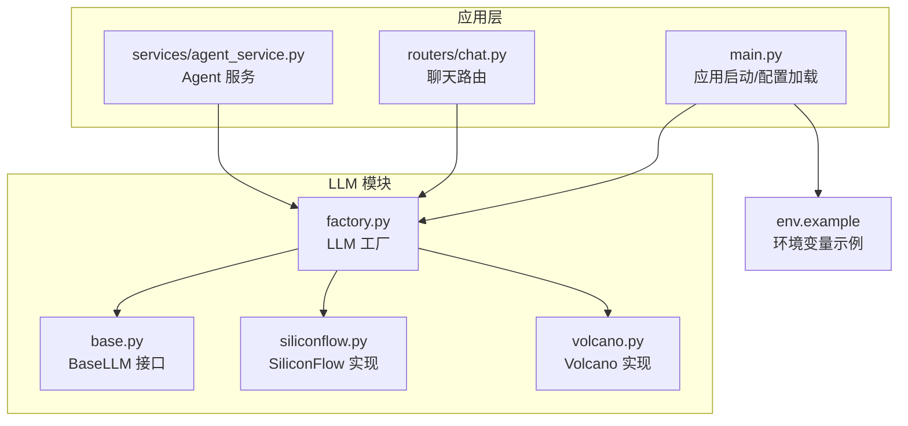
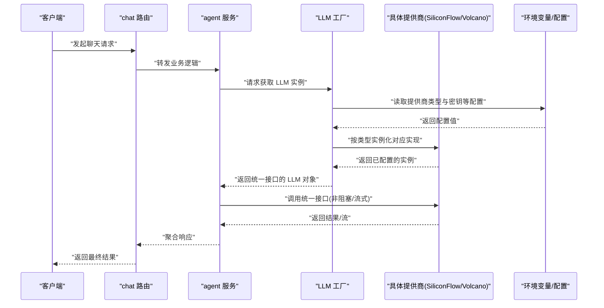
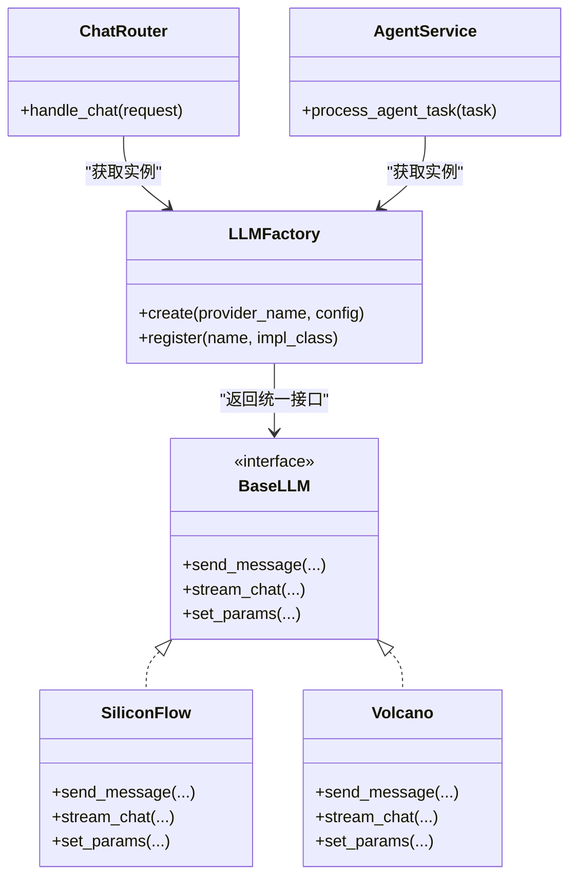

# 工厂模式

<cite>
**本文引用的文件**   
- [backend/app/llm/base.py](file://backend/app/llm/base.py)
- [backend/app/llm/factory.py](file://backend/app/llm/factory.py)
- [backend/app/llm/siliconflow.py](file://backend/app/llm/siliconflow.py)
- [backend/app/llm/volcano.py](file://backend/app/llm/volcano.py)
- [backend/app/routers/chat.py](file://backend/app/routers/chat.py)
- [backend/app/services/agent_service.py](file://backend/app/services/agent_service.py)
- [backend/app/main.py](file://backend/app/main.py)
- [backend/env.example](file://backend/env.example)
</cite>

## 目录
1. [简介](#简介)
2. [项目结构](#项目结构)
3. [核心组件](#核心组件)
4. [架构总览](#架构总览)
5. [详细组件分析](#详细组件分析)
6. [依赖关系分析](#依赖关系分析)
7. [性能考虑](#性能考虑)
8. [故障排查指南](#故障排查指南)
9. [结论](#结论)
10. [附录](#附录)

## 简介
本文件围绕 PolyStudio 后端中 LLM 提供商的抽象与工厂模式实现进行系统化文档说明。重点包括：
- BaseLLM 接口定义与职责边界
- 具体提供商实现（SiliconFlow、Volcano）的职责与差异
- 工厂类如何根据配置或环境变量动态选择并实例化具体提供商
- 如何通过配置文件或环境变量切换不同 LLM 提供商
- 工厂模式在开闭原则下的扩展方式（新增提供商无需修改现有代码）
- 配置管理、依赖注入与生命周期管理在工厂中的落地方式
- 错误处理策略与最佳实践

## 项目结构
与 LLM 工厂模式相关的核心代码位于 backend/app/llm 目录下，并通过路由与服务层消费该能力。

图示来源
- [backend/app/llm/base.py](file://backend/app/llm/base.py)
- [backend/app/llm/factory.py](file://backend/app/llm/factory.py)
- [backend/app/llm/siliconflow.py](file://backend/app/llm/siliconflow.py)
- [backend/app/llm/volcano.py](file://backend/app/llm/volcano.py)
- [backend/app/main.py](file://backend/app/main.py)
- [backend/app/routers/chat.py](file://backend/app/routers/chat.py)
- [backend/app/services/agent_service.py](file://backend/app/services/agent_service.py)
- [backend/env.example](file://backend/env.example)

章节来源
- [backend/app/llm/base.py](file://backend/app/llm/base.py)
- [backend/app/llm/factory.py](file://backend/app/llm/factory.py)
- [backend/app/llm/siliconflow.py](file://backend/app/llm/siliconflow.py)
- [backend/app/llm/volcano.py](file://backend/app/llm/volcano.py)
- [backend/app/main.py](file://backend/app/main.py)
- [backend/app/routers/chat.py](file://backend/app/routers/chat.py)
- [backend/app/services/agent_service.py](file://backend/app/services/agent_service.py)
- [backend/env.example](file://backend/env.example)

## 核心组件
- BaseLLM 接口
  - 定义统一的 LLM 调用契约，如消息发送、流式输出、模型参数等。所有具体提供商必须实现这些方法，以保证上层调用一致。
- SiliconFlow 实现
  - 基于 SiliconFlow 的 SDK/HTTP 客户端封装，提供与 BaseLLM 一致的接口实现。
- Volcano 实现
  - 基于火山引擎的 SDK/HTTP 客户端封装，提供与 BaseLLM 一致的接口实现。
- LLM 工厂
  - 负责根据配置（环境变量或配置文件）动态创建并返回具体的 LLM 实例；对外暴露统一入口，屏蔽具体实现细节。

章节来源
- [backend/app/llm/base.py](file://backend/app/llm/base.py)
- [backend/app/llm/siliconflow.py](file://backend/app/llm/siliconflow.py)
- [backend/app/llm/volcano.py](file://backend/app/llm/volcano.py)
- [backend/app/llm/factory.py](file://backend/app/llm/factory.py)

## 架构总览
下图展示了从应用层到 LLM 工厂及具体实现的调用链路，以及配置来源对实例化的影响。

图示来源
- [backend/app/routers/chat.py](file://backend/app/routers/chat.py)
- [backend/app/services/agent_service.py](file://backend/app/services/agent_service.py)
- [backend/app/llm/factory.py](file://backend/app/llm/factory.py)
- [backend/app/llm/siliconflow.py](file://backend/app/llm/siliconflow.py)
- [backend/app/llm/volcano.py](file://backend/app/llm/volcano.py)
- [backend/env.example](file://backend/env.example)

## 详细组件分析

### BaseLLM 接口设计
- 目标
  - 为所有 LLM 提供商提供统一的调用契约，确保上层代码只依赖抽象而非具体实现。
- 关键职责
  - 定义统一的对话/消息发送方法
  - 定义流式输出方法（如适用）
  - 定义模型参数与回退策略的统一入口
- 设计要点
  - 方法签名稳定，避免随具体提供商变化而频繁改动
  - 异常类型与错误码约定清晰，便于上层统一处理
  - 支持可选参数（如温度、最大 token 数、系统提示词等）

章节来源
- [backend/app/llm/base.py](file://backend/app/llm/base.py)

### 具体提供商实现：SiliconFlow
- 目标
  - 将 SiliconFlow 的 SDK/HTTP 调用封装为符合 BaseLLM 的实现。
- 关键职责
  - 初始化时加载 API Key、Endpoint、模型名等配置
  - 实现消息发送与流式输出
  - 处理网络异常、鉴权失败、限流等错误
- 设计要点
  - 与 BaseLLM 保持一致的方法语义
  - 内部使用连接池/重试策略提升稳定性
  - 敏感信息通过环境变量注入，避免硬编码

章节来源
- [backend/app/llm/siliconflow.py](file://backend/app/llm/siliconflow.py)

### 具体提供商实现：Volcano
- 目标
  - 将火山引擎的 SDK/HTTP 调用封装为符合 BaseLLM 的实现。
- 关键职责
  - 初始化时加载 AK/SK、Region、模型名等配置
  - 实现消息发送与流式输出
  - 处理网络异常、鉴权失败、限流等错误
- 设计要点
  - 与 BaseLLM 保持一致的方法语义
  - 内部使用连接池/重试策略提升稳定性
  - 敏感信息通过环境变量注入，避免硬编码

章节来源
- [backend/app/llm/volcano.py](file://backend/app/llm/volcano.py)

### 工厂类与动态实例化机制
- 目标
  - 根据运行时配置动态创建并返回具体 LLM 实例，屏蔽实现差异。
- 关键职责
  - 读取配置（环境变量或配置文件）确定提供商类型
  - 校验必要参数（如 API Key、模型名）
  - 实例化对应提供商并返回统一接口对象
  - 对未知提供商或无效配置抛出明确错误
- 设计要点
  - 注册表/映射表维护“提供商名称 -> 实现类”的映射
  - 支持单例或按需创建的生命周期策略
  - 可扩展：新增提供商只需注册映射，无需修改工厂分支逻辑

章节来源
- [backend/app/llm/factory.py](file://backend/app/llm/factory.py)

### 配置管理与环境变量
- 目标
  - 通过环境变量或配置文件控制 LLM 提供商的选择与参数。
- 常见配置项（示例）
  - 提供商类型标识（如 siliconflow、volcano）
  - 各提供商所需的密钥、端点、区域、模型名等
- 加载顺序建议
  - 默认配置 -> 配置文件 -> 环境变量覆盖
- 安全建议
  - 敏感信息仅通过环境变量注入
  - 日志中避免打印密钥等敏感字段

章节来源
- [backend/env.example](file://backend/env.example)

### 依赖注入与生命周期管理
- 依赖注入
  - 工厂作为依赖提供者，向路由或服务层注入统一 LLM 接口实例
  - 服务层不感知具体实现，降低耦合度
- 生命周期
  - 可按需创建新实例，或在应用启动时创建单例
  - 对于长连接/连接池，建议在应用生命周期内复用
- 扩展性
  - 新增提供商仅需实现 BaseLLM 并在工厂注册表中登记

章节来源
- [backend/app/llm/factory.py](file://backend/app/llm/factory.py)
- [backend/app/services/agent_service.py](file://backend/app/services/agent_service.py)
- [backend/app/routers/chat.py](file://backend/app/routers/chat.py)

### 错误处理与健壮性
- 错误分类
  - 配置缺失/非法（如缺少 API Key）
  - 网络异常（超时、DNS 解析失败）
  - 鉴权失败（401/403）
  - 业务异常（模型不可用、配额不足）
- 处理策略
  - 工厂层：校验配置并给出明确错误信息
  - 提供商层：捕获底层异常并转换为统一错误类型
  - 服务层：记录日志、降级策略（如切换到备用提供商）、重试与熔断
- 可观测性
  - 记录关键指标（耗时、错误率、提供商分布）
  - 结构化日志，包含请求 ID、提供商、模型名等上下文

章节来源
- [backend/app/llm/factory.py](file://backend/app/llm/factory.py)
- [backend/app/llm/siliconflow.py](file://backend/app/llm/siliconflow.py)
- [backend/app/llm/volcano.py](file://backend/app/llm/volcano.py)
- [backend/app/services/agent_service.py](file://backend/app/services/agent_service.py)

### 开闭原则与扩展流程
- 开闭原则体现
  - 对扩展开放：新增提供商只需添加实现类并在工厂注册
  - 对修改封闭：现有路由与服务层无需改动
- 新增提供商步骤
  - 实现 BaseLLM 接口
  - 在工厂注册表中登记“名称 -> 实现类”映射
  - 在环境变量/配置中增加对应键值
  - 编写单元测试验证实例化与调用路径

章节来源
- [backend/app/llm/base.py](file://backend/app/llm/base.py)
- [backend/app/llm/factory.py](file://backend/app/llm/factory.py)

### 使用示例（以路径引用代替代码片段）
- 通过环境变量选择提供商
  - 参考：[backend/env.example](file://backend/env.example)
- 在路由中获取并使用 LLM 实例
  - 参考：[backend/app/routers/chat.py](file://backend/app/routers/chat.py)
- 在服务层注入并使用 LLM 实例
  - 参考：[backend/app/services/agent_service.py](file://backend/app/services/agent_service.py)
- 工厂动态实例化流程
  - 参考：[backend/app/llm/factory.py](file://backend/app/llm/factory.py)

## 依赖关系分析
下图展示 LLM 模块与应用层的依赖关系，强调工厂对具体实现的解耦。

图示来源
- [backend/app/llm/base.py](file://backend/app/llm/base.py)
- [backend/app/llm/siliconflow.py](file://backend/app/llm/siliconflow.py)
- [backend/app/llm/volcano.py](file://backend/app/llm/volcano.py)
- [backend/app/llm/factory.py](file://backend/app/llm/factory.py)
- [backend/app/routers/chat.py](file://backend/app/routers/chat.py)
- [backend/app/services/agent_service.py](file://backend/app/services/agent_service.py)

章节来源
- [backend/app/llm/base.py](file://backend/app/llm/base.py)
- [backend/app/llm/factory.py](file://backend/app/llm/factory.py)
- [backend/app/llm/siliconflow.py](file://backend/app/llm/siliconflow.py)
- [backend/app/llm/volcano.py](file://backend/app/llm/volcano.py)
- [backend/app/routers/chat.py](file://backend/app/routers/chat.py)
- [backend/app/services/agent_service.py](file://backend/app/services/agent_service.py)

## 性能考虑
- 连接复用
  - 为每个提供商维护独立的 HTTP 客户端/连接池，减少握手开销
- 并发与背压
  - 流式输出应配合异步 I/O，避免阻塞事件循环
- 重试与退避
  - 针对瞬时错误实施指数退避重试，限制最大重试次数
- 缓存与预取
  - 对静态配置或元数据做本地缓存，减少重复 IO
- 资源清理
  - 应用退出时关闭连接池，避免句柄泄漏

## 故障排查指南
- 常见问题
  - 未设置提供商类型或密钥导致实例化失败
  - 网络不可达或 DNS 解析失败
  - 鉴权失败（401/403）
  - 模型不可用或配额不足
- 定位步骤
  - 检查环境变量是否按示例配置正确
  - 查看工厂日志确认选择的提供商与参数
  - 在提供商层开启调试日志，观察底层请求与响应
  - 使用最小复现用例隔离问题（直连提供商 SDK）
- 恢复策略
  - 配置热更新后重启或重新加载配置
  - 启用备用提供商进行快速恢复
  - 对高频错误实施熔断与告警

章节来源
- [backend/env.example](file://backend/env.example)
- [backend/app/llm/factory.py](file://backend/app/llm/factory.py)
- [backend/app/llm/siliconflow.py](file://backend/app/llm/siliconflow.py)
- [backend/app/llm/volcano.py](file://backend/app/llm/volcano.py)
- [backend/app/services/agent_service.py](file://backend/app/services/agent_service.py)

## 结论
通过 BaseLLM 抽象与工厂模式的结合，PolyStudio 实现了 LLM 提供商的可插拔接入与统一调用。该设计遵循开闭原则，新增提供商无需修改现有路由与服务层代码；借助配置管理与依赖注入，系统在运行期可灵活切换提供商，并通过完善的错误处理与可观测性保障稳定性与可维护性。

## 附录
- 术语
  - 工厂模式：通过工厂类集中管理对象的创建与选择，隐藏具体实现细节
  - 依赖注入：由外部容器或工厂为组件提供其依赖的对象
  - 生命周期管理：控制对象从创建到销毁的全过程
- 相关入口
  - 应用启动与配置加载：[backend/app/main.py](file://backend/app/main.py)
  - 聊天路由：[backend/app/routers/chat.py](file://backend/app/routers/chat.py)
  - Agent 服务：[backend/app/services/agent_service.py](file://backend/app/services/agent_service.py)
  - LLM 工厂与实现：见“核心组件”与“详细组件分析”部分