# 插件化架构

<cite>
**本文引用的文件**   
- [backend/app/services/skill_service.py](file://backend/app/services/skill_service.py)
- [backend/app/tools/skill_tools.py](file://backend/app/tools/skill_tools.py)
- [backend/skills/public/skill-creator/SKILL.md](file://backend/skills/public/skill-creator/SKILL.md)
- [backend/skills/custom/paper-writing/SKILL.md](file://backend/skills/custom/paper-writing/SKILL.md)
- [backend/skills/custom/podcast-creator/SKILL.md](file://backend/skills/custom/podcast-creator/SKILL.md)
- [backend/skills/custom/video-creator/SKILL.md](file://backend/skills/custom/video-creator/SKILL.md)
- [backend/skills/custom/virtual-anchor/SKILL.md](file://backend/skills/custom/virtual-anchor/SKILL.md)
- [backend/skills/custom/xiaohongshu-copywriter/SKILL.md](file://backend/skills/custom/xiaohongshu-copywriter/SKILL.md)
- [backend/skills/public/skill-creator/scripts/init_skill.py](file://backend/skills/public/skill-creator/scripts/init_skill.py)
- [backend/skills/public/skill-creator/scripts/package_skill.py](file://backend/skills/public/skill-creator/scripts/package_skill.py)
- [backend/skills/public/skill-creator/scripts/quick_validate.py](file://backend/skills/public/skill-creator/scripts/quick_validate.py)
- [backend/app/main.py](file://backend/app/main.py)
- [backend/app/routers/chat.py](file://backend/app/routers/chat.py)
- [backend/app/services/agent_service.py](file://backend/app/services/agent_service.py)
- [backend/app/services/stream_processor.py](file://backend/app/services/stream_processor.py)
- [backend/app/tools/workspace_tools.py](file://backend/app/tools/workspace_tools.py)
- [backend/workspace/TOOLS.md](file://backend/workspace/TOOLS.md)
</cite>

## 目录
1. [简介](#简介)
2. [项目结构](#项目结构)
3. [核心组件](#核心组件)
4. [架构总览](#架构总览)
5. [详细组件分析](#详细组件分析)
6. [依赖分析](#依赖分析)
7. [性能考虑](#性能考虑)
8. [故障排查指南](#故障排查指南)
9. [结论](#结论)
10. [附录](#附录)

## 简介
本文件系统性阐述 PolyStudio 的插件化架构与技能系统。重点覆盖：
- SKILL.md 文件格式规范与元数据解析
- 技能的发现、注册、验证与执行流程
- 动态加载机制与执行环境隔离策略
- 热重载、版本兼容性与安全沙箱设计
- 插件间通信协议、事件总线与数据共享策略
- 自定义技能开发步骤、文件组织与依赖管理
- 最佳实践与常见问题排查

## 项目结构
后端采用分层组织，技能系统围绕 skills 目录与 skill_service 服务展开；工具层通过 skill_tools 暴露可被 LLM 调用的能力；路由与服务层负责编排调用链。

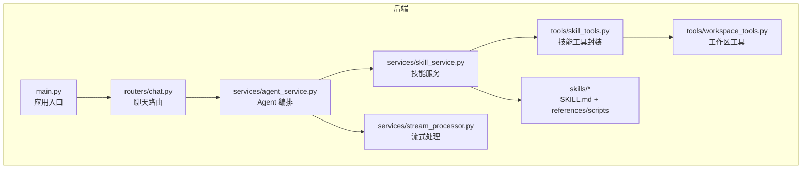

图表来源
- [backend/app/main.py](file://backend/app/main.py)
- [backend/app/routers/chat.py](file://backend/app/routers/chat.py)
- [backend/app/services/agent_service.py](file://backend/app/services/agent_service.py)
- [backend/app/services/skill_service.py](file://backend/app/services/skill_service.py)
- [backend/app/tools/skill_tools.py](file://backend/app/tools/skill_tools.py)
- [backend/app/tools/workspace_tools.py](file://backend/app/tools/workspace_tools.py)
- [backend/app/services/stream_processor.py](file://backend/app/services/stream_processor.py)

章节来源
- [backend/app/main.py](file://backend/app/main.py)
- [backend/app/routers/chat.py](file://backend/app/routers/chat.py)
- [backend/app/services/agent_service.py](file://backend/app/services/agent_service.py)
- [backend/app/services/skill_service.py](file://backend/app/services/skill_service.py)
- [backend/app/tools/skill_tools.py](file://backend/app/tools/skill_tools.py)
- [backend/app/tools/workspace_tools.py](file://backend/app/tools/workspace_tools.py)
- [backend/app/services/stream_processor.py](file://backend/app/services/stream_processor.py)

## 核心组件
- 技能服务（skill_service）：负责技能发现、元数据解析、注册表维护、生命周期管理与执行调度。
- 技能工具（skill_tools）：将技能能力包装为 LLM 可调用的工具接口，提供参数校验与错误归一化。
- 工作区工具（workspace_tools）：提供文件系统、资源访问等基础能力，供技能在受限环境中使用。
- Agent 编排（agent_service）：根据用户意图选择并调用相应技能，协调流式输出与上下文传递。
- 流处理器（stream_processor）：对技能输出的流式数据进行缓冲、合并与转发。

章节来源
- [backend/app/services/skill_service.py](file://backend/app/services/skill_service.py)
- [backend/app/tools/skill_tools.py](file://backend/app/tools/skill_tools.py)
- [backend/app/tools/workspace_tools.py](file://backend/app/tools/workspace_tools.py)
- [backend/app/services/agent_service.py](file://backend/app/services/agent_service.py)
- [backend/app/services/stream_processor.py](file://backend/app/services/stream_processor.py)

## 架构总览
整体调用链路从前端发起聊天请求，经路由进入 Agent 编排，再由技能服务定位并执行对应技能，最终通过流处理器返回结果。

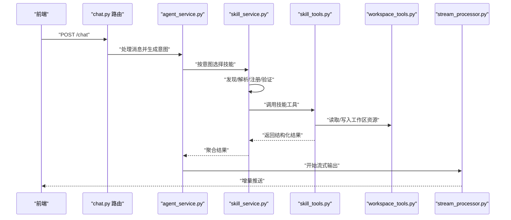

图表来源
- [backend/app/routers/chat.py](file://backend/app/routers/chat.py)
- [backend/app/services/agent_service.py](file://backend/app/services/agent_service.py)
- [backend/app/services/skill_service.py](file://backend/app/services/skill_service.py)
- [backend/app/tools/skill_tools.py](file://backend/app/tools/skill_tools.py)
- [backend/app/tools/workspace_tools.py](file://backend/app/tools/workspace_tools.py)
- [backend/app/services/stream_processor.py](file://backend/app/services/stream_processor.py)

## 详细组件分析

### 技能服务（Skill Service）
职责
- 扫描 skills 目录，识别每个技能的根目录与 SKILL.md
- 解析 SKILL.md 中的元数据（名称、版本、描述、输入输出模式、依赖、权限等）
- 维护技能注册表，支持按标签/类别检索
- 校验技能完整性与兼容性，失败则拒绝加载
- 提供执行入口，封装参数校验、上下文注入与安全隔离

关键流程
- 发现：遍历 public 与 custom 目录，收集候选技能
- 解析：读取 SKILL.md，提取结构化元数据
- 注册：构建技能索引，建立能力到实现的映射
- 验证：检查必填字段、依赖可用性与版本约束
- 执行：在隔离环境中运行技能逻辑，捕获异常并标准化返回

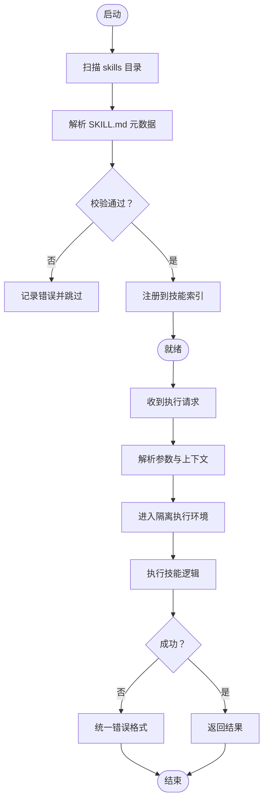

图表来源
- [backend/app/services/skill_service.py](file://backend/app/services/skill_service.py)

章节来源
- [backend/app/services/skill_service.py](file://backend/app/services/skill_service.py)

### 技能工具（Skill Tools）
职责
- 将技能能力封装为 LLM 可调用的工具函数
- 提供统一的参数校验、日志记录与错误转换
- 与工作区工具协作，完成文件读写、资源管理等操作

典型能力
- 列出可用技能与元信息
- 触发指定技能执行并获取结果
- 查询技能文档与参考材料

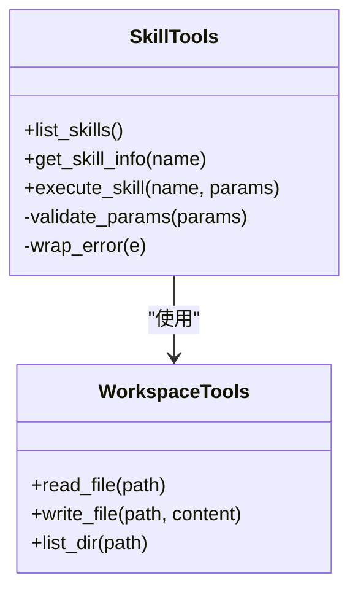

图表来源
- [backend/app/tools/skill_tools.py](file://backend/app/tools/skill_tools.py)
- [backend/app/tools/workspace_tools.py](file://backend/app/tools/workspace_tools.py)

章节来源
- [backend/app/tools/skill_tools.py](file://backend/app/tools/skill_tools.py)
- [backend/app/tools/workspace_tools.py](file://backend/app/tools/workspace_tools.py)

### 工作区工具（Workspace Tools）
职责
- 提供受控的文件系统访问能力
- 限制路径范围，防止越权访问
- 提供资源清单与缓存辅助

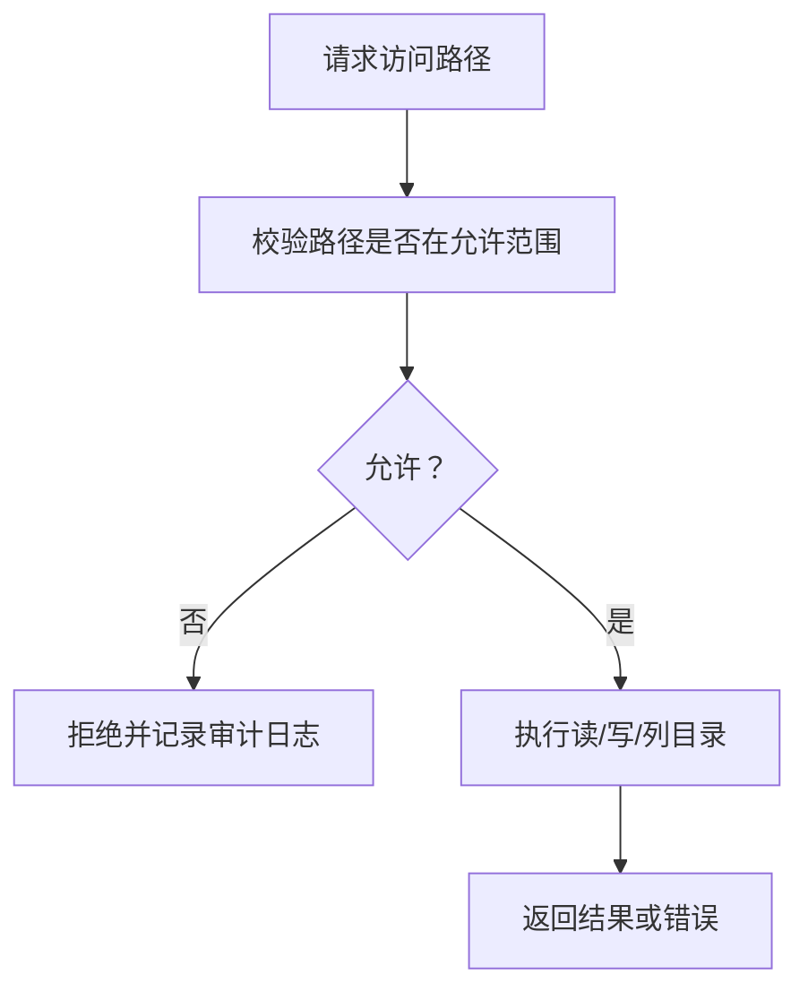

图表来源
- [backend/app/tools/workspace_tools.py](file://backend/app/tools/workspace_tools.py)

章节来源
- [backend/app/tools/workspace_tools.py](file://backend/app/tools/workspace_tools.py)

### Agent 编排（Agent Service）
职责
- 解析用户意图，匹配最合适的技能
- 组装上下文（历史、工作区状态、用户偏好）
- 协调流式输出与重试策略

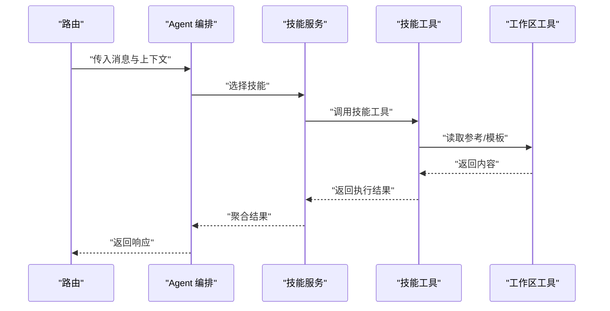

图表来源
- [backend/app/services/agent_service.py](file://backend/app/services/agent_service.py)
- [backend/app/tools/skill_tools.py](file://backend/app/tools/skill_tools.py)
- [backend/app/tools/workspace_tools.py](file://backend/app/tools/workspace_tools.py)

章节来源
- [backend/app/services/agent_service.py](file://backend/app/services/agent_service.py)

### 流处理器（Stream Processor）
职责
- 接收技能输出的流式片段
- 进行去重、排序与合并
- 向客户端稳定推送增量结果

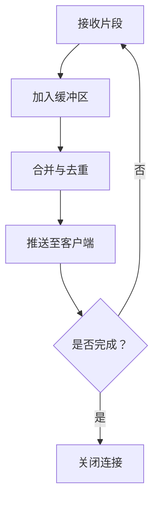

图表来源
- [backend/app/services/stream_processor.py](file://backend/app/services/stream_processor.py)

章节来源
- [backend/app/services/stream_processor.py](file://backend/app/services/stream_processor.py)

### SKILL.md 文件格式规范与元数据解析
SKILL.md 作为技能的声明式契约，包含以下关键元数据：
- 基本信息：名称、版本、作者、许可证、描述
- 能力说明：功能概述、适用场景、前置条件
- 输入输出：参数模式、返回值结构、示例
- 依赖项：外部库、环境变量、API 密钥
- 权限与资源：工作区访问范围、网络访问策略
- 参考材料：references 目录下的模板、提示词、流程图
- 脚本与工具：scripts 目录下的初始化、打包、校验脚本

解析流程
- 读取 SKILL.md，解析 YAML/Markdown 混合结构
- 校验必填字段与类型约束
- 生成技能注册条目，纳入索引
- 若存在 scripts，按需预执行初始化或校验

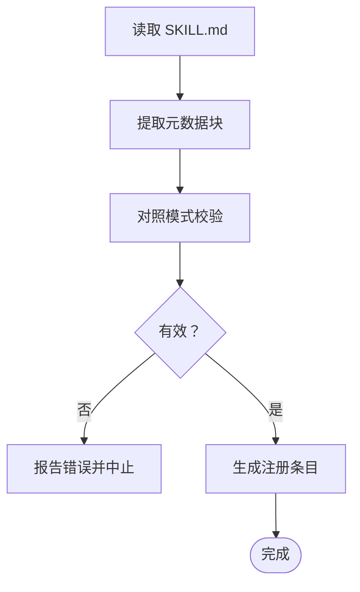

图表来源
- [backend/skills/public/skill-creator/SKILL.md](file://backend/skills/public/skill-creator/SKILL.md)
- [backend/skills/custom/paper-writing/SKILL.md](file://backend/skills/custom/paper-writing/SKILL.md)
- [backend/skills/custom/podcast-creator/SKILL.md](file://backend/skills/custom/podcast-creator/SKILL.md)
- [backend/skills/custom/video-creator/SKILL.md](file://backend/skills/custom/video-creator/SKILL.md)
- [backend/skills/custom/virtual-anchor/SKILL.md](file://backend/skills/custom/virtual-anchor/SKILL.md)
- [backend/skills/custom/xiaohongshu-copywriter/SKILL.md](file://backend/skills/custom/xiaohongshu-copywriter/SKILL.md)

章节来源
- [backend/skills/public/skill-creator/SKILL.md](file://backend/skills/public/skill-creator/SKILL.md)
- [backend/skills/custom/paper-writing/SKILL.md](file://backend/skills/custom/paper-writing/SKILL.md)
- [backend/skills/custom/podcast-creator/SKILL.md](file://backend/skills/custom/podcast-creator/SKILL.md)
- [backend/skills/custom/video-creator/SKILL.md](file://backend/skills/custom/video-creator/SKILL.md)
- [backend/skills/custom/virtual-anchor/SKILL.md](file://backend/skills/custom/virtual-anchor/SKILL.md)
- [backend/skills/custom/xiaohongshu-copywriter/SKILL.md](file://backend/skills/custom/xiaohongshu-copywriter/SKILL.md)

### 动态加载机制与执行环境隔离
动态加载
- 监听 skills 目录变更，增量更新注册表
- 支持热重载：无需重启服务即可生效新/改/删的技能
- 版本兼容：基于语义化版本约束，自动降级或提示升级

执行环境隔离
- 进程级隔离：每个技能在独立子进程中运行，避免全局状态污染
- 资源限制：CPU/内存上限、超时控制、I/O 白名单
- 权限模型：仅开放必要的工作区路径与只读参考材料
- 沙箱策略：禁止危险系统调用，拦截网络访问需显式授权

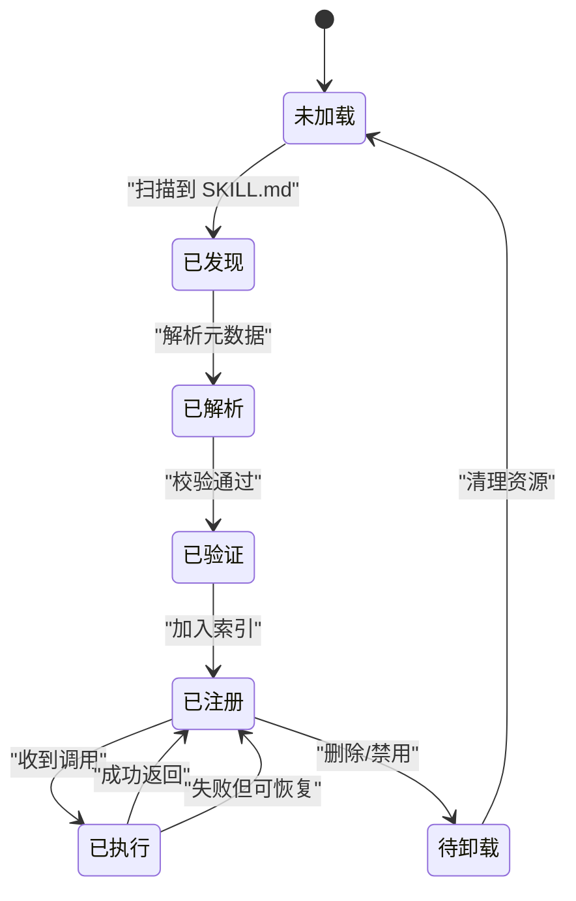

图表来源
- [backend/app/services/skill_service.py](file://backend/app/services/skill_service.py)

章节来源
- [backend/app/services/skill_service.py](file://backend/app/services/skill_service.py)

### 插件间通信协议、事件总线与数据共享策略
通信协议
- 事件驱动：通过事件总线发布/订阅通用事件（如“技能完成”、“资源变更”）
- 消息格式：统一 JSON 结构，包含事件类型、时间戳、来源、负载与签名
- 幂等性：事件携带唯一 ID，支持去重与重试

事件总线
- 内存总线：进程内高效分发，适合轻量事件
- 持久化队列：跨进程可靠投递，支持回放与补偿

数据共享策略
- 工作区共享：通过 workspace_tools 提供的受控路径进行文件交换
- 缓存层：热点数据缓存，减少重复 I/O
- 版本化命名：输出文件带版本号，便于回溯与回滚

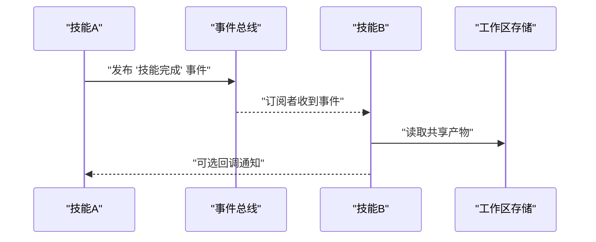

图表来源
- [backend/app/tools/skill_tools.py](file://backend/app/tools/skill_tools.py)
- [backend/app/tools/workspace_tools.py](file://backend/app/tools/workspace_tools.py)

章节来源
- [backend/app/tools/skill_tools.py](file://backend/app/tools/skill_tools.py)
- [backend/app/tools/workspace_tools.py](file://backend/app/tools/workspace_tools.py)

### 自定义技能开发指南与最佳实践
开发步骤
- 创建技能目录：在 custom 下新建目录，放置 SKILL.md 与 references
- 编写 SKILL.md：定义元数据、输入输出、依赖与权限
- 准备参考材料：在 references 中提供模板、提示词与流程图
- 可选脚本：在 scripts 中实现初始化、打包与快速校验
- 本地验证：使用 quick_validate 脚本进行自检
- 打包发布：使用 package_skill 生成可分发包
- 集成测试：在工作区中试运行，确认权限与资源访问正常

文件组织建议
- 根目录：SKILL.md
- references：模板、提示词、示例
- scripts：init_skill.py、package_skill.py、quick_validate.py
- assets：静态资源（图片、样式等）

依赖管理
- 在 SKILL.md 中声明依赖与版本约束
- 使用虚拟环境或容器化方式安装依赖
- 对外部 API 使用环境变量注入，避免硬编码

最佳实践
- 明确输入输出模式，提供示例与边界用例
- 最小权限原则，仅申请必要的文件与网络访问
- 幂等与可重试，确保失败可恢复
- 日志与追踪，记录关键步骤以便排障
- 版本化与向后兼容，遵循语义化版本

章节来源
- [backend/skills/public/skill-creator/scripts/init_skill.py](file://backend/skills/public/skill-creator/scripts/init_skill.py)
- [backend/skills/public/skill-creator/scripts/package_skill.py](file://backend/skills/public/skill-creator/scripts/package_skill.py)
- [backend/skills/public/skill-creator/scripts/quick_validate.py](file://backend/skills/public/skill-creator/scripts/quick_validate.py)
- [backend/workspace/TOOLS.md](file://backend/workspace/TOOLS.md)

## 依赖分析
组件耦合关系
- 路由层依赖 Agent 编排
- Agent 编排依赖技能服务与流处理器
- 技能服务依赖技能工具与工作区工具
- 技能工具依赖工作区工具进行资源访问

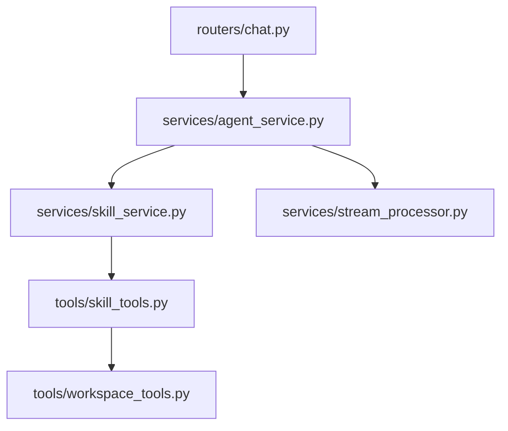

图表来源
- [backend/app/routers/chat.py](file://backend/app/routers/chat.py)
- [backend/app/services/agent_service.py](file://backend/app/services/agent_service.py)
- [backend/app/services/skill_service.py](file://backend/app/services/skill_service.py)
- [backend/app/tools/skill_tools.py](file://backend/app/tools/skill_tools.py)
- [backend/app/tools/workspace_tools.py](file://backend/app/tools/workspace_tools.py)
- [backend/app/services/stream_processor.py](file://backend/app/services/stream_processor.py)

章节来源
- [backend/app/routers/chat.py](file://backend/app/routers/chat.py)
- [backend/app/services/agent_service.py](file://backend/app/services/agent_service.py)
- [backend/app/services/skill_service.py](file://backend/app/services/skill_service.py)
- [backend/app/tools/skill_tools.py](file://backend/app/tools/skill_tools.py)
- [backend/app/tools/workspace_tools.py](file://backend/app/tools/workspace_tools.py)
- [backend/app/services/stream_processor.py](file://backend/app/services/stream_processor.py)

## 性能考虑
- 懒加载与按需解析：仅在首次调用时解析 SKILL.md，后续复用注册表
- 并发执行：对无副作用的技能启用并行执行，提升吞吐
- 流式输出：大结果集采用流式传输，降低首字节延迟
- 缓存策略：对只读参考材料与计算结果进行缓存
- 资源限制：为每个技能设置 CPU/内存上限与超时，避免雪崩

## 故障排查指南
常见问题
- 技能未加载：检查 SKILL.md 语法与必填字段，查看 quick_validate 输出
- 权限不足：确认工作区路径白名单与权限声明
- 依赖缺失：核对依赖列表与环境变量配置
- 执行超时：优化技能逻辑或调整超时阈值
- 事件丢失：检查事件总线状态与重试策略

定位方法
- 查看技能服务日志，关注解析与注册阶段错误
- 使用工具层日志，确认参数校验与错误转换
- 检查工作区工具审计日志，确认路径访问合规
- 复现问题后，使用最小数据集与简化 SKILL.md 逐步定位

章节来源
- [backend/app/services/skill_service.py](file://backend/app/services/skill_service.py)
- [backend/app/tools/skill_tools.py](file://backend/app/tools/skill_tools.py)
- [backend/app/tools/workspace_tools.py](file://backend/app/tools/workspace_tools.py)

## 结论
PolyStudio 的插件化架构以 SKILL.md 为核心契约，结合技能服务、工具封装与工作区隔离，实现了高内聚、低耦合的可扩展体系。通过动态加载、热重载、版本兼容与安全沙箱，系统在灵活性与安全性之间取得平衡。事件总线与数据共享策略进一步增强了插件间的协作能力。遵循本文的开发指南与最佳实践，可快速构建高质量、可维护的技能生态。

## 附录
- 相关入口与编排
  - 应用入口：[backend/app/main.py](file://backend/app/main.py)
  - 聊天路由：[backend/app/routers/chat.py](file://backend/app/routers/chat.py)
  - Agent 编排：[backend/app/services/agent_service.py](file://backend/app/services/agent_service.py)
  - 技能服务：[backend/app/services/skill_service.py](file://backend/app/services/skill_service.py)
  - 技能工具：[backend/app/tools/skill_tools.py](file://backend/app/tools/skill_tools.py)
  - 工作区工具：[backend/app/tools/workspace_tools.py](file://backend/app/tools/workspace_tools.py)
  - 流处理器：[backend/app/services/stream_processor.py](file://backend/app/services/stream_processor.py)
- 技能示例与模板
  - 公共技能创建器：[backend/skills/public/skill-creator/SKILL.md](file://backend/skills/public/skill-creator/SKILL.md)
  - 论文写作：[backend/skills/custom/paper-writing/SKILL.md](file://backend/skills/custom/paper-writing/SKILL.md)
  - 播客创作：[backend/skills/custom/podcast-creator/SKILL.md](file://backend/skills/custom/podcast-creator/SKILL.md)
  - 视频创作：[backend/skills/custom/video-creator/SKILL.md](file://backend/skills/custom/video-creator/SKILL.md)
  - 虚拟主播：[backend/skills/custom/virtual-anchor/SKILL.md](file://backend/skills/custom/virtual-anchor/SKILL.md)
  - 小红书文案：[backend/skills/custom/xiaohongshu-copywriter/SKILL.md](file://backend/skills/custom/xiaohongshu-copywriter/SKILL.md)
- 开发脚本
  - 初始化：[backend/skills/public/skill-creator/scripts/init_skill.py](file://backend/skills/public/skill-creator/scripts/init_skill.py)
  - 打包：[backend/skills/public/skill-creator/scripts/package_skill.py](file://backend/skills/public/skill-creator/scripts/package_skill.py)
  - 快速校验：[backend/skills/public/skill-creator/scripts/quick_validate.py](file://backend/skills/public/skill-creator/scripts/quick_validate.py)
- 工作区工具说明
  - 工具清单：[backend/workspace/TOOLS.md](file://backend/workspace/TOOLS.md)