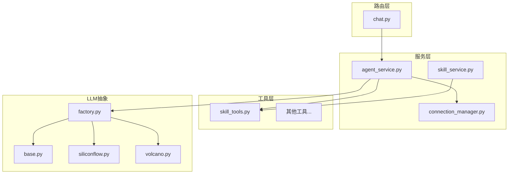
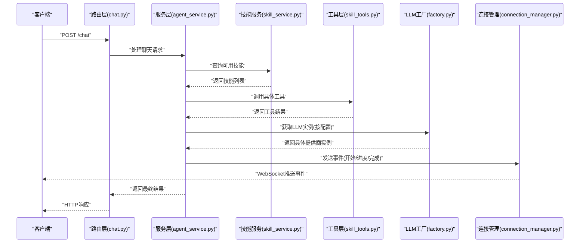
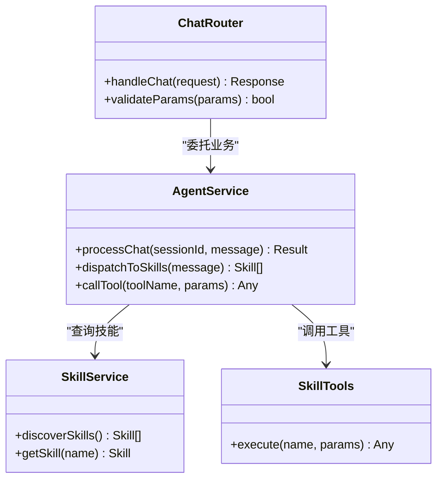
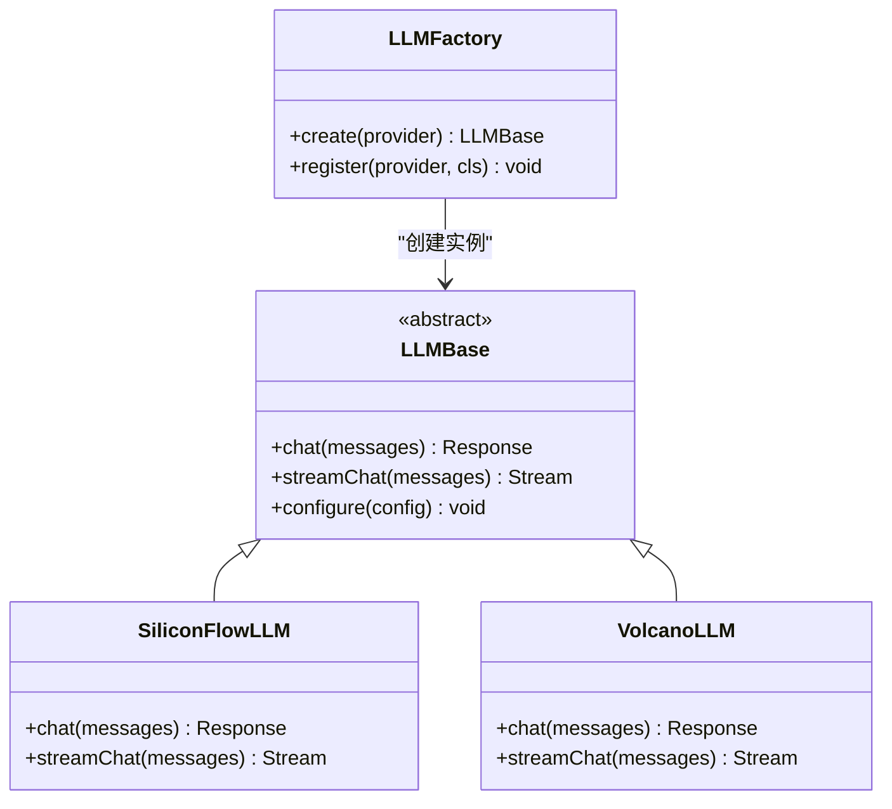
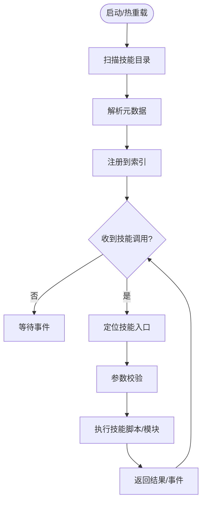
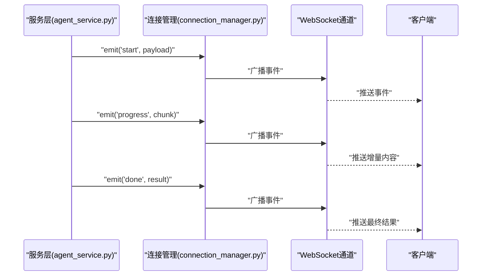
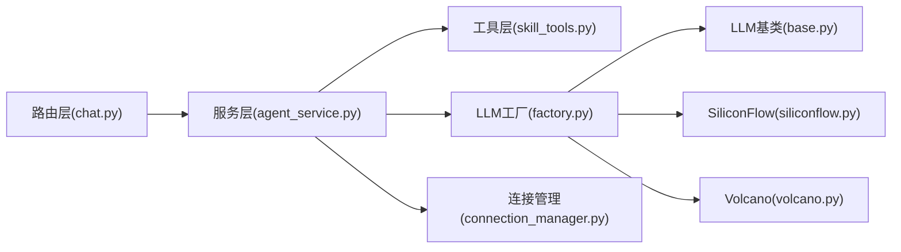

# 核心设计模式

<cite>
**本文引用的文件**   
- [backend/app/main.py](file://backend/app/main.py)
- [backend/app/routers/chat.py](file://backend/app/routers/chat.py)
- [backend/app/services/agent_service.py](file://backend/app/services/agent_service.py)
- [backend/app/services/connection_manager.py](file://backend/app/services/connection_manager.py)
- [backend/app/services/skill_service.py](file://backend/app/services/skill_service.py)
- [backend/app/tools/skill_tools.py](file://backend/app/tools/skill_tools.py)
- [backend/app/llm/base.py](file://backend/app/llm/base.py)
- [backend/app/llm/factory.py](file://backend/app/llm/factory.py)
- [backend/app/llm/siliconflow.py](file://backend/app/llm/siliconflow.py)
- [backend/app/llm/volcano.py](file://backend/app/llm/volcano.py)
</cite>

## 目录
1. [简介](#简介)
2. [项目结构](#项目结构)
3. [核心组件](#核心组件)
4. [架构总览](#架构总览)
5. [详细组件分析](#详细组件分析)
6. [依赖关系分析](#依赖关系分析)
7. [性能考量](#性能考量)
8. [故障排查指南](#故障排查指南)
9. [结论](#结论)
10. [附录](#附录)

## 简介
本文件聚焦于PolyStudio后端的核心设计模式，围绕分层架构（Router → Service → Tool）、工厂模式（LLM提供商抽象）、插件化架构（技能动态发现与加载）以及事件驱动架构（WebSocket通信）进行深入解析。文档通过类图、时序图和流程图等可视化手段，结合具体源码路径，帮助读者理解这些模式如何提升系统的可维护性与可扩展性。

## 项目结构
后端采用清晰的分层组织：
- 路由层（routers）：接收HTTP请求，进行参数校验与响应封装。
- 服务层（services）：编排业务逻辑，协调工具与外部能力。
- 工具层（tools）：实现具体能力（如图像生成、视频处理、工作区操作等）。
- LLM抽象（llm）：通过工厂模式统一不同大模型提供商的接入。
- WebSocket管理（services.connection_manager）：提供连接管理与事件分发。
- 技能系统（services.skill_service + tools.skill_tools + skills目录）：支持技能的动态发现与执行。

图表来源
- [backend/app/routers/chat.py](file://backend/app/routers/chat.py)
- [backend/app/services/agent_service.py](file://backend/app/services/agent_service.py)
- [backend/app/services/connection_manager.py](file://backend/app/services/connection_manager.py)
- [backend/app/services/skill_service.py](file://backend/app/services/skill_service.py)
- [backend/app/tools/skill_tools.py](file://backend/app/tools/skill_tools.py)
- [backend/app/llm/base.py](file://backend/app/llm/base.py)
- [backend/app/llm/factory.py](file://backend/app/llm/factory.py)
- [backend/app/llm/siliconflow.py](file://backend/app/llm/siliconflow.py)
- [backend/app/llm/volcano.py](file://backend/app/llm/volcano.py)

章节来源
- [backend/app/main.py](file://backend/app/main.py)
- [backend/app/routers/chat.py](file://backend/app/routers/chat.py)
- [backend/app/services/agent_service.py](file://backend/app/services/agent_service.py)
- [backend/app/services/connection_manager.py](file://backend/app/services/connection_manager.py)
- [backend/app/services/skill_service.py](file://backend/app/services/skill_service.py)
- [backend/app/tools/skill_tools.py](file://backend/app/tools/skill_tools.py)
- [backend/app/llm/base.py](file://backend/app/llm/base.py)
- [backend/app/llm/factory.py](file://backend/app/llm/factory.py)
- [backend/app/llm/siliconflow.py](file://backend/app/llm/siliconflow.py)
- [backend/app/llm/volcano.py](file://backend/app/llm/volcano.py)

## 核心组件
- 分层架构（Router → Service → Tool）
  - Router负责协议适配与请求路由；Service编排业务流；Tool封装具体能力。该分层降低了耦合度，便于替换与测试。
- LLM工厂模式
  - 通过统一的LLM基类定义接口，工厂根据配置动态创建具体提供商实例，屏蔽差异。
- 插件化技能系统
  - 基于约定目录与元数据，服务层扫描并注册技能，运行时按需加载与执行。
- 事件驱动的WebSocket
  - 连接管理器维护会话与订阅关系，按事件类型广播消息，支持实时交互。

章节来源
- [backend/app/routers/chat.py](file://backend/app/routers/chat.py)
- [backend/app/services/agent_service.py](file://backend/app/services/agent_service.py)
- [backend/app/services/connection_manager.py](file://backend/app/services/connection_manager.py)
- [backend/app/services/skill_service.py](file://backend/app/services/skill_service.py)
- [backend/app/tools/skill_tools.py](file://backend/app/tools/skill_tools.py)
- [backend/app/llm/base.py](file://backend/app/llm/base.py)
- [backend/app/llm/factory.py](file://backend/app/llm/factory.py)
- [backend/app/llm/siliconflow.py](file://backend/app/llm/siliconflow.py)
- [backend/app/llm/volcano.py](file://backend/app/llm/volcano.py)

## 架构总览
下图展示了从HTTP请求到LLM调用与WebSocket推送的整体流程，体现分层与事件驱动的结合。

图表来源
- [backend/app/routers/chat.py](file://backend/app/routers/chat.py)
- [backend/app/services/agent_service.py](file://backend/app/services/agent_service.py)
- [backend/app/services/skill_service.py](file://backend/app/services/skill_service.py)
- [backend/app/tools/skill_tools.py](file://backend/app/tools/skill_tools.py)
- [backend/app/llm/factory.py](file://backend/app/llm/factory.py)
- [backend/app/services/connection_manager.py](file://backend/app/services/connection_manager.py)

## 详细组件分析

### 分层架构（Router → Service → Tool）
- 职责划分
  - Router：解析请求、鉴权、参数校验、错误包装。
  - Service：编排多步骤流程，组合多个Tool与外部服务，管理状态与上下文。
  - Tool：单一职责的能力实现，易于单元测试与复用。
- 优势
  - 低耦合：各层通过明确接口交互，替换某一层不影响整体。
  - 高内聚：同一层内的相关逻辑集中，便于维护。
  - 易扩展：新增能力只需在Tool或Service中扩展，无需改动Router。

图表来源
- [backend/app/routers/chat.py](file://backend/app/routers/chat.py)
- [backend/app/services/agent_service.py](file://backend/app/services/agent_service.py)
- [backend/app/services/skill_service.py](file://backend/app/services/skill_service.py)
- [backend/app/tools/skill_tools.py](file://backend/app/tools/skill_tools.py)

章节来源
- [backend/app/routers/chat.py](file://backend/app/routers/chat.py)
- [backend/app/services/agent_service.py](file://backend/app/services/agent_service.py)
- [backend/app/services/skill_service.py](file://backend/app/services/skill_service.py)
- [backend/app/tools/skill_tools.py](file://backend/app/tools/skill_tools.py)

### 工厂模式（LLM提供商抽象）
- 设计要点
  - 基类定义统一接口（如对话、流式输出、配置读取）。
  - 工厂根据环境变量或配置文件选择具体实现（如SiliconFlow、Volcano）。
  - 新增提供商仅需实现基类并在工厂注册，无需修改调用方。
- 动态加载机制
  - 通过配置键映射到具体类名，工厂反射或导入相应模块并实例化。
  - 支持默认回退与异常隔离，保证稳定性。

图表来源
- [backend/app/llm/base.py](file://backend/app/llm/base.py)
- [backend/app/llm/factory.py](file://backend/app/llm/factory.py)
- [backend/app/llm/siliconflow.py](file://backend/app/llm/siliconflow.py)
- [backend/app/llm/volcano.py](file://backend/app/llm/volcano.py)

章节来源
- [backend/app/llm/base.py](file://backend/app/llm/base.py)
- [backend/app/llm/factory.py](file://backend/app/llm/factory.py)
- [backend/app/llm/siliconflow.py](file://backend/app/llm/siliconflow.py)
- [backend/app/llm/volcano.py](file://backend/app/llm/volcano.py)

### 插件化架构（技能动态发现与加载）
- 发现机制
  - 服务层扫描指定目录（如skills），读取元数据（名称、版本、描述、入口脚本等）。
  - 将发现的技能注册到内存索引，供运行时查找与执行。
- 加载与执行
  - 根据技能名称定位入口脚本或模块，按需导入并调用。
  - 支持参数校验、错误捕获与日志记录。
- 扩展方式
  - 新增技能只需遵循约定目录结构与元数据规范，无需重启即可被服务层发现（或在启动时自动加载）。

图表来源
- [backend/app/services/skill_service.py](file://backend/app/services/skill_service.py)
- [backend/app/tools/skill_tools.py](file://backend/app/tools/skill_tools.py)

章节来源
- [backend/app/services/skill_service.py](file://backend/app/services/skill_service.py)
- [backend/app/tools/skill_tools.py](file://backend/app/tools/skill_tools.py)

### 事件驱动架构（WebSocket通信）
- 连接管理
  - 维护活跃连接集合，支持按会话ID或房间维度订阅。
  - 提供连接建立、断开、心跳检测与重连提示。
- 事件分发
  - 服务层触发事件（如“开始”、“进度”、“完成”、“错误”）。
  - 连接管理器将事件广播给目标订阅者，确保顺序与幂等。
- 前端交互
  - 前端监听事件流，实时更新UI状态，展示流式输出与中间结果。

图表来源
- [backend/app/services/agent_service.py](file://backend/app/services/agent_service.py)
- [backend/app/services/connection_manager.py](file://backend/app/services/connection_manager.py)

章节来源
- [backend/app/services/agent_service.py](file://backend/app/services/agent_service.py)
- [backend/app/services/connection_manager.py](file://backend/app/services/connection_manager.py)

## 依赖关系分析
- 直接依赖
  - Router依赖Service；Service依赖Tool与LLM工厂；LLM工厂依赖具体提供商实现；WebSocket连接管理由Service层使用。
- 间接依赖
  - 技能服务可能依赖文件系统与元数据解析；工具层可能依赖第三方库（图像处理、音视频编解码等）。
- 潜在循环
  - 当前分层清晰，未见明显循环依赖；建议保持单向依赖（上层依赖下层）。

图表来源
- [backend/app/routers/chat.py](file://backend/app/routers/chat.py)
- [backend/app/services/agent_service.py](file://backend/app/services/agent_service.py)
- [backend/app/tools/skill_tools.py](file://backend/app/tools/skill_tools.py)
- [backend/app/llm/factory.py](file://backend/app/llm/factory.py)
- [backend/app/llm/base.py](file://backend/app/llm/base.py)
- [backend/app/llm/siliconflow.py](file://backend/app/llm/siliconflow.py)
- [backend/app/llm/volcano.py](file://backend/app/llm/volcano.py)
- [backend/app/services/connection_manager.py](file://backend/app/services/connection_manager.py)

章节来源
- [backend/app/routers/chat.py](file://backend/app/routers/chat.py)
- [backend/app/services/agent_service.py](file://backend/app/services/agent_service.py)
- [backend/app/tools/skill_tools.py](file://backend/app/tools/skill_tools.py)
- [backend/app/llm/factory.py](file://backend/app/llm/factory.py)
- [backend/app/llm/base.py](file://backend/app/llm/base.py)
- [backend/app/llm/siliconflow.py](file://backend/app/llm/siliconflow.py)
- [backend/app/llm/volcano.py](file://backend/app/llm/volcano.py)
- [backend/app/services/connection_manager.py](file://backend/app/services/connection_manager.py)

## 性能考量
- 分层优化
  - 在Service层缓存热点技能索引与LLM配置，减少重复IO与解析开销。
  - 对长耗时工具调用采用异步任务与超时控制，避免阻塞主线程。
- LLM调用优化
  - 启用流式输出，降低首字节延迟；合理设置重试与熔断策略。
- WebSocket优化
  - 批量合并小事件，减少网络抖动；为高频事件设置节流与去重。
- 资源管理
  - 对文件与网络连接进行池化与回收，防止泄漏。

[本节为通用指导，不直接分析具体文件]

## 故障排查指南
- 常见问题
  - LLM初始化失败：检查工厂配置与提供商凭据；查看工厂创建过程的异常栈。
  - 技能未找到：确认技能目录结构与元数据是否完整；检查服务层扫描路径。
  - WebSocket无推送：验证连接管理器订阅是否正确；检查事件命名与路由。
- 定位方法
  - 在关键路径添加结构化日志（进入/退出、输入输出摘要、异常堆栈）。
  - 使用连接管理器的事件追踪，定位丢包或乱序问题。
  - 对工具层增加参数校验与边界用例测试，快速复现问题。

章节来源
- [backend/app/llm/factory.py](file://backend/app/llm/factory.py)
- [backend/app/services/skill_service.py](file://backend/app/services/skill_service.py)
- [backend/app/services/connection_manager.py](file://backend/app/services/connection_manager.py)

## 结论
通过分层架构、工厂模式、插件化与事件驱动的综合运用，PolyStudio实现了高内聚、低耦合与强扩展性的后端体系。各模式相互配合，使系统在引入新LLM提供商、新增技能与增强实时交互时具备平滑演进能力，显著提升可维护性与可扩展性。

[本节为总结性内容，不直接分析具体文件]

## 附录
- 最佳实践
  - 严格遵循分层职责边界，避免跨层调用。
  - 工厂注册与配置项集中管理，便于审计与切换。
  - 技能元数据规范化，配合自动化校验脚本保障质量。
  - WebSocket事件命名与载荷约定统一，前后端协同开发。

[本节为补充说明，不直接分析具体文件]