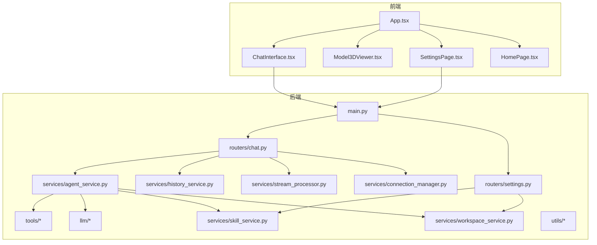
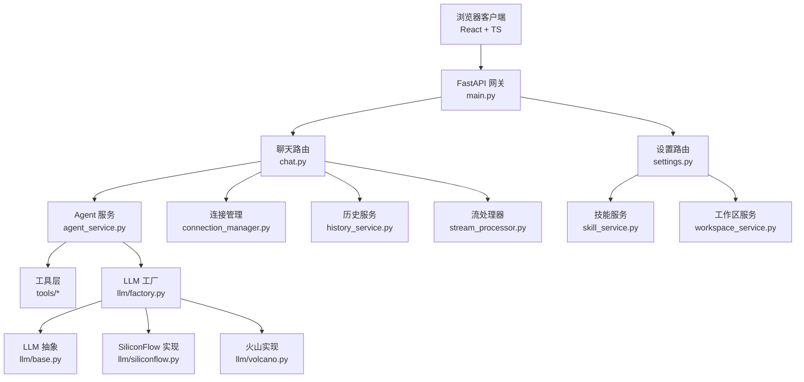
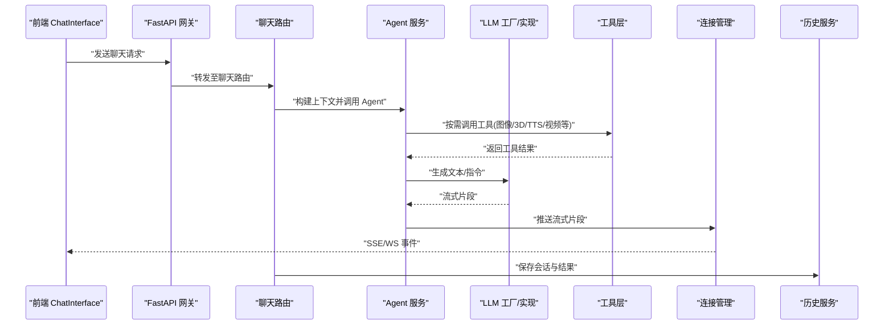
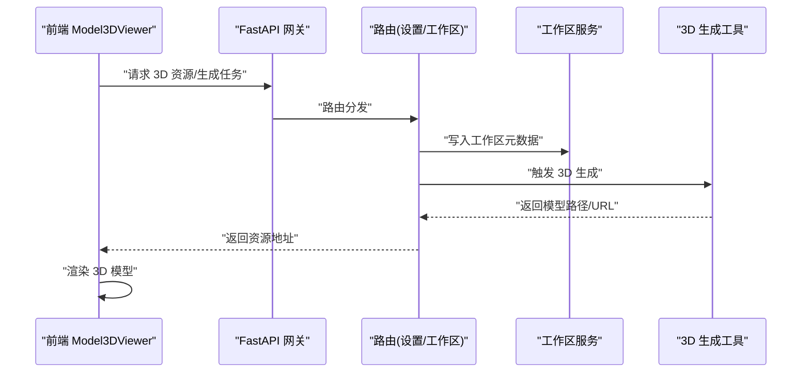
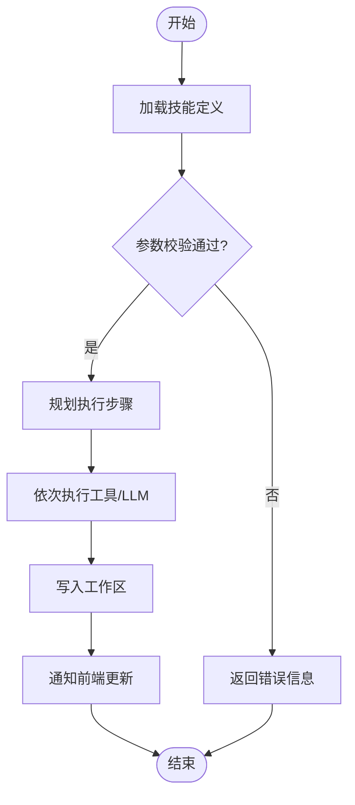
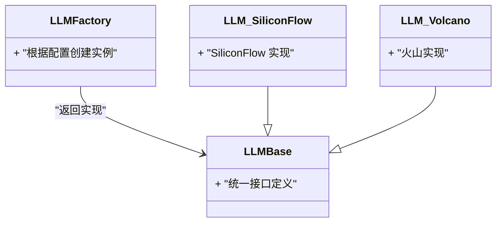
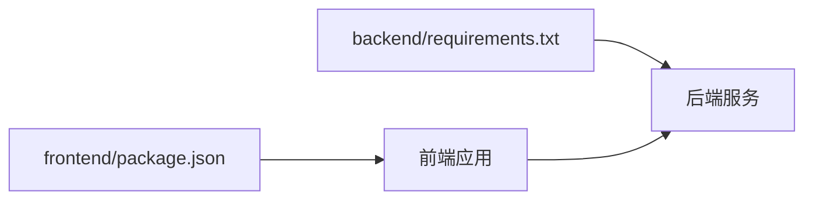
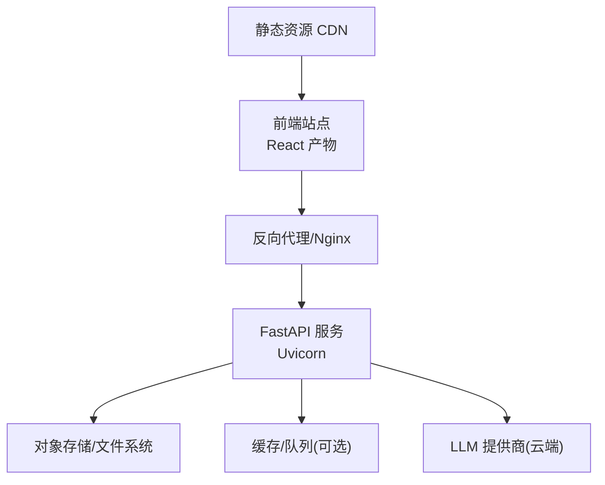

# 系统概览

<cite>
**本文引用的文件**   
- [backend/app/main.py](file://backend/app/main.py)
- [backend/app/routers/chat.py](file://backend/app/routers/chat.py)
- [backend/app/routers/settings.py](file://backend/app/routers/settings.py)
- [backend/app/services/agent_service.py](file://backend/app/services/agent_service.py)
- [backend/app/services/connection_manager.py](file://backend/app/services/connection_manager.py)
- [backend/app/services/history_service.py](file://backend/app/services/history_service.py)
- [backend/app/services/skill_service.py](file://backend/app/services/skill_service.py)
- [backend/app/services/stream_processor.py](file://backend/app/services/stream_processor.py)
- [backend/app/services/workspace_service.py](file://backend/app/services/workspace_service.py)
- [backend/app/tools/image_generation.py](file://backend/app/tools/image_generation.py)
- [backend/app/tools/model_3d_generation.py](file://backend/app/tools/model_3d_generation.py)
- [backend/app/tools/qwen_tts.py](file://backend/app/tools/qwen_tts.py)
- [backend/app/tools/video_concatenation.py](file://backend/app/tools/video_concatenation.py)
- [backend/app/tools/virtual_anchor_generation.py](file://backend/app/tools/virtual_anchor_generation.py)
- [backend/app/tools/audio_mixing.py](file://backend/app/tools/audio_mixing.py)
- [backend/app/tools/qwen_omni_understanding.py](file://backend/app/tools/qwen_omni_understanding.py)
- [backend/app/tools/skill_tools.py](file://backend/app/tools/skill_tools.py)
- [backend/app/tools/workspace_tools.py](file://backend/app/tools/workspace_tools.py)
- [backend/app/llm/base.py](file://backend/app/llm/base.py)
- [backend/app/llm/factory.py](file://backend/app/llm/factory.py)
- [backend/app/llm/siliconflow.py](file://backend/app/llm/siliconflow.py)
- [backend/app/llm/volcano.py](file://backend/app/llm/volcano.py)
- [backend/app/utils/logger.py](file://backend/app/utils/logger.py)
- [frontend/src/App.tsx](file://frontend/src/App.tsx)
- [frontend/src/components/ChatInterface.tsx](file://frontend/src/components/ChatInterface.tsx)
- [frontend/src/components/Model3DViewer.tsx](file://frontend/src/components/Model3DViewer.tsx)
- [frontend/src/components/SettingsPage.tsx](file://frontend/src/components/SettingsPage.tsx)
- [frontend/src/components/HomePage.tsx](file://frontend/src/components/HomePage.tsx)
- [frontend/package.json](file://frontend/package.json)
- [backend/requirements.txt](file://backend/requirements.txt)
</cite>

## 目录
1. [简介](#简介)
2. [项目结构](#项目结构)
3. [核心组件](#核心组件)
4. [架构总览](#架构总览)
5. [详细组件分析](#详细组件分析)
6. [依赖分析](#依赖分析)
7. [性能考虑](#性能考虑)
8. [故障排查指南](#故障排查指南)
9. [结论](#结论)
10. [附录](#附录)

## 简介
本文件为 PolyStudio 系统的整体概览文档，聚焦于以下目标：
- 阐述系统核心目标与主要功能模块
- 解释前后端分离的设计模式与职责划分（FastAPI 后端 + React 前端）
- 说明核心特性：AI 驱动的多模态内容创作、实时聊天界面、3D 模型查看器、工作区管理与技能系统
- 提供系统架构图与数据流向说明
- 解释技术栈选择的原因与优势
- 给出部署基本拓扑图

PolyStudio 是一个面向多模态内容创作的 AI 平台，通过“对话即创作”的方式，将文本、图像、视频、音频与 3D 模型等能力统一编排到工作区中，并以“技能”形式进行可复用封装。

## 项目结构
仓库采用前后端分离的组织方式：
- 后端 backend：基于 FastAPI 的 Python 服务，包含路由层、服务层、工具层、LLM 适配层与日志等通用能力
- 前端 frontend：基于 React + TypeScript 的单页应用，提供聊天、3D 查看器、设置与工作区页面
- 根目录 polystudio-client 与 skills 目录用于技能定义与示例

图表来源
- [backend/app/main.py](file://backend/app/main.py)
- [backend/app/routers/chat.py](file://backend/app/routers/chat.py)
- [backend/app/routers/settings.py](file://backend/app/routers/settings.py)
- [backend/app/services/agent_service.py](file://backend/app/services/agent_service.py)
- [backend/app/services/connection_manager.py](file://backend/app/services/connection_manager.py)
- [backend/app/services/history_service.py](file://backend/app/services/history_service.py)
- [backend/app/services/skill_service.py](file://backend/app/services/skill_service.py)
- [backend/app/services/stream_processor.py](file://backend/app/services/stream_processor.py)
- [backend/app/services/workspace_service.py](file://backend/app/services/workspace_service.py)
- [frontend/src/App.tsx](file://frontend/src/App.tsx)
- [frontend/src/components/ChatInterface.tsx](file://frontend/src/components/ChatInterface.tsx)
- [frontend/src/components/Model3DViewer.tsx](file://frontend/src/components/Model3DViewer.tsx)
- [frontend/src/components/SettingsPage.tsx](file://frontend/src/components/SettingsPage.tsx)
- [frontend/src/components/HomePage.tsx](file://frontend/src/components/HomePage.tsx)

章节来源
- [backend/app/main.py](file://backend/app/main.py)
- [frontend/src/App.tsx](file://frontend/src/App.tsx)

## 核心组件
- 路由层
  - 聊天路由：处理会话消息、流式响应、历史查询等
  - 设置路由：管理技能与工作区相关配置
- 服务层
  - Agent 服务：编排 LLM 调用、工具执行与结果组装
  - 连接管理：维护 WebSocket 连接与会话上下文
  - 历史服务：持久化与检索聊天记录
  - 技能服务：加载、注册与执行技能
  - 流处理器：对 LLM 输出进行分块与格式化处理
  - 工作区服务：管理工作区资源与状态
- 工具层
  - 图像生成、3D 模型生成、TTS、视频拼接、虚拟人、音频混音、多模态理解、工作区工具、技能工具等
- LLM 适配层
  - 抽象基类与工厂，支持多种 LLM 提供商（如 SiliconFlow、火山引擎）
- 前端组件
  - 聊天界面、3D 模型查看器、设置页、首页与应用入口

章节来源
- [backend/app/routers/chat.py](file://backend/app/routers/chat.py)
- [backend/app/routers/settings.py](file://backend/app/routers/settings.py)
- [backend/app/services/agent_service.py](file://backend/app/services/agent_service.py)
- [backend/app/services/connection_manager.py](file://backend/app/services/connection_manager.py)
- [backend/app/services/history_service.py](file://backend/app/services/history_service.py)
- [backend/app/services/skill_service.py](file://backend/app/services/skill_service.py)
- [backend/app/services/stream_processor.py](file://backend/app/services/stream_processor.py)
- [backend/app/services/workspace_service.py](file://backend/app/services/workspace_service.py)
- [backend/app/tools/image_generation.py](file://backend/app/tools/image_generation.py)
- [backend/app/tools/model_3d_generation.py](file://backend/app/tools/model_3d_generation.py)
- [backend/app/tools/qwen_tts.py](file://backend/app/tools/qwen_tts.py)
- [backend/app/tools/video_concatenation.py](file://backend/app/tools/video_concatenation.py)
- [backend/app/tools/virtual_anchor_generation.py](file://backend/app/tools/virtual_anchor_generation.py)
- [backend/app/tools/audio_mixing.py](file://backend/app/tools/audio_mixing.py)
- [backend/app/tools/qwen_omni_understanding.py](file://backend/app/tools/qwen_omni_understanding.py)
- [backend/app/tools/skill_tools.py](file://backend/app/tools/skill_tools.py)
- [backend/app/tools/workspace_tools.py](file://backend/app/tools/workspace_tools.py)
- [backend/app/llm/base.py](file://backend/app/llm/base.py)
- [backend/app/llm/factory.py](file://backend/app/llm/factory.py)
- [backend/app/llm/siliconflow.py](file://backend/app/llm/siliconflow.py)
- [backend/app/llm/volcano.py](file://backend/app/llm/volcano.py)
- [frontend/src/components/ChatInterface.tsx](file://frontend/src/components/ChatInterface.tsx)
- [frontend/src/components/Model3DViewer.tsx](file://frontend/src/components/Model3DViewer.tsx)
- [frontend/src/components/SettingsPage.tsx](file://frontend/src/components/SettingsPage.tsx)
- [frontend/src/components/HomePage.tsx](file://frontend/src/components/HomePage.tsx)

## 架构总览
系统采用前后端分离架构：
- 前端使用 React + TypeScript，负责用户交互、渲染与本地状态管理
- 后端使用 FastAPI，提供 REST/WS API，编排 AI 能力与工具链
- LLM 适配层屏蔽不同厂商差异，便于扩展
- 工具层以模块化方式提供多模态能力
- 工作区与服务层共同支撑会话、历史与资源管理

图表来源
- [backend/app/main.py](file://backend/app/main.py)
- [backend/app/routers/chat.py](file://backend/app/routers/chat.py)
- [backend/app/routers/settings.py](file://backend/app/routers/settings.py)
- [backend/app/services/agent_service.py](file://backend/app/services/agent_service.py)
- [backend/app/services/connection_manager.py](file://backend/app/services/connection_manager.py)
- [backend/app/services/history_service.py](file://backend/app/services/history_service.py)
- [backend/app/services/skill_service.py](file://backend/app/services/skill_service.py)
- [backend/app/services/stream_processor.py](file://backend/app/services/stream_processor.py)
- [backend/app/services/workspace_service.py](file://backend/app/services/workspace_service.py)
- [backend/app/llm/base.py](file://backend/app/llm/base.py)
- [backend/app/llm/factory.py](file://backend/app/llm/factory.py)
- [backend/app/llm/siliconflow.py](file://backend/app/llm/siliconflow.py)
- [backend/app/llm/volcano.py](file://backend/app/llm/volcano.py)

## 详细组件分析

### 聊天与实时流式交互
- 职责划分
  - 前端 ChatInterface 负责消息展示、输入与 SSE/WS 事件处理
  - 后端 chat 路由接收请求，交由 Agent 服务编排，并通过连接管理器推送流式片段
  - 历史服务记录会话上下文，供后续轮次或回放使用
- 关键流程
  - 前端发起聊天请求
  - 路由校验并创建/获取会话
  - Agent 服务根据提示词与上下文调用 LLM 与工具
  - 流处理器对输出进行分块，经连接管理器推送到前端
  - 历史服务持久化消息与中间结果

图表来源
- [backend/app/routers/chat.py](file://backend/app/routers/chat.py)
- [backend/app/services/agent_service.py](file://backend/app/services/agent_service.py)
- [backend/app/services/connection_manager.py](file://backend/app/services/connection_manager.py)
- [backend/app/services/history_service.py](file://backend/app/services/history_service.py)
- [backend/app/services/stream_processor.py](file://backend/app/services/stream_processor.py)
- [backend/app/llm/factory.py](file://backend/app/llm/factory.py)
- [backend/app/llm/base.py](file://backend/app/llm/base.py)
- [backend/app/llm/siliconflow.py](file://backend/app/llm/siliconflow.py)
- [backend/app/llm/volcano.py](file://backend/app/llm/volcano.py)
- [frontend/src/components/ChatInterface.tsx](file://frontend/src/components/ChatInterface.tsx)

章节来源
- [backend/app/routers/chat.py](file://backend/app/routers/chat.py)
- [backend/app/services/agent_service.py](file://backend/app/services/agent_service.py)
- [backend/app/services/connection_manager.py](file://backend/app/services/connection_manager.py)
- [backend/app/services/history_service.py](file://backend/app/services/history_service.py)
- [backend/app/services/stream_processor.py](file://backend/app/services/stream_processor.py)
- [frontend/src/components/ChatInterface.tsx](file://frontend/src/components/ChatInterface.tsx)

### 3D 模型查看器
- 职责划分
  - 前端 Model3DViewer 负责 3D 场景渲染与交互
  - 后端 model_3d_generation 工具提供 3D 模型生成或转换能力
- 数据流
  - 前端请求生成或加载 3D 资源
  - 后端工具生成模型文件或引用
  - 前端渲染并支持旋转、缩放等操作

图表来源
- [backend/app/tools/model_3d_generation.py](file://backend/app/tools/model_3d_generation.py)
- [backend/app/services/workspace_service.py](file://backend/app/services/workspace_service.py)
- [frontend/src/components/Model3DViewer.tsx](file://frontend/src/components/Model3DViewer.tsx)

章节来源
- [backend/app/tools/model_3d_generation.py](file://backend/app/tools/model_3d_generation.py)
- [backend/app/services/workspace_service.py](file://backend/app/services/workspace_service.py)
- [frontend/src/components/Model3DViewer.tsx](file://frontend/src/components/Model3DViewer.tsx)

### 工作区与技能系统
- 工作区服务
  - 管理资源索引、版本与访问权限
  - 与工具层协作完成读写与生命周期管理
- 技能服务
  - 加载技能描述与脚本
  - 编排技能工作流，组合多个工具与 LLM 调用
- 典型流程
  - 用户在设置页选择或创建技能
  - 后端解析技能定义，按工作流顺序执行工具
  - 结果回写工作区并通知前端刷新

图表来源
- [backend/app/services/skill_service.py](file://backend/app/services/skill_service.py)
- [backend/app/services/workspace_service.py](file://backend/app/services/workspace_service.py)
- [backend/app/tools/skill_tools.py](file://backend/app/tools/skill_tools.py)
- [backend/app/tools/workspace_tools.py](file://backend/app/tools/workspace_tools.py)
- [frontend/src/components/SettingsPage.tsx](file://frontend/src/components/SettingsPage.tsx)

章节来源
- [backend/app/services/skill_service.py](file://backend/app/services/skill_service.py)
- [backend/app/services/workspace_service.py](file://backend/app/services/workspace_service.py)
- [backend/app/tools/skill_tools.py](file://backend/app/tools/skill_tools.py)
- [backend/app/tools/workspace_tools.py](file://backend/app/tools/workspace_tools.py)
- [frontend/src/components/SettingsPage.tsx](file://frontend/src/components/SettingsPage.tsx)

### LLM 适配层
- 设计要点
  - 抽象基类定义统一接口
  - 工厂根据配置选择具体实现
  - 各实现封装不同厂商 SDK 与鉴权
- 扩展性
  - 新增 LLM 只需实现基类接口并在工厂注册

图表来源
- [backend/app/llm/base.py](file://backend/app/llm/base.py)
- [backend/app/llm/factory.py](file://backend/app/llm/factory.py)
- [backend/app/llm/siliconflow.py](file://backend/app/llm/siliconflow.py)
- [backend/app/llm/volcano.py](file://backend/app/llm/volcano.py)

章节来源
- [backend/app/llm/base.py](file://backend/app/llm/base.py)
- [backend/app/llm/factory.py](file://backend/app/llm/factory.py)
- [backend/app/llm/siliconflow.py](file://backend/app/llm/siliconflow.py)
- [backend/app/llm/volcano.py](file://backend/app/llm/volcano.py)

### 多模态工具集
- 图像生成：提供文生图等能力
- 3D 模型生成：生成或转换 3D 资产
- TTS：文本转语音
- 视频拼接：合并片段、添加字幕/封面
- 虚拟人：生成数字人或播报素材
- 音频混音：多轨合成与效果处理
- 多模态理解：图文/音视频理解与结构化输出
- 工作区工具：文件上传、下载、索引与清理
- 技能工具：技能打包、校验与快速验证

章节来源
- [backend/app/tools/image_generation.py](file://backend/app/tools/image_generation.py)
- [backend/app/tools/model_3d_generation.py](file://backend/app/tools/model_3d_generation.py)
- [backend/app/tools/qwen_tts.py](file://backend/app/tools/qwen_tts.py)
- [backend/app/tools/video_concatenation.py](file://backend/app/tools/video_concatenation.py)
- [backend/app/tools/virtual_anchor_generation.py](file://backend/app/tools/virtual_anchor_generation.py)
- [backend/app/tools/audio_mixing.py](file://backend/app/tools/audio_mixing.py)
- [backend/app/tools/qwen_omni_understanding.py](file://backend/app/tools/qwen_omni_understanding.py)
- [backend/app/tools/workspace_tools.py](file://backend/app/tools/workspace_tools.py)
- [backend/app/tools/skill_tools.py](file://backend/app/tools/skill_tools.py)

## 依赖分析
- 前端依赖
  - React、TypeScript、Vite 构建工具
  - 包管理由 package.json 声明
- 后端依赖
  - FastAPI、Uvicorn、WebSocket 支持
  - 多模态工具与 LLM SDK 在 requirements.txt 中声明
- 耦合关系
  - 路由层仅依赖服务层，避免直接耦合工具与 LLM
  - 服务层通过工厂与工具接口解耦外部依赖
  - 前端通过 HTTP/WS 与后端通信，无直接内部依赖

图表来源
- [frontend/package.json](file://frontend/package.json)
- [backend/requirements.txt](file://backend/requirements.txt)
- [backend/app/main.py](file://backend/app/main.py)

章节来源
- [frontend/package.json](file://frontend/package.json)
- [backend/requirements.txt](file://backend/requirements.txt)

## 性能考虑
- 流式传输
  - 使用流处理器与连接管理器实现增量推送，降低首屏延迟
- 并发与异步
  - 利用 FastAPI 异步能力与 Uvicorn 高并发 I/O
- 缓存与持久化
  - 历史服务与工具层可对热点数据进行缓存或对象存储优化
- 资源管理
  - 工作区服务应实现大文件分片上传与断点续传
- 可扩展性
  - LLM 工厂与工具插件化，便于横向扩展与灰度发布

[本节为通用指导，不直接分析具体文件]

## 故障排查指南
- 常见问题定位
  - 检查后端日志输出，确认异常堆栈与上下文
  - 核对 LLM 提供商鉴权与配额
  - 验证工作区路径与权限
- 建议
  - 在关键路径增加结构化日志与指标上报
  - 对长耗时任务引入重试与超时控制
  - 前端对网络异常与空状态做友好提示

章节来源
- [backend/app/utils/logger.py](file://backend/app/utils/logger.py)

## 结论
PolyStudio 通过前后端分离与模块化设计，将 AI 多模态能力以“技能”的形式组织，结合工作区与流式交互，形成“对话即创作”的高效体验。其架构具备良好的扩展性与可维护性，适合持续演进与生态集成。

## 附录

### 技术栈选择与优势
- 前端
  - React + TypeScript：类型安全、生态成熟、组件化开发
  - Vite：快速构建与热更新，提升开发效率
- 后端
  - FastAPI：高性能异步框架，原生支持 OpenAPI 与 WebSocket
  - Uvicorn：生产级 ASGI 服务器，稳定可靠
- LLM 适配
  - 抽象+工厂模式：屏蔽厂商差异，便于替换与扩展
- 多模态工具
  - 模块化封装：单一职责、可插拔、易测试

[本节为通用说明，不直接分析具体文件]

### 部署基本拓扑

[本图为概念性拓扑，不直接映射具体源码文件]