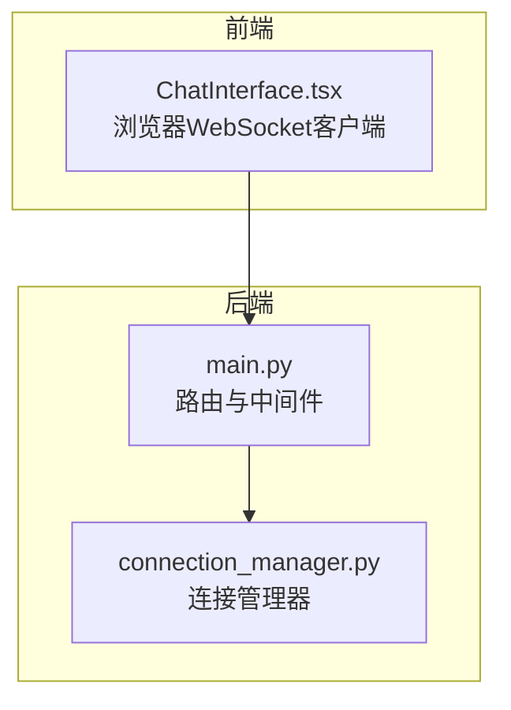
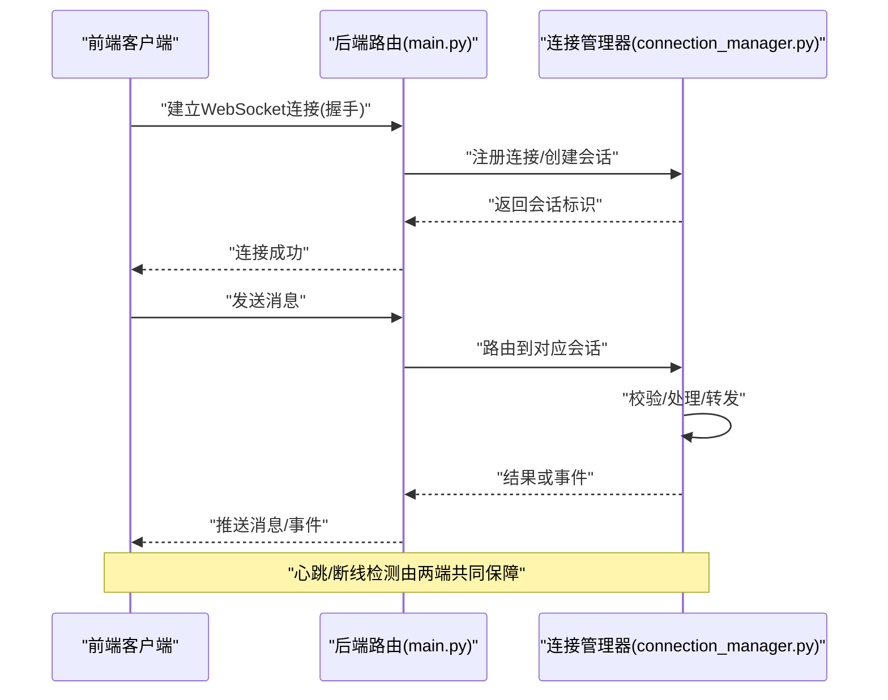
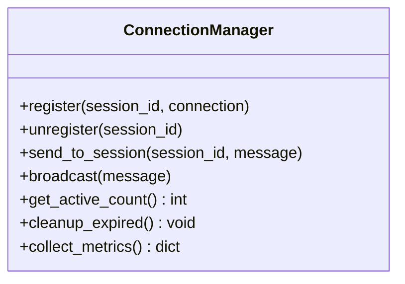
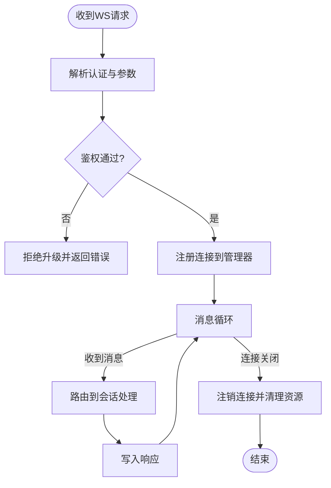
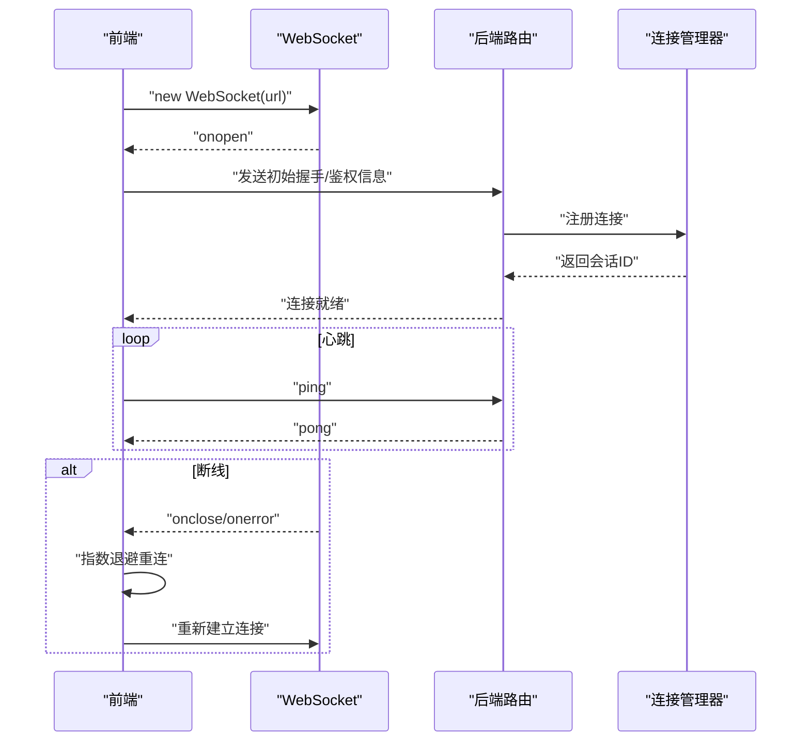
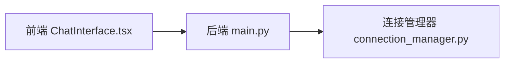

# WebSocket连接管理

<cite>
**本文引用的文件**   
- [backend/app/services/connection_manager.py](file://backend/app/services/connection_manager.py)
- [backend/app/main.py](file://backend/app/main.py)
- [frontend/src/components/ChatInterface.tsx](file://frontend/src/components/ChatInterface.tsx)
</cite>

## 目录
1. [简介](#简介)
2. [项目结构](#项目结构)
3. [核心组件](#核心组件)
4. [架构总览](#架构总览)
5. [详细组件分析](#详细组件分析)
6. [依赖关系分析](#依赖关系分析)
7. [性能考量](#性能考量)
8. [故障排查指南](#故障排查指南)
9. [结论](#结论)
10. [附录](#附录)

## 简介
本技术文档聚焦于后端WebSocket连接管理与前端连接实现，围绕以下目标展开：
- 连接建立流程与会话状态管理
- 连接池设计与资源分配策略
- 断线检测、自动重连与心跳机制
- 多用户并发处理与连接生命周期管理
- 内存泄漏防护、监控指标与故障恢复
- 客户端连接示例与调试技巧、常见问题排查

## 项目结构
本项目采用前后端分离架构。后端基于Python服务提供WebSocket接口，并通过连接管理器维护会话；前端通过浏览器WebSocket API与服务端交互。

图表来源
- [backend/app/main.py](file://backend/app/main.py)
- [backend/app/services/connection_manager.py](file://backend/app/services/connection_manager.py)
- [frontend/src/components/ChatInterface.tsx](file://frontend/src/components/ChatInterface.tsx)

章节来源
- [backend/app/main.py](file://backend/app/main.py)
- [backend/app/services/connection_manager.py](file://backend/app/services/connection_manager.py)
- [frontend/src/components/ChatInterface.tsx](file://frontend/src/components/ChatInterface.tsx)

## 核心组件
- 连接管理器（ConnectionManager）
  - 职责：维护活跃连接集合、按会话ID索引、广播消息、清理离线连接、统计指标采集。
  - 关键能力：线程安全访问、超时检测、批量发送、错误隔离。
- 路由层（main.py）
  - 职责：暴露WebSocket端点、鉴权与上下文注入、转发至连接管理器。
- 前端客户端（ChatInterface.tsx）
  - 职责：发起连接、消息收发、断线重连、心跳保活、UI状态同步。

章节来源
- [backend/app/services/connection_manager.py](file://backend/app/services/connection_manager.py)
- [backend/app/main.py](file://backend/app/main.py)
- [frontend/src/components/ChatInterface.tsx](file://frontend/src/components/ChatInterface.tsx)

## 架构总览
整体数据流从前端发起WebSocket握手开始，经后端路由进入连接管理器，再由业务逻辑处理并回写响应。连接管理器负责会话映射、消息分发与资源回收。

图表来源
- [backend/app/main.py](file://backend/app/main.py)
- [backend/app/services/connection_manager.py](file://backend/app/services/connection_manager.py)
- [frontend/src/components/ChatInterface.tsx](file://frontend/src/components/ChatInterface.tsx)

## 详细组件分析

### 连接管理器（后端）
- 设计要点
  - 连接池：以会话ID为键的活跃连接表，支持快速查找与广播。
  - 并发安全：对共享状态加锁或使用异步原语保护。
  - 资源回收：在连接关闭时移除引用、释放缓冲与定时器。
  - 指标收集：记录连接数、消息吞吐、延迟分布等。
- 典型方法
  - 注册/注销连接
  - 按会话发送/广播
  - 心跳检测与超时清理
  - 错误隔离与重试边界

图表来源
- [backend/app/services/connection_manager.py](file://backend/app/services/connection_manager.py)

章节来源
- [backend/app/services/connection_manager.py](file://backend/app/services/connection_manager.py)

### 路由层（后端）
- 职责
  - 暴露WebSocket路径
  - 解析请求头/查询参数，提取会话信息
  - 调用连接管理器完成注册/注销
  - 将消息转发给连接管理器并回写响应
- 注意事项
  - 鉴权失败应拒绝升级协议
  - 异常需捕获并关闭连接，避免泄露

图表来源
- [backend/app/main.py](file://backend/app/main.py)
- [backend/app/services/connection_manager.py](file://backend/app/services/connection_manager.py)

章节来源
- [backend/app/main.py](file://backend/app/main.py)
- [backend/app/services/connection_manager.py](file://backend/app/services/connection_manager.py)

### 前端客户端（浏览器）
- 职责
  - 建立WebSocket连接
  - 发送/接收消息
  - 心跳保活与断线重连
  - UI状态同步与错误提示
- 重连策略
  - 指数退避+抖动，限制最大重试次数
  - 网络不可用时暂停重连，恢复后继续
- 心跳
  - 周期性发送ping，服务端pong确认
  - 超时未pong则判定断线并触发重连

图表来源
- [frontend/src/components/ChatInterface.tsx](file://frontend/src/components/ChatInterface.tsx)
- [backend/app/main.py](file://backend/app/main.py)
- [backend/app/services/connection_manager.py](file://backend/app/services/connection_manager.py)

章节来源
- [frontend/src/components/ChatInterface.tsx](file://frontend/src/components/ChatInterface.tsx)
- [backend/app/main.py](file://backend/app/main.py)
- [backend/app/services/connection_manager.py](file://backend/app/services/connection_manager.py)

## 依赖关系分析
- 模块耦合
  - 路由层依赖连接管理器进行会话管理
  - 前端仅依赖标准WebSocket API，不直接依赖后端内部实现
- 外部依赖
  - 浏览器WebSocket运行时
  - 后端HTTP/WS框架（用于路由与协议升级）

图表来源
- [frontend/src/components/ChatInterface.tsx](file://frontend/src/components/ChatInterface.tsx)
- [backend/app/main.py](file://backend/app/main.py)
- [backend/app/services/connection_manager.py](file://backend/app/services/connection_manager.py)

章节来源
- [frontend/src/components/ChatInterface.tsx](file://frontend/src/components/ChatInterface.tsx)
- [backend/app/main.py](file://backend/app/main.py)
- [backend/app/services/connection_manager.py](file://backend/app/services/connection_manager.py)

## 性能考量
- 连接池规模
  - 控制单进程最大连接数，避免文件描述符耗尽
  - 使用非阻塞I/O与异步事件循环提升吞吐
- 消息批处理
  - 合并小消息批量发送，降低系统调用开销
- 内存管理
  - 及时释放消息缓冲区与定时器句柄
  - 避免闭包持有大对象导致GC压力
- 指标与观测
  - 采集活跃连接数、消息速率、P95/P99延迟、错误率
  - 结合日志与分布式追踪定位热点

[本节为通用指导，无需代码来源]

## 故障排查指南
- 常见症状
  - 频繁断线重连
  - 消息丢失或乱序
  - 内存持续增长
- 排查步骤
  - 检查心跳间隔与超时阈值是否合理
  - 查看连接管理器中会话数量与清理频率
  - 核对前端重连退避策略与最大重试次数
  - 观察后端错误日志与指标告警
- 建议工具
  - 浏览器开发者工具的网络面板
  - 后端结构化日志与指标导出

章节来源
- [backend/app/services/connection_manager.py](file://backend/app/services/connection_manager.py)
- [frontend/src/components/ChatInterface.tsx](file://frontend/src/components/ChatInterface.tsx)

## 结论
通过清晰的分层设计与严格的资源管理，WebSocket连接可实现高可靠、可扩展的多用户实时通信。关键在于：
- 明确的连接生命周期与状态机
- 健壮的心跳与重连策略
- 完善的指标与可观测性
- 严格的错误隔离与资源回收

[本节为总结，无需代码来源]

## 附录

### 客户端连接示例（参考路径）
- 前端示例位置：[frontend/src/components/ChatInterface.tsx](file://frontend/src/components/ChatInterface.tsx)
- 后端路由入口位置：[backend/app/main.py](file://backend/app/main.py)
- 连接管理实现位置：[backend/app/services/connection_manager.py](file://backend/app/services/connection_manager.py)

章节来源
- [frontend/src/components/ChatInterface.tsx](file://frontend/src/components/ChatInterface.tsx)
- [backend/app/main.py](file://backend/app/main.py)
- [backend/app/services/connection_manager.py](file://backend/app/services/connection_manager.py)